# Markdown Best Practices Guide

> A comprehensive guide to writing maintainable, accessible, and high-quality Markdown documentation.

---

## Table of Contents

1. [File Organization Best Practices](#file-organization-best-practices)
2. [Naming Conventions](#naming-conventions)
3. [Heading Hierarchy](#heading-hierarchy)
4. [Line Length and Wrapping](#line-length-and-wrapping)
5. [Code Block Usage](#code-block-usage)
6. [Image Optimization for Docs](#image-optimization-for-docs)
7. [Link Maintenance](#link-maintenance)
8. [Inclusive Language](#inclusive-language)
9. [Accessibility in Documentation](#accessibility-in-documentation)
10. [Internationalization Considerations](#internationalization-considerations)
11. [Version Control for Docs](#version-control-for-docs)
12. [Review Processes](#review-processes)
13. [Style Guides](#style-guides)
14. [Documentation Testing](#documentation-testing)
15. [Consistency Patterns](#consistency-patterns)
16. [Mermaid Diagram Best Practices](#mermaid-diagram-best-practices)
17. [Technical Writing Best Practices](#technical-writing-best-practices)
18. [SEO for Documentation](#seo-for-documentation)
19. [Search Optimization](#search-optimization)
20. [Documentation Maintenance](#documentation-maintenance)

---

## File Organization Best Practices

### Directory Structure Principles

A well-organized documentation repository follows predictable patterns. The goal is to make it intuitive for both humans and tools to navigate.

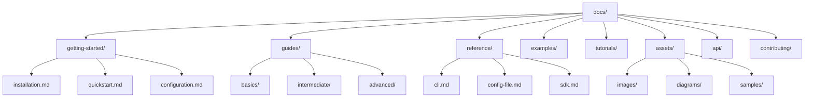

### Recommended Directory Structure

```
docs/
├── index.md                    # Landing page / Table of contents
├── getting-started/            # Onboarding content
│   ├── index.md
│   ├── installation.md
│   ├── quickstart.md
│   └── configuration.md
├── guides/                     # How-to guides
│   ├── basics/
│   ├── intermediate/
│   └── advanced/
├── tutorials/                  # Step-by-step tutorials
│   ├── beginner/
│   ├── intermediate/
│   └── advanced/
├── reference/                  # Reference documentation
│   ├── cli.md
│   ├── api.md
│   ├── config.md
│   └── glossary.md
├── examples/                   # Code examples
│   ├── basic/
│   ├── intermediate/
│   └── advanced/
├── concepts/                   # Conceptual documentation
│   ├── architecture.md
│   ├── security.md
│   └── best-practices.md
├── contributing/               # Contribution guidelines
│   ├── code-of-conduct.md
│   ├── style-guide.md
│   └── development.md
├── api/                        # Auto-generated API docs
│   ├── v1/
│   └── v2/
├── blog/                       # Changelog / blog posts
│   ├── 2024-01-release.md
│   └── 2024-02-release.md
├── assets/                     # Static assets
│   ├── images/
│   ├── diagrams/
│   ├── videos/
│   └── samples/
├── _templates/                 # Document templates
│   ├── guide.md
│   ├── tutorial.md
│   └── reference.md
├── _includes/                  # Reusable content snippets
│   ├── footer.md
│   └── license.md
├── .markdownlint.json          # Linter configuration
├── .spelling                   # Dictionary for spell check
└── README.md                   # Repository README
```

### Flat vs Nested Structure

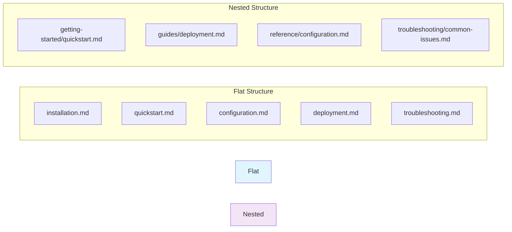

**When to use flat structure:**
- Small documentation sites (< 20 pages)
- Simple projects with minimal documentation
- Internal team wikis
- Single-page documentation

**When to use nested structure:**
- Large documentation sites (100+ pages)
- Multi-version documentation
- Products with multiple components
- Open-source projects
- Enterprise documentation

### File Organization Rules

1. **One concept per file**: Each file should cover one topic or concept
2. **Index files**: Every directory should have an `index.md`
3. **Depth limit**: Maximum 3 levels of nesting
4. **Predictable paths**: URLs should reflect the content hierarchy
5. **Asset proximity**: Keep images close to the documents that reference them

**Example of proper file organization:**

```markdown
# docs/guides/basics/getting-started-with-markdown.md

## Introduction

This guide covers the fundamentals of Markdown syntax for technical writers.

## Prerequisites

Before starting, ensure you have:
- A text editor (VS Code recommended)
- Basic understanding of plain text formatting
- Node.js installed (for tooling)
```

---

## Naming Conventions

### File Naming Rules

Consistent file naming is crucial for maintainability, SEO, and developer experience.

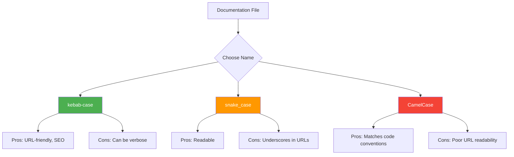

### Recommended Convention: Kebab-case

```
# ✅ Good - Kebab-case
getting-started-with-markdown.md
advanced-formatting-techniques.md
api-reference-guide.md

# ❌ Bad - Spaces
getting started with markdown.md

# ❌ Bad - Mixed case
GettingStartedWithMarkdown.md

# ❌ Bad - Underscores
getting_started_with_markdown.md

# ❌ Bad - Special characters
getting-started-(final).md
```

### Numbering Schemes

For ordered content, use consistent numbering:

```markdown
# ✅ Sequential numbering for tutorials
01-introduction.md
02-basic-syntax.md
03-advanced-syntax.md
04-extended-syntax.md
05-tools-and-workflows.md

# ✅ Version-based naming
v1-installation.md
v2-installation.md
v3-installation.md

# ❌ Inconsistent numbering
part-1.md
chapter-2.md
section-three.md
```

### Asset Naming

```markdown
# ✅ Descriptive image names
screenshot-dashboard-overview.png
diagram-authentication-flow.svg
icon-settings-gear.png

# ✅ Consistent pattern: {type}-{subject}-{description}.{ext}
screenshot-settings-dark-mode.png
diagram-network-topology-v2.png
photo-team-hackathon-2024.jpg

# ❌ Generic names
image1.png
screenshot.png
diagram-final-v3-final.png
pic.jpg
```

### Versioning in Filenames

```markdown
# ✅ Versioned API docs
api-v1-users.md
api-v1-products.md
api-v2-users.md
api-v2-products.md

# ❌ Ambiguous versioning
api-new.md
api-old.md
api-final.md
```

---

## Heading Hierarchy

### The Golden Rule: One H1 Per Document

Every Markdown document should have exactly one H1 (`# Title`) heading. This is crucial for:

- **Accessibility**: Screen readers use H1 to identify the main topic
- **SEO**: Search engines treat H1 as the primary subject
- **Structure**: Provides a clear root for the document hierarchy
- **Navigation**: Table of contents generation depends on proper hierarchy

```markdown
# ✅ Correct: Single H1
# Getting Started with Project X
## Installation
### Linux Installation
### macOS Installation
## Configuration
## Usage

# ❌ Incorrect: Multiple H1s
# Getting Started with Project X
# Installation  <-- Should be H2
# Configuration  <-- Should be H2
# Usage  <-- Should be H2

# ❌ Incorrect: Skipping levels
# Getting Started
### Installation  <-- Skipped H2
### Configuration  <-- Skipped H2
```

### Heading Hierarchy Rules

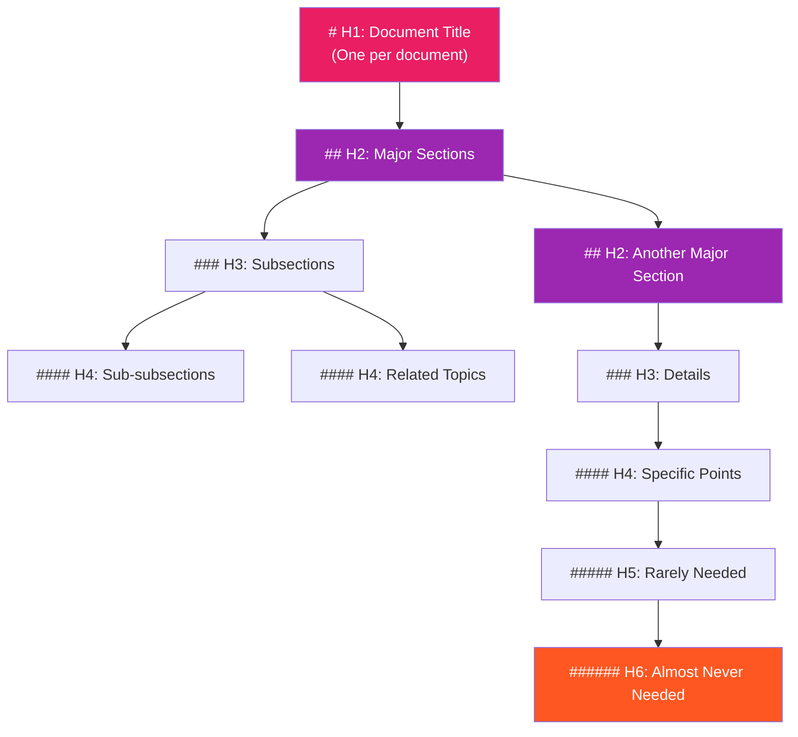

### Heading Hierarchy Rules

1. **Never skip levels**: Don't jump from H2 to H4
2. **Maintain semantic meaning**: H2s are major sections, H3s are subsections
3. **Limit depth**: Try not to go deeper than H4
4. **Keep headings descriptive**: Use meaningful titles
5. **Use parallel structure**: Consistent grammatical form

```markdown
# ✅ Proper hierarchy
# Advanced Configuration
## Environment Variables
### Database Configuration
### Cache Configuration
## Security Settings
### Authentication
### Authorization
### Encryption

# ❌ Skipping levels
# Advanced Configuration
### Environment Variables  <-- Skipped H2
#### Database Configuration  <-- Wrong level for this content
## Security Settings  <-- Inconsistent
```

### Heading Length Guidelines

```markdown
# ✅ Descriptive but concise
# Configuration Reference
## Environment Variables
## Command-Line Flags
## Configuration File

# ❌ Too short (vague)
# Config
## Env
## CLI

# ❌ Too long
# A Comprehensive Guide to Configuring All Available Environment Variables and Their Default Values for Optimal System Performance in Production Environments
```

### Heading SEO Best Practices

```markdown
# ✅ SEO-friendly headings
# How to Install and Configure PostgreSQL on Ubuntu 22.04
## Prerequisites for PostgreSQL Installation
## Step-by-Step PostgreSQL Installation Guide
## PostgreSQL Configuration Best Practices
## Troubleshooting Common PostgreSQL Issues

# ❌ Poor SEO headings
# Part 1
## Stuff You Need
## How to Do It
## Configuration
## Problems
```

---

## Line Length and Wrapping

### The 80-Character Rule

The industry standard for Markdown documents is to wrap lines at 80 characters. This practice originates from terminal width limitations but remains relevant for several reasons:

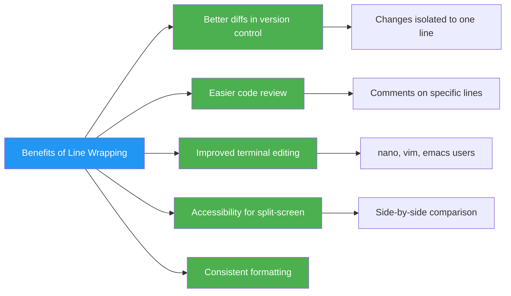

### Hard Wrapping vs Soft Wrapping

**Hard wrapping** (recommended for source files):
```markdown
# Hard-wrapped at 80 characters
This is an example of hard-wrapped text. Each line is manually broken
at around 80 characters. This makes git diffs much cleaner because a
single change to one sentence only affects one or two lines instead of
the entire paragraph.
```

**Soft wrapping** (acceptable for content-focused workflows):
```markdown
# Soft wrapping - One line per paragraph
This is an example of soft-wrapped text. The entire paragraph is on a single line. In your editor, it wraps visually, but in the source file, it's one long line. This works well for blogs and content management systems but creates terrible git diffs because changing one word affects the entire line.
```

### The "One Sentence Per Line" Approach

An increasingly popular alternative is to put each sentence on its own line:

```markdown
# One sentence per line
This approach combines the benefits of hard wrapping with natural breaks.
Each sentence becomes its own line in the source file.
Git diffs become extremely precise when editing.
Code reviews can comment on individual sentences.
The approach works well with semantic linefeeds.
```

### Git Diff Comparison

```diff
# ❌ Without line wrapping (soft wrapping)
- This is a paragraph that needed some changes. It was originally written as one continuous line and now the entire paragraph appears as changed in the diff even though only a few words were modified.
+ This is a paragraph that has been updated. It was originally written as one continuous line and now the entire paragraph appears as changed in the diff even though only a few words were modified. Here is an additional sentence.

# ✅ With line wrapping (hard wrapping)
- This is a paragraph that needed some changes. It was originally
- written as one continuous line and now only the changed lines
- appear in the diff.
+ This is a paragraph that has been updated. It was originally
+ written as one continuous line and now only the changed lines
+ appear in the diff. Here is an additional sentence.
```

### Configuration for Common Editors

**VS Code settings.json:**
```json
{
  "editor.rulers": [80],
  "editor.wordWrap": "off",
  "editor.wordWrapColumn": 80,
  "[markdown]": {
    "editor.wordWrap": "wordWrapColumn",
    "editor.wordWrapColumn": 80,
    "editor.quickSuggestions": {
      "comments": "off",
      "strings": "off",
      "other": "off"
    }
  }
}
```

**Vim / Neovim:**
```vim
" Vim configuration for Markdown
autocmd FileType markdown setlocal textwidth=80
autocmd FileType markdown setlocal wrapmargin=0
autocmd FileType markdown setlocal formatoptions=tcqln
autocmd FileType markdown setlocal linebreak
```

**Emacs:**
```elisp
;; Emacs configuration for Markdown
(add-hook 'markdown-mode-hook
  (lambda ()
    (setq fill-column 80)
    (setq auto-fill-mode 1)))
```

### Exceptions to Line Wrapping

```markdown
# When NOT to wrap lines

# 1. Code blocks should preserve their own formatting
```javascript
// This is a long line of code that should NOT be wrapped
const result = veryLongFunctionName(param1, param2, param3).then(response => response.data.map(item => item.transform()));
```# ` <- This is intentionally broken for rendering

# 2. URLs and links should not be broken
  Reference: https://very-long-url.com/with/many/path/segments?query=parameters&are=present

# 3. Tables should maintain their structure
| Column | Description |
|--------|-------------|
| param  | A very long description that goes beyond 80 characters but must stay on one line in the table |
```

---

## Code Block Usage

### When to Use Inline Code vs Fenced Code Blocks

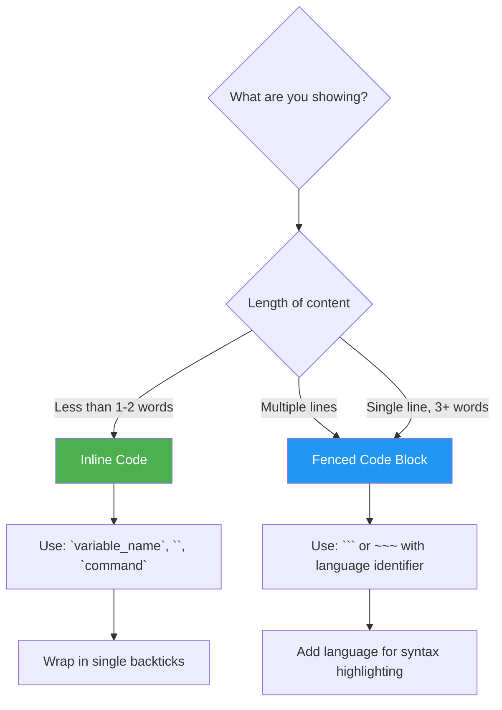

### Inline Code Usage

```markdown
# ✅ Correct inline code usage
Use the `npm install` command to install dependencies.
The variable `userName` should be a string.
Set the `--port` flag to specify the server port.

# ❌ Incorrect inline code usage
The `npm` `install` `command` `is` `used` `to` `install` `dependencies`.
Use <code>this</code> approach (HTML in Markdown).
```

### Fenced Code Blocks with Language Identifiers

Always specify the language for syntax highlighting:

````markdown
# ✅ With language identifier
```javascript
function greet(name) {
  return `Hello, ${name}!`;
}
```

# ✅ With additional parameters
```javascript {.numberLines startFrom=10}
function greet(name) {
  return `Hello, ${name}!`;
}
```

# ✅ Using three or more backticks
```python
def greet(name):
    return f"Hello, {name}!"
```

# ❌ No language identifier
```
function greet(name) {
  return `Hello, ${name}!`;
}
```
````

### Code Block Content Guidelines

```markdown
# ✅ Complete, runnable examples
```python
# A complete, runnable example
def calculate_fibonacci(n):
    if n <= 1:
        return n
    return calculate_fibonacci(n-1) + calculate_fibonacci(n-2)

# Test the function
result = calculate_fibonacci(10)
print(f"Fibonacci(10) = {result}")  # Output: Fibonacci(10) = 55
```


# ✅ Showing expected output
```bash
# Command
$ node --version
v20.11.0
```

```bash
# ✅ Command with comment
$ npm run build -- --production
```

# ✅ Diff blocks
```diff
function greet(name) {
-   return "Hello, " + name;
+   return `Hello, ${name}!`;
}
```
```

### Code Block Best Practices

1. **Always specify the language** for syntax highlighting
2. **Show complete examples** when possible
3. **Include expected output** for commands
4. **Use comments** to explain complex code
5. **Keep lines short** (under 80 chars in code blocks too)
6. **Use filename annotations** when supported

### File Path Annotations

```markdown
# Showing file paths with code blocks
```javascript
// src/utils/helpers.js
export function formatDate(date) {
  return new Intl.DateTimeFormat('en-US').format(date);
}
```

# Some renderers support file path metadata
```javascript title="src/utils/helpers.js"
export function formatDate(date) {
  return new Intl.DateTimeFormat('en-US').format(date);
}
```
```

### Terminal Commands

```markdown
# ✅ Clear command delineation
```bash
# Install dependencies
$ npm install

# Build the project
$ npm run build

# Start development server
$ npm run dev
```

# ✅ Showing output separately
Command:
```bash
$ echo "Hello, World!"
```

Output:
```
Hello, World!
```
```

### Code Block Accessibility

```markdown
# ✅ Provide context before code blocks
The following function calculates the factorial of a number
using recursion:

```python
def factorial(n):
    if n == 0:
        return 1
    return n * factorial(n - 1)
```

This function has a base case of `n == 0` and recursively calls itself
for all positive integers.

# ❌ Code block without context
```python
def factorial(n):
    if n == 0:
        return 1
    return n * factorial(n - 1)
```
```

---

## Image Optimization for Docs

### Image Formats and Use Cases

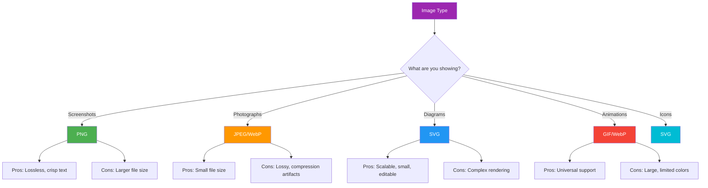

### Image Optimization Techniques

**1. Compression tools:**

```bash
# PNG optimization with optipng
$ optipng -o7 screenshot.png

# PNG optimization with pngquant
$ pngquant --quality=80 --output=screenshot-compressed.png screenshot.png

# JPEG optimization with jpegoptim
$ jpegoptim --max=85 photo.jpg

# SVG optimization with svgo
$ svgo diagram.svg

# WebP conversion
$ cwebp -q 80 screenshot.png -o screenshot.webp
```

**2. Resolution and sizing:**

```markdown
# ✅ Properly sized images

<!-- Target: 800px wide, 72 DPI for web -->

# ✅ Using width attribute (HTML fallback)


# ❌ Oversized images

<!-- 3840x2160 image served at full resolution -->
```

### Image File Size Targets

| Format | Target Size | Use Case |
|--------|-------------|----------|
| PNG | < 200 KB | Screenshots, UI elements |
| JPEG | < 100 KB | Photos, gradients |
| SVG | < 50 KB | Diagrams, icons |
| GIF | < 500 KB | Short animations |
| WebP | < 80 KB | Modern alternative to JPEG/PNG |

### Alt Text Guidelines

```markdown
# ✅ Descriptive alt text


# ✅ Alt text for diagrams


# ✅ Functional alt text for screenshots


# ❌ Missing or poor alt text


```

### Image Directory Organization

```markdown
assets/
├── images/
│   ├── getting-started/
│   │   ├── installation-screenshot.png
│   │   └── quickstart-result.png
│   ├── guides/
│   │   ├── configuration-editor.png
│   │   └── deployment-pipeline.png
│   ├── reference/
│   │   ├── api-docs-view.png
│   │   └── cli-help-output.png
│   └── shared/
│       ├── logo.svg
│       ├── favicon.ico
│       └── social-preview.png
├── diagrams/
│   ├── architecture.svg
│   ├── data-flow.svg
│   └── network-topology.svg
└── videos/
    ├── getting-started.mp4
    └── advanced-features.mp4
```

### Responsive Images

For more advanced setups, use HTML for responsive images:

```html
<!-- Responsive image with srcset -->
<picture>
  <source media="(min-width: 1024px)" srcset="./assets/images/dashboard-full.png">
  <source media="(min-width: 768px)" srcset="./assets/images/dashboard-tablet.png">
  <source media="(min-width: 320px)" srcset="./assets/images/dashboard-mobile.png">
  
</picture>
```

### Lazy Loading

```html
<!-- Native lazy loading for images -->


<!-- Eager loading for critical images -->

```

### Image Naming Conventions

```markdown
# ✅ Descriptive, consistent naming
screenshot-dashboard-dark-mode-v2.png
diagram-authentication-flow-updated.svg
icon-settings-gear-24px.svg

# Pattern: {type}-{subject}-{context}-{version}.{ext}
# Types: screenshot, diagram, icon, photo, illustration
# Versions: v1, v2, or omit for first version
```

---

## Link Maintenance

### Link Types and Strategies

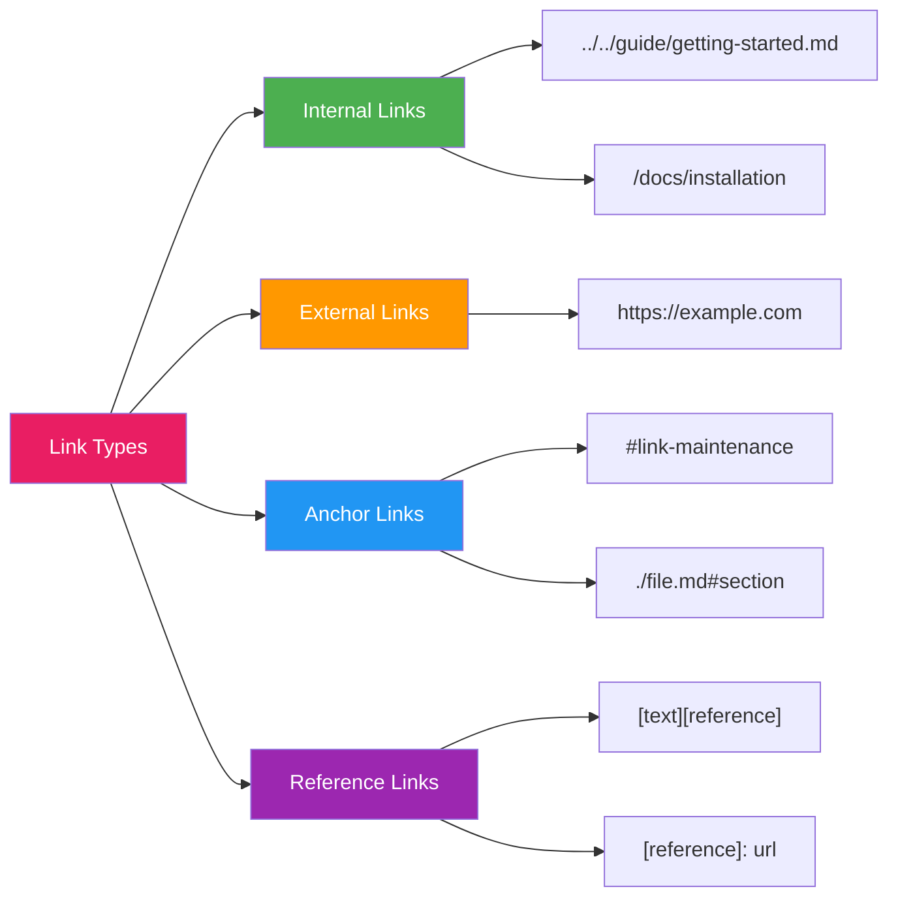

### Internal Linking Best Practices

```markdown
# ✅ Use relative paths for internal links
See the [Installation Guide](../getting-started/installation.md) for details.
Refer to the [Configuration Reference](./reference/configuration.md).

# ✅ Use anchor links within the same document
As discussed in the [Heading Hierarchy](#heading-hierarchy) section...

# ✅ Cross-reference with descriptive text
For more information about deployment, check the
[Deployment Guide](../guides/deployment.md).

# ❌ Vague link text
Click [here](../getting-started/installation.md) for installation instructions.
See [this](../reference/configuration.md) for configuration.
```

### External Link Strategies

```markdown
# ✅ Use descriptive link text for external links
For the official Markdown specification, visit
[CommonMark Spec](https://spec.commonmark.org/current/).

# ✅ Add rel attributes for external links (HTML)
<a href="https://example.com" target="_blank" rel="noopener noreferrer">
  External Resource
</a>

# ✅ Use link verification in CI
# .github/workflows/link-check.yml
name: Check Links
on: [push, pull_request]
jobs:
  link-check:
    runs-on: ubuntu-latest
    steps:
      - uses: actions/checkout@v4
      - name: Link Checker
        uses: lycheeverse/lychee-action@v1
        with:
          args: --verbose --no-progress './**/*.md'
```

### Reference-Style Links

Reference links improve readability and maintainability:

```markdown
# ✅ Reference links for readability
The [Markdown Guide] provides comprehensive documentation. For specific
syntax questions, the [CommonMark Spec] is the authoritative source.
Additional information is available in the [GitHub Flavored Markdown Spec].

[Markdown Guide]: https://www.markdownguide.org
[CommonMark Spec]: https://spec.commonmark.org/current/
[GitHub Flavored Markdown Spec]: https://github.github.com/gfm/
```

### Link Maintenance Checklist

```markdown
# Link Maintenance Schedule

## Monthly Tasks
- [ ] Run automated link checker
- [ ] Fix broken internal links
- [ ] Update redirected external links
- [ ] Check anchor links still work

## Quarterly Tasks
- [ ] Audit external link relevance
- [ ] Update version-specific links
- [ ] Review link text quality
- [ ] Remove deprecated links

## Annual Tasks
- [ ] Full link inventory
- [ ] Archive outdated resources
- [ ] Update all link references
- [ ] Review linking strategy
```

### Automated Link Checking

```bash
# Using lychee (Rust-based link checker)
$ lychee --verbose --no-progress --format markdown ./docs/**/*.md

# Using markdown-link-check (Node.js)
$ npx markdown-link-check ./docs/**/*.md

# Using broken-link-checker (Node.js)
$ npx broken-link-checker --recursive ./docs/

# Using htmltest
$ htmltest ./public/
```

### Link Health Dashboard

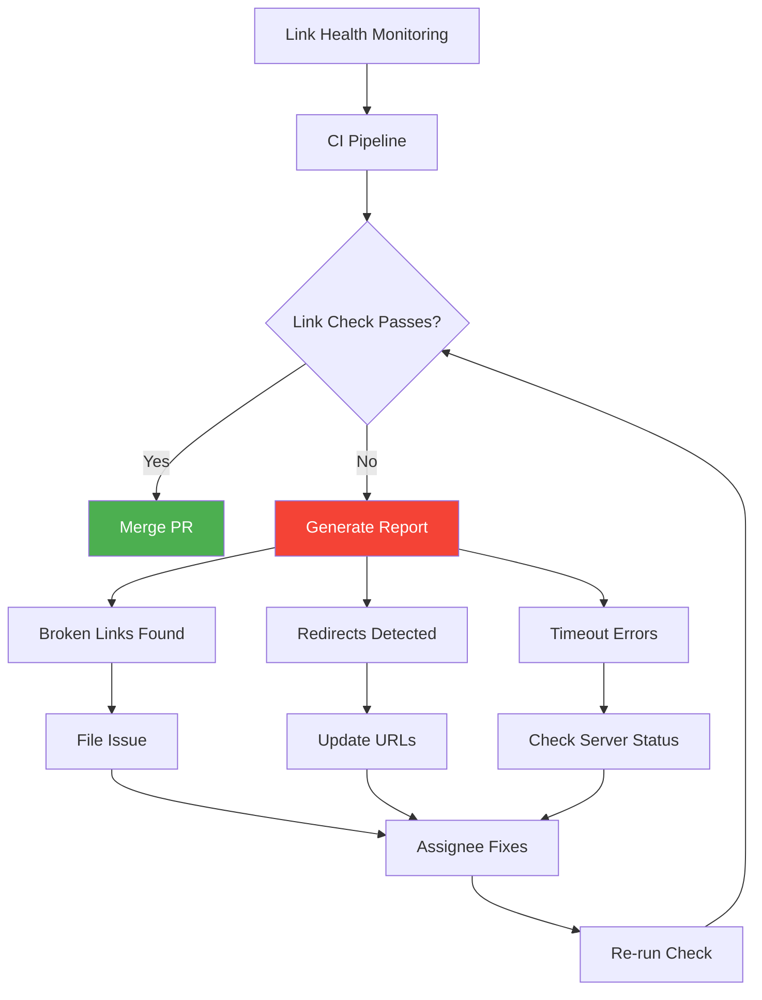

---

## Inclusive Language

### The Importance of Inclusive Documentation

Inclusive language ensures that documentation is accessible and respectful to all readers regardless of their background, identity, or abilities.

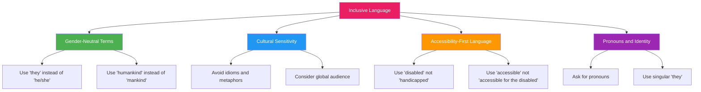

### Gender-Neutral Language

```markdown
# ✅ Gender-neutral alternatives
The user can configure their own settings.
Each developer should update their local environment.
The administrator must check their email.

# ❌ Gendered language
The user can configure his own settings.
Each developer should update his local environment.
The administrator must check his email.

# ✅ Preferred terms
- "They" as singular pronoun
- "Server" or "worker" instead of "master/slave"
- "Primary/Secondary" instead of "master/slave"
- "Allowlist/Blocklist" instead of "whitelist/blacklist"
- "Parent/Main" instead of "master" (in git contexts)
- "Chairperson" instead of "chairman"
- "Humankind" instead of "mankind"
```

### Culturally Sensitive Language

```markdown
# ✅ Culturally inclusive examples
Imagine you're building a shopping cart application...
The users of this API come from diverse backgrounds...
Consider time zones when scheduling international meetings...

# ❌ Culturally specific references
Imagine you're tailgating before a football game... (US-specific)
This is as easy as making a cup of tea... (UK-specific)
This works like chopsticks... (Assuming cultural knowledge)
```

### Disability-Inclusive Language

```markdown
# ✅ Person-first language
Users who are blind can use screen readers.
A person with visual impairment may need high-contrast themes.
Users with mobility impairments can use keyboard navigation.

# ✅ Functional language
Users using screen readers...
People with cognitive disabilities...
Users with limited color vision...

# ❌ Problematic language
The blind user...
Handicapped accessible...
Suffers from disability...
Confined to a wheelchair...
```

### Inclusive Code Examples

```markdown
# ✅ Inclusive code examples
```javascript
// Gender-neutral naming
const user = await getUser();
const userProfile = await getProfile(user.id);

// Cultural-neutral placeholder text
const DEFAULT_DISPLAY_NAME = "User";
const placeholderName = "user@example.com";

// Avoiding ableist terms
// "main" instead of "master" for git branches
// "primary" instead of "master" for databases
// "worker" instead of "slave" for server roles
```


# ❌ Non-inclusive code examples
```javascript
// Problematic variable names
const masterConfig = {...};  // Using "master"
const slaveServer = {...};   // Using "slave"

// Ableist terms in comments
// This is crazy simple...
// Just kill the process...
// This is dumb...
```
```

### Inclusive Language Checklist

```markdown
## Inclusive Language Checklist

### Gender and Identity
- [ ] Use gender-neutral terms (they/them)
- [ ] Avoid assuming gender roles
- [ ] Use inclusive pronouns
- [ ] Avoid "-man" suffixed roles (firefighter, not fireman)

### Culture and Geography
- [ ] Avoid idioms and colloquialisms
- [ ] Use international date/time formats
- [ ] Specify time zones explicitly
- [ ] Avoid country-specific references

### Ability and Accessibility
- [ ] Use person-first language
- [ ] Avoid ableist terminology
- [ ] Include accessibility considerations
- [ ] Mention screen reader compatibility

### Socioeconomic Status
- [ ] Avoid assuming access to resources
- [ ] Consider low-bandwidth users
- [ ] Mention free/open-source alternatives
- [ ] Avoid cost assumptions
```

---

## Accessibility in Documentation

### Why Accessibility Matters

Documentation accessibility ensures that people with disabilities can equally access and understand your content.

```mermaid
graph TD
    A[Documentation Accessibility] --> B[Screen Readers]
    A --> C[Visual Accessibility]
    A --> D[Cognitive Accessibility]
    A --> E[Motor Accessibility]
    A --> F[Hearing Accessibility]

    B --> B1[Proper heading hierarchy]
    B --> B2[Descriptive alt text]
    B --> B3[Meaningful link text]

    C --> C1[High contrast]
    C --> C2[Color not sole indicator]
    C --> C3[Font size and readability]

    D --> D1[Clear language]
    D --> D2[Consistent layout]
    D --> D3[Chunking information]

    E --> E1[Keyboard navigable]
    E --> E2[Skip links]
    E --> E3[Clear focus indicators]

    F --> F1[Transcripts for video]
    F --> F2[Captions for audio]

    style A fill:#4caf50,color:white
    style B fill:#2196f3,color:white
    style C fill:#ff9800,color:white
    style D fill:#9c27b0,color:white
    style E fill:#e91e63,color:white
    style F fill:#00bcd4,color:white
```

### WCAG Guidelines for Documentation

| WCAG Principle | Guideline | Documentation Implementation |
|---------------|-----------|-----------------------------|
| Perceivable | 1.1 Text Alternatives | Alt text for all images |
| Perceivable | 1.2 Time-based Media | Captions and transcripts |
| Perceivable | 1.3 Adaptable | Proper heading structure |
| Perceivable | 1.4 Distinguishable | Sufficient color contrast |
| Operable | 2.1 Keyboard Accessible | Navigable ToC |
| Operable | 2.2 Enough Time | No time limits on reading |
| Operable | 2.3 Seizures | No flashing content |
| Operable | 2.4 Navigable | Skip links, breadcrumbs |
| Understandable | 3.1 Readable | Plain language |
| Understandable | 3.2 Predictable | Consistent navigation |
| Understandable | 3.3 Input Assistance | Error prevention in forms |
| Robust | 4.1 Compatible | Valid HTML/Markdown |

### Heading Structure for Screen Readers

```markdown
# ✅ Screen reader-friendly structure
# Page Title (H1)
## Major Section (H2)
### Subsection (H3)
Detailed content here...
### Another Subsection (H3)
More content...
## Another Major Section (H2)

# ❌ Screen reader-hostile structure
# Page Title (H1)
### Subsection (H3)  <!-- Skipped H2 -->
Some content
## Another Major Section (H2)  <!-- Inconsistent -->
```

### Alt Text for Screen Readers

```markdown
# ✅ Informative alt text


# ✅ Decorative images (should be marked as such)

<!-- Or use empty alt for purely decorative images -->


# ❌ Unhelpful alt text


```

### Color and Contrast

```markdown
<!-- 
  Ensure sufficient color contrast:
  - Normal text: 4.5:1 minimum contrast ratio
  - Large text: 3:1 minimum contrast ratio
  - UI components: 3:1 minimum
-->

# ✅ Color used with additional indicators
<div class="status">
  <span class="status-indicator" style="color: green;">●</span>
  <span class="status-text">Server is running</span>
</div>
<div class="status">
  <span class="status-indicator" style="color: red;">●</span>
  <span class="status-text">Server is stopped</span>
</div>

# ❌ Color as sole indicator
<span style="color: green;">Server is running</span>
<span style="color: red;">Server is stopped</span>
```

### Accessible Tables

```markdown
# ✅ Accessible table structure
| Feature | Description | Status |
|---------|-------------|--------|
| User Authentication | Login and registration system | ✅ Complete |
| Data Export | Export to CSV and PDF formats | 🚧 In Progress |
| API Integration | REST API for third-party apps | 📋 Planned |

# ✅ Using scope attributes (HTML)
<table>
  <caption>Feature Development Status</caption>
  <thead>
    <tr>
      <th scope="col">Feature</th>
      <th scope="col">Description</th>
      <th scope="col">Status</th>
    </tr>
  </thead>
  <tbody>
    <tr>
      <th scope="row">User Authentication</th>
      <td>Login and registration system</td>
      <td>Complete</td>
    </tr>
  </tbody>
</table>
```

### Accessible Links

```markdown
# ✅ Descriptive link text
For installation instructions, see the [Installation Guide](/docs/installation).
Download the latest release from the [Downloads Page](/downloads).

# ✅ Links that make sense out of context
[Installation Guide for Windows](/docs/installation/windows)
[API Reference Documentation](/docs/api/v2)

# ❌ Non-descriptive link text
[Click here](/docs/installation) for installation instructions.
[This page](/downloads) has all the downloads.
[Link](/docs/api/v2) to API documentation.
```

### Skip Navigation Links

```html
<!-- Skip to main content link -->
<a href="#main-content" class="skip-link">Skip to main content</a>

<nav>
  <!-- Navigation content -->
</nav>

<main id="main-content">
  <h1>Documentation Title</h1>
  <!-- Main content -->
</main>
```

### Keyboard Navigation

```markdown
# Ensure keyboard navigability:
- All interactive elements are focusable
- Tab order follows visual order
- Focus indicators are visible
- No keyboard traps

# ✅ Clear focus indicators in CSS
/* Custom focus styles */
:focus-visible {
  outline: 2px solid #005fcc;
  outline-offset: 2px;
  border-radius: 2px;
}

/* Don't remove focus outlines */
:focus {
  outline: 2px solid #005fcc;
}
```

### Accessibility Testing Tools

```bash
# Automated accessibility testing
$ npx axe-core-cli ./docs/
$ npx pa11y-ci ./docs/

# Lighthouse CI for documentation
$ npx lhci collect --url https://docs.example.com
$ npx lhci assert --preset lighthouse:recommended

# HTML validation
$ npx html-validate ./public/

# Accessibility audit tools
# - WAVE browser extension
# - axe DevTools
# - Lighthouse
# - VoiceOver (macOS)
# - NVDA (Windows)
# - Orca (Linux)
```

### Accessibility Statement Template

```markdown
## Accessibility Statement

We are committed to making our documentation accessible to everyone.

### Accessibility Features
- Proper heading hierarchy for screen reader navigation
- Descriptive alt text for all images
- Sufficient color contrast throughout
- Keyboard-navigable interface
- Captions and transcripts for multimedia content

### Known Issues
- Some older PDFs may not be fully accessible
- Third-party embedded content may have limitations

### Feedback
If you encounter accessibility barriers, please contact us at
accessibility@example.com or file an issue on GitHub.

### Evaluation Methods
- Automated testing with axe-core
- Manual testing with VoiceOver and NVDA
- Regular accessibility audits
```

---

## Internationalization Considerations

### i18n Documentation Strategy

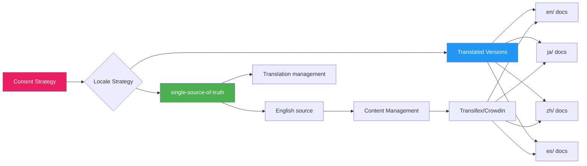

### Locale Directory Structure

```markdown
docs/
├── en/                    # English (source language)
│   ├── getting-started.md
│   ├── installation.md
│   └── configuration.md
├── ja/                    # Japanese
│   ├── getting-started.md
│   ├── installation.md
│   └── configuration.md
├── zh-CN/                 # Simplified Chinese
│   ├── getting-started.md
│   ├── installation.md
│   └── configuration.md
├── es/                    # Spanish
│   ├── getting-started.md
│   ├── installation.md
│   └── configuration.md
├── de/                    # German
│   ├── getting-started.md
│   ├── installation.md
│   └── configuration.md
├── fr/                    # French
│   ├── getting-started.md
│   ├── installation.md
│   └── configuration.md
├── pt-BR/                 # Brazilian Portuguese
│   ├── getting-started.md
│   ├── installation.md
│   └── configuration.md
├── ko/                    # Korean
│   ├── getting-started.md
│   ├── installation.md
│   └── configuration.md
└── i18n.json              # Translation management config
```

### Writing for Translation

```markdown
# ✅ Translation-friendly writing

Keep sentences short and simple:
The API uses REST principles.
Each endpoint returns JSON data.
Authentication uses JWT tokens.

Use consistent terminology:
"User" should always be "user"
"Server" should always be "server"
"Request" should always be "request"

Avoid:
- Idioms (piece of cake, hit the nail on the head)
- Cultural references (sports metaphors, historical references)
- Puns and wordplay
- Ambiguous pronouns
- Long noun strings

# ❌ Difficult to translate
Let's get the ball rolling by diving into the nuts and bolts of
the configuration. Once you've got the hang of it, it'll be a
walk in the park. Just make sure to stay on your toes.

# ✅ Easy to translate
Let's begin the configuration process. After you learn the basics,
the tasks will become easier. Please pay attention to the details.
```

### Date and Time Formats

```markdown
# ✅ Locale-aware dates
For international audiences:
- Use "2024-01-15" (ISO 8601) for dates
- Specify time zones: "15:00 UTC"
- Use full month names: "January 15, 2024"

# ❌ Ambiguous dates
01/02/2024  <!-- Is this Jan 2 or Feb 1? -->
3/4/2024    <!-- Confusing across locales -->

# ✅ Clear date formatting
| Date | Event | Time (UTC) |
|------|-------|------------|
| 2024-01-15 | Release v2.0 | 14:00 UTC |
| 2024-02-01 | API Deprecation | 00:00 UTC |
```

### Number and Currency Formats

```markdown
# ✅ Use Unicode decimal markers
The threshold is 1,000.50 (US) vs 1.000,50 (Europe)
→ Use: 1000.5 or write explicitly

# ✅ Currency notation
USD $1,000.00
EUR €850,00
JPY ¥100,000
GBP £750.00
```

### Language Tags

```markdown
# ✅ Use proper language tags for code blocks
```javascript
// Code comment for English source
const greeting = "Hello, World!";
```


# ✅ Language-aware content
<!-- English -->
<div lang="en">
  <h1>Welcome</h1>
  <p>This documentation is available in multiple languages.</p>
</div>

<!-- Japanese -->
<div lang="ja">
  <h1>ようこそ</h1>
  <p>このドキュメントは複数の言語で利用可能です。</p>
</div>
```

### Translation Management

```yaml
# i18n.json
{
  "sourceLanguage": "en",
  "targetLanguages": ["ja", "zh-CN", "es", "de", "fr", "pt-BR", "ko"],
  "translationService": "crowdin",
  "projectId": "my-docs",
  "autoApprove": false,
  "reviewRequired": true,
  "glossaryPath": "./glossary.md",
  "styleGuidePath": "./style-guide.md"
}
```

### RTL Language Support

```markdown
# ✅ RTL-friendly documentation structure
<!--
For RTL languages (Arabic, Hebrew, Urdu, etc.):
- Mirror the layout
- Use dir="rtl" attribute
- Right-align text
- Flip diagrams and images
-->

<div dir="rtl" lang="ar">
  <h1>مرحبًا بك في توثيقنا</h1>
  <p>هذا المستند متاح بعدة لغات.</p>
</div>
```

---

## Version Control for Docs

### Git Workflow for Documentation

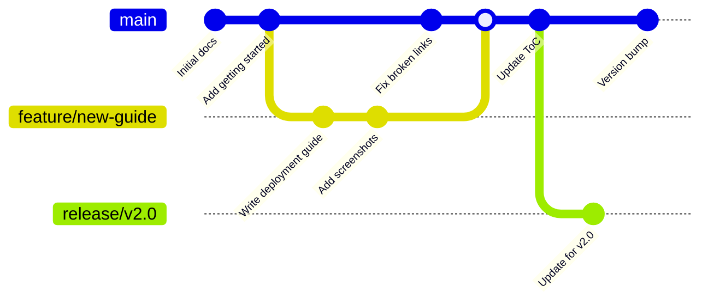

### Branch Strategy

```markdown
# Documentation Branch Strategy

## Main Branch
- Always deployable state
- Corresponds to latest stable version
- Protected branch (PR required)

## Feature Branches
- Pattern: `docs/{topic}-{description}`
- Examples:
  - `docs/add-installation-guide`
  - `docs/update-api-reference`
  - `docs/fix-broken-links`

## Release Branches
- Pattern: `docs/v{major}.{minor}`
- Examples:
  - `docs/v2.0`
  - `docs/v1.5`

## Hotfix Branches
- Pattern: `docs/hotfix/{description}`
- Examples:
  - `docs/hotfix/critical-security-update`
  - `docs/hotfix/fix-broken-example-code`
```

### Commit Message Convention

```markdown
# Semantic commit messages for docs

docs: add installation guide for Linux
docs: update API documentation for v2
docs: fix broken link in getting started
docs: remove deprecated configuration section
docs: improve accessibility of code blocks

# With scope
docs(api): update endpoint descriptions
docs(guides): restructure configuration guide
docs(readme): add badges and links
```

### .gitignore for Documentation

```gitignore
# Documentation .gitignore

# Build artifacts
site/
public/
_build/
output/

# Generated files
*.pdf
*.epub
*.mobi

# Dependencies
node_modules/
vendor/
.bundle/

# Environment
.env
.env.local

# IDE files
.idea/
.vscode/
*.swp
*.swo

# OS files
.DS_Store
Thumbs.db

# Cache
.cache/
.tmp/

# Large binary files
*.psd
*.ai
*.mp4
```

### Pre-commit Hooks for Docs

```yaml
# .pre-commit-config.yaml
repos:
  - repo: https://github.com/igorshubovych/markdownlint-cli
    rev: v0.37.0
    hooks:
      - id: markdownlint
        args: ["--fix"]

  - repo: https://github.com/codespell-project/codespell
    rev: v2.2.6
    hooks:
      - id: codespell
        args: ["--ignore-words", ".spelling"]

  - repo: https://github.com/pre-commit/pre-commit-hooks
    rev: v4.5.0
    hooks:
      - id: trailing-whitespace
      - id: end-of-file-fixer
      - id: check-yaml
      - id: check-added-large-files
        args: ["--maxkb=500"]

  - repo: https://github.com/DavidAnson/markdownlint
    rev: v0.35.0
    hooks:
      - id: markdownlint
        args: ["--config", ".markdownlint.json"]
```

### Versioning Documentation

```markdown
# Documentation Versioning Strategies

## 1. Branch-based versioning
docs/
├── v1.0/
├── v1.5/
├── v2.0/
├── v2.1/
└── latest/ → symlink to v2.1

## 2. Tag-based versioning
# Tags created for each release:
git tag -a docs-v1.0.0 -m "Documentation v1.0.0"
git tag -a docs-v1.1.0 -m "Documentation v1.1.0"
git tag -a docs-v2.0.0 -m "Documentation v2.0.0"

## 3. Subdirectory versioning
docs/
├── current/  ← Active development
├── archive/
│   ├── v1.0/
│   └── v2.0/
└── experimental/
```

### Documentation Review Process

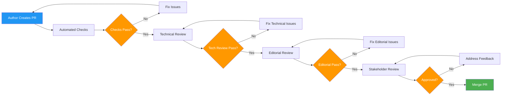

---

## Review Processes

### Documentation Review Types

```mermaid
graph TD
    A[Documentation Reviews] --> B[Self-Review]
    A --> C[Peer Review]
    A --> D[Technical Review]
    A --> E[Editorial Review]
    A --> F[Stakeholder Review]
    A --> G[User Testing]

    B --> B1[Check before submitting]
    B --> B2[Read aloud]
    B --> B3[Check links]

    C --> C1[Another writer reviews]
    C --> C2[Fresh perspective]
    C --> C3[Consistency check]

    D --> D1[SME validates accuracy]
    D --> D2[Code examples tested]
    D --> D3[Technical claims verified]

    E --> E1[Grammar and style]
    E --> E2[Brand voice]
    E --> E3[Accessibility]

    F --> F1[Product manager]
    F --> F2[Business requirements]
    F --> F3[Strategic alignment]

    G --> G1[Real users test]
    G --> G2[Usability testing]
    G --> G3[Clarity validation]

    style A fill:#e91e63,color:white
    style B fill:#4caf50,color:white
    style C fill:#2196f3,color:white
    style D fill:#ff9800,color:white
    style E fill:#9c27b0,color:white
    style F fill:#00bcd4,color:white
    style G fill:#f44336,color:white
```

### Review Checklist Template

```markdown
## Documentation Review Checklist

### Self-Review Checklist
- [ ] Content is factually accurate
- [ ] All code examples work correctly
- [ ] All links are valid
- [ ] No broken images
- [ ] Spelling and grammar checked
- [ ] Markdown linter passes
- [ ] Appropriate for target audience
- [ ] Consistent with style guide
- [ ] Proper heading hierarchy
- [ ] Inclusive language used

### Technical Review Checklist
- [ ] Technical concepts are accurate
- [ ] Code examples produce expected output
- [ ] API endpoints and parameters are correct
- [ ] Version numbers are up to date
- [ ] Configuration examples work
- [ ] Architecture diagrams are accurate
- [ ] Performance claims are verified
- [ ] Security considerations are addressed

### Editorial Review Checklist
- [ ] Consistent voice and tone
- [ ] No grammatical errors
- [ ] Appropriate level of detail
- [ ] Logical flow and organization
- [ ] Clear and concise language
- [ ] Proper use of terminology
- [ ] Consistent formatting
- [ ] Brand guidelines followed

### Stakeholder Review Checklist
- [ ] Aligns with product goals
- [ ] Appropriate messaging
- [ ] Legal/compliance reviewed
- [ ] Brand voice maintained
- [ ] Competitive considerations
- [ ] Release timing appropriate
```

### PR Review Template

```markdown
---
name: Documentation Review
about: Review documentation changes
title: '[DOCS REVIEW]'
labels: documentation, review
assignees: ''
---

## Documentation Changes

**Summary:**
<!-- Brief description of changes -->

**Files Changed:**
<!-- List of modified files -->

**Related Issues:**
<!-- Link to related issues -->

## Review Checklist

### Content
- [ ] Information is accurate and up to date
- [ ] No duplication of existing content
- [ ] Appropriate for target audience
- [ ] Covers edge cases and error scenarios

### Code Examples
- [ ] All code examples are tested
- [ ] Syntax is correct for specified language
- [ ] Examples are complete and runnable
- [ ] Expected output is documented

### Links and Navigation
- [ ] All internal links are valid
- [ ] External links are relevant
- [ ] Anchor links point to correct sections
- [ ] Navigation flow is logical

### Formatting
- [ ] Markdown is properly formatted
- [ ] Tables are accessible
- [ ] Images have alt text
- [ ] Code blocks have language identifiers

### Style
- [ ] Follows project style guide
- [ ] Consistent terminology
- [ ] Inclusive language used
- [ ] Proper heading hierarchy

## Reviewer Notes
<!-- Add your review comments here -->

## Approval
- [ ] Changes requested
- [ ] Approved with suggestions
- [ ] Approved
```

### Review Meeting Template

```markdown
# Documentation Review Meeting

## Meeting Details
- **Date:** 2024-01-15
- **Time:** 14:00 UTC
- **Duration:** 30 minutes
- **Attendees:** [Names]

## Agenda
1. Review proposed changes (5 min)
2. Content walkthrough (15 min)
3. Feedback and discussion (10 min)
4. Action items and next steps (5 min)

## Document Under Review
- **Title:** [Document Title]
- **Author:** [Author Name]
- **Version:** [Version]
- **Link:** [Link to Document]

## Feedback

### Content Feedback
| Section | Feedback | Priority | Owner |
|---------|----------|----------|-------|
| Introduction | Clarify target audience | High | @author |
| Installation | Add Linux instructions | Medium | @author |

### Technical Feedback
| Item | Feedback | Priority | Owner |
|------|----------|----------|-------|
| Code Example 1 | Update to v2 API | High | @author |
| Architecture Diagram | Add caching layer | Low | @author |

## Action Items
- [ ] @author: Update introduction section
- [ ] @author: Add Linux installation instructions
- [ ] @author: Update code examples for v2 API
- [ ] @author: Schedule follow-up review
```

---

## Style Guides

### Major Style Guides Comparison

```mermaid
graph TD
    A[Documentation Style Guides] --> B[Google Developer Docs]
    A --> C[Microsoft Style Guide]
    A --> D[GitHub Docs Style]
    A --> E[Apple Style Guide]
    A --> F[IBM Developer Docs]
    A --> G[Mozilla Style Guide]

    B --> B1[Voice: Clear, direct]
    B --> B2[Use second person]
    B --> B3[Active voice]

    C --> C1[Voice: Conversational]
    C --> C2[Use "you"]
    C --> C3[Global audience]

    D --> D1[Voice: Friendly, clear]
    D --> D2[Short sentences]
    D --> D3[Inclusive language]

    E --> E1[Voice: Warm, approachable]
    E --> E2[Focus on user goals]
    E --> E3[Simple terminology]

    F --> F1[Voice: Professional]
    F --> F2[Consistent terminology]
    F --> F3[International focus]

    G --> G1[Voice: Technical, precise]
    G --> G2[Open web standards]
    G --> G3[Cross-platform]

    style A fill:#e91e63,color:white
    style B fill:#4caf50,color:white
    style C fill:#2196f3,color:white
    style D fill:#ff9800,color:white
    style E fill:#9c27b0,color:white
    style F fill:#00bcd4,color:white
    style G fill:#f44336,color:white
```

### Google Developer Documentation Style Guide

```markdown
# Google Style Guide Principles

## Voice and Tone
- Write in the second person ("you")
- Use active voice (preferred)
- Be clear and direct
- Avoid marketing language

## ✅ Google style
You can configure the server by editing the config file.
Start the server with the `npm start` command.
The API returns a JSON response.

## ❌ Not Google style
One should configure the server by editing the config file.
The server can be started with the `npm start` command.
A JSON response will be returned by the API.

## Key Rules:
- Use "you" not "we"
- Use "can" not "may"
- Use present tense
- Use standard American spelling
- Use serial comma (Oxford comma)
- Use descriptive link text
```

### Microsoft Style Guide

```markdown
# Microsoft Style Guide Principles

## Voice and Tone
- Conversational but professional
- Use everyday language
- Be inclusive and global-friendly
- Focus on user tasks, not technology

## ✅ Microsoft style
Select Save to keep your changes.
If you see an error, check your internet connection.
The app works on Windows, macOS, and Linux.

## ❌ Not Microsoft style
Click on the Save button in order to save your changes.
Should you encounter an error, please verify your internet connectivity.
The application is compatible with Windows, macOS, and Linux operating systems.

## Key Rules:
- Use "select" not "click"
- Use present tense
- Use singular "they"
- Avoid "please" (be direct)
- Use "you" to address the user
- Write for global audience
```

### GitHub Docs Style

```markdown
# GitHub Docs Style Guide Principles

## Voice and Tone
- Friendly but not casual
- Short sentences
- Inclusive and respectful
- Clear and actionable

## ✅ GitHub style
You can create a new repository from the dashboard.
To contribute, fork the repository and submit a pull request.
For more information, see the API documentation.

## ❌ Not GitHub style
If you would like to create a new repository, you may do so from the dashboard.
In order to contribute, one must fork the repository and submit a pull request.
Please refer to the API documentation for additional information.

## Key Rules:
- Use "you" and "your"
- Write short sentences
- Use descriptive headings
- Include code examples
- Use callout boxes for tips/warnings
```

### Consistency Patterns

```markdown
# Documentation Consistency Patterns

## Terminology Consistency
```yaml
# terminology.yml
terms:
  app: application
  app_name: MyApp
  repo: repository
  config: configuration
  docs: documentation
  admin: administrator
  dev: developer
  prod: production

consistent_use:
  - "server" not "machine" or "box"
  - "deploy" not "ship" or "release" (for code)
  - "install" not "setup" or "configure" (for initial setup)
  - "update" not "upgrade" (for minor versions)
```

## Formatting Consistency

```markdown
# ✅ Consistent formatting patterns

## UI Elements
- Buttons: **Bold**
- Menu paths: **File > Save As**
- Keyboard shortcuts: `Ctrl+S`
- Code: `inline code`

## Callout Boxes
> **Note:** Additional information
> **Tip:** Helpful suggestion
> **Warning:** Potential issue
> **Caution:** Risk of data loss
> **Important:** Critical information

## Lists
- Use bulleted lists for unordered items
- Use numbered lists for sequential steps
- Use definition lists for terms
```

---

## Documentation Testing

### Types of Documentation Tests

```mermaid
graph TD
    A[Documentation Testing] --> B[Functional Testing]
    A --> C[Link Testing]
    A --> D[Code Testing]
    A --> E[Accessibility Testing]
    A --> F[Readability Testing]
    A --> G[SEO Testing]

    B --> B1[Does it work?]
    B --> B2[Are instructions accurate?]

    C --> C1[Broken links]
    C --> C2[Redirect chains]
    C --> C3[Anchor validation]

    D --> D1[Executable code blocks]
    D --> D2[Correct output]
    D --> D3[Syntax validation]

    E --> E1[Screen reader test]
    E --> E2[Contrast check]
    E --> E3[Keyboard navigation]

    F --> F1[Reading level]
    F --> F2[Clarity score]
    F --> F3[Consistency check]

    G --> G1[Meta tags]
    G --> G2[Heading structure]
    G --> G3[Keyword analysis]

    style A fill:#e91e63,color:white
    style B fill:#4caf50,color:white
    style C fill:#2196f3,color:white
    style D fill:#ff9800,color:white
    style E fill:#9c27b0,color:white
    style F fill:#00bcd4,color:white
    style G fill:#f44336,color:white
```

### Automated Testing Pipeline

```yaml
# .github/workflows/docs-test.yml
name: Documentation Tests
on: [push, pull_request]

jobs:
  test:
    runs-on: ubuntu-latest
    steps:
      - uses: actions/checkout@v4
      
      - name: Markdown Lint
        run: npx markdownlint-cli2 'docs/**/*.md'
      
      - name: Spell Check
        uses: crate-ci/typos@master
      
      - name: Link Check
        uses: lycheeverse/lychee-action@v1
        with:
          args: --verbose --no-progress './docs/**/*.md'
      
      - name: Code Block Testing
        run: |
          npm install
          npx doctest 'docs/**/*.md'
      
      - name: Accessibility Check
        run: |
          npx @axe-core/cli --exit --dir ./docs/
      
      - name: Readability Check
        run: |
          npx markdown-readability 'docs/**/*.md'
      
      - name: Build Documentation Site
        run: |
          npm run build
```

### Code Block Testing

````markdown
# ✅ Testable code blocks with doctest

The following code should output "Hello, World!":

```javascript doctest
console.log("Hello, World!");
// Expected output:
// Hello, World!
```

# ✅ Testable shell commands

```bash doctest
$ echo "test"
test
```

# ✅ Testable code with assertions

```python doctest
def add(a, b):
    return a + b

# Test the function
result = add(2, 3)
print(result)
# Expected output:
# 5
```
````

### Readability Testing

```markdown
# Readability Scores

## Flesch Reading Ease
- Score: 0-100 (higher = easier)
- Target for docs: 60-70
- Formula: 206.835 - 1.015 × (words/sentences) - 84.6 × (syllables/words)

## Flesch-Kincaid Grade Level
- Score: US grade level
- Target for docs: 8-10 (14-16 year old reading level)
- Formula: 0.39 × (words/sentences) + 11.8 × (syllables/words) - 15.59

## Automated Readability Index
- Target for docs: 8-12
- Uses character count instead of syllable count

## Improving Readability
1. Use shorter sentences (15-20 words average)
2. Use simpler words (avoid jargon)
3. Use active voice
4. Break long paragraphs (3-4 sentences max)
5. Use bullet points for lists
6. Include examples and code snippets
```

### Documentation Test Report

```yaml
# docs-test-report.yml
test_suite: Documentation Quality Check
date: 2024-01-15
version: 1.0

results:
  markdown_lint:
    status: passed
    errors: 0
    warnings: 3
  
  spell_check:
    status: passed
    misspellings: 0
  
  link_check:
    status: failed
    broken_links: 2
    redirects: 5
    
  code_blocks:
    tested: 15
    passed: 14
    failed: 1
    
  accessibility:
    score: 92/100
    issues: 3
    
  readability:
    flesch_kincaid: 8.5
    flesch_reading_ease: 65.2
    target_met: true
    
  seo:
    missing_meta: 0
    heading_structure: optimal
```

---

## Mermaid Diagram Best Practices

### Design Principles

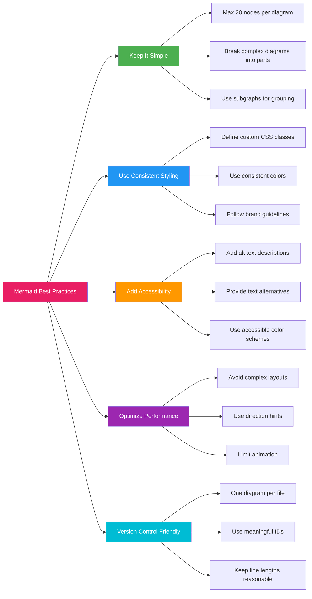

### Diagram Type Selection

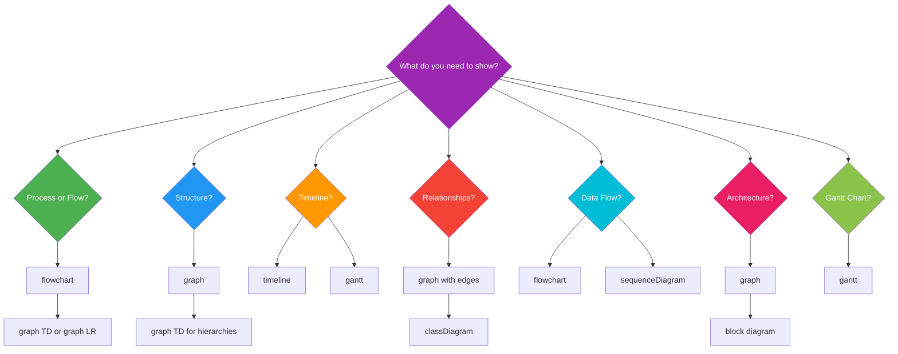

### Accessible Mermaid Diagrams

```markdown
# Create accessible Mermaid diagrams by:
# 1. Adding descriptions before each diagram
# 2. Using alt text if supported
# 3. Avoiding color-only information
# 4. Adding text labels to all elements

The following diagram shows the authentication flow:

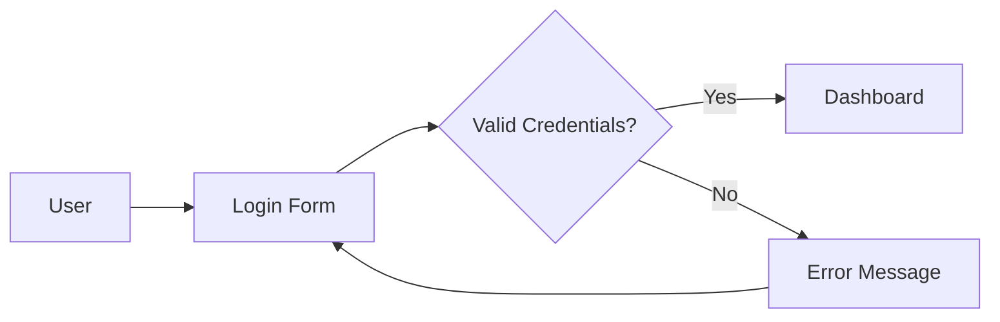

This flow chart illustrates the user authentication process:
- A user starts at the login form
- If credentials are valid, they proceed to the dashboard
- If credentials are invalid, they see an error and return to the login form
```

### Styling Guidelines

```mermaid
graph TD
    subgraph "Styling Best Practices"
        A[Use consistent colors] --> A1[Define styles at top]
        B[Readable fonts] --> B1[Use sans-serif]
        C[Contrast] --> C1[Light backgrounds for dark themes]
        D[Size] --> D1[Appropriate node sizes]
    end

    style A fill:#e1f5fe
    style B fill:#f3e5f5
    style C fill:#e8f5e9
    style D fill:#fff3e0

    style A1 fill:#b3e5fc
    style B1 fill:#ce93d8
    style C1 fill:#a5d6a7
    style D1 fill:#ffcc80
```

### Using Themes

```mermaid
%%{init: {'theme': 'base', 'themeVariables': {
  'primaryColor': '#BB2528',
  'primaryTextColor': '#fff',
  'primaryBorderColor': '#7C0000',
  'lineColor': '#F8B229',
  'secondaryColor': '#006100',
  'tertiaryColor': '#fff'
}}}%%
graph TD
    A[Custom Theme Example]
    A --> B[Primary Colors]
    A --> C[Secondary Colors]
    B --> D[Consistent Branding]
    C --> E[Accessible Contrast]
```

### Accessibility Descriptions for Diagrams

```markdown
The following diagram illustrates the software development lifecycle:

```mermaid
graph LR
    A[Planning] --> B[Development]
    B --> C[Testing]
    C --> D[Deployment]
    D --> E[Monitoring]
    E --> A
```

**Text description of the diagram:**
This is a circular flow diagram showing the software development lifecycle.
It consists of five stages arranged in a cycle:
1. **Planning** - Requirements gathering and project planning
2. **Development** - Writing code and building features
3. **Testing** - Quality assurance and bug fixing
4. **Deployment** - Releasing to production
5. **Monitoring** - Observing system performance and user feedback
The cycle then returns to Planning for continuous improvement.
```

---

## Technical Writing Best Practices

### The Writing Process

```mermaid
graph LR
    A[Plan] --> B[Research]
    B --> C[Outline]
    C --> D[Write]
    D --> E[Review]
    E --> F[Edit]
    F --> G[Publish]
    G --> H[Maintain]

    A --> A1[Define audience]
    A --> A2[Define purpose]
    A --> A3[Define scope]

    B --> B1[Gather information]
    B --> B2[Interview SMEs]
    B --> B3[Research existing docs]

    C --> C1[Create structure]
    C --> C2[Identify sections]
    C --> C3[Plan examples]

    D --> D1[First draft]
    D --> D2[Focus on content]
    D --> D3[Ignore perfection]

    E --> E1[Self-review]
    E --> E2[Peer review]
    E --> E3[Technical review]

    F --> F1[Edit for clarity]
    F --> F2[Edit for style]
    F --> F3[Edit for grammar]

    G --> G1[Format for platform]
    G --> G2[Add metadata]
    G --> G3[Publish]

    H --> H1[Update regularly]
    H --> H2[Address feedback]
    H --> H3[Archive outdated]

    style A fill:#e91e63,color:white
    style G fill:#4caf50,color:white
    style H fill:#2196f3,color:white
```

### Audience Analysis

```markdown
# Audience Analysis Framework

## Audience Types

| Type | Characteristics | Writing Approach |
|------|-----------------|------------------|
| Beginners | New to topic, need hand-holding | Step-by-step, explain concepts |
| Intermediate | Some experience, need guidance | Focus on tasks, minimal concepts |
| Advanced | Experienced, need reference | API docs, configuration, performance |
| Decision Makers | Need overview, not details | Executive summaries, benefits |
| Maintainers | Need deep technical details | Architecture, edge cases, APIs |

## Audience Persona Template

**Persona: Developer new to the platform**
- **Name:** Alex
- **Role:** Full-stack developer
- **Experience:** 5 years coding, new to this platform
- **Goals:** Set up a development environment, build a simple app
- **Frustrations:** Unclear setup steps, missing prerequisites
- **Learning style:** Prefers examples over theory
- **Format preference:** Interactive tutorials with code

## Writing for Your Audience

### For Beginners:
```markdown
## Getting Started

Welcome! This guide will help you set up your first project.
Don't worry if you're new to this — we'll take it step by step.

1. Open your terminal
2. Type: `npm create my-app`
3. Follow the on-screen prompts
```

### For Advanced Users:
```markdown
## Configuration Reference

| Parameter | Type | Default | Description |
|-----------|------|---------|-------------|
| `port` | number | 3000 | Server port |
| `host` | string | 'localhost' | Server host |
| `debug` | boolean | false | Debug mode |
```
```

### Active vs Passive Voice

```markdown
# ✅ Active voice (preferred)
The server processes the request.
You can configure the timeout value.
The API returns a JSON object.

# ❌ Passive voice (avoid when possible)
The request is processed by the server.
The timeout value can be configured by the user.
A JSON object is returned by the API.

## When Passive Voice is Acceptable
1. When the actor is unknown: "The server was compromised."
2. When the actor is obvious: "Users are created on signup."
3. When focusing on the action: "The file was saved successfully."
```

### Sentence Structure

```markdown
# ✅ Clear, direct sentences
Start the server. Open your browser. Navigate to localhost:3000.
Your application should now be running.

# ❌ Long, complex sentences
After you have successfully started the server, which you can do
by running the `npm start` command from your terminal, you should
then open your preferred web browser application and navigate to
the localhost address on port 3000, at which point your application
should be visible and running properly.

## Sentence Length Guidelines
- Average: 15-20 words
- Maximum: 30 words
- Break longer sentences into 2-3 shorter ones
- Each sentence: one main idea

## Paragraph Structure
- Topic sentence introduces the idea
- 2-4 supporting sentences
- Concluding sentence (optional)
- Maximum 5-7 lines per paragraph
```

### Task-Oriented Writing

```markdown
# ✅ Task-oriented documentation

## How to Reset Your Password

1. Go to the login page
2. Click **Forgot Password**
3. Enter your email address
4. Check your email for reset link
5. Click the reset link
6. Enter your new password
7. Click **Save**

## Why This Works
- Clear steps with one action each
- Visible UI elements in bold
- User-focused ("your password")
- No unnecessary information

# ❌ Feature-oriented documentation

## Password Reset Feature

The password reset functionality allows users who have forgotten
their password to regain access to their account. This feature
uses email verification to ensure security. The system sends a
time-limited token to the user's registered email address.
```

### Writing Error Messages

```markdown
# ✅ Good error messages

Error: Invalid email format
Solution: Enter an email address in the format user@example.com

Error: Connection timeout (Error Code: 504)
Solution: Check your internet connection and try again.
If the problem persists, contact support.

# ❌ Poor error messages
Error: Something went wrong
Error: Error code 0x0000FF
Error: Bad request
```

### Documentation Templates

```markdown
# Guide Template

## [Guide Title]

### Introduction
Brief description of what this guide covers.

### Prerequisites
- [ ] Required item 1
- [ ] Required item 2
- [ ] Required knowledge

### Step 1: [First Step]
Description of what this step accomplishes.

```bash
# Command for this step
$ command to run
```

### Step 2: [Second Step]
...

### Summary
What the reader accomplished and where to go next.

---

# Tutorial Template

## [Tutorial Title]

### Learning Objectives
By the end of this tutorial, you will be able to:
- Objective 1
- Objective 2
- Objective 3

### Time Required
30 minutes

### Prerequisites
- [ ] Prerequisite 1
- [ ] Prerequisite 2

### Tutorial Steps
1. ...
2. ...
3. ...

### Next Steps
- [Related Guide 1](/link)
- [Related Guide 2](/link)

---

# Reference Template

## [API/Feature Name]

### Overview
Brief description of the API endpoint or feature.

### Syntax
```javascript
endpoint.method(params)
```

### Parameters
| Parameter | Type | Required | Description |
|-----------|------|----------|-------------|
| `param1` | string | Yes | Description of param1 |
| `param2` | number | No | Description of param2 |

### Returns
```json
{
  "type": "object",
  "properties": {
    "result": "string"
  }
}
```

### Example
```javascript
// Example usage
const result = await api.method({ param1: 'value' });
console.log(result);
```

### Error Codes
| Code | Description |
|------|-------------|
| 400 | Invalid parameters |
| 401 | Authentication required |
| 404 | Resource not found |
```

---

## SEO for Documentation

### SEO Fundamentals for Docs

```mermaid
graph TD
    A[Documentation SEO] --> B[Technical SEO]
    A --> C[On-Page SEO]
    A --> D[Content SEO]
    A --> E[User Experience]

    B --> B1[Fast loading]
    B --> B2[Mobile friendly]
    B --> B3[Structured data]
    B --> B4[XML sitemap]

    C --> C1[Title tags]
    C --> C2[Meta descriptions]
    C --> C3[Heading structure]
    C --> C4[URL structure]

    D --> D1[Keyword research]
    D --> D2[Content depth]
    D --> D3[Freshness]
    D --> D4[Internal linking]

    E --> E1[Navigation]
    E --> E2[Readability]
    E --> E3[Engagement]
    E --> E4[Bounce rate]

    style A fill:#e91e63,color:white
    style B fill:#4caf50,color:white
    style C fill:#2196f3,color:white
    style D fill:#ff9800,color:white
    style E fill:#9c27b0,color:white
```

### Meta Tags for Documentation

```html
<!-- Essential Meta Tags -->
<title>Getting Started with Project X - Documentation</title>
<meta name="description" content="Learn how to install and configure Project X. Step-by-step guide with code examples for beginners." />
<meta name="keywords" content="project x, installation, configuration, getting started, tutorial" />
<meta name="robots" content="index, follow" />

<!-- Open Graph Tags -->
<meta property="og:title" content="Getting Started with Project X" />
<meta property="og:description" content="Complete guide to installing and configuring Project X" />
<meta property="og:type" content="article" />
<meta property="og:url" content="https://docs.example.com/getting-started" />
<meta property="og:image" content="https://docs.example.com/og-image.png" />

<!-- Twitter Card Tags -->
<meta name="twitter:card" content="summary_large_image" />
<meta name="twitter:title" content="Getting Started with Project X" />
<meta name="twitter:description" content="Complete guide to installing and configuring Project X" />

<!-- Canonical URL -->
<link rel="canonical" href="https://docs.example.com/getting-started" />
```

### URL Structure for SEO

```markdown
# ✅ SEO-friendly URLs

https://docs.example.com/getting-started/installation
https://docs.example.com/guides/configuration/basic-setup
https://docs.example.com/reference/api/users
https://docs.example.com/tutorials/beginners/first-app

# ❌ Poor URLs

https://docs.example.com/page?id=123
https://docs.example.com/index.php?section=docs&page=1
https://docs.example.com/2024/01/15/some-page
https://docs.example.com/docs/documentation-page-1
```

### Keyword Strategy

```markdown
# Keyword Research for Documentation

## Primary Keywords (Title/H1)
- "Getting started with [Product]"
- "[Product] installation guide"
- "[Product] configuration"
- "[Product] API reference"

## Secondary Keywords (H2 headings)
- "How to install [Product] on Linux"
- "[Product] system requirements"
- "[Product] environment setup"
- "[Product] troubleshooting"

## Long-tail Keywords (Content)
- "How to install [Product] on Ubuntu 22.04"
- "[Product] environment variables configuration"
- "[Product] error handling best practices"
- "[Product] performance optimization tips"

## Keyword Placement
- Title tag (beginning)
- H1 heading (naturally)
- First paragraph
- H2 headings (variations)
- Image alt text
- URL slug
- Meta description
```

### Content Freshness

```markdown
# Content Freshness Strategy

## Update Schedule

| Content Type | Review Frequency | Update Trigger |
|--------------|-----------------|----------------|
| Getting Started | Quarterly | New release |
| Installation Guide | Monthly | OS/Platform changes |
| API Reference | Per Release | API changes |
| Tutorials | Quarterly | User feedback |
| Troubleshooting | Monthly | New issues |
| Best Practices | Semi-annual | Industry changes |

## Freshness Signals for SEO
- Updated date in article metadata
- "Last updated" badge
- Changelog entries for docs
- Version badges on pages
- Regular content audits

## Content Audit Checklist
- [ ] Check for outdated information
- [ ] Verify all code examples work
- [ ] Update version numbers
- [ ] Review links for relevance
- [ ] Add new screenshots if needed
- [ ] Remove deprecated content
- [ ] Update metadata dates
```

### Structured Data for Docs

```html
<!-- TechArticle structured data -->
<script type="application/ld+json">
{
  "@context": "https://schema.org",
  "@type": "TechArticle",
  "headline": "Getting Started with Project X",
  "description": "Complete installation and configuration guide",
  "author": {
    "@type": "Person",
    "name": "Author Name"
  },
  "datePublished": "2024-01-15",
  "dateModified": "2024-03-20",
  "publisher": {
    "@type": "Organization",
    "name": "Organization Name",
    "logo": {
      "@type": "ImageObject",
      "url": "https://docs.example.com/logo.png"
    }
  },
  "mainEntityOfPage": {
    "@type": "WebPage",
    "@id": "https://docs.example.com/getting-started"
  },
  "image": "https://docs.example.com/og-image.png",
  "proficiencyLevel": "Beginner",
  "timeRequired": "PT30M"
}
</script>

<!-- HowTo structured data for tutorials -->
<script type="application/ld+json">
{
  "@context": "https://schema.org",
  "@type": "HowTo",
  "name": "How to Install Project X",
  "description": "Step-by-step installation guide",
  "totalTime": "PT15M",
  "tool": {
    "@type": "HowToTool",
    "name": "Terminal"
  },
  "step": [
    {
      "@type": "HowToStep",
      "text": "Open your terminal",
      "name": "Open terminal"
    },
    {
      "@type": "HowToStep",
      "text": "Run npm install project-x",
      "name": "Install package"
    }
  ]
}
</script>
```

---

## Search Optimization

### Search Features

```mermaid
graph TD
    A[Search Optimization] --> B[Search Engine Optimization]
    A --> C[Site Search Optimization]
    A --> D[Discoverability]

    B --> B1[Rank higher in Google]
    B --> B2[Rich snippets]
    B --> B3[Featured snippets]

    C --> C1[Internal search improves]
    C --> C2[Relevance ranking]
    C --> C3[Search filters]

    D --> D1[Cross-references]
    D --> D2[Related content]
    D --> D3[Content recommendations]

    style A fill:#e91e63,color:white
    style B fill:#4caf50,color:white
    style C fill:#2196f3,color:white
    style D fill:#ff9800,color:white
```

### Site Search Implementation

```javascript
// Client-side search implementation
class DocumentationSearch {
  constructor(documents) {
    this.documents = documents;
    this.index = this.buildIndex();
  }

  buildIndex() {
    // Build inverted index for full-text search
    const index = new Map();
    
    this.documents.forEach(doc => {
      const terms = this.tokenize(doc.content);
      terms.forEach(term => {
        if (!index.has(term)) {
          index.set(term, new Set());
        }
        index.get(term).add(doc.id);
      });
    });
    
    return index;
  }

  search(query) {
    const terms = this.tokenize(query);
    const results = new Map();
    
    terms.forEach(term => {
      const matchingDocs = this.index.get(term) || new Set();
      matchingDocs.forEach(docId => {
        results.set(docId, (results.get(docId) || 0) + 1);
      });
    });
    
    // Sort by relevance score
    return Array.from(results.entries())
      .sort((a, b) => b[1] - a[1])
      .map(([docId]) => this.documents.find(d => d.id === docId));
  }

  tokenize(text) {
    return text.toLowerCase()
      .replace(/[^\w\s]/g, '')
      .split(/\s+/)
      .filter(word => word.length > 2);
  }
}
```

### Search Analytics

```markdown
# Search Analytics Metrics

## Key Metrics to Track
| Metric | Description | Target |
|--------|-------------|--------|
| Search Volume | Total searches | Track trend |
| Zero Results | Searches with no results | < 5% |
| Click-through Rate | % who click results | > 60% |
| Refinement Rate | % who refine search | < 20% |
| Time to Click | Time before clicking | < 3 seconds |
| Exit Rate | % who leave after search | < 30% |

## Analytics Implementation
```javascript
// Search analytics tracking
function trackSearch(query, results, timing) {
  analytics.track('documentation_search', {
    query,
    resultCount: results.length,
    clickThrough: results.filter(r => r.clicked).length,
    timeToClick: timing,
    hasResults: results.length > 0,
    refined: query.includes(' ') || false
  });
}

function trackSearchResultClick(docId, position, query) {
  analytics.track('documentation_search_click', {
    documentId: docId,
    position,
    query,
    timestamp: new Date().toISOString()
  });
}
```
```

### Search Optimization Techniques

```markdown
# Search Optimization Techniques

## 1. Front-load Important Terms
```markdown
# ✅ Important terms at the beginning
Getting Started with Project X Installation and Configuration

# ❌ Important terms at the end
Everything You Need to Know About Using the Project X Application for
Your Development Workflow Including Installation and Configuration
```

## 2. Use Synonyms and Variations
```markdown
# Include related terms naturally
This guide covers how to **install** (setup, configure, deploy) the
application. You'll learn about **requirements** (prerequisites,
dependencies, system needs) before starting.

## 3. Answer Questions Directly
```markdown
## How do I install Project X?
Run the following command in your terminal:
```bash
npm install -g project-x
```

## How do I configure Project X?
Create a configuration file named `project-x.config.json` in your
project root directory.
```
```

### Featured Snippet Optimization

```markdown
# Optimizing for Featured Snippets

## Paragraph Snippets
Answer the question in 40-50 words in a clear paragraph:

**What is Markdown?**
Markdown is a lightweight markup language for creating formatted
text using a plain-text editor. It was created by John Gruber in
2004 and is now one of the world's most popular markup languages.

## List Snippets
Use numbered or bulleted lists for step-by-step content:

**How to create a Markdown file:**
1. Open a text editor (VS Code, Sublime Text, etc.)
2. Create a new file with `.md` extension
3. Write content using Markdown syntax
4. Save the file
5. Preview with a Markdown viewer

## Table Snippets
Use tables for comparative content:

| Feature | Markdown | HTML |
|---------|----------|------|
| Learning Curve | Low | Medium |
| Readability | High | Low |
| File Size | Small | Large |
| Portability | High | Medium |
```

---

## Documentation Maintenance

### Maintenance Strategy

```mermaid
graph TD
    A[Documentation Maintenance] --> B[Regular Reviews]
    A --> C[Content Audits]
    A --> D[User Feedback]
    A --> E[Technical Updates]
    A --> F[Archive Management]

    B --> B1[Monthly link check]
    B --> B2[Quarterly content review]
    B --> B3[Annual full audit]

    C --> C1[Relevance check]
    C --> C2[Accuracy verification]
    C --> C3[Duplication detection]

    D --> D1[Issue tracking]
    D --> D2[User surveys]
    D --> D3[Analytics review]

    E --> E1[Version updates]
    E --> E2[API changes]
    E --> E3[Screenshot updates]

    F --> F1[Deprecation notices]
    F --> F2[Archive old versions]
    F --> F3[Redirect setup]

    style A fill:#e91e63,color:white
    style B fill:#4caf50,color:white
    style C fill:#2196f3,color:white
    style D fill:#ff9800,color:white
    style E fill:#9c27b0,color:white
    style F fill:#00bcd4,color:white
```

### Maintenance Schedule

```markdown
# Documentation Maintenance Schedule

## Daily Tasks (Automated)
- [ ] Run link checker
- [ ] Monitor site analytics
- [ ] Check for broken images
- [ ] Spell check new content

## Weekly Tasks
- [ ] Review user feedback/issue tracker
- [ ] Update FAQ with common questions
- [ ] Verify external resources
- [ ] Check search analytics

## Monthly Tasks
- [ ] Run full link audit
- [ ] Review top exit pages
- [ ] Update "last updated" dates
- [ ] Check competitor documentation
- [ ] Review support tickets for gaps

## Quarterly Tasks
- [ ] Full content audit
- [ ] Update screenshots/diagrams
- [ ] Review and update style guide
- [ ] Test all code examples
- [ ] Accessibility audit
- [ ] SEO review and optimization

## Annual Tasks
- [ ] Complete documentation overhaul
- [ ] Archive outdated content
- [ ] User survey and feedback analysis
- [ ] Technology stack review
- [ ] Information architecture review
- [ ] Performance optimization
```

### Content Health Metrics

```markdown
# Documentation Health Metrics

## Quality Metrics
| Metric | Measurement | Target |
|--------|-------------|--------|
| Accuracy | Verified claims | > 95% |
| Completeness | Covered topics | > 90% |
| Freshness | Updated content | > 80% |
| Consistency | Style guide compliance | > 90% |
| Readability | Flesch-Kincaid grade | 8-10 |
| Accessibility | WCAG compliance | AA+ |

## Performance Metrics
| Metric | Measurement | Target |
|--------|-------------|--------|
| Page Load Time | Server response | < 2s |
| Search Success | Found results | > 90% |
| Bounce Rate | Single page visits | < 40% |
| Time on Page | Reading time | > 2 min |
| Return Visitors | Repeat users | > 30% |

## Health Scoring

```python
def calculate_docs_health(metrics):
    """
    Calculate overall documentation health score.
    
    Args:
        metrics: Dict of metric measurements
    
    Returns:
        health_score: 0-100 score
        recommendations: List of improvements
    """
    weights = {
        'accuracy': 0.20,
        'completeness': 0.15,
        'freshness': 0.15,
        'readability': 0.10,
        'accessibility': 0.10,
        'search_success': 0.15,
        'bounce_rate': 0.05,
        'page_load': 0.10
    }
    
    score = sum(
        metrics[metric] * weight
        for metric, weight in weights.items()
    )
    
    recommendations = []
    if metrics['freshness'] < 0.8:
        recommendations.append(
            "Schedule content audit for outdated pages"
        )
    if metrics['accessibility'] < 0.9:
        recommendations.append(
            "Run accessibility audit and fix issues"
        )
    
    return {
        'score': round(score, 1),
        'grade': 'A' if score >= 90 else 'B' if score >= 80
                else 'C' if score >= 70 else 'D',
        'recommendations': recommendations
    }
```
```

### Deprecation Process

```markdown
# Documentation Deprecation Process

## Deprecation Workflow

```mermaid
graph TD
    A[Identify Outdated Content] --> B[Mark as Deprecated]
    B --> C[Add Deprecation Notice]
    C --> D[Add Redirect]
    D --> E[Keep in Archive]
    E --> F[Remove After Period]
    
    B --> B1[Add to deprecated index]
    C --> C1[Date of deprecation]
    C --> C2[Alternative resource]
    C --> C3[Reason for deprecation]
    D --> D1[Redirect to new content]
    E --> E1[Archive with date stamp]
    F --> F1[6-12 month retention]
```

## Deprecation Notice Template

> **⚠️ Deprecated: This documentation is no longer maintained.**
> 
> **Deprecated on:** 2024-01-15
> **Replaced by:** [New Installation Guide](/docs/v2/installation)
> **Reason:** This guide covers the v1 API which has been replaced.
> **Support ends:** 2024-06-30
> **Support resources:** [Migration Guide](/docs/v2/migration)

## Archive Structure

```markdown
docs/
├── current/           # Active documentation
├── deprecated/        # Marked as deprecated but available
│   ├── v1-api/
│   ├── old-installation-guide/
│   └── README.md      # Index of deprecated content
└── archive/           # Removed from navigation
    ├── 2023/
    ├── 2022/
    └── README.md      # Archive index with dates
```
```

### Feedback Integration

```markdown
# User Feedback Integration

## Feedback Collection Methods

### 1. In-Page Feedback Widget
```html
<div class="feedback-widget">
  <p>Was this page helpful?</p>
  <button class="feedback-yes">👍 Yes</button>
  <button class="feedback-no">👎 No</button>
  <textarea placeholder="How can we improve this page?"></textarea>
  <button class="feedback-submit">Submit Feedback</button>
</div>
```

### 2. GitHub Issue Templates
```yaml
name: Documentation Feedback
description: Report a documentation issue or suggestion
title: "[Docs]: "
labels: ["documentation"]
body:
  - type: input
    id: page
    attributes:
      label: Page URL
      description: Which page needs improvement?
      placeholder: https://docs.example.com/page
    validations:
      required: true
  - type: dropdown
    id: type
    attributes:
      label: Issue Type
      options:
        - Inaccurate information
        - Missing information
        - Unclear explanation
        - Broken link/code
        - Suggestion for improvement
  - type: textarea
    id: description
    attributes:
      label: Description
      description: What needs to be changed?
    validations:
      required: true
```

### 3. Feedback Analysis

```python
# Analyze documentation feedback
def analyze_feedback(feedback_list):
    """
    Analyze user feedback to identify improvement areas.
    """
    categories = {
        'accuracy': [],
        'completeness': [],
        'clarity': [],
        'examples': [],
        'navigation': []
    }
    
    for feedback in feedback_list:
        # Categorize feedback using keyword matching
        text = feedback['text'].lower()
        if any(word in text for word in ['wrong', 'incorrect', 'error']):
            categories['accuracy'].append(feedback)
        elif any(word in text for word in ['missing', 'add', 'include']):
            categories['completeness'].append(feedback)
        elif any(word in text for word in ['confusing', 'unclear', 'hard']):
            categories['clarity'].append(feedback)
        elif any(word in text for word in ['example', 'code', 'sample']):
            categories['examples'].append(feedback)
        elif any(word in text for word in ['find', 'search', 'navigate']):
            categories['navigation'].append(feedback)
    
    # Generate priority scores
    priorities = {}
    for category, items in categories.items():
        priorities[category] = {
            'count': len(items),
            'action_required': len(items) > 5,
            'urgent': len(items) > 20
        }
    
    return priorities
```
```

### Continuous Improvement

```mermaid
graph LR
    A[Monitor] --> B[Analyze]
    B --> C[Prioritize]
    C --> D[Implement]
    D --> E[Measure]
    E --> A

    A --> A1[Analytics]
    A --> A2[Feedback]
    A --> A3[Support tickets]

    B --> B1[Identify patterns]
    B --> B2[Find root causes]
    B --> B3[Quantify impact]

    C --> C1[Urgency]
    C --> C2[Effort]
    C --> C3[Impact]

    D --> D1[Fix issues]
    D --> D2[Add content]
    D --> D3[Improve structure]

    E --> E1[User satisfaction]
    E --> E2[Support reduction]
    E --> E3[Search success]

    style A fill:#e91e63,color:white
    style B fill:#4caf50,color:white
    style C fill:#2196f3,color:white
    style D fill:#ff9800,color:white
    style E fill:#9c27b0,color:white
```

---

## Conclusion

These best practices represent the collective wisdom of the
documentation community. Remember that rules are meant to be
broken when there's a good reason — but first, understand why
the rules exist.

### Key Takeaways

1. **Organization matters**: A well-structured documentation
   repository saves time for everyone
2. **Consistency is king**: Follow style guides, naming conventions,
   and formatting patterns consistently
3. **Accessibility is not optional**: Write for everyone, including
   those using screen readers
4. **Test your docs**: Code examples should work, links should be
   valid, and content should be accurate
5. **Maintain regularly**: Documentation is never "done" — it
   requires ongoing care and attention
6. **Listen to users**: Feedback is the best guide for improvement
7. **Use the right tools**: Linters, link checkers, and automation
   make maintenance manageable
8. **Think globally**: Consider internationalization from the start
9. **Optimize for search**: Good SEO means your docs are found
10. **Measure and improve**: Use metrics to guide your efforts

### Further Reading

- [Advanced Topics Guide](./ADVANCED_TOPICS.md)
- [Resources and Tools](./RESOURCES.md)
- [Practice Projects](./PROJECTS.md)
- [Interview Preparation](./INTERVIEW_GUIDE.md)
