# Markdown Mastery Cheatsheet

> Complete quick-reference guide for Markdown syntax, extensions, and tooling.

---

## 1. HEADINGS

```markdown
# Heading 1       (largest, usually title)
## Heading 2      (major sections)
### Heading 3     (sub-sections)
#### Heading 4    (sub-sub-sections)
##### Heading 5
###### Heading 6  (smallest)

<!-- Alternative syntax (for H1 and H2) -->
Heading 1
==========

Heading 2
----------

<!-- Best practices -->
- Use exactly one H1 per document
- Maintain hierarchy (never skip levels)
- Use descriptive headings for accessibility
- Keep headings concise (< 60 characters for SEO)
```

---

## 2. TEXT FORMATTING

```markdown
**Bold text**           __Bold text__
*Italic text*           _Italic text_
***Bold and italic***   ___Bold and italic___
~~Strikethrough text~~

<!-- HTML equivalents for unsupported formatting -->
<u>Underlined text</u>
<mark>Highlighted text</mark>
H<sub>2</sub>O          (subscript)
E=mc<sup>2</sup>        (superscript)
~~Strikethrough~~
<ins>Inserted text</ins>
<del>Deleted text</del>
<small>Small text</small>
<kbd>Ctrl</kbd>+<kbd>C</kbd>  (keyboard shortcut)
```

---

## 3. CODE

### Inline Code
```markdown
Use the `print()` function
File: `src/main.py`
Command: `npm install`
```

### Fenced Code Blocks
\```javascript
function hello(name) {
    console.log(`Hello, ${name}!`);
}
\```

### Language Specifiers (20+ common languages)

| Language | Specifier | Language | Specifier |
|----------|-----------|----------|-----------|
| JavaScript | `javascript` | TypeScript | `typescript` |
| Python | `python` | Java | `java` |
| C | `c` | C++ | `cpp` |
| C# | `csharp` | Go | `go` |
| Rust | `rust` | Ruby | `ruby` |
| PHP | `php` | Swift | `swift` |
| Kotlin | `kotlin` | Scala | `scala` |
| HTML | `html` | CSS | `css` |
| SQL | `sql` | Bash | `bash` / `sh` |
| Shell | `shell` | YAML | `yaml` |
| JSON | `json` | XML | `xml` |
| Markdown | `markdown` | Diff | `diff` |
| Docker | `dockerfile` | GraphQL | `graphql` |
| LaTeX | `latex` | R | `r` |
| Dart | `dart` | Lua | `lua` |
| Haskell | `haskell` | Elixir | `elixir` |

### Indented Code Block (4 spaces or 1 tab)
```markdown
    // This is an indented code block
    const x = 42;
    console.log(x);
```

### Code Block Features
```markdown
\```python {linenos=table, hl_lines=[2-3], title="example.py"}
def greet(name):
    print(f"Hello, {name}!")
    return True
\```
```

---

## 4. LISTS

### Ordered Lists
```markdown
1. First item
2. Second item
3. Third item
   1. Nested item (indent 3 spaces)
   2. Another nested item
4. Back to main list
   - Mixed with unordered
5. Item after mixed list
```

### Unordered Lists
```markdown
- Item with dash
* Item with asterisk
+ Item with plus
  - Nested item (indent 2-4 spaces)
    - Deeply nested (indent 4 spaces)
- [x] Completed task
- [ ] Incomplete task
```

### Definition Lists
```markdown
Term 1
: Definition for term 1

Term 2
: Definition for term 2
: Another definition for term 2

Term 3
: Definition with **formatting** and `code`
```

### Task Lists
```markdown
- [x] Write the course
- [x] Create examples
- [ ] Publish online
- [ ] Gather feedback
- [ ] Iterate and improve
```

---

## 5. LINKS

### Inline Links
```markdown
[Visit GitHub](https://github.com)
[Link with title](https://example.com "Example Website")
[Email](mailto:user@example.com)
```

### Reference-Style Links
```markdown
[GitHub][github]
[Documentation][docs]

[github]: https://github.com
[docs]: https://docs.example.com "Documentation Site"
```

### Relative Links
```markdown
[About page](../about.md)
[Installation guide](./installation.md)
[Images folder](../images/logo.png)
[Section link](#installation)  (anchor link)
```

### Automatic Links
```markdown
<https://example.com>
<user@example.com>
```

### Link Variations
```markdown
[Bold link **text**](https://example.com)
[Link with `code`](https://example.com)
[Reference-style with formatting][ref]

[ref]: https://example.com "Reference"
```

---

## 6. IMAGES

### Basic Image
```markdown


```

### Image with Link
```markdown
[](https://example.com)
```

### Image Sizing (HTML)
```markdown


```

### Reference-Style Image
```markdown
![Alt text][logo]

[logo]: images/logo.png "Company Logo"
```

### Figure with Caption (HTML)
```markdown
<figure>
  
  <figcaption>Figure 1: System Architecture Overview</figcaption>
</figure>
```

### SVG Inline
```markdown
<svg viewBox="0 0 100 100" xmlns="http://www.w3.org/2000/svg">
  <circle cx="50" cy="50" r="40" fill="blue" />
</svg>
```

---

## 7. TABLES

### Basic Table
```markdown
| Header 1 | Header 2 | Header 3 |
|----------|----------|----------|
| Cell 1   | Cell 2   | Cell 3   |
| Cell 4   | Cell 5   | Cell 6   |
```

### Column Alignment
```markdown
| Left-aligned | Center-aligned | Right-aligned |
|:-------------|:--------------:|--------------:|
| Left         | Center         | Right         |
| Text         | Text           | Text          |
```

### Table with Formatting
```markdown
| Feature | Status | Notes |
|:--------|:------:|:------|
| **Bold** | ✅ Done | `works` |
| *Italic* | ❌ TODO | [link](#) |
| `Code`   | ⚠️ WIP  |  |
```

### Multi-line Cells (HTML)
```markdown
| Feature | Description |
|:--------|:------------|
| Search  | Full-text search<br>Fuzzy matching<br>Filter by tags |
| Export  | PDF, HTML, DOCX<br>Custom templates |
```

### Right-Aligned Numbers
```markdown
| Item | Quantity | Price |
|:-----|:--------:|------:|
| Apples | 5 | $2.50 |
| Bananas | 12 | $3.00 |
| Oranges | 8 | $4.50 |
```

### Table Without Leading/Trailing Pipes
```markdown
Header 1 | Header 2 | Header 3
---------|----------|---------
Cell 1   | Cell 2   | Cell 3
```

---

## 8. BLOCKQUOTES

### Basic Blockquote
```markdown
> This is a blockquote.
> It can span multiple lines.
```

### Multi-paragraph
```markdown
> First paragraph of blockquote.
>
> Second paragraph of blockquote.
```

### Nested Blockquotes
```markdown
> Level 1
>> Level 2
>>> Level 3
>>>> Level 4
>>>>> Level 5
```

### Blockquote with Elements
```markdown
> ## Heading in Blockquote
>
> - List item in blockquote
> - Another list item
>
> `code in blockquote`
>
> > Nested blockquote with **formatting**
```

### Callouts / Admonitions
```markdown
> [!NOTE]
> Useful information that users should know.

> [!TIP]
> Helpful advice for doing things better.

> [!IMPORTANT]
> Essential information users must follow.

> [!WARNING]
> Content that requires immediate attention.

> [!CAUTION]
> Potential damage or data loss.
```

---

## 9. HORIZONTAL RULES

```markdown
---     (most common)
***
___
* * *
- - -
```

---

## 10. HTML ELEMENTS IN MARKDOWN

```markdown
<!-- Comments -->
<!-- This is hidden from rendered output -->

<!-- Collapsible sections -->
<details>
  <summary>Click to expand</summary>
  Hidden content with **Markdown** *formatting*
</details>

<!-- Description list (HTML) -->
<dl>
  <dt>HTML</dt>
  <dd>HyperText Markup Language</dd>
</dl>

<!-- Video embedding -->
<video src="demo.mp4" controls width="100%"></video>
<iframe width="560" height="315" src="https://youtube.com/embed/id"></iframe>

<!-- Audio embedding -->
<audio src="podcast.mp3" controls></audio>

<!-- Definition term -->
<dfn>Markdown</dfn> is a lightweight markup language.

<!-- Abbreviation -->
<abbr title="GitHub Flavored Markdown">GFM</abbr>

<!-- Line break -->
First line<br>Second line

<!-- Span with style -->
<span style="color: red;">Red text</span>
```

---

## 11. EMOJI

### Common Emoji Shortcodes
```markdown
:smile: 😄   :rocket: 🚀   :heart: ❤️   :+1: 👍
:fire: 🔥    :warning: ⚠️  :check: ✅   :x: ❌
:star: ⭐    :book: 📖     :link: 🔗    :gear: ⚙️
:bug: 🐛     :tada: 🎉     :100: 💯     :zap: ⚡
:eyes: 👀    :memo: 📝     :bulb: 💡    :hammer: 🔨
:package: 📦 :wrench: 🔧   :lock: 🔒    :key: 🔑
:arrow_up: ⬆️ :arrow_down: ⬇️ :computer: 💻 :globe: 🌐
```

---

## 12. FOOTNOTES

```markdown
Here is a sentence with a footnote[^1].

[^1]: This is the footnote content.
      It can span multiple lines.

Another footnote reference[^important-note].

[^important-note]:
    Longer footnote with multiple paragraphs.

    Second paragraph of the footnote.
```

---

## 13. FRONT MATTER

### YAML Front Matter
```yaml
---
title: "My Document"
description: "A comprehensive guide"
date: 2026-01-15
author:
  name: John Doe
  email: john@example.com
tags:
  - markdown
  - documentation
  - tutorial
categories:
  - Technical Writing
  - Guides
draft: false
toc: true
image: /images/hero.png
---

Content starts here...
```

### TOML Front Matter
```toml
+++
title = "My Document"
date = 2026-01-15
tags = ["markdown", "documentation"]
draft = false
+++
```

### JSON Front Matter
```json
---
{
  "title": "My Document",
  "date": "2026-01-15",
  "tags": ["markdown", "documentation"]
}
---
```

---

## 14. MERMAID DIAGRAMS

### Flowchart
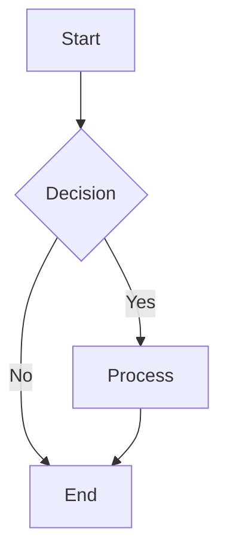

### Sequence Diagram
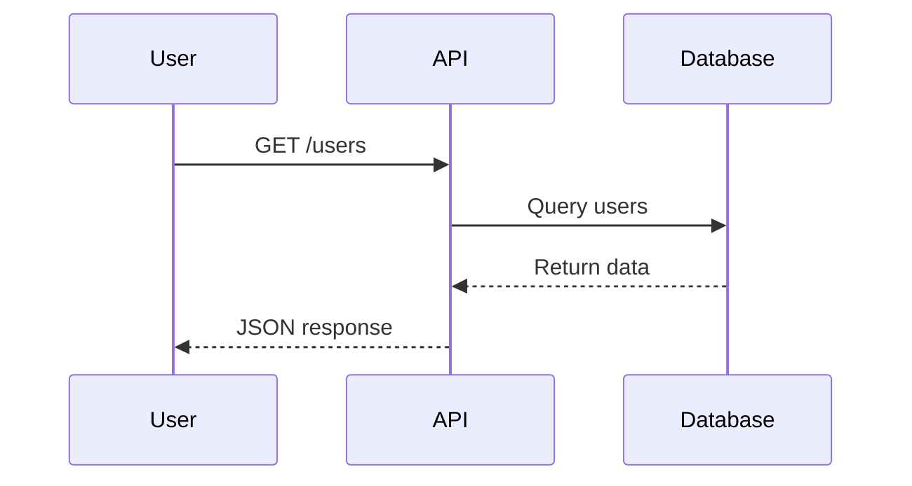

### Class Diagram
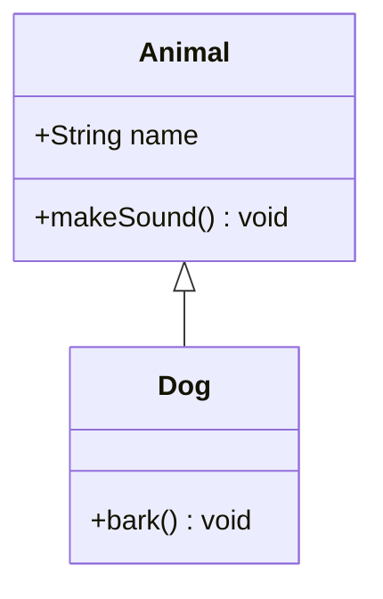

### State Diagram
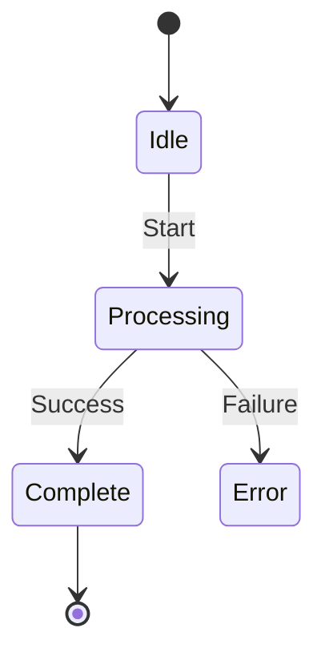

### Entity Relationship Diagram
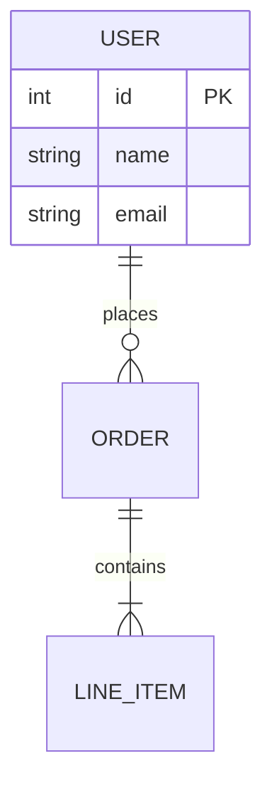

### Gantt Chart
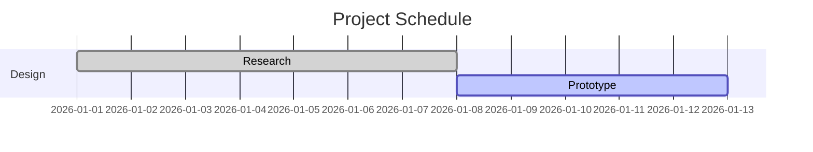

### Pie Chart
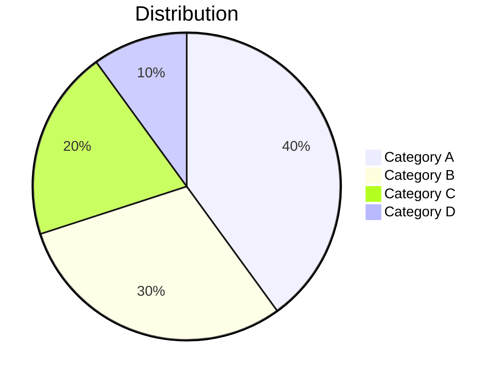

### Timeline
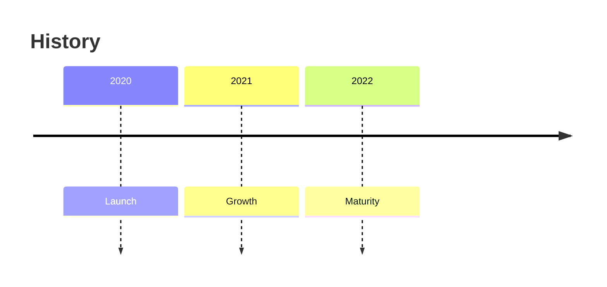

### Mindmap
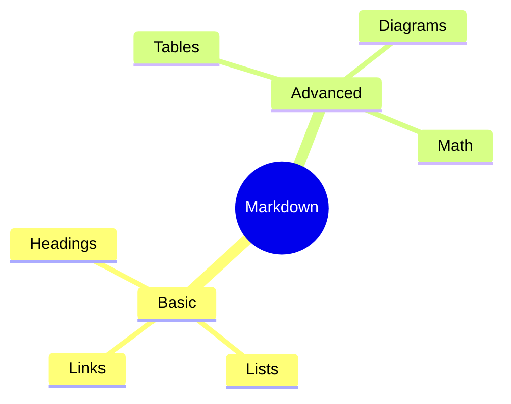

### Quadrant Chart
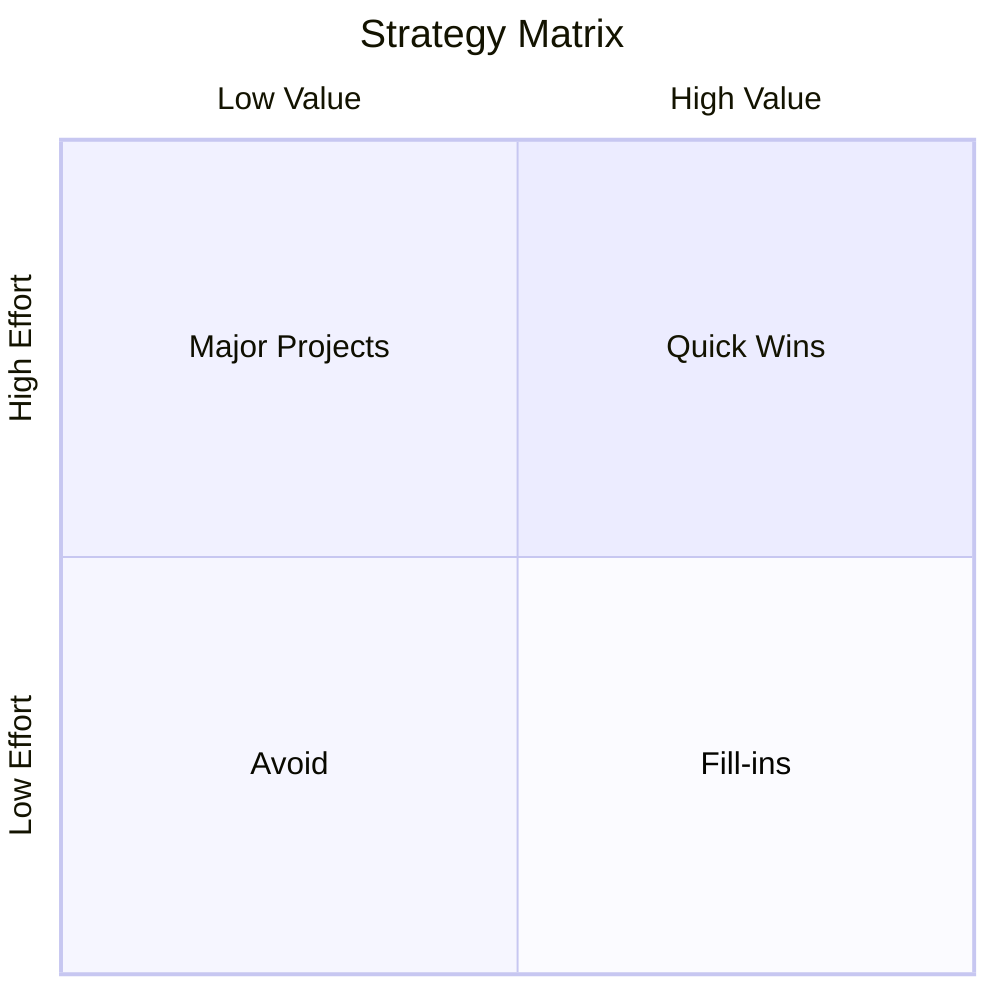

### Requirement Diagram
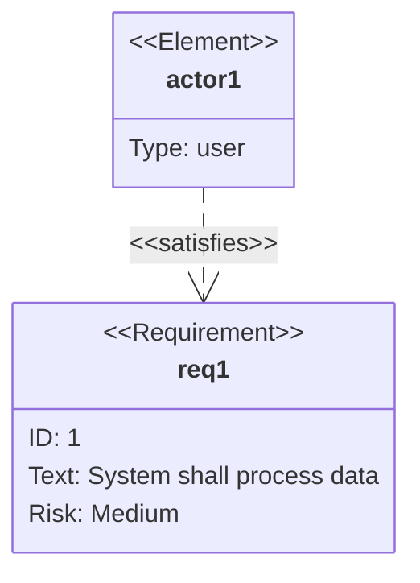

### Journey Diagram
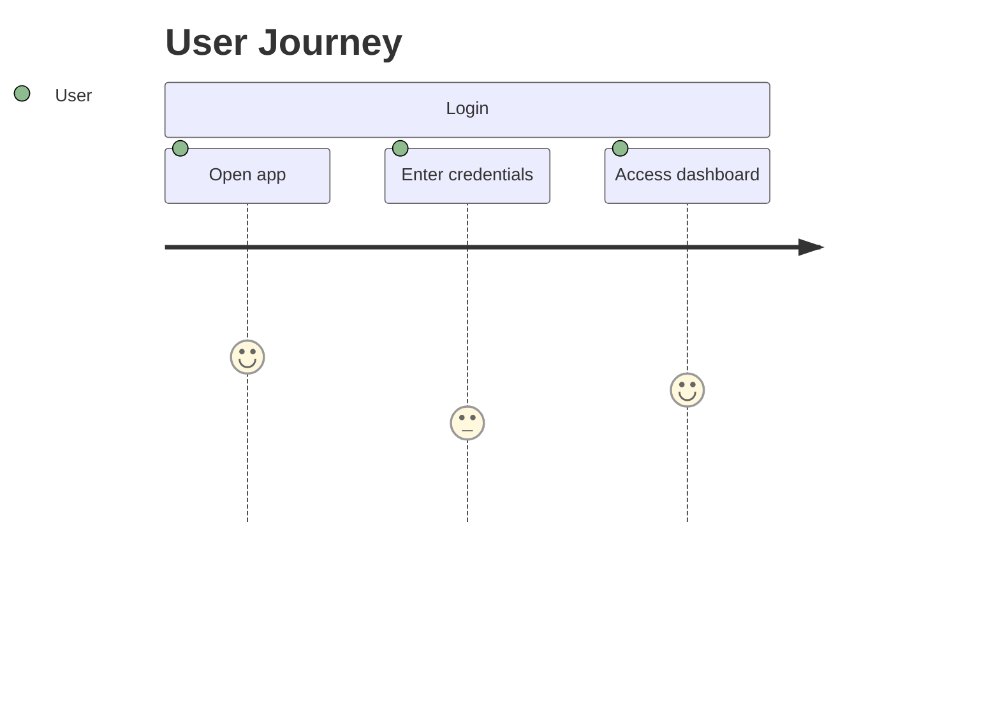

### C4 Diagram
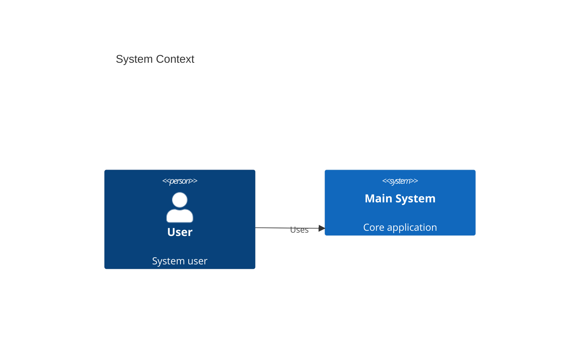

---

## 15. LATEX MATH

### Inline Math
```markdown
Einstein's famous equation: $E = mc^2$

The quadratic formula: $x = \frac{-b \pm \sqrt{b^2 - 4ac}}{2a}$
```

### Display/Block Math
```markdown
$$
\int_{a}^{b} f(x) \, dx = F(b) - F(a)
$$

$$
\sum_{n=1}^{\infty} \frac{1}{n^2} = \frac{\pi^2}{6}
$$

$$
\begin{pmatrix}
a & b \\
c & d
\end{pmatrix}
$$
```

### Common Math Notation

| Symbol | LaTeX | Symbol | LaTeX |
|--------|-------|--------|-------|
| $\alpha$ | `\alpha` | $\beta$ | `\beta` |
| $\gamma$ | `\gamma` | $\Delta$ | `\Delta` |
| $\pi$ | `\pi` | $\Sigma$ | `\Sigma` |
| $\mu$ | `\mu` | $\sigma$ | `\sigma` |
| $\infty$ | `\infty` | $\partial$ | `\partial` |
| $\rightarrow$ | `\rightarrow` | $\Rightarrow$ | `\Rightarrow` |
| $\times$ | `\times` | $\div$ | `\div` |
| $\pm$ | `\pm` | $\approx$ | `\approx` |
| $\neq$ | `\neq` | $\leq$ | `\leq` |
| $\geq$ | `\geq` | $\subset$ | `\subset` |
| $\subseteq$ | `\subseteq` | $\cup$ | `\cup` |
| $\cap$ | `\cap` | $\emptyset$ | `\emptyset` |
| $\forall$ | `\forall` | $\exists$ | `\exists` |
| $\in$ | `\in` | $\notin$ | `\notin` |
| $\sum$ | `\sum` | $\prod$ | `\prod` |
| $\int$ | `\int` | $\oint$ | `\oint` |
| $\sqrt{x}$ | `\sqrt{x}` | $\sqrt[n]{x}$ | `\sqrt[n]{x}` |
| $\frac{a}{b}$ | `\frac{a}{b}` | $\binom{n}{k}$ | `\binom{n}{k}` |
| $\hat{x}$ | `\hat{x}` | $\bar{x}$ | `\bar{x}` |
| $\tilde{x}$ | `\tilde{x}` | $\dot{x}$ | `\dot{x}` |

### Matrices
```markdown
$$
\begin{matrix}
1 & 2 \\
3 & 4
\end{matrix}
\quad
\begin{bmatrix}
1 & 2 \\
3 & 4
\end{bmatrix}
\quad
\begin{pmatrix}
1 & 2 \\
3 & 4
\end{pmatrix}
$$
```

### Multi-line Equations
```markdown
$$
\begin{aligned}
f(x) &= (a+b)^2 \\
     &= a^2 + 2ab + b^2
\end{aligned}
$$
```

---

## 16. KEYBOARD SHORTCUTS

### VS Code
| Action | Shortcut |
|--------|----------|
| Toggle bold | `Ctrl+B` |
| Toggle italic | `Ctrl+I` |
| Toggle code span | `` Ctrl+Shift+` `` |
| Toggle code block | `` Ctrl+Shift+K `` |
| Toggle comment | `Ctrl+/` |
| Increase heading level | `Ctrl+Shift+]` |
| Decrease heading level | `Ctrl+Shift+[` |
| Preview | `Ctrl+Shift+V` |
| Split editor | `Ctrl+K V` |
| Format document | `Shift+Alt+F` |
| Insert table | `Ctrl+Shift+T` |
| Insert link | `Ctrl+L` |
| Insert image | `Ctrl+Shift+I` |

### Typora
| Action | Shortcut |
|--------|----------|
| Bold | `Ctrl+B` |
| Italic | `Ctrl+I` |
| Code | `` Ctrl+Shift+` `` |
| Code block | `` Ctrl+Alt+` `` |
| Hyperlink | `Ctrl+K` |
| Image | `Ctrl+Shift+I` |
| Ordered list | `Ctrl+Shift+[` |
| Unordered list | `Ctrl+Shift+]` |
| Heading level | `Ctrl+1-6` |
| Table | `Ctrl+T` |
| Blockquote | `Ctrl+Shift+Q` |
| Horizontal rule | `Ctrl+Shift+-` |
| Switch source/preview | `Ctrl+/` |
| Outline | `Ctrl+Shift+O` |
| Strike | `Alt+Shift+5` |

### Obsidian
| Action | Shortcut |
|--------|----------|
| Bold | `Ctrl+B` |
| Italic | `Ctrl+I` |
| Toggle preview | `Ctrl+E` |
| Quick switcher | `Ctrl+O` |
| Search | `Ctrl+Shift+F` |
| Backlinks | `Ctrl+Shift+B` |
| Graph view | `Ctrl+G` |
| Command palette | `Ctrl+P` |
| Insert template | `Ctrl+Shift+T` |
| New note | `Ctrl+N` |
| Toggle checklist | `Ctrl+L` |
| Strikethrough | `Alt+Shift+S` |

### JetBrains IDEs (IntelliJ, WebStorm, PyCharm)
| Action | Shortcut |
|--------|----------|
| Bold | `Ctrl+B` |
| Italic | `Ctrl+I` |
| Strikethrough | `Alt+Shift+S` |
| Code | `` Ctrl+Shift+` `` |
| Code block | `` Ctrl+Alt+` `` |
| Link | `Ctrl+Shift+L` |
| Image | `Ctrl+Shift+I` |
| List item | `Ctrl+Shift+Plus` |
| Heading | `Ctrl+Alt+H` |
| Preview | `Ctrl+Shift+Q` |

---

## 17. ESCAPE CHARACTERS

Prefix special characters with `\` to render them literally:

```
\   backslash
`   backtick
*   asterisk
_   underscore
{}  curly braces
[]  square brackets
()  parentheses
#   hash
+   plus sign
-   minus sign (hyphen)
.   dot
!   exclamation mark
|   pipe
>   greater than
<   less than
~   tilde
```

---

## 18. SPECIAL CHARACTERS & ENTITIES

```html
&copy;    ©   copyright
&reg;     ®   registered
&trade;   ™   trademark
&nbsp;        non-breaking space
&lt;      <   less than
&gt;      >   greater than
&amp;     &   ampersand
&quot;    "   double quote
&apos;    '   apostrophe
&mdash;   —   em dash
&ndash;   –   en dash
&hellip;  …   ellipsis
&bull;    •   bullet
&rarr;    →   right arrow
&larr;    ←   left arrow
&uarr;    ↑   up arrow
&darr;    ↓   down arrow
```

---

## 19. COMMENTS

```markdown
<!-- HTML comment (visible in source, hidden in render) -->
[comment]: # (This is a Markdown comment in some flavors)
[//]: # (Another comment style used in GFM)
[comment]: <> (Yet another comment style)
```

---

## 20. MERMAID DIAGRAM QUICK REFERENCE

| Diagram Type | Keyword | Use Case |
|-------------|---------|----------|
| Flowchart | `graph` / `flowchart` | Process flows, workflows |
| Sequence | `sequenceDiagram` | API interactions, protocols |
| Class | `classDiagram` | OOP structures, data models |
| State | `stateDiagram-v2` | State machines, UI flows |
| ERD | `erDiagram` | Database schema, relationships |
| Gantt | `gantt` | Project schedules, timelines |
| Pie | `pie` | Data distribution, statistics |
| Timeline | `timeline` | Chronological events, roadmaps |
| Mindmap | `mindmap` | Brainstorming, content structure |
| Quadrant | `quadrantChart` | Prioritization, strategy |
| Requirement | `requirementDiagram` | Requirements engineering |
| Journey | `journey` | User experience mapping |
| C4 | `C4Context`, `C4Container`, `C4Component` | Software architecture |
| Block | `block-beta` | System architecture, infrastructure |
| Packet | `packet-beta` | Network protocol visualization |
| XY Chart | `xychart-beta` | Statistical charts, bar/line charts |
| Git Graph | `gitGraph` | Git branching visualization |
| Sankey | `sankey-beta` | Flow diagrams, energy/Data flow |

---

## 21. GITHUB FLAVORED MARKDOWN (GFM) EXTENSIONS

```markdown
<!-- Auto-link URLs -->
https://example.com automatically becomes a link

<!-- Strikethrough -->
~~strikethrough text~~

<!-- Tables -->
| Column 1 | Column 2 |
|----------|----------|

<!-- Task lists -->
- [x] Completed
- [ ] Todo

<!-- Emoji -->
:rocket: :+1: :smile:

<!-- Mention -->
@username

<!-- Issue/PR reference -->
#123, user/repo#456

<!-- SHA reference -->
abc123def456

<!-- Footnote -->
[^1]
```

---

## 22. COMMONMARK VS GFM QUICK COMPARISON

| Feature | CommonMark | GFM |
|---------|------------|-----|
| Tables | ❌ | ✅ |
| Strikethrough | ❌ | ✅ |
| Task lists | ❌ | ✅ |
| Auto-links | ❌ | ✅ |
| Emoji | ❌ | ✅ |
| Mentions | ❌ | ✅ |
| Footnotes | ❌ | ❌ (renders as plain text) |
| Definition lists | ❌ | ❌ |
| Math | ❌ | ❌ |
| Front matter | ❌ | ❌ |
| Fenced code blocks | ✅ | ✅ |
| Syntax highlighting | ❌ | ✅ |

---

## 23. FILE NAMING CONVENTIONS

```markdown
# Standard extensions
file.md         # Recommended (most common)
file.markdown   # Explicit alternative
file.mdown      # Legacy alternative

# Conventions
README.md       # Project entry point (always uppercase)
CONTRIBUTING.md # Contribution guide
CHANGELOG.md    # Version history
CODE_OF_CONDUCT.md
SECURITY.md
LICENSE.md
index.md        # Documentation site entry
```

---

<p align="center">
  <strong>Print this cheatsheet or bookmark it for quick reference.</strong>
</p>
