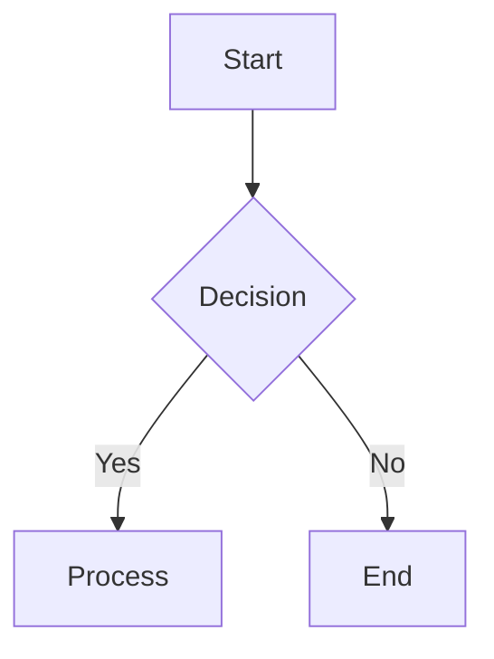
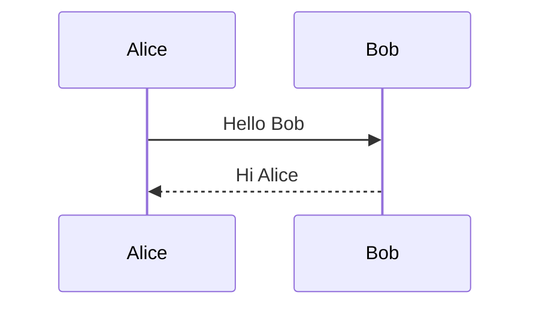
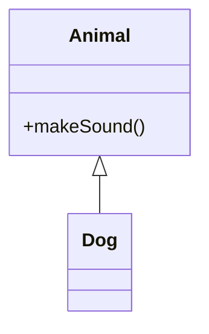
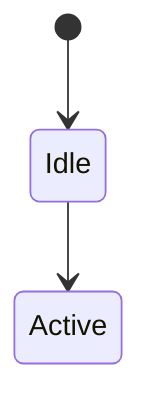
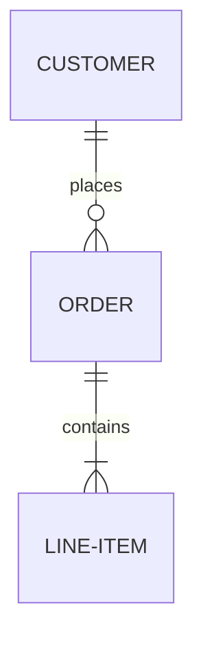
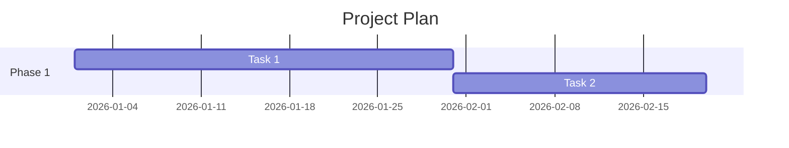
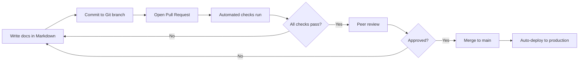
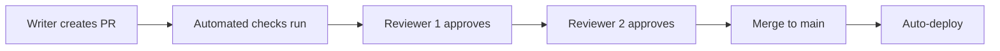
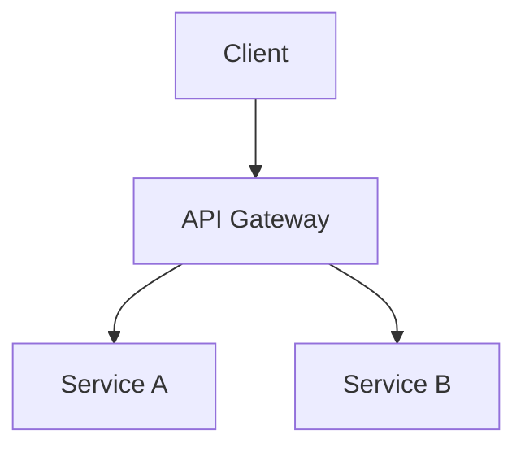
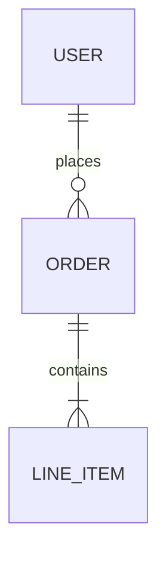

# Frequently Asked Questions

> Everything you've wondered about Markdown, answered.

---

## 1. What is Markdown?

**Markdown** is a lightweight markup language created by John Gruber and Aaron Swartz in 2004. It allows you to write formatted text using a plain-text editor, using simple punctuation and syntax conventions. The goal was to create a format that is easy to read and write in its raw form while being convertible to HTML and other formats.

At its core, Markdown replaces complex HTML tags with intuitive symbols:
- `**bold**` instead of `<strong>bold</strong>`
- `*italic*` instead of `<em>italic</em>`
- `# Heading` instead of `<h1>Heading</h1>`

Markdown has become the de facto standard for documentation across the software industry, used by GitHub, GitLab, Notion, Obsidian, Reddit, Discord, Stack Overflow, and thousands of other platforms and tools.

---

## 2. Why use Markdown?

Markdown offers several compelling advantages:

**1. Simplicity:** The syntax is intuitive and easy to learn. You can be productive in 15 minutes.

**2. Portability:** Markdown files are plain text. They work on any operating system, any editor, and any device. They play well with version control (Git diffs are readable).

**3. Future-proof:** Plain text will never become obsolete. Your Markdown files from 2004 will still be readable in 2100. Proprietary formats cannot make this guarantee.

**4. Universality:** Markdown is supported by virtually every developer tool, platform, and service. Write once, publish anywhere.

**5. Version control friendly:** Because Markdown is plain text, Git can track changes meaningfully. You can see exactly what changed in a document, who changed it, and when.

**6. Fast to write:** No mouse required. No formatting toolbar. No fighting with word processors. Your hands stay on the keyboard.

**7. Separation of content and presentation:** Focus on what you want to say, not how it looks. The styling is handled by themes and CSS.

**8. Extensibility:** Through flavors and extensions, Markdown can support tables, diagrams, math, code highlighting, and interactive components.

**9. Tooling ecosystem:** Linters, formatters, parsers, converters, static site generators, and more -- all built around Markdown.

**10. Community:** Millions of developers, writers, and creators use Markdown daily. Problems are well-documented and solutions are abundant.

---

## 3. Is Markdown better than HTML?

**They serve different purposes.** It is not a matter of better or worse -- it is about the right tool for the job.

**Use Markdown when:**
- Writing documentation, READMEs, blog posts
- Taking notes and building knowledge bases
- Creating content that needs to be readable in raw form
- Collaborating on text with non-developers
- Writing content for static site generators
- Quick formatting needs

**Use HTML when:**
- Building complex layouts (multiple columns, grids)
- Fine-grained control over styling
- Interactive elements (forms, complex embeds)
- Structural elements not available in Markdown (nav, aside, article)
- When you need precise positioning

**The best approach:** Use Markdown as your primary content format and drop into HTML for elements Markdown does not support. Most Markdown processors allow inline HTML.

---

## 4. What editor should I use?

The best Markdown editor depends on your needs:

### For Developers
| Editor | Best For |
|--------|----------|
| **VS Code** | Best all-around. Extensions: markdownlint, Prettier, Markdown Preview Enhanced, Mermaid Preview, yaml, GitLens |
| **JetBrains IDEs** | If you already use IntelliJ/WebStorm/PyCharm. Built-in Markdown support with preview |
| **Vim/Neovim** | Terminal-based editing, highly customizable. Plugins: vim-markdown, markdown-preview.nvim |
| **Emacs** | With markdown-mode, very powerful for long-form writing |

### For Writers
| Editor | Best For |
|--------|----------|
| **Typora** | Minimalist interface, seamless live preview (WYSIWYG-like). Best for distraction-free writing |
| **iA Writer** | Focus mode, beautiful typography, syntax highlighting. Good for long-form writing |
| **Ulysses** | Subscription-based, excellent for long documents, library management |
| **Bear** | Beautiful design, tagging system, notes organization (macOS only) |

### For Knowledge Management
| Editor | Best For |
|--------|----------|
| **Obsidian** | Local-first, graph view, backlinks, plugins, digital gardens. Best for personal knowledge bases |
| **Logseq** | Outliner-based, open-source, block-level references. Good for PKM and task management |
| **Notion** | All-in-one workspace with Markdown support via keyboard shortcuts |
| **Roam Research** | Bi-directional linking, block references. Good for networked thought |

### Minimal/Online
| Editor | Best For |
|--------|----------|
| **Dillinger** | Online Markdown editor with preview and export |
| **StackEdit** | Browser-based with Google Drive/Dropbox sync |
| **HackMD** | Collaborative real-time Markdown editing |
| **MarkdownPad** | Windows Markdown editor (legacy but reliable) |

### Recommendation for beginners
**Start with VS Code** (free, extensible, cross-platform) or **Typora** (beautiful, minimal). Move to **Obsidian** if you want to build a knowledge base.

---

## 5. What is the difference between Markdown flavors?

Markdown flavors are different implementations/extensions of the original Markdown specification. The original Markdown (2004) was loosely specified, leading to many incompatible implementations. Here are the major flavors:

### CommonMark
- **Status:** Standardized specification (v0.31.2)
- **Goals:** Eliminate ambiguity, provide comprehensive test suite
- **Key features:** Strict specification, fenced code blocks, many edge cases defined
- **Missing:** Tables, footnotes, task lists, strikethrough, emoji, auto-links
- **Used by:** Discourse, Reddit, many parsers (cmark, markdown-it)

### GFM (GitHub Flavored Markdown)
- **Base:** CommonMark + extensions
- **Key additions:** Tables, strikethrough, task lists, auto-links, emoji, mentions, issue references
- **Used by:** GitHub, GitLab, Bitbucket, many developer tools
- **Spec:** github.github.com/gfm

### MultiMarkdown
- **Key additions:** Footnotes, tables, citations, math, metadata, cross-references, glossary, file transclusion
- **Best for:** Academic writing, complex documents

### Pandoc Markdown
- **Key additions:** Everything. Citations, math, tables, footnotes, divs, spans, raw attributes, yaml metadata
- **Best for:** Document conversion (Pandoc supports 40+ formats)

### MDX
- **Key addition:** JSX in Markdown (React components)
- **Best for:** React-powered documentation sites
- **Used by:** Docusaurus, Next.js, Storybook

### RMarkdown
- **Key additions:** Executable code chunks (R, Python, SQL), dynamic reports
- **Best for:** Data science, reproducible research

### Markdown Extra
- **Key additions:** Tables, definition lists, footnotes, abbreviations, fenced code blocks
- **Used by:** PHP Markdown Extra

### Choosing a flavor
- **For GitHub/GitLab projects:** GFM
- **For documentation sites:** CommonMark + your SSG's extensions
- **For academic publishing:** Pandoc Markdown or MultiMarkdown
- **For React docs:** MDX
- **For data science:** RMarkdown or Quarto

---

## 6. How do I create a table of contents?

### Automatic TOC (flavor-dependent)

In some environments, `[TOC]` or `[[_TOC_]]` generates a table of contents automatically:

```markdown
[TOC]

## Section 1
Content...

## Section 2
Content...
```

This works in: GitLab, Typora, Obsidian, some MkDocs themes.

### Manual TOC

Create links to each heading anchor:

```markdown
## Table of Contents
- [Introduction](#introduction)
- [Installation](#installation)
- [Usage](#usage)
  - [Basic Usage](#basic-usage)
  - [Advanced Usage](#advanced-usage)
- [API Reference](#api-reference)
- [Contributing](#contributing)
- [License](#license)
```

GitHub and most platforms auto-generate anchor IDs from headings (lowercase, hyphens for spaces, remove punctuation).

### HTML Details/Summary TOC

For collapsible TOCs:

```html
<details>
  <summary>Table of Contents</summary>
  - [Introduction](#introduction)
  - [Installation](#installation)
  - [Usage](#usage)
</details>
```

### SSG-Generated TOC (Docusaurus, MkDocs, Hugo)

Configure your static site generator to auto-generate a sidebar or TOC from your heading structure. Example (MkDocs):

```yaml
# mkdocs.yml
markdown_extensions:
  - toc:
      permalink: true
```

### JavaScript TOC

For custom HTML pages, use a library like `tocbot`:

```html
<script src="https://cdn.jsdelivr.net/npm/tocbot@4"></script>
<div class="toc"></div>
<script>
  tocbot.init({ tocSelector: '.toc', contentSelector: '.content', headingSelector: 'h2, h3' });
</script>
```

---

## 7. Can I use Markdown for books?

**Absolutely.** Many authors and publishers use Markdown as their primary writing format for books.

### Tools for book writing
- **Pandoc:** Convert Markdown to PDF, EPUB, MOBI, DOCX, LaTeX, HTML
- **Leanpub:** Publishing platform that accepts Markdown, generates PDF, EPUB, MOBI
- **Bookdown:** R package for writing books with Markdown, great for technical books
- **GitBook:** Platform for writing and hosting books from Markdown
- **mdBook:** Rust tool for creating books from Markdown files
- **Softcover:** Polyglot book publishing system using Markdown

### Book workflow example (Pandoc)
```
pandoc manuscript.md \
  --from markdown \
  --to pdf \
  --output book.pdf \
  --pdf-engine=xelatex \
  --template=template.tex \
  --toc
```

### Book structure
```
my-book/
+-- book.md              # Book metadata (title, author, ISBN)
+-- preface.md
+-- chapter-01.md
+-- chapter-02.md
+-- chapter-03.md
+-- appendix-a.md
+-- references.md
+-- images/
    +-- figure-01.png
    +-- figure-02.png
```

### Markdown extensions useful for books
- Footnotes for endnotes
- Cross-references between chapters
- Citations and bibliography (via Pandoc)
- Index generation
- LaTeX math for equations
- Image captions and cross-references

### Limitations
- Complex page layout (margins, headers, footers) requires LaTeX templates
- Fine typographic control needs custom CSS or LaTeX
- Index generation varies by tool
- Tables of figures and lists of tables are tool-specific

---

## 8. How do I add images?

### Basic image
```markdown

```

### Image with title (tooltip)
```markdown

```

### Reference-style image
```markdown
![Alt text][image-ref]

[image-ref]: path/to/image.png "Optional title"
```

### Clickable image (image within a link)
```markdown
[](https://example.com)
```

### Image with custom size (HTML)
```markdown


```

### Image alignment (HTML)
```markdown
<!-- Center -->
<p align="center">
  
</p>

<!-- Right align -->

```

### Image with caption
```markdown
<figure>
  
  <figcaption>Figure 1: System Architecture</figcaption>
</figure>
```

### SVG images
```markdown
<!-- As file -->


<!-- Inline SVG -->
<svg viewBox="0 0 100 100">
  <circle cx="50" cy="50" r="40" fill="#4CAF50"/>
</svg>
```

### Image best practices
1. **Always include alt text** for accessibility
2. **Optimize images** before adding (compress PNGs, convert to WebP)
3. **Use relative paths** for local images in documentation repos
4. **Consider lazy loading** for large documentation sites
5. **Use SVGs for diagrams** -- they scale perfectly
6. **Avoid relying on external image hosts** that may go down
7. **Include image dimensions** to prevent layout shifts

---

## 9. How do I create diagrams?

With **Mermaid**, you can create diagrams directly in Markdown code blocks:

### Flowchart


### Sequence diagram


### Class diagram


### State diagram


### ER diagram


### Gantt chart


### How to enable Mermaid
- **GitHub:** Works automatically in Markdown code blocks with ``` ```mermaid ```
- **VS Code:** Install "Markdown Preview Mermaid Support" extension
- **Docusaurus:** Install `@docusaurus/theme-mermaid` and enable in config
- **MkDocs:** Install `mkdocs-mermaid2-plugin`
- **Obsidian:** Works natively with the Mermaid plugin

### Alternative diagram tools
- **PlantUML:** More UML-focused, uses text descriptions
- **Graphviz/DOT:** Powerful graph visualization, steeper learning curve
- **ASCII diagrams:** Tools like Monodraw, asciiflow for terminal-friendly diagrams
- **Excalidraw:** Hand-drawn style diagrams, export as images
- **Draw.io / diagrams.net:** GUI-based, embed as images

---

## 10. Can I use Markdown with React?

**Yes, primarily through MDX (Markdown + JSX).** MDX allows you to import and use React components directly within Markdown files.

### MDX Example
```mdx
import { Chart } from '../components/Chart'

# Sales Report

Here is our monthly sales data:

<Chart data={salesData} type="bar" />

| Month | Revenue |
|-------|---------|
| Jan   | $10,000 |
| Feb   | $12,500 |
```

### Setting up MDX

**With Next.js:**
```bash
npm install @next/mdx @mdx-js/loader @mdx-js/react
```

**With Docusaurus:**
MDX works out of the box with Docusaurus.

**With Vite:**
```bash
npm install @mdx-js/rollup
```

### Custom MDX components

```mdx
import { CodePen, VideoPlayer, InfoBox } from '../components'

# Interactive Tutorial

<InfoBox type="warning">
  This requires Node.js 18+
</InfoBox>

Check out this demo:

<CodePen id="abc123" height="400" />
```

### MDX limitations
- Cannot use Markdown syntax inside JSX blocks
- Must export only one default component per file
- Not all Markdown processors support MDX
- Requires a build step

---

## 11. How do I deploy a documentation site?

### Option 1: GitHub Pages (free)
```yaml
# .github/workflows/deploy-docs.yml
name: Deploy Documentation
on:
  push:
    branches: [main]
jobs:
  deploy:
    runs-on: ubuntu-latest
    steps:
      - uses: actions/checkout@v4
      - uses: actions/setup-node@v4
      - run: npm install && npm run build
      - uses: peaceiris/actions-gh-pages@v3
        with:
          github_token: ${{ secrets.GITHUB_TOKEN }}
          publish_dir: ./build
```

### Option 2: Netlify
- Connect your Git repository to Netlify
- Set build command: `npm run build`
- Set publish directory: `build/` or `public/`
- Netlify auto-deploys on every push

### Option 3: Vercel
- Import your Git repository to Vercel
- Framework preset: Docusaurus, Next.js, or Hugo
- Auto-deploys with preview URLs for every PR

### Option 4: Cloudflare Pages
- Connect your Git repository
- Set build configuration
- Automatic HTTPS, global CDN

### Option 5: ReadTheDocs
- Push your MkDocs or Sphinx project to GitHub
- Import on readthedocs.io
- Automatic builds from your repository

### Deployment checklist
- [ ] Build succeeds locally
- [ ] All links are valid
- [ ] Search works
- [ ] Custom domain configured
- [ ] HTTPS enabled
- [ ] Redirects configured (if applicable)
- [ ] Analytics installed
- [ ] Sitemap generated
- [ ] `robots.txt` configured
- [ ] 404 page customized

---

## 12. What is MDX?

**MDX** is a format that combines Markdown and JSX (JavaScript XML). It allows you to write Markdown content while importing and using React components inline.

### What makes MDX special?

```mdx
import { YouTube, CodeSandbox } from '../components'

# Interactive Tutorial

Watch this introduction:

<YouTube id="dQw4w9WgXcQ" />

Then try the exercise:

<CodeSandbox id="example-sandbox" />
```

### Key concepts
- **Markdown syntax works as expected:** Headings, lists, links, tables, etc.
- **Import statements:** Import React components at the top of the file
- **JSX expressions:** Use components with props directly in the content
- **Export statements:** Export components or metadata from MDX files

### Where MDX is used
- **Docusaurus:** Primary content format (v2+)
- **Next.js:** Via `@next/mdx` plugin
- **Storybook:** For documentation stories
- **Gatsby:** Via `gatsby-plugin-mdx`
- **Contentlayer:** For content management

### MDX vs regular Markdown
| Feature | Markdown | MDX |
|---------|----------|-----|
| React components | No | Yes |
| Import/export | No | Yes |
| JSX expressions | No | Yes |
| Simple syntax | Yes | Yes |
| Universal support | Yes | Limited |

---

## 13. How do I contribute to open-source documentation?

### Step 1: Find a project
- Look for repositories with labels like `docs`, `documentation`, `good first issue`
- Check the project's README for contribution guidelines
- Start with projects you already use

### Step 2: Understand the contribution process
- Read `CONTRIBUTING.md`
- Check the project's code of conduct
- Understand the documentation structure
- Look at existing docs for style and tone

### Step 3: Make your contribution
1. Fork the repository
2. Clone your fork: `git clone https://github.com/YOUR_USERNAME/PROJECT.git`
3. Create a branch: `git checkout -b docs/improve-readme`
4. Make your changes
5. Preview the changes locally
6. Commit: `git commit -m "docs: improve README with better examples"`
7. Push: `git push origin docs/improve-readme`
8. Open a pull request

### Step 4: Follow best practices
- **Keep changes focused:** One topic per PR
- **Follow existing style:** Match the tone and formatting of existing docs
- **Preview locally:** Build the docs to check for errors
- **Be responsive:** Answer reviewer questions promptly
- **Be open to feedback:** Documentation is subjective

### Common doc contributions
- Fixing typos and grammar
- Adding code examples
- Improving unclear instructions
- Adding missing sections
- Updating outdated information
- Adding translations
- Improving accessibility

---

## 14. Is Markdown good for API documentation?

**Yes, Markdown is excellent for API documentation, especially when combined with OpenAPI/Swagger.**

### Approaches to API documentation

**Approach 1: OpenAPI + Markdown (Recommended)**
```yaml
# openapi.yaml
openapi: 3.1.0
info:
  title: My API
  version: 1.0.0
  description: |
    # Overview
    This is the API for **My Service**.
    
    ## Authentication
    Use API keys via the `Authorization` header.
paths:
  /users:
    get:
      summary: List all users
      description: |
        Returns a paginated list of users.
        
        > **Note:** Requires admin permissions.
```

**Approach 2: Hand-written API docs in Markdown**
```markdown
# Users API

## List Users

`GET /api/v1/users`

Retrieves a paginated list of users.

### Parameters

| Name | Type | Required | Description |
|------|------|----------|-------------|
| page | integer | No | Page number (default: 1) |
| limit | integer | No | Items per page (default: 20) |
| sort | string | No | Sort field (name, email, created_at) |

### Response

```json
{
  "data": [
    {
      "id": 1,
      "name": "John Doe",
      "email": "john@example.com"
    }
  ],
  "meta": {
    "page": 1,
    "total": 100
  }
}
```

### Error Codes
| Code | Description |
|------|-------------|
| 400 | Invalid parameters |
| 401 | Unauthenticated |
| 403 | Forbidden |
| 404 | Not found |
| 429 | Rate limited |
```

### Tools for API documentation
- **Swagger UI:** Renders OpenAPI specs as interactive docs
- **Redoc:** Beautiful single-page API documentation from OpenAPI
- **Stoplight:** Visual API design and documentation
- **Docusaurus:** With `docusaurus-plugin-openapi-docs`
- **MkDocs:** With `mkdocs-plugin-openapi`

---

## 15. How do I handle large documentation projects?

### Strategy 1: Information Architecture
Plan your documentation structure before writing:

```
docs/
+-- index.md                    # Home page
+-- getting-started/
|   +-- index.md
|   +-- installation.md
|   +-- quickstart.md
+-- guides/
|   +-- index.md
|   +-- basic-usage.md
|   +-- advanced-config.md
+-- reference/
|   +-- api.md
|   +-- cli.md
|   +-- configuration.md
+-- tutorials/
|   +-- project-setup.md
|   +-- deployment.md
+-- contributing.md
+-- faq.md
```

### Strategy 2: Consistent Front Matter
Use structured front matter for all documents:
```yaml
---
title: Installation Guide
description: How to install and configure the product
weight: 10
category: getting-started
tags:
  - installation
  - setup
  - configuration
version: 2.0
---
```

### Strategy 3: Reusable Content
Use includes and snippets to avoid duplication:
```markdown
<!-- Docusaurus/MkDocs include -->


<!-- Pandoc include -->

```

### Strategy 4: Versioning
```yaml
# Docusaurus versioned_docs
docs/
+-- version-1.0/
+-- version-2.0/
+-- version-3.0/
docs/  # Current version
```

### Strategy 5: Automation
- Auto-generate API docs from code comments
- Auto-generate changelogs from commits
- Auto-generate navigation from folder structure
- Auto-check links weekly
- Auto-check spelling on every PR

### Strategy 6: Documentation reviews
- Treat docs like code: review, test, approve
- Use pull requests for all doc changes
- Assign documentation owners per section
- Schedule regular doc audits (quarterly)

---

## 16. What is Docs as Code?

**Docs as Code (DaC)** is a philosophy that applies software engineering practices to documentation. The core idea: treat documentation with the same rigor as code.

### Key principles

**1. Version Control:** Store documentation in Git alongside (or in) the code repository.

**2. Code Review:** All documentation changes go through pull request review, just like code changes.

**3. Automated Testing:** Check links, spelling, grammar, and style automatically in CI/CD pipelines.

**4. Continuous Deployment:** Publish documentation automatically when changes are merged.

**5. Issue Tracking:** Track documentation issues in the same system as code issues.

**6. Agile Practices:** Write documentation iteratively, prioritize based on user needs.

### Docs as Code workflow



### Benefits
- Documentation is always up to date with code
- Changes are reviewable and auditable
- Quality improves through automated checks
- Teams collaborate effectively on docs
- Documentation becomes a first-class citizen

---

## 17. How do I test documentation?

### Link checking
```bash
# lychee (fast, async, Rust-based)
lychee --no-ignore --exclude-mail -- docs/ README.md

# broken-link-checker (Node.js)
blc --recursive --filter-level 3 https://your-site.com

# htmlproofer (Ruby, for Jekyll)
htmlproofer --check-html --check-opengraph ./_site
```

### Spell checking
```bash
# cspell (Node.js)
cspell --config .cspell.json "docs/**/*.md"

# codespell (Python)
codespell docs/ --skip="*.png,*.jpg"

# hunspell
hunspell -d en_US -p .hunspell_dict docs/*.md
```

### Prose linting
```bash
# Vale (Go-based, powerful)
vale --config .vale.ini docs/

# write-good (Node.js, simplicity-focused)
write-good docs/**/*.md

# Alex (catches insensitive language)
alex docs/
```

### Grammar checking
```bash
# LanguageTool API
curl -d "language=en-US" -d "text=Your text here" https://api.languagetool.org/v2/check
```

### Markdown linting
```bash
# markdownlint
markdownlint --config .markdownlint.json docs/

# remark-lint
npx remark --use remark-lint docs/
```

### CI/CD integration (GitHub Actions example)
```yaml
name: Documentation QA
on: [pull_request]
jobs:
  check:
    runs-on: ubuntu-latest
    steps:
      - uses: actions/checkout@v4
      - name: Check links
        uses: lycheeverse/lychee-action@v1
        with:
          args: --no-ignore docs/ README.md
      - name: Spell check
        uses: streetsidesoftware/cspell-action@v5
      - name: Markdown lint
        uses: DavidAnson/markdownlint-cli2-action@v16
```

---

## 18. How do I version documentation?

### Strategy 1: Docusaurus Versioning (Built-in)
```bash
# Create a new version (snapshot of current docs)
npm run docusaurus docs:version 1.0.0

# Directory structure
versioned_docs/
+-- version-1.0.0/
|   +-- getting-started.md
|   +-- installation.md
+-- version-2.0.0/
    +-- getting-started.md
    +-- installation.md

# Current docs (next release)
docs/
+-- getting-started.md
+-- installation.md
```

### Strategy 2: Branch-based versioning
```bash
main/          # Current development
v1.0/          # v1.0 documentation branch
v2.0/          # v2.0 documentation branch
```

### Strategy 3: Folder-based versioning (MkDocs)
```yaml
# mkdocs.yml with mike (versioned docs plugin)
plugins:
  - mike:
      version_selector: true
```

### Strategy 4: Subdomain versioning
```
v1.docs.example.com
v2.docs.example.com
docs.example.com  (latest)
```

### Strategy 5: Tag-based versioning
```yaml
# In front matter
---
version:
  api: 2.1.0
  docs: 1.0.0
  status: stable
---
```

### Best practices
- Version docs when the product/API changes in breaking ways
- Keep at most 3 major versions active
- Clearly label which version a reader is viewing
- Redirect old versions to latest when possible
- Archive truly ancient versions with a notice

---

## 19. Can I use Markdown for note-taking?

**Absolutely. Markdown is arguably the best format for note-taking.**

### Popular Markdown note-taking apps

| App | Style | Best For |
|-----|-------|----------|
| **Obsidian** | Local first, graph view | Personal knowledge management, Zettelkasten |
| **Logseq** | Outliner-based, block references | Task management, daily journaling |
| **Notion** | All-in-one workspace | Team notes, project management |
| **Bear** | Beautiful design, tagging | Quick notes, writing (macOS) |
| **Standard Notes** | Encrypted, cross-platform | Private, secure note-taking |
| **Joplin** | Open-source, sync capable | Feature-rich, self-hosted notes |
| **Workflowy** | Infinite nested lists | Hierarchical note-taking |
| **Dendron** | Hierarchical, VS Code extension | Developer notes, structured knowledge |

### Note-taking best practices

**Structure:**
- Use folders for broad categories
- Use tags for cross-cutting concerns
- Use links (`[[wiki links]]` in Obsidian) to connect related notes
- Keep notes focused on a single topic
- Use templates for consistency

**Workflow:**
```markdown
# Meeting Notes - Project Kickoff
Date: 2026-01-15
Attendees: Alice, Bob, Charlie

## Agenda
- [x] Project timeline review
- [ ] Resource allocation
- [ ] Risk assessment

## Notes
- Project starts Feb 1
- Team of 5 engineers
- See [[Project Charter]] for details

## Action Items
- [ ] Alice: Send project charter by EOD
- [ ] Bob: Schedule follow-up meeting
- [ ] Charlie: Prepare risk assessment template
```

### Knowledge management techniques
- **Zettelkasten:** One idea per note, densely linked
- **PARA method:** Projects, Areas, Resources, Archives
- **MOC (Map of Content):** Index notes that link to other notes
- **Daily notes:** Capture thoughts, then process into permanent notes
- **Progressive summarization:** Highlight key points, summarize, remix

---

## 20. What is a digital garden?

A **digital garden** is a collection of notes, ideas, and writings that grow organically over time. Unlike a blog (polished, chronological), a digital garden is:
- **Imperfect:** Notes are published in various stages of completion
- **Interconnected:** Every note links to related notes
- **Evolving:** Content is continuously updated and refined
- **Non-linear:** Readers explore through links, not chronology

### Characteristics of a digital garden
```
Personal, imperfect, and growing
Not polished like a blog
Densely linked (like Wikipedia)
Organized by topic, not date
Seeds (ideas) -> Sprouts (drafts) -> Evergreens (mature)
```

### Tools for digital gardens
- **Obsidian + Obsidian Publish:** Most popular combination
- **Foam:** VS Code-based, free, open-source
- **Gatsby Digital Garden:** React-based, customizable
- **Quartz:** Publish Obsidian vault as a website
- **MkDocs + Material:** Documentation-style garden
- **TiddlyWiki:** Single-file wiki

### Structure example
```
garden/
+-- _index.md              # Garden home page
+-- evergreen/
|   +-- what-is-markdown.md
|   +-- docs-as-code.md
+-- seedlings/
|   +-- mermaid-diagrams.md
|   +-- mdx-patterns.md
+-- topics/
|   +-- documentation.md   # MOC for documentation topic
|   +-- markdown.md        # MOC for markdown topic
+-- daily/
    +-- 2026-01-15.md
```

### Bi-directional linking
Digital gardens rely on bi-directional links:
```markdown
# Docs as Code
Docs as Code applies [[Software Engineering]] practices to documentation.
It involves [[CI/CD]], [[Version Control]], and [[Automated Testing]].

# Software Engineering
See also: [[Docs as Code]], [[CI/CD]], [[Version Control]]
```

---

## 21. What is the best Markdown linter configuration?

A solid starting point for `.markdownlint.json`:

```json
{
  "MD013": { "line_length": 120 },
  "MD024": { "allow_different_nesting": true },
  "MD033": false,
  "MD041": false,
  "MD046": { "style": "fenced" }
}
```

### Key rules explained

| Rule | Description | Recommendation |
|------|-------------|----------------|
| MD001 | Heading increment | Enable |
| MD012 | Multiple consecutive blank lines | Enable |
| MD013 | Line length | 80-120 chars |
| MD014 | Dollar signs in code | Disable |
| MD018 | Space after hash | Enable |
| MD022 | Blank lines around headings | Enable |
| MD024 | Duplicate headings | Allow with different nesting |
| MD025 | Single H1 | Disable for docs sites |
| MD026 | Trailing punctuation in headings | Disable |
| MD029 | Ordered list prefix | Enable |
| MD033 | Inline HTML | Enable or disable per project |
| MD034 | Bare URLs | Enable |
| MD036 | Emphasis as heading | Enable |
| MD041 | First line heading | Disable for front matter |
| MD046 | Code block style | Fenced preferred |

---

## 22. How do I format code blocks with syntax highlighting?

Use fenced code blocks with a language specifier:

```markdown
```python
def hello(name):
    print(f"Hello, {name}!")
```

```javascript
const hello = (name) => console.log(`Hello, ${name}!`);
```

```json
{
  "name": "example",
  "version": "1.0.0"
}
```

```bash
npm install --save-dev markdownlint
```
```

### Common language specifiers
| Language | Specifier | Language | Specifier |
|----------|-----------|----------|-----------|
| JavaScript | `js` / `javascript` | TypeScript | `ts` / `typescript` |
| Python | `py` / `python` | HTML | `html` |
| CSS | `css` | SCSS | `scss` |
| Bash | `bash` / `sh` / `shell` | JSON | `json` |
| YAML | `yaml` / `yml` | XML | `xml` |
| SQL | `sql` | Java | `java` |
| C++ | `cpp` / `c++` | C | `c` |
| Rust | `rust` / `rs` | Go | `go` |
| Ruby | `rb` / `ruby` | PHP | `php` |
| Swift | `swift` | Kotlin | `kt` / `kotlin` |
| Diff | `diff` / `patch` | Docker | `dockerfile` |
| GraphQL | `graphql` | Markdown | `md` / `markdown` |

### Advanced code block features
```markdown
```python {linenos=table, hl_lines=[2-3], title="example.py"}
def greet(name):
    print(f"Hello, {name}!")
    return True
```
```

---

## 23. How do I create a documentation site from Markdown?

### Step-by-step guide

**Step 1: Choose a static site generator**
- **Docusaurus** (React): Best for product documentation, feature-rich
- **MkDocs** (Python): Simplest setup, great for small-medium projects
- **Hugo** (Go): Fastest build times, flexible templates
- **VitePress** (Vue): Modern, fast, minimal

**Step 2: Initialize your project**

For Docusaurus:
```bash
npx create-docusaurus@latest my-docs classic
cd my-docs
npm start
```

For MkDocs:
```bash
pip install mkdocs mkdocs-material
mkdocs new my-docs
cd my-docs
mkdocs serve
```

**Step 3: Structure your content**
```
my-docs/
+-- docs/
|   +-- index.md
|   +-- getting-started.md
|   +-- guides/
|   |   +-- installation.md
|   |   +-- configuration.md
|   +-- api/
|       +-- endpoints.md
+-- sidebars.js  (or mkdocs.yml)
+-- docusaurus.config.js
```

**Step 4: Add navigation**
Configure your sidebar/navigation in `sidebars.js` or `mkdocs.yml`.

**Step 5: Add search**
- Docusaurus: Built-in Algolia DocSearch
- MkDocs Material: Built-in search with highlighting

**Step 6: Customize the theme**
Configure colors, fonts, logo, footer in your SSG config.

**Step 7: Deploy**
Use GitHub Pages, Netlify, Vercel, or Cloudflare Pages.

---

## 24. How do I use Markdown with LaTeX math?

### Inline math
```markdown
Einstein's equation: $E = mc^2$

The quadratic formula: $x = \frac{-b \pm \sqrt{b^2 - 4ac}}{2a}$
```

### Display/block math
```markdown
$$
\int_{a}^{b} f(x) \, dx = F(b) - F(a)
$$

$$
\sum_{n=1}^{\infty} \frac{1}{n^2} = \frac{\pi^2}{6}
$$
```

### Setting up math rendering

**GitHub:** Does not natively render LaTeX. Use an image-based approach or browser extension.

**Docusaurus:** Install `remark-math` and `rehype-katex`:
```bash
npm install remark-math rehype-katex
```
```js
// docusaurus.config.js
remarkPlugins: [require('remark-math')],
rehypePlugins: [require('rehype-katex')],
```

**MkDocs:** Use `mkdocs-katex` plugin:
```yaml
plugins:
  - search
  - mkdocs-katex
```

**Obsidian:** Native math rendering with $$ delimiters, no setup needed.

**General web:** Include KaTeX or MathJax CDN:
```html
<link rel="stylesheet" href="https://cdn.jsdelivr.net/npm/katex@0.16.0/dist/katex.min.css">
<script src="https://cdn.jsdelivr.net/npm/katex@0.16.0/dist/katex.min.js"></script>
<script src="https://cdn.jsdelivr.net/npm/katex@0.16.0/dist/contrib/auto-render.min.js"></script>
```

---

## 25. How do I handle Markdown in monorepos?

### Strategy 1: Centralized documentation
```
my-monorepo/
+-- docs/                  # Single docs directory
|   +-- index.md
|   +-- getting-started.md
|   +-- packages/
|       +-- package-a.md
|       +-- package-b.md
+-- packages/
    +-- package-a/
    +-- package-b/
```

**Pros:** Single source of truth, easy to manage
**Cons:** Docs may get out of sync with packages

### Strategy 2: Distributed documentation
```
my-monorepo/
+-- packages/
    +-- package-a/
    |   +-- README.md
    |   +-- docs/
    |       +-- api.md
    |       +-- usage.md
    +-- package-b/
        +-- README.md
        +-- docs/
            +-- api.md
            +-- usage.md
```

**Pros:** Docs live next to code, always in sync
**Cons:** Harder to get a unified view

### Strategy 3: Documentation site aggregator
```
my-monorepo/
+-- website/               # Docusaurus site
|   +-- docs/
|   |   +-- index.md
|   |   +-- package-a.api.md  # Generated
|   |   +-- package-b.api.md  # Generated
|   +-- sidebars.js
+-- packages/
    +-- package-a/
    +-- package-b/
```

**Pros:** Centralized site with auto-generated content
**Cons:** Requires build tooling to aggregate

### Monorepo tooling for docs
- **Nx:** `nx show projects --with-docs`
- **Turborepo:** Pipeline tasks for documentation
- **Lerna:** Package-level docs
- **Changesets:** Automated changelogs

---

## 26. How do I write a good README?

A great README follows a proven structure:

```markdown
# Project Name

[]
[]
[]

## Description

A clear, concise description of what this project does and why it exists.
One paragraph is usually enough.

## Features

- Feature 1 with brief description
- Feature 2 with brief description
- Feature 3 with brief description

## Installation

```bash
npm install my-project
# or
yarn add my-project
```

## Quick Start

```javascript
import { myFunction } from 'my-project'

const result = myFunction({ option: 'value' })
console.log(result)
```

## Usage

[Detailed usage instructions with examples]

## API Reference

[API documentation with parameters and return values]

## Contributing

See [CONTRIBUTING.md](CONTRIBUTING.md)

## License

MIT

## Support

[Link to issues, discussions, or support channels]
```

### README best practices
1. **One H1:** The project name. Use it once.
2. **Badges first:** Show status, version, license upfront
3. **Screenshot or demo:** Show, don't just tell
4. **Installation:** One-liner preferred
5. **Quick start:** Copy-paste friendly example
6. **API docs:** Complete but concise
7. **Contribution guide:** Link to CONTRIBUTING.md
8. **License:** Be explicit (MIT, Apache 2.0, GPL, etc.)

---

## 27. How do I convert Markdown to PDF?

### Option 1: Pandoc (Most powerful)
```bash
# Basic conversion
pandoc input.md -o output.pdf

# With LaTeX engine for better typography
pandoc input.md -o output.pdf --pdf-engine=xelatex

# With custom template
pandoc input.md --template=mytemplate.tex -o output.pdf

# With table of contents
pandoc input.md --toc -o output.pdf
```

### Option 2: VS Code with Markdown Preview Enhanced
1. Install the Markdown Preview Enhanced extension
2. Right-click in preview -> Chrome (Puppeteer) -> PDF

### Option 3: Markdown to PDF CLI tools
```bash
# md-to-pdf (Node.js)
npx md-to-pdf input.md

# grip (GitHub-styled PDF)
grip input.md --export output.pdf

# weasyprint (HTML to PDF)
pandoc input.md -o output.html && weasyprint output.html output.pdf
```

### Option 4: GUI editors
- **Typora:** File -> Export -> PDF
- **Typora:** Supports custom PDF styling via CSS
- **MarkText:** Export to PDF with themes

### Option 5: Online tools
- **Dillinger.io:** Export as PDF
- **Markdown PDF:** Chrome extension
- **md2pdf:** Web-based

### Best practices for PDF output
- Use consistent heading hierarchy for automatic TOC
- Add page breaks with `\newpage` (Pandoc) or `<div style="page-break-before: always"></div>`
- Use a CSS template for consistent styling
- Test with both light and dark themes
- Embed fonts for consistent rendering

---

## 28. How do I use Markdown for presentations?

### Option 1: Marp (Best all-around)
```markdown
---
marp: true
theme: uncover
---

# My Presentation

## Slide 2
- Bullet point 1
- Bullet point 2

---

## Slide 3 with code

```python
def hello():
    print("Hello, Marp!")
```

---

## Slide 4 with image


```

```bash
# Install Marp CLI
npm install -g @marp-team/marp-cli

# Generate slides
marp slides.md -o slides.html
marp slides.md -o slides.pdf
```

### Option 2: Slidev (Interactive, feature-rich)
```bash
npm init slidev
```

```markdown
---
# Slidev front matter
theme: default
---

# Slide 1

Content here

---

# Slide 2

```ts
console.log('Hello, Slidev!')
```
```

### Option 3: Remark.js (HTML-based)
```html
<html>
  <body>
    <textarea id="source">
# Slide 1
Content

# Slide 2
More content
    </textarea>
    <script src="https://remarkjs.com/downloads/remark-latest.min.js"></script>
    <script>remark.create();</script>
  </body>
</html>
```

### Option 4: Pandoc + Beamer (Academic)
```bash
pandoc slides.md -t beamer -o slides.pdf
```

### Presentation features
- Speaker notes (Marp, Slidev)
- Code highlighting (all tools)
- LaTeX math (if renderer supports it)
- Custom themes and CSS
- Presenter mode with timer
- Slide transitions and animations

---

## 29. How do I use Markdown for collaborative writing?

### Real-time collaboration

**HackMD (CodiMD):** Real-time collaborative Markdown editing
```markdown
---
title: Meeting Notes
tags: meetings, collaborative
---

# Meeting Notes - Jan 15 2026

## Attendees
- @alice, @bob, @charlie

## Notes
Multiple people can edit simultaneously...

## Action Items
- [ ] Alice: Follow up
- [ ] Bob: Write report
```

**Other real-time tools:**
- **Notion:** Markdown shortcuts, real-time sync
- **Obsidian Sync:** Encrypted real-time sync
- **Hamilton:** Git-based collaborative Markdown
- **Google Docs:** With Markdown paste support

### Git-based collaboration (Recommended for teams)



### Workflow
1. Each writer works on a branch
2. Run automated checks (lint, spell, links)
3. Open a pull request
4. Technical review + editorial review
5. Merge and deploy

### Best practices for collaborative docs
- **Style guide:** Agree on tone, terminology, formatting
- **Templates:** Use consistent templates for articles, guides, API docs
- **Ownership:** Assign clear owners per section
- **Review checklist:** Standardize the review process
- **Changelog:** Track significant documentation changes

---

## 30. How do I create a knowledge base with Markdown?

### Step 1: Choose your platform

| Platform | Type | Best For |
|----------|------|----------|
| **Obsidian** | Local-first | Personal knowledge base |
| **Docusaurus** | SSG | Team/product documentation |
| **MkDocs** | SSG | Technical documentation |
| **GitBook** | Hosted | Product documentation |
| **Outline** | Wiki | Team knowledge base |
| **BookStack** | Wiki | Organizational knowledge base |
| **Wiki.js** | Wiki | Self-hosted knowledge base |

### Step 2: Structure your knowledge base

```
knowledge-base/
+-- index.md                    # Welcome page
+-- getting-started/
|   +-- index.md
|   +-- onboarding.md
|   +-- faq.md
+-- guides/
|   +-- development/
|   |   +-- setup.md
|   |   +-- deployment.md
|   +-- operations/
|       +-- monitoring.md
|       +-- incident-response.md
+-- reference/
|   +-- api/
|   |   +-- authentication.md
|   |   +-- endpoints.md
|   +-- configuration.md
+-- tutorials/
|   +-- beginner/
|   +-- advanced/
+-- glossary.md
+-- contributing.md
```

### Step 3: Use templates

```markdown
---
title: ""
description: ""
author: ""
date: ""
tags: []
status: draft | review | published
---

## Overview

Brief description of the topic.

## Prerequisites

What the reader needs to know before reading.

## Main Content

The core information.

## Related

- Link to related page
- Link to another resource

## References

- External links and sources
```

### Step 4: Implement search
- **Docusaurus:** Algolia DocSearch
- **MkDocs Material:** Built-in search
- **Obsidian:** Built-in search with graph view
- **Meilisearch:** Self-hosted search engine

### Step 5: Maintain and grow
- Schedule regular reviews (quarterly)
- Track outdated content
- Monitor search analytics for gaps
- Encourage team contributions
- Archive obsolete content

---

## 31. How do I secure Markdown content?

### Security considerations

**1. HTML injection:**
```markdown
<!-- Malicious HTML can be embedded -->
<script>alert('XSS')</script>

```

**Prevention:** Use a Markdown processor that sanitizes HTML. Configure allowed tags and attributes.

**2. Link injection:**
```markdown
[javascript:alert(1)](javascript:alert(1))
```

**Prevention:** Validate and sanitize URLs. Use libraries like `dompurify`.

**3. Path traversal:**
```markdown
[../../../etc/passwd](file:///etc/passwd)
```

**Prevention:** Restrict file access in renderers. Use sandboxed environments.

**4. Remote content loading:**
```markdown

```

**Prevention:** Use a content security policy (CSP). Proxy external images.

### Best practices
- Use a well-maintained Markdown processor with security features
- Enable sanitization options (e.g., DOMPurify)
- Implement Content Security Policy headers
- Validate all URLs and external content
- Limit which HTML tags and attributes are allowed
- Never render user-submitted Markdown without sanitization
- Keep Markdown libraries up to date

---

## 32. How do I use Markdown for technical specifications?

### Template for technical specs

```markdown
---
title: Technical Specification
status: draft | review | approved | implemented
author: John Smith
date: 2026-01-15
version: 1.0
---

# Technical Specification: Feature Name

## Overview

Brief description of the feature or system being specified.

## Background

Context, motivation, and related work.

## Requirements

### Functional Requirements
- FR-1: System shall ...
- FR-2: System shall ...

### Non-functional Requirements
- NFR-1: Performance: < 100ms latency
- NFR-2: Scalability: 10k concurrent users

## Architecture



## Data Model



## API Design

### Create Resource
`POST /api/v1/resources`

| Field | Type | Required | Description |
|-------|------|----------|-------------|
| name | string | Yes | Resource name |
| type | enum | No | Resource type |

### Response
```json
{
  "id": "uuid",
  "name": "resource-name",
  "created_at": "2026-01-15T00:00:00Z"
}
```

## Implementation Plan

| Phase | Tasks | Timeline |
|-------|-------|----------|
| 1 | Database schema, API endpoints | Week 1-2 |
| 2 | Business logic, testing | Week 3-4 |
| 3 | Deployment, documentation | Week 5 |

## Security Considerations

- Authentication: JWT tokens
- Authorization: Role-based access
- Data encryption: TLS 1.3

## Open Questions

- [ ] How do we handle rate limiting?
- [ ] What is the backup strategy?

## References

- Link to related specs
- Link to external resources
```

---

## 33. How do I write a CHANGELOG?

Follow the **Keep a Changelog** format:

```markdown
# Changelog

All notable changes to this project will be documented in this file.

The format is based on [Keep a Changelog](https://keepachangelog.com/),
and this project adheres to [Semantic Versioning](https://semver.org/).

## [2.0.0] - 2026-01-15

### Added
- New search functionality with fuzzy matching
- Dark mode support with system preference detection
- API v2 endpoints with pagination

### Changed
- Upgrade Node.js requirement from 16 to 18
- Redesigned navigation sidebar
- Switch from Webpack to Vite

### Deprecated
- API v1 endpoints (will be removed in v3.0.0)

### Removed
- Legacy authentication system
- jQuery dependency

### Fixed
- Memory leak in WebSocket connections
- Broken links in documentation
- Race condition on user registration

### Security
- Updated dependencies to fix CVE-2026-1234
- Added rate limiting to login endpoints

## [1.1.0] - 2025-10-01

### Added
- User profile page with avatar upload

### Fixed
- Mobile layout issues on Safari

## [1.0.0] - 2025-07-15

### Added
- Initial release with core features
- User authentication and authorization
- CRUD operations for resources
- Basic search functionality
```

### Changelog best practices
- Keep a changelog, not a git log (curate entries)
- Use Semantic Versioning (MAJOR.MINOR.PATCH)
- Group changes by type (Added, Changed, Fixed, etc.)
- Write for humans, not machines
- Date in ISO 8601 format (YYYY-MM-DD)
- Link to issue/PR numbers when relevant
- Include security vulnerabilities explicitly

---

## 34. How do I add a code of conduct to my project?

```markdown
# Code of Conduct

## Our Pledge

We as members, contributors, and leaders pledge to make participation in our
community a harassment-free experience for everyone, regardless of age, body
size, visible or invisible disability, ethnicity, sex characteristics, gender
identity and expression, level of experience, education, socio-economic status,
nationality, personal appearance, race, religion, or sexual identity
and orientation.

We pledge to act and interact in ways that contribute to an open, welcoming,
diverse, inclusive, and healthy community.

## Our Standards

Examples of behavior that contributes to a positive environment:

- Demonstrating empathy and kindness toward other people
- Being respectful of differing opinions, viewpoints, and experiences
- Giving and gracefully accepting constructive feedback
- Accepting responsibility and apologizing to those affected by our mistakes
- Focusing on what is best for the overall community

Examples of unacceptable behavior:

- The use of sexualized language or imagery, and sexual attention or advances
- Trolling, insulting or derogatory comments, and personal or political attacks
- Public or private harassment
- Publishing others' private information without explicit permission
- Other conduct which could reasonably be considered inappropriate

## Enforcement Responsibilities

Project maintainers are responsible for clarifying and enforcing our standards.

## Scope

This Code of Conduct applies within all community spaces and when representing
the community publicly.

## Enforcement

Instances of abusive, harassing, or otherwise unacceptable behavior may be
reported to the project team at conduct@example.com. All complaints will be
reviewed and investigated promptly and fairly.

## Attribution

This Code of Conduct is adapted from the [Contributor Covenant](https://www.contributor-covenant.org),
version 2.1.
```

---

## 35. What are the best Markdown resources?

### Official specifications
- **CommonMark:** https://commonmark.org/
- **GFM Spec:** https://github.github.com/gfm/
- **Original Markdown:** https://daringfireball.net/projects/markdown/

### Learning resources
- **Markdown Guide:** https://www.markdownguide.org/
- **Learn Markdown:** https://learnmarkdown.com/
- **GitHub Markdown Docs:** https://docs.github.com/en/get-started/writing-on-github
- **Obsidian Help:** https://help.obsidian.md/

### Tools
- **markdownlint:** https://github.com/DavidAnson/markdownlint
- **Pandoc:** https://pandoc.org/
- **Mermaid:** https://mermaid.js.org/
- **KaTeX:** https://katex.org/
- **remark:** https://remark.js.org/
- **markdown-it:** https://markdown-it.github.io/

### Communities
- **r/Markdown:** https://reddit.com/r/Markdown
- **Stack Overflow Markdown:** https://stackoverflow.com/questions/tagged/markdown
- **CommonMark Discussions:** https://talk.commonmark.org/

---

<p align="center">
  <strong>Have more questions? Open an issue or start a discussion!</strong>
</p>
