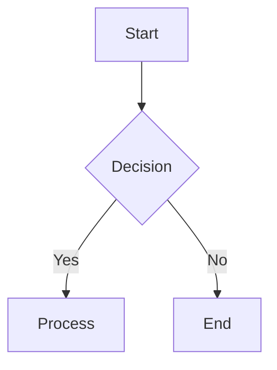
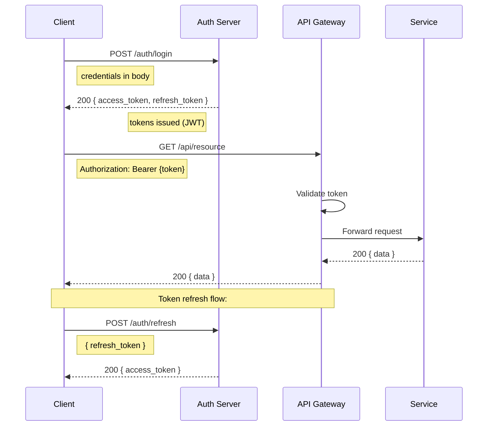
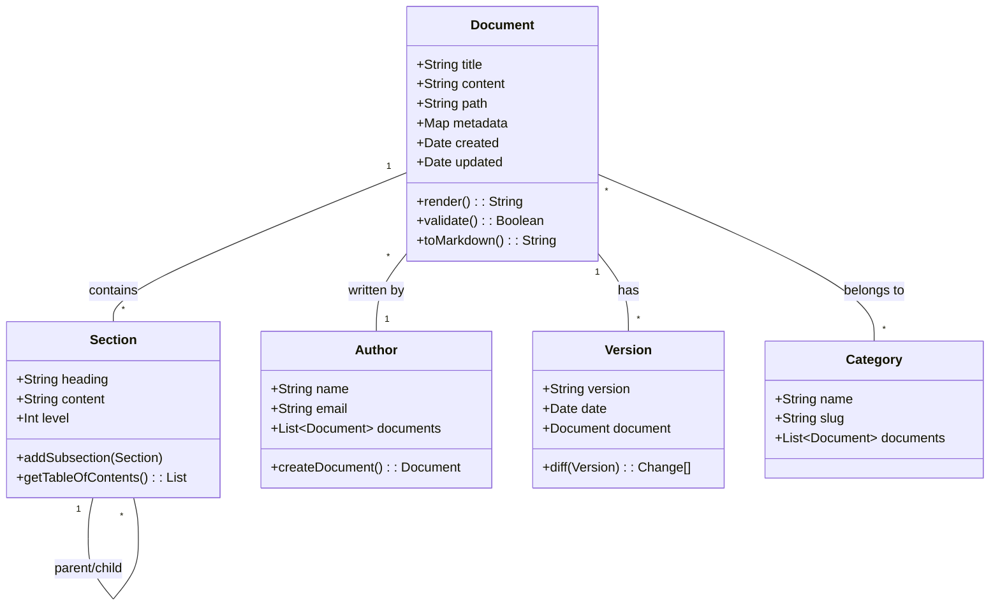
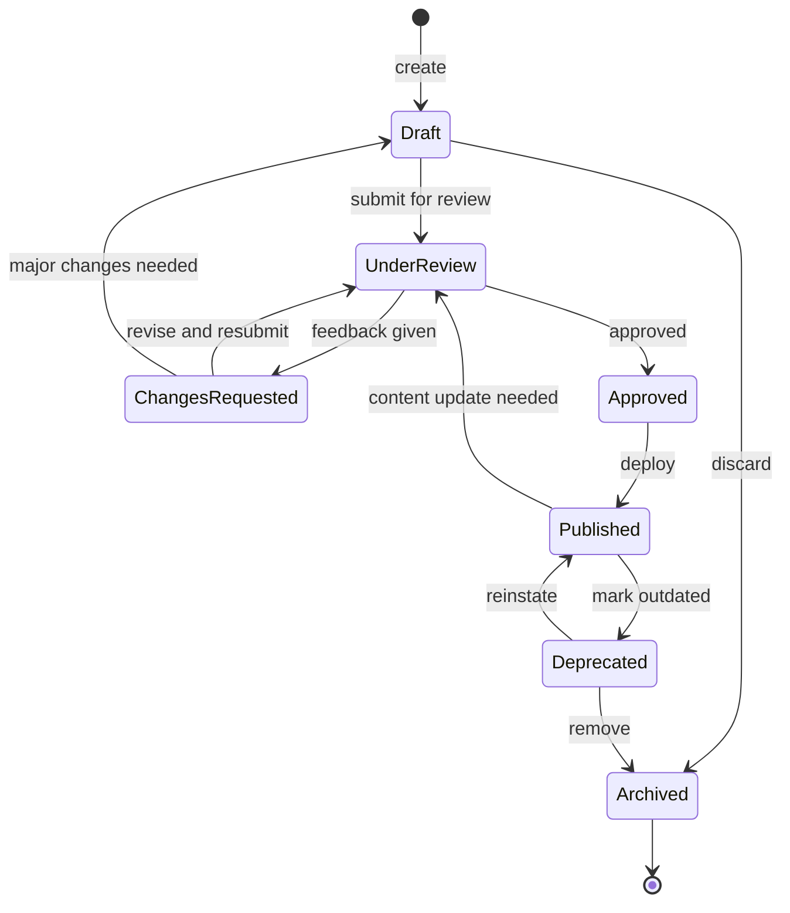
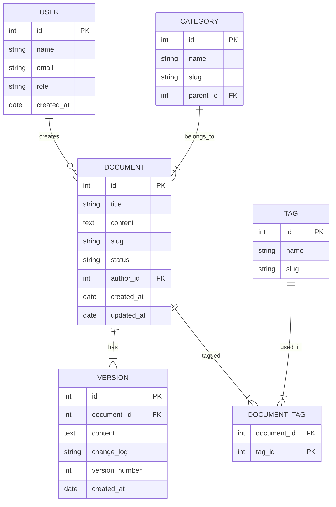
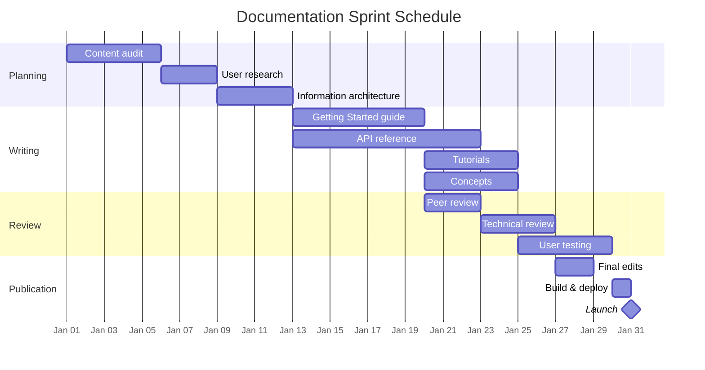
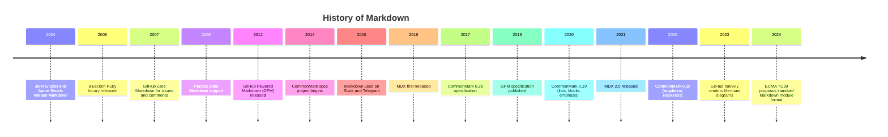

# Interview Guide: Documentation Engineer, Technical Writer & Markdown Specialist

> A comprehensive guide to interviewing for documentation-focused roles in tech. Covers technical questions, architecture design, behavioral interviews, coding exercises, and career development.

---

## Table of Contents

1. [Role Overviews](#1-role-overviews)
2. [Technical Questions](#2-technical-questions-50-with-detailed-answers)
3. [Documentation Design Questions](#3-documentation-design-questions)
4. [Architecture Questions](#4-architecture-questions)
5. [Workflow & Behavioral Questions](#5-workflow--behavioral-questions)
6. [Coding Exercises](#6-coding-exercises)
7. [Documentation Review Exercises](#7-documentation-review-exercises)
8. [Portfolio Preparation](#8-portfolio-preparation)
9. [Career Development](#9-career-development)

---

## 1. Role Overviews

### 1.1 Documentation Engineer

**Responsibilities:**
- Design, build, and maintain documentation infrastructure
- Develop and enforce documentation standards and toolchains
- Create API documentation from code using OpenAPI, JSDoc, etc.
- Build custom documentation platforms and integrations
- Implement CI/CD pipelines for documentation
- Automate documentation testing, link checking, and validation
- Collaborate with engineering teams to embed documentation in development workflow
- Develop custom MDX components and documentation themes
- Manage documentation versioning and multi-language deployments
- Create and maintain style guides and documentation templates
- Performance optimize documentation sites for fast load times
- Implement search systems (Algolia, Lunr, Meilisearch)
- Monitor documentation analytics and iterate on information architecture

**Required Skills:**
- Strong programming ability (JavaScript/TypeScript, Python, Go)
- Markdown, MDX, CommonMark, GFM expertise
- Static site generators (VitePress, Docusaurus, Next.js, Astro, MkDocs)
- Version control (Git, GitHub, GitLab)
- CI/CD (GitHub Actions, GitLab CI, Jenkins)
- API documentation tools (OpenAPI/Swagger, Stoplight, Redoc)
- Information architecture and UX writing
- Testing frameworks (Jest, Vitest, Playwright)
- Containerization (Docker)
- Linux command line proficiency
- Regex and text processing
- Frontend basics (HTML, CSS, React)

**Typical Salary:** $80,000 - $150,000 (USD)
- Entry-level: $80K - $100K
- Mid-level: $100K - $130K
- Senior: $130K - $150K+
- Staff/Principal: $150K - $200K+

**Typical Interview Process:**
1. Recruiter screen (30 min)
2. Technical screen: Markdown/coding exercise (60 min)
3. On-site: System design, coding, documentation review, behavioral (4-5 hours)
4. Final: Team fit, portfolio presentation (60 min)

---

### 1.2 Technical Writer

**Responsibilities:**
- Research, write, and edit technical documentation
- Create user guides, API reference docs, tutorials, and conceptual docs
- Work with subject matter experts (SMEs) to gather information
- Simplify complex technical concepts for target audiences
- Maintain documentation style guides and terminology databases
- Manage documentation publishing workflows
- Conduct user research and usability testing of documentation
- Create information architectures for large documentation sets
- Develop documentation plans and content strategies
- Review and edit documentation written by other team members
- Localization and internationalization of documentation
- Create video tutorials and screencasts
- Write release notes and changelogs

**Required Skills:**
- Excellent written communication in English (or target language)
- Ability to learn and explain technical concepts quickly
- Markdown, reStructuredText, AsciiDoc
- Git and version control workflows
- Docs-as-code methodology
- Static site generators (basic usage)
- API documentation tools (basic usage)
- Screen capture and video editing tools
- Basic HTML/CSS
- Project management and organization
- Information design and information architecture
- User research methodologies
- Accessibility standards (WCAG)
- SEO for documentation

**Typical Salary:** $60,000 - $120,000 (USD)
- Entry-level: $60K - $75K
- Mid-level: $75K - $95K
- Senior: $95K - $120K
- Staff/Principal: $120K - $150K+

**Typical Interview Process:**
1. Recruiter screen (30 min)
2. Portfolio review + editing exercise (take-home or live)
3. Writing exercise: explain a technical concept (60 min)
4. Panel interview: collaboration, stakeholder management (60 min)
5. Presentation: portfolio walkthrough (45-60 min)

---

### 1.3 Markdown Specialist

**Responsibilities:**
- Design and implement Markdown-based content workflows
- Create and maintain Markdown standards and best practices
- Build custom Markdown parsers, extensions, and plugins
- Develop MDX component libraries for documentation platforms
- Create Markdown-to-anything conversion pipelines
- Optimize Markdown rendering performance
- Implement linting and validation rules for Markdown content
- Build custom remark/rehype plugins
- Create and maintain Markdown style guides
- Develop tools for Markdown content management
- Implement Markdown-based knowledge management systems
- Create migration tools for legacy formats to Markdown
- Build preview and editing tools for Markdown content

**Required Skills:**
- Deep knowledge of CommonMark specification
- GFM, MDX, and Pandoc Markdown expertise
- JavaScript/TypeScript (Node.js ecosystem)
- AST manipulation (unified, remark, rehype, mdast, hast)
- Parser development (PEG, nearley, regex-based parsers)
- Plugin development for documentation tools
- Static site generators (deep expertise in at least one)
- Git and version control
- Regex, text processing
- Testing and benchmarking
- Frontend (React, Vue, HTML, CSS)
- Performance optimization
- Accessibility standards

**Typical Salary:** $70,000 - $130,000 (USD)
- Entry-level: $70K - $85K
- Mid-level: $85K - $110K
- Senior: $110K - $130K+
- Staff/Principal: $130K - $180K+

**Typical Interview Process:**
1. Recruiter screen (30 min)
2. Technical phone: Markdown AST manipulation (60 min)
3. Coding exercise: build a Markdown tool (take-home, 4-8 hours)
4. On-site: System design, plugin architecture, deep code review (4-5 hours)
5. Portfolio review: open-source contributions and projects

---

### 1.4 Role Comparison Table

| Aspect | Documentation Engineer | Technical Writer | Markdown Specialist |
|--------|----------------------|-------------------|---------------------|
| **Primary focus** | Infrastructure & tooling | Content & communication | Standards & tooling |
| **Coding required** | Heavy (daily) | Light to moderate | Heavy (daily) |
| **Writing required** | Moderate | Heavy (daily) | Light to moderate |
| **Typical title** | Docs Engineer, DevEx | Technical Writer, Content Developer | Markdown Engineer, Content Tools Engineer |
| **Reports to** | Engineering Manager | Documentation Manager | Engineering or Platform Team |
| **Key metrics** | Build times, uptime, test coverage | User satisfaction, task completion | Spec compliance, rendering speed |
| **Open source** | High involvement | Moderate involvement | Very high involvement |
| **Learning curve** | Steep (tooling + coding) | Steep (technical + writing) | Very steep (specs + parsers) |
| **Remote friendly** | Very | Moderately | Very |
| **Freelance potential** | Moderate | High | Moderate |
| **Interview coding** | LeetCode medium/hard | Minimal | LeetCode medium |
| **Portfolio needed** | Yes (projects) | Yes (writing samples) | Yes (tools + plugins) |
| **Certifications** | Optional | Helpful | Optional |
| **Best for** | Engineers who love docs | Writers who love tech | Engineers who love Markdown |

---

## 2. Technical Questions (50+ with detailed answers)

### 2.1 Markdown History and Philosophy

**Q1: Who created Markdown and why?**

**A:** Markdown was created by John Gruber in collaboration with Aaron Swartz in 2004. Gruber, a blogger and web developer, wanted a format that would be easy to write and read in its raw form while still producing valid HTML. The philosophy was that readability is paramount -- a Markdown document should be publishable as-is, as plain text, without looking like it's been marked up with formatting instructions. The key insight was that email conventions (like using *text* for emphasis) already formed a natural plain-text formatting system.

**Q2: What does readability is paramount mean in practice?**

**A:** It means the raw text should be clearly understandable without rendering. For example:
- **bold** is naturally readable as bold text
- ## Heading clearly indicates a heading
- - List item is obviously a list
- [text](url) is recognizable as a link

This contrasts with HTML, where <strong>bold</strong> or <h2>Heading</h2> is less readable as plain text. The philosophy prioritizes the human authoring experience over machine parsing convenience.

**Q3: What was Aaron Swartz's contribution?**

**A:** Aaron Swartz helped develop the initial Markdown syntax and wrote the first Markdown-to-HTML converter in Perl called html2text.pl (later renamed to Markdown.pl). Swartz was already working on a similar project called atx (which contributed the # heading syntax still used today), and he collaborated with Gruber to merge their ideas. Swartz also contributed the idea of inline HTML, allowing raw HTML within Markdown documents for cases where Markdown's syntax wasn't sufficient. The atx-style headers remain one of the most widely used Markdown features.

**Q4: What are the core design principles of Markdown?**

**A:** The core principles, as defined by Gruber:
1. **Readability** - Plain text must be readable without rendering
2. **Email conventions** - Inspired by existing plain-text email formatting
3. **Simplicity** - The syntax should be minimal and intuitive
4. **Compatibility** - Output must be valid HTML
5. **Extensibility** - Inline HTML allowed for edge cases
6. **No re-invention** - Use existing conventions where possible
7. **One obvious way** - Each construct should have one clear syntax
8. **Backward compatibility** - Documents written in 2004 should render correctly today

**Q5: What criticisms does Markdown face?**

**A:** Common criticisms include:
1. **No official standard** (historically) -- leading to many incompatible flavors
2. **Ambiguous syntax** -- e.g., whether a - starts a list depends on context
3. **No table support** (original) -- tables were added by extensions
4. **No footnotes** (original) -- added by extensions
5. **No automatic table of contents** -- must be generated externally
6. **No consistent math support** -- varies between implementations
7. **No image alignment** -- requires HTML
8. **Whitespace sensitivity** -- subtle indentation changes change meaning
9. **No defined error handling** -- syntax errors produce unpredictable results
10. **Difficult to extend** -- inline HTML breaks the plain-text promise

The CommonMark specification was created to address the standardization problem.

---

### 2.2 CommonMark vs GFM vs Original Markdown

**Q6: What is CommonMark and why was it created?**

**A:** CommonMark is a formal specification for Markdown created to standardize the language. Before CommonMark (2014+), there were dozens of incompatible Markdown implementations, each behaving differently. Jeff Atwood, John MacFarlane, and others led the effort to create a rigorous specification complete with a test suite. CommonMark defines:
- The exact behavior of all syntax constructs
- A formal grammar with unambiguous parsing rules
- A comprehensive test suite (over 600 tests)
- Reference implementations in multiple languages

The spec solves problems like: does *text * text* emphasize text * text or just text? Under CommonMark, the behavior is precisely defined.

**Q7: What is GitHub Flavored Markdown (GFM)?**

**A:** GFM is a superset of CommonMark developed by GitHub. It extends CommonMark with features needed for software development documentation:
- **Tables** -- using pipes | and dashes -
- **Task lists** -- - [ ] and - [x]
- **Strikethrough** -- ~~text~~
- **Autolinks** -- URLs like https://example.com automatically become links
- **Emoji** -- shortcodes like :smile:
- **Code blocks with language tags** -- ```javascript
- **Disallowed raw HTML** -- for security (GitHub sanitizes output)

GFM is specified in its own formal specification and is the most widely used Markdown flavor.

**Q8: What are the key differences between original Markdown, CommonMark, and GFM?**

**A:**

| Feature | Original Markdown | CommonMark | GFM |
|---------|------------------|------------|-----|
| **Specification** | Informal (blog post) | Formal spec + tests | Formal spec + tests |
| **Tables** | No | No | Yes |
| **Task lists** | No | No | Yes |
| **Strikethrough** | No | No | Yes (~~) |
| **Autolinks** | Limited | Limited | Full URL autolinking |
| **Emoji** | No | No | Yes (:shortcode:) |
| **Fenced code blocks** | No (indented only) | Yes (```) | Yes |
| **Syntax highlighting** | No | No | Yes (language tags) |
| **Inline HTML** | Full support | Full support | Sanitized |
| **Line breaks** | Two spaces + newline | Two spaces + newline | \\ or two spaces |
| **Spec ambiguity** | High | None | None |
| **Test suite** | No | ~650 tests | ~800 tests |
| **Version** | Unversioned | Versioned (0.30 current) | Versioned |

**Q9: How does Pandoc Markdown compare?**

**A:** Pandoc Markdown is the most feature-rich Markdown variant, supporting:
- All of GFM features
- Citations and bibliographies ([@citation])
- Footnotes (^[footnote] or [^id]:)
- Definition lists
- Math (LaTeX and TeX)
- Pipe tables and grid tables
- Raw inline/block attributes ({#id .class})
- YAML title blocks
- Slide shows (for Beamer, reveal.js, etc.)
- Cross-references
- Diagrams (via filters)
- Multiple output formats (HTML, PDF, DOCX, EPUB, etc.)

Pandoc is not a strict spec but a tool that defines its own Markdown variant. It's the most powerful option for academic and publishing workflows.

**Q10: When would you choose each Markdown flavor?**

**A:**
- **CommonMark**: When you need strict compliance and predictable rendering. Good for custom tooling, parsers, and cross-platform content.
- **GFM**: For GitHub-hosted projects, developer documentation, and collaborative workflows. The industry standard for software docs.
- **Pandoc Markdown**: For academic writing, book publishing, and multi-format output. Best when you need citations, footnotes, and complex layouts.
- **Original Markdown**: Never -- always use CommonMark or GFM.
- **MDX**: When you need embedded React components in documentation. Best for component library docs and interactive tutorials.

---

### 2.3 Tables, Code Blocks, Syntax Highlighting

**Q11: How do you create a table in Markdown?**

**A:** Tables are created using pipes (|) and dashes (-):

```
| Header 1 | Header 2 | Header 3 |
|----------|:--------:|---------:|
| Left     | Center   |    Right |
| Cell     | Cell     |     Cell |
```

Key rules:
- The header row separator (---|---:|---) defines column alignment
- :--- = left-aligned, :---: = center-aligned, ---: = right-aligned
- Columns don't need to align vertically in raw text
- The separator row is required
- Cells can contain inline Markdown (bold, links, code)
- Tables must be preceded and followed by a blank line
- GFM supports tables natively; original Markdown does not

**Q12: How do you create code blocks in Markdown?**

**A:** Two methods:

1. **Fenced code blocks** (recommended):
   ```python
   def hello():
       print("Hello, World!")
   ```

2. **Indented code blocks** (original Markdown):
   ```
       def hello():
           print("Hello, World!")
   ```
   (Indent by 4 spaces or 1 tab)

3. **Inline code**:
   Use the `print()` function.

Fenced code blocks are preferred because they allow language specification and are easier to manage.

**Q13: How does syntax highlighting work in Markdown?**

**A:** Syntax highlighting is performed by the renderer, not by Markdown itself. When you specify a language after the opening fence:

```javascript
const x = 42;
```

The renderer passes the language identifier to a syntax highlighter (like Prism.js, Shiki, highlight.js, or Pygments). The highlighter:
1. Parses the code into tokens based on the language grammar
2. Wraps each token in <span> tags with CSS classes
3. CSS stylesheets apply colors based on the theme

GFM uses the Linguist library for language detection. CommonMark ignores the language tag and treats it as part of the info string.

Common language identifiers: `javascript`, `python`, `typescript`, `bash`, `json`, `yaml`, `html`, `css`, `sql`, `rust`, `go`, `java`, `c`, `cpp`, `ruby`, `php`, `swift`, `kotlin`, `scala`, `r`, `dart`, `lua`, `haskell`, `elixir`, `clojure`, `erlang`, `fortran`, `cobol`, `assembly`, `markdown`, `diff`, `dockerfile`, `makefile`, `graphql`, `protobuf`, `toml`, `ini`, `xml`, `svg`.

**Q14: How do you create a table with complex content like lists or code?**

**A:** You can't nest block-level elements (lists, code blocks) in standard Markdown tables. Workarounds:

1. Use HTML tables
2. Use line breaks with <br> tag
3. Use inline code for short code snippets
4. Use footnotes or references for longer content

**Q15: How do you handle very wide tables in Markdown?**

**A:** Options:
1. **Horizontal scrolling** -- wrap in <div style="overflow-x: auto"> (HTML)
2. **Break into multiple tables** -- vertically partition the data
3. **Collapsible sections** -- use <details> tags
4. **Reference format** -- list entries individually instead of tabular format
5. **Rotate** -- transpose rows and columns if fewer columns would help

---

### 2.4 YAML Front Matter

**Q16: What is YAML front matter and how is it used?**

**A:** YAML front matter is a block of metadata at the top of a Markdown file, delimited by ---:

```markdown
---
title: "Getting Started with Markdown"
author: Jane Doe
date: 2024-01-15
tags: [markdown, tutorial, beginner]
category: Documentation
draft: false
---
```

It's used by static site generators (Jekyll, Hugo, VitePress, Docusaurus) to:
- Set page title, description, and metadata
- Define layout or template
- Set permalink/URL
- Control publish date and draft status
- Assign categories and tags for filtering
- Define custom variables for templates
- Set SEO metadata (description, OG tags)
- Control navigation and sidebar position

YAML front matter must be the very first thing in the file and must be valid YAML.

**Q17: What YAML data types are supported in front matter?**

**A:**

```yaml
---
# Strings
title: "My Title"
subtitle: A plain string

# Numbers
priority: 1
weight: 0.5

# Booleans
published: true
draft: false
featured: yes

# Arrays (lists)
tags: [guide, tutorial]
categories:
  - Documentation
  - Reference

# Objects (maps)
author:
  name: Jane Doe
  email: jane@example.com

# Dates
date: 2024-01-15
updated: 2024-06-01T10:30:00Z

# Multiline strings
description: >
  This is a folded block scalar.
  Lines will be folded into a single paragraph.

notice: |
  This is a literal block scalar.
  Line breaks are preserved.

# Null values
status: null
---
```

**Q18: Can you use variables from front matter in your Markdown content?**

**A:** Yes, with the static site generator's template system:
- **Liquid (Jekyll)**: {{ page.title }}
- **Nunjucks (Hugo)**: {{ .Title }}
- **EJS**: <%= title %>
- **MDX/VitePress**: export const frontmatter = {} -- then import and use in JSX
- **markdown-it front matter**: Not available by default; accessible via the meta plugin

Some parsers also support custom placeholders like {{title}} which are replaced during build.

**Q19: What's the difference between front matter in Jekyll vs Hugo vs VitePress?**

**A:**

| Feature | Jekyll | Hugo | VitePress |
|---------|--------|------|-----------|
| **Format** | YAML (default), JSON, TOML | YAML, JSON, TOML | YAML (default) |
| **Predefined vars** | layout, permalink, published, category, tags, date | title, description, date, weight, slug, url, layout, draft | title, description, layout, sidebar, editLink, lastUpdated |
| **Custom vars** | Via page.var in Liquid | Via .Params.var | Via frontmatter.var in JS |
| **Default values** | In _config.yml | In archetypes | In config.ts |
| **Computed vars** | No | Yes ($.Params) | No |
| **Nested front matter** | Yes (YAML dicts) | Yes | Yes |
| **Type coercion** | String by default | Auto-detection | Auto-detection |
| **Date handling** | String (use date filter) | Native date type | String |

**Q20: How do you validate YAML front matter?**

**A:** Methods:
1. **Schema validation** -- Use JSON schema or custom validation
2. **Linting** -- markdownlint has MD022 for front matter, remark-lint-frontmatter
3. **Catch errors in CI** -- Parse front matter in CI pipeline
4. **Editor validation** -- VS Code YAML extension validates against schema
5. **Custom validation script** using gray-matter library
6. **TypeScript** -- Define a type for front matter and validate on build

---

### 2.5 MDX vs Regular Markdown

**Q21: What is MDX and how does it differ from Markdown?**

**A:** MDX is a syntax that lets you use JSX (JavaScript XML) directly in Markdown files. Created by the open-source community and maintained by the Vercel ecosystem.

Key differences:

```markdown
# Regular Markdown
- You can use **bold** and *italic*
- You can write `code`
- You can create [links](url)
- Static content only
```

```mdx
# MDX
- You can use all Markdown syntax
- You can **embed React components**
- You can export/import variables and components

import { Chart } from '../components/Chart'
export const data = [1, 2, 3, 4, 5]

<Chart data={data} color="blue" />

{data.map(n => `Value: ${n}`)}
```

MDX essentially makes Markdown files executable JavaScript modules.

**Q22: When should you use MDX vs regular Markdown?**

**A:**

**Use MDX when:**
- Building a component library documentation site
- Creating interactive tutorials with live code editors
- Embedding custom UI components (charts, calculators, demos)
- Working with React/Next.js documentation ecosystems
- Need dynamic content generation within docs
- Building a design system documentation site
- Creating embedded playgrounds/CodeSandbox instances

**Use regular Markdown when:**
- Publishing simple documentation or READMEs
- Working with GitHub, GitLab, Bitbucket
- Building knowledge bases with MkDocs
- Writing blog posts (static content)
- Creating PDFs via Pandoc
- Writing books
- Need maximum portability across platforms
- Working in a non-JavaScript ecosystem

**Q23: What are the limitations of MDX?**

**A:**

1. **Performance** -- Every MDX file must be compiled to JS at build time
2. **Tooling overhead** -- Requires a build step with a JavaScript bundler
3. **Syntax conflicts** -- JSX and Markdown can conflict:
   - <div> in Markdown is HTML, but in MDX it's JSX
   - Angle brackets in code examples must be escaped
   - { and } are JSX expressions, not literal characters
4. **Portability** -- MDX files only work in JavaScript environments
5. **Learning curve** -- Writers need to understand JSX/react concepts
6. **Editor support** -- Not all editors have MDX syntax highlighting
7. **Complexity** -- Overkill for simple documentation needs
8. **Lock-in** -- Tied to React ecosystem (though ESM-only MDX exists)

**Q24: How do you handle Markdown syntax that conflicts with JSX in MDX?**

**A:**

1. **Braces** -- Use {'{'} and {'}'} for literal braces
2. **Less-than/greater-than** -- Use HTML entities or escape
3. **Comments** -- Use JSX comments, not HTML
4. **Inline code with JSX** -- Use backticks for code
5. **Code blocks with JSX** -- Use fenced code blocks
6. **Component children** -- Wrap Markdown in components

**Q25: How does MDX handle imports and exports?**

**A:** MDX follows ES module semantics. Import statements must be at the top of the file. Export statements can be anywhere but must be at the top level. The default export from an MDX file is the rendered content. Named exports can be used for metadata, components, or utilities. Exports from MDX files can be imported by other MDX or JS files.

---

### 2.6 LaTeX Math

**Q26: How do you write math expressions in Markdown?**

**A:** Math support depends on the renderer. The most common syntax uses LaTeX math delimiters:

1. **Inline math**: $x^2 + y^2 = z^2$
2. **Display math**: $$E = mc^2$$
3. **Aligned equations** using \begin{aligned} environment

Renderers must include a math library:
- **MathJax** -- Full LaTeX support, renders in browser
- **KaTeX** -- Fast, renders at build time or in browser
- **Pandoc** -- Converts LaTeX math to MathML, SVG, or images

Not all Markdown renderers support math natively. In GFM, math is not supported unless using a specific markdown processor.

**Q27: What's the difference between MathJax and KaTeX?**

**A:**

| Feature | MathJax | KaTeX |
|---------|---------|-------|
| **Speed** | Slower (full LaTeX parser) | Very fast (limited subset) |
| **LaTeX support** | Full (AMSmath, AMSsymbols) | Subset (most common commands) |
| **Output** | HTML, SVG, MathML | HTML |
| **Fonts** | Multiple (STIX, TeX) | Built-in (TeX-like) |
| **Bundle size** | Large (~1MB) | Small (~50KB) |
| **Auto-rendering** | Yes (scans page) | Manual (must call API) |
| **Accessibility** | Built-in features | Basic |
| **Use case** | Academic papers, complex math | Fast-rendering documentation |

**Q28: How do you include math in Markdown for a static site generator?**

**A:** Specific implementations:

**VitePress:** Set markdown.math = true in config (uses KaTeX)

**Docusaurus:** Use remark-math and rehype-katex plugins

**Jupyter Book:** Configure mathjax in _config.yml

**Pandoc:** Use --mathjax flag

**MkDocs with MathJax:** Use pymdownx.arithmatex extension

**Q29: Write a complex LaTeX math expression for the quadratic formula.**

**A:**

$$x = \frac{-b \pm \sqrt{b^2 - 4ac}}{2a}$$

More complex formulas:

$$f(x) = \int_{-\infty}^{\infty} \hat{f}(\xi) e^{2\pi i \xi x} d\xi$$

$$\sum_{n=1}^{\infty} \frac{1}{n^2} = \frac{\pi^2}{6}$$

$$\nabla \times \mathbf{E} = -\frac{\partial \mathbf{B}}{\partial t}$$

**Q30: How do you handle math in MDX?**

**A:** MDX with math requires plugins. Use remark-math for parsing and rehype-katex for rendering. You can also use React components like InlineMath and BlockMath from react-katex within MDX files.

---

### 2.7 Mermaid Diagrams

**Q31: What is Mermaid and how do you use it in Markdown?**

**A:** Mermaid is a JavaScript-based diagramming and charting tool that uses Markdown-inspired text definitions. You embed Mermaid in Markdown using fenced code blocks with the mermaid language tag:



The code is rendered to SVG by the Mermaid library. Many documentation platforms (GitHub, GitLab, Notion) now render Mermaid natively.

**Q32: What types of diagrams does Mermaid support?**

**A:** Mermaid supports 15+ diagram types:

1. **Flowchart** (graph/flowchart) -- Process flows, algorithms, workflows
2. **Sequence diagram** (sequenceDiagram) -- Interaction sequences, API calls
3. **Class diagram** (classDiagram) -- Object-oriented class structures
4. **State diagram** (stateDiagram-v2) -- State machines, lifecycle states
5. **Entity Relationship** (erDiagram) -- Database schemas, relationships
6. **User Journey** (journey) -- User experience mapping
7. **Gantt chart** (gantt) -- Project timelines, scheduling
8. **Pie chart** (pie) -- Proportions, distributions
9. **Quadrant chart** (quadrantChart) -- Strategic analysis, prioritization
10. **Requirement diagram** (requirementDiagram) -- Requirements engineering
11. **Gitgraph** (gitGraph) -- Git branch history
12. **Timeline** (timeline) -- Chronological events
13. **ZenUML** (zenuml) -- Sequence diagrams
14. **Mindmap** (mindmap) -- Mind maps
15. **C4 diagram** (C4Context, C4Container, C4Component, C4Dynamic) -- Software architecture

**Q33: Write a sequence diagram for an API authentication flow.**

**A:**



**Q34: Write a class diagram for a documentation system.**

**A:**



**Q35: Write a state diagram for a document lifecycle.**

**A:**



**Q36: Write an entity-relationship diagram for a content management system.**

**A:**



**Q37: Write a Gantt chart for a documentation project.**

**A:**



**Q38: How do you render Mermaid diagrams in VitePress?**

**A:** Install vitepress-plugin-mermaid and enable it in the VitePress config:

```ts
// .vitepress/config.ts
import { defineConfig } from 'vitepress'

export default defineConfig({
  markdown: {
    mermaid: true
  }
})

// Install: npm install vitepress-plugin-mermaid mermaid
```

**Q39: Write a timeline diagram for the history of Markdown.**

**A:**



---

### 2.8 Documentation Site Generators

**Q40: Compare VitePress, Docusaurus, MkDocs, and Astro for documentation.**

**A:**

| Feature | VitePress | Docusaurus | MkDocs | Astro |
|---------|-----------|------------|--------|-------|
| **Language** | Vue/JS | React | Python | Any (Islands) |
| **Build tool** | Vite | Webpack/Vite | Python | Vite |
| **Markdown** | Markdown + MDX | MDX | Markdown (extensions) | MDX + Markdown |
| **Search** | Built-in (local) | Algolia DocSearch | Built-in + plugins | Via integration |
| **Versioning** | Plugin | Built-in | Plugin (mike) | Manual |
| **i18n** | Built-in | Built-in | Plugin | Built-in |
| **Blog** | Plugin | Built-in | Plugin | Built-in |
| **Mermaid** | Plugin | Plugin | Plugin | Plugin |
| **LaTeX** | Built-in | Remark/rehype | Plugin | Remark/rehype |
| **Speed** | Very fast | Fast | Medium | Very fast |
| **Bundle size** | Minimal | Larger | Medium | Minimal |
| **Best for** | Small-medium docs | Large docs with versioning | Python ecosystem | Content-heavy sites |
| **Learning curve** | Low | Medium | Low | Medium |

**Q41: How would you choose between these generators for a new documentation project?**

**A:** Decision framework:

1. **Team expertise**: What language/framework does the team know?
   - Vue -> VitePress
   - React -> Docusaurus
   - Python -> MkDocs
   - Any -> Astro

2. **Scale of documentation**:
   - < 50 pages: Any generator works; VitePress is simplest
   - 50-500 pages: Docusaurus (versioning, i18n built-in)
   - 500+ pages: MkDocs with a search engine, or custom solution

3. **Content complexity**:
   - Simple docs: VitePress or MkDocs
   - Mixed content (blog + docs): Docusaurus or Astro
   - Interactive components: Astro with MDX
   - API docs: Docusaurus with OpenAPI plugin

4. **Performance requirements**:
   - Fastest build: VitePress
   - Largest scale: MkDocs (with caching)
   - Best SEO: Astro

**Q42: How do you set up VitePress for a documentation site?**

**A:**

```bash
# Initialize project
mkdir my-docs && cd my-docs
npm init -y
npm install -D vitepress

# Create directory structure
mkdir .vitepress
mkdir guide
mkdir reference
```

Create .vitepress/config.ts with title, description, nav, and sidebar configuration. Then run npx vitepress dev for development and npx vitepress build for production.

**Q43: How do you handle versioning in Docusaurus?**

**A:**

```bash
# Create version 1.0.0 (snapshot of current docs)
npm run docusaurus docs:version 1.0.0

# Create version 2.0.0
npm run docusaurus docs:version 2.0.0
```

Each version is a snapshot of the docs at a point in time. Documents in current are the next version. Users can navigate between versions via a dropdown. Versioned docs can be independently updated (backporting).

---

### 2.9 Docs as Code Workflow

**Q44: What is Docs as Code and what are its principles?**

**A:** Docs as Code is a philosophy that applies software engineering practices to documentation. Principles:

1. **Version control** -- Docs live in Git alongside code
2. **Plain text formats** -- Markdown, reStructuredText, AsciiDoc
3. **Automated builds** -- Documentation is built and deployed via CI/CD
4. **Code review** -- Doc changes go through PR review, same as code
5. **Testing** -- Docs have automated tests (link checks, spell check, validation)
6. **Issue tracking** -- Doc issues tracked alongside code issues
7. **Agile development** -- Docs are developed iteratively, in sprints
8. **Collaboration** -- Writers and engineers collaborate through Git workflows
9. **Tooling** -- Documentation toolchain is treated as a product
10. **Continuous deployment** -- Docs deploy on every merge to main

**Q45: How do you implement CI/CD for documentation?**

**A:** Use GitHub Actions (or GitLab CI) with multiple jobs:

1. **Lint job**: Markdown linting (markdownlint), spell check (Vale), link checking (lychee), front matter validation
2. **Test job**: Build docs, verify no errors, visual regression tests, structured data validation
3. **Deploy job**: Build and deploy to hosting (Vercel, Netlify, S3) when merged to main

The CI pipeline should only trigger when documentation files change (using paths filter).

**Q46: How do you write a Vale configuration for documentation linting?**

**A:**

```ini
# .vale.ini
StylesPath = .vale/styles
MinAlertLevel = warning

[*.md]
BasedOnStyles = Vale, Google, write-good, proselint

[*.{md,mdx}]
TokenIgnores = (`[^`]+`), (<[^>]+>), (```[\s\S]*?```)
```

**Q47: What documentation tests should you run in CI?**

**A:**

1. **Link checking** -- Internal links, external links, anchor links
2. **Spelling and grammar** -- Custom dictionary, grammar checking
3. **Front matter validation** -- Required fields, correct types
4. **Markdown linting** -- markdownlint rules (MD001-MD058)
5. **Build verification** -- Site builds without errors
6. **Content style checks** -- Readability scores, active voice
7. **Code example testing** -- Code blocks contain valid syntax
8. **Accessibility checks** -- Alt text, heading hierarchy
9. **Search indexing** -- All pages indexed correctly
10. **Visual regression** -- Screenshot diffs for critical pages

---

### 2.10 Information Architecture

**Q48: What is information architecture in the context of documentation?**

**A:** Information architecture (IA) is the structural design of shared information environments. For documentation, it means:

1. **Organization** -- How content is grouped, categorized, and labeled
2. **Navigation** -- How users move through content (menus, breadcrumbs, search)
3. **Labeling** -- What terms are used for navigation elements
4. **Search** -- How users find specific content
5. **Wayfinding** -- How users know where they are and where to go

Key IA activities include card sorting, tree testing, content audit, user research, and sitemap creation.

**Q49: What is the Diataxis framework?**

**A:** Diataxis (developed by Daniele Procida) is a systematic framework for documentation organized around user needs. It defines four documentation types:

| Type | Focus | Goal | Analogy |
|------|-------|------|---------|
| **Tutorials** | Learning-oriented | Help beginners get started | Teaching a child to cook |
| **How-to Guides** | Task-oriented | Solve specific problems | Recipe for a specific dish |
| **Reference** | Information-oriented | Provide precise details | Encyclopedia of ingredients |
| **Explanation** | Understanding-oriented | Build deep knowledge | Food science textbook |

The axes of differentiation:
- Tutorials to Reference: Practical -> Theoretical
- How-to to Explanation: Immediate -> Foundational

**Q50: How do you structure a large documentation site using Diataxis?**

**A:**

```
docs/
├── tutorials/              # Getting started, learning-oriented
│   ├── index.md
│   ├── getting-started.md
│   ├── your-first-app.md
│   └── building-a-feature.md
├── how-to/                 # Task-oriented, specific problems
│   ├── index.md
│   ├── configure-auth.md
│   ├── deploy-to-production.md
│   ├── migrate-from-v1.md
│   └── troubleshoot-common-issues.md
├── reference/              # Information-oriented, precise
│   ├── index.md
│   ├── api/
│   │   ├── rest-api.md
│   │   ├── graphql-api.md
│   │   └── webhooks.md
│   ├── config/
│   │   ├── configuration-file.md
│   │   └── environment-variables.md
│   └── cli/
│       ├── command-reference.md
│       └── exit-codes.md
├── explanation/            # Understanding-oriented, conceptual
│   ├── index.md
│   ├── architecture.md
│   ├── security-model.md
│   └── how-rendering-works.md
└── index.md                # Landing page
```

**Q51: What is a digital garden and how does it differ from traditional docs?**

**A:** A digital garden is a collection of interconnected notes, thoughts, and ideas that grow organically over time, as opposed to traditional documentation which is hierarchical, structured, and versioned.

| Aspect | Traditional Docs | Digital Garden |
|--------|-----------------|----------------|
| **Structure** | Hierarchical (tree) | Networked (graph) |
| **Completeness** | Written when feature is done | Grows iteratively |
| **Navigation** | Sidebar, search | Bi-directional links, graph view |
| **Ownership** | Centralized (docs team) | Distributed (individuals) |
| **Tone** | Formal, authoritative | Personal, exploratory |
| **Lifecycle** | Versioned, archived | Continuously updated |
| **Tooling** | SSGs, CI/CD | Obsidian, Roam, Dendron |

---

### 2.11 Remark/Rehype Ecosystem

**Q52: What is the unified/remark/rehype ecosystem?**

**A:** It's a toolchain for processing Markdown and HTML using abstract syntax trees (ASTs). The ecosystem is built on the unified core:

```
unified (core engine)
├── remark (Markdown processor)
│   ├── remark-parse (Markdown -> mdast)
│   ├── remark-stringify (mdast -> Markdown)
│   └── remark-* plugins (lint, toc, frontmatter, etc.)
├── rehype (HTML processor)
│   ├── rehype-parse (HTML -> hast)
│   ├── rehype-stringify (hast -> HTML)
│   └── rehype-* plugins (minify, highlight, format, etc.)
└── recma (JavaScript processor)
```

Architecture pattern: Markdown -> remark-parse -> mdast -> remark plugins -> mdast -> remark-rehype -> hast -> rehype plugins -> hast -> rehype-stringify -> HTML

**Q53: What are mdast and hast?**

**A:** mdast (Markdown Abstract Syntax Tree) is a specification for representing Markdown documents as ASTs. Node types include: root, paragraph, heading, list, listItem, link, image, code, inlineCode, strong, emphasis, thematicBreak, blockquote, table, tableRow, tableCell, definition, footnoteDefinition, footnoteReference, yaml, toml, html, text.

hast (HTML Abstract Syntax Tree) represents HTML documents as ASTs. Node types include: root, element, text, comment, doctype. Element nodes have tagName, properties, and children.

**Q54: How do you write a custom remark plugin?**

**A:**

```javascript
import { visit } from 'unist-util-visit'

export default function remarkCustomParagraph(options = {}) {
  const { className = 'custom' } = options

  return (tree, file) => {
    visit(tree, 'paragraph', (node, index, parent) => {
      node.data = {
        hName: 'p',
        hProperties: {
          className: [className]
        }
      }
    })
  }
}
```

**Q55: How do you write a custom rehype plugin?**

**A:**

```javascript
import { visit } from 'unist-util-visit'

export default function rehypeCodeCaptions() {
  return (tree) => {
    visit(tree, 'element', (node, index, parent) => {
      if (node.tagName !== 'pre') return

      const nextSibling = parent.children[index + 1]
      if (!nextSibling || nextSibling.tagName !== 'p') return

      const caption = nextSibling.children
        .filter(c => c.type === 'text')
        .map(c => c.value)
        .join('')
        .trim()

      if (!caption.startsWith('Caption:')) return

      const figure = {
        type: 'element',
        tagName: 'figure',
        properties: { className: ['code-figure'] },
        children: [
          node,
          {
            type: 'element',
            tagName: 'figcaption',
            properties: {},
            children: [{ type: 'text', value: caption.replace('Caption:', '').trim() }]
          }
        ]
      }

      parent.children.splice(index, 2, figure)
    })
  }
}
```

**Q56: How do you chain remark and rehype plugins together?**

**A:**

```javascript
import { unified } from 'unified'
import remarkParse from 'remark-parse'
import remarkGfm from 'remark-gfm'
import remarkFrontmatter from 'remark-frontmatter'
import remarkMath from 'remark-math'
import remarkRehype from 'remark-rehype'
import rehypeStringify from 'rehype-stringify'
import rehypeHighlight from 'rehype-highlight'
import rehypeKatex from 'rehype-katex'
import rehypeSlug from 'rehype-slug'
import rehypeAutolinkHeadings from 'rehype-autolink-headings'

const processor = unified()
  .use(remarkParse)
  .use(remarkGfm)
  .use(remarkFrontmatter)
  .use(remarkMath)
  .use(remarkRehype, { allowDangerousHtml: true })
  .use(rehypeSlug)
  .use(rehypeAutolinkHeadings)
  .use(rehypeHighlight)
  .use(rehypeKatex)
  .use(rehypeStringify)
```

---

### 2.12 Custom MDX Components

**Q57: How do you create custom MDX components?**

**A:** Create React components in a components directory and import them in MDX files:

```mdx
---
title: Using Custom Components
---

import { Alert, CodeBlock, Tabs, TabItem } from '../components'

<Alert type="warning">
  This feature is deprecated. Use the new API instead.
</Alert>

<Tabs>
  <TabItem label="npm">
    ```bash
    npm install my-package
    ```
  </TabItem>
  <TabItem label="yarn">
    ```bash
    yarn add my-package
    ```
  </TabItem>
</Tabs>
```

**Q58: How do you create a component that accepts Markdown children in MDX?**

**A:** By default, MDX treats anything inside a component as text. To render Markdown children, wrap them in an MDXProvider or use a custom layout component that re-renders children through the MDX pipeline.

**Q59: How do you implement a live code editor component in MDX?**

**A:** Use react-live library:

```jsx
import { LiveProvider, LiveEditor, LivePreview, LiveError } from 'react-live'

export default function LiveCode({ code, scope = {} }) {
  return (
    <LiveProvider code={code.trim()} scope={scope}>
      <LiveEditor />
      <LivePreview />
      <LiveError />
    </LiveProvider>
  )
}
```

**Q60: How do you create a documentation page with multiple language tabs?**

**A:** Create a Tabs/TabItem component pair that persists tab selection using localStorage:

```mdx
<Tabs groupId="package-manager">
  <TabItem value="npm" label="npm">
    ```bash
    npm install my-package
    ```
  </TabItem>
  <TabItem value="yarn" label="Yarn">
    ```bash
    yarn add my-package
    ```
  </TabItem>
</Tabs>
```

---

### 2.13 Static Site Generation

**Q61: How does static site generation work for documentation?**

**A:** Static site generation (SSG) pre-builds HTML pages at build time rather than generating them on each request. The workflow:

1. Parse Markdown/MDX files
2. Resolve front matter
3. Process remark/rehype plugins
4. Generate HTML pages
5. Apply templates/layouts
6. Generate navigation/sidebar
7. Build search index
8. Optimize assets (CSS, JS, images)
9. Generate sitemap and RSS feed

Benefits: Fast loads, SEO, reliability, cheap hosting, easy versioning, and CDN scalability.

**Q62: How do you implement search for a static documentation site?**

**A:** Three approaches:

1. **Client-side search with Lunr.js** (small to medium sites): Build a JSON index at build time, search client-side
2. **Dedicated search service** (Algolia DocSearch, Meilisearch): Crawl and index pages, search via API
3. **Build-time full-text search** (Pagefind, FlexSearch): Post-build indexing, search with WASM

**Q63: What are the considerations for large documentation sites (500+ pages)?**

**A:**
1. **Build performance** - Incremental builds, parallel generation, caching
2. **Search** - Full-text search with typo tolerance, faceted search, search analytics
3. **Navigation** - Mega-menus, breadcrumbs, quick jump, table of contents
4. **Performance** - Code splitting, lazy loading, CDN caching, image optimization
5. **Content management** - Content reuse, automated cross-referencing, redirect management
6. **Versioning** - Multi-version search, version-aware URLs, backporting workflow

---

### 2.14 Search Systems

**Q64: Compare Algolia, Lunr, and Meilisearch for documentation search.**

**A:**

| Feature | Algolia | Lunr.js | Meilisearch |
|---------|---------|---------|-------------|
| **Type** | Cloud SaaS | Client-side JS | Self-hosted/Cloud |
| **Cost** | Free tier (10K records) | Free | Free tier or paid |
| **Setup complexity** | Medium | Low | Medium |
| **Search speed** | <50ms | <100ms | <50ms |
| **Typo tolerance** | Excellent | Customizable | Excellent |
| **Faceting** | Yes | Manual | Yes |
| **Ranking** | Customizable | TF-IDF | Customizable |
| **Synonyms** | Yes | Manual | Yes |
| **Highlighting** | Built-in | Manual | Built-in |
| **Analytics** | Yes | No | Limited |
| **Index size** | No limit (paid) | Browser memory limited | No limit |

**Q65: How do you implement Algolia DocSearch?**

**A:** Use the DocSearch scraper to crawl and index content, then integrate the DocSearch widget in the frontend. Configuration includes selectors for lvl0 through lvl4 headings and content text. The widget provides a search modal with keyboard shortcut support.

**Q66: How do you handle versioned search indexes?**

**A:** Two strategies:
1. **Separate indexes per version** -- Prefix index names with version number
2. **Single index with version facet** -- Add version as a filterable attribute

The UI should include a version selector that filters search results accordingly.

---

### 2.15 OpenAPI and API Documentation

**Q67: How do you integrate OpenAPI documentation into a Markdown-based site?**

**A:** Three methods:
1. **OpenAPI plugin for SSG** -- Use docusaurus-plugin-openapi-docs
2. **Redoc standalone** -- Embed Redoc component via HTML
3. **Custom MDX component** -- Build an ApiEndpoint component that reads OpenAPI specs

**Q68: What tools do you use for API documentation testing?**

**A:**
1. **Spec validation** -- swagger-cli, spectral
2. **Contract testing** -- Dredd, Postman
3. **Example validation** -- Run code examples from docs against actual API
4. **Spec-to-docs consistency** -- Verify every endpoint has a doc page

---

### 2.16 Knowledge Base Design

**Q69: What is a knowledge base and how do you design one in Markdown?**

**A:** A knowledge base is a centralized repository of information that users can search and browse. Design approach:

1. **Information architecture** with categories like Getting Started, User Guides, Troubleshooting, Administration, Reference
2. **Content templates** with standard sections (Goal, Prerequisites, Steps, Troubleshooting, Related Articles)
3. **Search optimization** with clear titles, meta descriptions, tags, and categories
4. **Feedback loop** with helpfulness ratings, comments, and analytics

---

### 2.17 Documentation Analytics

**Q70: What metrics should you track for documentation?**

**A:**

1. **Engagement metrics**: Page views, unique visitors, time on page, scroll depth, search queries, click-through rate
2. **Satisfaction metrics**: CSAT score, NPS, task completion rate, time to answer
3. **Content quality metrics**: Readability score, broken link count, outdated content, coverage
4. **Business impact metrics**: Support ticket deflection, time-to-first-success, developer productivity

**Q71: How do you set up documentation analytics?**

**A:** Use Google Analytics 4 or custom event tracking. Track page views, search queries, helpful votes, scroll depth, external link clicks, and code copy events. Use a custom analytics class to send structured events to GA4.

---

### 2.18 Documentation Governance

**Q72: What is documentation governance?**

**A:** Documentation governance is the framework of policies, processes, and standards that ensure documentation quality, consistency, and accuracy over time. It covers:

1. **Ownership model** - Who owns each section, review workflows, SME requirements
2. **Quality standards** - Style guide adherence, writing quality metrics
3. **Lifecycle management** - Creation workflow, review cycle, update cadence, deprecation
4. **Metrics and reporting** - Quality scorecards, SLAs, coverage requirements
5. **Tooling and automation** - Automated style checks, PR templates, dashboards

**Q73: How do you implement a documentation review process?**

**A:** Multi-stage review workflow: Author Draft -> Self-Review -> Peer Review -> Tech Review (engineer) -> SME Review (expert) -> UX Review (if needed) -> Final Edit -> Publish. Each PR should include a documentation change template with checklists for authors and reviewers.

---

### 2.19 Additional Technical Questions

**Q74: How do you handle images in Markdown documentation?**

**A:** Use  for basic images. For size control, use HTML: . Use <figure>/<figcaption> for captions. Best practices: descriptive alt text, optimized images, relative paths, dedicated images directory.

**Q75: How do you create a glossary in Markdown?**

**A:** Use a definition list format or a table format. Group terms alphabetically with headings (## A, ## B, etc.). Each term should have a clear definition with optional links to related content.

**Q76: How do you create footnotes in Markdown?**

**A:** Use [^1] notation for references and [^1]: for definitions. Footnotes appear at the bottom of the page with backlinks. Multiple references to the same footnote share one entry.

**Q77: How do you handle large Markdown files (5000+ lines)?**

**A:** Split into chunked files, use include files if supported, use front matter for organization, maintain a table of contents, and use collapsible sections for detailed reference content.

**Q78: How does Markdown handle line breaks and paragraphs?**

**A:** Consecutive lines without blank line = same paragraph. Blank line = new paragraph. Two trailing spaces or backslash = line break within paragraph. Four spaces at start = code block.

**Q79: How do you mark deprecated content in Markdown?**

**A:** Use blockquotes with Deprecated labels, custom CSS classes, diff-style annotations in code blocks, or admonition-style callouts. Include replacement information and migration path.

**Q80: What is the future of Markdown?**

**A:** Standardization (CommonMark, ECMA TC39), interactive content (MDX), AI integration, version control improvements, knowledge management growth, richer media, collaborative editing, format conversion, schema support, and better accessibility.

---

## 3. Documentation Design Questions

### 3.1 Design Documentation Structure for a REST API

**Question:** Design the documentation structure for a REST API that has 50+ endpoints, authentication, webhooks, and SDKs in 5 languages.

**Answer:**

```
api-docs/
├── index.md
├── getting-started.md
├── authentication.md
├── guides/
│   ├── pagination.md
│   ├── rate-limiting.md
│   ├── error-handling.md
│   ├── webhooks.md
│   ├── batch-operations.md
│   ├── migration-v1-to-v2.md
│   └── best-practices.md
├── reference/
│   ├── api/
│   │   ├── users.md
│   │   ├── organizations.md
│   │   ├── projects.md
│   │   └── ... (50+ endpoint groups)
│   ├── objects/
│   │   ├── user.md
│   │   └── ... (object schemas)
│   ├── errors.md
│   ├── status-codes.md
│   └── changelog.md
├── sdks/
│   ├── javascript.md
│   ├── python.md
│   ├── ruby.md
│   ├── go.md
│   └── java.md
├── tutorials/
│   ├── building-a-task-manager.md
│   ├── setting-up-webhooks.md
│   └── importing-data.md
├── explanation/
│   ├── architecture.md
│   ├── rate-limit-model.md
│   └── security-model.md
└── resources/
    ├── glossary.md
    ├── faq.md
    ├── openapi.yaml
    └── postman-collection.json
```

Key principles: Diataxis framework, layered navigation, progressive disclosure, DRY content, code-first examples, machine-readable spec.

### 3.2 Design Documentation for a 500-Page Product

**Question:** Design a documentation structure for a product with 500+ pages of documentation, supporting 3 versions and 5 languages.

**Answer:**

```
docs/
├── current/                          # Latest version
│   ├── en/                           # English
│   │   ├── index.md
│   │   ├── getting-started/
│   │   ├── tutorials/
│   │   ├── how-to/
│   │   ├── reference/
│   │   ├── explanation/
│   │   └── resources/
│   ├── es/                           # Spanish
│   ├── ja/                           # Japanese
│   ├── zh/                           # Chinese
│   └── ko/                           # Korean
├── version-2.0/
│   └── en/
├── version-1.0/
│   └── en/
└── shared/
    ├── images/
    ├── videos/
    └── templates/
```

Considerations: Snapshot versioning, internationalization, mega-menu navigation, faceted search, automated cross-referencing, quarterly content audits.

### 3.3 Open-Source Project Docs Organization

**Question:** How do you organize documentation for an open-source project?

**Answer:**

```
project-root/
├── README.md
├── CONTRIBUTING.md
├── CODE_OF_CONDUCT.md
├── LICENSE
├── CHANGELOG.md
├── SECURITY.md
├── docs/
│   ├── index.md
│   ├── getting-started.md
│   ├── guides/
│   ├── reference/
│   ├── examples/
│   ├── contributing/
│   ├── explanation/
│   └── community/
├── examples/
└── .github/
    ├── ISSUE_TEMPLATE/
    └── workflows/
```

Best practices: Excellent README, clear contribution guide, community translations, good first issue labels, doc-only PRs allowed.

### 3.4 Course Platform with MDX

**Question:** Design a documentation/course platform using MDX.

**Answer:** Use Astro or Next.js with MDX. Each lesson is an MDX file with front matter (title, course, lesson, duration, difficulty, learning objectives). Custom components include: LessonLayout, CodeEditor, Quiz, Exercise, Hint, Solution, Diagram, VideoEmbed, ProgressBar, ResourceLink.

Example lesson structure: Introduction -> Concept explanation -> Code examples -> Interactive editor -> Quiz -> Exercise -> Hint -> Solution -> Summary.

### 3.5 Legacy Migration to Markdown

**Question:** How do you migrate 10,000+ pages of legacy documentation to Markdown?

**Answer:**

**Phase 1: Assessment (2-4 weeks)** - Content audit, prioritization, tool selection, quality metrics

**Phase 2: Conversion Pipeline (4-8 weeks)** - Build automated conversion using TurndownService for HTML-to-Markdown, Pandoc for Word-to-Markdown, custom scripts for extracting front matter

**Phase 3: Quality Assurance (2-4 weeks)** - Random sampling, automated checks, rendering comparison, SME review

**Phase 4: Rollout (2-4 weeks)** - Staged deployment, redirect mapping, user feedback, rollback plan

**Phase 5: Cleanup (2 weeks)** - Remove legacy format, archive, document process, update sitemaps

---

## 4. Architecture Questions

### 4.1 Multi-Version Documentation System

**Question:** Design a multi-version documentation system for a product with 3 active major versions.

**Answer:**

Architecture: Content Authors -> Git Repository (main/v2.x/v1.x branches) -> Build System (GitHub Actions) -> Versioned outputs (v3/v2/v1) -> CDN/Hosting -> Search Index (version-filtered)

**Branch strategy:**
- main/ -> Latest (v3)
- v2.x/ -> v2.x maintenance
- v1.x/ -> v1.x legacy

**Version selector UI:** Dropdown with version labels and status indicators (current, maintenance, EOL). Each version has its own URL prefix (/docs/v3/, /docs/v2/, /docs/v1/).

**Backporting workflow:** GitHub Actions workflow that cherry-picks merged PRs from main to maintenance branches.

### 4.2 Documentation Search System

**Question:** Design a search system for 100,000+ pages of documentation.

**Answer:**

Components: Crawler -> Indexer -> Search Engine -> Frontend

Use Meilisearch or Elasticsearch as the search engine. The index schema includes searchable attributes (title, headings, content, tags, category, keywords), filterable attributes (version, language, category, product, docType, lastUpdated), and sortable attributes (lastUpdated, relevance).

Search API endpoints: /api/search with query, version, language, category, and pagination parameters. Results include highlighted snippets, categories, versions, and ranking scores.

Frontend component: Global search overlay with debounced input, result list with highlighted titles and snippets, filter controls, and keyboard navigation.

### 4.3 Analytics Pipeline

**Question:** Design an analytics pipeline for documentation.

**Answer:**

Architecture: Website -> Events Pipeline (GA4/Posthog) -> Analytics Storage (BigQuery/Redshift) -> Dashboard (Grafana/Metabase)

Tracked events: page_view, search, helpful_vote, code_copy, scroll_depth, external_link. Each event has structured properties including page, version, language, timestamp, and session_id.

Dashboard queries: Most viewed pages, search terms with zero results, content with low satisfaction scores, version adoption trends, feature documentation coverage.

### 4.4 Translation Workflow

**Question:** Design a translation workflow for documentation in 10+ languages.

**Answer:**

Pipeline: Author (English) -> Source Branch -> Crowdin Platform -> Reviewed Content -> Deploy

Use Crowdin with automated GitHub Actions integration. Source files in /docs/en/ are automatically pushed to Crowdin on changes. Translations are downloaded on a schedule (daily) as PRs. Each PR includes language metadata in the title and labels.

Language routing: Determine language from URL path > cookie > browser accept-language > default. Redirect to appropriate language prefix if needed.

Supported languages in the configuration file with two-letter codes mapped to full locale names.

### 4.5 CI/CD Pipeline for Docs

**Question:** Design a CI/CD pipeline for documentation.

**Answer:**

```yaml
Jobs:
  1. lint:
      - markdownlint
      - vale (spelling + grammar)
      - lychee (link checker)
      - front-matter-validator
  2. test:
      - build docs
      - validate sitemap
      - check structured data
      - visual regression tests
  3. deploy:
      - build production
      - deploy to CDN
      - invalidate cache
      - deploy search index
  4. notify:
      - Slack notification on success/failure
```

Only trigger on documentation file changes (paths filter). Use caching for faster builds. Preview deployments for pull requests.

---

## 5. Workflow & Behavioral Questions

### 5.1 Describe Your Documentation Workflow

**STAR Answer:**

**Situation:** At my previous company, the documentation process was ad-hoc -- writers received requests via Slack, wrote in Google Docs, and published manually. There was no version control or review process.

**Task:** Establish a structured documentation workflow that aligned with the engineering team's sprint cycle.

**Action:**
1. Migrated all documentation from Google Docs to Markdown in the code repository
2. Implemented a Git branching strategy: feature branches for doc changes, PRs for review
3. Created documentation PR templates with checklists for authors and reviewers
4. Set up VitePress for local preview and CI/CD for automated builds
5. Established a review workflow: writer -> peer (clarity) -> engineer (accuracy) -> merge
6. Added markdownlint, Vale, and link checking to the CI pipeline
7. Created a documentation schedule aligned with the sprint calendar

**Result:**
- Documentation deployment time reduced from 2 days to 15 minutes
- 95% reduction in documentation bugs (broken links, formatting errors)
- Engineering team satisfaction with docs increased from 3.2 to 4.5/5
- Process adopted as standard across 3 product teams

### 5.2 Collaboration with Engineers

**STAR Answer:**

**Situation:** The engineering team was shipping features faster than documentation could keep up. There was a backlog of 40+ undocumented features.

**Task:** Create a sustainable collaboration model where engineers contribute to documentation as part of their development workflow.

**Action:**
1. Implemented a docs-as-code workflow where doc changes are part of feature PRs
2. Created lightweight documentation templates that engineers could fill out quickly
3. Set up automated reminders in PR templates asking Did you update the docs?
4. Established office hours twice a week where I pair with engineers on documentation
5. Built a documentation health dashboard showing coverage per feature area
6. Created a glossary of common technical terms to ensure consistency

**Result:**
- Documentation coverage increased from 60% to 95%
- Average time to document a feature dropped from 5 days to 1 day
- Engineers reported feeling more ownership over documentation
- 80% of new features ship with documentation on the same day

### 5.3 Documentation Reviews

**STAR Answer:**

**Situation:** Documentation reviews were inconsistent -- some reviewers gave line-by-line edits, others gave no feedback, and there was no standard for what a review should cover.

**Task:** Implement a structured documentation review process with clear guidelines.

**Action:**
1. Created a documentation review rubric with 5 criteria: accuracy, clarity, completeness, consistency, accessibility
2. Developed a PR template with specific review checklists for different document types
3. Trained reviewers on the rubric with examples of good and bad reviews
4. Implemented a two-tier review: peer review for content, tech review for accuracy
5. Set up automated pre-reviews (linting, spelling, link checking) to reduce manual review burden
6. Created a feedback loop where reviewers get metrics on their review quality

**Result:**
- Review cycle time reduced from 5 days to 1.5 days
- Review quality scores improved (measured by author satisfaction surveys)
- 90% reduction in post-publication errors
- Team adopted the rubric for all documentation reviews

### 5.4 Measuring Documentation Quality

**STAR Answer:**

**Situation:** The team had no objective way to measure documentation quality. Decisions about what to prioritize were based on gut feeling.

**Task:** Develop a quantitative framework for measuring documentation quality.

**Action:**
1. Defined 5 quality dimensions: accuracy, completeness, clarity, findability, freshness
2. Implemented automated metrics: broken link rate, readability scores, front matter completeness, update frequency
3. Added user feedback collection (Was this helpful? buttons) with follow-up surveys
4. Created a documentation scorecard per product area, updated weekly
5. Built a dashboard combining quantitative metrics with qualitative user feedback
6. Established quality targets: readability <= 8th grade, 99.9% link health, 90% satisfaction, <30 days since last update

**Result:**
- Documentation quality score improved from 62% to 91% over 6 months
- Team could objectively prioritize documentation improvement work
- Leadership used the dashboard to justify additional headcount
- User satisfaction with docs increased from 3.1 to 4.4/5

### 5.5 Prioritization

**STAR Answer:**

**Situation:** We had a backlog of 200+ documentation tasks and only 2 writers. Everything was labeled high priority.

**Task:** Develop a prioritization framework for documentation work.

**Action:**
1. Classified documentation tasks by framework: new features (missing docs), known issues (fixing existing), user requests (from feedback), tech debt (improving quality)
2. Applied a weighted scoring system: user impact (1-5) x frequency (1-5) x strategic value (1-5) / effort (1-5)
3. Created a public roadmap board showing prioritized work
4. Established SLAs: critical bugs within 24h, new feature docs within sprint, improvements within quarter
5. Conducted weekly triage sessions with product and engineering leads
6. Reserved 20% capacity for tech debt and quality improvements

**Result:**
- Clear, data-driven prioritization that all stakeholders understood
- 95% of critical documentation issues resolved within SLA
- Stakeholder satisfaction with documentation responsiveness increased from 3.0 to 4.3/5
- Reduced context switching for writers (fewer interruptions)

### 5.6 Leading Complex Documentation Projects

**STAR Answer:**

**Situation:** Our product was being rebuilt from scratch, requiring completely new documentation while maintaining existing docs for the current product.

**Task:** Lead the documentation effort for the product rewrite -- 500+ new pages, new API, new architecture.

**Action:**
1. Conducted content audit of existing 300+ pages to identify what could be reused, adapted, or replaced
2. Developed a documentation plan aligned with the product launch timeline (6 months)
3. Scaled the team from 2 to 5 writers (hired contractors through a staffing agency)
4. Established documentation standards and templates for the new product
5. Created a shared content library for reusable components and definitions
6. Implemented parallel writing workflows to meet the aggressive timeline
7. Set up continuous preview deployments so stakeholders could review work-in-progress

**Result:**
- 500-page documentation suite launched on the same day as the product
- 90% of content was new; 10% adapted from existing docs
- Team of 5 delivered in 5.5 months, under budget
- Post-launch user survey: 4.2/5 satisfaction with new documentation
- Documentation team received company-wide recognition award

### 5.7 Handling Conflicting Feedback

**STAR Answer:**

**Situation:** During a documentation review for a critical API reference, the product manager wanted simplified language while the engineering lead insisted on precise technical terminology.

**Task:** Resolve the conflicting feedback and create documentation that satisfied both requirements.

**Action:**
1. Acknowledged both perspectives: PM wanted accessibility for new users, engineer wanted precision for experienced developers
2. Proposed a layered approach: simplified overview at the top, detailed reference tables below, with expandable technical notes
3. Created a prototype page demonstrating the approach and shared with both stakeholders
4. Facilitated a meeting where both stakeholders agreed on the structure
5. Documented the decision as a pattern for future conflict resolution

**Result:**
- Both stakeholders approved the final documentation
- Pattern became standard for API documentation across the company
- User testing showed new users and experienced developers both found the docs helpful
- Relationship between PM and engineering improved through collaborative resolution

### 5.8 Improving Documentation Quality

**STAR Answer:**

**Situation:** User surveys showed declining documentation satisfaction (3.5/5) with complaints about outdated content and hard-to-find information.

**Task:** Systematically improve documentation quality across the entire product suite.

**Action:**
1. Implemented automated checking: link checker ran weekly, front matter validator on every PR, stale content alerts for pages not updated in 90 days
2. Redesigned the information architecture based on card sorting with users
3. Created a quarterly content review process: each section reviewed by SMEs every quarter
4. Added user feedback widgets to every page with analytics dashboard
5. Established a documentation working group with representatives from each product team
6. Implemented a documentation improvement sprint every quarter (focused on quality, not new content)

**Result:**
- Documentation satisfaction improved from 3.5 to 4.6/5 over 9 months
- Stale content reduced from 40% to 5% of total pages
- User-reported issues decreased by 70%
- Documentation became a reference for the company's quality standards

### 5.9 Documentation Failure Story

**STAR Answer:**

**Situation:** Shortly after launching a major product update, we received a flood of support tickets from users who couldn't complete a critical workflow. The documentation was incomplete.

**Task:** Address the immediate crisis and implement systemic changes to prevent recurrence.

**Action:**
1. Immediately audited the affected documentation and identified 12 critical gaps
2. Wrote and deployed 8 urgent documentation pages within 48 hours (working nights/weekends)
3. Published a Known Issues page explaining the gaps and providing workarounds
4. Conducted a root cause analysis: the feature was changed 3 days before launch but documentation wasn't updated
5. Implemented a change freeze communication process: any last-minute feature change triggers a documentation review
6. Added documentation sign-off to the release checklist
7. Created a pre-launch documentation audit process for all major releases

**Result:**
- Support tickets dropped 80% within one week of publishing the updated docs
- Implemented systemic changes that prevented similar issues in future releases
- Documentation sign-off became a required step in the release process
- Team developed a culture of asking Is this documented? before shipping

---

## 6. Coding Exercises

### 6.1 Markdown to HTML Converter

**Exercise:** Write a simple Markdown to HTML converter that handles bold, italic, links, and paragraphs.

**Solution:**

```javascript
function markdownToHtml(markdown) {
  let html = markdown

  // Escape HTML entities in code blocks first
  // Handle code blocks (```...```)
  html = html.replace(/```(\w*)\n([\s\S]*?)```/g, (_, lang, code) => {
    const escaped = code
      .replace(/&/g, '&amp;')
      .replace(/</g, '&lt;')
      .replace(/>/g, '&gt;')
    const langClass = lang ? ` class="language-${lang}"` : ''
    return `<pre><code${langClass}>${escaped}</code></pre>`
  })

  // Handle inline code
  html = html.replace(/`([^`]+)`/g, '<code>$1</code>')

  // Handle bold (**text** or __text__)
  html = html.replace(/\*\*(.+?)\*\*/g, '<strong>$1</strong>')
  html = html.replace(/__(.+?)__/g, '<strong>$1</strong>')

  // Handle italic (*text* or _text_)
  html = html.replace(/\*(.+?)\*/g, '<em>$1</em>')
  html = html.replace(/_(.+?)_/g, '<em>$1</em>')

  // Handle links [text](url)
  html = html.replace(/\[([^\]]+)\]\(([^)]+)\)/g, '<a href="$2">$1</a>')

  // Handle images 
  html = html.replace(/!\[([^\]]*)\]\(([^)]+)\)/g, '')

  // Handle headings (## through ######)
  html = html.replace(/^###### (.+)$/gm, '<h6>$1</h6>')
  html = html.replace(/^##### (.+)$/gm, '<h5>$1</h5>')
  html = html.replace(/^#### (.+)$/gm, '<h4>$1</h4>')
  html = html.replace(/^### (.+)$/gm, '<h3>$1</h3>')
  html = html.replace(/^## (.+)$/gm, '<h2>$1</h2>')
  html = html.replace(/^# (.+)$/gm, '<h1>$1</h1>')

  // Handle paragraphs (double newline separated blocks)
  const blocks = html.split(/\n\n+/)
  html = blocks
    .map(block => {
      block = block.trim()
      if (!block) return ''
      if (/^<(h[1-6]|ul|ol|li|pre|blockquote|table|div)/.test(block)) return block
      return `<p>${block}</p>`
    })
    .join('\n\n')

  return html
}
```

### 6.2 Documentation Linter

**Exercise:** Write a documentation linter that checks for common issues: broken internal links, missing alt text on images, incorrect heading hierarchy, and trailing whitespace.

**Solution:**

```javascript
class DocLinter {
  constructor() {
    this.errors = []
    this.warnings = []
  }

  lint(markdown, filePath) {
    this.errors = []
    this.warnings = []
    const lines = markdown.split('\n')

    this.checkHeadingHierarchy(lines)
    this.checkAltText(markdown)
    this.checkInternalLinks(markdown, filePath)
    this.checkTrailingWhitespace(lines)
    this.checkCodeBlockLanguage(markdown)
    this.checkLineLength(lines)
    this.checkFirstHeading(markdown)

    return {
      errors: this.errors,
      warnings: this.warnings,
      errorCount: this.errors.length,
      warningCount: this.warnings.length,
    }
  }

  checkHeadingHierarchy(lines) {
    let prevLevel = 0
    let lineNum = 0

    for (const line of lines) {
      lineNum++
      const match = line.match(/^(#{1,6})\s/)
      if (!match) continue

      const level = match[1].length

      if (prevLevel > 0 && level > prevLevel + 1) {
        this.errors.push({
          line: lineNum,
          message: `Heading level jumps from h${prevLevel} to h${level}`,
          severity: 'error',
        })
      }

      prevLevel = level
    }
  }

  checkAltText(markdown) {
    const imageRegex = /!\[([^\]]*)\]\(([^)]+)\)/g
    let match

    while ((match = imageRegex.exec(markdown)) !== null) {
      if (!match[1]) {
        this.warnings.push({
          message: `Image missing alt text: ${match[0].substring(0, 50)}`,
          severity: 'warning',
        })
      }
    }
  }

  checkInternalLinks(markdown, filePath) {
    const linkRegex = /\[([^\]]+)\]\(([^)]+)\)/g
    let match

    while ((match = linkRegex.exec(markdown)) !== null) {
      const url = match[2]

      // Skip external links
      if (url.startsWith('http://') || url.startsWith('https://')) continue
      if (url.startsWith('mailto:')) continue

      // Check for broken internal references (simplified)
      if (url.includes('//')) {
        this.errors.push({
          message: `Double slash in internal link: ${url}`,
          severity: 'error',
        })
      }
    }
  }

  checkTrailingWhitespace(lines) {
    lines.forEach((line, index) => {
      if (line !== '' && line.endsWith(' ')) {
        this.warnings.push({
          line: index + 1,
          message: 'Trailing whitespace detected',
          severity: 'warning',
        })
      }
    })
  }

  checkCodeBlockLanguage(markdown) {
    const codeBlockRegex = /```(\w*)\n/g
    let match

    while ((match = codeBlockRegex.exec(markdown)) !== null) {
      if (!match[1]) {
        this.warnings.push({
          message: 'Code block without language specification',
          severity: 'warning',
        })
      }
    }
  }

  checkLineLength(lines, maxLength = 120) {
    lines.forEach((line, index) => {
      if (line.length > maxLength && !line.startsWith('```')) {
        this.warnings.push({
          line: index + 1,
          message: `Line exceeds ${maxLength} characters (${line.length})`,
          severity: 'warning',
        })
      }
    })
  }

  checkFirstHeading(markdown) {
    const firstLine = markdown.trim().split('\n')[0]
    const frontMatterMatch = markdown.match(/^---\n([\s\S]*?)\n---\n([\s\S]*)/)

    const contentStart = frontMatterMatch
      ? frontMatterMatch[2].trim()
      : markdown.trim()

    const firstHeading = contentStart.match(/^(#{1,6})\s+(.+)$/m)

    if (!firstHeading) {
      this.errors.push({
        message: 'Document has no heading',
        severity: 'error',
      })
    } else if (firstHeading[1].length !== 1) {
      this.errors.push({
        message: `First heading must be h1, found h${firstHeading[1].length}: ${firstHeading[2]}`,
        severity: 'error',
      })
    }
  }
}
```

### 6.3 Table of Contents Generator

**Exercise:** Write a function that generates a table of contents from a Markdown document.

**Solution:**

```javascript
function generateToc(markdown, options = {}) {
  const {
    maxDepth = 3,
    minDepth = 2,
    addAnchors = true,
    ordered = false,
  } = options

  const lines = markdown.split('\n')
  const toc = []
  const headings = []

  for (const line of lines) {
    const match = line.match(/^(#{1,6})\s+(.+)$/)
    if (!match) continue

    const level = match[1].length
    if (level < minDepth || level > maxDepth) continue

    const text = match[2].trim()
    const anchor = text
      .toLowerCase()
      .replace(/[^\w\s-]/g, '')
      .replace(/\s+/g, '-')
      .replace(/-+/g, '-')

    headings.push({ level, text, anchor, line: lines.indexOf(line) + 1 })
    toc.push({ level, text, anchor })
  }

  function renderToc(items, indent = 0) {
    return items
      .map(item => {
        const prefix = ordered
          ? `${indent + 1}.`
          : '-'
        const indentStr = '  '.repeat(Math.max(0, item.level - minDepth))
        return `${indentStr}${prefix} [${item.text}](#${item.anchor})`
      })
      .join('\n')
  }

  function addAnchorsToMarkdown(markdown, headings) {
    let result = markdown
    for (const h of headings.reverse()) {
      const regex = new RegExp(`^#{${h.level}}\\s+${escapeRegex(h.text)}`, 'm')
      const replaceStr = `${'#'.repeat(h.level)} ${h.text} <a name="${h.anchor}"></a>`
      result = result.replace(regex, replaceStr)
    }
    return result
  }

  function escapeRegex(string) {
    return string.replace(/[.*+?^${}()|[\]\\]/g, '\\$&')
  }

  return {
    toc: renderToc(headings),
    headings,
    markdown: addAnchors ? addAnchorsToMarkdown(markdown, headings) : markdown,
  }
}
```

### 6.4 Link Checker

**Exercise:** Write a link checker that validates both internal and external links in documentation.

**Solution:**

```javascript
const fs = require('fs')
const path = require('path')
const https = require('https')
const http = require('http')

class LinkChecker {
  constructor(rootDir) {
    this.rootDir = rootDir
    this.results = { valid: [], broken: [], skipped: [] }
    this.filesToUrls = {}
  }

  async checkFile(filePath) {
    const content = fs.readFileSync(filePath, 'utf8')
    const links = this.extractLinks(content)
    const dir = path.dirname(filePath)

    for (const link of links) {
      await this.checkLink(link, filePath, dir)
    }
  }

  extractLinks(markdown) {
    const links = []
    const linkRegex = /\[([^\]]*)\]\(([^)]+)\)/g
    const imageRegex = /!\[([^\]]*)\]\(([^)]+)\)/g
    let match

    while ((match = linkRegex.exec(markdown)) !== null) {
      links.push({ text: match[1], url: match[2], type: 'link' })
    }

    while ((match = imageRegex.exec(markdown)) !== null) {
      links.push({ text: match[1], url: match[2], type: 'image' })
    }

    return links
  }

  async checkLink(link, filePath, dir) {
    const { url } = link

    // Skip anchor-only links
    if (url.startsWith('#')) {
      this.results.skipped.push({ url, filePath, reason: 'anchor link' })
      return
    }

    // External link
    if (url.startsWith('http://') || url.startsWith('https://')) {
      const valid = await this.checkExternalLink(url)
      if (valid) {
        this.results.valid.push({ url, filePath })
      } else {
        this.results.broken.push({ url, filePath, type: link.type })
      }
      return
    }

    // Internal link
    const resolvedPath = path.resolve(dir, url)
    if (!fs.existsSync(resolvedPath)) {
      this.results.broken.push({
        url,
        filePath,
        resolvedPath,
        type: link.type,
        reason: 'File not found',
      })
    } else {
      this.results.valid.push({ url, filePath })
    }
  }

  checkExternalLink(url) {
    return new Promise((resolve) => {
      const client = url.startsWith('https') ? https : http

      const req = client.get(url, { timeout: 10000 }, (res) => {
        // Follow redirects
        if (res.statusCode >= 300 && res.statusCode < 400 && res.headers.location) {
          req.destroy()
          resolve(this.checkExternalLink(res.headers.location))
          return
        }

        const valid = res.statusCode >= 200 && res.statusCode < 400
        req.destroy()
        resolve(valid)
      })

      req.on('error', () => resolve(false))
      req.on('timeout', () => {
        req.destroy()
        resolve(false)
      })
    })
  }

  async checkDirectory(dir) {
    const entries = fs.readdirSync(dir, { withFileTypes: true })

    for (const entry of entries) {
      const fullPath = path.join(dir, entry.name)

      if (entry.isDirectory()) {
        await this.checkDirectory(fullPath)
      } else if (entry.name.endsWith('.md') || entry.name.endsWith('.mdx')) {
        await this.checkFile(fullPath)
      }
    }
  }

  report() {
    return {
      total: this.results.valid.length + this.results.broken.length,
      valid: this.results.valid.length,
      broken: this.results.broken.length,
      skipped: this.results.skipped.length,
      brokenLinks: this.results.broken,
    }
  }
}
```

### 6.5 Search Indexer

**Exercise:** Write a search indexer that builds a JSON search index from Markdown files.

**Solution:**

```javascript
const fs = require('fs')
const path = require('path')

class SearchIndexer {
  constructor() {
    this.documents = []
  }

  indexDirectory(dir, baseUrl = '') {
    const entries = fs.readdirSync(dir, { withFileTypes: true })

    for (const entry of entries) {
      const fullPath = path.join(dir, entry.name)

      if (entry.isDirectory()) {
        this.indexDirectory(fullPath, path.join(baseUrl, entry.name))
      } else if (entry.name.endsWith('.md') || entry.name.endsWith('.mdx')) {
        const content = fs.readFileSync(fullPath, 'utf8')
        const doc = this.indexFile(content, fullPath, baseUrl)
        if (doc) this.documents.push(doc)
      }
    }
  }

  indexFile(content, filePath, baseUrl) {
    const frontMatter = this.parseFrontMatter(content)
    const body = frontMatter?.body || content
    const metadata = frontMatter?.metadata || {}

    const headings = this.extractHeadings(body)
    const title = metadata.title || headings[0]?.text || path.basename(filePath, '.md')
    const description = metadata.description || ''

    // Clean content for indexing
    const cleanContent = body
      .replace(/^---[\s\S]*?---\n/, '')
      .replace(/```[\s\S]*?```/g, ' ')
      .replace(/[#*_`\[\]()>|~-]/g, ' ')
      .replace(/\s+/g, ' ')
      .trim()

    const url = path.join('/', baseUrl, entry.name.replace(/\.mdx?$/, '/'))
      .replace(/\\/g, '/')

    return {
      id: url,
      title,
      description,
      content: cleanContent.substring(0, 5000),
      headings: headings.map(h => h.text),
      url,
      tags: metadata.tags || [],
      category: metadata.category || '',
      lastUpdated: metadata.updated || metadata.date || '',
      version: metadata.version || '',
    }
  }

  parseFrontMatter(content) {
    const match = content.match(/^---\n([\s\S]*?)\n---\n([\s\S]*)/)
    if (!match) return null

    const yaml = match[1]
    const body = match[2].trim()
    const metadata = {}

    // Simple YAML parser for front matter
    for (const line of yaml.split('\n')) {
      const kvMatch = line.match(/^(\w+):\s*(.+)$/)
      if (kvMatch) {
        let value = kvMatch[2].trim()

        // Handle arrays [item1, item2]
        if (value.startsWith('[') && value.endsWith(']')) {
          value = value.slice(1, -1).split(',').map(v => v.trim().replace(/^['"]|['"]$/g, ''))
        } else {
          // Remove surrounding quotes
          value = value.replace(/^['"]|['"]$/g, '')
          // Handle booleans
          if (value === 'true') value = true
          if (value === 'false') value = false
        }

        metadata[kvMatch[1]] = value
      }
    }

    return { metadata, body }
  }

  extractHeadings(content) {
    const headings = []
    const regex = /^(#{1,6})\s+(.+)$/gm
    let match

    while ((match = regex.exec(content)) !== null) {
      headings.push({
        level: match[1].length,
        text: match[2].trim(),
      })
    }

    return headings
  }

  exportIndex(outputPath) {
    const index = {
      version: '1.0',
      generated: new Date().toISOString(),
      totalDocuments: this.documents.length,
      documents: this.documents,
    }

    fs.writeFileSync(outputPath, JSON.stringify(index, null, 2))
    return index
  }
}
```

---

## 7. Documentation Review Exercises

### 7.1 Bad README Example + Corrected Version

**Bad README:**

```markdown
# mylib

This is a library. It does stuff. Use it.

## Install

npm install mylib

## Usage

const mylib = require('mylib')
mylib.doSomething()

## API

doSomething(arg1, arg2)
```

**Issues identified:**
- No description of what the library does
- No prerequisites (Node.js version, OS requirements)
- No links to documentation, issues, or contributing guide
- No examples with real data
- No explanation of parameters
- No return value documentation
- No error handling documentation
- No license information
- No badges (build status, coverage, npm version)
- No code comments in example

**Corrected README:**

```markdown
# mylib

[](https://www.npmjs.com/package/mylib)
[](https://github.com/user/mylib/actions)
[](https://codecov.io/gh/user/mylib)
[](https://opensource.org/licenses/MIT)

A lightweight utility library for transforming and validating email addresses. mylib handles normalization, format validation, and domain checking with zero dependencies.

## Features

- Email normalization (lowercase, remove dots from Gmail addresses)
- RFC 5322 compliant validation
- Disposable email domain detection
- Role-based email detection (admin@, support@, etc.)
- TypeScript support with full type definitions

## Prerequisites

- Node.js 18.x or higher
- npm 9.x or higher

## Installation

```bash
npm install mylib
```

## Quick Start

```javascript
const { validateEmail, normalizeEmail } = require('mylib')

// Validate email
const result = validateEmail('User@Example.com')
console.log(result.isValid)  // true
console.log(result.normalized)  // 'user@example.com'

// Normalize Gmail (removes dots)
const gmail = normalizeEmail('john.doe@gmail.com')
console.log(gmail)  // 'johndoe@gmail.com'
```

## API

### validateEmail(email, options?)

Validates an email address against RFC 5322 with optional checks.

**Parameters:**
- `email` (string, required) - The email address to validate
- `options` (object, optional) - Validation options
  - `checkDisposable` (boolean, default: false) - Check if email is from a disposable domain
  - `checkRole` (boolean, default: false) - Check if email is a role-based address

**Returns:**
```typescript
{
  isValid: boolean,
  normalized: string | null,
  errors: string[],
  details?: {
    isDisposable: boolean,
    isRoleBased: boolean,
    domain: string,
  }
}
```

**Example:**
```javascript
const result = validateEmail('test@tempmail.com', { checkDisposable: true })
console.log(result.isValid)        // true (format is valid)
console.log(result.details.isDisposable)  // true
```

**Errors:**
| Error Code | Description |
|------------|-------------|
| INVALID_FORMAT | Email does not match RFC 5322 format |
| MISSING_AT | Email must contain exactly one @ symbol |
| INVALID_DOMAIN | Domain part is missing or malformed |

### normalizeEmail(email)

Normalizes an email address by lowercasing and applying Gmail-specific rules.

**Parameters:**
- `email` (string, required) - The email to normalize

**Returns:** `string | null` - Normalized email or null if invalid

## Contributing

Please read [CONTRIBUTING.md](CONTRIBUTING.md) for details on our code of conduct and the process for submitting pull requests.

## License

MIT License - see [LICENSE](LICENSE) for details.
```

### 7.2 Bad API Doc Sample + Correction

**Bad API Documentation:**

```markdown
## POST /api/users

Creates a user.

Body:
- name
- email
- role

Returns a user object.
```

**Issues identified:**
- No authentication requirements
- Missing content-type header specification
- No field types, requirements, or descriptions
- No example request body
- No example response
- No error responses documented
- No status codes
- No rate limiting information
- No field constraints (length, format)

**Corrected API Documentation:**

```markdown
## Create User

POST https://api.example.com/v2/users

Creates a new user in the system. The user will receive a verification email after creation.

### Authentication

Requires an admin API key in the Authorization header.
```
Authorization: Bearer <admin_api_key>
```

### Headers

| Header | Required | Value |
|--------|----------|-------|
| Content-Type | Yes | application/json |
| Authorization | Yes | Bearer <token> |
| X-Idempotency-Key | No | UUID v4 (prevents duplicate creation) |

### Request Body

```json
{
  "name": "Jane Doe",
  "email": "jane@example.com",
  "role": "developer",
  "organization_id": "org_abc123"
}
```

| Field | Type | Required | Constraints | Description |
|-------|------|----------|-------------|-------------|
| `name` | string | Yes | 1-100 characters | User's full name |
| `email` | string | Yes | Valid email format, max 255 chars | User's email address (used for login and notifications) |
| `role` | string | No | Must be one of: admin, developer, viewer (default: developer) | User role determines permissions |
| `organization_id` | string | No | Must be a valid org ID | Assigns user to an organization |

### Response: 201 Created

```json
{
  "id": "user_abc123",
  "name": "Jane Doe",
  "email": "jane@example.com",
  "role": "developer",
  "organization_id": "org_abc123",
  "status": "pending_verification",
  "created_at": "2024-01-15T10:30:00Z"
}
```

### Response: 400 Bad Request

```json
{
  "error": "validation_error",
  "message": "Invalid email format",
  "field": "email",
  "code": "INVALID_EMAIL"
}
```

| Code | Description |
|------|-------------|
| INVALID_EMAIL | Email format is not valid |
| MISSING_FIELD | Required field is missing |
| DUPLICATE_EMAIL | Email already exists |
| INVALID_ROLE | Role is not one of the allowed values |

### Response: 401 Unauthorized

```json
{
  "error": "unauthorized",
  "message": "Invalid or expired API key"
}
```

### Response: 409 Conflict

```json
{
  "error": "conflict",
  "message": "A user with this email already exists"
}
```

### Rate Limiting

This endpoint is rate-limited to 100 requests per minute per API key. See [Rate Limiting](/guides/rate-limiting) for details.

### Example: cURL

```bash
curl -X POST https://api.example.com/v2/users \
  -H "Content-Type: application/json" \
  -H "Authorization: Bearer <token>" \
  -d '{
    "name": "Jane Doe",
    "email": "jane@example.com",
    "role": "developer"
  }'
```

### Example: JavaScript

```javascript
const response = await fetch('https://api.example.com/v2/users', {
  method: 'POST',
  headers: {
    'Content-Type': 'application/json',
    'Authorization': 'Bearer <token>',
  },
  body: JSON.stringify({
    name: 'Jane Doe',
    email: 'jane@example.com',
    role: 'developer',
  }),
})

const user = await response.json()
```

### Example: Python

```python
import requests

response = requests.post(
    'https://api.example.com/v2/users',
    headers={
        'Content-Type': 'application/json',
        'Authorization': 'Bearer <token>',
    },
    json={
        'name': 'Jane Doe',
        'email': 'jane@example.com',
        'role': 'developer',
    }
)

user = response.json()
```
```

### 7.3 Tutorial Structure Review

**Bad Tutorial:**

Title: Using the Configuration System

1. Open the config file
2. Change the value
3. Save the file
4. Restart the app

**Issues:** Too brief, no context, no prerequisites, no explanation of what the configuration does, no examples, no troubleshooting.

**Well-Structured Tutorial:**

```markdown
---
title: Customizing Your Application with Configuration Files
difficulty: beginner
time: 15 minutes
---

## Prerequisites

- The application installed (v2.0 or higher)
- A text editor (VS Code recommended)
- Basic familiarity with YAML syntax (see our [YAML primer](/tutorials/yaml-basics))

## What You'll Learn

- How to locate and open the configuration file
- How to modify common configuration settings
- How to verify your changes took effect

## Step 1: Locate the Configuration File

The configuration file is named `app-config.yml` and is located in the application's data directory:

- **Windows:** `%APPDATA%\MyApp\app-config.yml`
- **macOS:** `~/Library/Application Support/MyApp/app-config.yml`
- **Linux:** `~/.config/myapp/app-config.yml`

> **Tip:** You can quickly open the directory by running `myapp config-path` in your terminal.

## Step 2: Open and Understand the Configuration

Open `app-config.yml` in your text editor. You should see something like this:

```yaml
# Application Configuration
app:
  name: MyApp
  port: 3000
  debug: false

database:
  host: localhost
  port: 5432
  name: myapp_db

logging:
  level: info
  file: /var/log/myapp/app.log
```

Each section controls a different aspect of the application:

| Section | Controls | Common Changes |
|---------|----------|----------------|
| `app` | Application-level settings | Port number, debug mode |
| `database` | Database connection | Host, port, database name |
| `logging` | Logging behavior | Log level, output file |

## Step 3: Make Your First Change

Let's enable debug mode to see more detailed logs:

1. Find the line `debug: false` under the `app:` section
2. Change it to `debug: true`
3. Save the file (Ctrl+S or Cmd+S)

Your file should now have:

```yaml
app:
  name: MyApp
  port: 3000
  debug: true
```

## Step 4: Apply Your Changes

To apply the configuration changes:

```bash
myapp restart
```

You should see output like:

```
[INFO] Restarting MyApp...
[DEBUG] Loading configuration from /home/user/.config/myapp/app-config.yml
[DEBUG] Debug mode enabled
[INFO] MyApp started on port 3000
```

The `[DEBUG]` messages confirm your configuration change took effect.

## Step 5: Verify

Open http://localhost:3000 in your browser. You should see the application running with enhanced debug information displayed in the footer.

## Troubleshooting

| Problem | Solution |
|---------|----------|
| Application won't start after changes | Check for YAML syntax errors: run `myapp validate-config` |
| Changes not taking effect | Ensure you saved the file and restarted the application |
| Port already in use | Change `port: 3000` to `port: 3001` and try again |
| Configuration file not found | Run `myapp init-config` to create a default config |

## Next Steps

- Learn about [advanced configuration options](/how-to/advanced-config)
- Set up [database configuration for production](/how-to/database-setup)
- Configure [logging levels and log rotation](/how-to/logging-config)

## Summary

In this tutorial, you learned:
- Where the configuration file is located
- How to understand the YAML configuration structure
- How to modify settings and apply changes
- How to verify and troubleshoot your configuration
```

---

## 8. Portfolio Preparation

### 8.1 What to Include

**For Documentation Engineer:**
- GitHub profile with documentation-related projects
- Open-source contributions to documentation tools (Vitepress, Docusaurus, etc.)
- Custom remark/rehype or MDX plugins you've built
- Documentation CI/CD configurations (GitHub Actions workflows)
- Documentation site architectures you've designed
- Performance optimizations you've implemented (build time reductions, lighthouse scores)
- Blog posts about documentation best practices
- Conference talks or workshop materials

**For Technical Writer:**
- Writing portfolio with 3-5 diverse samples (API reference, tutorial, conceptual guide)
- Before/after documentation improvement examples
- Documentation style guides you've created
- Content strategy documents and information architectures
- User research reports and usability testing results
- Metrics and impact data from documentation improvements
- Guest posts or publications

**For Markdown Specialist:**
- Custom Markdown parsers or extensions
- Open-source Markdown tools (linters, converters, validators)
- Contributions to CommonMark or GFM specification
- Remark/rehype plugin ecosystem contributions
- Markdown migration tools
- Benchmark comparisons of Markdown parsers
- Technical blog posts about Markdown internals

### 8.2 Case Study Format

**Title:** Improving Developer Onboarding with Interactive Documentation

**Problem:** New developers took an average of 2 weeks to complete their first feature due to unclear documentation and complex setup procedures.

**Role:** Documentation Engineer

**Timeline:** 3 months

**Approach:**
1. Conducted user research: interviewed 10 new developers and shadowed their onboarding
2. Identified 5 critical pain points: unclear prerequisites, missing code examples, out-of-date screenshots, no troubleshooting guide, no interactive examples
3. Redesigned the getting started guide using Diataxis framework
4. Built interactive code examples with MDX and react-live
5. Implemented automated testing of code examples in CI
6. Added progressive disclosure: basic path and advanced path

**Results:**
| Metric | Before | After | Improvement |
|--------|--------|-------|-------------|
| Time to first commit | 2 weeks | 3 days | 79% reduction |
| Support tickets (onboarding) | 45/month | 8/month | 82% reduction |
| Developer satisfaction | 3.1/5 | 4.6/5 | 48% increase |
| Documentation page views | 2,500/month | 12,000/month | 380% increase |

**Key Learnings:**
- Interactive examples significantly improve learning retention
- User research is essential for identifying real pain points
- Automated testing of documentation prevents regressions
- Collaboration with engineering is critical for accuracy

**Links:** [Documentation Site], [GitHub Repository], [Case Study Blog Post]

### 8.3 Before/After Examples

**Before (original):**
```
## API Endpoint

GET /api/data

Parameters: id

Returns: data
```

**After (rewritten):**
```markdown
## Retrieve Data

GET https://api.example.com/v2/data/:id

Retrieves a specific data record by its unique identifier.

### Path Parameters

| Parameter | Type | Required | Description |
|-----------|------|----------|-------------|
| `id` | string | Yes | The unique identifier of the data record (format: `data_xxx`) |

### Query Parameters

| Parameter | Type | Required | Default | Description |
|-----------|------|----------|---------|-------------|
| `fields` | string | No | All fields | Comma-separated list of fields to include |
| `format` | string | No | json | Response format: `json` or `xml` |

### Headers

| Header | Required | Description |
|--------|----------|-------------|
| Authorization | Yes | Bearer token |
| Accept-Language | No | Response language (e.g., `en-US`, `ja-JP`) |

### Example Request

```bash
curl https://api.example.com/v2/data/data_abc123 \
  -H "Authorization: Bearer <token>" \
  -H "Accept-Language: en-US"
```

### Example Response (200 OK)

```json
{
  "id": "data_abc123",
  "type": "metric",
  "attributes": {
    "name": "Active Users",
    "value": 12450,
    "unit": "count",
    "timestamp": "2024-01-15T10:30:00Z"
  },
  "relationships": {
    "organization": {
      "data": { "id": "org_xyz", "type": "organization" }
    }
  }
}
```

### Error Responses

| Status | Code | Description |
|--------|------|-------------|
| 401 | UNAUTHORIZED | Invalid or missing authentication |
| 404 | NOT_FOUND | Data record not found |
| 429 | RATE_LIMITED | Too many requests |
```

**Impact:** Support tickets about this API dropped 65% after the documentation update. Average time to integrate the API dropped from 2 hours to 20 minutes.

### 8.4 Metrics and Impact

**Documentation Metrics Framework:**

| Category | Metric | Target | How to Measure |
|----------|--------|--------|----------------|
| **Usage** | Page views | 10,000+/month | Google Analytics |
| **Usage** | Unique visitors | 5,000+/month | Google Analytics |
| **Usage** | Search queries | 1,000+/month | Algolia/Meilisearch analytics |
| **Quality** | Broken links | 0 | Link checker |
| **Quality** | Readability score | <= 8th grade | Text analyzer (Hemingway, Flesch-Kincaid) |
| **Quality** | Outdated pages | < 5% | Git analysis |
| **Quality** | Code example errors | 0 | Automated code testing |
| **Satisfaction** | Helpful rate | > 85% | Feedback widget |
| **Satisfaction** | CSAT score | > 4.0/5 | User surveys |
| **Business** | Support ticket deflection | 30%+ | Compare before/after ticket volume |
| **Business** | Time to integrate | < 30 min | Engineering survey |
| **Business** | Documentation velocity | < 1 sprint | PR cycle time |

**Presenting Impact:**
- Use dashboards (Grafana, Datadog) for real-time metrics
- Create quarterly documentation impact reports
- Include before/after screenshots and data
- Quote user feedback (positive and constructive)
- Map documentation improvements to business outcomes (lower support costs, faster onboarding)

### 8.5 Open-Source Contributions

**Where to contribute as a documentation professional:**

1. **Documentation infrastructure projects:**
   - VitePress, Docusaurus, MkDocs, Astro
   - remark, rehype, unified ecosystem
   - MDX
   - Mermaid

2. **Tool documentation:**
   - Fix bugs in documentation
   - Write tutorials and guides
   - Improve API reference documentation
   - Translate documentation

3. **Content contributions:**
   - Write installation guides
   - Create getting started tutorials
   - Document migration paths
   - Write troubleshooting guides

4. **Community management:**
   - Answer questions on GitHub Discussions
   - Review documentation PRs
   - Create issue templates for documentation bugs
   - Write contributing guides

**Building a contribution portfolio:**
- Start with small fixes (typos, broken links)
- Graduate to medium improvements (new tutorials, expanded reference)
- Build to large contributions (documentation infrastructure, custom plugins)
- Document your contributions and their impact
- Write about your contribution experience

---

## 9. Career Development

### 9.1 Salary Expectations by Role and Experience

**Documentation Engineer Salaries (USD):**

| Experience | 25th Percentile | Median | 75th Percentile | 90th Percentile |
|------------|----------------|--------|----------------|-----------------|
| Entry (0-2 yrs) | $75,000 | $85,000 | $95,000 | $105,000 |
| Mid (3-5 yrs) | $95,000 | $110,000 | $125,000 | $140,000 |
| Senior (6-9 yrs) | $120,000 | $135,000 | $150,000 | $165,000 |
| Staff (10+ yrs) | $145,000 | $160,000 | $180,000 | $200,000+ |

**Technical Writer Salaries (USD):**

| Experience | 25th Percentile | Median | 75th Percentile | 90th Percentile |
|------------|----------------|--------|----------------|-----------------|
| Entry (0-2 yrs) | $55,000 | $65,000 | $75,000 | $85,000 |
| Mid (3-5 yrs) | $70,000 | $82,000 | $95,000 | $108,000 |
| Senior (6-9 yrs) | $90,000 | $105,000 | $120,000 | $135,000 |
| Staff (10+ yrs) | $110,000 | $130,000 | $150,000 | $170,000+ |

**Markdown Specialist Salaries (USD):**

| Experience | 25th Percentile | Median | 75th Percentile | 90th Percentile |
|------------|----------------|--------|----------------|-----------------|
| Entry (0-2 yrs) | $65,000 | $75,000 | $85,000 | $95,000 |
| Mid (3-5 yrs) | $85,000 | $100,000 | $115,000 | $130,000 |
| Senior (6-9 yrs) | $110,000 | $125,000 | $140,000 | $155,000 |
| Staff (10+ yrs) | $135,000 | $155,000 | $175,000 | $195,000+ |

**Salary by Company Type:**

| Company Type | Documentation Engineer | Technical Writer | Markdown Specialist |
|-------------|----------------------|-------------------|---------------------|
| Startup (<50 employees) | $80K - $120K | $60K - $90K | $70K - $110K |
| Mid-size (50-500) | $90K - $140K | $70K - $105K | $80K - $125K |
| Enterprise (500+) | $100K - $160K | $80K - $120K | $90K - $140K |
| Big Tech (FAANG) | $130K - $200K+ | $100K - $150K+ | $120K - $180K+ |
| Remote-first | $85K - $150K | $65K - $115K | $75K - $130K |

**Salary by Location:**

| Location | Documentation Engineer | Technical Writer | Markdown Specialist |
|----------|----------------------|-------------------|---------------------|
| San Francisco / NYC | $120K - $180K | $90K - $140K | $110K - $170K |
| Seattle / Boston | $110K - $165K | $85K - $130K | $100K - $155K |
| Austin / Denver | $95K - $145K | $75K - $115K | $85K - $135K |
| Remote (US-based) | $85K - $150K | $65K - $120K | $75K - $140K |
| Remote (Global) | $60K - $120K | $45K - $90K | $55K - $110K |

### 9.2 Negotiation Tips

**Before the Interview:**
1. Research salary ranges for the role, company size, and location (use Levels.fyi, Glassdoor, Blind, Payscale)
2. Know your minimum acceptable number (walk-away point)
3. Prepare your value proposition with specific metrics and impacts
4. Practice the numbers you'll say (rehearse out loud)

**During Negotiation:**

1. **Never give the first number** -- Let the recruiter state the range first
   - If pressed: I'm focused on finding the right fit. Based on my research, roles like this typically range from $X to $Y. Could you share the budgeted range?

2. **Consider total compensation, not just salary**
   - Base salary
   - Equity/RSUs
   - Annual bonus (cash + stock)
   - Sign-on bonus
   - Relocation package
   - Benefits (health, dental, vision)
   - 401K matching
   - Education budget
   - Conference budget
   - Remote work stipend
   - Vacation time
   - Sabbatical policy

3. **Use competing offers** -- If you have another offer, use it as leverage professionally:
   - I have an offer from Company X for $Y. I'd prefer to join your team because of [reason]. Can you match or improve on this?

4. **Negotiate beyond salary:**
   - If salary is capped: ask for sign-on bonus, additional equity, or performance review at 6 months
   - If salary is below target: ask for title bump, remote flexibility, or education budget
   - If salary is fair: ask for quicker promotion timeline, conference budget, or training

5. **Typical negotiation script:**
   - Thank you for the offer. I'm excited about the role and team.
   - Based on my experience in [specific area] and the market data I've gathered, I was hoping for $X.
   - Is there flexibility on the base salary? If not, could we adjust the equity or sign-on bonus?
   - I'd love to accept the offer if we can get closer to my target.

6. **Know when to walk away:**
   - If values don't align
   - If growth opportunities are limited
   - If the role isn't what was described
   - If compensation is far below market

### 9.3 Company Research

**What to Research Before an Interview:**

1. **Documentation quality:** Read their public docs. Are they good? What's missing? How would you improve them?
2. **Tech stack:** What documentation tools do they use? (Check their GitHub, docs site, job descriptions)
3. **Documentation team:** How large is the team? Who does it report to? (Check LinkedIn, team page)
4. **Business model:** How does the company make money? What's their growth trajectory?
5. **Culture:** Read their engineering blog, check Glassdoor, talk to current/former employees
6. **Documentation challenges:** What issues do users complain about? (Check GitHub issues, Twitter, Reddit, Hacker News)

**Questions to Ask in the Interview:**

**For the hiring manager:**
- How does the documentation team interact with engineering, product, and support?
- What's the current documentation workflow? Where are the bottlenecks?
- How is documentation quality measured? What metrics matter to you?
- What's the biggest documentation challenge the team is facing?
- What would success look like for this role in the first 90 days?

**For the team:**
- How do you prioritize documentation work?
- What tools are you using and what would you like to change?
- How do you handle documentation reviews?
- What's the most rewarding part of working on this team?

**For the company:**
- What's the company's philosophy on documentation?
- How is documentation funded and resourced?
- What career growth paths exist for documentation professionals?
- Are there opportunities for cross-team collaboration?

### 9.4 Follow-Up Strategies

**After the Interview:**

1. **Thank-you email within 24 hours:**
   - Thank them for their time
   - Mention 1-2 specific things you enjoyed discussing
   - Reiterate your interest in the role
   - Offer to provide any additional information

2. **Follow-up timeline:**
   - Day 1: Send thank-you notes to all interviewers
   - Day 3-5: If no response, send a polite follow-up asking about timeline
   - Day 7: If no decision, send a brief update (e.g., still very interested)
   - Day 14: If still no response, send a final follow-up asking if there are any updates
   - After decision: Thank them regardless of outcome

3. **After rejection:**
   - Ask for feedback (what could you improve?)
   - Stay in touch on LinkedIn
   - Apply again in 6-12 months
   - Consider contract or part-time roles at the same company

4. **After acceptance:**
   - Negotiate the offer (always)
   - Get the offer in writing
   - Notify other companies you're interviewing with
   - Give appropriate notice at current role
   - Submit resignation professionally

### 9.5 Career Progression Paths

**Documentation Engineer Path:**

```
Entry (0-2 yrs)
├── Junior Documentation Engineer
├── Associate Developer Advocate
└── Docs Tooling Engineer I

Mid (3-5 yrs)
├── Documentation Engineer
├── Developer Experience Engineer
├── Docs Infrastructure Engineer
└── Technical Writer (tooling focus)

Senior (6-9 yrs)
├── Senior Documentation Engineer
├── Staff Developer Advocate
├── Senior Docs Infrastructure Engineer
└── Documentation Lead

Staff / Principal (10+ yrs)
├── Staff Documentation Engineer
├── Principal Developer Experience Engineer
├── Director of Documentation
└── Head of Developer Relations

Executive
├── VP of Developer Experience
├── Chief Documentation Officer
├── CTO (with strong docs focus)
└── Head of Platform Engineering
```

**Technical Writer Path:**

```
Entry (0-2 yrs)
├── Junior Technical Writer
├── Content Writer
├── Documentation Specialist
└── Associate Technical Writer

Mid (3-5 yrs)
├── Technical Writer
├── Senior Content Strategist
├── Information Architect
└── UX Writer

Senior (6-9 yrs)
├── Senior Technical Writer
├── Lead Content Strategist
├── Documentation Manager
└── Principal UX Writer

Staff / Principal (10+ yrs)
├── Staff Technical Writer
├── Director of Content Strategy
├── Head of Documentation
└── VP of Content

Executive
├── VP of Documentation & Content
├── Chief Content Officer
├── Chief Customer Officer
└── VP of Customer Success
```

**Markdown Specialist Path:**

```
Entry (0-2 yrs)
├── Junior Markdown Engineer
├── Content Tools Developer
├── Documentation Tools Engineer
└── Junior Developer Advocate

Mid (3-5 yrs)
├── Markdown Engineer
├── Content Infrastructure Engineer
├── Documentation Platform Engineer
└── Open Source Contributor (Markdown ecosystem)

Senior (6-9 yrs)
├── Senior Markdown Engineer
├── Staff Content Tools Engineer
├── Documentation Platform Lead
└── Spec Contributor (CommonMark, MDX)

Staff / Principal (10+ yrs)
├── Principal Markdown Engineer
├── Director of Content Infrastructure
├── ECMA TC39 Contributor
└── Open Source Maintainer (unified/remark/rehype)

Executive
├── VP of Developer Tools
├── Chief Platform Architect
├── Head of Open Source Programs
└── CTO (content-first company)
```

**Lateral Movement Options:**
- Documentation Engineer -> Developer Advocate
- Technical Writer -> Product Manager
- Markdown Specialist -> Software Engineer (parser/infrastructure)
- Documentation Engineer -> Engineering Manager (docs team)
- Technical Writer -> UX Researcher
- Markdown Specialist -> Developer Tools Engineer
- Any -> Freelance/Consulting

### 9.6 Certifications

**Recommended Certifications:**

| Certification | Provider | Focus | Cost | Time | Value |
|---------------|----------|-------|------|------|-------|
| Certified Professional Technical Communicator (CPTC) | STC | Technical writing | $500 | 3-6 months | Medium |
| Google UX Design Certificate | Google/Coursera | UX research, design | $300 | 6 months | High |
| AWS Certified Cloud Practitioner | Amazon Web Services | Cloud basics | $100 | 1-2 months | Medium |
| DITA Certification | various | Structured authoring | $1000 | 3-6 months | Low (niche) |
| Microsoft Certified: Azure Fundamentals | Microsoft | Cloud basics | $100 | 1-2 months | Medium |
| GitHub Actions Certification | GitHub | CI/CD | $200 | 2-4 weeks | High |
| Certified Kubernetes Application Developer (CKAD) | CNCF | Kubernetes | $400 | 3-6 months | Medium |
| OpenAPI Specification Certification | OpenAPI Initiative | API documentation | Free | 1-2 weeks | High |
| Accessibility Specialist (IAAP CPACC) | IAAP | Accessibility | $500 | 3-6 months | Medium |
| Agile/Scrum Certifications | Scrum Alliance | Agile methodologies | $1000 | 2-4 weeks | Low |

**Certifications by Role:**

**Documentation Engineer:**
- GitHub Actions Certification (highly recommended)
- AWS Cloud Practitioner or Azure Fundamentals
- CKAD (if working with Kubernetes docs)
- OpenAPI Specification Certification (highly recommended)
- Google UX Design Certificate

**Technical Writer:**
- CPTC (STC certification)
- Google UX Design Certificate (highly recommended)
- OpenAPI Specification Certification
- Accessibility Specialist (IAAP CPACC)
- Agile/Scrum Certifications

**Markdown Specialist:**
- OpenAPI Specification Certification
- GitHub Actions Certification
- Google UX Design Certificate
- AWS Cloud Practitioner
- CKAD (if working with developer docs)

---

## Final Tips

**Before the Interview:**
- Practice explaining technical concepts out loud
- Have specific examples ready (STAR format)
- Prepare 5-7 questions for the interviewer
- Test your equipment (camera, microphone, screen sharing)
- Have your portfolio/samples organized and accessible
- Research the company and its documentation

**During the Interview:**
- Think out loud during technical exercises
- Ask clarifying questions before diving into solutions
- Be honest about what you don't know (show how you'd learn)
- Use specific examples from your experience
- Connect your answers back to business impact
- Show enthusiasm for documentation and user experience

**After the Interview:**
- Send thank-you notes within 24 hours
- Note any questions you struggled with (study for next time)
- Update your interview tracking spreadsheet
- Reflect on what went well and what could improve

Good luck with your interview!
