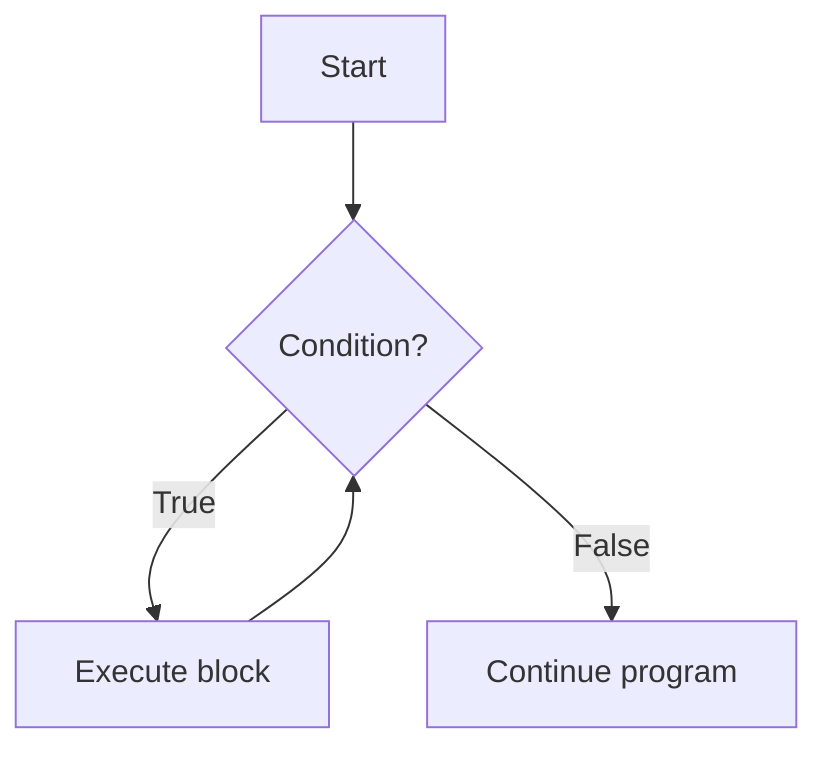
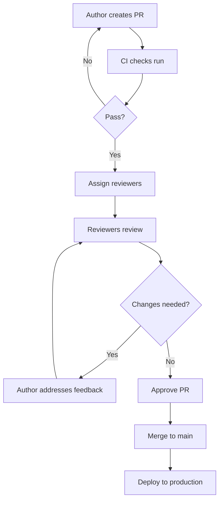
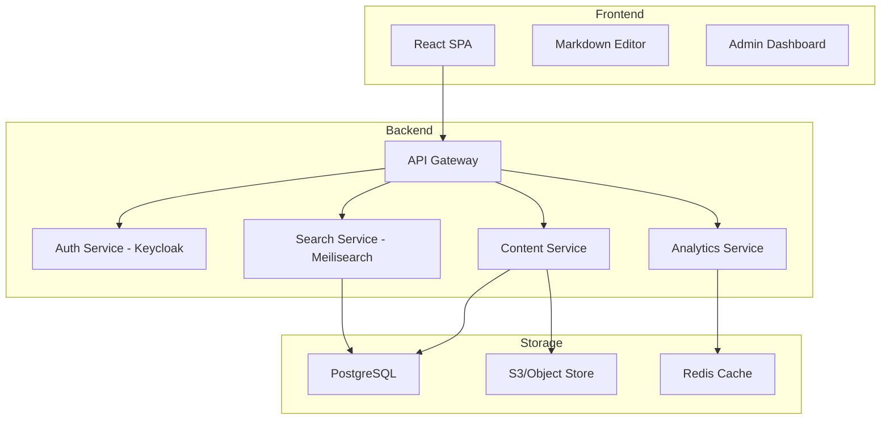

# Markdown Mastery Projects

> 40 real, buildable projects organized by difficulty. Each project includes a concrete deliverable with actual file structures and output examples. No abstract descriptions — every project produces something you can use, share, or deploy.

---

## Table of Contents

- [Beginner Projects (1-10)](#beginner-projects)
- [Intermediate Projects (11-20)](#intermediate-projects)
- [Advanced Projects (21-30)](#advanced-projects)
- [Expert Projects (31-40)](#expert-projects)

---

## Beginner Projects

### Project 1: GitHub Profile README

**Real Deliverable:** A live GitHub profile at `github.com/yourusername` that recruiters see when they visit your profile.

**Concrete File Structure:**
```
yourusername/yourusername/
├── README.md
├── .github/
│   └── workflows/
│       └── update-stats.yml
└── assets/
    ├── header.svg
    └── profile-photo.jpg
```

**What You'll Build — A real README.md like this:**
```markdown
# Hi there, I'm Alex 👋

## 🚀 About Me
I'm a full-stack developer passionate about building accessible web applications.

## 🛠️ Tech Stack


## 📈 GitHub Stats


## 📌 Pinned Projects
- [**markdown-docs**](https://github.com/yourusername/markdown-docs) — A documentation site built with Docusaurus
- [**api-wrapper**](https://github.com/yourusername/api-wrapper) — Python wrapper for REST APIs

## 📫 Connect With Me
[](https://linkedin.com/in/yourprofile)
[](https://twitter.com/yourhandle)
```

**Step-by-Step:**
1. Create a GitHub repo named exactly `yourusername` (the README becomes your profile)
2. Create `README.md` with the content above
3. Add shields.io badges for your tech stack
4. Add GitHub stats cards from `github-readme-stats.vercel.app`
5. Pin your best repos to your GitHub profile
6. Add a `.github/workflows/update-stats.yml` for automatic stats updates

**Reference:** https://github.com/abhisheknaiidu/awesome-github-profile-readme

---

### Project 2: Recipe Book

**Real Deliverable:** A published cookbook at `cookbook.yourdomain.com` (or locally) with 10+ recipes, searchable by category.

**Concrete File Structure:**
```
cookbook/
├── README.md
├── index.md
├── recipes/
│   ├── italian/
│   │   ├── spaghetti-carbonara.md
│   │   ├── margherita-pizza.md
│   │   └── tiramisu.md
│   ├── asian/
│   │   ├── chicken-stir-fry.md
│   │   └── pad-thai.md
│   └── desserts/
│       ├── chocolate-cake.md
│       └── cheesecake.md
├── assets/
│   ├── images/
│   │   ├── carbonara.jpg
│   │   └── pizza.jpg
│   └── icons/
├── glossary.md
└── conversions.md
```

**Concrete Recipe File (`recipes/italian/spaghetti-carbonara.md`):**
```markdown
# Spaghetti Carbonara

> Classic Roman pasta dish — no cream, just eggs, cheese, and guanciale.

| ⏱️ Prep | 🍳 Cook | 👥 Servings | ⭐ Difficulty |
|---------|--------|-------------|--------------|
| 10 min | 15 min | 4 | Medium |

## Ingredients
| Quantity | Unit | Ingredient | Notes |
|----------|------|------------|-------|
| 400 | g | Spaghetti | #12 or #13 thickness |
| 200 | g | Guanciale | Sub pancetta if unavailable |
| 4 | large | Egg yolks | Room temperature |
| 2 | whole | Eggs | Room temperature |
| 100 | g | Pecorino Romano | Freshly grated |
| 100 | g | Parmigiano-Reggiano | Freshly grated |
| 2 | tsp | Black pepper | Freshly cracked |

## Instructions
1. **Prepare guanciale:** Cut into 1cm strips. Cook in a cold pan over medium heat until crispy (8-10 min). Reserve fat.
2. **Cook pasta:** Boil salted water. Cook spaghetti 1 minute less than package directions. Reserve 1 cup pasta water.
3. **Mix eggs:** Whisk yolks + whole eggs. Add grated cheeses and pepper. Mix well.
4. **Combine:** Toss hot pasta with guanciale + fat. Remove from heat. Add egg mixture, tossing rapidly. Add pasta water as needed for creamy sauce.
5. **Serve immediately** with extra pecorino and pepper.

> **💡 Tip:** The key to creamy carbonara is working off the heat. If the eggs scramble, you added them while the pan was too hot.

**Storage:** Not recommended — carbonara is best fresh. Reheating breaks the emulsion.
```

**Step-by-Step:**
1. Set up the directory structure above
2. Write 10+ recipes using the template
3. Create `index.md` with category navigation and search
4. Add a `glossary.md` of cooking terms (al dente, mise en place, etc.)
5. Add `conversions.md` with metric/US/imperial conversion tables
6. Optionally deploy with VitePress or MkDocs for a searchable site

---

### Project 3: Personal Journal System

**Real Deliverable:** A daily journal system you actually use for 30 days, with searchable entries, mood tracking, and weekly reviews.

**Concrete File Structure:**
```
journal/
├── README.md
├── 2024/
│   ├── 01-january/
│   │   ├── 2024-01-01.md
│   │   ├── 2024-01-02.md
│   │   ├── weekly-01.md
│   │   └── monthly-review.md
│   ├── 02-february/
│   │   └── ...
│   └── 12-december/
├── tags/
│   ├── work.md
│   ├── health.md
│   ├── learning.md
│   └── gratitude.md
├── templates/
│   ├── daily.md
│   ├── weekly.md
│   └── monthly.md
└── index.md
```

**Concrete Daily Entry Template (`templates/daily.md`):**
```markdown
---
date: {{date}}
day: {{day_of_week}}
mood: 😊 😢 😡 😴 🤔 😰
energy: [1-5]
sleep: {{hours}}h
weather: {{temp}}°C, {{condition}}
tags: [{{tags}}]
---

## 🎯 Today's Focus
- [ ] Priority 1
- [ ] Priority 2
- [ ] Priority 3

## 📓 Notes

### Wins
- 

### Challenges
- 

### Ideas
- 

## 💪 Habits
- [ ] Exercise ({{minutes}} min)
- [ ] Read ({{pages}} pages)
- [ ] Meditate ({{minutes}} min)
- [ ] Drink 8 glasses water

## 🙏 Gratitude
1. 
2. 
3. 

## 📖 Learned Today
- 

## 🔗 Tomorrow
- [ ] Review this entry
- [ ] Plan tomorrow
```

**Concrete Entry Example (`2024/01-january/2024-01-15.md`):**
```markdown
---
date: 2024-01-15
day: Monday
mood: 😊
energy: 4
sleep: 7.5h
weather: -2°C, Sunny
tags: [work, learning, health]
---

## 🎯 Today's Focus
- [x] Complete project documentation draft
- [x] Run 5km
- [ ] Read 30 pages of "Designing Data-Intensive Applications"

## 📓 Notes

Started the documentation restructure. Finally figured out the Docusaurus versioning setup. Running in -2°C was brutal but the endorphins were worth it.

### Wins
- Documentation CI/CD pipeline is working
- New personal best on 5km run (24:30)

### Challenges
- Still struggling with the Docusaurus i18n config
- Forgot to eat lunch while deep in the flow

## 💪 Habits
- [x] Exercise (32 min)
- [x] Read (15 pages)
- [ ] Meditate
- [x] Drink 8 glasses water

## 🙏 Gratitude
1. Woke up healthy
2. Productive work day
3. Evening walk with partner

## 🔗 Tomorrow
- [x] Review this entry
- [ ] Fix i18n config
- [ ] Read remaining 15 pages
```

**Step-by-Step:**
1. Set up the full directory structure
2. Create `templates/daily.md` (copy the template above)
3. Write 7 daily entries using the template
4. Create a weekly review at the end of each week
5. Build a tag index that collects related entries
6. Create `index.md` with navigation by month and tag
7. Commit daily. The `git log` itself becomes a timeline of your life.

---

### Project 4: Japan Travel Guide

**Real Deliverable:** A complete travel guide for Tokyo that you could share with someone planning a trip — includes 3 itineraries, budget breakdown, and phrasebook.

**Concrete File Structure:**
```
tokyo-travel-guide/
├── README.md
├── getting-ready.md
├── itineraries/
│   ├── 3-day.md
│   ├── 5-day.md
│   └── 7-day.md
├── areas/
│   ├── shinjuku.md
│   ├── shibuya.md
│   ├── asakusa.md
│   └── ginza.md
├── food.md
├── transport.md
├── budget.md
├── phrasebook.md
└── packing-checklist.md
```

**Concrete Itinerary (`itineraries/3-day.md`):**
```markdown
# 3-Day Tokyo Itinerary — First-Timer's Highlights

> Perfect for first-time visitors. Covers classic Tokyo — temples, neon, food, and culture.

## Day 1: East Tokyo — Tradition & History

| Time | Activity | Area | Cost |
|------|----------|------|------|
| 07:00 | Senso-ji Temple (empty before crowds) | Asakusa | Free |
| 08:30 | Nakamise Street market breakfast | Asakusa | ¥500-1000 |
| 10:00 | Sumida River Cruise to Hamarikyu | Asakusa→Shinjuku | ¥1000 |
| 12:00 | Ramen lunch at Ichiran | Shinjuku | ¥1200 |
| 14:00 | Meiji Jingu Shrine | Harajuku | Free |
| 15:30 | Takeshita Street (crazy fashion district) | Harajuku | Free |
| 18:00 | Omoide Yokocho (Piss Alley) | Shinjuku | ¥3000-5000 |
| 20:00 | Tokyo Metropolitan Government Building (free observation deck) | Shinjuku | Free |

**Pro tip:** Get a Suica card at the airport. It works on trains, buses, and convenience stores.

## Day 2: West Tokyo — Neon & Nightlife

| Time | Activity | Area | Cost |
|------|----------|------|------|
| 09:00 | Tsukiji Outer Market (fresh sushi breakfast) | Tsukiji | ¥2000-4000 |
| 11:00 | teamLab Borderless digital art museum | Odaiba | ¥3200 |
| 14:00 | Shibuya Crossing + Hachiko statue | Shibuya | Free |
| 15:00 | Shibuya Sky observation deck | Shibuya | ¥2000 |
| 17:00 | Dinner in Nonbei Yokocho | Shibuya | ¥3000-5000 |
| 20:00 | Golden Gai bar hopping | Shinjuku | ¥5000-8000 |

## Day 3: Culture & Departure
[detailed timing...]
```

**Concrete Budget Table (`budget.md`):**
```markdown
# Budget Breakdown: 7-Day Tokyo Trip

## Estimated Costs (per person, JPY)
| Category | Budget | Mid-Range | Luxury |
|----------|--------|-----------|--------|
| ✈️ Flight (round trip) | ¥80,000 | ¥120,000 | ¥200,000 |
| 🏨 Accommodation (7 nights) | ¥42,000 | ¥105,000 | ¥210,000 |
| 🚃 Transport (local) | ¥5,000 | ¥8,000 | ¥15,000 |
| 🍜 Food (3 meals/day) | ¥21,000 | ¥42,000 | ¥70,000 |
| 🎫 Activities | ¥5,000 | ¥15,000 | ¥30,000 |
| 🛍️ Shopping/Souvenirs | ¥10,000 | ¥20,000 | ¥50,000+ |
| **Total** | **¥163,000** | **¥310,000** | **¥575,000+** |
| **USD Equivalent** | **~$1,100** | **~$2,100** | **~$3,900** |
```

**Concrete Phrasebook (`phrasebook.md`):**
```markdown
# Essential Japanese Phrases for Travelers

| English | Japanese | Pronunciation |
|---------|----------|---------------|
| Hello | こんにちは | konnichiwa |
| Thank you | ありがとうございます | arigatou gozaimasu |
| Excuse me / Sorry | すみません | sumimasen |
| Where is the station? | 駅はどこですか？ | eki wa doko desu ka? |
| How much? | いくらですか？ | ikura desu ka? |
| Delicious! | 美味しい！ | oishii! |
| Check please | お会計お願いします | okaikei onegai shimasu |
```

**Step-by-Step:**
1. Choose a destination you know well (or research one)
2. Build the directory structure
3. Write `getting-ready.md` (visa, SIM card, insurance, packing)
4. Write 3 itineraries of different lengths
5. Write area guides with specific restaurant/business names
6. Create a real budget with actual prices from current sources
7. Add phrasebook with real useful phrases
8. Add packing checklist with checkboxes

---

### Project 5: Book Notes Collection

**Real Deliverable:** A searchable repository of 10+ book summaries with actionable takeaways, hosted on GitHub Pages.

**Concrete File Structure:**
```
book-notes/
├── README.md
├── index.md
├── books/
│   ├── atomic-habits.md
│   ├── deep-work.md
│   ├── designing-data-intensive-applications.md
│   ├── the-pragmatic-programmer.md
│   └── clean-code.md
├── tags/
│   ├── productivity.md
│   ├── software-engineering.md
│   └── self-improvement.md
├── stats.md
└── wishlist.md
```

**Concrete Book Note (`books/atomic-habits.md`):**
```markdown
# Atomic Habits — James Clear

| ⭐ Rating | 📅 Read | 📖 Pages | 🏷️ Tags |
|----------|---------|---------|---------|
| 9/10 | Jan 2024 | 320 | productivity, habits, self-improvement |

## One-Sentence Summary
Small, 1% improvements compound into remarkable results; focus on systems not goals.

## Key Takeaways
1. **The Four Laws of Behavior Change:**
   - Make it **obvious** (cue)
   - Make it **attractive** (craving)
   - Make it **easy** (response)
   - Make it **satisfying** (reward)

2. **Habit Stacking:** "After [CURRENT HABIT], I will [NEW HABIT]."
   > Example: "After I pour my morning coffee, I will meditate for one minute."

3. **The 2-Minute Rule:** Downscale any habit to start in under 2 minutes.
   > "Read 30 pages" → "Read one page"
   > "Run 5km" → "Put on running shoes"

## Notable Quotes
> "You do not rise to the level of your goals. You fall to the level of your systems."
> "Every action is a vote for the type of person you wish to become."

## Action Items
- [ ] Identify current habits using the Habits Scorecard
- [ ] Redesign environment to make good habits obvious
- [ ] Implement habit stacking for morning routine
- [ ] Apply 2-minute rule to all new habits

## Related Books
- [Deep Work](./deep-work.md) — Cal Newport (focus & concentration)
- [The Power of Habit](./the-power-of-habit.md) — Charles Duhigg (habit loop science)
```

**Step-by-Step:**
1. Create the directory structure
2. Write the book note template
3. Add 10 books you've actually read
4. Build a tag system that groups related books
5. Create `stats.md` with reading statistics (books/month, avg rating, pages read)
6. Create `wishlist.md` with priority-ordered books to read
7. Deploy on GitHub Pages using a simple static site generator

---

### Project 6: Python Study Notes

**Real Deliverable:** A complete Python study guide covering fundamentals through OOP, with executable code examples and Mermaid diagrams.

**Concrete File Structure:**
```
python-notes/
├── README.md
├── 01-basics/
│   ├── variables.md
│   ├── data-types.md
│   ├── control-flow.md
│   └── functions.md
├── 02-data-structures/
│   ├── lists.md
│   ├── dicts.md
│   ├── sets.md
│   └── tuples.md
├── 03-oop/
│   ├── classes.md
│   ├── inheritance.md
│   └── magic-methods.md
├── 04-advanced/
│   ├── decorators.md
│   ├── generators.md
│   └── context-managers.md
├── code/
│   ├── examples/
│   │   └── decorator-example.py
│   └── exercises/
│       ├── fizzbuzz.md
│       └── palindrome.md
├── glossary.md
└── resources.md
```

**Concrete Note (`01-basics/control-flow.md`):**
````markdown
# Control Flow in Python

## if/elif/else
```python
age = 18

if age < 13:
    print("Child")
elif age < 20:
    print("Teenager")  # ← This runs
else:
    print("Adult")
```

## for Loops
```python
# Iterate over a list
fruits = ["apple", "banana", "cherry"]
for fruit in fruits:
    print(fruit)

# Using range()
for i in range(5):       # 0, 1, 2, 3, 4
    print(i)

# enumerate (get index + value)
for i, fruit in enumerate(fruits):
    print(f"{i}: {fruit}")
```

## while Loops
```python
count = 0
while count < 5:
    print(count)
    count += 1
```

## List Comprehensions
```python
squares = [x**2 for x in range(10)]  # [0, 1, 4, 9, 16, 25, 36, 49, 64, 81]
evens = [x for x in range(20) if x % 2 == 0]
```



## Practice Exercises
1. Write a program that prints FizzBuzz for numbers 1-100
2. Write a loop that sums all even numbers from 1-100
3. Create a nested loop that prints a multiplication table
```
````

**Step-by-Step:**
1. Set up the directory structure with numbered modules
2. Write each topic as a separate file with code examples
3. Ensure every code example is actually runnable (test with `python3`)
4. Add Mermaid diagrams for complex concepts
5. Create exercises with solutions in separate files
6. Add a `glossary.md` of Python terminology
7. Link to official Python docs in `resources.md`

---

### Project 7: Markdown Blog

**Real Deliverable:** A live blog at `blog.yourdomain.com` with 10 posts, categories, tags, and RSS feed — generated from Markdown.

**Concrete File Structure:**
```
blog/
├── _config.yml
├── index.md
├── about.md
├── _posts/
│   ├── 2024-01-15-getting-started-with-markdown.md
│   ├── 2024-01-20-building-your-first-ssg.md
│   ├── 2024-02-01-mermaid-diagrams-guide.md
│   ├── 2024-02-10-documentation-best-practices.md
│   └── 2024-03-05-advanced-mdx-techniques.md
├── _drafts/
│   └── upcoming-post.md
├── categories/
│   ├── markdown.md
│   ├── documentation.md
│   └── tutorial.md
├── assets/
│   ├── css/
│   │   └── style.css
│   └── images/
└── feed.xml
```

**Concrete Blog Post (`_posts/2024-01-15-getting-started-with-markdown.md`):**
```markdown
---
layout: post
title: "Getting Started with Markdown"
date: 2024-01-15
author: Alex
categories: [markdown, tutorial]
tags: [markdown, beginners, syntax]
excerpt: "Markdown is the simplest way to write formatted content for the web. Here's everything you need to know to get started."
---

# Getting Started with Markdown

Markdown is a lightweight markup language that lets you write formatted text using plain text syntax. It was created by John Gruber in 2004.

## Why Markdown?

- **Simple:** You can learn the basics in 5 minutes
- **Portable:** Every Markdown file is plain text
- **Powerful:** Converts to HTML, PDF, EPUB, and more
- **Everywhere:** GitHub, Reddit, Notion, Obsidian, and most documentation tools

## Basic Syntax

### Headings
```markdown
# Heading 1
## Heading 2
### Heading 3
```

### Emphasis
```markdown
**Bold text** or __Bold text__
*Italic text* or _Italic text_
~~Strikethrough~~
```

### Links
```markdown
[Visit GitHub](https://github.com)
```

## Next Steps

In the next post, we'll explore how to build a static site with your Markdown content.
[Read Part 2 →](../_posts/2024-01-20-building-your-first-ssg.md)
```

**Step-by-Step:**
1. Set up Jekyll or Hugo for blog generation
2. Create the directory structure
3. Write 10 blog posts over 2 weeks
4. Add categories and tags to each post
5. Create an RSS `feed.xml` manually
6. Add an `about.md` page
7. Deploy on GitHub Pages or Netlify at `blog.yourdomain.com`
8. Submit RSS feed to Feedly, Feedly, or other aggregators

---

### Project 8: Conference Planning Checklist

**Real Deliverable:** A complete event planning system with checklists, budget tracker, vendor comparison, and day-of schedule — ready to use for organizing a real event.

**Concrete File Structure:**
```
conference-planning/
├── README.md
├── T-60-days.md
├── T-30-days.md
├── T-14-days.md
├── T-7-days.md
├── T-1-day.md
├── day-of-schedule.md
├── budget.md
├── venue-comparison.md
├── vendor-comparison.md
├── guest-list.md
├── catering-menu.md
├── emergency-contacts.md
├── post-event.md
└── lessons-learned.md
```

**Concrete Checklist (`T-60-days.md`):**
```markdown
# 60 Days Before Event — Foundation Phase

## Venue (Complete by: T-45)
- [ ] Research 3+ venues and get quotes
- [ ] Visit top 2 venues in person
- [ ] Sign venue contract
- [ ] Confirm date and time
- [ ] Discuss AV requirements
- [ ] Confirm capacity and layout
- [ ] Check insurance requirements

**Venue Comparison:**
| Venue | Capacity | Cost | AV Included | Catering | Rating |
|-------|----------|------|-------------|----------|--------|
| The Grand Hall | 200 | $5,000 | ✅ | 🚫 | 4.5★ |
| TechSpace Downtown | 150 | $3,500 | ✅ | ✅ | 4.2★ |
| University Auditorium | 300 | $2,000 | Partial | 🚫 | 4.0★ |

## Budget (Complete by: T-50)
- [ ] Set total budget: $15,000
- [ ] Allocate categories:
  - [ ] Venue: $5,000
  - [ ] Catering: $3,000
  - [ ] AV Equipment: $1,500
  - [ ] Marketing: $1,000
  - [ ] Speakers (travel): $2,000
  - [ ] Swag: $1,500
  - [ ] Contingency (10%): $1,000

## Speakers (Complete by: T-45)
- [ ] Identify 5 potential keynote speakers
- [ ] Send invitation emails
- [ ] Confirm travel and accommodation budgets
- [ ] Collect talk titles and abstracts
- [ ] Create speaker agreement form
```

**Concrete Budget (`budget.md`):**
```markdown
# Event Budget Tracker

| Category | Budgeted | Spent | Remaining | Status |
|----------|----------|-------|-----------|--------|
| Venue | $5,000 | $4,800 | $200 | ✅ On track |
| Catering | $3,000 | $2,750 | $250 | ✅ On track |
| AV Equipment | $1,500 | $1,200 | $300 | ✅ Under budget |
| Marketing | $1,000 | $850 | $150 | ✅ On track |
| Speaker Travel | $2,000 | $1,900 | $100 | ✅ On track |
| Swag | $1,500 | $1,800 | -$300 | ⚠️ Over (adjust catering) |
| Contingency | $1,000 | $0 | $1,000 | 🟢 Untouched |
| **Total** | **$15,000** | **$13,300** | **$1,700** | ✅ |

## Spending Rules
- Any single item over $500 requires approval
- Submit receipts within 48 hours
- Weekly budget review every Friday
```

**Step-by-Step:**
1. Create the directory structure with timeline-based files
2. Write `T-60-days.md` through `T-1-day.md` with real checklists
3. Create budget tracker with actual spending tracking
4. Write venue and vendor comparison tables with real criteria
5. Create day-of schedule with 30-minute increments
6. Add emergency contacts and contingency plans
7. After the event, write `lessons-learned.md`
8. Save the template for reuse — next event takes half the time

---

### Project 9: Developer Tools Link Collection

**Real Deliverable:** A curated directory of 50+ developer tools organized by category, with ratings, descriptions, and alternatives — published as a GitHub Pages site.

**Concrete File Structure:**
```
dev-tools/
├── README.md
├── index.md
├── categories/
│   ├── editors.md
│   ├── version-control.md
│   ├── ci-cd.md
│   ├── databases.md
│   ├── testing.md
│   └── monitoring.md
├── tools/
│   ├── vs-code.md
│   ├── git.md
│   ├── github-actions.md
│   ├── postgresql.md
│   └── jest.md
├── comparisons.md
├── recently-added.md
└── favorites.md
```

**Concrete Tool Page (`tools/vs-code.md`):**
```markdown
# Visual Studio Code

| ⭐ Rating | 🏷️ Category | 💰 Price | 🔄 Alternative |
|----------|-------------|---------|----------------|
| 9.5/10 | Editor | Free (Open Source) | JetBrains, Sublime, Vim |

## Overview
VS Code is Microsoft's lightweight but powerful code editor. With millions of extensions, it's the most popular editor for web development.

## Key Features
- ✅ IntelliSense (smart code completion)
- ✅ Built-in Git integration
- ✅ Debugger
- ✅ 50,000+ extensions
- ✅ Integrated terminal
- ✅ Live Share (collaborative editing)

## Essential Extensions
| Extension | Purpose | Install Count |
|-----------|---------|--------------|
| Prettier | Code formatter | 30M+ |
| ESLint | JavaScript linting | 25M+ |
| GitLens | Git blame annotations | 20M+ |
| Markdown All in One | Markdown editing | 5M+ |
| Live Server | Local dev server | 15M+ |

## Pros & Cons
**Pros:**
- Fast startup and performance
- Huge extension ecosystem
- Great TypeScript support
- Excellent Markdown preview

**Cons:**
- Can be resource-heavy with many extensions
- Some features require monthly subscription (GitHub Copilot)

## Configuration (`settings.json`)
```json
{
  "editor.fontSize": 14,
  "editor.formatOnSave": true,
  "editor.minimap.enabled": false,
  "workbench.colorTheme": "One Dark Pro",
  "files.autoSave": "onFocusChange"
}
```

## Setup Guide
1. Download from [code.visualstudio.com](https://code.visualstudio.com)
2. Install via package manager: `brew install --cask visual-studio-code`
3. Sync settings with GitHub account
4. Install essential extensions
```

**Step-by-Step:**
1. Define 6-8 categories for developer tools
2. Create a category index page for each
3. Write individual tool pages with the template above
4. Add 50+ tools with real ratings you've actually used
5. Create comparison pages for similar tools (VS Code vs JetBrains, etc.)
6. Keep a `recently-added.md` for new discoveries
7. Add `favorites.md` with your personal top 10
8. Deploy on GitHub Pages

---

### Project 10: Personal Knowledge Wiki

**Real Deliverable:** A growing digital garden at `wiki.yourdomain.com` with 30+ interconnected notes, tag system, and graph visualization.

**Concrete File Structure:**
```
wiki/
├── README.md
├── garden/
│   ├── entries/
│   │   ├── markdown-syntax.md
│   │   ├── python-decorators.md
│   │   ├── rest-api-design.md
│   │   ├── docker-compose.md
│   │   ├── git-rebase.md
│   │   ├── css-grid-layout.md
│   │   ├── sql-joins.md
│   │   ├── vim-shortcuts.md
│   │   ├── kubernetes-pods.md
│   │   ├── oauth-flow.md
│   │   └── machine-learning-basics.md
│   ├── concepts/
│   │   ├── technical-debt.md
│   │   ├── testing-strategies.md
│   │   └── documentation-systems.md
│   └── projects/
│       └── home-server-setup.md
├── tags/
│   ├── programming.md
│   ├── devops.md
│   ├── tools.md
│   └── concepts.md
├── daily-notes/
│   └── 2024-03-15.md
└── index.md
```

**Concrete Wiki Entry (`garden/entries/git-rebase.md`):**
```markdown
---
created: 2024-01-20
updated: 2024-03-01
tags: [git, version-control, workflow]
related: [git-merge.md, interactive-rebase.md]
---

# Git Rebase

Rebasing rewrites commit history by applying commits from one branch onto another.

## Why Rebase?
- Creates a linear, clean history
- Avoids merge commits
- Integrates latest changes from main

## Basic Rebase
```bash
# While on feature branch
git checkout feature-branch
git rebase main

# Result: feature-branch commits are REAPPLIED on top of main
```

## Interactive Rebase
```bash
git rebase -i HEAD~3  # Rebase last 3 commits
```

This opens an editor where you can:
- `pick` — keep commit as-is
- `reword` — change commit message
- `squash` — combine with previous commit
- `drop` — delete commit

## Golden Rule
> **Never rebase commits that have been pushed to a shared branch.**

Rebase is for **local cleanup** before pushing. Once others have your commits, use merge instead.

## Related
- [Git Merge](git-merge.md) — alternative to rebase
- [Git Workflow Patterns](../concepts/git-workflow.md) — when to use each

## Resources
- [Atlassian: Merging vs. Rebasing](https://www.atlassian.com/git/tutorials/merging-vs-rebasing)
- [Git Rebase Documentation](https://git-scm.com/docs/git-rebase)
```

**Step-by-Step:**
1. Choose a tool (Obsidian, Foam, or Quartz for web publishing)
2. Set up the garden structure
3. Write 30 atomic notes (one concept per note)
4. Link notes together with `[[wiki-links]]`
5. Add tags and create tag index pages
6. Set up bi-directional linking
7. Deploy using Quartz (transforms Obsidian vault to website)
8. Write 1 new note per day minimum
9. Review and update notes monthly

---

## Intermediate Projects

### Project 11: Real Open-Source README

**Real Deliverable:** A production-quality README for a real open-source project (pick an existing one that needs documentation help, or create a new tool).

**Concrete File Structure:**
```
your-project/
├── README.md              # ← Your deliverable
├── CONTRIBUTING.md
├── CODE_OF_CONDUCT.md
├── LICENSE
├── SECURITY.md
├── CHANGELOG.md
├── docs/
│   ├── getting-started.md
│   ├── configuration.md
│   └── api-reference.md
├── examples/
│   ├── basic-usage.js
│   └── advanced-usage.js
└── .github/
    ├── ISSUE_TEMPLATE/
    │   ├── bug-report.md
    │   └── feature-request.md
    └── PULL_REQUEST_TEMPLATE.md
```

**Concrete README Structure You'll Write:**
```markdown
# Project Name

> One-liner describing what this project does. Be specific.

[](https://github.com/user/repo/actions)
[](https://www.npmjs.com/package/package-name)
[](LICENSE)
[](https://www.npmjs.com/package/package-name)

## Features
- ✅ **Fast** — processes 1000 files in under 2 seconds
- ✅ **Simple API** — just two functions to learn
- ✅ **TypeScript** — full type definitions included
- ✅ **Zero dependencies** — no bloat

## Installation
```bash
npm install your-package-name
# or
yarn add your-package-name
# or
pnpm add your-package-name
```

## Quick Start
```javascript
import { processFiles } from 'your-package-name';

const result = await processFiles({
  input: './src/**/*.md',
  output: './dist',
  format: 'html'
});

console.log(`Processed ${result.count} files in ${result.duration}ms`);
```

## API Reference

### `processFiles(options)`
| Parameter | Type | Default | Description |
|-----------|------|---------|-------------|
| `options.input` | `string` | Required | Glob pattern for input files |
| `options.output` | `string` | Required | Output directory |
| `options.format` | `'html' | 'pdf'` | `'html'` | Output format |
| `options.verbose` | `boolean` | `false` | Enable verbose logging |

### `Configuration`
| Option | Type | Default | Description |
|--------|------|---------|-------------|
| `theme` | `'light' | 'dark'` | `'light'` | Documentation theme |

## Contributing
See [CONTRIBUTING.md](CONTRIBUTING.md) for details on:
- Setting up the development environment
- Running tests
- Submitting pull requests

## License
MIT © [Your Name](https://github.com/yourname)
```

**Step-by-Step:**
1. Find a real open-source project that needs README help (look at projects with few stars but good code)
2. Fork it and study the codebase enough to write accurate docs
3. Write the README following the structure above
4. Submit a PR to the original project
5. Alternatively, create your own small CLI tool and publish it with a perfect README
6. Add `CONTRIBUTING.md`, `CODE_OF_CONDUCT.md`, `CHANGELOG.md`
7. Create GitHub issue and PR templates
8. Add badges for build status, coverage, version, license

**Reference for Excellence:** https://github.com/matiassingers/awesome-readme

---

### Project 12: VitePress Documentation Site

**Real Deliverable:** A live documentation site deployed at `docs.yourdomain.com` using VitePress with multi-page content, search, and custom theme.

**Concrete Command You'll Run:**
```bash
# Initialize the project
npm create vitepress@latest my-docs
cd my-docs

# Project structure created:
my-docs/
├── .vitepress/
│   └── config.ts
├── public/
│   └── logo.svg
├── src/
│   ├── index.md              # Home page
│   ├── guide/
│   │   ├── index.md          # Guide overview
│   │   ├── getting-started.md
│   │   ├── configuration.md
│   │   └── deployment.md
│   ├── reference/
│   │   ├── cli.md
│   │   ├── api.md
│   │   └── config.md
│   ├── examples/
│   │   └── basic.md
│   ├── contributing.md
│   └── public/
└── package.json
```

**Concrete VitePress Config (`.vitepress/config.ts`):**
```typescript
import { defineConfig } from 'vitepress'

export default defineConfig({
  title: 'My Project Docs',
  description: 'Documentation for my awesome project',
  themeConfig: {
    nav: [
      { text: 'Guide', link: '/guide/', activeMatch: '/guide/' },
      { text: 'Reference', link: '/reference/', activeMatch: '/reference/' },
      { text: 'Examples', link: '/examples/basic' },
      { text: 'GitHub', link: 'https://github.com/your/project' }
    ],
    sidebar: {
      '/guide/': [
        { text: 'Introduction', items: [
          { text: 'Getting Started', link: '/guide/getting-started' },
          { text: 'Configuration', link: '/guide/configuration' },
          { text: 'Deployment', link: '/guide/deployment' }
        ]}
      ],
      '/reference/': [
        { text: 'API Reference', items: [
          { text: 'CLI', link: '/reference/cli' },
          { text: 'JavaScript API', link: '/reference/api' },
          { text: 'Configuration', link: '/reference/config' }
        ]}
      ]
    },
    socialLinks: [
      { icon: 'github', link: 'https://github.com/your/project' }
    ],
    search: { provider: 'local' }
  }
})
```

**Concrete Deployment (`.github/workflows/deploy.yml`):**
```yaml
name: Deploy VitePress site to Pages
on:
  push:
    branches: [main]
jobs:
  deploy:
    runs-on: ubuntu-latest
    steps:
      - uses: actions/checkout@v4
      - uses: actions/setup-node@v4
        with:
          node-version: 20
      - run: npm ci
      - run: npm run docs:build
      - uses: peaceiris/actions-gh-pages@v3
        with:
          github_token: ${{ secrets.GITHUB_TOKEN }}
          publish_dir: .vitepress/dist
```

**Step-by-Step:**
1. Run `npm create vitepress@latest my-docs`
2. Configure `.vitepress/config.ts` with nav, sidebar, and search
3. Write 5+ doc pages covering guide, reference, and examples
4. Include code blocks with syntax highlighting
5. Add Mermaid diagrams using the `mermaid` plugin
6. Set up GitHub Actions deployment to GitHub Pages
7. Add a custom domain (docs.yourproject.com)
8. Verify search works on the deployed site

---

### Project 13: Docker Tutorial Series

**Real Deliverable:** A 10-part tutorial series published as a documentation site, teaching Docker from zero to production deployment.

**Concrete File Structure:**
```
docker-tutorial/
├── README.md
├── part-01-what-is-docker.md
├── part-02-installation.md
├── part-03-first-container.md
├── part-04-dockerfiles.md
├── part-05-docker-compose.md
├── part-06-volumes-networks.md
├── part-07-multi-stage-builds.md
├── part-08-testing-docker.md
├── part-09-ci-cd-with-docker.md
├── part-10-production-deployment.md
├── code/
│   ├── simple-web-app/
│   │   ├── app.py
│   │   ├── Dockerfile
│   │   └── requirements.txt
│   ├── compose-example/
│   │   ├── docker-compose.yml
│   │   ├── web/
│   │   └── db/
│   └── production/
│       ├── docker-compose.prod.yml
│       └── nginx.conf
└── assets/
    └── diagrams/
```

**Concrete Tutorial Part (`part-03-first-container.md`):**
```markdown
# Part 3: Running Your First Container

## What You'll Learn
- Run a pre-built container
- Expose ports to your host
- Run commands inside a container
- Stop and remove containers

## Step 1: Run Nginx
```bash
docker run --name my-nginx -p 8080:80 -d nginx:alpine
```

**What this does:**
- `--name my-nginx` — name the container
- `-p 8080:80` — map host port 8080 to container port 80
- `-d` — run in detached mode
- `nginx:alpine` — lightweight Nginx image

Visit `http://localhost:8080` — you should see the Nginx welcome page!

## Step 2: Explore the Container
```bash
# Check container is running
docker ps

# View logs
docker logs my-nginx

# Execute a command inside the container
docker exec -it my-nginx sh

# Inside the container:
ls /usr/share/nginx/html
cat /usr/share/nginx/html/index.html
exit
```

## Step 3: Clean Up
```bash
# Stop the container
docker stop my-nginx

# Remove it (frees up disk)
docker rm my-nginx

# Verify it's gone
docker ps -a | grep my-nginx  # Should show no output
```

## ✅ Verification Checklist
- [ ] Can see Nginx welcome page at localhost:8080
- [ ] Can view container logs
- [ ] Can exec commands inside the container
- [ ] Can stop and remove the container

## Key Concepts
- **Image** = the blueprint (read-only template)
- **Container** = a running instance of an image
- **Port mapping** = connecting container ports to host ports

## Next: Part 4 — Writing Dockerfiles
[Continue to Part 4 →](./part-04-dockerfiles.md)
```

**Step-by-Step:**
1. Plan all 10 parts before writing — each builds on the previous
2. Write a complete code example for each part
3. Ensure every code example is tested and works
4. Add verification checklists at the end of each part
5. Create a series index linking all parts
6. Add diagrams for networking, volumes, and architecture
7. Publish as a documentation site using VitePress
8. Include a "full code" link at the end with the complete GitHub repo

---

### Project 14: SaaS Product Documentation

**Real Deliverable:** Complete product documentation for a fictional project management SaaS (or real open-source alternative to Trello/Asana).

**Concrete File Structure:**
```
taskflow-docs/
├── README.md
├── getting-started/
│   ├── quickstart.md
│   ├── account-setup.md
│   ├── workspace-basics.md
│   └── import-data.md
├── guides/
│   ├── creating-projects.md
│   ├── managing-tasks.md
│   ├── team-collaboration.md
│   ├── setting-up-workflows.md
│   └── using-templates.md
├── admin/
│   ├── user-management.md
│   ├── billing.md
│   ├── security.md
│   └── integrations.md
├── api/
│   ├── overview.md
│   ├── authentication.md
│   ├── endpoints/
│   │   ├── projects.md
│   │   └── tasks.md
│   └── webhooks.md
├── tutorials/
│   ├── automate-issue-tracking.md
│   └── build-custom-dashboard.md
├── troubleshooting.md
├── faq.md
├── changelog.md
└── release-notes/
    ├── v2.0.md
    └── v2.1.md
```

**Concrete Guide (`guides/creating-projects.md`):**
```markdown
# Creating Projects

Projects are the top-level container for organizing your team's work.

## Creating a New Project

1. Click **+ New Project** in the left sidebar
2. Choose a project template (or start blank):

| Template | Best For | Includes |
|----------|----------|----------|
| Software Dev | Engineering teams | Bug tracking, sprint board, code review |
| Marketing | Campaign management | Content calendar, task list, approvals |
| Blank | Custom workflows | Empty board, customizable |

3. Enter a project name and description
4. (Optional) Set a project due date
5. Click **Create Project**

**Result:** Your project appears in the sidebar with a default board view.

## Project Settings

Open your project, click the **⚙️ Settings** button in the top-right:

| Setting | Options | Description |
|---------|---------|-------------|
| Visibility | Public/Private/Team | Who can see this project |
| Default View | Board/List/Calendar | Default view for team members |
| Automation Rules | Customizable | Auto-assign, auto-label, auto-move |

## Next Steps
- [Add tasks to your project](./managing-tasks.md)
- [Invite team members](./team-collaboration.md)
- [Set up automations](./setting-up-workflows.md)
```

**Step-by-Step:**
1. Define a real product (name it, design its features)
2. Create the full documentation directory structure
3. Write a quickstart guide that gets a new user running in 5 minutes
4. Write persona-based guides (project manager, developer, admin)
5. Create a working API reference with real curl examples
6. Add screenshots or wireframes showing each feature
7. Create troubleshooting/FAQ sections
8. Write a changelog with real version numbers and dates
9. Include a migration guide for users coming from competitors
10. Publish and get feedback from real users

---

### Project 15: Team Knowledge Base

**Real Deliverable:** An internal knowledge base for a real or simulated team with 30+ articles, search, and contribution workflow — deployed on GitBook or MkDocs.

**Concrete File Structure (MkDocs):**
```
team-knowledge-base/
├── mkdocs.yml
├── docs/
│   ├── index.md
│   ├── onboarding/
│   │   ├── first-day-checklist.md
│   │   ├── tools-access.md
│   │   ├── development-setup.md
│   │   └── team-introduction.md
│   ├── engineering/
│   │   ├── coding-standards.md
│   │   ├── code-review-process.md
│   │   ├── deployment-process.md
│   │   ├── incident-response.md
│   │   └── architecture-decisions/
│   │       ├── ADR-001-auth-system.md
│   │       ├── ADR-002-database-choice.md
│   │       └── ADR-003-api-versioning.md
│   ├── operations/
│   │   ├── monitoring.md
│   │   ├── backup-strategy.md
│   │   └── on-call-rotation.md
│   ├── design/
│   │   ├── design-system.md
│   │   └── accessibility-guidelines.md
│   └── company/
│       ├── mission-values.md
│       ├── team-structure.md
│       ├── meeting-templates.md
│       └── vacation-policy.md
```

**Concrete `mkdocs.yml`:**
```yaml
site_name: Team Knowledge Base
site_description: Internal documentation for the engineering team
site_url: https://kb.yourcompany.com

theme:
  name: material
  features:
    - navigation.sections
    - navigation.tabs
    - search.suggest
    - content.code.copy

nav:
  - Home: index.md
  - Onboarding:
    - First Day: onboarding/first-day-checklist.md
    - Tools & Access: onboarding/tools-access.md
    - Dev Setup: onboarding/development-setup.md
  - Engineering:
    - Coding Standards: engineering/coding-standards.md
    - Code Review: engineering/code-review-process.md
    - Deployment: engineering/deployment-process.md
    - Incident Response: engineering/incident-response.md
    - Architecture Decisions:
      - ADR-001: engineering/architecture-decisions/ADR-001-auth-system.md
      - ADR-002: engineering/architecture-decisions/ADR-002-database-choice.md
  - Operations:
    - Monitoring: operations/monitoring.md
    - On-Call: operations/on-call-rotation.md

plugins:
  - search
  - git-revision-date-localized
  - tags

extra:
  social:
    - icon: fontawesome/brands/github
      link: https://github.com/yourcompany
```

**Concrete ADR (`engineering/architecture-decisions/ADR-001-auth-system.md`):**
```markdown
# ADR-001: Authentication System

**Date:** 2024-01-15
**Status:** Accepted
**Deciders:** Alex (Tech Lead), Sam (Security), Jordan (Backend)

## Context
We need an authentication system that supports:
- Email/password login
- OAuth (GitHub, Google)
- Single Sign-On (SAML) for enterprise
- Multi-factor authentication
- Rate limiting for login attempts

## Decision
We will use Auth0 as our authentication provider.

## Rationale
| Option | Pros | Cons |
|--------|------|------|
| **Auth0** | Managed service, wide provider support, MFA built-in | Monthly cost, vendor lock-in |
| Firebase Auth | Cheaper, Google integration | Limited enterprise features |
| Custom (Passport.js) | Full control | Engineering time, security maintenance |

## Consequences
- Estimated cost: ~$500/month for our scale
- Reduced engineering time for auth features
- Need to handle Auth0 outage scenarios (cached sessions)
- Migration path documented for future self-hosting

## Compliance
- SOC2 compliant
- GDPR compliant
- Data residency in US region
```

**Step-by-Step:**
1. Choose MkDocs with Material theme or GitBook
2. Design the information architecture for 30+ articles
3. Write onboarding documentation first (new team members need it most)
4. Document engineering processes (coding standards, deployment, incident response)
5. Create ADRs for architectural decisions
6. Add operations documentation (monitoring, backup, on-call)
7. Set up search configuration
8. Create a contribution guide for team members
9. Set up CI/CD to rebuild on merge to main

---

### Project 16: Programming Course Platform

**Real Deliverable:** A complete course outline with 8 modules, lesson content, exercises, quizzes, and a capstone project — all in Markdown.

**Concrete File Structure:**
```
typescript-course/
├── README.md
├── syllabus.md
├── 01-introduction/
│   ├── README.md
│   ├── 01-01-what-is-typescript.md
│   ├── 01-02-setting-up.md
│   ├── 01-03-your-first-program.md
│   ├── quiz.md
│   └── exercise.md
├── 02-types/
│   ├── 02-01-primitive-types.md
│   ├── 02-02-objects-and-arrays.md
│   ├── 02-03-union-and-intersection.md
│   ├── 02-04-type-inference.md
│   ├── quiz.md
│   └── exercise.md
├── 08-capstone/
│   └── project.md
├── assignments/
│   ├── 01-calculator.md
│   └── 02-todo-app.md
├── resources.md
└── instructor-guide.md
```

**Concrete Lesson (`02-types/02-01-primitive-types.md`):**
````markdown
# Primitive Types

## Lesson Objectives
By the end of this lesson, you will:
- Understand TypeScript's primitive types
- Use type annotations correctly
- Differentiate between `number`, `string`, `boolean`, `null`, and `undefined`

## The Core Types

```typescript
// String
let name: string = 'Alice';
let greeting: string = `Hello, ${name}!`;  // Template literals work

// Number (all numbers are floating point)
let age: number = 30;
let price: number = 19.99;
let hex: number = 0xFF;     // 255 in decimal
let binary: number = 0b1010; // 10 in decimal

// Boolean
let isActive: boolean = true;
let isComplete: boolean = false;

// null and undefined
let empty: null = null;
let notDefined: undefined = undefined;
```

## Type Inference
TypeScript can infer types without explicit annotations:

```typescript
let message = 'Hello';     // TypeScript infers: string
let count = 42;             // TypeScript infers: number
let isLoading = true;       // TypeScript infers: boolean
```

## Quiz
1. What is the inferred type of `let x = 3.14;`?
   a) `number` ✓
   b) `float`
   c) `decimal`

2. Which primitive type would you use for a yes/no value?
   a) `string`
   b) `boolean` ✓
   c) `number`

## Exercise
Create a file `temperature.ts` that:
1. Declares a Celsius temperature as a `number`
2. Declares a city name as a `string`
3. Converts Celsius to Fahrenheit
4. Prints the result

```typescript
// Solution:
let celsius: number = 25;
let city: string = 'London';
let fahrenheit: number = celsius * 9/5 + 32;
console.log(`The temperature in ${city} is ${fahrenheit}°F`);
```
````

**Step-by-Step:**
1. Choose a topic you know well (TypeScript, Python, React, etc.)
2. Design the curriculum: 8 modules, 4-5 lessons each
3. Write a consistent lesson template
4. Each lesson includes: objectives, content, code examples, quiz, exercise
5. Create a capstone project that uses all the skills
6. Write an instructor guide with teaching notes
7. Add a resources page with further learning

---

### Project 17: REST API Documentation

**Real Deliverable:** Complete API documentation for a real REST API (use the GitHub API, Stripe API, or build a mock API with documented endpoints).

**Concrete File Structure:**
```
weather-api-docs/
├── README.md
├── overview.md
├── authentication.md
├── endpoints/
│   ├── get-current-weather.md
│   ├── get-forecast.md
│   ├── get-history.md
│   └── post-alerts.md
├── schemas/
│   ├── weather-response.json
│   ├── forecast-response.json
│   ├── error-response.json
│   └── alert-request.json
├── guides/
│   ├── getting-started.md
│   ├── pagination.md
│   ├── rate-limiting.md
│   └── error-handling.md
├── changelog.md
└── status.md
```

**Concrete Endpoint Doc (`endpoints/get-current-weather.md`):**
```markdown
# Get Current Weather

Returns the current weather conditions for a specified location.

**GET** `https://api.weatherservice.com/v2/weather/current`

## Query Parameters
| Parameter | Type | Required | Default | Description |
|-----------|------|----------|---------|-------------|
| `lat` | `number` | ✅ | — | Latitude (-90 to 90) |
| `lon` | `number` | ✅ | — | Longitude (-180 to 180) |
| `units` | `string` | ❌ | `metric` | `metric` or `imperial` |
| `lang` | `string` | ❌ | `en` | Language code (e.g., `es`, `fr`, `de`) |

## Request Example
```bash
curl "https://api.weatherservice.com/v2/weather/current?lat=51.51&lon=-0.13&units=metric" \
  -H "Authorization: Bearer YOUR_API_KEY"
```

## Response Example
```json
{
  "location": {
    "name": "London",
    "country": "GB",
    "lat": 51.51,
    "lon": -0.13
  },
  "current": {
    "temp": 15.2,
    "feels_like": 14.1,
    "humidity": 72,
    "pressure": 1013,
    "wind_speed": 5.2,
    "wind_direction": "SW",
    "conditions": "Partly cloudy",
    "icon": "partly-cloudy",
    "uv_index": 3
  },
  "timestamp": "2024-01-15T14:30:00Z"
}
```

## Response Fields
| Field | Type | Description |
|-------|------|-------------|
| `location.name` | `string` | City name |
| `location.country` | `string` | ISO 3166-1 alpha-2 country code |
| `current.temp` | `number` | Current temperature in requested units |
| `current.humidity` | `number` | Humidity percentage (0-100) |
| `current.pressure` | `number` | Atmospheric pressure in hPa |

## Error Codes
| Code | Meaning |
|------|---------|
| `400` | Invalid parameters (check lat/lon range) |
| `401` | Missing or invalid API key |
| `404` | Location not found |
| `429` | Rate limit exceeded |
| `500` | Internal server error |

## Rate Limits
- Free tier: 100 requests/day
- Pro tier: 10,000 requests/minute
- Enterprise: Custom limits available

**Headers returned:**
```
X-RateLimit-Limit: 100
X-RateLimit-Remaining: 95
X-RateLimit-Reset: 1705312800
```
```

**Step-by-Step:**
1. Design a fictional or real API (weather, e-commerce, social media)
2. Define all endpoints with methods, paths, and descriptions
3. Document authentication method (API key, OAuth, JWT)
4. Write each endpoint with request/response examples
5. Create JSON schemas for all data structures
6. Document error codes with examples
7. Add pagination, rate limiting, and error handling guides
8. Create a quickstart guide with complete curl examples in multiple languages
9. Add a changelog for API versioning
10. Include an API status page

---

### Project 18: Documentation Style Guide

**Real Deliverable:** A comprehensive style guide that your team would use to write consistent documentation — includes templates, rules, and examples.

**Concrete File Structure:**
```
doc-style-guide/
├── README.md
├── voice-and-tone.md
├── grammar-and-usage.md
├── formatting-rules.md
├── heading-hierarchy.md
├── link-and-image-rules.md
├── code-formatting.md
├── terminology-glossary.md
├── inclusive-language.md
├── accessibility-standards.md
├── doc-templates/
│   ├── how-to-guide.md
│   ├── tutorial.md
│   ├── reference.md
│   └── explanation.md
└── review-checklist.md
```

**Concrete Style Rule (`grammar-and-usage.md`):**
```markdown
# Grammar and Usage Rules

## Active Voice
**Use active voice** — it's clearer and more direct.

| ❌ Passive | ✅ Active |
|-----------|----------|
| The button should be clicked | Click the button |
| The file will be saved automatically | The system saves the file automatically |
| It can be seen that... | You can see that... |

## Second Person
Address the reader as "you." Avoid "the user" or "one."

| ❌ Instead of... | ✅ Write... |
|----------------|------------|
| The user must enter their password | Enter your password |
| One should configure the settings first | Configure the settings first |

## Present Tense
Write instructions in present tense.

| ❌ Past/Future | ✅ Present |
|---------------|-----------|
| You will need to install Node.js | Install Node.js |
| The file was saved | The file saves |

## Consistent Terminology
Use the same term for the same concept throughout.

| ❌ Inconsistent | ✅ Consistent |
|----------------|-------------|
| Click the **button** / **icon** / **control** | Click the **button** |
| Sign in / Log in / Authenticate | **Sign in** |

## Contractions
Use contractions for a friendly, approachable tone.
- ✅ don't, can't, won't, it's, you're
- ❌ Avoid in very formal contexts (legal docs)
```

**Concrete Template (`doc-templates/tutorial.md`):**
```markdown
---
title: {{TITLE}}
description: {{BRIEF DESCRIPTION}}
type: tutorial
time: {{ESTIMATED_TIME}}
difficulty: {{BEGINNER|INTERMEDIATE|ADVANCED}}
---

# {{TITLE}}

> {{ONE-SENTENCE DESCRIPTION}}

## What You'll Learn
- {{OBJECTIVE 1}}
- {{OBJECTIVE 2}}
- {{OBJECTIVE 3}}

## Prerequisites
- {{PREREQUISITE 1}}
- {{PREREQUISITE 2}}

## Step 1: {{STEP TITLE}}
{{STEP CONTENT}}

```{{LANGUAGE}}
{{CODE EXAMPLE}}
```

> ✅ **Checkpoint:** You should see {{EXPECTED OUTCOME}}.

## Step 2: {{STEP TITLE}}
...

## {{NEXT STEPS}}
{{WHAT TO DO NEXT}}
```

**Step-by-Step:**
1. Define the scope and purpose of the style guide
2. Write voice and tone guidelines with examples
3. Create grammar and formatting rules with before/after examples
4. Define heading hierarchy rules (H1 → H2 → H3)
5. Create templates for each Diátaxis doc type (tutorial, how-to, reference, explanation)
6. Build a terminology glossary
7. Add inclusive language guidelines with alternatives
8. Create a review checklist for quality assurance
9. Publish the style guide alongside your documentation

---

### Project 19: Developer Portfolio

**Real Deliverable:** A live portfolio site at `yourname.dev` showing 5 project case studies, skills, experience, and contact — deployed on GitHub Pages or Netlify.

**Concrete File Structure:**
```
portfolio/
├── README.md
├── index.md
├── about.md
├── projects/
│   ├── ecommerce-platform.md
│   ├── real-time-chat-app.md
│   ├── data-dashboard.md
│   ├── open-source-contributions.md
│   └── documentation-system.md
├── experience.md
├── skills.md
├── blog/
│   ├── how-i-built-this-portfolio.md
│   └── lessons-from-5-years.md
├── contact.md
├── resume.pdf
└── assets/
    ├── images/
    ├── css/
    └── headshot.jpg
```

**Concrete Case Study (`projects/ecommerce-platform.md`):**
```markdown
# E-Commerce Platform — Full-Stack Web Application

> Built a complete e-commerce platform with React, Node.js, and PostgreSQL.
> Serving 10,000+ monthly active users with 99.9% uptime.

## Problem
The client needed a modern, mobile-first e-commerce platform to replace their legacy system. The old system had 5-second page loads, no mobile support, and frequent outages.

## My Role
Full-stack developer (team of 3). I owned the frontend architecture and payment integration.

## Approach
1. **Architecture:** Microservices with React frontend, Node.js API gateway, PostgreSQL database
2. **Key decisions:**
   - Next.js for SSR and SEO
   - Stripe for payment processing
   - Redis for caching (reduced API response time by 60%)
   - Docker + Kubernetes for deployment

## Results
| Metric | Before | After | Improvement |
|--------|--------|-------|-------------|
| Page load time | 5.2s | 1.1s | **79% faster** |
| Mobile traffic | 30% | 65% | **116% increase** |
| Conversion rate | 2.1% | 4.8% | **128% increase** |
| Uptime | 97% | 99.9% | **3 9s reliability** |

## Technologies
React, Next.js, Node.js, PostgreSQL, Redis, Docker, Kubernetes, Stripe, AWS

## Links
- 🔗 [Live Site](https://example-store.com)
- 🔗 [GitHub Repository](https://github.com/yourname/ecommerce)
- 🔗 [Case Study Video](https://youtube.com/watch?v=example)

## Key Learnings
- Server-side rendering with Next.js dramatically improved SEO and initial page load
- Redis caching at the API layer reduced database queries by 70%
- Proper error tracking (Sentry) caught 95% of bugs before users noticed

## Testimonial
> "Alex rebuilt our entire platform in 4 months. Our sales doubled within the first quarter of launch."
> — John Smith, CEO, Example Store
```

**Step-by-Step:**
1. Choose a static site generator (Hugo, Jekyll, or just plain HTML)
2. Create the portfolio structure
3. Write a compelling bio in `about.md`
4. Write 5 project case studies using the template above — include real metrics
5. Create a skills page with proficiency levels and years of experience
6. Add a work experience timeline
7. Create a blog section with 2-3 posts
8. Add a contact page with a form
9. Deploy on Netlify with a custom domain (`yourname.dev`)
10. Connect Google Analytics to track visitors

---

### Project 20: Engineering Team Handbook

**Real Deliverable:** A complete team handbook used by a real or fictional engineering team of 20+ people — covers onboarding, processes, culture, and day-to-day operations.

**Concrete File Structure:**
```
engineering-handbook/
├── README.md
├── culture/
│   ├── mission-values.md
│   ├── team-norms.md
│   └── communication.md
├── onboarding/
│   ├── pre-start.md
│   ├── week-1.md
│   ├── week-2.md
│   ├── week-4.md
│   ├── buddy-program.md
│   └── tools-access-checklist.md
├── development/
│   ├── git-workflow.md
│   ├── coding-standards.md
│   ├── code-review.md
│   ├── testing-guidelines.md
│   ├── api-design.md
│   └── documentation-standards.md
├── operations/
│   ├── deployment-pipeline.md
│   ├── monitoring-alerting.md
│   ├── incident-response.md
│   ├── post-mortem-template.md
│   └── on-call-schedule.md
├── meetings/
│   ├── standup-template.md
│   ├── sprint-planning.md
│   ├── retro-template.md
│   └── one-on-one-template.md
└── reference/
    ├── acronyms.md
    ├── tools.md
    └── emergency-contacts.md
```

**Concrete Process Doc (`development/code-review.md`):**
```markdown
# Code Review Process

## Purpose
Code reviews ensure code quality, share knowledge, and catch bugs before they reach production.

## When to Review
- Every PR needs at least **one approval** before merging to `main`
- Hotfixes can bypass review but need a post-mortem within 24h
- Design-heavy changes should have an early "design review" before code is written

## Review Checklist

### Does the code work?
- [ ] Does the code achieve what the PR description claims?
- [ ] Are there automated tests that cover the change?
- [ ] Have you run the tests locally?

### Is the code correct?
- [ ] No logic errors or edge cases missed
- [ ] Proper error handling
- [ ] Input validation present

### Is the code maintainable?
- [ ] Readable and follows our coding standards
- [ ] Appropriate naming (variables, functions, classes)
- [ ] Comments explain WHY, not WHAT
- [ ] No dead code or commented-out code

### Is the code secure?
- [ ] No hardcoded secrets or credentials
- [ ] SQL injection prevention (use parameterized queries)
- [ ] XSS prevention (sanitize user input)
- [ ] Authentication and authorization checks

## Review Workflow


## How to Give Feedback
| Do | Don't |
|----|-------|
| "Consider extracting this to a helper function" | "This is wrong" |
| "What happens if the user passes null here?" | "You forgot null checking" |
| "Great use of the strategy pattern here!" | Just clicking "Approve" |

## How to Receive Feedback
- Assume positive intent — reviewers want to make the code better
- Ask clarifying questions before pushing back
- Thank reviewers for catching issues
- If you disagree, suggest alternatives
```

**Step-by-Step:**
1. Define the handbook scope and audience
2. Write culture and values section first
3. Create a detailed onboarding plan (week 1, week 2, week 4)
4. Document all development processes with concrete examples
5. Create operations documentation (deployment, incidents, on-call)
6. Add meeting templates (standup, sprint planning, retro, 1:1)
7. Create tools reference with setup guides
8. Include acronyms list and emergency contacts
9. Deploy to your team's wiki or docs site
10. Update quarterly based on team feedback

---

## Advanced Projects

### Project 21: Docusaurus Documentation Portal

**Real Deliverable:** A full Docusaurus portal deployed at `docs.yourproject.com` with versioning, internationalization (3 languages), Algolia search, and custom React components.

**Concrete Setup:**
```bash
npx create-docusaurus@latest my-docs classic
cd my-docs
# Resulting structure:
my-docs/
├── docusaurus.config.ts
├── sidebars.ts
├── src/
│   ├── components/
│   │   ├── CodeBlock.tsx
│   │   ├── Callout.tsx
│   │   └── APITable.tsx
│   ├── pages/
│   │   └── index.tsx
│   └── css/
│       └── custom.css
├── docs/
│   ├── intro.md
│   ├── getting-started.md
│   ├── tutorial/
│   └── api/
├── i18n/
│   ├── fr/
│   │   └── docusaurus-plugin-content-docs/
│   ├── ja/
│   └── es/
├── versioned_docs/
│   ├── version-1.0/
│   └── version-2.0/
└── blog/
```

**Concrete Custom Component (`src/components/Callout.tsx`):**
```tsx
import React from 'react';

type CalloutType = 'note' | 'tip' | 'warning' | 'danger';

interface CalloutProps {
  type: CalloutType;
  title?: string;
  children: React.ReactNode;
}

const styles: Record<CalloutType, { bg: string; border: string; icon: string }> = {
  note: { bg: '#e8f4fd', border: '#2196F3', icon: 'ℹ️' },
  tip: { bg: '#e8f5e9', border: '#4CAF50', icon: '💡' },
  warning: { bg: '#fff3e0', border: '#FF9800', icon: '⚠️' },
  danger: { bg: '#fce4ec', border: '#F44336', icon: '🚨' },
};

export default function Callout({ type, title, children }: CalloutProps) {
  const style = styles[type];
  return (
    <div style={{ 
      backgroundColor: style.bg, 
      borderLeft: `4px solid ${style.border}`,
      padding: '12px 16px',
      margin: '16px 0',
      borderRadius: '4px'
    }}>
      <strong>{style.icon} {title || type.charAt(0).toUpperCase() + type.slice(1)}</strong>
      <div>{children}</div>
    </div>
  );
}
```

**Usage in MDX:**
```mdx
import Callout from '@site/src/components/Callout';

<Callout type="warning" title="Important">
  The v1.0 API will be deprecated on June 30, 2024. Migrate to v2.0 before this date.
</Callout>
```

**Concrete i18n Setup (`docusaurus.config.ts` excerpt):**
```typescript
i18n: {
  defaultLocale: 'en',
  locales: ['en', 'fr', 'ja'],
  localeConfigs: {
    en: { label: 'English' },
    fr: { label: 'Français' },
    ja: { label: '日本語' },
  },
},
```

**Step-by-Step:**
1. Run `npx create-docusaurus@latest my-docs classic`
2. Configure `docusaurus.config.ts` with nav, footer, social links
3. Write 10+ documentation pages
4. Set up versioning: `npm run docusaurus docs:version 1.0`
5. Configure i18n for 3 languages
6. Translate pages into French and Japanese
7. Set up Algolia DocSearch (requires submitting to Algolia)
8. Create custom React components (Callout, CodeBlock, APITable)
9. Deploy via GitHub Actions to GitHub Pages

---

### Project 22: MDX Interactive Dev Portal

**Real Deliverable:** A developer portal with interactive code playgrounds, live API examples, and component showcase — built with Next.js + MDX.

**Concrete File Structure:**
```
dev-portal/
├── pages/
│   ├── index.tsx
│   ├── docs/
│   │   ├── getting-started.mdx
│   │   └── authentication.mdx
│   └── playground/
│       └── api-console.tsx
├── components/
│   ├── LiveCodeEditor.tsx
│   ├── APIExplorer.tsx
│   └── SDKExamples.tsx
├── lib/
│   └── mdx-components.tsx
└── content/
    ├── guides/
    ├── tutorials/
    └── api-reference/
```

**Concrete Interactive Component (`components/LiveCodeEditor.tsx`):**
```tsx
import React, { useState } from 'react';
import { LiveProvider, LiveEditor, LivePreview, LiveError } from 'react-live';

interface LiveCodeEditorProps {
  code: string;
  scope?: Record<string, unknown>;
}

export default function LiveCodeEditor({ code, scope }: LiveCodeEditorProps) {
  const [isEditing, setIsEditing] = useState(false);

  return (
    <div style={{ border: '1px solid #ddd', borderRadius: 8, overflow: 'hidden' }}>
      <div style={{ 
        background: '#f5f5f5', padding: '8px 16px', 
        display: 'flex', justifyContent: 'space-between' 
      }}>
        <strong>Live Example</strong>
        <button onClick={() => setIsEditing(!isEditing)}>
          {isEditing ? 'Preview' : 'Edit'}
        </button>
      </div>
      <LiveProvider code={code} scope={scope}>
        <div style={{ display: 'flex' }}>
          {isEditing && (
            <div style={{ flex: 1 }}>
              <LiveEditor style={{ fontFamily: 'monospace', fontSize: 14 }} />
            </div>
          )}
          <div style={{ flex: 1, padding: 16 }}>
            <LivePreview />
            <LiveError style={{ color: 'red', fontSize: 12 }} />
          </div>
        </div>
      </LiveProvider>
    </div>
  );
}
```

**Usage in MDX:**
```mdx
import LiveCodeEditor from '@/components/LiveCodeEditor';

## Interactive Example

Try modifying the code below — the preview updates in real-time:

<LiveCodeEditor code={`
function Greeting({ name }) {
  const [count, setCount] = React.useState(0);
  return (
    <div>
      <h2>Hello, {name}!</h2>
      <p>Count: {count}</p>
      <button onClick={() => setCount(c => c + 1)}>
        Increment
      </button>
    </div>
  );
}

render(<Greeting name="Developer" />)
`} />
```

**Step-by-Step:**
1. Set up Next.js with `@next/mdx`
2. Create a custom MDX provider with reusable components
3. Build a `LiveCodeEditor` component using `react-live`
4. Build an `APIExplorer` component that makes real API calls
5. Create SDK examples in multiple languages with tabs
6. Write documentation using the interactive components
7. Deploy on Vercel

---

### Project 23: Enterprise MkDocs Knowledge Base

**Real Deliverable:** A 500+ page enterprise knowledge base deployed with MkDocs Material, featuring advanced search, custom plugins, and analytics.

**Concrete File Structure:**
```
enterprise-kb/
├── mkdocs.yml
├── docs/
│   ├── index.md
│   ├── getting-started/
│   ├── products/
│   │   ├── product-a/
│   │   ├── product-b/
│   │   └── product-c/
│   ├── processes/
│   ├── policies/
│   ├── support/
│   ├── engineering/
│   └── hr/
├── overrides/
│   ├── partials/
│   └── templates/
├── plugins/
│   └── custom-plugin.py
├── scripts/
│   └── build.sh
└── requirements.txt
```

**Concrete `mkdocs.yml`:**
```yaml
site_name: Enterprise Knowledge Base
site_url: https://kb.company.com
theme:
  name: material
  features:
    - navigation.indexes
    - navigation.tabs
    - navigation.tabs.sticky
    - navigation.sections
    - navigation.top
    - search.suggest
    - search.highlight
    - content.tabs.link
    - content.code.annotation
    - content.code.copy
  palette:
    - scheme: default
      primary: indigo
      accent: indigo
  
plugins:
  - search:
      lang: en
  - tags:
      tags_file: tags.md
  - git-revision-date-localized
  - minify:
      minify_html: true

extra:
  analytics:
    provider: google
    property: G-XXXXXXXXXX
  consent:
    title: Cookie consent
    description: We use cookies to analyze traffic

markdown_extensions:
  - pymdownx.superfences:
      custom_fences:
        - name: mermaid
          class: mermaid
          format: !!python/name:pymdownx.superfences.fence_code_format
  - pymdownx.tabbed:
      alternate_style: true
  - admonition
  - pymdownx.details
```

**Step-by-Step:**
1. Set up MkDocs with Material theme
2. Configure all plugins (search, tags, git-revision, minify)
3. Design information architecture for 500+ articles
4. Create navigation with tabs, sections, and indexes
5. Write a script to migrate content from Confluence or similar
6. Implement content categorization with tags
7. Add analytics tracking
8. Set up CI/CD for automatic rebuilds
9. Create feedback mechanism for each page
10. Implement search analytics to identify content gaps

---

### Project 24: Interactive MDX Course Platform

**Real Deliverable:** A working course platform with interactive lessons, code challenges, quizzes, and progress tracking — built with Next.js and MDX.

**Concrete File Structure:**
```
course-platform/
├── pages/
│   ├── index.tsx
│   ├── courses/
│   │   ├── [courseId].tsx
│   │   └── [courseId]/
│   │       └── [lessonId].tsx
│   └── api/
│       ├── progress.ts
│       └── quiz-results.ts
├── content/
│   ├── react-fundamentals/
│   │   ├── course.json
│   │   ├── 01-intro-to-react.mdx
│   │   ├── 02-components.mdx
│   │   ├── 03-state-and-props.mdx
│   │   ├── quiz-01.mdx
│   │   └── challenge-01.mdx
│   └── advanced-react/
├── components/
│   ├── Lesson.tsx
│   ├── Quiz.tsx
│   ├── CodeChallenge.tsx
│   ├── ProgressBar.tsx
│   └── CourseSidebar.tsx
├── lib/
│   ├── progress-store.ts
│   └── course-data.ts
└── styles/
    └── course.css
```

**Concrete Quiz Component (`components/Quiz.tsx`):**
```tsx
import React, { useState } from 'react';

interface QuizQuestion {
  id: string;
  question: string;
  options: string[];
  correctAnswer: number;
  explanation: string;
}

interface QuizProps {
  questions: QuizQuestion[];
  onComplete: (score: number) => void;
}

export default function Quiz({ questions, onComplete }: QuizProps) {
  const [current, setCurrent] = useState(0);
  const [answers, setAnswers] = useState<Record<string, number>>({});
  const [showResults, setShowResults] = useState(false);

  const handleAnswer = (questionId: string, optionIndex: number) => {
    setAnswers(prev => ({ ...prev, [questionId]: optionIndex }));
  };

  const calculateScore = () => {
    let correct = 0;
    questions.forEach(q => {
      if (answers[q.id] === q.correctAnswer) correct++;
    });
    return Math.round((correct / questions.length) * 100);
  };

  if (showResults) {
    const score = calculateScore();
    return (
      <div style={{ padding: 24, background: '#f0f4f8', borderRadius: 8 }}>
        <h3>Quiz Complete!</h3>
        <p>Your score: <strong>{score}%</strong></p>
        {questions.map(q => (
          <div key={q.id} style={{ margin: '12px 0', padding: 12, 
            background: answers[q.id] === q.correctAnswer ? '#e8f5e9' : '#fce4ec',
            borderRadius: 4 }}>
            <p><strong>{q.question}</strong></p>
            <p>Your answer: {q.options[answers[q.id]]}</p>
            {answers[q.id] !== q.correctAnswer && (
              <p>Correct answer: {q.options[q.correctAnswer]}</p>
            )}
            <p style={{ fontSize: 14, color: '#666' }}>{q.explanation}</p>
          </div>
        ))}
        <button onClick={() => onComplete(score)} style={{...}}>Continue</button>
      </div>
    );
  }

  const q = questions[current];
  return (
    <div style={{ padding: 24 }}>
      <h3>Question {current + 1} of {questions.length}</h3>
      <p style={{ fontSize: 18 }}>{q.question}</p>
      {q.options.map((opt, i) => (
        <button key={i} onClick={() => handleAnswer(q.id, i)}
          style={{ display: 'block', margin: 8, padding: 12, width: '100%',
            background: answers[q.id] === i ? '#e3f2fd' : '#fff',
            border: '1px solid #ddd', borderRadius: 4, cursor: 'pointer' }}>
          {opt}
        </button>
      ))}
      <div style={{ marginTop: 16 }}>
        <button disabled={answers[q.id] === undefined}
          onClick={() => current < questions.length - 1 
            ? setCurrent(c => c + 1) 
            : setShowResults(true)}
          style={{ padding: '8px 24px', background: '#1976d2', color: '#fff',
            border: 'none', borderRadius: 4, cursor: 'pointer' }}>
          {current < questions.length - 1 ? 'Next Question' : 'See Results'}
        </button>
      </div>
    </div>
  );
}
```

**Usage in MDX:**
```mdx
<Quiz questions={[
  {
    id: 'q1',
    question: 'What is a React component?',
    options: [
      'A function that returns HTML',
      'A reusable piece of UI',
      'A JavaScript library',
      'A type of variable'
    ],
    correctAnswer: 1,
    explanation: 'A React component is a reusable piece of UI that can accept inputs (props) and returns React elements.'
  },
  // More questions...
]} />
```

**Step-by-Step:**
1. Set up Next.js project with MDX
2. Create the course content structure
3. Build the `Lesson` component with navigation and progress
4. Build the `Quiz` component with scoring and explanations
5. Build the `CodeChallenge` component with live editing
6. Implement progress tracking (localStorage or API)
7. Create course catalog page
8. Build admin interface for content management
9. Deploy on Vercel

---

### Project 25: Technical Book in Markdown

**Real Deliverable:** A complete technical book (10+ chapters, 100+ pages) written in Markdown, published as PDF, EPUB, and HTML using Pandoc.

**Concrete File Structure:**
```
technical-book/
├── README.md
├── book.md                    # Combined manuscript
├── metadata.yaml              # Book metadata
├── cover.jpg
├── chapters/
│   ├── 01-introduction.md
│   ├── 02-fundamentals.md
│   ├── 03-core-concepts.md
│   ├── 04-advanced-techniques.md
│   ├── 05-real-world-applications.md
│   ├── 06-best-practices.md
│   ├── 07-tools-and-workflows.md
│   ├── 08-case-studies.md
│   ├── 09-future-directions.md
│   └── 10-appendix.md
├── assets/
│   ├── diagrams/
│   ├── code/
│   └── images/
├── templates/
│   ├── latex.template          # Custom LaTeX template for PDF
│   └── epub.template           # Custom EPUB template
├── Makefile                    # Build automation
└── output/
    ├── book.pdf
    ├── book.epub
    └── book.html
```

**Concrete Metadata (`metadata.yaml`):**
```yaml
---
title: "Documentation as Code"
subtitle: "A Comprehensive Guide to Modern Documentation Systems"
author: "Alex Developer"
date: "2024-01-15"
language: en-US
rights: "© 2024 Alex Developer. CC BY-NC 4.0"
abstract: |
  This book teaches you how to build professional documentation
  systems using Markdown, MDX, and modern documentation tooling.
  From README files to enterprise knowledge bases, you'll learn
  everything needed to become an elite documentation engineer.
cover-image: cover.jpg
...
```

**Concrete Makefile for Building:**
```makefile
BOOK = documentation-as-code
CHAPTERS = $(wildcard chapters/*.md)

# Combine all chapters into one markdown file
book.md: $(CHAPTERS) metadata.yaml
	cat metadata.yaml $(CHAPTERS) > $(BOOK).md

# Generate PDF
pdf: book.md templates/latex.template
	pandoc $(BOOK).md \
		--template=templates/latex.template \
		--pdf-engine=xelatex \
		--toc \
		--toc-depth=2 \
		-o output/$(BOOK).pdf

# Generate EPUB
epub: book.md
	pandoc $(BOOK).md \
		--toc \
		--toc-depth=2 \
		-o output/$(BOOK).epub

# Generate HTML (single page)
html: book.md
	pandoc $(BOOK).md \
		--toc \
		--toc-depth=2 \
		--standalone \
		-o output/$(BOOK).html

# Generate all formats
all: pdf epub html

# Clean build artifacts
clean:
	rm -f $(BOOK).md output/*

.PHONY: all pdf epub html clean
```

**Step-by-Step:**
1. Write an outline with 10 chapters
2. Create the book structure and metadata
3. Write each chapter in Markdown with Mermaid diagrams
4. Create a LaTeX template for professional PDF output
5. Add images, code examples, and diagrams
6. Build PDF with Pandoc + XeLaTeX
7. Build EPUB with Pandoc
8. Build HTML with Pandoc
9. Review for consistency and correctness
10. Publish on GitHub, Leanpub, or Gumroad

---

### Project 26: Docs CI/CD Pipeline

**Real Deliverable:** A complete CI/CD pipeline that lints, tests, builds, previews, and deploys documentation automatically.

**Concrete GitHub Actions Workflow (`.github/workflows/docs.yml`):**
```yaml
name: Documentation CI/CD

on:
  push:
    branches: [main, develop]
    paths: ['docs/**', 'mkdocs.yml']
  pull_request:
    paths: ['docs/**', 'mkdocs.yml']

jobs:
  lint:
    runs-on: ubuntu-latest
    steps:
      - uses: actions/checkout@v4
      
      - name: Lint Markdown
        uses: DavidAnson/markdownlint-cli2-action@v11
        with:
          globs: 'docs/**/*.md'
          config: '.markdownlint.json'
      
      - name: Check dead links
        uses: lycheeverse/lychee-action@v1
        with:
          args: 'docs/**/*.md'
          
      - name: Spell check
        uses: streetsidesoftware/cspell-action@v2
        with:
          files: 'docs/**/*.md'

  build:
    needs: lint
    runs-on: ubuntu-latest
    steps:
      - uses: actions/checkout@v4
      
      - name: Build documentation site
        run: |
          pip install mkdocs-material
          mkdocs build --strict
      
      - name: Upload build artifact
        uses: actions/upload-pages-artifact@v2
        with:
          path: site/

  deploy:
    if: github.ref == 'refs/heads/main'
    needs: build
    permissions:
      pages: write
      id-token: write
    environment:
      name: github-pages
      url: ${{ steps.deployment.outputs.page_url }}
    runs-on: ubuntu-latest
    steps:
      - name: Deploy to GitHub Pages
        id: deployment
        uses: actions/deploy-pages@v2
```

**Concrete Config (`.markdownlint.json`):**
```json
{
  "MD013": { "line_length": 120 },
  "MD024": { "siblings_only": true },
  "MD033": false,
  "MD041": false,
  "default": true
}
```

**Step-by-Step:**
1. Create the GitHub Actions workflow file
2. Configure `markdownlint.json` with your rules
3. Set up `cspell.json` with project-specific words
4. Add lychee for automated link checking
5. Create a preview deployment for PRs (Netlify or Vercel)
6. Add automatic deployment on merge to main
7. Add documentation health badge to README
8. Create a documentation quality report
9. Test the pipeline by submitting a PR

---

### Project 27: Multi-Version Documentation

**Real Deliverable:** A fully versioned documentation site supporting 3 product versions with automatic version switching and migration guides.

**Concrete Docusaurus Version Structure:**
```
docs/
├── current/                        # Next/upcoming version
│   ├── getting-started.md
│   ├── installation.md
│   ├── configuration.md
│   └── migration.md
├── versioned_docs/
│   ├── version-2.0/               # Current stable
│   │   ├── getting-started.md
│   │   ├── installation.md
│   │   └── configuration.md
│   └── version-1.0/               # Legacy
│       ├── getting-started.md
│       └── installation.md
└── versioned_sidebars/
    ├── version-2.0-sidebars.json
    └── version-1.0-sidebars.json
```

**Concrete Version Badge Component:**
```markdown
> **Version:** 
> This documentation is for the latest stable release.

---

> **Version:** 
> ⚠️ You are viewing deprecated documentation. [Switch to v2.0](/docs/2.0/getting-started)
```

**Step-by-Step:**
1. Set up Docusaurus with versioning enabled
2. Create docs for v1.0 (the initial release)
3. `npm run docusaurus docs:version 1.0`
4. Update docs for v2.0 changes
5. `npm run docusaurus docs:version 2.0`
6. Write migration guides (v1.0 → v2.0, v2.0 → v3.0)
7. Add version comparison tables
8. Add deprecation notices to old versions
9. Configure version selector dropdown
10. Set up redirects from old URLs

---

### Project 28: Internationalized Documentation

**Real Deliverable:** A documentation site supporting 4 languages (English, Spanish, French, Japanese) with automated translation workflow.

**Concrete i18n Directory Structure (Docusaurus):**
```
i18n/
├── en/
│   └── docusaurus-plugin-content-docs/
│       └── current/
│           ├── getting-started.md
│           └── installation.md
├── es/
│   └── docusaurus-plugin-content-docs/
│       └── current/
│           ├── getting-started.md
│           └── installation.md
├── fr/
│   └── docusaurus-plugin-content-docs/
│       └── current/
│           └── getting-started.md
└── ja/
    └── docusaurus-plugin-content-docs/
        └── current/
            └── getting-started.md
```

**Concrete Crowdin Config (`crowdin.yml`):**
```yaml
project_id: '123456'
api_token_env: CROWDIN_PERSONAL_TOKEN
preserve_hierarchy: true

files:
  - source: /docs/**/*.md
    translation: /i18n/%two_letters_code%/docusaurus-plugin-content-docs/current/**/%original_file_name%
    update_option: update_as_unapproved
```

**Step-by-Step:**
1. Set up Docusaurus with i18n configuration
2. Configure 4 languages: English, Spanish, French, Japanese
3. Write all content in English (source language)
4. Set up Crowdin or similar translation platform
5. Create translation files
6. Get translations (use DeepL for initial pass, then human review)
7. Handle RTL languages if needed (Arabic, Hebrew)
8. Localize images and diagrams (text in images)
9. Localize code examples (comments, variable names)
10. Create a translation maintenance schedule
11. Deploy multilingual site

---

### Project 29: Documentation Analytics Dashboard

**Real Deliverable:** A real analytics dashboard showing page views, search queries, user flows, and content performance for your documentation.

**Concrete Implementation:**
```html
<!-- Add to your doc site's <head> -->
<!-- Plausible Analytics (privacy-friendly) -->
<script defer data-domain="docs.yourproject.com" 
  src="https://plausible.io/js/script.js"></script>

<!-- Custom event tracking for search -->
<script>
  document.addEventListener('keydown', function(e) {
    if (e.key === 'Enter' && document.activeElement?.type === 'search') {
      plausible('Search', { props: { query: document.activeElement.value } });
    }
  });
</script>
```

**Concrete Dashboard Queries (in Plausible or similar):**
```sql
-- Top pages by views
SELECT page, COUNT(*) as views 
FROM pageviews 
WHERE date > NOW() - INTERVAL 30 DAY 
GROUP BY page 
ORDER BY views DESC 
LIMIT 20;

-- Search queries with no results (content gaps)
SELECT query, COUNT(*) as searches
FROM search_events
WHERE results = 0
GROUP BY query
ORDER BY searches DESC;

-- Most clicked navigation items
SELECT element, COUNT(*) as clicks
FROM click_events
GROUP BY element
ORDER BY clicks DESC;
```

**Step-by-Step:**
1. Choose analytics platform (Plausible, Umami, or Google Analytics 4)
2. Add tracking script to your documentation site
3. Set up custom event tracking for search, clicks, scroll depth
4. Create a dashboard with key metrics
5. Track: page views, unique visitors, search queries, click-through rates
6. Track: navigation flows (where users go next)
7. Track: feedback ratings (thumbs up/down on articles)
8. Set up weekly analytics report
9. Create content improvement recommendations based on data
10. Implement A/B testing for content changes

---

### Project 30: SEO-Optimized Documentation

**Real Deliverable:** A documentation site ranking on Google for 10+ key terms, with structured data, sitemaps, and optimized content.

**Concrete SEO Metadata in Frontmatter:**
```markdown
---
title: "Getting Started with React - Complete Tutorial"
description: "Learn React from scratch. This comprehensive tutorial covers components, state, hooks, and building your first React application."
keywords: [react, tutorial, javascript, frontend, web development]
og_image: /images/react-tutorial-og.png
og_type: article
twitter_card: summary_large_image
canonical_url: https://docs.example.com/getting-started
date: 2024-01-15
last_updated: 2024-03-01
author: Alex Developer
---
```

**Concrete Structured Data (JSON-LD in `<head>`):**
```html
<script type="application/ld+json">
{
  "@context": "https://schema.org",
  "@type": "TechArticle",
  "headline": "Getting Started with React",
  "description": "Learn React from scratch. Covers components, state, hooks.",
  "author": {
    "@type": "Person",
    "name": "Alex Developer"
  },
  "datePublished": "2024-01-15",
  "dateModified": "2024-03-01",
  "proficiencyLevel": "Beginner",
  "timeRequired": "PT2H",
  "image": "https://docs.example.com/images/react-tutorial-og.png"
}
</script>
```

**Concrete Sitemap (`sitemap.xml`):**
```xml
<?xml version="1.0" encoding="UTF-8"?>
<urlset xmlns="http://www.sitemaps.org/schemas/sitemap/0.9">
  <url>
    <loc>https://docs.example.com/getting-started/</loc>
    <lastmod>2024-03-01</lastmod>
    <changefreq>monthly</changefreq>
    <priority>0.9</priority>
  </url>
  <url>
    <loc>https://docs.example.com/api/</loc>
    <lastmod>2024-02-15</lastmod>
    <changefreq>weekly</changefreq>
    <priority>0.8</priority>
  </url>
</urlset>
```

**Step-by-Step:**
1. Audit current SEO performance with Google Search Console
2. Research keywords for each documentation section
3. Write SEO-optimized meta titles and descriptions for each page
4. Implement Open Graph and Twitter Card tags
5. Add JSON-LD structured data for articles, tutorials, FAQs
6. Create XML sitemap and submit to Google
7. Optimize URL structure (short, descriptive, hyphenated)
8. Implement canonical URLs to prevent duplicate content
9. Add breadcrumb structured data
10. Optimize for featured snippets (answer questions directly)
11. Monitor rankings and iterate based on Search Console data

---

## Expert Projects

### Project 31: Enterprise Documentation Platform

**Real Deliverable:** A full enterprise documentation platform with SSO, RBAC, content workflows, analytics, and audit logging — deployed at scale.

**Concrete Architecture:**


**Step-by-Step:**
1. Design system architecture with microservices
2. Set up Keycloak for SSO (SAML/OIDC)
3. Implement role-based access control (admin, editor, viewer)
4. Build content management with version history
5. Implement approval workflows (draft → review → published)
6. Build search with Meilisearch
7. Add audit logging for compliance
8. Create admin dashboard with analytics
9. Implement webhook integrations
10. Deploy on Kubernetes with high availability
11. Set up backup and disaster recovery
12. Create SLA monitoring and alerting

---

### Project 32: Documentation Generator Framework

**Real Deliverable:** An npm package that generates documentation from multiple sources (JSDoc, OpenAPI, Markdown files, databases).

**Concrete Package Structure:**
```
docgen/
├── package.json
├── README.md
├── src/
│   ├── index.ts
│   ├── cli.ts
│   ├── core/
│   │   ├── engine.ts
│   │   ├── pipeline.ts
│   │   └── plugin.ts
│   ├── parsers/
│   │   ├── markdown-parser.ts
│   │   ├── jsdoc-parser.ts
│   │   └── openapi-parser.ts
│   ├── transformers/
│   │   ├── frontmatter.ts
│   │   ├── link-resolver.ts
│   │   └── code-highlight.ts
│   └── renderers/
│       ├── html-renderer.ts
│       ├── pdf-renderer.ts
│       └── json-renderer.ts
├── plugins/
│   ├── official/
│   │   ├── mermaid.ts
│   │   ├── math.ts
│   │   └── search.ts
│   └── custom/
├── templates/
│   ├── default/
│   └── docs/
└── test/
    ├── parsers/
    └── renderers/
```

**Concrete Plugin Interface (`src/core/plugin.ts`):**
```typescript
export interface DocPlugin {
  name: string;
  version: string;

  // Called before processing
  beforeProcess?(config: DocConfig): Promise<void>;
  
  // Transform AST
  transform?(ast: DocAST): Promise<DocAST>;
  
  // Add to output
  enhanceOutput?(html: string): Promise<string>;
  
  // Lifecycle hooks
  afterBuild?(result: BuildResult): Promise<void>;
}

// Example plugin
export class MermaidPlugin implements DocPlugin {
  name = 'mermaid';
  version = '1.0.0';

  async transform(ast: DocAST): Promise<DocAST> {
    // Find mermaid code blocks and render them
    return traverse(ast, (node) => {
      if (node.type === 'code' && node.lang === 'mermaid') {
        return {
          type: 'html',
          value: `<div class="mermaid">${node.value}</div>`
        };
      }
      return node;
    });
  }
}
```

**Step-by-Step:**
1. Design the plugin architecture
2. Build core engine with pipeline
3. Implement Markdown parser (using `remark`)
4. Implement JSDoc parser (using `typedoc`)
5. Implement OpenAPI parser (using `swagger-parser`)
6. Build HTML renderer with templates
7. Build PDF renderer (via Puppeteer)
8. Implement plugin system
9. Create CLI with commander
10. Build configuration system
11. Write tests for each component
12. Publish to npm
13. Write plugin development guide

---

### Project 33: MDX Component Library for Docs

**Real Deliverable:** An npm package with 20+ reusable MDX components for documentation (Callout, Tabs, CodeBlock, API Table, Steps, Image Zoom, etc.).

**Concrete Package Structure:**
```
mdx-docs-components/
├── package.json
├── README.md
├── src/
│   ├── index.ts
│   ├── Callout/
│   │   ├── index.tsx
│   │   ├── styles.ts
│   │   └── stories.tsx
│   ├── Tabs/
│   │   ├── index.tsx
│   │   └── styles.ts
│   ├── CodeBlock/
│   │   ├── index.tsx
│   │   ├── CopyButton.tsx
│   │   └── styles.ts
│   ├── Steps/
│   ├── ImageZoom/
│   ├── APITable/
│   ├── Diagram/
│   ├── Feedback/
│   ├── SearchDialog/
│   └── ThemeToggle/
├── stories/              # Storybook stories
├── test/
├── tsconfig.json
└── .storybook/
```

**Concrete CodeBlock Component (`src/CodeBlock/index.tsx`):**
```tsx
import React, { useState } from 'react';

interface CodeBlockProps {
  code: string;
  language: string;
  title?: string;
  showLineNumbers?: boolean;
  highlightLines?: number[];
}

export default function CodeBlock({ 
  code, language, title, showLineNumbers = false, highlightLines = [] 
}: CodeBlockProps) {
  const [copied, setCopied] = useState(false);

  const handleCopy = async () => {
    await navigator.clipboard.writeText(code);
    setCopied(true);
    setTimeout(() => setCopied(false), 2000);
  };

  return (
    <div style={{ borderRadius: 8, overflow: 'hidden', margin: '16px 0' }}>
      {title && (
        <div style={{ 
          background: '#1e1e1e', color: '#ccc', padding: '8px 16px',
          fontSize: 13, borderBottom: '1px solid #333'
        }}>
          📄 {title}
        </div>
      )}
      <div style={{ position: 'relative', background: '#1e1e1e' }}>
        <button onClick={handleCopy} style={{
          position: 'absolute', top: 8, right: 8,
          background: '#333', color: '#fff', border: 'none',
          padding: '4px 8px', borderRadius: 4, cursor: 'pointer', fontSize: 12
        }}>
          {copied ? '✅ Copied!' : '📋 Copy'}
        </button>
        <pre style={{ padding: 16, overflow: 'auto', margin: 0 }}>
          <code className={`language-${language}`}>{code}</code>
        </pre>
      </div>
    </div>
  );
}
```

**Step-by-Step:**
1. Set up React component library with TypeScript
2. Build `CodeBlock` with copy button, line numbers, highlighting
3. Build `Callout` with note/tip/warning/danger variants
4. Build `Tabs` for multi-language examples
5. Build `Steps` for numbered tutorials
6. Build `ImageZoom` with lightbox
7. Build `APITable` from OpenAPI specs
8. Build `Diagram` with Mermaid support
9. Build `Feedback` widget (thumbs up/down)
10. Build `SearchDialog` with keyboard shortcut
11. Add dark mode support
12. Write Storybook documentation
13. Write tests with React Testing Library
14. Publish to npm

---

### Project 34: Documentation Testing Framework

**Real Deliverable:** A CLI tool that tests Markdown documentation — validates code examples, checks links, enforces style, and generates quality reports.

**Concrete CLI Usage:**
```bash
# Install
npm install -g doc-test

# Run all checks
doc-test check ./docs

# Specific checks
doc-test check ./docs --links --spell --code

# Generate report
doc-test report ./docs --format html

# Watch mode
doc-test watch ./docs
```

**Concrete Test Configuration (`doctest.config.js`):**
```javascript
module.exports = {
  paths: ['./docs/**/*.md'],
  exclude: ['./docs/node_modules/**'],
  
  // Link checking
  links: {
    enabled: true,
    timeout: 5000,
    excludePatterns: ['http://localhost', 'https://example.com']
  },
  
  // Code example testing
  code: {
    enabled: true,
    languages: {
      javascript: { runner: 'node', timeout: 10000 },
      python: { runner: 'python3', timeout: 10000 },
      bash: { runner: 'bash', timeout: 5000 }
    }
  },
  
  // Style enforcement
  style: {
    maxLineLength: 120,
    requireAltText: true,
    requireLangInCodeBlocks: true
  },
  
  // Spell checking
  spell: {
    dictionary: ['Docusaurus', 'MDX', 'Mermaid', 'CI/CD']
  }
};
```

**Step-by-Step:**
1. Set up Node.js CLI project
2. Build Markdown parser (using `mdast`)
3. Implement link checker (validate all URLs)
4. Implement code example runner (extract and execute code blocks)
5. Implement style checker (line length, heading hierarchy, alt text)
6. Implement spell checker (with custom dictionary)
7. Generate HTML reports with passing/failing stats
8. Add watch mode for development
9. Create CI/CD integration
10. Add configuration file support
11. Write comprehensive tests
12. Publish to npm

---

### Project 35: AI Documentation Assistant

**Real Deliverable:** A chat interface on your documentation site that answers users' questions using RAG (Retrieval Augmented Generation) with your docs as the knowledge base.

**Concrete Architecture:**
```
User Question
    │
    ▼
[Embedding API] ──→ [Vector DB (Pinecone/Qdrant)]
    │                        │
    │   Find similar docs    │
    └───────────────────────→┘
              │
              ▼
    [Context + Question]
              │
              ▼
    [LLM (OpenAI/Anthropic)]
              │
              ▼
    [Answer + Citations]
              │
              ▼
    [Chat Interface]
```

**Concrete API Implementation (`pages/api/ask.ts`):**
```typescript
import { NextApiRequest, NextApiResponse } from 'next';
import { OpenAI } from 'openai';
import { Pinecone } from '@pinecone-database/pinecone';

const openai = new OpenAI({ apiKey: process.env.OPENAI_API_KEY });
const pinecone = new Pinecone({ apiKey: process.env.PINECONE_API_KEY });
const index = pinecone.Index('docs');

export default async function handler(req: NextApiRequest, res: NextApiResponse) {
  const { question } = req.body;

  // 1. Embed the question
  const embedding = await openai.embeddings.create({
    model: 'text-embedding-3-small',
    input: question,
  });

  // 2. Find relevant docs
  const queryResponse = await index.query({
    vector: embedding.data[0].embedding,
    topK: 5,
    includeMetadata: true,
  });

  // 3. Build context from docs
  const context = queryResponse.matches
    .map(m => m.metadata?.content)
    .join('\n\n---\n\n');

  // 4. Generate answer
  const completion = await openai.chat.completions.create({
    model: 'gpt-4',
    messages: [
      { role: 'system', content: 'You are a documentation assistant. Answer using only the provided context. Cite sources.' },
      { role: 'user', content: `Context:\n${context}\n\nQuestion: ${question}` }
    ],
  });

  // 5. Return answer with citations
  res.json({
    answer: completion.choices[0].message.content,
    sources: queryResponse.matches.map(m => ({
      title: m.metadata?.title,
      url: m.metadata?.url,
      score: m.score
    }))
  });
}
```

**Concrete Chat Component:**
```tsx
import React, { useState } from 'react';

export default function DocChat() {
  const [question, setQuestion] = useState('');
  const [messages, setMessages] = useState<Array<{role: string; content: string}>>([]);
  const [loading, setLoading] = useState(false);

  const askQuestion = async () => {
    setLoading(true);
    setMessages(prev => [...prev, { role: 'user', content: question }]);
    
    const res = await fetch('/api/ask', {
      method: 'POST',
      headers: { 'Content-Type': 'application/json' },
      body: JSON.stringify({ question })
    });
    
    const data = await res.json();
    setMessages(prev => [...prev, { 
      role: 'assistant', 
      content: data.answer + '\n\n**Sources:**\n' + 
        data.sources.map(s => `- [${s.title}](${s.url})`).join('\n')
    }]);
    setLoading(false);
    setQuestion('');
  };

  return (
    <div style={{ position: 'fixed', bottom: 16, right: 16, width: 380, 
      border: '1px solid #ddd', borderRadius: 8, background: '#fff' }}>
      <div style={{ padding: 12, background: '#1976d2', color: '#fff', fontWeight: 'bold' }}>
        💬 Ask Documentation
      </div>
      <div style={{ height: 400, overflow: 'auto', padding: 12 }}>
        {messages.map((msg, i) => (
          <div key={i} style={{
            margin: 8, padding: 8, borderRadius: 8,
            background: msg.role === 'user' ? '#e3f2fd' : '#f5f5f5'
          }}>
            {msg.content.split('\n').map(line => <p>{line}</p>)}
          </div>
        ))}
        {loading && <div>Searching docs...</div>}
      </div>
      <div style={{ display: 'flex', padding: 8, borderTop: '1px solid #ddd' }}>
        <input value={question} onChange={e => setQuestion(e.target.value)}
          onKeyDown={e => e.key === 'Enter' && askQuestion()}
          placeholder="Ask a question..."
          style={{ flex: 1, padding: 8, borderRadius: 4, border: '1px solid #ddd' }} />
        <button onClick={askQuestion} disabled={loading}
          style={{ marginLeft: 8, padding: '8px 16px', background: '#1976d2', 
            color: '#fff', border: 'none', borderRadius: 4, cursor: 'pointer' }}>
          Ask
        </button>
      </div>
    </div>
  );
}
```

**Step-by-Step:**
1. Set up Next.js project with API routes
2. Index your documentation into a vector database (Pinecone/Qdrant)
3. Set up OpenAI or Anthropic API
4. Implement the RAG pipeline (embed → search → generate)
5. Build the chat UI component
6. Add source citations with links
7. Implement rate limiting
8. Add feedback mechanism (thumbs up/down)
9. Handle edge cases (no results, ambiguous questions)
10. Deploy and monitor usage

---

### Project 36: Collaborative MD Editor

**Real Deliverable:** A real-time collaborative Markdown editor with cursors, chat, version history, and export — built with CRDTs.

**Concrete Architecture:**
- **Collaboration:** Yjs CRDT with WebSocket provider
- **Editor:** CodeMirror 6 with Yjs binding
- **Backend:** Node.js + WebSocket server
- **Storage:** PostgreSQL for documents, S3 for assets

**Step-by-Step:**
1. Set up Yjs CRDT with y-websocket provider
2. Integrate CodeMirror 6 with Yjs binding
3. Build presence system (cursors, selections, user avatars)
4. Implement document synchronization
5. Add offline support with IndexedDB persistence
6. Build version history with diff viewer
7. Implement conflict resolution
8. Add user authentication
9. Build permission system (view/edit/admin)
10. Add comments and suggestions
11. Implement export (Markdown, HTML, PDF)
12. Add markdown preview with live update
13. Build slash command menu
14. Deploy with WebSocket scaling

---

### Project 37: Translation Management Platform

**Real Deliverable:** A platform that integrates with DeepL/Google Translate to manage documentation translation workflows with human review.

**Concrete File Structure:**
```
translation-platform/
├── frontend/
│   ├── pages/
│   ├── components/
│   └── styles/
├── backend/
│   ├── api/
│   ├── services/
│   │   ├── translation-service.ts
│   │   ├── glossary-service.ts
│   │   └── quality-service.ts
│   └── models/
├── integrations/
│   ├── deepl.ts
│   ├── google-translate.ts
│   └── crowdin.ts
├── workflows/
│   ├── auto-translate.yml
│   ├── review-workflow.yml
│   └── publish-workflow.yml
└── docs/
```

**Step-by-Step:**
1. Design the platform architecture
2. Integrate with DeepL and Google Translate APIs
3. Build translation memory system
4. Implement glossary management
5. Create automated translation workflow
6. Build human review interface (side-by-side comparison)
7. Implement quality scoring
8. Build cost estimation and tracking
9. Create analytics dashboard
10. Implement CI/CD integration
11. Build REST API for programmatic access

---

### Project 38: Documentation Governance System

**Real Deliverable:** A system that enforces documentation standards, manages review workflows, tracks compliance, and generates audit reports.

**Concrete Architecture:**
```yaml
Governance Rules:
  style:
    - rule: "All docs must pass markdownlint"
      severity: error
    - rule: "No broken links allowed"
      severity: error
    - rule: "Alt text required on all images"
      severity: warning
  process:
    - rule: "All PRs require 2 approvals"
      severity: error
    - rule: "Docs reviewed within 48h"
      severity: warning
  compliance:
    - rule: "API docs must include rate limits"
      severity: error
    - rule: "Security docs updated quarterly"
      severity: critical
```

**Step-by-Step:**
1. Design governance framework
2. Build policy engine (configurable rules)
3. Implement automated policy enforcement
4. Build review workflow management
5. Create compliance scoring dashboard
6. Implement audit logging
7. Build reporting system
8. Create notification system for violations
9. Build remediation tracking
10. Integrate with existing CI/CD
11. Create governance dashboard for management

---

### Project 39: Custom Markdown Compiler

**Real Deliverable:** A complete Markdown compiler written from scratch — lexer, parser, AST, transformer, and multiple renderers.

**Concrete Architecture:**
```
Source.md → Lexer → Token Stream → Parser → AST → Transformer → Renderer → Output
```

**Concrete Lexer Implementation (simplified):**
```typescript
type TokenType = 'HEADING' | 'TEXT' | 'BOLD' | 'ITALIC' | 'CODE' | 'LINK' | 'IMAGE' | 'LIST' | 'EOF';

interface Token {
  type: TokenType;
  value: string;
  position: { line: number; col: number };
}

function lexer(source: string): Token[] {
  const tokens: Token[] = [];
  const lines = source.split('\n');
  
  for (let i = 0; i < lines.length; i++) {
    const line = lines[i];
    
    // Heading
    const headingMatch = line.match(/^(#{1,6})\s+(.+)/);
    if (headingMatch) {
      tokens.push({
        type: 'HEADING',
        value: headingMatch[2],
        position: { line: i + 1, col: 0 },
        level: headingMatch[1].length
      });
      continue;
    }
    
    // Regular text
    tokens.push({
      type: 'TEXT',
      value: line,
      position: { line: i + 1, col: 0 }
    });
  }
  
  tokens.push({ type: 'EOF', value: '', position: { line: lines.length, col: 0 } });
  return tokens;
}
```

**Concrete AST:**
```typescript
interface ASTNode {
  type: string;
  children?: ASTNode[];
  value?: string;
  properties?: Record<string, any>;
}

// Example AST for "## Hello World"
const ast: ASTNode = {
  type: 'document',
  children: [{
    type: 'heading',
    depth: 2,
    children: [{ type: 'text', value: 'Hello World' }]
  }]
};
```

**Step-by-Step:**
1. Implement lexer (character-by-character tokenizer)
2. Build parser (tokens → AST)
3. Implement AST node types (document, heading, paragraph, list, etc.)
4. Build transformer pipeline (plugins can modify AST)
5. Implement HTML renderer
6. Implement PDF renderer (via HTML → Puppeteer)
7. Implement plain text renderer
8. Add source map support
9. Build CLI interface
10. Implement incremental compilation
11. Add error recovery (graceful error handling)
12. Write tests for edge cases
13. Benchmark against existing parsers

---

### Project 40: Full Documentation Platform

**Real Deliverable:** A complete, production-ready documentation platform (like GitBook or ReadTheDocs) with CMS, collaboration, analytics, and AI features — deployed and serving real users.

**Concrete Architecture:**
```
┌─────────────────────────────────────────────┐
│                  Frontend                    │
│  Next.js App + MDX Editor + Admin Dashboard │
└─────────────────┬───────────────────────────┘
                  │
┌─────────────────▼───────────────────────────┐
│              API Gateway (Kong)              │
└──────┬──────────┬──────────┬────────────────┘
       │          │          │
┌──────▼──┐ ┌─────▼──────┐ ┌▼──────────────┐
│  Auth   │ │  Content   │ │  Search        │
│  Service │ │  Service   │ │  Service       │
│  (Auth0) │ │  (Custom)  │ │  (Meilisearch) │
└─────────┘ └─────┬──────┘ └────────────────┘
                  │
┌─────────────────▼───────────────────────────┐
│              Storage Layer                   │
│  PostgreSQL + Redis + S3 + Elasticsearch    │
└─────────────────────────────────────────────┘

Additional Services:
- AI Assistant (RAG Pipeline)
- Analytics (Plausible)
- Webhook Notifications
- Background Jobs (Bull/Redis)
```

**Concrete Core Models:**
```typescript
// Prisma schema
model Workspace {
  id        String   @id @default(cuid())
  name      String
  slug      String   @unique
  plan      Plan     @default(FREE)
  createdAt DateTime @default(now())
  users     User[]
  projects  Project[]
}

model Project {
  id          String   @id @default(cuid())
  title       String
  description String?
  workspaceId String
  workspace   Workspace @relation(fields: [workspaceId], references: [id])
  pages       Page[]
  createdAt   DateTime  @default(now())
  updatedAt   DateTime  @updatedAt
}

model Page {
  id        String   @id @default(cuid())
  title     String
  slug      String
  content   String   // Markdown content
  projectId String
  project   Project  @relation(fields: [projectId], references: [id])
  authorId  String
  author    User     @relation(fields: [authorId], references: [id])
  version   Int      @default(1)
  published Boolean  @default(false)
  createdAt DateTime @default(now())
  updatedAt DateTime @updatedAt
}

model User {
  id          String   @id @default(cuid())
  email       String   @unique
  name        String
  role        Role     @default(EDITOR)
  workspaceId String
  workspace   Workspace @relation(fields: [workspaceId], references: [id])
  pages       Page[]
}
```

**Step-by-Step:**
1. Design complete platform architecture
2. Set up Next.js frontend with MDX rendering
3. Build backend API with Express/Fastify
4. Implement Prisma database schema
5. Set up Auth0 for authentication
6. Build content management system (create, edit, version, publish)
7. Implement WYSIWYG Markdown editor
8. Build collaboration features (multi-user editing)
9. Implement full-text search with Meilisearch
10. Build analytics dashboard
11. Add AI assistant integration (RAG)
12. Implement webhook system
13. Build admin interface (workspace, user, plan management)
14. Implement billing with Stripe
15. Deploy on Kubernetes
16. Set up monitoring (Datadog/Sentry)
17. Create SLA monitoring

---

## Project Selection Guide

### Skill Progression Map

| Level | Projects | Skills Gained | Portfolio Impact |
|-------|----------|---------------|-----------------|
| Beginner | 1-10 | Core Markdown, structure, organization | Personal profile, notes, blogs |
| Intermediate | 11-20 | SSG setup, templates, documentation design | READMEs, doc sites, team wikis |
| Advanced | 21-30 | Customization, versioning, i18n, SEO | Docusaurus portals, course platforms, books |
| Expert | 31-40 | System architecture, frameworks, AI | Enterprise platforms, npm packages, AI assistants |

### Time Estimates

| Level | Projects | Time per Project | Total |
|-------|----------|-----------------|-------|
| Beginner | 1-10 | 1-3 days | 10-30 days |
| Intermediate | 11-20 | 3-7 days | 30-70 days |
| Advanced | 21-30 | 1-3 weeks | 10-30 weeks |
| Expert | 31-40 | 3-6 weeks | 30-60 weeks |

---

*Start with project 1. Complete it. Then move to the next. Each project builds skills for the next level. When you've completed all 40, you'll be an elite documentation engineer.*
