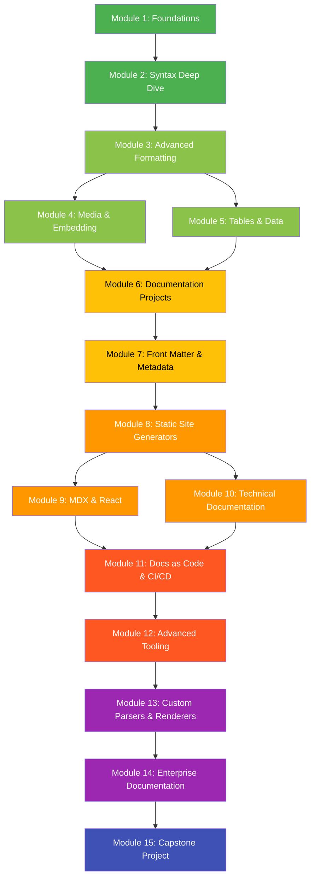
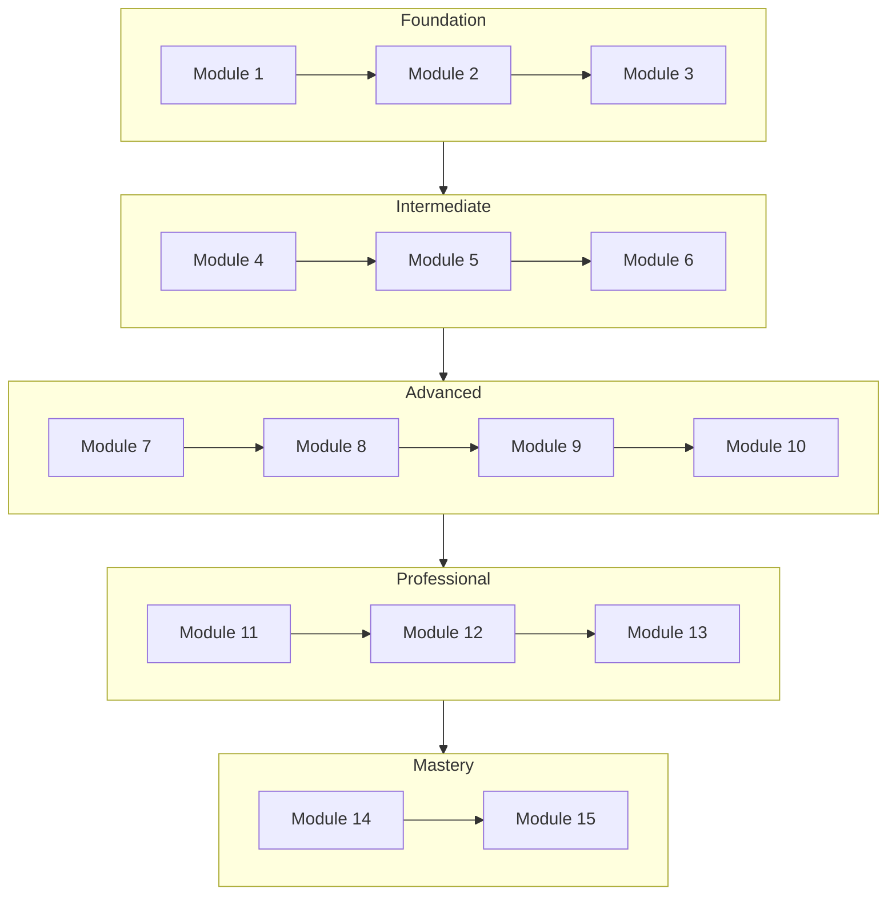
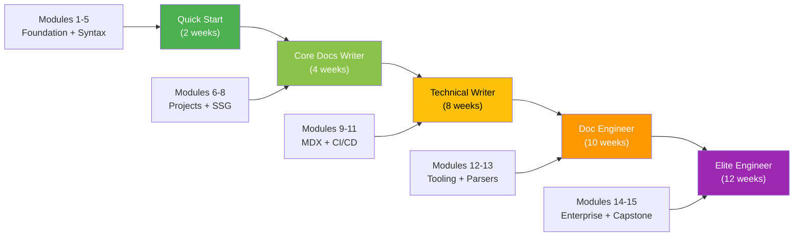

# Markdown Mastery: Beginner to Elite Documentation Engineer

<p align="center">
  
  
  
  
  
</p>

---

## Description

**Markdown Mastery** is a comprehensive, project-based course designed to take you from absolute beginner to elite-level documentation engineer. Markdown is the ubiquitous language of modern documentation, used across GitHub, GitLab, Notion, Obsidian, ReadTheDocs, Docusaurus, and virtually every developer tool in existence.

This course covers everything — from basic syntax and formatting to advanced topics like custom renderers, static site generation, MDX, documentation systems, API documentation, CI/CD pipelines for docs, and building your own Markdown-powered tools. Each module includes hands-on exercises, real-world projects, and professional best practices.

By the end, you will be able to design, build, deploy, and maintain enterprise-grade documentation systems using Markdown as the foundation.

---

## Target Audience

This course is for:

| Role | Why This Course |
|------|----------------|
| **Absolute Beginners** | Start from zero — no prior knowledge required |
| **Students** | Build a portable skill for technical writing and open source |
| **Software Developers** | Write better READMEs, docs, and commit messages |
| **Technical Writers** | Master modern documentation tooling and workflows |
| **DevOps Engineers** | Automate documentation generation and deployment |
| **Course Creators** | Build beautiful educational content |
| **Documentation Engineers** | Go from proficient to elite |
| **Open-Source Contributors** | Write exceptional project documentation |
| **Product Managers** | Create clear product specs and requirements docs |
| **Data Scientists** | Document notebooks, models, and analysis workflows |

---

## Prerequisites

**None.** Zero. Zip.

If you can open a text editor and type, you have everything you need. The course starts from the absolute basics and builds up step by step.

---

## What You'll Learn

By completing this course, you will master the following 25+ skills:

1. Write every Markdown element from memory (headings, lists, links, images, tables, code blocks, blockquotes, horizontal rules, footnotes, definition lists, task lists, emoji, comments, strikethrough, subscript, superscript, highlights)
2. Understand the differences between CommonMark, GFM, and other Markdown flavors
3. Create advanced tables with column alignment, merged cells, and nested content
4. Build complex nested lists and list structures
5. Write mathematical equations using LaTeX syntax within Markdown
6. Create diagrams using Mermaid (flowcharts, sequence diagrams, Gantt charts, class diagrams, state diagrams, pie charts, entity relationship diagrams, timeline diagrams, mindmaps, quadrant charts, requirement diagrams, block diagrams)
7. Design documentation information architecture and navigation systems
8. Build and deploy static documentation sites with Docusaurus, MkDocs, Hugo, and Jekyll
9. Configure and extend static site generators with plugins, themes, and custom components
10. Write MDX (Markdown with JSX) for React-powered documentation
11. Implement Docs as Code (DAC) workflows with CI/CD pipelines
12. Use front matter (YAML, TOML, JSON) for metadata management
13. Create custom Markdown parsers and renderers using JavaScript and Python
14. Write and run automated documentation tests (link checking, spell checking, validation)
15. Implement versioned documentation systems
16. Build a personal knowledge base and digital garden
17. Use advanced note-taking workflows with Obsidian and Notion
18. Design and maintain API documentation with OpenAPI/Swagger and Markdown
19. Create monorepo documentation strategies
20. Implement search functionality for documentation sites
21. Configure syntax highlighting for 100+ programming languages
22. Write effective README files, contributing guides, and code of conduct documents
23. Manage large-scale documentation projects across teams
24. Use Git-based documentation workflows (branching, reviewing, versioning)
25. Customize Markdown renderers with extensions and plugins
26. Automate documentation generation from code comments
27. Build interactive documentation with embedded code playgrounds
28. Create multilingual documentation sites
29. Implement accessibility best practices in documentation
30. Design documentation metrics and analytics

---

## Course Structure





## Module Dependency Tree

```mermaid
flowchart LR
    A["Module 1<br/>Foundations"] --> B["Module 2<br/>Syntax Deep Dive"]
    B --> C["Module 3<br/>Advanced Formatting"]
    C --> D["Module 4<br/>Media & Embedding"]
    C --> E["Module 5<br/>Tables & Data"]
    D --> F["Module 6<br/>Doc Projects"]
    E --> F
    F --> G["Module 7<br/>Front Matter & Metadata"]
    G --> H["Module 8<br/>Static Site Generators"]
    H --> I["Module 9<br/>MDX & React"]
    H --> J["Module 10<br/>Technical Docs"]
    I --> K["Module 11<br/>Docs as Code & CI/CD"]
    J --> K
    K --> L["Module 12<br/>Advanced Tooling"]
    L --> M["Module 13<br/>Custom Parsers & Renderers"]
    M --> N["Module 14<br/>Enterprise Docs"]
    N --> O["Module 15<br/>Capstone Project"]
```



---

## Module Listing

### Module 1: Foundations of Markdown
- What is Markdown? History and philosophy
- Why Markdown became the universal documentation language
- Setting up your development environment
- The philosophy of plain text
- Comparison with other markup languages (HTML, reStructuredText, AsciiDoc, LaTeX, Org-mode, Textile)
- Markdown flavors overview (CommonMark, GFM, MultiMarkdown, RMarkdown, etc.)
- Your first Markdown document
- Basic syntax: paragraphs, line breaks, headings, horizontal rules
- **Project:** Personal README file with bio, skills, and links

### Module 2: Syntax Deep Dive
- Text formatting: bold, italic, bold+italic, strikethrough, subscript, superscript, highlight, code spans
- Blockquotes: single, multi-paragraph, nested, with other elements
- Lists: ordered, unordered, nested, definition lists
- Task lists with checkboxes
- Links: inline, reference-style, relative, automatic, with titles
- Images: inline, reference-style, with alt text and titles
- Special characters and escaping
- HTML within Markdown
- **Project:** Project documentation landing page with navigation

### Module 3: Advanced Formatting
- Code blocks: fenced vs indented
- Syntax highlighting for 100+ languages
- Footnotes
- Table of contents (manual and auto-generated)
- Comments in Markdown
- Emoji shorthand
- Keyboard shortcuts notation
- Superscript and subscript
- Custom containers and callouts (obsidian, remark)
- Horizontal rules variations
- Line breaks and non-breaking spaces
- **Project:** Technical blog post with code examples, footnotes, and TOC

### Module 4: Media & Embedding
- Image syntax and best practices
- Image alignment and sizing
- Image captions
- Linked images
- Video embedding (HTML iframe, video tags)
- Audio embedding
- Iframe embeds (maps, forms, external content)
- SVG diagrams inline
- Mermaid diagrams introduction
- LaTeX math with KaTeX and MathJax
- **Project:** Travel documentation page with maps, images, and diagrams

### Module 5: Tables & Data
- Table syntax fundamentals
- Column alignment (left, center, right)
- Multi-line cells
- Lists within table cells
- Code within tables
- Links and images within tables
- Large table strategies (sortable, scrollable, paginated)
- Table generators and tools
- Converting CSV/JSON to Markdown tables
- Advanced table formatting with HTML
- **Project:** API reference documentation with endpoint tables

### Module 6: Documentation Projects
- Anatomy of a great README
- Contributing guides (CONTRIBUTING.md)
- Code of conduct (CODE_OF_CONDUCT.md)
- Changelog best practices (CHANGELOG.md)
- License files (LICENSE.md)
- Documentation folder structure
- Writing effective documentation
- Documentation styles and tone guides
- Technical writing best practices
- Docs review workflows
- **Project:** Complete open-source project documentation suite

### Module 7: Front Matter & Metadata
- Understanding metadata in Markdown
- YAML front matter: syntax and schema
- TOML front matter
- JSON front matter
- Custom front matter fields
- Front matter validation
- Using front matter for navigation, sidebars, and SEO
- Front matter for static site generators
- Date formatting and taxonomies
- Multi-language front matter
- **Project:** Blog post collection with categorized front matter

### Module 8: Static Site Generators
- Overview of SSG landscape
- **Docusaurus** deep dive: setup, configuration, plugins, themes, versioning, search, i18n
- **MkDocs** deep dive: material theme, plugins, customization
- **Hugo** deep dive: templates, shortcodes, multilingual, deployment
- **Jekyll** deep dive: Liquid templates, collections, GitHub Pages
- **VitePress** deep dive: Vue-powered, fast, minimal
- **Next.js** with Markdown: content layer, MDX, dynamic routing
- Comparing SSGs: when to use which
- Deployment strategies (Netlify, Vercel, GitHub Pages, Cloudflare Pages)
- **Project:** Full-featured documentation site with search and navigation

### Module 9: MDX & React
- What is MDX? Motivation and use cases
- Setting up MDX with Next.js and Docusaurus
- Importing and using React components in Markdown
- Custom MDX components and layouts
- MDX plugins and remark/rehype ecosystem
- Interactive documentation with MDX
- Code playgrounds and live editors
- MDX for design systems
- MDX limitations and best practices
- Custom MDX provider and theme
- **Project:** Interactive component documentation page with live playground

### Module 10: Technical Documentation
- API documentation with OpenAPI/Swagger
- SDK/library documentation patterns
- Architecture Decision Records (ADRs)
- Runbooks and operations guides
- Database documentation
- Configuration documentation
- Infrastructure documentation
- CLI tool documentation
- Microservices documentation strategy
- GraphQL documentation
- **Project:** Complete API documentation portal with interactive explorer

### Module 11: Docs as Code & CI/CD
- Docs as Code philosophy and principles
- Git workflows for documentation
- Branching strategies (Git Flow, GitHub Flow, Trunk-based)
- Documentation code review
- Automated testing for docs (link checking, spell checking, vale, alex)
- CI/CD pipelines for documentation
  - GitHub Actions
  - GitLab CI
  - CircleCI
- Preview environments for docs
- Automated deployment
- Documentation health metrics
- Breaking change documentation
- **Project:** Automated documentation pipeline with testing and deployment

### Module 12: Advanced Tooling
- Markdown linting (markdownlint, remark-lint)
- Link checkers (lychee, broken-link-checker)
- Spell checkers (cspell, hunspell, codespell)
- Prose linters (Vale, Alex, write-good)
- Grammar checkers (LanguageTool)
- Formatting tools (prettier, dprint)
- Table of contents generators
- Markdown to PDF conversion (pandoc)
- Markdown to HTML conversion
- Markdown to DOCX conversion
- Image optimization for docs
- SEO tools for documentation
- Analytics for documentation
- Search analytics
- **Project:** Documentation quality assurance dashboard

### Module 13: Custom Parsers & Renderers
- How Markdown parsers work (tokenization, parsing, rendering)
- CommonMark specification deep dive
- Building a custom parser in JavaScript (remark, marked)
- Building a custom parser in Python (mistune, markdown-it-py, python-markdown)
- Creating custom Markdown extensions
- Custom renderers (HTML, PDF, slides, Dash)
- Syntax highlighting customization
- Writing remark/rehype plugins
- Writing Python-Markdown extensions
- AST manipulation
- **Project:** Custom Markdown-to-Slides converter

### Module 14: Enterprise Documentation
- Documentation strategy and governance
- Documentation team structures
- Information architecture at scale
- Cross-team documentation workflows
- Monorepo documentation strategies
- Multi-product documentation
- Versioning strategies (semver, date-based, release-based)
- SEO for documentation
- Documentation analytics and metrics
- Accessibility in documentation (a11y)
- Multilingual documentation (i18n)
- Legal and compliance documentation
- Documentation SLAs and KPIs
- Training documentation teams
- **Project:** Enterprise documentation strategy proposal and implementation

### Module 15: Capstone Project
- Choose from:
  - Complete product documentation portal
  - Custom documentation generator tool
  - Open-source project documentation overhaul
  - Automated documentation pipeline with custom plugins
  - Interactive coding course platform
- Requirements gathering and planning
- Architecture and design
- Implementation
- Testing and quality assurance
- Deployment and monitoring
- Documentation of the project itself
- Peer review and feedback
- Final presentation
- Portfolio showcase

---

## Projects Overview

| Project | Module | Description |
|---------|--------|-------------|
| Personal README | 1 | Bio, skills, links, and social badges |
| Project Landing Page | 2 | Navigation, sections, links, images |
| Technical Blog Post | 3 | Code examples, footnotes, TOC |
| Travel Documentation | 4 | Embedded maps, images, Mermaid diagrams |
| API Reference | 5 | Endpoint tables, parameters, responses |
| Open-Source Docs Suite | 6 | README, CONTRIBUTING, CHANGELOG, LICENSE, CoC |
| Blog Collection | 7 | Front matter, categories, tags, SEO |
| Documentation Site | 8 | Full SSG site with search, nav, theming |
| Interactive Component Docs | 9 | MDX, React components, live playground |
| API Portal | 10 | OpenAPI, interactive explorer, SDK docs |
| CI/CD Pipeline | 11 | Automated build, test, deploy for docs |
| Quality Dashboard | 12 | Linting, link checking, spell checking |
| Slides Converter | 13 | Custom parser, renderer, theme system |
| Enterprise Strategy | 14 | IA, governance, versioning, i18n strategy |
| Capstone Showcase | 15 | Complete documentation system |

---

## Learning Path Recommendations



### Quick Start (2 weeks)
Focus on Modules 1-5. Learn all the syntax and formatting. Ideal for developers who just want to write better Markdown immediately.

### Core Docs Writer (4 weeks)
Modules 1-8. Learn syntax, documentation projects, and static site generation. Perfect for technical writers and open-source contributors.

### Technical Writer (8 weeks)
Modules 1-11. Add MDX, technical documentation, and CI/CD workflows. For professional technical writers and documentation engineers.

### Documentation Engineer (10 weeks)
Modules 1-13. Master advanced tooling and custom parser development. For engineers building documentation systems.

### Elite Engineer (12 weeks)
All 15 modules. Complete mastery including enterprise documentation strategies and the capstone project.

---

## Badges

Add these badges to your profile or README to showcase your progress:

### Level 1: Novice
```

```

### Level 2: Apprentice
```

```

### Level 3: Practitioner
```

```

### Level 4: Professional
```

```

### Level 5: Expert
```

```

### Level 6: Master
```

```

### Level 7: Elite
```

```

### Course Completion
```

```

---

## Instructor Note

This course was built by practitioners for practitioners. Every module has been tested, refined, and battle-hardened in real-world documentation projects — from startups to enterprise-scale systems.

The best way to learn Markdown is to **write Markdown**. Don't just read the modules. Type every example. Complete every project. Break things intentionally to understand how they work.

**The secret to mastery:** Consistency over intensity. Spend 30-60 minutes daily rather than cramming for hours. Documentation is a craft, and like any craft, it improves with regular practice.

If you get stuck:
- Re-read the relevant module section
- Experiment in your editor
- Check the glossary for unfamiliar terms
- Search the web for specific issues
- Practice more with your own projects

---

## Community

- **Discussions:** Share your projects, ask questions, and help fellow learners
- **Contributions:** Spot an error or improvement? Open a pull request!
- **Feedback:** Your feedback shapes the future of this course
- **Showcase:** Submit your capstone project for a chance to be featured

### Contributing

See [CONTRIBUTING.md](CONTRIBUTING.md) for guidelines on how to contribute to this course.

### Code of Conduct

See [CODE_OF_CONDUCT.md](CODE_OF_CONDUCT.md) for our community standards.

---

## License

This course is licensed under the [MIT License](LICENSE).

```
MIT License

Copyright (c) 2026 Markdown Mastery Course

Permission is hereby granted, free of charge, to any person obtaining a copy
of this software and associated documentation files (the "Software"), to deal
in the Software without restriction, including without limitation the rights
to use, copy, modify, merge, publish, distribute, sublicense, and/or sell
copies of the Software, and to permit persons to whom the Software is
furnished to do so, subject to the following conditions:

The above copyright notice and this permission notice shall be included in all
copies or substantial portions of the Software.

THE SOFTWARE IS PROVIDED "AS IS", WITHOUT WARRANTY OF ANY KIND, EXPRESS OR
IMPLIED, INCLUDING BUT NOT LIMITED TO THE WARRANTIES OF MERCHANTABILITY,
FITNESS FOR A PARTICULAR PURPOSE AND NONINFRINGEMENT. IN NO EVENT SHALL THE
AUTHORS OR COPYRIGHT HOLDERS BE LIABLE FOR ANY CLAIM, DAMAGES OR OTHER
LIABILITY, WHETHER IN AN ACTION OF CONTRACT, TORT OR OTHERWISE, ARISING FROM,
OUT OF OR IN CONNECTION WITH THE SOFTWARE OR THE USE OR OTHER DEALINGS IN THE
SOFTWARE.
```

---

<p align="center">
  <strong>Start your journey today. Write something remarkable.</strong>
</p>
