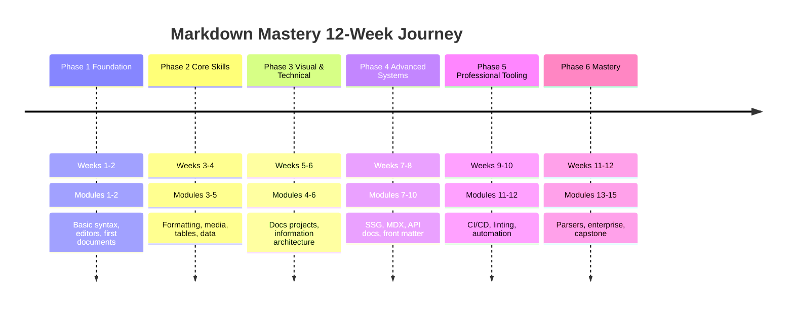
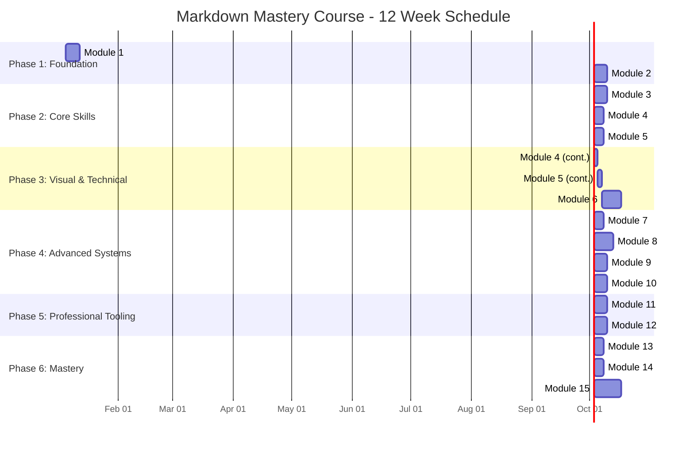
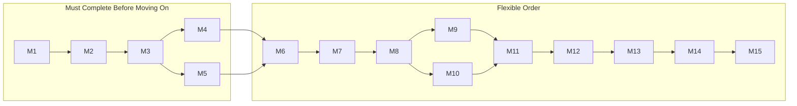

# Learning Roadmap: Markdown Mastery Course

**Duration:** 12 Weeks (3 Months)
**Commitment:** 5-10 hours per week
**Total:** ~90 hours of structured learning

---

## Timeline Overview

---

## Full 12-Week Schedule

---

## Phase 1: Foundation (Weeks 1-2)

**Goal:** Understand what Markdown is, set up your environment, and write basic Markdown documents confidently.

### Week 1: Module 1 — Foundations of Markdown

#### Topics
- History of Markdown (John Gruber, Aaron Swartz, 2004)
- Philosophy of plain text
- Markdown's rise as the universal documentation language
- Comparison with other markup languages (HTML, reStructuredText, AsciiDoc, LaTeX, Org-mode, Textile)
- Markdown flavors: CommonMark, GFM, MultiMarkdown, RMarkdown, MDX
- Setting up your editor (VS Code, Obsidian, Typora, iA Writer, Logseq)
- Markdown preview and live rendering
- Creating your first Markdown document
- Basic syntax: paragraphs, line breaks, headings (levels 1-6), horizontal rules
- File extensions: `.md`, `.markdown`, `.mdown`, `.mdx`
- Markdown best practices from day one

#### Daily Breakdown

| Day | Topic | Practice |
|-----|-------|----------|
| 1 | What is Markdown? History, philosophy, ecosystem | Install an editor, write 3 paragraphs |
| 2 | Markdown flavors comparison | Create a comparison table |
| 3 | Editor setup and configuration | Configure VS Code with Markdown extensions |
| 4 | Basic structure elements | Create a document with all 6 heading levels and HRs |
| 5 | Paragraphs and line breaks | Write a 500-word essay using proper spacing |
| 6 | Your first document | Write a personal bio with headings, paragraphs, HRs |
| 7 | Review and practice | Complete Project 1: Personal README |

#### Project: Personal README
Create a personal README file that includes:
- Name and tagline (H1)
- About me section (H2)
- Skills and technologies (H2 with lists)
- Current projects (H2 with links)
- Social links (H2 with reference-style links)
- Profile badge
- Horizontal rule separators

#### Milestone Checklist
- [ ] Can explain what Markdown is and why it matters
- [ ] Have a working Markdown editor configured
- [ ] Can write headings, paragraphs, and horizontal rules
- [ ] Completed Personal README project
- [ ] Understand the difference between Markdown flavors

---

### Week 2: Module 2 — Syntax Deep Dive

#### Topics
- Text formatting: bold (`**bold**`), italic (`*italic*`), bold+italic (`***bold+italic***`)
- Strikethrough (`~~strikethrough~~`)
- Subscript (`sub`) and superscript (`sup`)
- Highlight (`==highlight==` in some flavors)
- Inline code (`\`code\``)
- Blockquotes: single line, multi-paragraph, nested (up to 5 levels)
- Blockquotes with other elements (headings, lists, code blocks)
- Ordered lists: starting with 1., nested, with custom starting numbers
- Unordered lists: using `-`, `*`, `+`, nested lists
- Definition lists (`Term` / `: Definition`)
- Task lists: `- [ ]` and `- [x]`
- Inline links: `[text](url)`, `[text](url "title")`
- Reference-style links: `[text][ref]` and `[ref]: url`
- Relative links: `[about](../about.md)`
- Automatic links: `<https://example.com>`, `<email@example.com>`
- Images: ``, ``, reference-style
- Special characters escaping with backslash
- HTML within Markdown: divs, spans, inline styles
- Line break best practices (two spaces vs ` `)

#### Daily Breakdown

| Day | Topic | Practice |
|-----|-------|----------|
| 8 | Bold, italic, strikethrough, emphasis combinations | Format 20 sentences with various emphasis |
| 9 | Inline code, subscript, superscript, highlight | Create a chemical formula document |
| 10 | Blockquotes (all types) | Create nested blockquote with multiple elements |
| 11 | Lists (ordered, unordered, nested, task) | Build a complex project plan with task lists |
| 12 | Links (all 5 types) | Create a link directory with all link styles |
| 13 | Images, escaping, HTML elements | Embed images and use HTML for layout |
| 14 | Review and practice | Complete Project 2: Project Landing Page |

#### Project: Project Landing Page
Create a documentation landing page including:
- Project name and tagline
- Navigation links (reference-style)
- Feature list with formatted text
- Code installation instructions
- Quick start with task list
- Nested blockquote for notes/warnings
- Image with caption
- Link to full documentation

#### Milestone Checklist
- [ ] Can use all text formatting styles
- [ ] Can create complex nested lists and blockquotes
- [ ] Mastered all link types
- [ ] Can embed images with proper alt text
- [ ] Completed Project Landing Page project

---

## Phase 2: Core Skills (Weeks 3-4)

**Goal:** Master advanced formatting, media embedding, tables, and data presentation.

### Week 3: Module 3 — Advanced Formatting + Module 4 (Media Introduction)

#### Topics
- Fenced code blocks with language specifiers
- Indented code blocks (4 spaces)
- Syntax highlighting for 20+ languages
- Code blocks within lists and blockquotes
- Footnotes: `[^1]` and `[^1]: definition`
- Table of contents generation (manual, `[TOC]`, `<!-- TOC -->`)
- Comments: `<!-- comment -->`
- Emoji: `:smile:`, `:rocket:`, `:warning:`
- Keyboard shortcuts notation: `<kbd>Ctrl</kbd>+<kbd>C</kbd>`
- Custom containers/callouts (Obsidian, remark): `> [!NOTE]`, `> [!WARNING]`, `> [!TIP]`, `> [!CAUTION]`, `> [!IMPORTANT]`
- Non-breaking spaces (`&nbsp;`)
- Horizontal rules variations (`---`, `***`, `___`)
- Introduction to Mermaid: first flowchart
- Introduction to LaTeX: basic math notation

#### Daily Breakdown

| Day | Topic | Practice |
|-----|-------|----------|
| 15 | Fenced code blocks, syntax highlighting | Create code samples in 10+ languages |
| 16 | Footnotes, TOC, comments, emoji | Add footnotes and TOC to an existing doc |
| 17 | Custom containers/callouts | Create a warning/note/caution system |
| 18 | Keyboard shortcuts, special characters | Write keyboard shortcut documentation |
| 19 | Mermaid introduction | Create a basic flowchart |
| 20 | LaTeX introduction | Write 10 mathematical equations |
| 21 | Review and practice | Combine all techniques in one document |

#### Milestone Checklist
- [ ] Can use syntax highlighting for multiple languages
- [ ] Can create footnotes and auto-generate TOC
- [ ] Understand Mermaid basics
- [ ] Can write LaTeX math expressions
- [ ] Can use custom callouts effectively

---

### Week 4: Module 4 (Media) + Module 5 (Tables)

#### Topics
- Image syntax: sizing, alignment, captions
- Linked images: clickable images
- Image formats: PNG, JPEG, GIF, SVG, WebP
- Image optimization for documentation
- Video embedding: HTML5 `<video>`, YouTube iframes
- Audio embedding
- SVG diagrams inline
- Advanced Mermaid diagrams: sequence diagrams, class diagrams, state diagrams
- Entity Relationship Diagrams (ERD) in Mermaid
- User Journey diagrams in Mermaid

#### Tables
- Table syntax: pipes, dashes, colons
- Column alignment: left `:---`, center `:---:`, right `---:`
- Multi-line cells using HTML ` `
- Lists within table cells
- Code blocks within tables (HTML hack)
- Table generators and tools
- CSV to Markdown table conversion
- JSON to Markdown table conversion
- Large table display strategies
- HTML tables within Markdown for complex layouts

#### Daily Breakdown

| Day | Topic | Practice |
|-----|-------|----------|
| 22 | Images: sizing, alignment, linked images | Create an image gallery page |
| 23 | Video and audio embedding | Embed a YouTube video and audio clip |
| 24 | Mermaid: sequence, class, state diagrams | Document a system with 3 diagram types |
| 25 | Table fundamentals and alignment | Create tables with all 3 alignment types |
| 26 | Advanced tables (nested content, HTML) | Build a complex data table |
| 27 | Table generators and data conversion | Convert CSV data to Markdown table |
| 28 | Review and practice | Complete Project 5: API Reference Tables |

#### Project: API Reference Tables
Create comprehensive API documentation tables for a REST API:
- Endpoint list table with methods, paths, descriptions
- Parameters table with name, type, required, description, default
- Response codes table
- Request/response example tables
- Rate limiting table
- Pagination parameters table

#### Milestone Checklist
- [ ] Can embed and format images properly
- [ ] Can create Mermaid sequence, class, and state diagrams
- [ ] Can build tables with proper alignment
- [ ] Can create complex tables with nested content
- [ ] Completed API Reference Tables project

---

## Phase 3: Visual & Technical Documentation (Weeks 5-6)

**Goal:** Build complete documentation projects and understand information architecture.

### Week 5: Module 6 — Documentation Projects (Part 1)

#### Topics
- Anatomy of a great README
- README templates and patterns
- The README paradox: brief but comprehensive
- Badges: shields.io, custom badges
- Writing effective project descriptions
- Installation guides and quick starts
- Usage examples and code samples
- Contributing guides (CONTRIBUTING.md)
- Pull request templates
- Issue templates
- Code of Conduct (CODE_OF_CONDUCT.md)
- Changelog management (CHANGELOG.md, Keep a Changelog, semantic versioning)
- License files: MIT, Apache 2.0, GPL, BSD
- Documentation folder structure patterns

#### Daily Breakdown

| Day | Topic | Practice |
|-----|-------|----------|
| 29 | README anatomy and templates | Analyze 5 great open-source READMEs |
| 30 | Badges, descriptions, installation guides | Add badges to a project |
| 31 | Contributing guides and templates | Write a CONTRIBUTING.md |
| 32 | Code of Conduct and Issue templates | Create issue templates |
| 33 | Changelog and License | Write a changelog, choose a license |
| 34 | Documentation folder structure | Design a documentation tree |
| 35 | Review and practice | Start building Project 6 |

#### Milestone Checklist
- [ ] Understand README anatomy
- [ ] Can create CONTRIBUTING.md and CODE_OF_CONDUCT.md
- [ ] Can manage a changelog
- [ ] Understand open-source documentation structure

---

### Week 6: Module 6 (Part 2) + Module 7 Introduction

#### Topics
- Documentation tone and style guides
- Google Developer Documentation Style Guide
- Microsoft Style Guide
- Documentation personas and user journeys
- Information architecture fundamentals
- Content hierarchy and chunking
- Writing for scanability
- Cross-referencing documentation
- SEO for documentation
- Docs review checklist
- Documentation maintenance strategies
- Introduction to front matter (YAML)

#### Daily Breakdown

| Day | Topic | Practice |
|-----|-------|----------|
| 36 | Writing style and tone | Rewrite existing docs in a consistent style |
| 37 | Information architecture | Create a sitemap for a documentation site |
| 38 | SEO and search optimization | Add SEO metadata to documentation |
| 39 | Documentation review process | Review a peer's documentation |
| 40 | YAML front matter introduction | Add front matter to 10 documents |
| 41 | Front matter fields and validation | Create a front matter schema |
| 42 | Review and polish | Complete Project 6: Open-Source Docs Suite |

#### Project: Open-Source Documentation Suite
Create a complete documentation suite for a hypothetical open-source project:
- README.md with badges, installation, usage, examples
- CONTRIBUTING.md with setup, coding standards, PR process
- CODE_OF_CONDUCT.md
- CHANGELOG.md
- LICENSE (MIT)
- Issue templates (bug report, feature request)
- PR template
- docs/index.md (documentation home)
- docs/installation.md
- docs/usage.md
- docs/api.md
- docs/faq.md

#### Milestone Checklist
- [ ] Completed full open-source docs suite
- [ ] Understand documentation information architecture
- [ ] Can write in a consistent style and tone
- [ ] Can use YAML front matter for metadata

---

## Phase 4: Advanced Systems (Weeks 7-8)

**Goal:** Master static site generators, MDX, front matter, and technical documentation.

### Week 7: Module 7 (Front Matter) + Module 8 (SSG Intro)

#### Topics
- YAML front matter: all data types (strings, numbers, booleans, arrays, objects)
- Nested front matter structures
- Custom front matter fields
- Front matter for navigation
- Front matter for SEO (title, description, keywords, og:image)
- Front matter for theming and layout
- Front matter for taxonomies (tags, categories, series)
- Date formatting standards (ISO 8601)
- Draft/published status
- Front matter validation with JSON Schema
- Static Site Generator landscape overview
- Docusaurus project setup
- MkDocs project setup

#### Daily Breakdown

| Day | Topic | Practice |
|-----|-------|----------|
| 43 | YAML front matter deep dive | Create front matter with all data types |
| 44 | Front matter for navigation and SEO | Build a nav tree using front matter |
| 45 | Front matter validation and schemas | Create a JSON Schema for front matter |
| 46 | SSG landscape and comparison | Compare 5 SSGs, choose one for your project |
| 47 | Docusaurus setup and configuration | Initialize and configure Docusaurus |
| 48 | MkDocs setup and configuration | Initialize and configure MkDocs Material |
| 49 | Review and practice | Complete Project 7: Blog Collection |

#### Project: Blog Collection
Create a blog collection with:
- 5 blog posts with YAML front matter
- Categories and tags taxonomy
- Author information in front matter
- Draft/published status
- Custom front matter fields (reading time, difficulty level)
- Blog index page with filtering
- RSS feed generation

#### Milestone Checklist
- [ ] Mastered YAML front matter
- [ ] Can set up and configure Docusaurus project
- [ ] Can set up and configure MkDocs project
- [ ] Understand SSG selection criteria

---

### Week 8: Modules 8-10 (SSG Deep Dive + Technical Docs)

#### Topics
- Docusaurus: plugins, themes, versioning, search, i18n
- Docusaurus: custom pages, blog, docs mode
- MkDocs Material: theme configuration, plugins, customization
- Hugo: templates, shortcodes, multilingual, deployment
- Jekyll: Liquid templates, collections, GitHub Pages integration
- **MDX**: What is MDX, setting up MDX with Next.js
- MDX: importing React components, custom components, layouts
- MDX: remark/rehype plugins
- MDX: live code playgrounds (react-live, codesandbox)
- **Technical Documentation**: API docs with OpenAPI/Swagger
- SDK/library documentation patterns
- Architecture Decision Records (ADRs)
- CLI tool documentation structure

#### Daily Breakdown

| Day | Topic | Practice |
|-----|-------|----------|
| 50 | Docusaurus plugins and themes | Add 3 plugins to Docusaurus site |
| 51 | Docusaurus versioning and i18n | Set up versioned docs |
| 52 | MkDocs customization | Customize MkDocs Material theme |
| 53 | MDX fundamentals | Create first MDX document |
| 54 | MDX custom components | Build custom MDX components |
| 55 | OpenAPI documentation | Document a REST API with OpenAPI |
| 56 | Review and practice | Work on Project 8 and Project 9 |

#### Projects
**Project 8:** Full-featured documentation site with Docusaurus or MkDocs including theme, search, navigation, and custom pages.

**Project 9:** Interactive component documentation page with MDX, live code playground, and custom React components.

**Project 10:** Complete API documentation portal with OpenAPI specification and interactive explorer.

#### Milestone Checklist
- [ ] Can build and deploy a full SSG documentation site
- [ ] Can write MDX with custom React components
- [ ] Can document APIs using OpenAPI
- [ ] Can create interactive documentation

---

## Phase 5: Professional Tooling (Weeks 9-10)

**Goal:** Implement Docs as Code workflows, CI/CD pipelines, and professional quality assurance.

### Week 9: Module 11 — Docs as Code & CI/CD

#### Topics
- Docs as Code philosophy and principles
- Documentation in version control
- Git workflows for documentation teams
- Branching strategies: Git Flow, GitHub Flow, Trunk-based
- Documentation code review process
- Pull request templates for docs
- Documentation review checklists
- Automated link checking (lychee, broken-link-checker, htmlproofer)
- Automated spell checking (cspell, hunspell, codespell)
- Automated prose linting (Vale, Alex, write-good)
- GitHub Actions for documentation
- GitLab CI for documentation
- Netlify/Vercel preview deployments
- Documentation build pipelines
- Automated deployment strategies
- Documentation health metrics

#### Daily Breakdown

| Day | Topic | Practice |
|-----|-------|----------|
| 57 | Docs as Code principles | Convert existing docs to Docs as Code workflow |
| 58 | Git branching for docs | Create a branching strategy document |
| 59 | Automated link checking | Set up lychee in a GitHub Action |
| 60 | Automated spell checking | Set up cspell with project dictionary |
| 61 | Prose linting with Vale | Create Vale style rules |
| 62 | CI/CD pipeline for docs | Build a complete GitHub Actions pipeline |
| 63 | Review and practice | Complete Project 11: CI/CD Pipeline |

#### Project: CI/CD Documentation Pipeline
Build a complete automated documentation pipeline:
- GitHub Actions workflow that runs on PR and push
- Link checking step
- Spell checking step  
- Prose linting step
- Build step (Docusaurus/MkDocs)
- Preview deployment (Vercel/Netlify)
- Production deployment on merge to main
- Documentation status badge in README

#### Milestone Checklist
- [ ] Understand Docs as Code principles
- [ ] Can set up automated documentation testing
- [ ] Can build CI/CD pipelines for documentation
- [ ] Can implement preview deployments
- [ ] Completed CI/CD pipeline project

---

### Week 10: Module 12 — Advanced Tooling

#### Topics
- Markdown linting: markdownlint configuration
- markdownlint rules: MD001-MD058
- Custom markdownlint rules
- Prettier for Markdown formatting
- dprint for Markdown formatting
- Table of contents generators (doctoc, markdown-toc)
- Markdown to PDF with Pandoc
- Markdown to DOCX conversion
- Markdown to slides (Marp, Slidev, reveal-md)
- Image optimization: compression, formats, responsive images
- SEO tools for documentation
- Documentation analytics: Google Analytics, Plausible, Fathom
- Search analytics for documentation
- Accessibility tools for documentation
- Grammar checking with LanguageTool
- Documentation quality scorecards

#### Daily Breakdown

| Day | Topic | Practice |
|-----|-------|----------|
| 64 | markdownlint configuration | Create a .markdownlint.json config |
| 65 | Prettier and dprint for Markdown | Set up auto-formatting |
| 66 | Pandoc and document conversion | Convert Markdown to PDF, DOCX, HTML |
| 67 | Marp and Markdown slides | Create a presentation from Markdown |
| 68 | Image optimization workflow | Set up image optimization pipeline |
| 69 | Quality scorecard | Build a documentation quality dashboard |
| 70 | Review and practice | Complete Project 12: Quality Dashboard |

#### Project: Documentation Quality Dashboard
Build a documentation quality assurance system:
- markdownlint configuration with project-specific rules
- Prettier/dprint formatting configuration
- Custom spell check dictionary
- Vale configuration with project style rules
- Link checker integration
- Documentation quality score script
- Documentation quality badge
- Automated quality report generation

#### Milestone Checklist
- [ ] Can configure and customize markdownlint
- [ ] Can set up auto-formatting for Markdown
- [ ] Can convert Markdown to multiple output formats
- [ ] Can build Markdown presentations
- [ ] Completed quality dashboard project

---

## Phase 6: Mastery (Weeks 11-12)

**Goal:** Build custom parsers, implement enterprise documentation strategies, and complete the capstone.

### Week 11: Modules 13-14 (Custom Parsers + Enterprise)

#### Topics
- How Markdown parsers work internally
- Tokenization phase: breaking text into tokens
- Parsing phase: building an AST (Abstract Syntax Tree)
- Rendering phase: transforming AST to output
- CommonMark specification deep dive
- Building a custom parser with remarkable (JavaScript)
- Building a custom parser with mistune (Python)
- Creating custom Markdown extensions
- remark plugins: transformer, compiler, and syntax plugins
- rehype plugins: HTML transformation
- Python-Markdown extensions
- AST manipulation and transformation
- Custom renderers: HTML, PDF, slides, JSON, custom formats
- Custom syntax highlighting themes

#### Enterprise Documentation
- Documentation strategy and governance
- Documentation team structures
- Information architecture at scale
- Cross-team documentation workflows
- Monorepo documentation strategies
- Multi-product documentation portals
- Versioning strategies (semver, date-based, release-based)
- SEO for enterprise documentation
- Documentation analytics and metrics
- Accessibility (a11y) in documentation
- Internationalization (i18n) strategies
- Legal and compliance documentation
- Documentation SLAs and KPIs

#### Daily Breakdown

| Day | Topic | Practice |
|-----|-------|----------|
| 71 | How Markdown parsers work | Draw the parser pipeline |
| 72 | Building a custom parser (JavaScript) | Create a parser that outputs JSON AST |
| 73 | remark/rehype plugins | Build a custom remark plugin |
| 74 | Python-Markdown extensions | Build a custom Python extension |
| 75 | Custom renderers | Build a renderer that outputs custom format |
| 76 | Enterprise documentation strategy | Design an enterprise doc strategy |
| 77 | Review and practice | Complete Project 13 and Project 14 |

#### Project 13: Custom Markdown-to-Slides Converter
Build a tool that converts Markdown into presentation slides:
- Custom parser that extracts slide breaks (---)
- Theme system with CSS customization
- Code syntax highlighting
- Speaker notes support
- Export to HTML and PDF
- Slide numbering and navigation

#### Project 14: Enterprise Documentation Strategy
Create a comprehensive enterprise documentation strategy:
- Current state assessment
- Documentation maturity model
- Team structure and roles
- Tooling recommendations
- Governance framework
- Metrics and KPIs
- Implementation roadmap
- Budget and resource estimates

#### Milestone Checklist
- [ ] Understand Markdown parsing pipeline
- [ ] Can build custom remark/rehype plugins
- [ ] Can build custom renderers
- [ ] Understand enterprise documentation strategy
- [ ] Completed custom parser and enterprise projects

---

### Week 12: Module 15 — Capstone Project

#### Topics
- Project planning and scoping
- Requirements gathering
- Architecture design
- Implementation methodology
- Testing strategy
- Deployment planning
- Documentation of the project
- Peer review process
- Portfolio preparation
- Presentation skills

#### Capstone Options

**Option A: Complete Product Documentation Portal**
Build a full documentation portal for a product (real or fictional):
- Multiple product sections
- Versioned documentation
- Search functionality
- Interactive examples
- API documentation
- Tutorial system
- Analytics integration
- i18n support

**Option B: Custom Documentation Generator**
Build a CLI tool that generates documentation:
- Markdown input processing
- Multiple output formats (HTML, PDF, DOCX, slides)
- Theme/plugin system
- Watch mode with live reload
- Asset optimization
- Deployment integration

**Option C: Open-Source Project Overhaul**
Take an existing open-source project and completely overhaul its documentation:
- Rewrite README
- Create full documentation site
- Add API documentation
- Implement Docs as Code workflow
- Add CI/CD pipeline
- Create contributing guide
- Add interactive examples

**Option D: Automated Documentation Pipeline**
Build a comprehensive automated documentation pipeline:
- Multi-repository documentation aggregation
- Automated testing and quality gates
- Preview environments
- Version management
- Search indexing
- Analytics pipeline
- Alerting and monitoring

**Option E: Interactive Coding Course Platform**
Build an interactive course platform powered by Markdown:
- Course structure in Markdown with front matter
- Interactive code exercises
- Progress tracking
- Quiz system
- Certificate generation
- Student dashboard

#### Daily Breakdown

| Day | Topic | Deliverable |
|-----|-------|-------------|
| 78 | Project selection and planning | Project plan document |
| 79-80 | Implementation sprint 1 | Core functionality |
| 81-82 | Implementation sprint 2 | Advanced features |
| 83 | Testing and quality assurance | Test results |
| 84 | Deployment and polish | Live deployment |
| 85 | Documentation and portfolio | Project README, case study |
| 86 | Final review and presentation | Final submission |

#### Capstone Milestone Checklist
- [ ] Selected and scoped capstone project
- [ ] Completed implementation
- [ ] Tested and quality assured
- [ ] Deployed or published
- [ ] Documented the project
- [ ] Created portfolio case study
- [ ] Completed peer review

---

## Weekly Time Commitment

| Phase | Weeks | Hours/Week | Total Hours |
|-------|-------|------------|-------------|
| Foundation | 1-2 | 5 | 10 |
| Core Skills | 3-4 | 7 | 14 |
| Visual & Technical | 5-6 | 8 | 16 |
| Advanced Systems | 7-8 | 10 | 20 |
| Professional Tooling | 9-10 | 8 | 16 |
| Mastery | 11-12 | 12 | 24 |
| **Total** | **1-12** | **8.3 avg** | **~100** |

---

## Success Criteria

By the end of this roadmap, you should be able to:

### Foundation Level
- [ ] Write any Markdown element without looking up syntax
- [ ] Understand flavor differences (CommonMark vs GFM vs others)
- [ ] Set up a productive Markdown editing environment

### Intermediate Level
- [ ] Create complex documents with tables, diagrams, math, and media
- [ ] Build a complete open-source documentation suite
- [ ] Use front matter for metadata management

### Advanced Level
- [ ] Build and deploy a static documentation site
- [ ] Write interactive documentation with MDX
- [ ] Document APIs using OpenAPI
- [ ] Implement automated CI/CD for documentation

### Professional Level
- [ ] Set up documentation quality assurance tooling
- [ ] Build custom Markdown parsers and renderers
- [ ] Design enterprise documentation strategies

### Mastery Level
- [ ] Complete a comprehensive capstone project
- [ ] Have a portfolio-ready documentation project
- [ ] Be job-ready for documentation engineer roles

---

## Quick Reference: Module Dependencies

### Prerequisite Map

| Module | Prerequisites |
|--------|---------------|
| M1: Foundations | None |
| M2: Syntax Deep Dive | M1 |
| M3: Advanced Formatting | M2 |
| M4: Media & Embedding | M3 |
| M5: Tables & Data | M3 |
| M6: Documentation Projects | M4, M5 |
| M7: Front Matter & Metadata | M6 |
| M8: Static Site Generators | M7 |
| M9: MDX & React | M8 |
| M10: Technical Documentation | M8 |
| M11: Docs as Code & CI/CD | M9, M10 |
| M12: Advanced Tooling | M11 |
| M13: Custom Parsers & Renderers | M12 |
| M14: Enterprise Documentation | M13 |
| M15: Capstone Project | M14 |

---

## Additional Resources

- **Module study guides:** Detailed notes for each module in `/guides/`
- **Exercise solutions:** Sample solutions in `/solutions/`
- **Project templates:** Starter templates in `/templates/`
- **Reference implementations:** Example projects in `/examples/`
- **Cheatsheet:** Quick reference in `CHEATSHEET.md`
- **Glossary:** Term definitions in `GLOSSARY.md`
- **FAQ:** Common questions in `FAQ.md`

---

  <strong>Consistency beats intensity. 30-60 minutes daily > 6 hours on weekends.</strong> 
  <em>Happy documenting!</em>

