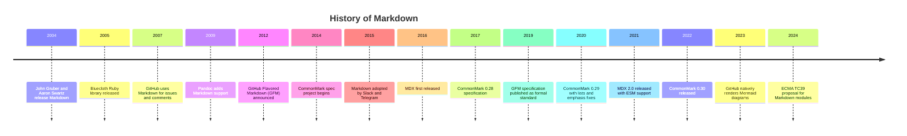
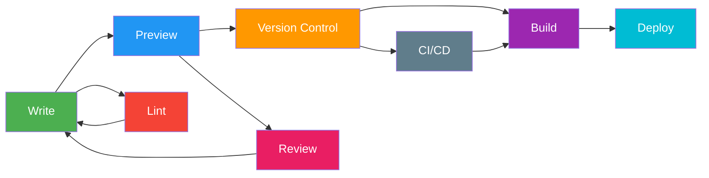

# Module 1: Introduction to Markdown

> Welcome to the first module of the Markdown Mastery Course. In this module, you will learn what Markdown is, why it was created, how it evolved, and why it has become the de facto standard for documentation across the technology industry. By the end of this module, you will have your Markdown environment set up and have written your first Markdown document.

---

## Module Objectives

By the end of this module, you will be able to:

- Explain what Markdown is and why it exists
- Describe the history and evolution of Markdown from 2004 to present
- Identify the key benefits and use cases of Markdown
- Distinguish between different Markdown flavors (CommonMark, GFM, MDX)
- Set up a Markdown editing environment
- Write a basic Markdown document with headings, lists, links, and formatting

---

## 1.1 What is Markdown?

Markdown is a lightweight markup language for creating formatted text using a plain-text editor. It was designed to be easy to write, easy to read in its raw form, and easy to convert to HTML and other formats.

At its core, Markdown is a set of conventions for adding formatting elements to plain text. Instead of using complex HTML tags or WYSIWYG editor buttons, you use intuitive punctuation characters:

```markdown
# This is a heading

This is a **bold** statement with an *italic* word.

- This is a list item
- This is another list item

[This is a link](https://example.com)
```

The beauty of Markdown is that the raw text is just as readable as the rendered output. You do not need to imagine what the formatting will look like -- you can see it directly in the source.

### The Origin Story

Markdown was created in 2004 by **John Gruber**, a blogger and web developer, in collaboration with **Aaron Swartz**, a programmer and internet activist. Gruber wanted a format that would allow him to write blog posts for his site Daring Fireball without having to type HTML tags directly.

The key insight was that people were already using certain conventions in plain-text emails to indicate formatting. For example:
- Asterisks around words for emphasis: `*important*`
- Dashes at the start of lines for lists: `- item`
- Numbered lists with digits: `1. first`

Markdown formalized these existing conventions into a consistent syntax. The name Markdown is a play on markup -- it is a markup language that is intentionally minimal, or marked down.

### The Philosophy

Gruber stated the core philosophy succinctly:

> A Markdown-formatted document should be publishable as-is, as plain text, without looking like it has been marked up with tags or formatting instructions. Readability is paramount.

This philosophy has guided Markdown's design and evolution. Every syntax decision was made with readability in mind:

- `**bold**` is naturally readable as bold text
- `## Heading` clearly indicates a second-level heading
- `- List item` is obviously a list item
- `[text](url)` is recognizable as a link

This contrasts sharply with HTML, where the same content requires tags that obscure the actual text:

```html
<h2>Heading</h2>
<ul>
  <li><strong>bold</strong> text</li>
</ul>
<p><a href="url">link</a></p>
```

---

## 1.2 History of Markdown

The history of Markdown is a story of organic growth, community fragmentation, and eventual standardization. Here is the complete timeline of key events.

### Timeline Diagram



### Detailed Timeline

**2004: The Birth**
John Gruber publishes the first Markdown specification on Daring Fireball and releases Markdown.pl, a Perl-based converter. Aaron Swartz contributes the atx-style heading syntax (using # characters) and the idea of inline HTML.

**2005-2006: Early Adoption**
Markdown is adopted by early blogging platforms and content management systems. The first third-party implementations appear in Ruby (BlueCloth), Python (Markdown), and PHP (PHP Markdown). These implementations introduce subtle differences in behavior.

**2007: GitHub Discovers Markdown**
GitHub adopts Markdown for README files, issues, and comments. This is a pivotal moment -- GitHub's massive user base makes Markdown the standard format for software documentation. GitHub begins adding extensions like task lists and emoji.

**2009: Pandoc Enters the Scene**
John MacFarlane releases Pandoc, a universal document converter that supports Markdown input and output. Pandoc Markdown becomes the most feature-rich Markdown variant, supporting citations, footnotes, math, and tables.

**2012: GitHub Flavored Markdown**
GitHub officially announces GitHub Flavored Markdown (GFM), adding tables, task lists, strikethrough, autolinks, and fenced code blocks. GFM becomes the de facto standard for developer documentation.

**2014: The Fragmentation Problem**
By this point, there are dozens of incompatible Markdown implementations. The same document renders differently in different tools. Jeff Atwood (Stack Overflow co-founder) and John MacFarlane launch the CommonMark project to create a rigorous, unambiguous specification with a comprehensive test suite.

**2015-2016: Mainstream Adoption**
Markdown is adopted by messaging platforms like Slack and Telegram. The format spreads beyond developer tools into general-purpose communication. MDX (Markdown + JSX) is first released, enabling React components in Markdown.

**2017-2019: Standardization Progress**
CommonMark releases version 0.28, significantly reducing ambiguity in the specification. GitHub publishes the official GFM specification as a formal standard based on CommonMark.

**2020-2022: Maturation**
CommonMark 0.29 addresses long-standing issues with list parsing and emphasis. MDX 2.0 is released with better performance and ESM support. CommonMark 0.30 further refines the specification.

**2023-Present: Native Support**
GitHub adds native rendering for Mermaid diagrams. The ECMA TC39 committee considers a proposal for standardized Markdown modules in JavaScript. Markdown continues to expand into new domains: knowledge management (Obsidian, Logseq), course platforms, and AI-assisted content creation.

---

## 1.3 Why Markdown Exists

Markdown was created to solve specific problems that existed in the early 2000s web publishing landscape.

### The Problem with HTML Editing

Before Markdown, writing content for the web meant either:

1. **Writing raw HTML:** Content creators had to manually type tags like `<h1>`, `<p>`, `<strong>`, and `<a href="">`. This was error-prone, tedious, and made the text hard to read in its raw form.

2. **Using WYSIWYG editors:** Tools like Microsoft FrontPage and Adobe Dreamweaver generated HTML behind the scenes, but often produced bloated, inconsistent code. WYSIWYG editors were slow, had compatibility issues, and sometimes corrupted content.

3. **Using content management systems:** Platforms like Movable Type and WordPress had text editors, but they were platform-specific and did not produce portable content.

```html
<!-- Raw HTML - difficult to read and write -->
<h2>Getting Started</h2>
<p>To begin, you need to download the <strong>latest version</strong> of the software. Visit our <a href="/download">download page</a> for options.</p>
<ul>
  <li>Windows users: download the <code>.exe</code> file</li>
  <li>Mac users: download the <code>.dmg</code> file</li>
</ul>
```

```markdown
## Getting Started

To begin, you need to download the **latest version** of the software. Visit our [download page](/download) for options.

- Windows users: download the `.exe` file
- Mac users: download the `.dmg` file
```

### The Need for Readability

Gruber's key observation was that most HTML formatting followed patterns that already existed in plain-text email. People were already using conventions like:

- `*emphasis*` in emails
- `# Topic` in forum posts
- `- Item` in text files

Markdown formalized these conventions into a syntax that was both human-readable and machine-convertible. A Markdown file can be read as-is without any rendering tool.

### Plain Text Focus

Markdown prioritizes plain text over rich formatting. This means:

- No complex file formats (no .docx, no .rtf)
- No proprietary lock-in
- Universal compatibility across operating systems
- Future-proof archiving
- Fast loading and editing even on low-end hardware

---

## 1.4 Benefits of Markdown

### 1.4.1 Plain Text Portability

Markdown files are plain text (.md extension). They can be opened in any text editor on any operating system. There is no need for special software to read or write Markdown.

### 1.4.2 Future-Proof

Plain text is the most durable format for long-term storage. A Markdown file created in 2004 will still be readable in 2104. Compare this with proprietary formats that become obsolete as software changes.

### 1.4.3 Readable Raw

Markdown is designed to be readable in its raw form. You can read a Markdown file in a terminal, on GitHub, or in any text viewer and understand the content without rendering it.

### 1.4.4 Version Control Friendly

Markdown files work exceptionally well with version control systems like Git:

- Diffs are readable and meaningful
- Merge conflicts are rare and easy to resolve
- Changes are line-based and clear
- History tracking shows actual content changes

```diff
+ ## New Section Added
- ## Old Section Title
```

### 1.4.5 Platform Independent

Markdown works everywhere: GitHub, GitLab, Bitbucket, Slack, Discord, Notion, Obsidian, VS Code, Jupyter, WordPress, Ghost, and hundreds of other platforms.

### 1.4.6 Easy to Learn

The basic Markdown syntax can be learned in under an hour. There are only a handful of core constructs: headings, emphasis, lists, links, images, and code blocks.

### 1.4.7 Converts to Many Formats

Markdown can be converted to:

| Format | Tool |
|--------|------|
| HTML | Most Markdown processors |
| PDF | Pandoc, wkhtmltopdf |
| DOCX | Pandoc |
| EPUB | Pandoc, Calibre |
| LaTeX | Pandoc |
| Slides (reveal.js, Beamer) | Pandoc, Marp |
| Wiki markup | Pandoc |
| Man pages | Pandoc |
| Plain text | Any processor |
| JSON | Custom scripts |

### 1.4.8 Wide Tool Support

The Markdown ecosystem includes tools for every need:

- **Editors:** VS Code, Obsidian, Typora, iA Writer
- **Linters:** markdownlint, remark-lint, Vale
- **Converters:** Pandoc, Unified/remark, markdown-it
- **Renderers:** GitHub, GitLab, Bitbucket, many SSGs
- **Generators:** VitePress, Docusaurus, MkDocs, Astro
- **Extenders:** MDX, Mermaid, LaTeX, custom plugins

---

## 1.5 Use Cases

### Blogging

Markdown is the standard format for many blogging platforms. Ghost, WordPress (via plugins), Jekyll, Hugo, and many static site generators use Markdown for blog content.

### Documentation

Software documentation is the dominant use case for Markdown. README files, API docs, user guides, and knowledge bases are overwhelmingly written in Markdown.

### Note-Taking

Personal knowledge management tools like Obsidian, Logseq, Roam Research, and Notion use Markdown or Markdown-inspired syntax for note-taking.

### Books

Many technical books are written in Markdown and converted to PDF or EPUB using Pandoc. The leanpub platform uses Markdown for self-publishing.

### README Files

Every GitHub repository has a README.md file. This is the most visible use of Markdown -- millions of README files use Markdown formatting.

### Forums and Discussions

Stack Overflow, Reddit (new editor), GitHub Discussions, and Discourse use Markdown for user-generated content.

### Knowledge Bases

Internal company wikis, knowledge bases, and documentation portals use Markdown with static site generators.

### Course Platforms

Interactive course platforms use MDX for embedding code editors, quizzes, and interactive components in Markdown content.

### API Documentation

API documentation tools like Stoplight, Redoc, and Docusaurus use Markdown/MDX combined with OpenAPI specs.

### Technical Writing

Professional technical writers use Markdown as part of the docs-as-code workflow, combining it with version control, CI/CD, and automated testing.

---

## 1.6 Markdown Ecosystem

The Markdown ecosystem consists of interconnected tools and libraries that handle different stages of the Markdown workflow.

### Editors

Applications for writing and previewing Markdown:

| Editor | Platform | Features |
|--------|----------|----------|
| VS Code | Windows, Mac, Linux | Extensions, preview, linting, Git integration |
| Obsidian | Windows, Mac, Linux, Mobile | Knowledge graph, plugins, local-first |
| Typora | Windows, Mac, Linux | WYSIWYG, themes, export |
| iA Writer | Windows, Mac, iOS, Android | Focus mode, syntax highlighting |
| Mark Text | Windows, Mac, Linux | Open source, WYSIWYG |
| Zettlr | Windows, Mac, Linux | Academic writing, Zettelkasten |
| Ghostwriter | Windows, Mac, Linux | Distraction-free, Hemingway mode |

### Parsers

Libraries that read Markdown and produce output:

| Parser | Language | Features |
|--------|----------|----------|
| marked | JavaScript | Fast, GFM support, extensible |
| remark (unified) | JavaScript | AST-based, plugin ecosystem |
| markdown-it | JavaScript | Extensible, fast, spec-compliant |
| showdown | JavaScript | Client-side, extensible |
| cmark (libcmark) | C | CommonMark reference implementation |
| mistune | Python | Fast, extensible |
| marko | Python | Extensible, AST-based |
| pulldown-cmark | Rust | Fast, CommonMark-compliant |
| hoedown | C | Fast, deprecated but widely used |

### Renderers

Tools that convert Markdown to visual output:

| Renderer | Output | Features |
|----------|--------|----------|
| GitHub | HTML | Syntax highlighting, GFM, Mermaid |
| VitePress | HTML | Vue-based, fast, customizable |
| Docusaurus | HTML | React-based, versioning, i18n |
| MkDocs | HTML | Python-based, themes, plugins |
| Pandoc | HTML, PDF, DOCX, EPUB | Universal converter |
| Marp | HTML (slides) | Markdown presentation framework |

### Linters

Tools for checking Markdown quality:

| Linter | Features |
|--------|----------|
| markdownlint | 60+ rules, VS Code integration, CLI |
| remark-lint | Plugin-based, customizable, AST-aware |
| Vale | Prose linting, style guides, grammar checking |
| write-good | Passive voice, weasel words, readability |
| proselint | Professional writing guidelines |
| textlint | Modular, supports many languages |

### Converters

Tools for transforming Markdown to other formats:

| Converter | From/To | Features |
|-----------|---------|----------|
| Pandoc | Any-to-any | 20+ input formats, 40+ output formats |
| Turndown | HTML to Markdown | Custom rules, Node.js and browser |
| Unified/remark | Markdown processing | AST manipulation, plugins |
| md-to-pdf | Markdown to PDF | Chrome-based rendering |
| Calibre | Markdown to EPUB | Full e-book conversion |

---

## 1.7 Markdown Workflow

A typical Markdown workflow follows this pattern:

### Workflow Flowchart



### Step 1: Write

Create Markdown content in your chosen editor. Write naturally using Markdown syntax for formatting. Most editors provide live preview to see the rendered output.

### Step 2: Preview

Use the editor's built-in preview or a separate tool to see how the content will look when rendered. Check for formatting errors and readability.

### Step 3: Lint

Run a Markdown linter (like markdownlint) to catch common issues: broken syntax, inconsistent heading structure, missing alt text, etc. Fix any errors found.

### Step 4: Review

Submit for peer review. Reviewers check for accuracy, clarity, and completeness. This step usually happens through a pull request in a version control system.

### Step 5: Version Control

Commit the Markdown files to Git. This tracks changes, enables collaboration, and provides a complete history of who changed what and why.

### Step 6: CI/CD

Automated pipelines run checks: link validation, spelling, grammar, and build verification. If all checks pass, the content moves to the build stage.

### Step 7: Build

A static site generator processes the Markdown files, applies templates, generates navigation, and produces HTML output. This step also builds search indexes and generates sitemaps.

### Step 8: Deploy

The built site is deployed to hosting (Netlify, Vercel, GitHub Pages, S3). The deployment can be automated to happen on every merge to the main branch.

---

## 1.8 Common Editors

### VS Code

The most popular editor for Markdown development. Extensions like Markdown All in One, markdownlint, and Markdown Preview Enhanced provide a complete Markdown editing experience.

Key features:
- Built-in preview (Ctrl+Shift+V)
- Syntax highlighting
- Extension ecosystem
- Git integration
- IntelliSense for Markdown

Recommended extensions:
- Markdown All in One (keyboard shortcuts, TOC, auto-preview)
- markdownlint (linting with 60+ rules)
- Markdown Preview Enhanced (math, diagrams, export)
- MDX (for MDX support)
- YAML (for front matter support)

### Obsidian

A knowledge management tool that uses Markdown natively. Obsidian creates bidirectional links between notes and visualizes connections as a graph.

Key features:
- Local-first (files stored on your device)
- Graph view of connected notes
- Plugin system
- Daily notes and templates
- Canvas for visual thinking

### Typora

A minimalist WYSIWYG Markdown editor. Typora hides the Markdown syntax and shows the rendered output directly, making it ideal for writers who prefer a distraction-free experience.

Key features:
- Live WYSIWYG preview
- Focus mode
- Outline panel
- Export to PDF, HTML, Word
- Themes and custom CSS

### iA Writer

A focused writing tool with a clean interface. iA Writer offers syntax highlighting that subtly shows formatting without being distracting.

Key features:
- Focus mode (highlights current sentence)
- Content blocks
- Library management
- iCloud sync on Apple devices
- Export to many formats

### Mark Text

An open-source WYSIWYG Markdown editor built with Electron. Mark Text provides a Typora-like experience with additional customization options.

Key features:
- Source code mode
- Typewriter mode
- Focus mode
- Themes
- Math and diagram support

### Zettlr

An open-source Markdown editor designed for academic writing. Zettlr supports Zettelkasten note-taking, citations, and reference management.

Key features:
- Zettelkasten methodology
- Citation management (Zotero integration)
- LaTeX support
- Project management
- Multiple export formats

### Ghostwriter

A distraction-free Markdown editor with a clean, focused interface. Ghostwriter includes a Hemingway mode that prevents backspacing to encourage forward progress.

Key features:
- Hemingway mode
- Document statistics
- Live word count
- Light and dark themes
- Session management

---

## 1.9 Markdown Engines

### CommonMark Spec

CommonMark is the formal specification for Markdown. It defines exactly how Markdown syntax should be parsed and rendered. The specification is accompanied by a comprehensive test suite with over 600 tests.

Key features:
- Unambiguous parsing rules
- Formal grammar
- Reference implementations
- Versioned releases
- Community-driven development

### marked

A fast, extensible Markdown parser written in JavaScript. marked is known for its performance and simplicity.

```javascript
const marked = require('marked')
const html = marked.parse('# Hello World')
console.log(html) // '<h1>Hello World</h1>'
```

Features:
- GFM support
- Custom renderers
- Extensible via plugins
- Client-side and server-side
- High performance

### remark (Unified Ecosystem)

remark is part of the unified ecosystem, a powerful toolchain for processing content with ASTs.

```javascript
import { unified } from 'unified'
import remarkParse from 'remark-parse'
import remarkStringify from 'remark-stringify'

const processor = unified()
  .use(remarkParse)
  .use(remarkStringify)

const file = processor.processSync('# Hello\n\nWorld paragraph.')
```

Features:
- AST-based processing
- Plugin architecture (100+ plugins)
- Extensible and composable
- Works with rehype (HTML) and recma (JS)
- TypeScript support

### markdown-it

A fast, extensible Markdown parser with excellent CommonMark compliance.

```javascript
const md = require('markdown-it')()
const html = md.render('# Hello World')
```

Features:
- CommonMark compliant
- GFM support via plugin
- Custom rules and renderers
- Good performance
- Large plugin ecosystem

### showdown

A client-side Markdown to HTML converter written in JavaScript.

```javascript
const converter = new showdown.Converter()
const html = converter.makeHtml('# Hello World')
```

Features:
- Browser-compatible
- Extensible (custom extensions)
- Optional GFM support
- Simple API
- Well-documented

### Unified Ecosystem

The unified ecosystem is a comprehensive toolchain for processing structured content. It consists of:

```
unified (core)
├── remark (Markdown)
│   ├── remark-parse (Markdown -> mdast)
│   ├── remark-stringify (mdast -> Markdown)
│   └── 100+ plugins
├── rehype (HTML)
│   ├── rehype-parse (HTML -> hast)
│   ├── rehype-stringify (hast -> HTML)
│   └── 50+ plugins
└── recma (JavaScript)
    ├── recma-parse (JS -> estree)
    ├── recma-stringify (estree -> JS)
    └── 20+ plugins
```

---

## 1.10 Markdown Rendering Systems

### How Markdown Becomes HTML

The rendering pipeline converts Markdown source text to rendered HTML:

```
Markdown Source
       |
       v
    Tokenizer / Lexer
       |  (breaks text into tokens)
       v
    Parser
       |  (builds AST from tokens)
       v
    AST (Abstract Syntax Tree)
       |
       v
    Renderer / Compiler
       |  (converts AST to HTML)
       v
    HTML Output
       |
       v
    CSS Styling
       |  (applies visual styles)
       v
    Rendered Page
```

### CSS Themes

The HTML output from Markdown rendering is unstyled by default. CSS themes provide visual styling:

- **GitHub-style:** Uses GitHub's CSS for a familiar look
- **Documentation themes:** VitePress, Docusaurus, and MkDocs provide built-in themes
- **Custom themes:** Tailwind CSS, Bootstrap, or custom CSS

### Renderers

Different renderers produce different output:

| Renderer | Output | Use Case |
|----------|--------|----------|
| GitHub | HTML with syntax highlighting | READMEs, issues, discussions |
| VitePress | Vue SPA | Documentation sites |
| Docusaurus | React SPA | Large documentation sites |
| MkDocs | Static HTML | Python project docs |
| Pandoc | HTML, PDF, DOCX, EPUB | Publishing |
| Marp | Slide decks | Presentations |

---

## 1.11 GitHub Flavored Markdown (GFM)

GFM is a superset of CommonMark that adds features specifically useful for software development.

### Tables

GFM adds pipe-based table syntax:

```markdown
| Feature | Status | Priority |
|---------|--------|----------|
| Tables  | Done   | High     |
| Task lists | Done | Medium |
| Strikethrough | Done | Low |
```

### Task Lists

Interactive checklists using `- [ ]` and `- [x]`:

```markdown
- [x] Set up project structure
- [x] Write README
- [ ] Add unit tests
- [ ] Deploy to production
```

### Strikethrough

Strikethrough text using `~~`:

```markdown
This is ~~no longer~~ relevant.
```

### Autolinks

URLs automatically become clickable links:

```markdown
Visit https://github.com for more information.
```

### Emoji

Emoji shortcodes for quick emoji insertion:

```markdown
:smile: :rocket: :warning: :book:
```

### Disallowed Raw HTML

For security, GitHub sanitizes raw HTML in Markdown. Script tags and event handlers are removed.

---

## 1.12 Markdown Standards

### CommonMark Specification

The CommonMark specification is the definitive reference for Markdown parsing. It is maintained by the CommonMark project and released in versioned updates.

Current specification: CommonMark 0.30

Key aspects of the specification:
- Formal grammar using PEG notation
- Algorithmic description of parsing
- Security considerations
- Edge case handling
- Comprehensive test suite

### GFM Specification

The GitHub Flavored Markdown specification extends CommonMark with additional syntax.

Current specification: GFM 0.29

GFM additions include:
- Tables
- Task list items
- Strikethrough
- Autolinks
- Disallowed raw HTML

### Pandoc Markdown

Pandoc Markdown is the most extensive Markdown variant, supporting features not found in other flavors.

Pandoc extensions include:
- Citations and bibliographies
- Footnotes
- Definition lists
- Math (LaTeX and TeX)
- Grid tables
- Raw inline attributes
- YAML title blocks
- Slide shows
- Cross-references
- Diagrams via filters

---

## 1.13 Differences Between Implementations

| Feature | CommonMark | GFM | Pandoc | MDX |
|---------|------------|-----|--------|-----|
| **Specification** | Formal spec | Formal spec | Tool-based | Community-driven |
| **Tables** | No | Yes | Yes | Depends on renderer |
| **Task lists** | No | Yes | Yes | Depends on renderer |
| **Strikethrough** | No | Yes (~~) | Yes | Depends on renderer |
| **Autolinks** | Limited | Full URL | Full URL | Depends on renderer |
| **Emoji** | No | Yes | No | Depends on renderer |
| **Fenced code** | Yes (```) | Yes | Yes | Yes |
| **Syntax highlighting** | No | Yes (via renderer) | Yes (via filter) | Via components |
| **Inline HTML** | Allowed | Sanitized | Allowed | JSX replaces HTML |
| **JSX components** | No | No | No | Yes |
| **Math (LaTeX)** | No | No | Yes | Via plugins |
| **Footnotes** | No | No | Yes | Via plugins |
| **Citations** | No | No | Yes | Via plugins |
| **Definition lists** | No | No | Yes | Via plugins |
| **Cross-references** | No | No | Yes | Via plugins |
| **Best for** | Tooling | Software docs | Publishing | Interactive docs |

---

## 1.14 Setting Up Your Environment

### Install VS Code

VS Code is the recommended editor for this course. Download and install from https://code.visualstudio.com.

### Install Extensions

Open VS Code and install these extensions:

1. **Markdown All in One**
   - Provides keyboard shortcuts (Ctrl+B for bold, Ctrl+I for italic)
   - Auto table of contents generation
   - Auto preview
   - GFM support

2. **markdownlint**
   - Real-time linting as you type
   - 60+ configurable rules
   - Fix suggestions
   - Violates show in problems panel

3. **Markdown Preview Enhanced**
   - Enhanced preview panel
   - Math rendering (KaTeX)
   - Mermaid diagram support
   - Export to PDF, HTML, PNG

4. **YAML**
   - YAML syntax highlighting
   - Validation
   - Schema support for front matter

5. **MDX** (optional)
   - MDX syntax highlighting
   - JSX support in Markdown

6. **GitLens** (optional)
   - Git blame annotations
   - File history
   - Code lens for documentation authors

### Configure VS Code for Markdown

```json
{
  "[markdown]": {
    "editor.wordWrap": "on",
    "editor.wordWrapColumn": 80,
    "editor.quickSuggestions": false,
    "editor.minimap.enabled": false,
    "editor.renderWhitespace": "boundary",
    "editor.defaultFormatter": "yzhang.markdown-all-in-one"
  },
  "markdown.preview.breaks": true,
  "markdownlint.config": {
    "MD013": false,
    "MD033": false
  }
}
```

### Create Your Workspace

Create a directory for your Markdown course projects:

```bash
mkdir markdown-course
cd markdown-course
```

Open this directory in VS Code to start working.

---

## 1.15 Your First Markdown File

Follow these steps to create your first Markdown document.

### Step 1: Create the File

In your VS Code workspace, create a new file called `hello-markdown.md`.

### Step 2: Add a Heading

Start with a level-1 heading:

```markdown
# Hello, Markdown!
```

### Step 3: Add Paragraph Text

Add a paragraph explaining what you are learning:

```markdown
This is my first Markdown document. I am learning how to write formatted text using plain text syntax.
```

### Step 4: Add Formatting

Add some bold and italic text:

```markdown
This is **bold** text and this is *italic* text.
```

### Step 5: Add a List

Add an unordered list:

```markdown
Things I will learn:
- Headings
- Lists
- Links
- Images
- Code blocks
- Tables
```

### Step 6: Add a Link

Add a link to your favorite resource:

```markdown
Learn more at [Markdown Guide](https://www.markdownguide.org).
```

### Step 7: Add a Code Block

Add a code block with a language tag:

```markdown
```python
print("Hello from Markdown!")
```
```

### Step 8: Preview Your Document

Press Ctrl+Shift+V in VS Code to preview your rendered Markdown. You should see the formatted version of everything you wrote.

### Full Example

```markdown
# Hello, Markdown!

This is my first Markdown document. I am learning how to write formatted text using plain text syntax.

This is **bold** text and this is *italic* text.

Things I will learn:
- Headings
- Lists
- Links
- Images
- Code blocks
- Tables

Learn more at [Markdown Guide](https://www.markdownguide.org).

```python
print("Hello from Markdown!")
```
```

---

## 1.16 Exercises

### Exercise 1: Personal Bio

Create a file called `bio.md` with a personal biography using these requirements:

- A level-1 heading with your name
- A paragraph introducing yourself
- A level-2 heading called About Me
- A bullet list of your top 3 skills
- A level-2 heading called Experience
- An ordered list of your work experience (most recent first)
- A link to your personal website or LinkedIn
- Bold and italic formatting in at least one paragraph
- An inline code block with a programming language you know
- A level-2 heading called Goals
- A task list with 3 learning goals (check off one as complete)

### Exercise 2: Formatted Document

Create a file called `recipe.md` that documents a recipe using:

- A level-1 heading with the recipe name
- A level-2 heading for Ingredients
- An unordered list of ingredients (with sub-lists for grouped ingredients)
- A level-2 heading for Instructions
- An ordered list of step-by-step instructions
- A level-2 heading for Notes
- A blockquote with a cooking tip
- Bold for emphasis on important steps
- A table with nutritional information

### Exercise 3: Markdown Cheat Sheet

Create a file called `cheatsheet.md` that serves as your personal Markdown reference. Include:

- A level-1 heading
- Sections for each Markdown element (headings, emphasis, lists, links, images, code, tables, blockquotes)
- Each section should show the syntax and the rendered output
- Use code blocks to display the syntax
- Use horizontal rules to separate sections

---

## 1.17 Summary

### Key Takeaways

In this module, you learned:

1. **What Markdown is**: A lightweight markup language designed for readability and easy conversion to HTML.

2. **The history**: Created in 2004 by John Gruber and Aaron Swartz, evolved through community adoption, standardization via CommonMark (2014+), and platform-specific extensions like GFM.

3. **Why it was created**: To solve the problems of HTML editing by using intuitive plain-text conventions inspired by email.

4. **Benefits**: Plain text portability, future-proofing, readability, version control friendliness, platform independence, ease of learning, format conversion, and broad tool support.

5. **Use cases**: Blogging, documentation, note-taking, books, READMEs, forums, knowledge bases, course platforms, API documentation, and technical writing.

6. **Flavors**: CommonMark (strict specification), GFM (GitHub's superset), Pandoc Markdown (most features), and MDX (with JSX components).

7. **Ecosystem**: Editors, parsers, renderers, linters, converters, and generators that form a complete toolchain.

8. **Workflow**: Write, preview, lint, review, version control, CI/CD, build, deploy.

9. **Environment setup**: VS Code with essential extensions for a productive Markdown development environment.

10. **First document**: You created your first Markdown file with headings, formatting, lists, links, and code blocks.

### What's Next

In Module 2, you will dive deep into Markdown syntax fundamentals: headings, paragraphs, line breaks, emphasis, and horizontal rules. You will learn the exact rules for each element, common mistakes to avoid, and best practices for clean, maintainable Markdown.

### Additional Resources

- [Markdown Guide](https://www.markdownguide.org) - Comprehensive reference
- [CommonMark Spec](https://spec.commonmark.org) - Official specification
- [GitHub Flavored Markdown](https://github.github.com/gfm) - GFM specification
- [Daring Fireball: Markdown](https://daringfireball.net/projects/markdown) - Original Markdown
- [Mastering Markdown](https://masteringmarkdown.com) - Interactive tutorial
- [Pandoc User Guide](https://pandoc.org/MANUAL.html) - Pandoc Markdown reference
