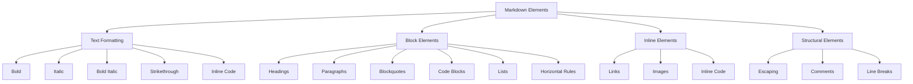
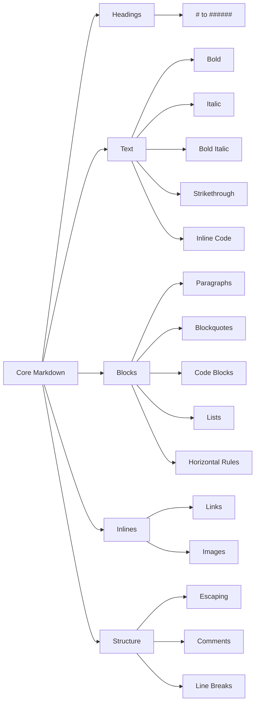

# Module 2: Core Markdown

> **Duration:** 4–6 hours  
> **Prerequisites:** Module 1 — Introduction to Markdown  
> **Learning Objectives:** Master all core Markdown syntax elements, understand best practices, and avoid common mistakes.

---



---

## 2.1 Headings

Markdown supports six levels of headings, created with the `#` character followed by a space.

### Syntax

```markdown
# Heading 1
## Heading 2
### Heading 3
#### Heading 4
##### Heading 5
###### Heading 6
```

### Rendered Output

# Heading 1
## Heading 2
### Heading 3
#### Heading 4
##### Heading 5
###### Heading 6

### Best Practices

| Rule | Explanation | Example |
|------|-------------|---------|
| One H1 per document | The H1 is the document title; multiple H1s confuse hierarchy | `# Document Title` |
| Don't skip levels | Going from H2 to H4 breaks the outline structure | Always go H1 → H2 → H3 |
| Use space after `#` | `#Heading` won't render as a heading | `# Heading` ✓ |
| Keep headings concise | Long headings are hard to scan | Prefer 3–7 words |
| Use sentence case | Lowercase after the first word (unless proper nouns) | `## Setting up the environment` |

### Common Mistakes

```markdown
#No space after hash     ← Incorrect
# Heading 1
## Heading 2
#### Heading 4            ← Skipped H3 (bad hierarchy)
# Another H1              ← Second H1 (breaks document structure)
```

### Exercise 2.1: Headings

Create a document outline for a technical tutorial using proper heading hierarchy. Include one H1, three H2s, and two H3s under one of the H2s.

```markdown
<!-- Solution -->
# Building a REST API with Express

## Prerequisites

## Setting Up the Project

### Installing Dependencies
### Configuring the Server

## Creating Routes

## Testing the API
```

---

## 2.2 Paragraphs

A paragraph is one or more consecutive lines of text separated by a blank line from other blocks.

### How Paragraphs Work

- **Single line:** One line of text followed by a blank line forms a paragraph.
- **Multi-line:** Consecutive lines of text are joined into a single paragraph. Markdown wraps them together.
- **Blank lines:** You must leave a blank line between paragraphs to separate them.

### Example

```markdown
This is the first paragraph. It can span multiple lines
but will be treated as a single paragraph when rendered.

This is the second paragraph. Note the blank line above.
```

### Rendered Output

This is the first paragraph. It can span multiple lines
but will be treated as a single paragraph when rendered.

This is the second paragraph. Note the blank line above.

### Without a Blank Line

```markdown
This is the first paragraph.
This line will be joined to the first paragraph because there's no blank line.
```

### Best Practices

| Practice | Why |
|----------|-----|
| Always use blank lines between paragraphs | Ensures proper separation and rendering |
| Keep paragraphs to 3–5 sentences | Longer paragraphs are harder to scan in documentation |
| Use a consistent line length (80–100 chars) | Makes editing in terminal-based editors easier |
| Avoid indenting paragraphs with spaces | Indentation can cause unexpected code block rendering |

---

## 2.3 Line Breaks

Unlike paragraphs (which require a blank line), a **line break** moves text to the next line within the same paragraph.

### Syntax

| Method | Syntax | Notes |
|--------|--------|-------|
| Trailing spaces | Two spaces at end of line | Works in all Markdown flavors |
| Backslash | `\` at end of line | Works in GFM and many other flavors |
| HTML `<br>` | `<br>` tag | Works everywhere |

### Example

```markdown
First line with two trailing spaces··
Second line after the break

First line with backslash\
Second line after the break

First line with HTML<br>
Second line after the break
```

### Rendered Output

First line with two trailing spaces··
Second line after the break

First line with backslash
Second line after the break

First line with HTML<br>
Second line after the break

### Recommendation

Use the **backslash** method (`\`) for new lines in documentation. Trailing spaces are invisible and easy to accidentally delete. Backslash is explicit and readable.

---

## 2.4 Bold

Bold text is used for strong emphasis, warnings, key terms, and important concepts.

### Syntax

| Syntax | Example | Output |
|--------|---------|--------|
| `**bold**` | `**Important**` | **Important** |
| `__bold__` | `__Warning__` | __Warning__ |

### Which to Use

| Approach | Recommendation |
|----------|----------------|
| `**bold**` | **Preferred** — easier to see, less likely to be confused with emphasis |
| `__bold__` | Avoid — can be confused with `_italic_` in mid-word |

### When to Use Bold

- **Key terms** when first introduced
- **Warnings** and important notices
- **UI labels** and button names (e.g., Click **Save**)
- **Emphasis** stronger than italic

### Examples

```markdown
**Critical:** Do not skip this step.

The **Save** button is located in the top-right corner.

This is __also bold__ but the `**` syntax is preferred.
```

---

## 2.5 Italic

Italic text is used for lighter emphasis, such as book titles, foreign words, or mild emphasis.

### Syntax

| Syntax | Example | Output |
|--------|---------|--------|
| `*italic*` | `*emphasis*` | *emphasis* |
| `_italic_` | `_emphasis_` | _emphasis_ |

### Conventions

| Convention | Recommendation |
|------------|----------------|
| `*italic*` | Preferred — more visible and consistent with bold syntax |
| `_italic_` | Avoid — can be hard to see and conflicts with word boundaries |

### When to Use Italic

- **Book titles**, movie titles, and publication names
- **Foreign words** (e.g., *et cetera*, *ad hoc*)
- **Mild emphasis** where bold would be too strong
- **Variables** or placeholders in text

### Examples

```markdown
Read *The Pragmatic Programmer* for insights.

The term *ad hoc* means "for this purpose."

Replace *username* with your actual username.
```

---

## 2.6 Bold Italic

Bold italic combines strong emphasis with italic styling, used for very strong emphasis or headings within text.

### Syntax

| Syntax | Example | Output |
|--------|---------|--------|
| `***bold italic***` | `***extremely important***` | ***extremely important*** |
| `___bold italic___` | `___critical___` | ___critical___ |
| `** *combination* **` | `**Don't *skip* this**` | **Don't *skip* this** |

### Combinations Table

| Syntax Combination | Result |
|--------------------|--------|
| `***text***` | ***Bold italic*** |
| `**text *and* text**` | **Bold with *italic* inside** |
| `*text **and** text*` | *Italic with **bold** inside* |

### Examples

```markdown
***Do not run this command in production.***

This is ***very*** important.

**The file *must* be saved before closing.**
```

---

## 2.7 Strikethrough

Strikethrough indicates deleted, deprecated, or no-longer-relevant content. It is part of the **GFM (GitHub Flavored Markdown)** specification.

### Syntax

```markdown
~~This text has been struck through~~
```

### Output

~~This text has been struck through~~

### Use Cases

- **Deprecated features**: Show old functionality that has been removed
- **Task completion**: Showing items that are done or discarded
- **Revisions**: Showing changes in document versioning
- **Humorous editing**: `I ~~totally~~ knew that.`

### Examples

```markdown
This feature ~~is planned~~ has been released.

~~The old API endpoint `/v1/users` is no longer supported.~~

We ~~think~~ know this is the right approach.
```

---

## 2.8 Inline Code

Inline code is used for code snippets, commands, filenames, and technical terms within sentences.

### Syntax

| Syntax | Usage |
|--------|-------|
| `` `code` `` | Single backticks for inline code |
| `` `code with \` backtick` `` | Double backticks when code contains backticks |

### When to Use Inline Code

- **Commands**: `git commit -m "message"`
- **Variable names**: The `username` variable
- **Filenames**: Save changes to `config.json`
- **Short code snippets**: Use `array.map()` to transform data
- **Technical terms**: The `sudo` command

### Escaping Backticks in Code

```markdown
To include a backtick in inline code, use double backticks:
`` `code` `` renders as `code`

To show a backtick at the edge:
`` `backtick` `` → `backtick`
```

### Best Practices

| Practice | Example |
|----------|---------|
| Use inline code for technical terms | `Run `npm install` to install dependencies` |
| Don't use bold/italic for code | Wrong: *console.log()* — Use: `console.log()` |
| Avoid long inline code | Over 60 characters should be a code block |

---

## 2.9 Code Blocks

Code blocks are used for multi-line code snippets, configuration files, and terminal output.

### Fenced Code Blocks

```markdown
```
Code block with triple backticks
```
```

```markdown
~~~
Tilde-based code block
~~~
```

### Language Specifiers

```markdown
```python
def hello():
    print("Hello, World!")
```
```

### Rendered Code Block

```python
def hello():
    print("Hello, World!")
```

### Indented Code Blocks

Indent every line by 4 spaces or 1 tab:

```markdown
    This is an indented code block.
    It has no language highlighting.
```

### Supported Languages (Partial List)

| Language | Identifier |
|----------|------------|
| Python | `python` |
| JavaScript | `javascript` or `js` |
| TypeScript | `typescript` or `ts` |
| HTML | `html` |
| CSS | `css` |
| Bash | `bash` or `sh` |
| SQL | `sql` |
| JSON | `json` |
| YAML | `yaml` or `yml` |
| PHP | `php` |
| Go | `go` |
| Rust | `rust` |
| Java | `java` |
| C | `c` |
| C++ | `cpp` |
| Diff | `diff` |

### Best Practices

| Practice | Reason |
|----------|--------|
| Always specify a language | Enables syntax highlighting |
| Use fenced blocks over indented | Language support and easier editing |
| Keep lines under 100 characters | Prevents horizontal scrolling |
| Use blank lines around code blocks | Ensures proper rendering |

---

## 2.10 Lists — Unordered

Unordered lists are used for items without a specific sequence.

### Syntax

```markdown
- Item one
- Item two
- Item three
```

### List Markers

| Marker | Example | Recommendation |
|--------|---------|----------------|
| `-` | `- Item` | **Preferred** — easiest to type and most compatible |
| `*` | `* Item` | Acceptable but can be confused with italic |
| `+` | `+ Item` | Rarely used, avoid for consistency |

### Nesting

Indent with 2 or 4 spaces:

```markdown
- Level 1
  - Level 2
    - Level 3
```

### Rendered

- Level 1
  - Level 2
    - Level 3

### Best Practices

```markdown
<!-- Preferred -->
- Item one
- Item two
  - Sub-item A
  - Sub-item B
- Item three

<!-- Avoid mixing markers -->
- Item one
* Item two    ← Inconsistent
+ Item three  ← Inconsistent
```

---

## 2.11 Lists — Ordered

Ordered lists are used for step-by-step instructions, ranked items, or sequential content.

### Syntax

```markdown
1. First item
2. Second item
3. Third item
```

### Automatic Numbering

In GFM, you can use all `1.` and Markdown will number correctly:

```markdown
1. First step
1. Second step
1. Third step
```

### Rendered

1. First step
1. Second step
1. Third step

### Starting at a Specific Number

```markdown
4. Start from four
5. Five
6. Six
```

### Rendered

4. Start from four
5. Five
6. Six

### Best Practices

| Practice | Why |
|----------|-----|
| Use `1.` for all items | Easier reordering without renumbering |
| Align numbers consistently | Left-align for readability |
| Don't nest ordered lists haphazardly | Use consistent indentation |

---

## 2.12 Nested Lists

Nested lists combine ordered and unordered lists at multiple levels.

### Mixed Ordered/Unordered

```markdown
1. Step one
   - Detail about step one
   - Another detail
2. Step two
   - Sub-step A
   - Sub-step B
     1. Ordered sub-step
     2. Another ordered sub-step
3. Step three
```

### Rendered

1. Step one
   - Detail about step one
   - Another detail
2. Step two
   - Sub-step A
   - Sub-step B
     1. Ordered sub-step
     2. Another ordered sub-step
3. Step three

### Indentation Rules

| System | Spaces | Notes |
|--------|--------|-------|
| GFM | 2 spaces | Minimum for nesting |
| CommonMark | 2–4 spaces | Both work |
| Traditional | 4 spaces | More visible |

### Common Nested List Mistakes

```markdown
1. Main item
 - Sub-item with one space  ← Incorrect, needs 2+ spaces
   -Sub-item no space       ← Incorrect, need space after -
```

---

## 2.13 Blockquotes

Blockquotes are used for quotations, callouts, warnings, and highlighted content.

### Basic Syntax

```markdown
> This is a blockquote.
> It can span multiple lines.
```

### Rendered

> This is a blockquote.
> It can span multiple lines.

### Lazy Syntax

```markdown
> This is still a blockquote.
The `>` is only needed at the start of the paragraph.
```

### Nested Blockquotes

```markdown
> Level 1
>> Level 2
>>> Level 3
```

### Rendered

> Level 1
>> Level 2
>>> Level 3

### Blockquotes with Other Elements

```markdown
> ## Heading Inside Quote
>
> - List item in quote
> - Another item
>
> ```python
> print("Code in quote")
> ```
>
> > Nested quote
```

### Rendered

> ## Heading Inside Quote
>
> - List item in quote
> - Another item
>
> ```python
> print("Code in quote")
> ```
>
> > Nested quote

### Callout Boxes Pattern

```markdown
> **Note:** This is a note callout.

> **Warning:** This is a warning.
>
> Be careful with this step.

> **Tip:** This is helpful advice.
```

### Use Cases

| Use Case | Example |
|----------|---------|
| Quotations | Citing sources, references |
| Warnings | Security notes, danger zones |
| Tips | Best practices, optimization notes |
| Side notes | Additional context without interrupting flow |
| Definitions | Term definitions inline |

---

## 2.14 Horizontal Rules

Horizontal rules create a thematic break or section divider.

### Syntax

```markdown
---
***
___
```

All three produce the same output:

---

### When to Use

- **Section breaks** between major topics
- **Thematic shifts** when changing subjects
- **Document footers** separating content from metadata
- **In letters** after the body before the signature

### Best Practices

```markdown
<!-- Preferred: three dashes with blank lines around -->
Content above the rule.

---

Content below the rule.

<!-- Avoid: no blank lines -->
Content
---
Content
```

| Practice | Reason |
|----------|--------|
| Use `---` | Most consistent rendering across platforms |
| Add blank lines before and after | Prevents merging with headings |
| Use sparingly | Too many rules fragment the document |

---

## 2.15 Escaping Characters

Use backslash escapes to render literal Markdown characters that would otherwise trigger formatting.

### Escapable Characters

| Character | Escape | Purpose |
|-----------|--------|---------|
| `\` | `\\` | Backslash |
| `` ` `` | `` \` `` | Backtick |
| `*` | `\*` | Asterisk |
| `_` | `\_` | Underscore |
| `{ }` | `\{ \}` | Curly braces |
| `[ ]` | `\[ \]` | Square brackets |
| `( )` | `\( \)` | Parentheses |
| `#` | `\#` | Hash |
| `+` | `\+` | Plus |
| `-` | `\-` | Minus |
| `.` | `\.` | Period |
| `!` | `\!` | Exclamation |
| `|` | `\|` | Pipe |
| `~` | `\~` | Tilde |
| `>` | `\>` | Greater than |
| `<` | `<` | Less than |

### Examples

```markdown
\*This is not italic\*

\# This is not a heading

\[This is not a link\]

2 \+ 2 = 4 (literal plus sign)
```

### Rendered

\*This is not italic\*

\# This is not a heading

\[This is not a link\]

2 \+ 2 = 4 (literal plus sign)

### When to Escape

| Scenario | Escape Needed? |
|----------|----------------|
| Asterisks around a word for bold | No — you want bold |
| Asterisks around a math expression | Yes — `\* 2 + 3 \*` |
| Hash at start of line | Yes — `\# Not a heading` |
| Hash in middle of line | No — only at line start |
| Underscore in filename | Yes — `file\_name.md` |

---

## 2.16 Comments

Comments allow you to include notes, metadata, and hidden content in Markdown files.

### HTML Comments

```markdown
<!-- This is a comment. It will not be rendered. -->

<!--
Multi-line comment.
Multiple lines are supported.
-->
```

### Hidden Markdown

```markdown
<!--
## This heading won't appear in output

This paragraph is hidden.
-->
```

### Use Cases

| Use Case | Example |
|----------|---------|
| **Author notes** | `<!-- TODO: Update this section -->` |
| **Metadata** | `<!-- Created: 2026-01-15 -->` |
| **Disabled content** | Hiding outdated sections |
| **Instructions** | `<!-- Add your API key here -->` |
| **Section markers** | `<!-- end of configuration section -->` |

### Best Practices

```markdown
<!-- Use comments sparingly — they increase file size -->

<!--
For multi-line comments, use this format.
It's cleaner than many single-line comments.
-->

<!-- Avoid putting sensitive info in comments if rendering to HTML -->
```

---

## 2.17 Links

Links are fundamental for connecting documentation, referencing sources, and navigating content.

### Inline Links

```markdown
[Link text](https://example.com)

[Link with title](https://example.com "Optional Title")

[Link to file](../other-doc.md)
```

### Reference-Style Links

```markdown
[link text][reference-label]

[reference-label]: https://example.com
[reference-label]: https://example.com "Optional title"
```

### Rendered

[Link text](https://example.com)

### Automatic Links

```markdown
<https://example.com>
<user@example.com>
```

### Relative Links

```markdown
[Same directory](./other-file.md)
[Parent directory](../README.md)
[Anchor link](#headings)
[File with anchor](./file.md#section-name)
```

### Link Best Practices

| Practice | Why |
|----------|-----|
| Use descriptive link text | Improves accessibility and scannability |
| Avoid "click here" | Bad for SEO and screen readers |
| Add titles for external links | Gives context on hover |
| Use reference links for repeated URLs | Easier maintenance |
| Use relative links for internal docs | Works across forks and domains |

### Examples

```markdown
<!-- Good -->
[Python documentation](https://docs.python.org "Official Python docs")

<!-- Bad -->
Click [here](https://docs.python.org) for Python docs.

<!-- Reference-style for repeated links -->
[Python docs] provide excellent tutorials.

[Python docs]: https://docs.python.org
```

---

## 2.18 Images

Images enhance documentation with screenshots, diagrams, and visual aids.

### Basic Syntax

```markdown


```

### With Relative Paths

```markdown


```

### Image Sizing with HTML

```markdown


```

### Image Alignment

```markdown
<!-- Center alignment -->
<p align="center">
  
</p>

<!-- Right alignment -->
<p align="right">
  
</p>
```

### Best Practices

| Practice | Reason |
|----------|--------|
| Always include alt text | Accessibility for screen readers |
| Use descriptive filenames | Easier maintenance and SEO |
| Optimize image size | Faster page loading |
| Use relative paths | Works across environments |
| Consider SVG for diagrams | Scales without quality loss |
| Add title text | Provides hover context |

### Examples

```markdown
<!-- Good -->


```

---

## 2.19 Best Practices

A comprehensive guide to writing clean, maintainable, and consistent Markdown.

### Document Structure

| Practice | Description |
|----------|-------------|
| One H1 per document | The title of your document |
| Logical heading order | Don't skip heading levels |
| Blank lines between blocks | Always separate block elements with blank lines |
| Consistent heading spacing | One space after `#` |

### Lists

| Practice | Description |
|----------|-------------|
| Use `-` for unordered lists | Most consistent across platforms |
| Use `1.` for all ordered list items | Easy reordering |
| Indent nested lists with 2 spaces | GFM standard |
| Blank line before lists | Separates list from preceding paragraph |

### Code

| Practice | Description |
|----------|-------------|
| Always specify language in fenced blocks | Enables syntax highlighting |
| Use fenced blocks over indented blocks | Better language support |
| Keep code lines under 100 characters | Prevents horizontal scroll |
| Blank lines around code blocks | Proper rendering |

### Text Formatting

| Practice | Description |
|----------|-------------|
| Use `**bold**` not `__bold__` | More visible |
| Use `*italic*` not `_italic_` | Consistent with bold |
| Use backslash for line breaks | Explicit and visible |
| Escape Markdown characters when literal | Use backslash escapes |

### Links and Images

| Practice | Description |
|----------|-------------|
| Descriptive link text | Never "click here" |
| Reference links for repeated URLs | Easier to maintain |
| Always include image alt text | Accessibility |
| Use relative paths for internal docs | Portability |

### General Writing

| Practice | Description |
|----------|-------------|
| Keep lines under 80 characters | Readability in editors |
| Use blank lines generously | Visual separation of blocks |
| Be consistent with syntax | Pick one style and stick to it |
| Preview before publishing | Catch rendering issues |

---

## 2.20 Common Mistakes

### Mistake 1: Incorrect Heading Syntax

```markdown
#No space after hash
##No space after hashes
###Not a heading
```

**Fix:** Always add a space after `#`.

### Mistake 2: Broken List Nesting

```markdown
- Item one
 - Sub-item with one space
```

**Fix:** Use 2 space indentation:

```markdown
- Item one
  - Sub-item
```

### Mistake 3: Missing Blank Lines

```markdown
Paragraph one
Paragraph two not separated
```

**Fix:** Add blank lines between block elements.

### Mistake 4: Wrong Link Syntax

```markdown
(link text)[url]
[link text](url
[link text]url
```

**Fix:** Use `[text](url)` format.

### Mistake 5: Mixed List Markers

```markdown
- Item one
* Item two
+ Item three
```

**Fix:** Use consistent markers — prefer `-`.

### Mistake 6: Code Blocks Without Language

````markdown
```
print("No syntax highlighting")
```
````

**Fix:** Add language identifier.

### Mistake 7: Unescaped Characters

```markdown
This is *not* italic (but it renders as italic)
```

**Fix:** Escape with backslash: `\*`.

### Mistake 8: Improper Blockquote Nesting

```markdown
>>>Too deep without spaces
```

**Fix:** Add space after `>`: `> > > ` or use `>>>`.

### Common Mistakes Reference Table

| Mistake | Example | Solution |
|---------|---------|----------|
| No space after `#` | `#Heading` | `# Heading` |
| Wrong link syntax | `(text)[url]` | `[text](url)` |
| Missing blank lines | Directly adjacent blocks | Add blank lines |
| Mixed list markers | `-` and `*` together | Use only `-` |
| Incorrect nesting | One-space indentation | Use 2-space indent |
| No language on code blocks | ` ``` ` alone | ` ```python` |
| Unescaped special chars | 2*3=6 renders as italic | `2\*3=6` |

---

## 2.21 Exercises

### Exercise 1: Headings
Create a document outline with proper heading hierarchy for a "Getting Started" guide. Include one H1, four H2s, and two H3s under one H2.

### Exercise 2: Text Formatting
Write a paragraph that uses bold for key terms, italic for a book title, and a line break to separate two lines of an address.

### Exercise 3: Lists
Create a nested list: an ordered list of cooking steps, with unordered sub-lists of ingredients for each step.

### Exercise 4: Blockquotes
Create a warning callout using blockquote syntax. Include bold formatting for "Warning:" and a code block inside the quote.

### Exercise 5: Code Blocks
Write a fenced code block for a Python function that calculates factorial. Include the `python` language specifier.

### Exercise 6: Links
Create three reference-style links to documentation sites (Python, MDN, and Node.js). Use the reference links in a paragraph.

### Exercise 7: Images
Write the Markdown to embed an image with alt text "Network topology diagram showing three tiers" and a relative path.

### Exercise 8: Escaping
Write a line that displays literal asterisks around a word without making it bold. Use backslash escaping.

### Exercise 9: Horizontal Rules
Create a document footer with a horizontal rule, followed by a copyright line. Include proper blank lines.

### Exercise 10: Comprehensive
Write a short document section that includes:
- An H2 heading
- A paragraph with bold and italic
- An unordered list with one nested level
- A blockquote with a code block inside
- A horizontal rule
- A reference-style link

---

## 2.22 Summary



### Key Takeaways Table

| Element | Syntax | Notes |
|---------|--------|-------|
| H1–H6 | `#` to `######` | Space after `#` required |
| Bold | `**text**` | Prefer over `__text__` |
| Italic | `*text*` | Prefer over `_text_` |
| Strikethrough | `~~text~~` | GFM feature |
| Inline code | `` `code` `` | Double backticks for literal backticks |
| Code block | ` ``` ` or `~~~` | Add language for highlighting |
| Unordered list | `- item` | 2-space indent for nesting |
| Ordered list | `1. item` | All `1.` works in GFM |
| Blockquote | `> text` | Nest with `>>` |
| Horizontal rule | `---` | Blank lines around it |
| Link | `[text](url)` | Reference-style: `[text][ref]` |
| Image | `` | HTML for sizing |
| Line break | `\` or 2 spaces | Backslash preferred |
| Escape | `\*` | Backslash before special char |
| Comment | `<!-- -->` | Not rendered |

---

## 2.23 Quiz

**Question 1:** What character creates a heading in Markdown?
- A) `@`
- B) `#`
- C) `&`
- D) `!`

**Answer:** B

---

**Question 2:** How many heading levels does Markdown support?
- A) 4
- B) 5
- C) 6
- D) Unlimited

**Answer:** C

---

**Question 3:** Which syntax correctly creates bold text?
- A) `*bold*`
- B) `**bold**`
- C) `~~bold~~`
- D) `__bold__` (acceptable but not preferred)

**Answer:** B

---

**Question 4:** How do you create a line break within a paragraph?
- A) Blank line
- B) Two trailing spaces
- C) Comma at end
- D) Semicolon at end

**Answer:** B (or backslash `\`)

---

**Question 5:** Which language identifier enables syntax highlighting in a code block?
- A) ` ```print```
- B) ` ```python `
- C) ` ```pygments `
- D) ` ```highlight `

**Answer:** B

---

**Question 6:** What is the correct syntax for an unordered list item?
- A) `* Item`
- B) `- Item`
- C) `+ Item`
- D) All of the above

**Answer:** D (but `-` is preferred)

---

**Question 7:** How do you create a nested list item?
- A) Add a blank line
- B) Indent with 2 spaces
- C) Use a different marker
- D) Add a number prefix

**Answer:** B

---

**Question 8:** What does `~~text~~` produce?
- A) Bold text
- B) Italic text
- C) Strikethrough text
- D) Code text

**Answer:** C

---

**Question 9:** How do you create a horizontal rule?
- A) `---`
- B) `===`
- C) `###`
- D) `...`

**Answer:** A

---

**Question 10:** Which character escapes Markdown formatting?
- A) `/`
- B) `\`
- C) `~`
- D) `^`

**Answer:** B

---

**Question 11:** What is the correct syntax for an inline link?
- A) `(text)[url]`
- B) `[text](url)`
- C) `{text}(url)`
- D) `<text>(url)`

**Answer:** B

---

**Question 12:** How do you write an inline code snippet?
- A) `'code'`
- B) `` `code` ``
- C) `"code"`
- D) `~code~`

**Answer:** B

---

**Question 13:** What is the correct syntax for a blockquote?
- A) `- quote`
- B) `> quote`
- C) `# quote`
- D) `* quote`

**Answer:** B

---

**Question 14:** How do you create a comment in Markdown?
- A) `// comment`
- B) `# comment`
- C) `<!-- comment -->`
- D) `/* comment */`

**Answer:** C

---

**Question 15:** What is the preferred bold syntax for documentation?
- A) `**bold**`
- B) `__bold__`
- C) `*bold*`
- D) `~~bold~~`

**Answer:** A

---

## 2.24 Interview Questions

**Q1: What is Markdown and why is it used for documentation?**
A: Markdown is a lightweight markup language with plain-text formatting syntax. It's used for documentation because it's readable in raw form, converts to HTML easily, is platform-independent, and has wide tool support.

**Q2: Explain the difference between `**bold**` and `__bold__`.**
A: Both create bold text. `**bold**` is preferred because asterisks are more visible in raw Markdown, and underscores can be confused with italic in mid-word contexts.

**Q3: How do you handle line breaks in Markdown?**
A: Line breaks can be created with two trailing spaces, a backslash at the end of a line, or an HTML `<br>` tag. The backslash method is most explicit.

**Q4: What are fenced code blocks and why are they better than indented code blocks?**
A: Fenced code blocks use triple backticks or tildes. They're better because they support language specifiers for syntax highlighting and are easier to manage with copy-paste.

**Q5: How do reference-style links work and when should you use them?**
A: Reference links use `[text][label]` inline with `[label]: url` definitions elsewhere. Use them when the same URL is referenced multiple times or when you want cleaner inline text.

**Q6: What is the correct way to nest elements in Markdown?**
A: Nesting depends on the element: lists use 2-space indentation, blockquotes use `>`, and code blocks inside blockquotes need the `>` prefix on each line.

**Q7: How do you escape Markdown characters?**
A: Use a backslash `\` before the character. For example, `\*` renders as a literal asterisk instead of starting italic/bold formatting.

**Q8: What are callout boxes and how do you create them?**
A: Callout boxes use blockquote syntax with bold labels like `> **Note:**` and `> **Warning:**`. Different labels create different visual styles depending on the renderer.

**Q9: Explain heading hierarchy best practices in documentation.**
A: Use one H1 per document (the title), don't skip levels (H1→H3 without H2), use consistent spacing after `#`, and keep headings concise for scannability.

**Q10: What are common Markdown mistakes beginners make?**
A: Common mistakes include: no space after `#` in headings, missing blank lines between blocks, incorrect list indentation, mixing list markers, not specifying code block languages, and wrong link syntax.

---

> **Next Module:** Module 3 — Advanced Markdown
> Topics: Tables, task lists, footnotes, definition lists, reference links, cross-references, front matter, and documentation architecture.
