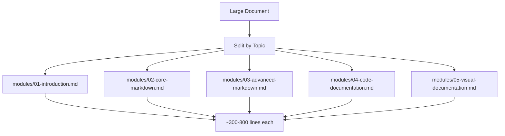
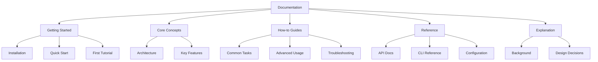
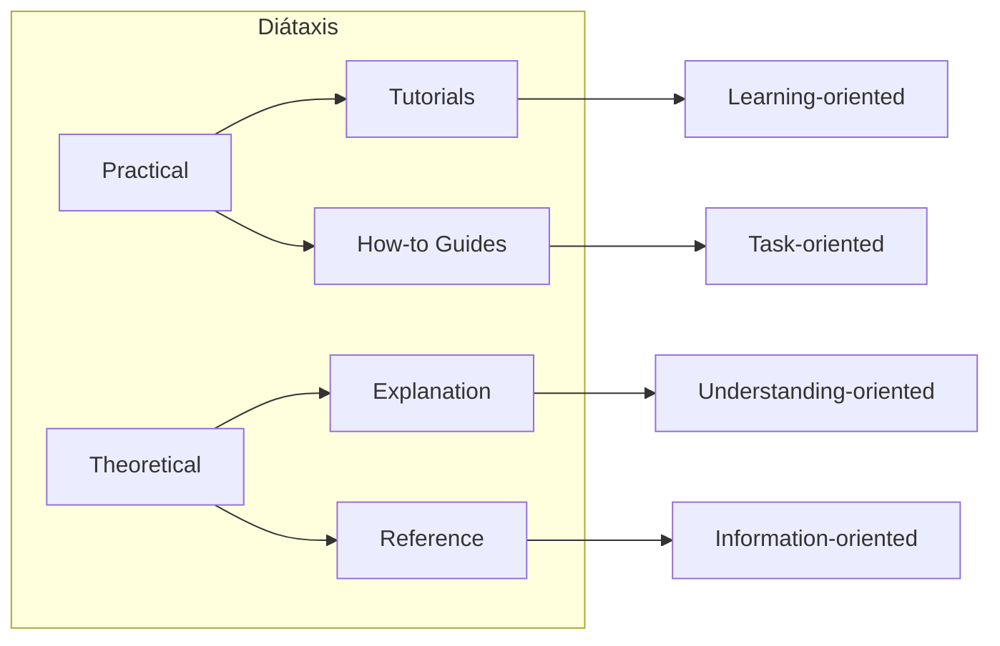
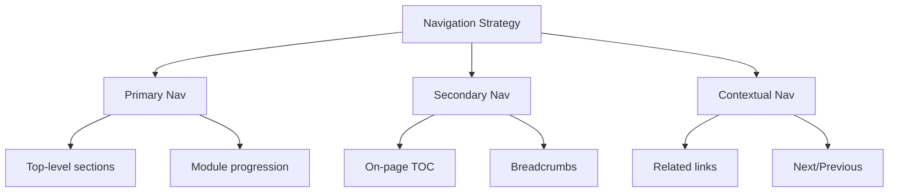

```mermaid
graph TD
    A[Advanced Markdown] --> B[Tables]
    A --> C[Task Lists]
    A --> D[Footnotes]
    A --> E[Definition Lists]
    A --> F[Reference Links]
    A --> G[Automatic Links]
    A --> H[Nested Structures]
    A --> I[Advanced Formatting]
    A --> J[Cross References]
    A --> K[Front Matter]
    A --> L[Table of Contents]
    A --> M[Document Organization]
    A --> N[Documentation Architecture]
    B --> B1[Pipe Syntax]
    B --> B2[Alignment]
    C --> C1[Checkboxes]
    D --> D1[Footnote References]
    E --> E1[Term: Definition]
    K --> K1[YAML]
    K --> K2[TOML]
    K --> K3[JSON]
    L --> L1[Manual]
    L --> L2[Auto-generated]
    M --> M1[Chunking]
    M --> M2[Includes]
    N --> N1[Information Hierarchy]
    N --> N2[Navigation]
```

# Module 3: Advanced Markdown

> **Duration:** 5–8 hours  
> **Prerequisites:** Module 2 — Core Markdown  
> **Learning Objectives:** Master advanced Markdown features, document architecture, cross-references, front matter, and large-document organization strategies.

---



---

## 3.1 Tables

Tables organize data into rows and columns. They are part of GFM and supported by most Markdown renderers.

### Basic Table Syntax

```markdown
| Header 1 | Header 2 | Header 3 |
|----------|----------|----------|
| Cell 1   | Cell 2   | Cell 3   |
| Cell 4   | Cell 5   | Cell 6   |
```

### Rendered Output

| Header 1 | Header 2 | Header 3 |
|----------|----------|----------|
| Cell 1   | Cell 2   | Cell 3   |
| Cell 4   | Cell 5   | Cell 6   |

### Column Alignment

| Syntax | Alignment | Example |
|--------|-----------|---------|
| `:---` | Left-aligned | `| :--- |` |
| `:---:` | Center-aligned | `| :---: |` |
| `---:` | Right-aligned | `| ---: |` |

```markdown
| Left | Center | Right |
|:-----|:------:|------:|
| L1   | C1     |    R1 |
| L2   | C2     |    R2 |
```

### Rendered Aligned Table

| Left | Center | Right |
|:-----|:------:|------:|
| L1   | C1     |    R1 |
| L2   | C2     |    R2 |

### Formatting Inside Tables

```markdown
| Feature | Status | Notes |
|---------|--------|-------|
| **Bold** | ✅ Done | Use `**` syntax |
| *Italic* | ✅ Done | Use `*` syntax |
| `Code` | ✅ Done | Use backticks |
| ~~Old~~ | ❌ Removed | Strikethrough works |
| [Link](url) | ✅ Works | Inline links OK |
```

### Rendered Formatted Table

| Feature | Status | Notes |
|---------|--------|-------|
| **Bold** | ✅ Done | Use `**` syntax |
| *Italic* | ✅ Done | Use `*` syntax |
| `Code` | ✅ Done | Use backticks |
| ~~Old~~ | ❌ Removed | Strikethrough works |
| [Link](url) | ✅ Works | Inline links OK |

### Column Spanning Notes

Markdown tables do **not** natively support column spanning (colspan) or row spanning (rowspan). To achieve these effects, use raw HTML:

```markdown
<table>
  <tr>
    <td colspan="2">This spans two columns</td>
  </tr>
  <tr>
    <td>Left</td>
    <td>Right</td>
  </tr>
</table>
```

### Best Practices

| Practice | Reason |
|----------|--------|
| Align pipe characters | Improves raw readability |
| Use 3+ dashes in separator | Minimum for valid table |
| Keep tables under 7 columns | Prevents horizontal scrolling |
| Use alignment markers | Clarifies numeric vs text columns |
| Escape pipes in cell content | Use `\|` for literal pipe |

### Common Table Mistakes

```markdown
| Header | Header    ← Missing closing pipe
| ------ | ------
| Cell   | Cell

| Header | Header |
| --- | --- |    ← Too few dashes (needs 3)
| Cell | Cell |
```

---

## 3.2 Task Lists

Task lists (or checklists) are a GFM extension for tracking completion status.

### Syntax

```markdown
- [ ] Unfinished task
- [x] Completed task
- [ ] Another pending task
```

### Rendered

- [ ] Unfinished task
- [x] Completed task
- [ ] Another pending task

### Nested Task Lists

```markdown
- [ ] Project Setup
  - [x] Initialize repository
  - [ ] Add dependencies
  - [ ] Configure build
- [ ] Development
  - [ ] Implement login
  - [x] Create dashboard
```

### Rendered Nested

- [ ] Project Setup
  - [x] Initialize repository
  - [ ] Add dependencies
  - [ ] Configure build
- [ ] Development
  - [ ] Implement login
  - [x] Create dashboard

### Use Cases

| Use Case | Example |
|----------|---------|
| **README features** | Todo list for planned features |
| **PR descriptions** | Checklist before merging |
| **Meeting notes** | Action items with owners |
| **Project tracking** | Simple kanban-style tracking |
| **Documentation plans** | Sections to write or update |

### Best Practices

```markdown
<!-- Good: Clear, consistent spacing -->
- [x] Completed task
- [ ] Pending task

<!-- Avoid: Inconsistent spacing -->
-[ ]No space
- [x]No space after x
- [X]Capital X (works but inconsistent)
```

---

## 3.3 Footnotes

Footnotes provide additional context, citations, or commentary without cluttering the main text.

### Syntax

```markdown
Here is a statement with a footnote.[^1]

[^1]: The footnote content goes here, usually at the bottom of the document.
```

### Rendered

Here is a statement with a footnote.[^1]

[^1]: The footnote content goes here, usually at the bottom of the document.

### Multiple Footnotes

```markdown
Multiple sources support this claim.[^source1][^source2]

[^source1]: Author, A. (2025). *Title*. Publisher.
[^source2]: Author, B. (2026). *Another Title*. Publisher.
```

### Inline Footnotes (Pandoc)

```markdown
This has an inline footnote.[^This is the footnote text]
```

### Footnote Placement

| Strategy | Pros | Cons |
|----------|------|------|
| **Bottom of document** | Easy to find, standard | Can be far from reference |
| **Bottom of section** | Closer to reference | Repeated definitions |
| **Separate page** | Clean document body | Navigation overhead |

### Best Practices

```markdown
<!-- Good -->
This is well-documented.[^cite2025]

[^cite2025]: Smith, J. (2025). *Complete Guide*. Tech Press.

<!-- Avoid very long footnotes -->
<!-- They should be 1-3 lines, not paragraphs -->
```

---

## 3.4 Definition Lists

Definition lists associate terms with their definitions, similar to dictionaries.

### Syntax (Pandoc / PHP Markdown Extra)

```markdown
Term One
: Definition for term one

Term Two
: Definition for term two
: Another definition for the same term
```

### Rendered

Term One
: Definition for term one

Term Two
: Definition for term two
: Another definition for the same term

### Multiple Definitions

```markdown
API
: Application Programming Interface
: A set of defined rules for communication between systems

REST
: Representational State Transfer
: An architectural style for distributed systems
```

### Compatibility

| Platform | Definition List Support |
|----------|------------------------|
| GitHub | ❌ Not supported |
| GitLab | ❌ Not supported |
| Pandoc | ✅ Supported |
| Kramdown | ✅ Supported |
| PHP Markdown Extra | ✅ Supported |
| MkDocs Material | ✅ Supported |

### HTML Fallback

```markdown
<dl>
  <dt>Term</dt>
  <dd>Definition</dd>
</dl>
```

---

## 3.5 Reference Links

Reference links separate URL definitions from link text, improving readability and maintainability.

### Syntax

```markdown
[link text][reference-label]

[reference-label]: https://example.com
[reference-label]: https://example.com "Optional Title"
```

### Examples

```markdown
For more information, see the [Python documentation][pydocs] and the [MDN web docs][mdn].

[pydocs]: https://docs.python.org "Python 3 Documentation"
[mdn]: https://developer.mozilla.org "MDN Web Docs"
```

### Benefits

| Benefit | Explanation |
|---------|-------------|
| **Readability** | Inline text has fewer URL strings |
| **Maintainability** | Update one URL definition instead of many instances |
| **Reusability** | Same label can be used multiple times |
| **Organization** | Group all links at bottom of file |

### Implicit Reference Links

```markdown
[Python Documentation][]

[python documentation]: https://docs.python.org
```

The label and reference name are matched case-insensitively.

### Shortcut Reference Links

```markdown
[Python Docs]

[Python Docs]: https://docs.python.org
```

### Best Practices

```markdown
<!-- Good: Grouped at bottom -->
See the [setup guide][setup] and the [API reference][api].

[setup]: ./setup.md
[api]: ./api-reference.md

<!-- Use descriptive labels -->
[aws-s3-buckets]: https://docs.aws.amazon.com/s3/
<!-- Not: [link1], [ref-02] -->
```

---

## 3.6 Automatic Links

Automatic links convert URLs or email addresses into clickable links without explicit Markdown link syntax.

### URL Links

```markdown
<https://example.com>
<https://example.com/page?q=search>
```

### Email Links

```markdown
<user@example.com>
<first.last@company.co.uk>
```

### Rendered

<https://example.com>

<user@example.com>

### When to Use

| Scenario | Use Automatic Link? |
|----------|-------------------|
| Displaying the URL | ✅ Yes — `https://example.com` becomes clickable |
| Hiding the URL | ❌ No — Use `[text](url)` |
| Technical docs | ✅ Yes — For displaying actual URLs |
| Email contacts | ✅ Yes — Simple email display |

### Best Practices

```markdown
<!-- Good: URL is the content -->
Visit us at <https://example.com>

<!-- Better for prose: descriptive link -->
Visit [our website](https://example.com)
```

---

## 3.7 Nested Structures

Combining multiple Markdown elements creates complex, well-organized documents.

### Blockquotes with Lists

```markdown
> ## Key Points
>
> - First important point
> - Second important point
>   - Sub-point with detail
> - Third point
>
> ```python
> print("Code inside blockquote")
> ```
```

### Lists with Code Blocks

```markdown
1. Install dependencies:
   ```bash
   npm install
   ```
2. Configure the application:
   ```bash
   cp .env.example .env
   ```
3. Start the server:
   ```bash
   npm start
   ```
```

### Tables in Lists

```markdown
- **Configuration Options:**
  
  | Option | Type | Default | Description |
  |--------|------|---------|-------------|
  | `port` | number | 3000 | Server port |
  | `host` | string | localhost | Bind address |

- **Environment Variables:**
  
  | Variable | Required | Default |
  |----------|----------|---------|
  | `DB_URL` | Yes | — |
  | `API_KEY` | Yes | — |
```

### Blockquotes with Everything

```markdown
> ## Architecture Overview
>
> The system consists of three tiers:
>
> 1. **Presentation Layer**
>    - React frontend
>    - WebSocket connections
> 2. **Application Layer**
>    - Node.js API server
>    - Redis cache
> 3. **Data Layer**
>    - PostgreSQL database
>
> ```mermaid
> graph LR
>     A[Client] --> B[API]
>     B --> C[Database]
> ```
>
> > **Note:** The WebSocket connections require sticky sessions.
```

### Nested Structure Rules

| Rule | Why |
|------|-----|
| Maintain proper indentation | Each nesting level must be consistent |
| Use blank lines around nested blocks | Prevents rendering artifacts |
| Check each renderer's behavior | Not all renderers handle deep nesting well |
| Keep nesting to 2–3 levels | Deeper nesting becomes unreadable |

---

## 3.8 Advanced Formatting

Superscript, subscript, highlight, keyboard keys, and abbreviations extend Markdown's formatting capabilities.

### Superscript

```markdown
<!-- Supported in Pandoc, some other flavors -->
2^10^ = 1024

<!-- HTML fallback (works everywhere) -->
2<sup>10</sup> = 1024
```

### Subscript

```markdown
<!-- Pandoc syntax -->
H~2~O

<!-- HTML fallback (works everywhere) -->
H<sub>2</sub>O
```

### Highlight

```markdown
<!-- Pandoc / some GFM variants -->
==Highlighted text==

<!-- HTML fallback -->
<mark>Highlighted text</mark>
```

### Keyboard Keys

```markdown
<!-- HTML (widely supported) -->
Press <kbd>Ctrl</kbd> + <kbd>C</kbd> to copy.

<kbd>F5</kbd> to refresh.
<kbd>⌘</kbd> + <kbd>Space</kbd> on macOS.
```

### Abbreviations (Pandoc)

```markdown
*[HTML]: HyperText Markup Language
*[CSS]: Cascading Style Sheets
*[API]: Application Programming Interface

HTML and CSS are web technologies. The API enables integration.
```

### Compatibility Table

| Feature | Pandoc | GitHub | GitLab | MkDocs |
|---------|--------|--------|--------|--------|
| Superscript `^` | ✅ | ❌ | ❌ | ❌ |
| Subscript `~` | ✅ | ❌ | ❌ | ❌ |
| Highlight `==` | ✅ | ❌ | ✅ | ✅ |
| Keyboard `<kbd>` | Via HTML | Via HTML | Via HTML | Via HTML |
| Abbreviations | ✅ | ❌ | ❌ | ❌ |

### HTML Fallback Approach

```markdown
When a feature isn't supported, use HTML directly:

H<sub>2</sub>O (subscript)
2<sup>10</sup> (superscript)
<mark>highlighted</mark> (highlight)
<kbd>Ctrl</kbd> + <kbd>C</kbd> (keyboard)
```

---

## 3.9 Cross References

Cross references link between sections, headings, and other documents.

### Heading Anchors

GitHub auto-generates anchors for all headings:

```markdown
[Link to Headings](#21-headings)

[Link to Tables](#31-tables)

[Link to a subsection](#column-alignment)
```

### How GitHub Generates Anchors

| Heading | Generated Anchor |
|---------|-----------------|
| `## My Heading` | `#my-heading` |
| `## My Heading 2!` | `#my-heading-2` |
| `## What's New?` | `#whats-new` |
| `## Numbers 1-10` | `#numbers-1-10` |

### Cross-Document Links

```markdown
[Module 1](./01-introduction.md)
[Previous: Core Markdown](./02-core-markdown.md#21-headings)
[Next Module](./04-code-documentation.md)
```

### Custom Anchors (HTML)

```markdown
<a name="my-custom-anchor"></a>

### Section with Custom Anchor

[Link to custom anchor](#my-custom-anchor)
```

### Best Practices

| Practice | Reason |
|----------|--------|
| Use descriptive anchor text | Improves navigation |
| Verify anchors exist | Broken links frustrate readers |
| Use relative paths | Works across environments |
| Test cross-doc links | Ensure they resolve correctly |

---

## 3.10 Front Matter

Front matter provides metadata for documents. It's widely used in static site generators.

### YAML Front Matter

```yaml
---
title: Advanced Markdown
description: A comprehensive guide to advanced Markdown features
author: Markdown Mastery Course
date: 2026-06-03
tags:
  - markdown
  - documentation
  - advanced
category: documentation
draft: false
---
```

### TOML Front Matter

```toml
+++
title = "Advanced Markdown"
description = "A comprehensive guide to advanced Markdown features"
author = "Markdown Mastery Course"
date = 2026-06-03
tags = ["markdown", "documentation", "advanced"]
+++
```

### JSON Front Matter

```json
---
{
  "title": "Advanced Markdown",
  "description": "A comprehensive guide to advanced Markdown features",
  "author": "Markdown Mastery Course",
  "date": "2026-06-03",
  "tags": ["markdown", "documentation", "advanced"]
}
---
```

### Common Front Matter Fields

| Field | Type | Description |
|-------|------|-------------|
| `title` | string | Document title |
| `description` | string | SEO/summary description |
| `author` | string | Content author |
| `date` | date | Publication date |
| `tags` | list | Categorization tags |
| `category` | string | Primary category |
| `draft` | boolean | Draft status |
| `weight` | integer | Sort order |
| `aliases` | list | Redirect paths |
| `toc` | boolean | Show table of contents |

### Front Matter Processors

| Processor | Formats Supported |
|-----------|-------------------|
| Jekyll | YAML |
| Hugo | YAML, TOML, JSON |
| MkDocs | YAML |
| Gatsby | YAML |
| Next.js | YAML, JSON |
| Eleventy | YAML, JSON, TOML |

---

## 3.11 Table of Contents

A table of contents (TOC) helps readers navigate long documents.

### Manual TOC

```markdown
## Table of Contents

- [Introduction](#introduction)
- [Installation](#installation)
  - [Prerequisites](#prerequisites)
  - [Setup](#setup)
- [Configuration](#configuration)
  - [Database](#database)
  - [Cache](#cache)
- [Usage](#usage)
- [API Reference](#api-reference)
- [Troubleshooting](#troubleshooting)
```

### Auto-Generated TOC (GitHub)

Add this comment to generate a TOC on GitHub:

```markdown
<!-- TOC -->
```

Or use a TOC generator tool:

```bash
# Using markdown-toc
npx markdown-toc README.md

# Using doctoc
npx doctoc README.md
```

### GitHub TOC Behavior

```markdown
<!-- GitHub automatically creates a TOC flyout menu for files longer than -->
<!-- a certain threshold. Users can click the list icon to see headings. -->
```

### TOC Best Practices

| Practice | Why |
|----------|-----|
| Include H2 and H3 only | H4+ are too detailed |
| Keep TOC at the top | Standard location |
| Update after section changes | Stale TOC is misleading |
| Auto-generate when possible | Reduces maintenance |

---

## 3.12 Large Document Organization

Strategies for organizing large documentation projects.

### Chunking Strategy



### Includes / Transcludes

Some Markdown processors support including other files:

```markdown
<!-- MkDocs Include -->


<!-- Pandoc Include -->
$include("snippets/installation.md")$

<!-- Markdown Include (pandoc) -->
::: {include="snippets/installation.md"}
:::
```

### File Naming Conventions

| Convention | Example | Use Case |
|------------|---------|----------|
| Numbered prefix | `01-introduction.md` | Sequential modules |
| Descriptive name | `code-documentation.md` | Topic-based files |
| Kebab-case | `api-reference.md` | Standard for docs |
| No spaces | `getting-started.md` | URL compatibility |

### Organization Structure

```
project-docs/
├── index.md                 # Home / overview
├── getting-started/         # Getting started guide
│   ├── installation.md
│   ├── quickstart.md
│   └── configuration.md
├── guides/                  # How-to guides
│   ├── deployment.md
│   ├── testing.md
│   └── monitoring.md
├── reference/               # Reference documentation
│   ├── api.md
│   ├── cli.md
│   └── config.md
└── assets/                  # Images and resources
    ├── images/
    └── diagrams/
```

---

## 3.13 Documentation Architecture

Designing effective documentation systems with proper information hierarchy and navigation.

### Information Hierarchy



### The Diátaxis Framework



| Type | Audience | Goal | Example |
|------|----------|------|---------|
| **Tutorials** | Beginners | Learn by doing | Build your first app |
| **How-to Guides** | Users | Solve a problem | Deploy to production |
| **Reference** | Developers | Look up details | API endpoint docs |
| **Explanation** | All | Understand concepts | Architecture overview |

### Navigation Design



### Content Strategy Checklist

- [ ] Define target audience(s)
- [ ] Identify user goals and tasks
- [ ] Map content to user journey
- [ ] Establish consistent voice and tone
- [ ] Create templates for consistency
- [ ] Implement cross-referencing
- [ ] Plan for maintenance and updates
- [ ] Define review and approval workflow
- [ ] Set up analytics for content effectiveness
- [ ] Establish feedback loops

---

## 3.14 Exercises

### Exercise 1: Tables
Create a table comparing three cloud providers (AWS, Azure, GCP) with columns for service names, pricing model, regions, and free tier limits. Use alignment markers appropriately.

### Exercise 2: Task Lists
Create a project roadmap as a nested task list with at least 3 main categories and 2–3 sub-tasks each. Mark some as complete.

### Exercise 3: Footnotes
Write a paragraph about a technical topic and add 3 footnotes with citations. Place the footnotes at the bottom of the exercise.

### Exercise 4: Definition Lists
Create definition lists for 5 programming terms (e.g., API, SDK, Framework, Library, Middleware). Use multiple definitions for at least 2 terms.

### Exercise 5: Reference Links
Write a short article about web development. Use reference-style links to MDN, Node.js docs, and npm. Group all link definitions at the bottom.

### Exercise 6: Nested Structures
Create a blockquote that contains:
- An H3 heading
- An ordered list with code examples
- A nested blockquote
- A table

### Exercise 7: Cross References
Create a section with 3 H2 headings. Under each, add links to the other two sections using heading anchors.

### Exercise 8: Front Matter
Write YAML front matter for a blog post about Markdown. Include title, author, date, tags (at least 4), category, and draft status.

### Exercise 9: Table of Contents
Create a manual TOC for a document about "Building a Web Application." Include at least 8 sections and 3 subsections at H3 level.

### Exercise 10: Comprehensive Document
Create a complete mini-documentation page that includes:
- YAML front matter
- A manual TOC
- At least 3 sections with H2 headings
- One table with aligned columns
- A task list
- One footnote
- Reference-style links
- A nested blockquote with a code block

---

## 3.15 Quiz

**Question 1:** What character separates the header row from data rows in a table?
- A) `---`
- B) `===`
- C) `---` with `|` at start
- D) `###`

**Answer:** A (the separator row with dashes)

---

**Question 2:** How do you center-align a column in a table?
- A) `:---:`
- B) `---:`
- C) `:---`
- D) `---`

**Answer:** A

---

**Question 3:** What syntax creates a completed task list item?
- A) `- [y] task`
- B) `- [x] task`
- C) `- [*] task`
- D) `- [done] task`

**Answer:** B

---

**Question 4:** How do you create a footnote reference?
- A) `[fn:1]`
- B) `[^1]`
- C) `[1]`
- D) `(fn1)`

**Answer:** B

---

**Question 5:** Which platform does NOT support definition lists?
- A) Pandoc
- B) GitHub
- C) PHP Markdown Extra
- D) Kramdown

**Answer:** B

---

**Question 6:** What is the benefit of reference-style links?
- A) They are faster to render
- B) They improve readability and maintainability
- C) They support images
- D) They work offline

**Answer:** B

---

**Question 7:** How do you create an automatic email link?
- A) `[email](mailto:user@example.com)`
- B) `<user@example.com>`
- C) `{user@example.com}`
- D) `(user@example.com)`

**Answer:** B

---

**Question 8:** What format is NOT supported for front matter?
- A) YAML
- B) TOML
- C) XML
- D) JSON

**Answer:** C

---

**Question 9:** Which front matter field indicates a document is not ready for publication?
- A) `status: pending`
- B) `draft: true`
- C) `published: no`
- D) `ready: false`

**Answer:** B

---

**Question 10:** What is the recommended maximum nesting level for nested structures?
- A) 1–2 levels
- B) 2–3 levels
- C) 4–5 levels
- D) No limit

**Answer:** B

---

**Question 11:** Which framework uses TOML front matter natively?
- A) Jekyll
- B) Hugo
- C) Gatsby
- D) MkDocs

**Answer:** B

---

**Question 12:** What does the Diátaxis framework divide documentation into?
- A) 2 categories
- B) 4 categories
- C) 6 categories
- D) 8 categories

**Answer:** B (Tutorials, How-to Guides, Reference, Explanation)

---

**Question 13:** What character needs escaping inside a table cell?
- A) `-`
- B) `|`
- C) `:`
- D) `.`

**Answer:** B

---

**Question 14:** How does GitHub generate anchors for headings?
- A) Random strings
- B) Lowercase with hyphens
- C) Uppercase with underscores
- D) Numbers only

**Answer:** B

---

**Question 15:** What is the primary purpose of a table of contents?
- A) Decoration
- B) Navigation and scannability
- C) SEO optimization
- D) Print layout

**Answer:** B

---

## 3.16 Interview Questions

**Q1: How do you create a table in Markdown and align columns?**
A: Use pipes `|` to separate columns, dashes `---` for the header separator. Alignment: `:---` for left, `:---:` for center, `---:` for right.

**Q2: What are task lists and what Markdown flavor introduced them?**
A: Task lists are checkboxes created with `- [ ]` and `- [x]`. They're part of GFM (GitHub Flavored Markdown).

**Q3: How do footnotes work and where should they be placed?**
A: Footnotes use `[^label]` for references and `[^label]: content` for definitions. They're typically placed at the bottom of the document.

**Q4: Explain the difference between inline links and reference-style links.**
A: Inline links embed the URL directly `[text](url)`. Reference links separate the URL `[text][label]` with `[label]: url` defined elsewhere. Reference links improve readability for repeated URLs.

**Q5: What is YAML front matter and what is it used for?**
A: YAML front matter is metadata at the top of a Markdown file between `---` delimiters. It contains title, author, date, tags, and other metadata used by static site generators.

**Q6: How do you create cross-references between headings?**
A: Use the auto-generated anchor: `[text](#heading-name)`. GitHub converts headings to lowercase hyphenated anchors.

**Q7: What is the difference between superscript and subscript in Markdown?**
A: Superscript raises text above the baseline (e.g., 2^10 in Pandoc or `<sup>10</sup>` in HTML). Subscript lowers it (e.g., H~2~O or `<sub>2</sub>`).

**Q8: What is the Diátaxis documentation framework?**
A: Diátaxis divides documentation into four categories: Tutorials (learning), How-to Guides (tasks), Reference (information), and Explanation (understanding).

**Q9: How do you organize large Markdown documentation projects?**
A: Split into modules by topic, use consistent file naming (numbered prefixes), create an index/home page, use cross-references, and maintain a consistent directory structure.

**Q10: What are common challenges with Markdown tables and how do you work around them?**
A: Tables lack colspan/rowspan. Workarounds include using HTML tables for complex layouts or restructuring data to fit the pipe syntax.

---

> **Next Module:** Module 4 — Code Documentation  
> Topics: Syntax highlighting, code explanations, annotated code, language-specific examples, diff blocks, and code documentation best practices.
