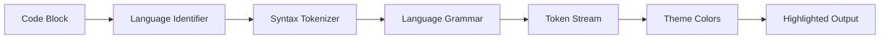

```mermaid
graph TD
    A[Code Documentation] --> B[Code Fences]
    A --> C[Syntax Highlighting]
    A --> D[Code Explanations]
    A --> E[Annotated Code]
    A --> F[Terminal Examples]
    A --> G[Language Examples]
    A --> H[Diff Blocks]
    A --> I[Best Practices]
    B --> B1[Triple Backticks]
    B --> B2[Tildes]
    B --> B3[Info Strings]
    C --> C1[Language Identifiers]
    C --> C2[Theme Support]
    D --> D1[Inline Comments]
    D --> D2[Line References]
    D --> D3[Callouts]
    E --> E1[Line-by-line]
    E --> E2[Side-by-side]
    G --> G1[Python]
    G --> G2[JavaScript]
    G --> G3[PHP]
    G --> G4[Java]
    G --> G5[C/C++]
    G --> G6[Rust]
    G --> G7[Go]
    G --> G8[SQL]
    G --> G9[JSON/YAML]
    G --> G10[Dockerfile]
    H --> H1[Code Changes]
    H --> H2[Reviews]
```

# Module 4: Code Documentation

> **Duration:** 6–10 hours  
> **Prerequisites:** Module 2 — Core Markdown, Module 3 — Advanced Markdown  
> **Learning Objectives:** Master code documentation in Markdown across multiple programming languages, understand syntax highlighting, write annotated code, and create effective code explanations.

---



---

## 4.1 Code Fences

Code fences are the primary way to display multi-line code blocks in Markdown.

### Triple Backticks

````markdown
```
Code block with triple backticks
```
````

### Tilde Fences

```markdown
~~~
Code block with tildes
~~~
```

### Comparing Fence Styles

| Feature | Triple Backticks `` ``` `` | Tildes `~~~` |
|---------|---------------------------|--------------|
| Most common | ✅ Yes | ❌ No |
| Keyboard access | Easy on most layouts | Varies by keyboard |
| Language specifier | ✅ ` ```python` | ✅ `~~~python` |
| Nested code blocks | Use more backticks | May conflict with YAML |

### Info Strings

````markdown
```python
def hello():
    print("Hello, World!")
```

```javascript
console.log("Hello!");
```

```bash
echo "Hello, World!"
```
````

### Info String Format

```
```language
```language {.class #id}
```language key=value
```language linenums="1" hl_lines="1 3-5"
```

### Fence Best Practices

| Practice | Reason |
|----------|--------|
| Always use triple backticks | Most widely supported |
| Always specify a language | Enables syntax highlighting |
| Use blank lines around fences | Prevents rendering issues |
| Keep lines under 100 chars | Prevents horizontal scrolling |

---

## 4.2 Syntax Highlighting

Syntax highlighting colors code elements to improve readability.

### How It Works



1. The renderer reads the language identifier from the info string
2. The tokenizer breaks code into tokens (keywords, strings, comments, etc.)
3. The grammar defines rules for each language
4. The theme maps token types to colors
5. The output is colorized HTML/CSS

### Popular Syntax Highlighting Engines

| Engine | Used By | Languages |
|--------|---------|-----------|
| Prism.js | Websites, docs | 200+ |
| Highlight.js | GitHub, many sites | 190+ |
| Pygments | Python tools | 500+ |
| Shiki | VS Code, Nuxt | 200+ |
| Rouge | Jekyll, GitHub | 100+ |
| Tree-sitter | NeoVim, GitHub | 100+ |

### Theme Support

| Theme Type | Description | Examples |
|------------|-------------|----------|
| Light themes | Dark text on light bg | GitHub, Solarized Light |
| Dark themes | Light text on dark bg | Dracula, Monokai, Nord |
| High contrast | Maximum contrast | WCAG-compliant themes |

---

## 4.3 Supported Languages

A comprehensive table of languages and their identifiers.

| Language | Identifier(s) | Common Use |
|----------|---------------|------------|
| Python | `python`, `py` | General purpose, data science |
| JavaScript | `javascript`, `js` | Web, Node.js |
| TypeScript | `typescript`, `ts` | Typed JavaScript |
| JSX | `jsx` | React components |
| TSX | `tsx` | TypeScript + React |
| HTML | `html`, `htm` | Web markup |
| CSS | `css` | Web styling |
| SCSS | `scss` | Sass stylesheets |
| Bash | `bash`, `sh`, `shell` | Shell scripting |
| Zsh | `zsh` | Z shell scripting |
| PowerShell | `powershell`, `ps` | Windows scripting |
| SQL | `sql` | Database queries |
| PHP | `php` | Web backend |
| Java | `java` | Enterprise, Android |
| Kotlin | `kotlin` | Android, JVM |
| C | `c` | Systems programming |
| C++ | `cpp`, `c++` | Systems, games |
| C# | `csharp`, `cs` | .NET ecosystem |
| Go | `go`, `golang` | Cloud, microservices |
| Rust | `rust`, `rs` | Systems, WebAssembly |
| Swift | `swift` | Apple ecosystem |
| Ruby | `ruby`, `rb` | Web, scripting |
| R | `r` | Statistics, data science |
| Dart | `dart` | Flutter apps |
| Lua | `lua` | Game scripting, embedded |
| Perl | `perl` | Text processing |
| Haskell | `haskell`, `hs` | Functional programming |
| Scala | `scala` | JVM functional |
| Elixir | `elixir`, `ex` | Erlang VM |
| Clojure | `clojure`, `clj` | Lisp on JVM |
| JSON | `json` | Data exchange |
| YAML | `yaml`, `yml` | Configuration |
| XML | `xml` | Markup, config |
| TOML | `toml` | Configuration |
| Dockerfile | `dockerfile`, `docker` | Container builds |
| Makefile | `makefile`, `make` | Build automation |
| Markdown | `markdown`, `md` | Documentation |
| Diff | `diff`, `patch` | Code changes |
| GraphQL | `graphql` | API queries |
| Regex | `regex` | Pattern matching |

---

## 4.4 Code Explanations

Techniques for explaining code within documentation.

### Inline Comments

````markdown
```python
def calculate_total(items):
    # Sum up all item prices
    subtotal = sum(item['price'] for item in items)
    # Apply 10% tax
    tax = subtotal * 0.10
    # Return total with tax
    return subtotal + tax
```
````

### Numbered Line References

````markdown
```python {linenums="1"}
def fibonacci(n):
    if n <= 1:                      # Line 2: Base case
        return n                     # Line 3: Return for n=0 or n=1
    return fibonacci(n-1) + fibonacci(n-2)  # Line 5: Recursive case
```
````

### Callout Annotations

```markdown
```python
def validate_email(email: str) -> bool:
    import re
    pattern = r'^[a-zA-Z0-9._%+-]+@[a-zA-Z0-9.-]+\.[a-zA-Z]{2,}$'
    return bool(re.match(pattern, email))
```

**Line 1:** The function takes an email string and returns a boolean.  
**Line 2:** We import Python's regex module.  
**Line 3:** The regex pattern checks for valid email structure.  
**Line 4:** `re.match()` returns a match object; `bool()` converts to True/False.
```

### Step-by-Step Explanation

````markdown
## Step 1: Parse the Request

```python
from flask import request

data = request.get_json()
```

`request.get_json()` parses the incoming JSON body into a Python dictionary.

## Step 2: Validate Input

```python
if not data or 'name' not in data:
    return {'error': 'Name is required'}, 400
```

We check that the data exists and contains the required `name` field.

## Step 3: Process Data

```python
name = data['name'].strip()
result = process_name(name)
```

The name is trimmed and passed to the processing function.
````

---

## 4.5 Annotated Code

Detailed line-by-line annotation for complex code.

### Line-by-Line Annotation

````markdown
```python
from fastapi import FastAPI, HTTPException  # Import web framework and error handling
from pydantic import BaseModel               # Import data validation
from typing import List, Optional            # Import type hints

app = FastAPI()                              # Create application instance

class Item(BaseModel):                       # Define data model
    id: int                                  # Item ID (integer)
    name: str                                # Item name (string)
    price: float                             # Item price (float)
    description: Optional[str] = None        # Optional description

items_db: List[Item] = []                    # In-memory storage

@app.get("/items", response_model=List[Item])  # GET endpoint
async def get_items():
    return items_db                          # Return all items

@app.post("/items", response_model=Item)       # POST endpoint
async def create_item(item: Item):
    items_db.append(item)                    # Add to storage
    return item                              # Return created item
```
````

### Explanation Reference Table

```markdown
| Line(s) | Code | Explanation |
|---------|------|-------------|
| 1 | `from fastapi import ...` | Imports FastAPI and HTTP exception class |
| 2 | `from pydantic import BaseModel` | Imports Pydantic for data validation |
| 3 | `from typing import ...` | Imports type hints for better IDE support |
| 5 | `app = FastAPI()` | Creates the FastAPI application instance |
| 7–11 | `class Item(BaseModel)` | Defines the data model with typed fields |
| 13 | `items_db` | In-memory list acting as a database |
| 15–16 | `@app.get...` | Decorator registers a GET route handler |
| 19–21 | `@app.post...` | Decorator registers a POST route handler |
```

### Side-by-Side Approach

```markdown
<table>
<tr>
<th>Code</th>
<th>Explanation</th>
</tr>
<tr>
<td>

```python
def factorial(n):
    if n <= 1:
        return 1
    return n * factorial(n-1)
```

</td>
<td>

**`factorial(5)`:**  
1. `n=5`, not <= 1, so `5 * factorial(4)`  
2. `n=4`, not <= 1, so `4 * factorial(3)`  
3. `n=3`, not <= 1, so `3 * factorial(2)`  
4. `n=2`, not <= 1, so `2 * factorial(1)`  
5. `n=1`, returns `1`  
Result: `5 * 4 * 3 * 2 * 1 = 120`

</td>
</tr>
</table>
```

---

## 4.6 Terminal Examples

Displaying terminal commands and output in documentation.

### Prompt Convention

```markdown
```console
$ git clone https://github.com/user/repo.git
Cloning into 'repo'...
remote: Enumerating objects: 100, done.
Receiving objects: 100% (100/100), done.

$ cd repo
$ npm install
npm notice created a lockfile as package-lock.json
```
```

### Distinct Command and Output

```markdown
```bash
# Command
$ curl -X GET https://api.example.com/users

# Output
[
  {"id": 1, "name": "Alice"},
  {"id": 2, "name": "Bob"}
]
```
```

### Multi-Step Terminal

```markdown
```console
$ python -m venv venv
$ source venv/bin/activate
(venv) $ pip install flask
Collecting flask
  Downloading flask-3.0.0-py3-none-any.whl
Installing collected packages: flask
Successfully installed flask-3.0.0
(venv) $ python app.py
 * Running on http://127.0.0.1:5000
```
```

### Tips for Terminal Examples

| Practice | Reason |
|----------|--------|
| Use `$` for regular user | Standard convention |
| Use `#` for root | Distinguishes privilege levels |
| Show both command and output | Complete context |
| Use `console` language | Highlights prompt and output |
| Prefix continuation lines with `>` | Multi-line commands |

---

## 4.7 Shell Examples

### Bash

````markdown
```bash
#!/bin/bash

# Check if a file exists
if [ -f "$1" ]; then
    echo "File $1 exists"
    wc -l "$1"
else
    echo "File $1 does not exist"
    exit 1
fi
```
````

### Zsh

````markdown
```zsh
# Zsh-specific features
echo ${(U)string}  # Uppercase variable expansion

# Glob qualifiers
for file in *.txt(.); do
    echo "$file"
done

# Extended globbing
ls **/*.md
```
````

### PowerShell

````markdown
```powershell
# PowerShell example
$processes = Get-Process | Where-Object {
    $_.CPU -gt 10
} | Select-Object Name, CPU, Id

$processes | Format-Table -AutoSize

# Check if a service is running
$service = Get-Service -Name "nginx"
if ($service.Status -eq "Running") {
    Write-Host "nginx is running" -ForegroundColor Green
}
```
````

### Shell Example Tips

| Shell | Identifier | Key Features |
|-------|------------|--------------|
| Bash | `bash`, `sh` | POSIX-compatible, most common |
| Zsh | `zsh` | Extended globbing, better completions |
| Fish | `fish` | Simpler syntax, autosuggestions |
| PowerShell | `powershell`, `ps` | Object-oriented, Windows focus |
| Cmd | `cmd`, `batch` | Legacy Windows commands |

---

## 4.8 Configuration Examples

### .env Example

````markdown
```env
# Application Configuration
APP_NAME=MyApp
APP_ENV=development
APP_DEBUG=true
APP_URL=http://localhost:8000

# Database Configuration
DB_CONNECTION=mysql
DB_HOST=127.0.0.1
DB_PORT=3306
DB_DATABASE=myapp
DB_USERNAME=root
DB_PASSWORD=

# Redis Configuration
REDIS_HOST=127.0.0.1
REDIS_PORT=6379
REDIS_PASSWORD=null
```
````

### .gitignore Example

````markdown
```gitignore
# Dependencies
node_modules/
vendor/
.pnp/
.pnp.js

# Build outputs
dist/
build/
*.tgz
*.zip

# Environment files
.env
.env.local
.env.*.local

# IDE files
.vscode/
.idea/
*.swp
*.swo
*~

# OS files
.DS_Store
Thumbs.db
```
````

### Config Files

````markdown
```ini
; config.ini
[database]
host = localhost
port = 5432
name = myapp
user = admin
password = ${DB_PASSWORD}

[logging]
level = INFO
file = /var/log/app.log
format = json

[cache]
driver = redis
ttl = 3600
```
````

### Nginx Config

````markdown
```nginx
server {
    listen 80;
    server_name example.com;
    root /var/www/html;

    location / {
        try_files $uri $uri/ /index.html;
    }

    location /api {
        proxy_pass http://localhost:3000;
        proxy_set_header Host $host;
        proxy_set_header X-Real-IP $remote_addr;
    }

    location /static {
        expires 1y;
        add_header Cache-Control "public, immutable";
    }
}
```
````

---

## 4.9 JSON Examples

### Basic JSON

````markdown
```json
{
  "name": "My Application",
  "version": "2.1.0",
  "description": "A sample application",
  "main": "index.js",
  "scripts": {
    "start": "node index.js",
    "test": "jest",
    "lint": "eslint ."
  },
  "dependencies": {
    "express": "^4.18.0",
    "lodash": "^4.17.21"
  },
  "devDependencies": {
    "jest": "^29.0.0",
    "eslint": "^8.0.0"
  }
}
```
````

### Pretty-Printed JSON

Always format JSON with proper indentation (2 or 4 spaces):

```markdown
```json
{
  "users": [
    {
      "id": 1,
      "name": "Alice",
      "email": "alice@example.com",
      "roles": ["admin", "editor"]
    },
    {
      "id": 2,
      "name": "Bob",
      "email": "bob@example.com",
      "roles": ["viewer"]
    }
  ],
  "total": 2,
  "page": 1,
  "pageSize": 10
}
```
```

### JSON with Diff Highlighting

````markdown
```diff
 {
   "name": "My App",
-  "version": "1.0.0",
+  "version": "2.0.0",
-  "deprecated": true,
+  "features": ["auth", "api", "admin"]
 }
```
````

### JSON Best Practices

| Practice | Reason |
|----------|--------|
| Use 2-space indentation | Standard for JSON |
| Remove trailing commas | Invalid JSON otherwise |
| Use double quotes | Required by JSON spec |
| Validate before documenting | Ensures examples are correct |
| Show only relevant fields | Reduces noise |

---

## 4.10 YAML Examples

### Basic YAML

````markdown
```yaml
# Application configuration
app:
  name: MyApp
  version: 2.1.0
  debug: true

# Server settings
server:
  host: 0.0.0.0
  port: 8080
  ssl:
    enabled: true
    cert: /etc/ssl/certs/app.crt
    key: /etc/ssl/private/app.key

# Database
database:
  driver: postgresql
  host: ${DB_HOST}
  port: 5432
  pool:
    min: 2
    max: 10
```
````

### YAML Indentation Rules

```yaml
# Correct: 2-space indentation
parent:
  child:
    grandchild: value

# Incorrect: mixed indentation
parent:
 child: value    # Inconsistent
   child2: value  # Wrong level

# Incorrect: tabs vs spaces
parent:
	child: value  # Tabs not allowed in YAML
```

### Common YAML Patterns

````markdown
```yaml
# List of items
fruits:
  - apple
  - banana
  - cherry

# List of objects
users:
  - name: Alice
    role: admin
  - name: Bob
    role: viewer

# Multiline strings
description: |
  This is a block of text
  that spans multiple lines
  and preserves line breaks.

summary: >
  This is a folded block
  that joins lines into
  a single paragraph.
```
````

---

## 4.11 XML Examples

### Basic XML

````markdown
```xml
<?xml version="1.0" encoding="UTF-8"?>
<configuration>
    <app>
        <name>MyApp</name>
        <version>2.1.0</version>
    </app>
    <server>
        <host>0.0.0.0</host>
        <port>8080</port>
    </server>
    <database>
        <connection>
            <host>localhost</host>
            <port>5432</port>
            <name>myapp</name>
        </connection>
    </database>
</configuration>
```
````

### XML with Attributes

````markdown
```xml
<?xml version="1.0" encoding="UTF-8"?>
<bookshelf>
    <book id="1" category="programming">
        <title>Clean Code</title>
        <author>Robert C. Martin</author>
        <isbn>978-0132350884</isbn>
        <price currency="USD">39.99</price>
    </book>
    <book id="2" category="architecture">
        <title>Designing Data-Intensive Applications</title>
        <author>Martin Kleppmann</author>
        <isbn>978-1449373320</isbn>
        <price currency="USD">44.99</price>
    </book>
</bookshelf>
```
````

### XML in Docs Best Practices

| Practice | Reason |
|----------|--------|
| Use 4-space indentation | Common XML convention |
| Always include XML declaration | Specifies version and encoding |
| Use self-closing tags for empty elements | Cleaner syntax |
| Escape special characters | `&lt;` for `<`, `&gt;` for `>` |

---

## 4.12 Dockerfile Examples

### Basic Dockerfile

````markdown
```dockerfile
FROM node:20-alpine AS base
WORKDIR /app
COPY package*.json ./
RUN npm ci --only=production

FROM base AS build
RUN npm ci
COPY . .
RUN npm run build

FROM node:20-alpine AS production
WORKDIR /app
COPY --from=base /app/node_modules ./node_modules
COPY --from=build /app/dist ./dist
COPY package.json .
EXPOSE 3000
CMD ["node", "dist/index.js"]
```
````

### Multi-Stage Build

````markdown
```dockerfile
# Stage 1: Build
FROM golang:1.22-alpine AS builder
WORKDIR /src
COPY go.mod go.sum ./
RUN go mod download
COPY . .
RUN CGO_ENABLED=0 go build -o /app/server .

# Stage 2: Test
FROM builder AS tester
RUN go test ./...

# Stage 3: Production
FROM alpine:3.19 AS production
RUN apk --no-cache add ca-certificates
COPY --from=builder /app/server /usr/local/bin/server
EXPOSE 8080
USER 1000:1000
ENTRYPOINT ["server"]
```
````

### Docker Compose

````markdown
```yaml
version: '3.8'

services:
  app:
    build: .
    ports:
      - "3000:3000"
    environment:
      - NODE_ENV=production
      - DB_HOST=database
    depends_on:
      - database
    volumes:
      - uploads:/app/uploads

  database:
    image: postgres:16-alpine
    environment:
      POSTGRES_DB: myapp
      POSTGRES_USER: app
      POSTGRES_PASSWORD: ${DB_PASSWORD}
    volumes:
      - postgres_data:/var/lib/postgresql/data
    ports:
      - "5432:5432"

volumes:
  postgres_data:
  uploads:
```
````

---

## 4.13 SQL Examples

### CREATE TABLE

````markdown
```sql
CREATE TABLE users (
    id SERIAL PRIMARY KEY,
    username VARCHAR(50) UNIQUE NOT NULL,
    email VARCHAR(255) UNIQUE NOT NULL,
    password_hash VARCHAR(255) NOT NULL,
    full_name VARCHAR(100),
    role VARCHAR(20) DEFAULT 'user',
    is_active BOOLEAN DEFAULT true,
    created_at TIMESTAMP DEFAULT CURRENT_TIMESTAMP,
    updated_at TIMESTAMP DEFAULT CURRENT_TIMESTAMP
);

CREATE INDEX idx_users_email ON users(email);
CREATE INDEX idx_users_role ON users(role);
```
````

### Queries

````markdown
```sql
-- Get active users with recent orders
SELECT
    u.id,
    u.username,
    u.email,
    COUNT(o.id) AS order_count,
    MAX(o.created_at) AS last_order_date
FROM users u
LEFT JOIN orders o ON u.id = o.user_id
WHERE u.is_active = true
  AND u.created_at >= '2025-01-01'
GROUP BY u.id, u.username, u.email
HAVING COUNT(o.id) > 0
ORDER BY last_order_date DESC
LIMIT 50;
```
````

### EXPLAIN Plans

````markdown
```sql
EXPLAIN ANALYZE
SELECT * FROM users
WHERE email = 'alice@example.com';

-- Output:
-- Index Scan using idx_users_email on users
--   (cost=0.28..8.30 rows=1 width=72)
--   (actual time=0.012..0.013 rows=1 loops=1)
--   Index Cond: (email = 'alice@example.com'::text)
-- Planning Time: 0.058 ms
-- Execution Time: 0.028 ms
```
````

### SQL Best Practices

| Practice | Reason |
|----------|--------|
| Uppercase SQL keywords | Traditional convention |
| Lowercase table/column names | Readability |
| Use meaningful aliases | `u` for `users`, `o` for `orders` |
| Format with line breaks | Readability for complex queries |
| Show EXPLAIN plans | Demonstrates query performance |

---

## 4.14 PHP Examples

### Basic PHP

````markdown
```php
<?php

namespace App\Services;

use App\Models\User;
use App\Exceptions\UserNotFoundException;

class UserService
{
    private UserRepository $repository;

    public function __construct(UserRepository $repository)
    {
        $this->repository = $repository;
    }

    /**
     * Find a user by email address.
     *
     * @param string $email The email to search for
     * @return User|null The user or null if not found
     * @throws UserNotFoundException
     */
    public function findByEmail(string $email): ?User
    {
        $user = $this->repository->findByEmail($email);

        if ($user === null) {
            throw new UserNotFoundException("User with email {$email} not found");
        }

        return $user;
    }

    /**
     * Create a new user.
     *
     * @param array $data User data
     * @return User The created user
     */
    public function create(array $data): User
    {
        // Validate input
        if (empty($data['email'])) {
            throw new \InvalidArgumentException('Email is required');
        }

        // Hash password
        $data['password'] = password_hash($data['password'], PASSWORD_BCRYPT);

        return $this->repository->save(new User($data));
    }
}
```
````

### PHP DocBlocks

````markdown
```php
/**
 * Calculate the total price including tax and discounts.
 *
 * This method applies a progressive tax rate based on the
 * subtotal amount and any applicable discount codes.
 *
 * @param float $subtotal  The base price before tax
 * @param string $currency The ISO 4217 currency code
 * @param string|null $discountCode Optional discount code
 *
 * @return array{
 *     subtotal: float,
 *     tax: float,
 *     discount: float,
 *     total: float,
 *     currency: string
 * }
 *
 * @throws \InvalidArgumentException If currency is not supported
 *
 * @see PriceCalculator::applyTax()
 * @see DiscountService::validateCode()
 */
public function calculateTotal(
    float $subtotal,
    string $currency = 'USD',
    ?string $discountCode = null
): array {
    // Implementation...
}
```
````

---

## 4.15 JavaScript Examples

### Modern JavaScript

````markdown
```javascript
import express from 'express';
import { createServer } from 'http';
import { Server } from 'socket.io';

const app = express();
const server = createServer(app);
const io = new Server(server, {
  cors: {
    origin: process.env.CLIENT_URL,
    methods: ['GET', 'POST']
  }
});

app.get('/health', (req, res) => {
  res.json({ status: 'ok', timestamp: Date.now() });
});

io.on('connection', (socket) => {
  console.log(`Client connected: ${socket.id}`);

  socket.on('message', (data) => {
    io.emit('message', {
      userId: data.userId,
      text: data.text,
      timestamp: Date.now()
    });
  });

  socket.on('disconnect', () => {
    console.log(`Client disconnected: ${socket.id}`);
  });
});

server.listen(process.env.PORT || 3000, () => {
  console.log(`Server running on port ${server.address().port}`);
});
```
````

### Async/Await Patterns

````markdown
```javascript
// Async data fetching with error handling
async function fetchUserData(userId) {
  try {
    const response = await fetch(`/api/users/${userId}`);

    if (!response.ok) {
      throw new Error(`HTTP error! status: ${response.status}`);
    }

    const data = await response.json();
    return data;
  } catch (error) {
    console.error('Failed to fetch user:', error);
    throw error;
  }
}

// Parallel execution
async function loadDashboard() {
  const [user, posts, notifications] = await Promise.all([
    fetchUserData(currentUserId),
    fetchUserPosts(currentUserId),
    fetchNotifications(currentUserId)
  ]);

  return { user, posts, notifications };
}
```
````

---

## 4.16 TypeScript Examples

### Type Annotations

````markdown
```typescript
interface User {
  id: string;
  email: string;
  name: string;
  role: 'admin' | 'editor' | 'viewer';
  createdAt: Date;
  metadata?: Record<string, unknown>;
}

type ApiResponse<T> = {
  data: T;
  error: null;
} | {
  data: null;
  error: {
    code: string;
    message: string;
  };
};

async function getUser(id: string): Promise<ApiResponse<User>> {
  try {
    const response = await fetch(`/api/users/${id}`);
    const user: User = await response.json();
    return { data: user, error: null };
  } catch (error) {
    return {
      data: null,
      error: {
        code: 'FETCH_ERROR',
        message: error instanceof Error ? error.message : 'Unknown error'
      }
    };
  }
}
```
````

### Generics

````markdown
```typescript
// Generic repository pattern
abstract class BaseRepository<T extends { id: string }> {
  protected items: Map<string, T> = new Map();

  async findById(id: string): Promise<T | null> {
    return this.items.get(id) ?? null;
  }

  async findAll(): Promise<T[]> {
    return Array.from(this.items.values());
  }

  async create(data: Omit<T, 'id'>): Promise<T> {
    const id = crypto.randomUUID();
    const item = { ...data, id } as T;
    this.items.set(id, item);
    return item;
  }

  async update(id: string, data: Partial<T>): Promise<T | null> {
    const existing = this.items.get(id);
    if (!existing) return null;
    const updated = { ...existing, ...data };
    this.items.set(id, updated);
    return updated;
  }
}

// Usage
interface Product extends Document {
  id: string;
  name: string;
  price: number;
}

class ProductRepository extends BaseRepository<Product> {}
```
````

---

## 4.17 Python Examples

### Modern Python

````markdown
```python
from dataclasses import dataclass
from typing import Optional
import httpx
import asyncio


@dataclass
class User:
    id: int
    username: str
    email: str
    is_active: bool = True


class UserClient:
    """Async HTTP client for the User API."""
    
    BASE_URL = "https://api.example.com/v1"
    
    def __init__(self, api_key: str):
        self.headers = {"Authorization": f"Bearer {api_key}"}
    
    async def get_user(self, user_id: int) -> Optional[User]:
        async with httpx.AsyncClient() as client:
            response = await client.get(
                f"{self.BASE_URL}/users/{user_id}",
                headers=self.headers
            )
            response.raise_for_status()
            data = response.json()
            return User(**data)
    
    async def list_users(
        self,
        page: int = 1,
        limit: int = 10
    ) -> list[User]:
        async with httpx.AsyncClient() as client:
            response = await client.get(
                f"{self.BASE_URL}/users",
                params={"page": page, "limit": limit},
                headers=self.headers
            )
            response.raise_for_status()
            return [User(**item) for item in response.json()["data"]]


async def main():
    client = UserClient(api_key="test-key")
    user = await client.get_user(1)
    print(f"User: {user.username} ({user.email})")


if __name__ == "__main__":
    asyncio.run(main())
```
````

### Type Hints

````markdown
```python
from typing import Optional, Union, Callable, TypeVar, Generic

T = TypeVar("T")

class Result(Generic[T]):
    """A monadic result type for handling success/failure."""
    
    def __init__(
        self,
        value: Optional[T] = None,
        error: Optional[str] = None
    ):
        self._value = value
        self._error = error
    
    @property
    def is_ok(self) -> bool:
        return self._error is None
    
    def unwrap(self) -> T:
        if self._error:
            raise RuntimeError(self._error)
        return self._value  # type: ignore
    
    @classmethod
    def ok(cls, value: T) -> "Result[T]":
        return cls(value=value)
    
    @classmethod
    def err(cls, message: str) -> "Result[T]":
        return cls(error=message)
    
    def map(self, fn: Callable[[T], U]) -> "Result[U]":
        if self.is_ok:
            return Result.ok(fn(self._value))  # type: ignore
        return Result.err(self._error)  # type: ignore
```
````

---

## 4.18 Go Examples

### Basic Go

````markdown
```go
package main

import (
    "encoding/json"
    "log"
    "net/http"
    "time"
)

type User struct {
    ID        string    `json:"id"`
    Username  string    `json:"username"`
    Email     string    `json:"email"`
    CreatedAt time.Time `json:"created_at"`
}

type UserHandler struct {
    store map[string]User
}

func (h *UserHandler) GetUser(w http.ResponseWriter, r *http.Request) {
    id := r.PathValue("id")
    
    user, exists := h.store[id]
    if !exists {
        http.Error(w, "User not found", http.StatusNotFound)
        return
    }
    
    w.Header().Set("Content-Type", "application/json")
    json.NewEncoder(w).Encode(user)
}

func (h *UserHandler) CreateUser(w http.ResponseWriter, r *http.Request) {
    var user User
    if err := json.NewDecoder(r.Body).Decode(&user); err != nil {
        http.Error(w, "Invalid request body", http.StatusBadRequest)
        return
    }
    
    user.ID = fmt.Sprintf("user_%d", len(h.store)+1)
    user.CreatedAt = time.Now()
    h.store[user.ID] = user
    
    w.Header().Set("Content-Type", "application/json")
    w.WriteHeader(http.StatusCreated)
    json.NewEncoder(w).Encode(user)
}

func main() {
    handler := &UserHandler{store: make(map[string]User)}
    
    mux := http.NewServeMux()
    mux.HandleFunc("GET /users/{id}", handler.GetUser)
    mux.HandleFunc("POST /users", handler.CreateUser)
    
    log.Println("Server starting on :8080")
    log.Fatal(http.ListenAndServe(":8080", mux))
}
```
````

### Error Handling Patterns

````markdown
```go
package database

import (
    "context"
    "errors"
    "fmt"
)

var (
    ErrNotFound  = errors.New("record not found")
    ErrDuplicate = errors.New("duplicate key")
)

type Repository struct {
    // ...
}

func (r *Repository) GetUser(ctx context.Context, id string) (*User, error) {
    query := "SELECT id, username, email FROM users WHERE id = $1"
    
    var user User
    err := r.db.QueryRowContext(ctx, query, id).Scan(
        &user.ID,
        &user.Username,
        &user.Email,
    )
    
    if err != nil {
        if errors.Is(err, sql.ErrNoRows) {
            return nil, fmt.Errorf("%w: user %s", ErrNotFound, id)
        }
        return nil, fmt.Errorf("query failed: %w", err)
    }
    
    return &user, nil
}
```
````

---

## 4.19 Rust Examples

### Basic Rust

````markdown
```rust
use axum::{
    extract::{Path, State},
    http::StatusCode,
    response::Json,
    routing::get,
    Router,
};
use serde::{Deserialize, Serialize};
use std::collections::HashMap;
use std::sync::Arc;
use tokio::sync::RwLock;

#[derive(Debug, Serialize, Deserialize, Clone)]
struct User {
    id: String,
    username: String,
    email: String,
}

type Db = Arc<RwLock<HashMap<String, User>>>;

async fn get_user(
    State(db): State<Db>,
    Path(id): Path<String>,
) -> Result<Json<User>, StatusCode> {
    let users = db.read().await;
    users
        .get(&id)
        .cloned()
        .map(Json)
        .ok_or(StatusCode::NOT_FOUND)
}

async fn create_user(
    State(db): State<Db>,
    Json(user): Json<User>,
) -> (StatusCode, Json<User>) {
    let mut users = db.write().await;
    let id = uuid::Uuid::new_v4().to_string();
    let user = User { id, ..user };
    users.insert(user.id.clone(), user.clone());
    (StatusCode::CREATED, Json(user))
}

#[tokio::main]
async fn main() {
    let db: Db = Arc::new(RwLock::new(HashMap::new()));

    let app = Router::new()
        .route("/users/{id}", get(get_user))
        .route("/users", axum::routing::post(create_user))
        .with_state(db);

    let listener = tokio::net::TcpListener::bind("0.0.0.0:3000")
        .await
        .unwrap();
    axum::serve(listener, app).await.unwrap();
}
```
````

### Ownership and Traits

````markdown
```rust
// Generic repository trait with ownership semantics
#[async_trait]
trait Repository<T: Send + Sync> {
    async fn find_by_id(&self, id: &str) -> Result<Option<T>, Error>;
    async fn save(&self, entity: T) -> Result<T, Error>;
    async fn delete(&self, id: &str) -> Result<bool, Error>;
}

#[derive(Debug)]
struct InMemoryRepository<T> {
    items: Arc<RwLock<HashMap<String, T>>>,
}

#[async_trait]
impl<T: Send + Sync + Clone + 'static> Repository<T> for InMemoryRepository<T> {
    async fn find_by_id(&self, id: &str) -> Result<Option<T>, Error> {
        let items = self.items.read().await;
        Ok(items.get(id).cloned())
    }

    async fn save(&self, entity: T) -> Result<T, Error> {
        let mut items = self.items.write().await;
        let id = uuid::Uuid::new_v4().to_string();
        // Ownership: entity moves into the map
        items.insert(id, entity.clone());
        Ok(entity)
    }

    async fn delete(&self, id: &str) -> Result<bool, Error> {
        let mut items = self.items.write().await;
        // Ownership: remove returns the owned value, we drop it
        Ok(items.remove(id).is_some())
    }
}
```
````

---

## 4.20 Java Examples

### Java Class

````markdown
```java
package com.example.service;

import com.example.model.User;
import com.example.repository.UserRepository;
import org.springframework.stereotype.Service;

import java.util.List;
import java.util.Optional;

@Service
public class UserService {

    private final UserRepository userRepository;

    public UserService(UserRepository userRepository) {
        this.userRepository = userRepository;
    }

    public Optional<User> findById(Long id) {
        return userRepository.findById(id);
    }

    public List<User> findAll() {
        return userRepository.findAll();
    }

    public User create(User user) {
        if (userRepository.findByEmail(user.getEmail()).isPresent()) {
            throw new DuplicateResourceException(
                "User with email " + user.getEmail() + " already exists"
            );
        }
        return userRepository.save(user);
    }

    public User update(Long id, User updatedUser) {
        return userRepository.findById(id)
            .map(existing -> {
                existing.setUsername(updatedUser.getUsername());
                existing.setEmail(updatedUser.getEmail());
                return userRepository.save(existing);
            })
            .orElseThrow(() -> new ResourceNotFoundException(
                "User not found with id: " + id
            ));
    }

    public void delete(Long id) {
        if (!userRepository.existsById(id)) {
            throw new ResourceNotFoundException(
                "User not found with id: " + id
            );
        }
        userRepository.deleteById(id);
    }
}
```
````

### Annotations

````markdown
```java
@Entity
@Table(name = "users")
public class User {

    @Id
    @GeneratedValue(strategy = GenerationType.IDENTITY)
    private Long id;

    @Column(nullable = false, unique = true, length = 50)
    private String username;

    @Column(nullable = false, unique = true)
    private String email;

    @Column(name = "full_name")
    private String fullName;

    @Enumerated(EnumType.STRING)
    @Column(nullable = false)
    private UserRole role;

    @CreationTimestamp
    @Column(name = "created_at", updatable = false)
    private LocalDateTime createdAt;

    @UpdateTimestamp
    @Column(name = "updated_at")
    private LocalDateTime updatedAt;

    // Getters and setters omitted for brevity
}

enum UserRole {
    ADMIN, EDITOR, VIEWER
}
```
````

---

## 4.21 C Examples

### Basic C

````markdown
```c
#include <stdio.h>
#include <stdlib.h>
#include <string.h>

#define MAX_USERS 100
#define NAME_LEN 50

typedef struct {
    int id;
    char name[NAME_LEN];
    char email[NAME_LEN];
    int active;
} User;

User users[MAX_USERS];
int user_count = 0;

int add_user(const char* name, const char* email) {
    if (user_count >= MAX_USERS) {
        return -1;  // No space available
    }
    
    User* u = &users[user_count];
    u->id = user_count + 1;
    strncpy(u->name, name, NAME_LEN - 1);
    u->name[NAME_LEN - 1] = '\0';
    strncpy(u->email, email, NAME_LEN - 1);
    u->email[NAME_LEN - 1] = '\0';
    u->active = 1;
    
    return user_count++;  // Return index
}

User* find_user(int id) {
    for (int i = 0; i < user_count; i++) {
        if (users[i].id == id && users[i].active) {
            return &users[i];
        }
    }
    return NULL;  // Not found
}

void list_users() {
    printf("\n%-5s %-20s %-30s\n", "ID", "Name", "Email");
    printf("----- -------------------- ------------------------------\n");
    
    for (int i = 0; i < user_count; i++) {
        if (users[i].active) {
            printf("%-5d %-20s %-30s\n",
                   users[i].id,
                   users[i].name,
                   users[i].email);
        }
    }
}
```
````

---

## 4.22 C++ Examples

### C++ Classes

````markdown
```cpp
#include <iostream>
#include <memory>
#include <optional>
#include <string>
#include <vector>

template<typename T>
class Repository {
public:
    virtual ~Repository() = default;
    
    virtual std::optional<T> findById(const std::string& id) = 0;
    virtual std::vector<T> findAll() = 0;
    virtual T save(const T& entity) = 0;
    virtual bool deleteById(const std::string& id) = 0;
};

struct User {
    std::string id;
    std::string username;
    std::string email;
    bool isActive{true};
};

class UserRepository : public Repository<User> {
private:
    std::unordered_map<std::string, User> storage;

public:
    std::optional<User> findById(const std::string& id) override {
        auto it = storage.find(id);
        if (it != storage.end()) {
            return it->second;
        }
        return std::nullopt;
    }

    std::vector<User> findAll() override {
        std::vector<User> result;
        result.reserve(storage.size());
        for (const auto& [_, user] : storage) {
            result.push_back(user);
        }
        return result;
    }

    User save(const User& user) override {
        storage[user.id] = user;
        return user;
    }

    bool deleteById(const std::string& id) override {
        return storage.erase(id) > 0;
    }
};
```
````

---

## 4.23 Diff Blocks

Diff blocks show code changes between versions.

### Basic Diff

````markdown
```diff
-function calculateTotal(items) {
-    return items.length * 10;
+function calculateTotal(items, prices) {
+    return items.reduce((sum, item) => sum + prices[item], 0);
 }
```
````

### Multi-File Diff

````markdown
```diff
--- a/src/server.js
+++ b/src/server.js
@@ -1,10 +1,14 @@
 const express = require('express');
+const cors = require('cors');
 const app = express();
 
+app.use(cors());
 app.use(express.json());
 
-app.get('/api/users', (req, res) => {
+app.get('/api/v2/users', (req, res) => {
+    const { page = 1, limit = 10 } = req.query;
     const users = getUsers();
-    res.json(users);
+    const start = (page - 1) * limit;
+    const paged = users.slice(start, start + limit);
+    res.json({ data: paged, total: users.length, page, limit });
 });
```
````

### PR Review Diff

````markdown
```diff
// Before
class EmailService {
    sendEmail(to, subject, body) {
        // Direct SMTP call
        const transport = nodemailer.createTransport({...});
        return transport.sendMail({ to, subject, text: body });
    }
}

// After
class EmailService {
    constructor(provider) {
        this.provider = provider;  // Injected dependency
    }

    async sendEmail(to, subject, body, options = {}) {
        const email = {
            to,
            subject,
            body,
            priority: options.priority || 'normal',
            attachments: options.attachments || []
        };

        try {
            const result = await this.provider.send(email);
            this.logSuccess(email, result);
            return result;
        } catch (error) {
            this.logError(email, error);
            throw new EmailDeliveryError('Failed to send email', error);
        }
    }
}
```
````

### Diff Syntax

| Symbol | Meaning | Color (typical) |
|--------|---------|-----------------|
| `+` | Added line | Green |
| `-` | Removed line | Red |
| ` ` (space) | Unchanged line | Default |
| `@@` | Hunk header | Cyan |
| `---` | Original file path | Red bold |
| `+++` | New file path | Green bold |

---

## 4.24 Best Practices

### Consistent Style

| Practice | Description |
|----------|-------------|
| Use same fence style | Always triple backticks |
| Consistent indentation | 2 spaces for JSON, 4 for XML |
| Language identifiers | Always specify |
| Line breaks | Keep lines under 100 characters |

### Code Comments

| Practice | Reason |
|----------|--------|
| Explain why, not what | Code shows what; comments explain why |
| Keep comments up to date | Stale comments are worse than none |
| Use docstrings for public APIs | Enables documentation generation |
| Avoid obvious comments | `i++ // increment i` adds nothing |

### Diff Visibility

| Practice | Reason |
|----------|--------|
| Show context lines | Helps reviewers understand changes |
| Use hunk headers | Shows line numbers and file sections |
| Group related changes | Easier to review |
| Explain the changes | Text above diff block |

### Documentation Code Quality

| Practice | Reason |
|----------|--------|
| Test all code examples | Broken examples erode trust |
| Use real-world examples | More relatable to readers |
| Keep examples focused | One concept per example |
| Show complete working code | Readers should be able to copy/paste |

---

## 4.25 Exercises

### Exercise 1: Code Fences
Create a fenced code block for a Python function that sorts a list of dictionaries by a key. Include the correct language identifier.

### Exercise 2: Syntax Highlighting
Write a JavaScript async function that fetches data from an API, handles errors, and returns parsed JSON. Use proper info strings.

### Exercise 3: Code Explanations
Take a SQL query that joins 3 tables and add numbered line references. Then write an explanation table referencing each line.

### Exercise 4: Annotated Code
Write a Go HTTP handler with line-by-line annotations. Include at least 15 lines of code with explanations for every 2-3 lines.

### Exercise 5: Terminal Example
Create a terminal session showing installation of a Node.js project, including npm install output, git commands, and running tests.

### Exercise 6: Configuration Files
Write a complete `.env.example` file for a web application with at least 15 configuration variables grouped into sections.

### Exercise 7: JSON and YAML
Create equivalent configuration in both JSON and YAML format for a docker-compose setup with 3 services.

### Exercise 8: Diff Block
Write a before/after diff for a JavaScript function that adds error handling. Use proper diff syntax with context lines.

### Exercise 9: Multi-Language
Write the same "User Service" implementation in Python, TypeScript, and Go. Each should include CRUD operations.

### Exercise 10: Comprehensive
Create a complete API documentation page that includes:
- A route table
- A request/response example in JSON
- A curl command example
- A code example in Python using httpx
- A code example in JavaScript using fetch
- Error response documentation with a diff showing error handling

---

## 4.26 Quiz

**Question 1:** What is the most common code fence syntax?
- A) `~~~`
- B) ``` ```
- C) `'''`
- D) `"""`

**Answer:** B

---

**Question 2:** What does the info string in a code fence specify?
- A) The author
- B) The language identifier
- C) The line count
- D) The file name

**Answer:** B

---

**Question 3:** Which language identifier is used for diff blocks?
- A) `patch`
- B) `diff`
- C) `changes`
- D) `compare`

**Answer:** B

---

**Question 4:** What does `+` mean in a diff block?
- A) Highlighted line
- B) Added line
- C) Important line
- D) Modified line

**Answer:** B

---

**Question 5:** What is the purpose of syntax highlighting?
- A) Decoration
- B) Improve code readability
- C) Validate syntax
- D) Compile code

**Answer:** B

---

**Question 6:** Which is the correct Dockerfile identifier?
- A) `docker`
- B) `dockerfile`
- C) `container`
- D) `dkr`

**Answer:** B

---

**Question 7:** How should JSON be formatted in documentation?
- A) Minified
- B) Pretty-printed with indentation
- C) Single line
- D) With comments

**Answer:** B

---

**Question 8:** What character indicates a regular user prompt in terminal examples?
- A) `#`
- B) `%`
- C) `$`
- D) `>`

**Answer:** C

---

**Question 9:** What should you always include in image alt text?
- A) File name
- B) Descriptive description of the image
- C) Image dimensions
- D) Copyright notice

**Answer:** B

---

**Question 10:** What is the recommended line length for code in documentation?
- A) 80 characters
- B) 100 characters
- C) 120 characters
- D) No limit

**Answer:** B (some say 80, but 100 is common in docs)

---

**Question 11:** How do you show a multi-line command in a terminal example?
- A) Use `<br>`
- B) Prefix continued lines with `>`
- C) Use multiple `$` prompts
- D) Use backticks

**Answer:** B

---

**Question 12:** What is the purpose of line numbering in code blocks?
- A) Decoration
- B) Reference specific lines in explanations
- C) Syntax highlighting
- D) Line count

**Answer:** B

---

**Question 13:** Which identifier is used for TypeScript React code?
- A) `typescript`
- B) `tsx`
- C) `react`
- D) `ts-react`

**Answer:** B

---

**Question 14:** What is the YAML indentation standard?
- A) 2 spaces
- B) 4 spaces
- C) Tabs
- D) No indentation needed

**Answer:** A

---

**Question 15:** Which of the following is NOT a valid practice for code documentation?
- A) Test code examples
- B) Use comments that explain what the code does line by line
- C) Keep examples focused on one concept
- D) Show both code and its output

**Answer:** B (comments should explain why, not what)

---

## 4.27 Interview Questions

**Q1: How do fenced code blocks differ from indented code blocks?**
A: Fenced code blocks use triple backticks or tildes, support language identifiers for syntax highlighting, and are easier to manage. Indented code blocks require 4-space indentation and don't support language specifiers.

**Q2: What is the purpose of info strings in code fences?**
A: Info strings contain metadata like the language identifier (e.g., ` ```python `) and optional parameters like line numbers. The language identifier enables syntax highlighting.

**Q3: How do you write a diff block showing code changes?**
A: Use the `diff` language identifier. Lines starting with `+` are additions (green), lines with `-` are deletions (red), and lines starting with a space are context.

**Q4: What are the best practices for JSON examples in documentation?**
A: Pretty-print with 2-space indentation, remove trailing commas, validate JSON before publishing, and show only relevant fields.

**Q5: How do you format terminal command examples?**
A: Use `console` as the language identifier, prefix commands with `$` (regular user) or `#` (root), and show both the command and its output.

**Q6: What is the difference between ` ```javascript ` and ` ```js `?**
A: Both are valid identifiers for JavaScript. The full name `javascript` is more explicit and widely supported.

**Q7: How do you handle code that contains triple backticks?**
A: Use a fence with more backticks than the code contains (e.g., ` ```` ```` ` for code with triple backticks).

**Q8: What is a multi-stage Dockerfile and how do you document it?**
A: A multi-stage Dockerfile uses multiple `FROM` statements to separate build and production stages. Document each stage with comments explaining its purpose.

**Q9: How do you document SQL queries effectively?**
A: Uppercase SQL keywords, use consistent indentation, show EXPLAIN plans for complex queries, and include comments for non-obvious logic.

**Q10: What are the key differences in documenting Python vs Rust code in Markdown?**
A: Python documentation emphasizes type hints, docstrings, and async patterns. Rust documentation should highlight ownership, borrowing, traits, and error handling with `Result` types.

---

> **Next Module:** Module 5 — Visual Documentation  
> Topics: ASCII diagrams, flow charts, architecture diagrams, database schemas, badges, callout boxes, screenshots, and tools for visual documentation.
