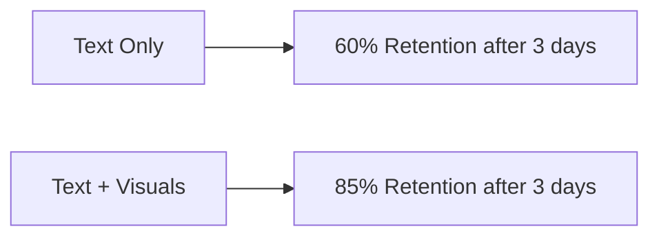
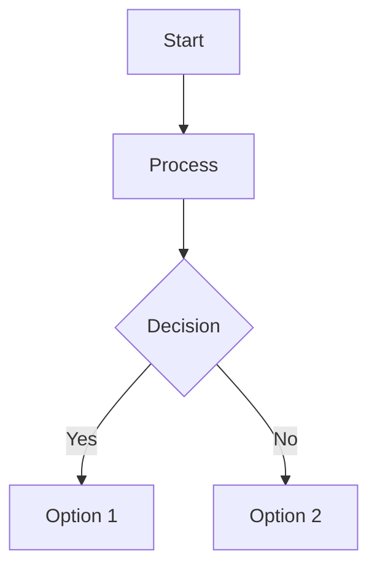
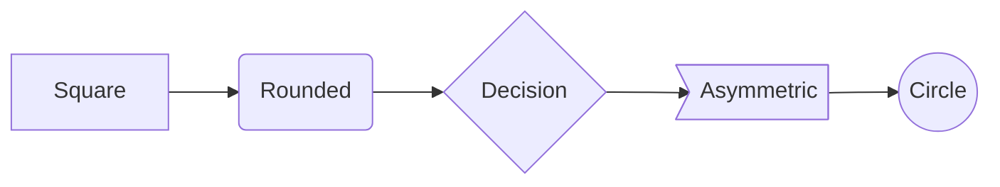

```mermaid
graph TD
    A[Visual Documentation] --> B[ASCII Diagrams]
    A --> C[Unicode Diagrams]
    A --> D[Flow Diagrams]
    A --> E[Tree Structures]
    A --> F[Architecture Diagrams]
    A --> G[Database Diagrams]
    A --> H[Network Diagrams]
    A --> I[Documentation Visuals]
    A --> J[Badges]
    A --> K[Screenshots]
    A --> L[Callout Boxes]
    A --> M[Tools]
    B --> B1[Box Drawing]
    B --> B2[Arrows]
    B --> B3[Simple Shapes]
    C --> C1[Box-Drawing Chars]
    C --> C2[Block Elements]
    C --> C3[Shades]
    D --> D1[Flow Charts]
    D --> D2[Decision Trees]
    D --> D3[Process Flows]
    E --> E1[Directory Trees]
    E --> E2[Hierarchy Trees]
    E --> E3[Org Charts]
    J --> J1[Shields.io]
    J --> J2[Custom Badges]
    L --> L1[Note Boxes]
    L --> L2[Warning Boxes]
    L --> L3[Tip Boxes]
    L --> L4[Danger Boxes]
```

# Module 5: Visual Documentation

> **Duration:** 5–8 hours  
> **Prerequisites:** Module 2 — Core Markdown, Module 3 — Advanced Markdown  
> **Learning Objectives:** Master visual documentation techniques including ASCII diagrams, Unicode art, flow charts, architecture diagrams, badges, callout boxes, and learn tools for creating visual content.

---



---

## 5.1 Introduction to Visual Documentation

Visual documentation uses diagrams, charts, and images to communicate information more effectively than text alone.

### Why Visuals Matter



| Benefit | Explanation |
|---------|-------------|
| **Faster comprehension** | Visuals are processed 60,000x faster than text |
| **Better retention** | People remember 80% of what they see vs 20% of what they read |
| **Universal language** | Diagrams transcend language barriers |
| **Pattern recognition** | Humans excel at spotting visual patterns |
| **Engagement** | Visuals increase reader engagement and motivation |

### Learning Styles

| Style | Percentage | Preferred Format |
|-------|------------|-----------------|
| Visual | 65% | Diagrams, charts, images |
| Auditory | 30% | Lectures, discussions |
| Kinesthetic | 5% | Hands-on, interactive |

### Accessibility Considerations

| Consideration | Practice |
|---------------|----------|
| Alt text | Describe all visual content for screen readers |
| Color contrast | Ensure sufficient contrast for colorblind readers |
| Text alternatives | Provide textual descriptions of diagram content |
| Don't rely solely on color | Use patterns, labels, and shapes as well |
| Scalable formats | Prefer SVG over raster images for diagrams |

---

## 5.2 ASCII Diagrams

ASCII diagrams use standard text characters to create visual representations.

### Box Drawing

```
+-------------------+     +-------------------+
|   Basic Box       |     |   Rounded Box     |
|                   |     |                   |
+-------------------+     +-------------------+
```

```
+-------------------+
| Header            |
+-------------------+
| Row 1             |
| Row 2             |
| Row 3             |
+-------------------+
```

### Arrows

```
------->  Right arrow
<-------  Left arrow
<------->  Double arrow
.------->  Dotted arrow
=====>>>   Thick arrow
```

### Simple Shapes

```
    /\
   /  \
  /    \
 /______\

    ___
  /     \
 |       |
  \ ___ /

   .-----.
  /       \
 |         |
  \       /
   '-----'
```

### Combined Example: Server Request Flow

```
                    Request
  +---------+     ---------->     +----------+
  | Browser |                     | Server   |
  |         |     <----------     |          |
  +---------+       Response      +----------+
       |                              |
       |                              |
       v                              v
  +---------+                   +----------+
  | CDN     |                   | Database |
  | Cache   |                   |          |
  +---------+                   +----------+
```

### Best Practices for ASCII

| Practice | Reason |
|----------|--------|
| Use monospace font | Characters must align properly |
| Use consistent character widths | Full-width vs half-width characters |
| Test in the target renderer | Different fonts render differently |
| Keep it simple | ASCII is limited; don't overcomplicate |
| Add textual description | Always supplement with text |

---

## 5.3 Unicode Diagrams

Unicode provides box-drawing characters for much cleaner diagrams.

### Box-Drawing Characters

| Character | Code Point | Name |
|-----------|------------|------|
| `---` (U+2500) | U+2500 | Light Horizontal |
| `|` (U+2502) | U+2502 | Light Vertical |
| Corner (U+250C) | U+250C | Light Down and Right |
| Corner (U+2510) | U+2510 | Light Down and Left |
| Corner (U+2514) | U+2514 | Light Up and Right |
| Corner (U+2518) | U+2518 | Light Up and Left |
| T-junction (U+251C) | U+251C | Light Vertical and Right |
| T-junction (U+2524) | U+2524 | Light Vertical and Left |
| T-junction (U+252C) | U+252C | Light Down and Horizontal |
| T-junction (U+2534) | U+2534 | Light Up and Horizontal |
| Cross (U+253C) | U+253C | Light Cross |

### Double-Line Characters

| Character | Code Point | Name |
|-----------|------------|------|
| `=` (U+2550) | U+2550 | Double Horizontal |
| `||` (U+2551) | U+2551 | Double Vertical |
| Corner (U+2554) | U+2554 | Double Down and Right |
| Corner (U+2557) | U+2557 | Double Down and Left |
| Corner (U+255A) | U+255A | Double Up and Right |
| Corner (U+255D) | U+255D | Double Up and Left |

### Simple Unicode Box

```
+-------------------+
|  Unicode Box      |
|  Clean and sharp  |
+-------------------+
```

### Double-Line Box

```
+===================+
|  Title Here       |
+===================+
|  Content          |
|  More content     |
+===================+
```

### Table with Unicode

```
+----------+----------+----------+
| Name     | Status   | Priority |
+----------+----------+----------+
| Login    | Done     | High     |
+----------+----------+----------+
| Dashboard| In Prog  | Medium   |
+----------+----------+----------+
| Settings | Planned  | Low      |
+----------+----------+----------+
```

### Block Elements

| Character | Name | Usage |
|-----------|------|-------|
| Full block (U+2588) | Full block | Dark fill, progress bars |
| Dark shade (U+2593) | Dark shade | Heavy shading |
| Medium shade (U+2592) | Medium shade | Medium shading |
| Light shade (U+2591) | Light shade | Light shading |

### Progress Bar Using Characters

```
[########..]  80% Complete
[##########]  100% Complete
[..........]  0% Complete
[####......]  40% Complete
```

### Architecture Diagram

```
+==================================+
|      Load Balancer (HAProxy)     |
+=======+================+=========+
        |                |
        v                v
+---------------+   +---------------+
|  Web Server   |   |  Web Server   |
|  (Node.js)    |   |  (Node.js)    |
+-------+-------+   +-------+-------+
        |                   |
        +---------+---------+
                  v
         +------------------+
         |   Application    |
         |   Server (API)   |
         +-------+----------+
                 |
                 v
         +------------------+
         |   PostgreSQL     |
         |   Primary/Replica|
         +------------------+
```

---

## 5.4 Flow Diagrams

ASCII flow charts visualize processes, workflows, and decision points.

### Simple Flow Chart

```
+---------+
|  Start  |
+----+----+
     |
     v
+---------+
| Step 1  |
| Process |
+----+----+
     |
     v
+-------+--------+
|  Decision?     |
+-------+--------+
        |
  +-----+-----+
  v           v
+-------+ +-------+
| Opt A | | Opt B |
+---+---+ +---+---+
    |         |
    +----+----+
         v
    +---------+
    |  End    |
    +---------+
```

### Decision Tree

```
+-------+
| Is    |
| Auth? |
+---+---+
    |
  +-+---+----+
  v    v     v
+----+ +---+ +----+
|Adm | |Usr| |Gues|
|Dash| |Hom| |Log |
+----+ +---+ +----+
```

### Process Flow

```
+-------------+   +-------------+   +-------------+
|  Receive    |-->|  Validate   |-->|  Process    |
|  Request    |   |  Input      |   |  Payment    |
+-------------+   +------+------+   +------+------+
                         |                  |
                         v                  v
                  +-------------+   +-------------+
                  | Return      |   |  Send       |
                  | Error 400   |   |  Receipt    |
                  +-------------+   +-------------+
```

### Flow Diagram Best Practices

| Practice | Reason |
|----------|--------|
| Use arrows to show direction | Clarifies process flow |
| Label decision points | Shows branching conditions |
| Keep one path per decision | Avoids crossing lines |
| Use consistent shape sizes | Easier to read |
| Add a legend | Explains symbol meanings |

---

## 5.5 Tree Structures

Tree diagrams visualize hierarchical relationships.

### Directory Tree

```
project/
+-- src/
|   +-- components/
|   |   +-- Header.js
|   |   +-- Footer.js
|   |   +-- Sidebar.js
|   +-- pages/
|   |   +-- Home.js
|   |   +-- About.js
|   +-- utils/
|   |   +-- helpers.js
|   |   +-- constants.js
|   +-- index.js
+-- public/
|   +-- index.html
|   +-- favicon.ico
+-- tests/
|   +-- unit/
|   +-- integration/
+-- package.json
+-- README.md
+-- .gitignore
```

### Hierarchy Tree

```
CEO
 |
 +-- CTO
 |   +-- Engineering Lead
 |   |   +-- Dev Team
 |   +-- QA Lead
 |       +-- QA Team
 +-- CFO
 |   +-- Accounting Lead
 |   +-- Finance Lead
 +-- COO
     +-- Operations Lead
     +-- HR Lead
```

### Org Chart

```
+====================================+
|        Chief Executive             |
|            Alice                   |
+======+=============+===============+
       |             |
       v             v
+============+ +============+
|   CTO      | |   CFO      |
|   Bob      | |   Carol    |
+====+=======+ +====+=======+
     |              |
  +--+---+      +---+---+
  v      v      v       v
+---+ +----+ +----+ +------+
|Eng| | QA | |Acct| | Fin  |
+---+ +----+ +----+ +------+
```

---

## 5.6 Architecture Diagrams

System architecture documented with ASCII art.

### Three-Tier Architecture

```
+=======================================+
|         Presentation Tier             |
|    HTML / CSS / React / Vue.js        |
+==================+====================+
                   |
                   v
+=======================================+
|        Application Tier               |
|    Node.js / Python / Java / Go       |
|    REST API / GraphQL / gRPC          |
+==================+====================+
                   |
                   v
+=======================================+
|          Data Tier                    |
|    PostgreSQL / Redis / MongoDB       |
|    S3 / Elasticsearch                 |
+=======================================+
```

### Microservices Architecture

```
                     +----------+
                     |  API     |
                     |  Gateway |
                     +----+-----+
                          |
          +-------+-------+-------+-------+
          v       v       v       v       v
    +-----+ +-----+ +-----+ +-----+ +-----+
    |Auth | |User | |Order| |Pay  | |Notif|
    |Svc  | |Svc  | |Svc  | |Svc  | |Svc  |
    +-----+ +-----+ +-----+ +-----+ +-----+
       |       |       |       |       |
       v       v       v       v       v
    +-----+ +-----+ +-----+ +-----+ +-----+
    |Redis| |Post | |Post | |Strip| |SES  |
    |     | |gres | |gres | |pe   | |SNS  |
    +-----+ +-----+ +-----+ +-----+ +-----+
```

### C4 Model Example (System Context)

```
+------------------+
|  [Person]        |
|  End User        |
|  Uses the system |
+--------+---------+
         |
         v
+------------------+       +------------------+
|  [Software Sys]  |------>|  [Software Sys]  |
|  Our Application |       |  Auth0           |
|  Web + API       |       |  Authentication  |
+------------------+       +------------------+
         |
         v
+------------------+       +------------------+
|  [Software Sys]  |       |  [Software Sys]  |
|  PostgreSQL DB   |       |  Stripe          |
|  Primary storage |       |  Payments        |
+------------------+       +------------------+
```

---

## 5.7 Database Diagrams

Representing database schemas and relationships in text.

### Table Schema

```
+==========================================+
|                 users                    |
+===========+===========+==================+
| Column    | Type      | Constraints      |
+===========+===========+==================+
| id        | SERIAL    | PRIMARY KEY      |
| username  | VARCHAR   | UNIQUE, NOT NULL |
| email     | VARCHAR   | UNIQUE, NOT NULL |
| password  | VARCHAR   | NOT NULL         |
| role      | VARCHAR   | DEFAULT 'user'   |
| active    | BOOLEAN   | DEFAULT true     |
| created_at| TIMESTAMP | DEFAULT NOW()    |
+-----------+-----------+------------------+
```

### Entity Relationship Diagram

```
+------------------+              +------------------+
|     users        |              |     orders       |
+------------------+              +------------------+
| PK id (SERIAL)   |<---------+  | PK id (SERIAL)   |
| username (VARCHAR)|  1    N  |  | FK user_id (INT) |
| email (VARCHAR)   |         +--| total (DECIMAL)  |
+------------------+              | status (VARCHAR) |
                                  | created_at (TS)  |
                                  +------------------+
                                          |
                                          | 1
                                          v
                                  +------------------+
                                  |   order_items    |
                                  +------------------+
                                  | PK id (SERIAL)   |
                                  | FK order_id (INT)|
                                  | FK product_id(INT)|
                                  | quantity (INT)   |
                                  | price (DECIMAL)  |
                                  +------------------+
```

### Simple ER Notation

```
USERS ----< ORDERS ----< ORDER_ITEMS
  |                       |
  |                       +---- PRODUCTS
  |
  +---- PROFILES (1:1)
```

---

## 5.8 Network Diagrams

Network topology and infrastructure represented visually.

### Simple Network Topology

```
                    Internet
                       |
                    +--+--+
                    | Fire|
                    | wall|
                    +--+--+
                       |
                  +----+----+
                  |  Switch  |
                  +----+----+
                       |
          +------------+------------+
          |            |            |
          v            v            v
     +-------+    +-------+    +-------+
     | Web   |    | App   |    | DB    |
     | Server|    | Server|    | Server|
     +-------+    +-------+    +-------+
          |            |            |
          +-----+------+            |
                |                   |
                v                   v
          +----------+        +----------+
          | Redis    |        | Postgres |
          | Cache    |        | Primary  |
          +----------+        +----------+
                                   |
                                   v
                              +----------+
                              | Postgres |
                              | Replica  |
                              +----------+
```

### Cloud Architecture

```
+=============================================+
|             AWS Region us-east-1             |
|                                             |
|  +-----------+     +-------------------+     |
|  | Route 53  |---->| CloudFront        |     |
|  +-----------+     +---------+---------+     |
|                              |               |
|                      +-------+-------+       |
|                      v               v       |
|              +-----------+   +-----------+   |
|              | ALB (App  |   | S3 Static |   |
|              | Load Bal) |   | Website   |   |
|              +-----+-----+   +-----------+   |
|                    |                          |
|        +-----------+-----------+              |
|        v                       v              |
|  +-----------+          +-----------+         |
|  | ECS Farg |          | ECS Farg  |         |
|  | API      |          | Worker     |         |
|  +-----+----+          +-----+-----+         |
|        |                      |               |
|        v                      v               |
|  +-----------+          +-----------+         |
|  | RDS       |          | ElastiCa  |         |
|  | Postgres  |          | che Redis |         |
|  +-----------+          +-----------+         |
+=============================================+
```

---

## 5.9 Visual Learning Systems

Creating visual frameworks and concept maps in documentation.

### Concept Map

```
+------------------+
|  Documentation   |
|  Strategy        |
+-------+----------+
        |
  +-----+-----+
  v           v
+-------+ +-------+ +-------+
| Who   | | What  | | How   |
|Audien | |Content| |Format |
+-------+ +-------+ +-------+
    |        |        |
    +--------+--------+
             |
             v
     +---------------+
     |  Create Docs  |
     +-------+-------+
             |
     +-------+-------+
     v               v
+-----------+ +-----------+
| Review &  | | Publish & |
| Iterate   | | Maintain  |
+-----------+ +-----------+
```

### Mind Map Structure

```
Central Topic
  +-- Subtopic 1
  |   +-- Detail A
  |   +-- Detail B
  |   +-- Detail C
  +-- Subtopic 2
  |   +-- Detail D
  |   +-- Detail E
  +-- Subtopic 3
      +-- Detail F
      +-- Detail G
```

---

## 5.10 Documentation Visuals

Icons, badges, screenshots, and callout boxes enhance documentation.

### Icons

Use symbols as lightweight icons:

| Symbol | Meaning | Usage |
|--------|---------|-------|
| [x] | Checkmark | Success, completed |
| [ ] | Unchecked | Not complete |
| (!) | Warning | Caution needed |
| (i) | Information | Note, additional info |
| (->) | Arrow | Navigation, next step |
| (*) | Star | Featured, important |

---

## 5.11 Badges

Badges provide visual status indicators for documentation.

### Shields.io Badges

```markdown


```

### Common Badge Types

| Badge | Purpose | Example URL Pattern |
|-------|---------|-------------------|
| Build status | CI/CD pipeline status | /github/actions/workflow/... |
| Version | Latest release version | /github/v/release/... |
| License | Project license | /github/license/... |
| Downloads | Package download count | /npm/dm/... |
| Coverage | Test coverage percentage | /codecov/c/github/... |
| Language | Primary language | /github/languages/top/... |
| Last commit | Last commit date | /github/last-commit/... |
| Issues | Open/closed issues | /github/issues/... |

### Badge Styling

```markdown
<!-- Default style -->


<!-- Flat style -->


<!-- Flat-square style -->


<!-- Plastic style -->


<!-- Custom colors -->

```

### Badge Layout Example

```markdown


```

---

## 5.12 Screenshots

Best practices for using screenshots in documentation.

### Best Practices

| Practice | Explanation |
|----------|-------------|
| **Crop tightly** | Remove unnecessary UI elements and whitespace |
| **Annotate key areas** | Use arrows, circles, or numbered callouts |
| **Use consistent sizing** | All screenshots similar dimensions |
| **Optimize file size** | PNG for UI, JPEG for photos, SVG for diagrams |
| **Add descriptive alt text** | Essential for accessibility |
| **Use relative paths** | Works across environments |
| **Version screenshots** | Update when UI changes |

### Annotation Example

```markdown

```

### Before/After Screenshots

```markdown
### Before Optimization


### After Optimization


```

### Screenshot Naming Conventions

| Pattern | Example |
|---------|---------|
| feature-description.png | login-form.png |
| section-component.png | settings-notifications.png |
| before-after-feature.png | before-search-results.png |
| step-number-action.png | step-03-configure-database.png |

---

## 5.13 Callout Boxes

Callout boxes highlight important information using blockquote styling.

### Note Box

```markdown
> **Note:** This is a general note with additional information.
> It provides context that is helpful but not critical.
```

### Warning Box

```markdown
> **Warning:** This action cannot be undone.
> Make sure you have a backup before proceeding.
```

### Tip Box

```markdown
> **Tip:** You can use keyboard shortcut `Ctrl + K` to quickly
> search through the documentation.
```

### Danger Box

```markdown
> **Danger:** Do not run this command in production.
> It will delete all data in the database.
```

### Callout Variations

```markdown
> **Success:** The migration completed successfully.
> All 1,234 records were updated.

> **Info:** Version 3.0 introduces breaking changes.
> See the migration guide for details.

> **Question:** Need help? Join our community forum
> at community.example.com for support.
```

### Custom Callout with ASCII

```
+------------------------------------------+
| NOTE                                     |
|                                          |
| This is a custom callout box created     |
| with ASCII box-drawing characters.       |
+------------------------------------------+
```

### Callout Best Practices

| Practice | Reason |
|----------|--------|
| Use consistent labels | Note, Warning, Tip, Danger |
| Keep callouts brief | 2-4 lines maximum |
| Don't overuse | Too many callouts reduce impact |
| Use bold for the label | Makes it scannable |
| Place near relevant content | Context is important |

---

## 5.14 Mermaid Introduction

Mermaid is a JavaScript-based diagramming tool that generates diagrams from Markdown-like text.

### Basic Mermaid Diagram



### Supported Diagram Types

| Type | Directive | Use Case |
|------|-----------|----------|
| Flowchart | `graph` | Process flows, workflows |
| Sequence | `sequenceDiagram` | API interactions, protocols |
| Class | `classDiagram` | Object-oriented design |
| State | `stateDiagram` | State machines |
| ER | `erDiagram` | Database relationships |
| Gantt | `gantt` | Project timelines |
| Pie | `pie` | Data distribution |
| Git | `gitGraph` | Git branch visualization |

### Basic Syntax



### When to Use Mermaid vs ASCII

| Scenario | Best Tool |
|----------|-----------|
| Simple static diagrams | ASCII / Unicode |
| Complex interactive diagrams | Mermaid |
| Diagrams in source code repos | ASCII / Mermaid |
| Dynamic/editable documentation | Mermaid |
| Print-friendly documentation | Mermaid (renders to SVG) |

---

## 5.15 Tools for Visual Docs

### Diagram Creation Tools

| Tool | Platform | Best For | Cost |
|------|----------|----------|------|
| **Monodraw** | macOS | ASCII art, diagrams | Paid |
| **Asciiflow** | Web | ASCII flowcharts | Free |
| **Mermaid Live Editor** | Web | Mermaid diagrams | Free |
| **diagrams.net** | Web/Desktop | General diagrams | Free |
| **Excalidraw** | Web | Whiteboard-style | Free |
| **D2** | CLI | Declarative diagrams | Free |
| **PlantUML** | CLI/Web | UML diagrams | Free |
| **Graphviz** | CLI | Graph visualization | Free |

### ASCII Art Tools

| Tool | Description |
|------|-------------|
| **Asciiflow** | Web-based ASCII flowchart editor |
| **Monodraw** | Powerful macOS ASCII art editor |
| **Jave** | ASCII art editor (cross-platform) |
| **Textik** | Browser-based ASCII diagram tool |

### Mermaid Tools

| Tool | Purpose |
|------|---------|
| **Mermaid Live Editor** | Online editor with preview |
| **Mermaid CLI** | Command-line rendering |
| **VS Code Extension** | Markdown preview with Mermaid |
| **GitHub** | Native Mermaid rendering |

### Image Editing

| Tool | Purpose |
|------|---------|
| **GIMP** | Raster image editing |
| **Figma** | UI mockups and annotations |
| **Snagit** | Screenshot capture and annotation |
| **CleanShot X** | macOS screenshot tool |
| **ShareX** | Windows screenshot tool |

---

## 5.16 Best Practices

### Consistent Styling

| Practice | Description |
|----------|-------------|
| Use the same character set | All ASCII or all Unicode, not mixed |
| Consistent box styles | Same corner/edge characters throughout |
| Same line thickness | Don't mix light and double lines |
| Consistent spacing | Same padding inside boxes |

### Appropriate Detail

| Practice | Description |
|----------|-------------|
| Show only what's needed | Don't overcomplicate diagrams |
| Use abstraction layers | High-level overview first, details later |
| Label clearly | Every component should have a label |
| Use consistent terminology | Match terms used in text |

### Color Considerations

| Consideration | Practice |
|---------------|----------|
| Colorblindness | Don't rely solely on color |
| Contrast | Ensure text is readable on backgrounds |
| Print-friendly | Test diagrams in grayscale |
| Brand consistency | Use brand colors when applicable |

### Accessibility

| Practice | Implementation |
|----------|----------------|
| Alt text | Describe every diagram in text |
| Text fallback | Provide textual equivalent of diagrams |
| Font size | Ensure diagram text is readable at 100% zoom |
| Screen reader | Test with screen readers for compatibility |
| WCAG compliance | Meet minimum contrast ratios (4.5:1) |

---

## 5.17 Exercises

### Exercise 1: ASCII Box
Create an ASCII box that contains your name, role, and a short message. Use the `+`, `-`, and `|` characters.

### Exercise 2: Unicode Table
Create a Unicode table showing 5 programming languages and their primary use cases. Use proper box-drawing characters.

### Exercise 3: Flow Chart
Design an ASCII flow chart for a login system that shows: Start -> Enter Credentials -> Validate -> [Success: Dashboard | Failure: Error Message -> Retry].

### Exercise 4: Directory Tree
Create a directory tree for a web application project with at least 15 files/folders across 3+ levels.

### Exercise 5: Architecture Diagram
Draw a three-tier architecture diagram showing a web application with load balancer, application servers, database, and cache layer.

### Exercise 6: Database Schema
Create an ER diagram showing at least 4 related tables (e.g., users, posts, comments, likes) with primary keys and foreign keys.

### Exercise 7: Network Topology
Design a network diagram showing internet -> firewall -> switch -> [web server, app server, database server] -> storage.

### Exercise 8: Callout Boxes
Write a section with four different callout boxes: a note about configuration, a warning about data loss, a tip for optimization, and a danger notice about production changes.

### Exercise 9: Badge Layout
Create a badge layout for a project README with badges for: build status (passing), version (1.0.0), license (MIT), and coverage (95%).

### Exercise 10: Comprehensive
Create a single README section that includes all of the following:
- A callout note
- An ASCII architecture diagram
- A table of components
- A directory tree
- A progress bar using characters
- Badge references
- A screenshot reference with proper alt text

---

## 5.18 Quiz

**Question 1:** What font is required for ASCII diagrams to render correctly?
- A) Serif
- B) Sans-serif
- C) Monospace
- D) Proportional

**Answer:** C

---

**Question 2:** Which characters are used for corners in standard ASCII boxes?
- A) `+` and `-`
- B) `+` and `|`
- C) `.` and `'`
- D) `#` and `*`

**Answer:** A (or B - `+` for corners, `-` for horizontal, `|` for vertical)

---

**Question 3:** What is the primary benefit of Unicode box-drawing characters over ASCII?
- A) More colors
- B) Cleaner, continuous lines
- C) Smaller file size
- D) Better browser support

**Answer:** B

---

**Question 4:** Which tool lets you create ASCII flowcharts in a browser?
- A) Monodraw
- B) Asciiflow
- C) Excalidraw
- D) Figma

**Answer:** B

---

**Question 5:** What does the `v` character represent in ASCII flow diagrams?
- A) Vertical line
- B) Down arrow
- C) Letter V
- D) Checkmark

**Answer:** B

---

**Question 6:** What is the recommended maximum length for callout box content?
- A) 1-2 lines
- B) 2-4 lines
- C) 5-10 lines
- D) No limit

**Answer:** B

---

**Question 7:** What is the correct syntax for a shields.io badge?
- A) `[]`
- B) ``
- C) `[Badge](url)`
- D) ``

**Answer:** B

---

**Question 8:** What should you always include with screenshots?
- A) Border
- B) Alt text
- C) Watermark
- D) Caption

**Answer:** B

---

**Question 9:** Which diagram type is best for showing database relationships?
- A) Flow chart
- B) ER diagram
- C) Network diagram
- D) Org chart

**Answer:** B

---

**Question 10:** What is the C4 model used for?
- A) Database design
- B) Software architecture visualization
- C) Network topology
- D) Project management

**Answer:** B

---

**Question 11:** How do you create a warning callout in Markdown?
- A) `> **Warning:** text`
- B) `!! Warning: text`
- C) `[WARNING]: text`
- D) `<warning>text</warning>`

**Answer:** A

---

**Question 12:** Which of these is a valid progress bar using ASCII/characters?
- A) `[||||||||||]`
- B) `[##########]`
- C) `[==========]`
- D) All of the above

**Answer:** D

---

**Question 13:** What is the purpose of alt text in visual documentation?
- A) SEO optimization
- B) Accessibility for screen readers
- C) Image validation
- D) File naming

**Answer:** B

---

**Question 14:** Which tool is best for creating whiteboard-style diagrams?
- A) Monodraw
- B) Excalidraw
- C) Asciiflow
- D) Graphviz

**Answer:** B

---

**Question 15:** What is the most important rule for color in diagrams?
- A) Use many colors
- B) Don't rely solely on color to convey information
- C) Always use brand colors
- D) Use dark backgrounds

**Answer:** B

---

## 5.19 Interview Questions

**Q1: What are the advantages of using ASCII diagrams in documentation?**
A: ASCII diagrams render in any text viewer, version control diffs show changes clearly, no external dependencies, and they can be created with any text editor.

**Q2: How do Unicode box-drawing characters improve over basic ASCII?**
A: Unicode provides continuous lines, multiple line styles (single, double, thick), rounded corners, and T-junctions that create cleaner, more professional-looking diagrams.

**Q3: What is the C4 model in software architecture documentation?**
A: The C4 model is a hierarchical approach to diagramming software architecture: Context (system-level), Container (application-level), Component (module-level), and Code (class-level).

**Q4: How do you create effective callout boxes in Markdown?**
A: Use blockquote syntax with bold labels like `> **Note:**` and `> **Warning:**`. Keep them brief (2-4 lines), use consistent labels, and place them near relevant content.

**Q5: What are shields.io badges and how are they used?**
A: Shields.io provides SVG badges for project metadata (build status, version, license, coverage). They're embedded in Markdown with image syntax and provide visual status indicators.

**Q6: What is the difference between ASCII and Unicode diagrams?**
A: ASCII uses basic characters (+, -, |, /, \) which can look disjointed. Unicode uses dedicated box-drawing characters (U+2500-U+257F) with continuous lines for cleaner results.

**Q7: What are best practices for screenshots in documentation?**
A: Crop tightly, annotate key areas, optimize file size, use descriptive alt text, use consistent sizing, version screenshots, and use relative paths.

**Q8: How do you represent database schemas in text?**
A: Use tables for column listings, box-drawing characters for table boundaries, and ER notation (---< for one-to-many) for relationships between tables.

**Q9: What is the Entity-Relationship diagram notation in text?**
A: ER notation uses boxes for entities, lines for relationships, cardinality markers (1, N, M) for multiplicity, and PK/FK labels for primary/foreign keys.

**Q10: What are the key accessibility considerations for visual documentation?**
A: Provide alt text for all images, ensure sufficient color contrast, don't rely solely on color, provide text alternatives for diagrams, and test with screen readers.

---

> **Next Module:** Module 6 — Mermaid Diagrams (Full Coverage)  
> Topics: Flowcharts, sequence diagrams, class diagrams, state diagrams, ER diagrams, Gantt charts, pie charts, and advanced Mermaid features.
