# Module 6: Mermaid Complete Masterclass

## 6.1 Introduction to Mermaid

### What is Mermaid?

Mermaid is a JavaScript-based diagramming and charting tool that uses Markdown-inspired text definitions to generate diagrams dynamically. It allows developers, technical writers, and project managers to create complex diagrams using simple, readable text syntax that can be embedded directly in Markdown files, HTML pages, or any web-based content.

Mermaid was created by **Knut Sveidqvist** in 2015 as an open-source project to simplify the process of creating and maintaining diagrams. Before Mermaid, creating diagrams typically required:

- Dedicated GUI tools (Microsoft Visio, draw.io, Lucidchart)
- Image files that became outdated quickly
- Complex vector markup (SVG)
- Proprietary formats that did not integrate well with version control

### Why Mermaid Matters

Mermaid diagrams offer several transformative advantages:

1. **Text-Based Source** — Diagrams are defined in plain text, making them subject to the same version control, code review, and collaboration workflows as code. Pull requests can include diagram changes alongside code changes.

2. **Git-Friendly** — Unlike binary image formats, Mermaid definitions can be meaningfully diffed in pull requests. Reviewers can see exactly what changed in a diagram.

3. **Portable** — Mermaid works everywhere Markdown works: GitHub, GitLab, Bitbucket, Notion, Obsidian, Visual Studio Code, Docusaurus, VitePress, and many more platforms support Mermaid natively or via plugins.

4. **Consistent Styling** — With theme variables and theming support, all diagrams in a project can share a unified visual appearance.

5. **Accessible** — Text-based definitions can be read by screen readers and assistive technologies, unlike embedded images.

6. **Automation-Friendly** — Diagrams can be generated programmatically, updated via scripts, and integrated into CI/CD pipelines.

### How Mermaid Works

Mermaid operates as a JavaScript library that:

1. Parses a text definition (typically delimited by ` ```mermaid ` and ` ``` ` in Markdown)
2. Converts the text into an abstract syntax tree (AST)
3. Renders the AST as an SVG image using a layout engine (Dagre for flowcharts, custom engines for other diagram types)
4. Inserts the SVG into the DOM

The rendering pipeline can be summarized as:

```
Text Definition → Parser → AST → Layout Engine → SVG → DOM
```

Mermaid supports multiple rendering modes:

- **Client-side rendering** — The `mermaid` library runs in the browser and renders diagrams on page load.
- **Server-side rendering** — Using `mermaid-cli` (`mmdc`) to pre-render diagrams during build.
- **Live preview** — The Mermaid Live Editor (mermaid.live) provides real-time rendering.
- **Native platform support** — GitHub, GitLab, and other platforms render Mermaid server-side.

### Mermaid Ecosystem

The Mermaid ecosystem includes:

- **Core library** — `mermaid` on npm
- **Mermaid CLI** — `@mermaid-js/mermaid-cli` for command-line rendering
- **Mermaid Live Editor** — Interactive web-based editor at mermaid.live
- **Mermaid Chart** — Commercial offering with AI-assisted diagram generation
- **Third-party integrations** — Plugins for VS Code, JetBrains IDEs, Confluence, Jira, and dozens of other platforms

---

## 6.2 Setting Up Mermaid

### CDN Integration

The simplest way to add Mermaid to an HTML page is via CDN:

```html
<!DOCTYPE html>
<html lang="en">
<head>
    <meta charset="UTF-8">
    <meta name="viewport" content="width=device-width, initial-scale=1.0">
    <title>Mermaid Example</title>
    <script src="https://cdn.jsdelivr.net/npm/mermaid@11/dist/mermaid.min.js"></script>
</head>
<body>
    <pre class="mermaid">
        graph TD
            A[Start] --> B[End]
    </pre>
    <script>
        mermaid.initialize({ startOnLoad: true });
    </script>
</body>
</html>
```

Specific CDN versions:

- **jsDelivr**: `https://cdn.jsdelivr.net/npm/mermaid@11/dist/mermaid.min.js`
- **unpkg**: `https://unpkg.com/mermaid@11/dist/mermaid.min.js`
- **CDNJS**: `https://cdnjs.cloudflare.com/ajax/libs/mermaid/11.0.0/mermaid.min.js`

You can also use ESM imports:

```html
<script type="module">
    import mermaid from 'https://cdn.jsdelivr.net/npm/mermaid@11/dist/mermaid.esm.min.mjs';
    mermaid.initialize({ startOnLoad: true });
</script>
```

### npm Installation

For projects using a build system (Vite, Webpack, etc.):

```bash
npm install mermaid
```

Then in your JavaScript:

```javascript
import mermaid from 'mermaid';

mermaid.initialize({
    theme: 'base',
    themeVariables: {
        primaryColor: '#ff0000',
        primaryTextColor: '#ffffff',
        primaryBorderColor: '#cc0000',
        lineColor: '#333333',
        secondaryColor: '#ffff00',
        tertiaryColor: '#ffffff'
    }
});
```

For Node.js server-side rendering:

```bash
npm install @mermaid-js/mermaid-cli
```

```bash
npx mmdc -i input.mmd -o output.png
```

### Mermaid Live Editor

The Mermaid Live Editor (https://mermaid.live) is an interactive web application that provides:

- Real-time diagram preview as you type
- Syntax highlighting and error detection
- Theme switching (default, dark, neutral, forest, base)
- Export to SVG, PNG, or PDF
- Shareable diagram URLs (the entire definition is embedded in the URL hash)
- Code auto-formatting
- Multiple panes for editing, previewing, and configuration

The Live Editor also includes a configuration panel where you can set:

- **Theme**: default, dark, neutral, forest, base
- **Theme variables**: custom colors for primary, secondary, tertiary, and line colors
- **Layout**: node spacing, rank separation, margin
- **Font**: family, size, weight

### VS Code Extensions

Several VS Code extensions enhance Mermaid authoring:

1. **Markdown Preview Mermaid Support (bierner.markdown-preview-mermaid)** — Adds Mermaid diagram rendering to VS Code's built-in Markdown preview. This is the most popular extension with over 5 million installs.

2. **Mermaid Editor (tomoyukim.vscode-mermaid-editor)** — Provides a side-by-side preview panel specifically for Mermaid files.

3. **Mermaid Preview (vstirbu.vscode-mermaid-preview)** — Opens rendered diagrams in a separate webview panel.

4. **Mermaid Markdown Syntax Highlighting (bpruitt-goddard.mermaid-markdown-syntax-highlighting)** — Adds syntax highlighting for Mermaid code blocks in Markdown files.

5. **mermaid.js Preview (joaompinto.vscode-mermaid-preview)** — Lightweight Mermaid preview.

### Native Platform Support

**GitHub** supports Mermaid natively in:
- Markdown files (`.md`)
- Issues and pull requests
- Comments
- GitHub Wikis
- GitHub Discussions
- README files

To use Mermaid on GitHub, simply wrap the diagram definition in a ```` ```mermaid ```` code block:

```markdown
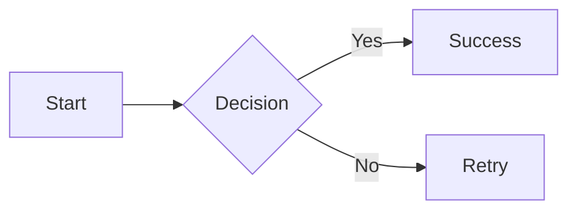
```

**GitLab** similarly supports Mermaid in:
- Markdown files (`.md`)
- Issues, merge requests, and epics
- Snippets
- Wiki pages

**Bitbucket** supports Mermaid in Markdown files using ` ```mermaid ` blocks.

**Notion** supports `/mermaid` command to embed diagrams.

**Obsidian** supports Mermaid natively in Markdown preview.

---

## 6.3 Flowcharts

### Overview

Flowcharts are the most commonly used diagram type in Mermaid. They visualize processes, workflows, algorithms, and decision trees using connected nodes.

### Direction (Graph Orientation)

The direction of a flowchart is specified immediately after the `graph` or `flowchart` keyword:

| Keyword | Direction |
|---------|-----------|
| `TB` | Top to Bottom |
| `TD` | Top to Down (alias for TB) |
| `BT` | Bottom to Top |
| `LR` | Left to Right |
| `RL` | Right to Left |

Mermaid supports both `graph` and `flowchart` keywords. The `flowchart` keyword is preferred for new diagrams as it provides more features.

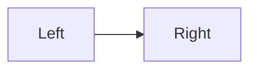

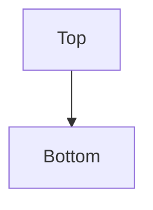

### Node Shapes

Mermaid supports a rich variety of node shapes:

| Shape | Syntax | Description |
|-------|--------|-------------|
| Rectangle | `A[text]` | Standard process box |
| Rounded | `A(text)` | Rounded corners |
| Stadium | `A([text])` | Pill-shaped (stadium) |
| Subroutine | `A[[text]]` | Double-lined rectangle |
| Cylinder | `A[(text)]` | Database/cylinder shape |
| Circle | `A((text))` | Circular node |
| Double Circle | `A(((text)))` | Double circle |
| Diamond | `A{text}` | Decision node |
| Hexagon | `A{{text}}` | Hexagonal shape |
| Parallelogram | `A[/text/]` | Parallelogram (slanted right) |
| Parallelogram Alt | `A[\text\]` | Parallelogram (slanted left) |
| Trapezoid | `A[/text\]` | Trapezoid (top wider) |
| Trapezoid Alt | `A[\text/]` | Trapezoid (bottom wider) |
| Asymmetric | `A>text]` | Asymmetric shape (flag) |

**Examples:**

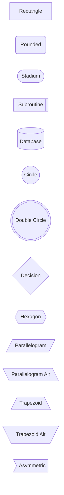

### Links and Arrows

Mermaid provides several link styles:

| Link | Syntax | Description |
|------|--------|-------------|
| Arrow | `A-->B` | Directed arrow |
| Open link | `A---B` | Line without arrowhead |
| Text on arrow | `A-- text -->B` | Arrow with label text |
| Text on link | `A---|text|B` | Label on open link |
| Dotted arrow | `A-.->B` | Dashed directed arrow |
| Dotted link | `A-.-B` | Dashed undirected link |
| Dotted with text | `A-. text .->B` | Dashed arrow with label |
| Thick arrow | `A==>B` | Bold directed arrow |
| Thick link | `A===B` | Bold undirected link |
| Thick with text | `A== text ==>B` | Bold arrow with label |

**Examples:**

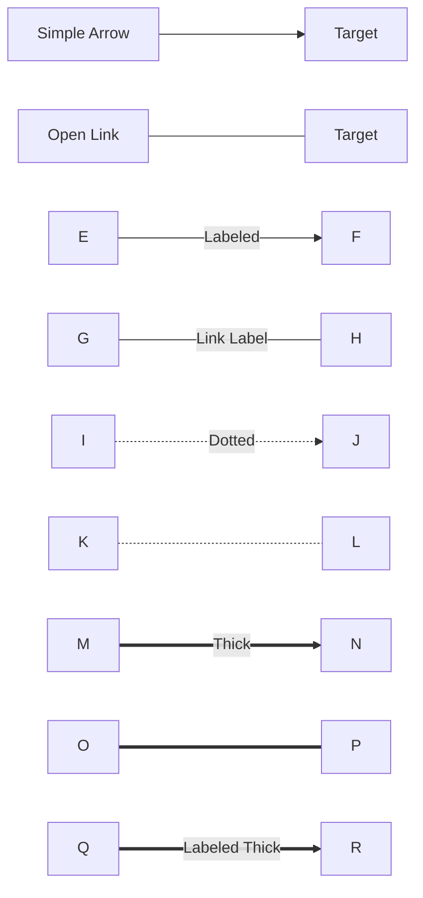

### Multi-Character Arrows and Chain Links

Arrows can have multiple characters to indicate different relationship types:

```mermaid
flowchart LR
    A --o B[Crow's Foot 0]
    C --x D[Crow's Foot X]
    E --|F| F[One to One]
```

Nodes can be chained without repeating the source:

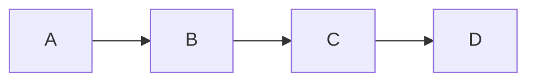

This is equivalent to:


### Subgraphs

Subgraphs group related nodes into visual containers with optional labels:

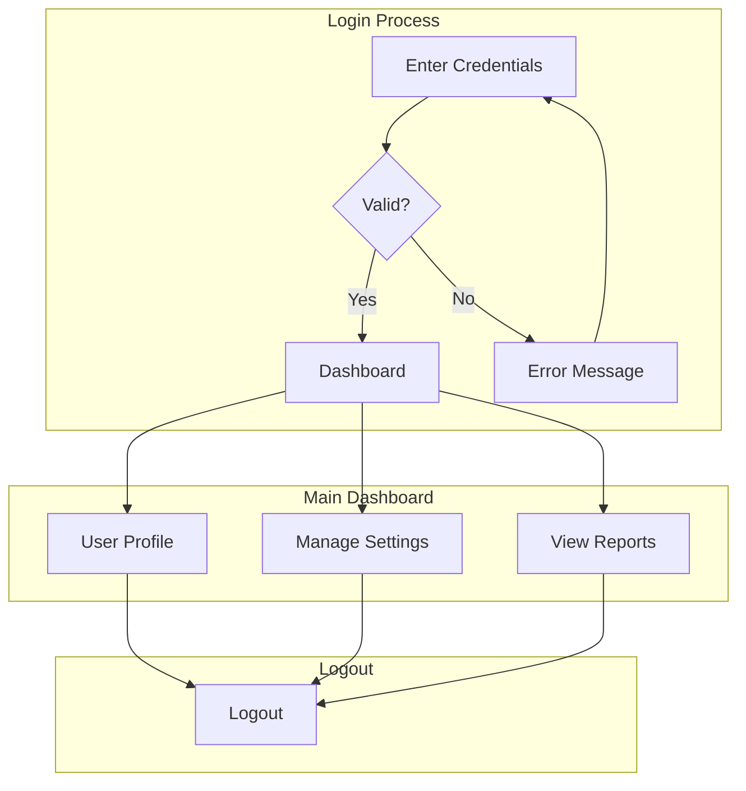

Subgraphs can be styled individually using `%%{init}` configuration or by applying styles within the subgraph.

### Styling Nodes

#### Inline Styles

Use the `style` keyword to apply inline CSS properties to specific nodes:

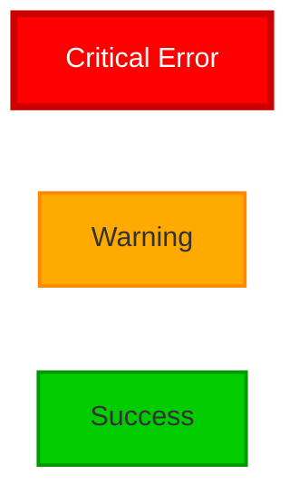

Available style properties:

- `fill` — Background color
- `stroke` — Border color
- `stroke-width` — Border thickness
- `color` — Text color
- `font-family` — Font family
- `font-size` — Font size
- `font-weight` — Font weight
- `line-height` — Line height
- `text-anchor` — Text alignment (start, middle, end)
- `shape` — Node shape override

#### Class Definitions

For reusable styles, use `classDef` and `class`:

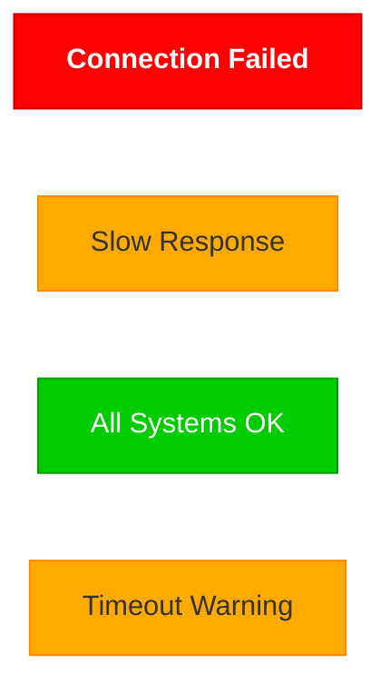

You can also apply classes inline:

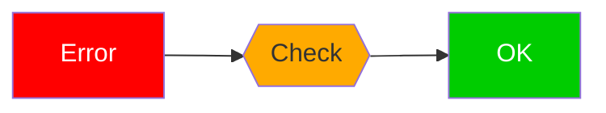

### Click Events

Mermaid supports clickable nodes with linkable URLs:

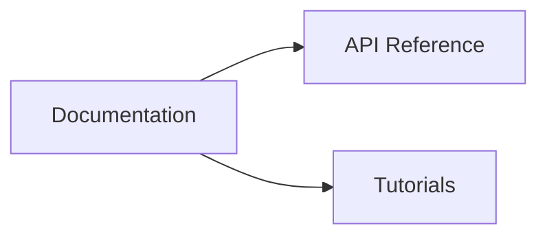

Click events can also trigger JavaScript functions:

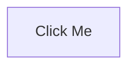

### Real-World Flowchart Examples

#### Example 1: CI/CD Pipeline

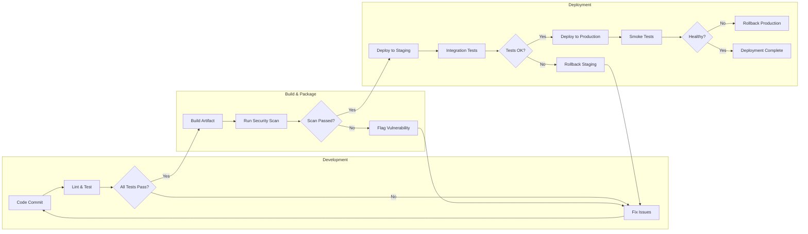

#### Example 2: User Authentication Flow

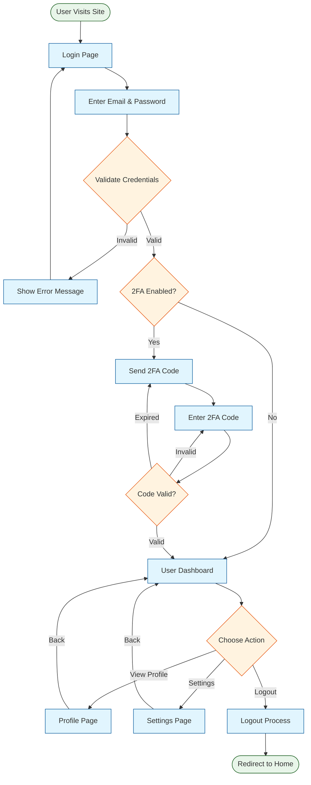

#### Example 3: E-Commerce Order Processing

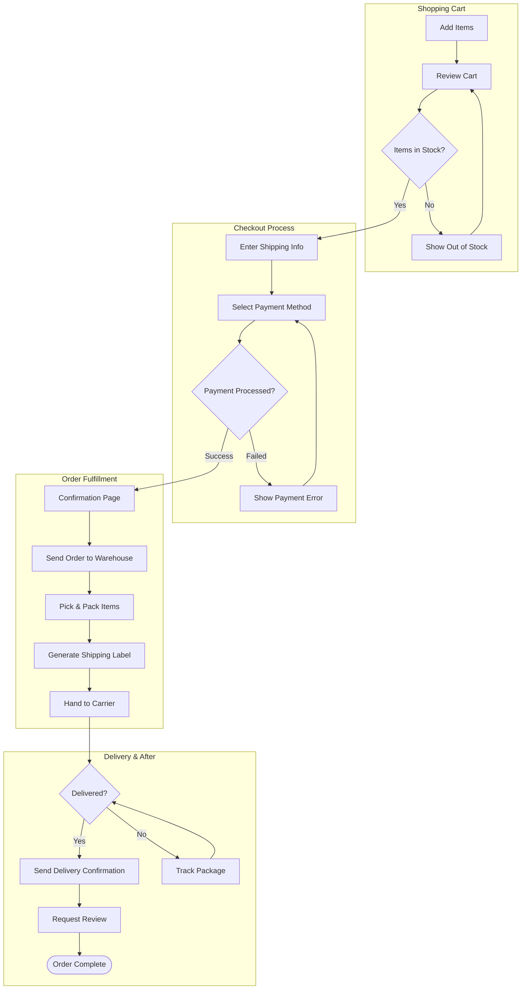

#### Example 4: Algorithm Visualization — Binary Search

```mermaid
flowchart TD
    Start([Start]) --> Input[Sorted Array A, Target T]
    Input --> Init[Set low = 0, high = len A - 1]
    Init --> Loop{low <= high?}
    
    Loop -->|No| NotFound([Return -1: Not Found])
    
    Loop -->|Yes| Mid[Set mid = low + high - low / 2]
    Mid --> Compare{A[mid] vs T}
    
    Compare -->|Equals| Found([Return mid: Found!])
    Compare -->|Less Than| Right[Set low = mid + 1]
    Compare -->|Greater Than| Left[Set high = mid - 1]
    
    Right --> Loop
    Left --> Loop
```

---

## 6.4 Sequence Diagrams

### Overview

Sequence diagrams model interactions between participants over time. They show the sequence of messages exchanged between objects, actors, or systems. Sequence diagrams are invaluable for documenting APIs, communication protocols, and multi-step processes.

### Participants

Participants represent the entities that interact in the sequence:

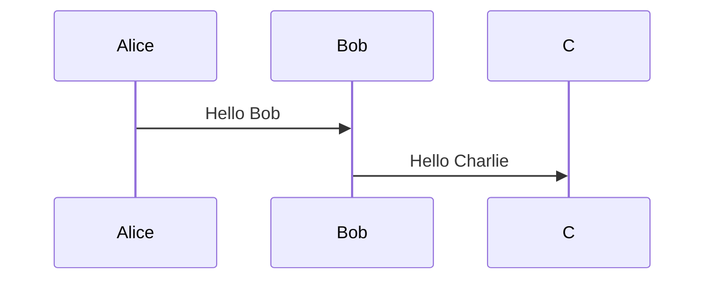

| Syntax | Description |
|--------|-------------|
| `participant Name` | Declares a participant with given name |
| `participant Name as Alias` | Declares with display alias |
| `actor Name` | Creates an actor (stick figure) |
| `actor/ Name` | Creates a hollow actor |
| `actor Name as Alias` | Actor with display alias |

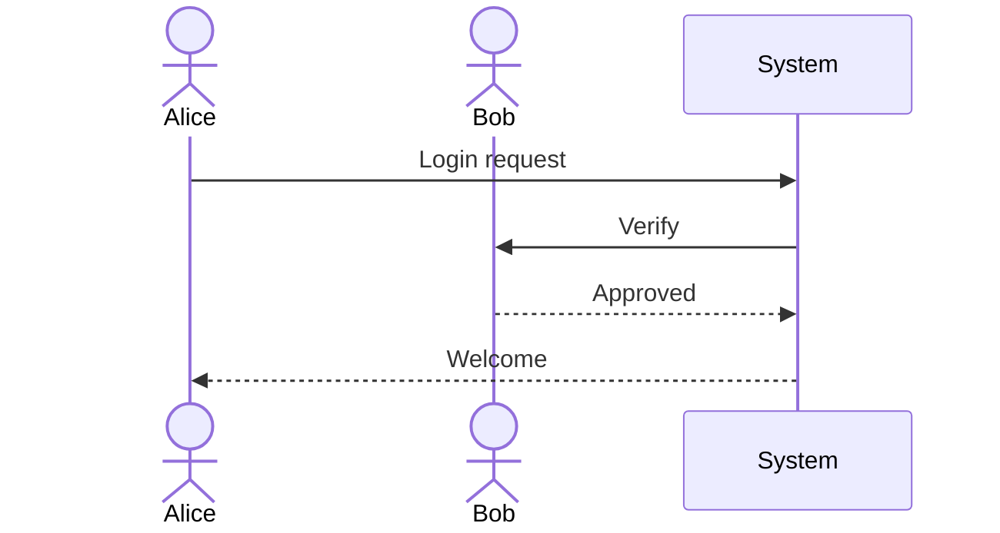

### Messages

Messages define the communication between participants:

| Syntax | Description |
|--------|-------------|
| `->` | Solid line without arrow |
| `-->` | Dotted line without arrow |
| `->>` | Solid line with arrow |
| `-->>` | Dotted line with arrow |
| `-x` | Solid line with cross at end |
| `--x` | Dotted line with cross at end |
| `-)` | Solid line with open arrow |
| `--)` | Dotted line with open arrow |

```mermaid
sequenceDiagram
    participant A as Sender
    participant B as Receiver
    
    A->B: Solid line, no arrow
    A-->B: Dotted line, no arrow
    A->>B: Solid line, arrow
    A-->>B: Dotted line, arrow
    A-xB: Solid line, cross
    A--xB: Dotted line, cross
    A-)B: Solid line, open arrow
    A--)B: Dotted line, open arrow
```

### Activation Boxes

Activation boxes indicate when a participant is actively processing:

```mermaid
sequenceDiagram
    participant Client
    participant Server
    participant Database
    
    Client->>Server: Request Data
    activate Server
    Server->>Database: Query
    activate Database
    Database-->>Server: Results
    deactivate Database
    Server-->>Client: Response Data
    deactivate Server
```

You can also nest activations:

```mermaid
sequenceDiagram
    participant A
    participant B
    participant C
    
    A->>B: Process
    activate B
    B->>B: Self-call
    B->>C: Sub-process
    activate C
    C-->>B: Done
    deactivate C
    B-->>A: Complete
    deactivate B
```

### Notes

Notes add explanatory text to sequence diagrams:

```mermaid
sequenceDiagram
    participant Alice
    participant Bob
    
    Note over Alice,Bob: Initial handshake
    Alice->>Bob: Hello
    Note right of Bob: Bob responds
    Bob-->>Alice: Hi there!
    Note left of Alice: Alice is happy
    Alice->>Bob: How are you?
```

| Syntax | Description |
|--------|-------------|
| `Note left of Participant: Text` | Note to the left |
| `Note right of Participant: Text` | Note to the right |
| `Note over Participant1,Participant2: Text` | Note spanning participants |

### Loops

Loops repeat a sequence of messages:

```mermaid
sequenceDiagram
    participant Client
    participant Server
    
    Client->>Server: Initial Request
    
    loop Retry up to 3 times
        Server-->>Client: 503 Service Unavailable
        Client->>Client: Wait 1 second
        Client->>Server: Retry Request
    end
    
    Server-->>Client: 200 OK
```

### Alt/Opt (Conditional Paths)

Alt blocks represent alternative paths (if/else):

```mermaid
sequenceDiagram
    participant User
    participant System
    participant Payment
    
    User->>System: Purchase Item
    
    alt Sufficient Balance
        System->>Payment: Process Payment
        Payment-->>System: Success
        System-->>User: Purchase Confirmed
    else Insufficient Balance
        System-->>User: Insufficient Funds
        System-->>User: Suggest Payment Method
    end
```

Opt blocks represent optional paths:

```mermaid
sequenceDiagram
    participant User
    participant App
    
    User->>App: Login
    
    opt Remember Me
        App->>App: Generate Token
        App->>App: Store Cookie
    end
    
    App-->>User: Logged In
```

### Parallel Processing

Par blocks show parallel message flows:

```mermaid
sequenceDiagram
    participant Client
    participant Cache
    participant Database
    
    Client->>Cache: Request Data
    
    par Cache Lookup
        Cache-->>Client: Cache Hit
    and Database Query
        Database-->>Cache: Update Cache
    end
```

### Break Conditions

Break blocks interrupt the normal flow on a condition:

```mermaid
sequenceDiagram
    participant Client
    participant Server
    
    Client->>Server: Submit Order
    
    break Order Exceeds Credit Limit
        Server-->>Client: Order Rejected
    end
    
    Server-->>Client: Order Accepted
```

### Critical Sections

Critical blocks with optional recovery paths:

```mermaid
sequenceDiagram
    participant App
    participant PaymentGateway
    
    critical Payment Processing
        App->>PaymentGateway: Charge Card
        PaymentGateway-->>App: Confirmation
    option Timeout
        App-->>App: Log Timeout
        App->>PaymentGateway: Retry
    option Network Error
        App-->>App: Log Error
        App-->>User: Show Error Message
    end
```

### Styling Sequence Diagrams

Sequence diagrams can be styled using the `%%{init}` configuration block:

```mermaid
%%{init: {'sequence': {'actorFontSize': 14, 'actorFontFamily': 'Arial', 'noteFontSize': 12, 'messageFontSize': 12, 'actorFontWeight': 'bold', 'width': 800, 'height': 400, 'mirrorActors': false}}}%%
sequenceDiagram
    actor Alice
    actor Bob
    
    Alice->>Bob: Styled Message
    Bob-->>Alice: Styled Response
    Note over Alice,Bob: Styled Note
```

### Real-World Sequence Diagram Examples

#### Example 1: OAuth 2.0 Authorization Code Flow

```mermaid
sequenceDiagram
    participant User
    participant Browser
    participant App as Client App
    participant Auth as Authorization Server
    participant API as Resource Server
    
    User->>Browser: Click "Login with Provider"
    Browser->>App: Initiate Login
    App->>Browser: Redirect to Auth Server
    
    Browser->>Auth: GET /authorize?response_type=code
    
    alt User Not Logged In
        Auth->>User: Login Page
        User->>Auth: Enter Credentials
    end
    
    Auth->>User: Consent Screen
    User->>Auth: Approve
    
    Auth->>Browser: Redirect with Authorization Code
    Browser->>App: GET /callback?code=xyz
    
    App->>Auth: POST /token (code + client_secret)
    activate Auth
    Auth-->>App: Access Token + Refresh Token
    deactivate Auth
    
    App->>API: GET /resource (Bearer token)
    activate API
    API-->>App: Protected Resource
    deactivate API
    
    App-->>Browser: Display Data
    Browser-->>User: Show Page
    
    Note over App,API: Subsequent requests use refresh token
```

#### Example 2: Distributed Transaction (Saga Pattern)

```mermaid
sequenceDiagram
    participant Client
    participant Orchestrator
    participant ServiceA as Order Service
    participant ServiceB as Payment Service
    participant ServiceC as Inventory Service
    participant ServiceD as Notification Service
    
    Client->>Orchestrator: Create Order
    
    Orchestrator->>ServiceA: Create Order
    activate ServiceA
    ServiceA-->>Orchestrator: Order Created (ID: 123)
    deactivate ServiceA
    
    Orchestrator->>ServiceB: Process Payment ($50)
    activate ServiceB
    ServiceB-->>Orchestrator: Payment Success
    
    alt Payment Failed
        ServiceB-->>Orchestrator: Payment Failed
        Orchestrator->>ServiceA: Compensate: Cancel Order
        Orchestrator-->>Client: Order Failed
    end
    
    deactivate ServiceB
    
    Orchestrator->>ServiceC: Reserve Inventory
    activate ServiceC
    ServiceC-->>Orchestrator: Inventory Reserved
    
    alt Inventory Unavailable
        ServiceC-->>Orchestrator: Out of Stock
        Orchestrator->>ServiceB: Compensate: Refund
        Orchestrator->>ServiceA: Compensate: Cancel Order
        Orchestrator-->>Client: Out of Stock
    end
    
    deactivate ServiceC
    
    Orchestrator->>ServiceD: Send Confirmation
    activate ServiceD
    ServiceD-->>Orchestrator: Notification Sent
    deactivate ServiceD
    
    Orchestrator-->>Client: Order Confirmed
```

#### Example 3: API Rate Limiting

```mermaid
sequenceDiagram
    participant Client
    participant Gateway
    participant RateLimiter
    participant Backend
    
    Client->>Gateway: GET /api/data
    Gateway->>RateLimiter: Check Rate Limit
    
    alt Within Limit
        RateLimiter-->>Gateway: 9/10 remaining
        Gateway->>Backend: Forward Request
        Backend-->>Gateway: Response Data
        Gateway-->>Client: 200 OK
        Note over Gateway,Client: X-RateLimit-Remaining: 9
    else Rate Exceeded
        RateLimiter-->>Gateway: 0/10 remaining
        Gateway-->>Client: 429 Too Many Requests
        Note over Gateway,Client: Retry-After: 60
    end
    
    Client->>Client: Wait 60 seconds
    
    Client->>Gateway: GET /api/data
    Gateway->>RateLimiter: Check Rate Limit
    
    RateLimiter-->>Gateway: 10/10 remaining
    Gateway->>Backend: Forward Request
    Backend-->>Gateway: Response Data
    Gateway-->>Client: 200 OK
```

#### Example 4: Microservices Health Check

```mermaid
sequenceDiagram
    participant Monitor as Health Monitor
    participant Registry as Service Registry
    participant ServiceA as Auth Service
    participant ServiceB as Data Service
    participant ServiceC as Cache Service
    participant Alert as Alerting System
    
    loop Every 30 seconds
        Monitor->>Registry: Get Healthy Endpoints
        Registry-->>Monitor: [service-a, service-b, service-c]
        
        par Health Checks
            Monitor->>ServiceA: GET /health
            Monitor->>ServiceB: GET /health
            Monitor->>ServiceC: GET /health
        end
        
        alt All Services Healthy
            ServiceA-->>Monitor: 200 OK
            ServiceB-->>Monitor: 200 OK
            ServiceC-->>Monitor: 200 OK
            Monitor-->>Monitor: Log Healthy
        else Service B Unhealthy
            ServiceA-->>Monitor: 200 OK
            ServiceB-->>Monitor: 503 Unhealthy
            ServiceC-->>Monitor: 200 OK
            Monitor->>Alert: Service B Unhealthy
            Alert->>Alert: Send PagerDuty Alert
            Monitor->>Registry: Deregister Service B
        end
    end
```

---

## 6.5 Class Diagrams

### Overview

Class diagrams model the structure of object-oriented systems. They show classes, their attributes, methods, and the relationships between classes. Class diagrams are essential for documenting software architecture, design patterns, and domain models.

### Defining Classes

Classes are defined using the `class` keyword:

```mermaid
classDiagram
    class Animal {
        +String name
        +int age
        +makeSound() void
        +move() void
    }
    
    class Dog {
        +String breed
        +fetch() void
        +bark() void
    }
    
    class Cat {
        +String color
        +purr() void
        +scratch() void
    }
```

### Visibility Modifiers

Mermaid supports standard UML visibility notation:

| Symbol | Visibility | Meaning |
|--------|------------|---------|
| `+` | Public | Accessible from anywhere |
| `-` | Private | Only accessible within the class |
| `#` | Protected | Accessible within the class and subclasses |
| `~` | Package | Accessible within the same package |

### Attributes and Methods

Attributes and methods follow the UML syntax:

```
visibility name : type
visibility name(type) returnType
visibility name(type1, type2) returnType
```

```mermaid
classDiagram
    class User {
        -int id
        -String username
        -String email
        -String passwordHash
        +String getUsername()
        +String getEmail()
        -String hashPassword(String password)
        +bool authenticate(String password)
        +void updateProfile(String email)
    }
```

### Class Relationships

Mermaid supports standard UML relationship types:

| Relationship | Syntax | Description |
|-------------|--------|-------------|
| Inheritance | `<|--` | "is-a" relationship (extends) |
| Composition | `*--` | Strong ownership (part-of, same lifetime) |
| Aggregation | `o--` | Weak ownership (has-a) |
| Association | `-->` | Simple link between classes |
| Realization | `..|>` | Interface implementation |
| Dependency | `..>` | Temporary/usage relationship |
| Link (solid) | `--` | Solid link |
| Link (dashed) | `..` | Dashed link |

**Labels and Multiplicity:**

```mermaid
classDiagram
    class Customer {
        -String name
        -String email
        +placeOrder() Order
    }
    
    class Order {
        -int orderId
        -Date orderDate
        -double total
        +calculateTotal() void
    }
    
    class Product {
        -int productId
        -String name
        -double price
        +getPrice() double
    }
    
    class Payment {
        -double amount
        -String method
        +process() bool
    }
    
    Customer "1" --> "0..*" Order : places
    Order "1" --> "1..*" Product : contains
    Order "1" --> "0..1" Payment : has
```

Multiplicity notation:

| Notation | Meaning |
|----------|---------|
| `1` | Exactly one |
| `0..1` | Zero or one |
| `0..*` or `*` | Zero or more |
| `1..*` | One or more |
| `n` | Exactly n |
| `n..m` | Between n and m |

### Generics

Generics (template parameters) are defined using `~`:

```mermaid
classDiagram
    class List~T~ {
        +void add(T element)
        +T get(int index)
        +int size()
        +bool isEmpty()
    }
    
    class Dictionary~K,V~ {
        +void put(K key, V value)
        +V get(K key)
        +bool containsKey(K key)
    }
```

### Annotations (Stereotypes)

Annotations add metadata about class nature:

```mermaid
classDiagram
    class UserService {
        <<interface>>
        +User getUser(int id)
        +List~User~ getAllUsers()
        +void saveUser(User user)
    }
    
    class UserServiceImpl {
        <<service>>
        -UserRepository repository
        +User getUser(int id)
        +List~User~ getAllUsers()
        +void saveUser(User user)
    }
    
    class AbstractUser {
        <<abstract>>
        -int id
        -String name
        +abstract void validate()
    }
    
    UserServiceImpl ..|> UserService : implements
    UserServiceImpl --> UserRepository : uses
    UserServiceImpl --> User : creates
```

### Namespaces

Namespaces group related classes:

```mermaid
classDiagram
    namespace Models {
        class User {
            +int id
            +String name
        }
        
        class Product {
            +int id
            +String name
            +double price
        }
        
        class Order {
            +int id
            +Date date
        }
    }
    
    namespace Services {
        class UserService
        class ProductService
        class OrderService
    }
    
    namespace Repositories {
        class UserRepository
        class ProductRepository
    }
    
    UserService --> User : manages
    UserService --> UserRepository : uses
    ProductService --> Product : manages
    OrderService --> Order : manages
```

### Styling Class Diagrams

```mermaid
%%{init: {'themeVariables': {'classText': '#333333', 'classTextColor': '#333333'}, 'class': {'nodeSpacing': 50, 'rankSpacing': 30}}}%%
classDiagram
    class Vehicle {
        <<abstract>>
        -String licensePlate
        -String brand
        +void start()
        +void stop()
        +abstract void refuel()
    }
    
    class Car {
        -int doors
        +void openTrunk()
        +void refuel()
    }
    
    class Motorcycle {
        -bool hasSidecar
        +void wheelie()
        +void refuel()
    }
    
    Car --|> Vehicle : extends
    Motorcycle --|> Vehicle : extends
```

### Real-World Class Diagram Examples

#### Example 1: E-Commerce Domain Model

```mermaid
classDiagram
    class User {
        <<entity>>
        -UUID id
        -String email
        -String passwordHash
        -String firstName
        -String lastName
        -Address shippingAddress
        -Date createdAt
        -Date updatedAt
        +bool authenticate(String password)
        +void updateProfile(String firstName, String lastName)
        +void changePassword(String oldPassword, String newPassword)
        +List~Order~ getOrderHistory()
    }
    
    class Order {
        <<entity>>
        -UUID orderId
        -UUID userId
        -Date orderDate
        -OrderStatus status
        -double subtotal
        -double tax
        -double shipping
        -double total
        +void addItem(Product product, int quantity)
        +void removeItem(SKU sku)
        +double calculateTotal()
        +Payment processPayment(PaymentMethod method)
        +void cancel()
    }
    
    class OrderItem {
        <<entity>>
        -UUID orderId
        -UUID productId
        -int quantity
        -double unitPrice
        -double lineTotal
        +double calculateLineTotal()
    }
    
    class Product {
        <<entity>>
        -UUID productId
        -String name
        -String description
        -double price
        -Category category
        -int stockQuantity
        +void updateStock(int quantity)
        +bool isInStock()
        +double getDiscountedPrice(Coupon coupon)
    }
    
    class Category {
        <<entity>>
        -UUID categoryId
        -String name
        -String description
        -Category parentCategory
        +List~Product~ getProducts()
        +List~Category~ getSubcategories()
    }
    
    class Payment {
        <<entity>>
        -UUID paymentId
        -UUID orderId
        -PaymentMethod method
        -PaymentStatus status
        -double amount
        -Date processedAt
        +bool process()
        +void refund()
    }
    
    class ShoppingCart {
        <<entity>>
        -UUID cartId
        -UUID userId
        -Date createdAt
        -Date updatedAt
        -List~CartItem~ items
        +void addItem(Product product, int quantity)
        +void removeItem(SKU sku)
        +void updateQuantity(SKU sku, int quantity)
        +void clear()
        +Order checkout()
        +double calculateTotal()
    }
    
    class CartItem {
        <<entity>>
        -UUID cartItemId
        -UUID productId
        -int quantity
        -Date addedAt
        +double getSubtotal()
    }
    
    class Review {
        <<entity>>
        -UUID reviewId
        -UUID userId
        -UUID productId
        -int rating
        -String title
        -String body
        -Date createdAt
        +bool isVerifiedPurchase()
    }
    
    class Address {
        <<value-object>>
        -String street
        -String city
        -String state
        -String zipCode
        -String country
        +String getFullAddress()
    }
    
    User "1" --> "0..*" Order : places
    User "1" --> "1" ShoppingCart : has
    User "1" --> "1" Address : has
    User "1" --> "0..*" Review : writes
    Order "1" --> "1..*" OrderItem : contains
    Order "1" --> "0..1" Payment : has
    OrderItem "1" --> "1" Product : references
    Product "1" --> "0..1" Category : belongs to
    Product "1" --> "0..*" Review : receives
    ShoppingCart "1" --> "0..*" CartItem : contains
    CartItem "1" --> "1" Product : references
    Category "1" --> "0..*" Category : has subcategories
```

#### Example 2: Design Pattern — Observer Pattern

```mermaid
classDiagram
    class Subject {
        <<interface>>
        +void attach(Observer observer)
        +void detach(Observer observer)
        +void notifyObservers()
    }
    
    class Observer {
        <<interface>>
        +void update(Subject subject)
    }
    
    class ConcreteSubject {
        -List~Observer~ observers
        -State state
        +State getState()
        +void setState(State state)
        +void attach(Observer observer)
        +void detach(Observer observer)
        +void notifyObservers()
    }
    
    class ConcreteObserverA {
        -State observerState
        +void update(Subject subject)
    }
    
    class ConcreteObserverB {
        -State observerState
        +void update(Subject subject)
    }
    
    Subject <|.. ConcreteSubject : implements
    Observer <|.. ConcreteObserverA : implements
    Observer <|.. ConcreteObserverB : implements
    ConcreteSubject o--> Observer : observers
    ConcreteObserverA --> ConcreteSubject : subscribes to
    ConcreteObserverB --> ConcreteSubject : subscribes to
```

---

## 6.6 State Diagrams

### Overview

State diagrams model the states of a system, object, or component and the transitions between those states. They are particularly useful for modeling finite state machines, workflow states, lifecycle management, and protocol states.

### Basic States and Transitions

```mermaid
stateDiagram-v2
    [*] --> Idle
    Idle --> Processing : start
    Processing --> Completed : finish
    Processing --> Error : fail
    Completed --> [*]
    Error --> Idle : retry
```

The `[*]` symbol represents the initial state (start) and final state (end).

### State Descriptions and Aliases

States can have descriptive labels with aliases:

```mermaid
stateDiagram-v2
    state "System Initializing" as Init
    state "Ready for Requests" as Ready
    state "Processing Request" as Processing
    state "Request Completed" as Done
    
    [*] --> Init
    Init --> Ready : initialization complete
    Ready --> Processing : request received
    Processing --> Done : processing finished
    Processing --> Ready : error, reset
    Done --> Ready : next request
```

### Composite States

States can contain nested substates:

```mermaid
stateDiagram-v2
    [*] --> Active
    
    state Active {
        [*] --> Idle
        
        state Idle
        
        state Processing {
            [*] --> Validating
            
            state Validating
            state Executing
            state Saving
            
            Validating --> Executing : valid
            Validating --> Idle : invalid
            Executing --> Saving : complete
            Saving --> Idle : saved
        }
        
        Idle --> Processing : start
    }
    
    Active --> Archived : deactivate
    Archived --> Active : reactivate
    Archived --> Deleted : purge
    Deleted --> [*]
```

### Forks and Joins

Forks split a single transition into multiple concurrent paths. Joins synchronize multiple paths into one:

```mermaid
stateDiagram-v2
    state fork_state <<fork>>
    state join_state <<join>>
    
    [*] --> Start
    Start --> fork_state
    
    fork_state --> Thread1
    fork_state --> Thread2
    fork_state --> Thread3
    
    Thread1 --> join_state
    Thread2 --> join_state
    Thread3 --> join_state
    
    join_state --> Completed
    Completed --> [*]
```

### Choice Nodes

Choice nodes represent conditional branching:

```mermaid
stateDiagram-v2
    state choice_state <<choice>>
    
    [*] --> Evaluate
    Evaluate --> choice_state
    
    choice_state --> Approved : score >= 70
    choice_state --> Review : score >= 50 & score < 70
    choice_state --> Rejected : score < 50
    
    Approved --> Processed([*])
    Review --> Escalate([Manual Review])
    Rejected --> Notified([*])
```

### Notes in State Diagrams

```mermaid
stateDiagram-v2
    [*] --> Draft
    
    state Draft
    state Published
    state Archived
    
    Note right of Draft : Initial content state\nUser can edit freely
    Note left of Published : Content visible\nto all users
    
    Draft --> Published : submit for review
    Published --> Archived : expiry reached
    Published --> Draft : recall
    Archived --> Draft : republish
```

### Real-World State Diagram Examples

#### Example 1: Order Lifecycle

```mermaid
stateDiagram-v2
    [*] --> Pending
    
    state Pending {
        [*] --> AwaitingPayment
        AwaitingPayment --> PaymentReceived : payment confirmed
        AwaitingPayment --> Cancelled : timeout/cancel
    }
    
    state Processing {
        [*] --> Confirmed
        Confirmed --> Packing : warehouse assigned
        Packing --> Shipped : handed to carrier
    }
    
    state Delivery {
        [*] --> InTransit
        InTransit --> Delivered : confirmed delivery
        InTransit --> FailedDelivery : address issue
        FailedDelivery --> InTransit : rescheduled
    }
    
    state PostDelivery {
        [*] --> Completed
        Completed --> ReturnRequested : customer initiates return
        ReturnRequested --> RefundIssued : return accepted
        ReturnRequested --> Rejected : return denied
    }
    
    Pending --> Processing : payment success
    Pending --> Cancelled : payment failed
    Processing --> Delivery : shipped
    Delivery --> PostDelivery : delivered
    PostDelivery --> [*]
    Cancelled --> [*]
```

#### Example 2: TCP Connection State Machine

```mermaid
stateDiagram-v2
    [*] --> CLOSED
    
    state CLOSED
    state LISTEN
    state SYN_SENT
    state SYN_RCVD
    state ESTABLISHED
    
    state FIN_WAIT {
        [*] --> FIN_WAIT_1
        FIN_WAIT_1 --> FIN_WAIT_2 : ACK received
    }
    
    state CLOSE_WAIT
    state LAST_ACK
    state TIME_WAIT
    
    CLOSED --> LISTEN : passive open
    CLOSED --> SYN_SENT : active open
    LISTEN --> SYN_RCVD : SYN received
    LISTEN --> CLOSED : close
    SYN_SENT --> ESTABLISHED : SYN+ACK received
    SYN_SENT --> CLOSED : close
    SYN_RCVD --> ESTABLISHED : ACK received
    SYN_RCVD --> CLOSED : close
    ESTABLISHED --> FIN_WAIT_1 : close (active)
    ESTABLISHED --> CLOSE_WAIT : FIN received (passive)
    FIN_WAIT_1 --> FIN_WAIT_2 : ACK received
    FIN_WAIT_1 --> CLOSED : ACK+FIN received
    FIN_WAIT_2 --> TIME_WAIT : FIN received
    CLOSE_WAIT --> LAST_ACK : close
    LAST_ACK --> CLOSED : ACK received
    TIME_WAIT --> CLOSED : timeout
```

#### Example 3: User Account Lifecycle

```mermaid
stateDiagram-v2
    [*] --> Unverified
    
    state Unverified {
        [*] --> AwaitingEmail
        AwaitingEmail --> AwaitingEmail : resend verification
    }
    
    state Verified {
        [*] --> Active
        Active --> Suspended : unusual activity
        Active --> Locked : max login attempts
        Suspended --> Active : admin review
        Suspended --> Banned : policy violation
    }
    
    state Locked {
        [*] --> LockedTemporary
        LockedTemporary --> Active : password reset
        LockedTemporary --> LockedPermanent : admin action
    }
    
    state Archived {
        [*] --> Inactive
        Inactive --> Active : user reactivates
    }
    
    Unverified --> Verified : email confirmed
    Unverified --> Archived : never verified (30 days)
    Verified --> Archived : account deletion request
    Verified --> Archived : 2 years inactive
    Locked --> Archived : 1 year inactive
    Archived --> [*] : permanent deletion (90 days)
```

---

## 6.7 Entity Relationship Diagrams

### Overview

Entity Relationship Diagrams (ERDs) model data entities, their attributes, and the relationships between them. They are essential for database design, data modeling, and system architecture documentation.

### Basic Syntax

ERDs begin with the `erDiagram` keyword:

```mermaid
erDiagram
    CUSTOMER ||--o{ ORDER : places
    ORDER ||--|{ ORDER_ITEM : contains
    PRODUCT ||--o{ ORDER_ITEM : includes
    PRODUCT ||--|| CATEGORY : belongs_to
```

### Entities and Attributes

Entities are defined with their attributes. Key attributes can be marked:

```mermaid
erDiagram
    USER {
        int id PK
        string username UK
        string email UK
        string password_hash
        string first_name
        string last_name
        date created_at
        date updated_at
        boolean is_active
    }
    
    ORDER {
        int id PK
        int user_id FK
        date order_date
        decimal total_amount
        string status
        string shipping_address
        date created_at
    }
    
    PRODUCT {
        int id PK
        string sku UK
        string name
        string description
        decimal price
        int stock_quantity
        int category_id FK
        date created_at
    }
```

### Relationship Cardinalities

| Syntax | Cardinality |
|--------|-------------|
| `||--||` | One and only one (exactly one) |
| `||--o|` | One and only one to one or zero |
| `||--|{` | One and only one to one or more |
| `||--o{` | One and only one to zero or more |
| `|o--||` | Zero or one to one and only one |
| `|o--o|` | Zero or one to zero or one |
| `|o--|{` | Zero or one to one or more |
| `|o--o{` | Zero or one to zero or more |
| `|{--||` | One or more to one and only one |
| `|{--o|` | One or more to zero or one |
| `|{--|{` | One or more to one or more |
| `|{--o{` | One or more to zero or more |
| `o{--o{` | Zero or more to zero or more |

### Real-World ERD Examples

#### Example 1: E-Commerce Database

```mermaid
erDiagram
    CUSTOMER ||--o{ ORDER : places
    CUSTOMER ||--o{ REVIEW : writes
    CUSTOMER ||--o{ ADDRESS : has
    CUSTOMER }o--o{ COUPON : uses
    ORDER ||--|{ ORDER_ITEM : contains
    ORDER ||--o| PAYMENT : has
    ORDER ||--o| SHIPMENT : has
    ORDER_ITEM }|--|| PRODUCT : includes
    PRODUCT }|--|| CATEGORY : belongs_to
    PRODUCT ||--o{ REVIEW : receives
    PRODUCT ||--o{ INVENTORY : tracks
    PRODUCT }o--o{ COUPON : eligible_for
    CATEGORY ||--o{ CATEGORY : has_subcategory
    
    CUSTOMER {
        int id PK
        string email UK
        string password_hash
        string first_name
        string last_name
        string phone
        date registered_at
        date last_login
        boolean is_verified
    }
    
    ADDRESS {
        int id PK
        int customer_id FK
        string label
        string street
        string city
        string state
        string zip_code
        string country
        boolean is_default
    }
    
    ORDER {
        int id PK
        string order_number UK
        int customer_id FK
        int shipping_address_id FK
        int billing_address_id FK
        date ordered_at
        string status
        decimal subtotal
        decimal tax_amount
        decimal shipping_amount
        decimal discount_amount
        decimal total_amount
        string currency
        string notes
    }
    
    ORDER_ITEM {
        int id PK
        int order_id FK
        int product_id FK
        int quantity
        decimal unit_price
        decimal line_total
    }
    
    PRODUCT {
        int id PK
        string sku UK
        string name
        string slug UK
        string description
        decimal price
        decimal cost
        int category_id FK
        string image_url
        decimal weight
        string dimensions
        boolean is_active
        date created_at
        date updated_at
    }
    
    CATEGORY {
        int id PK
        string name
        string slug UK
        string description
        int parent_id FK
        int sort_order
        string image_url
        boolean is_active
    }
    
    INVENTORY {
        int id PK
        int product_id FK
        int warehouse_id FK
        int quantity
        int reserved_quantity
        int reorder_point
        int reorder_quantity
        date last_counted_at
    }
    
    PAYMENT {
        int id PK
        int order_id FK
        string transaction_id UK
        string payment_method
        decimal amount
        string currency
        string status
        date processed_at
        string gateway_response
    }
    
    SHIPMENT {
        int id PK
        int order_id FK
        string tracking_number UK
        string carrier
        string service_level
        decimal shipping_cost
        date shipped_at
        date estimated_delivery
        date delivered_at
        string status
    }
    
    REVIEW {
        int id PK
        int customer_id FK
        int product_id FK
        int rating
        string title
        string body
        boolean is_verified_purchase
        int helpful_count
        date created_at
    }
    
    COUPON {
        int id PK
        string code UK
        string description
        string discount_type
        decimal discount_value
        decimal minimum_order
        int max_uses
        int current_uses
        date valid_from
        date valid_until
        boolean is_active
    }
```

#### Example 2: Library Management System

```mermaid
erDiagram
    MEMBER ||--o{ LOAN : borrows
    BOOK ||--o{ COPY : has_copy
    COPY ||--o{ LOAN : is_loaned
    AUTHOR ||--o{ BOOK_AUTHOR : writes
    BOOK ||--o{ BOOK_AUTHOR : has_author
    BOOK ||--o{ BOOK_CATEGORY : categorized_as
    CATEGORY ||--o{ BOOK_CATEGORY : includes
    LIBRARIAN ||--o{ LOAN : processes
    MEMBER ||--o{ RESERVATION : reserves
    COPY ||--o{ RESERVATION : reserved_for
    MEMBER ||--o{ FINE : incurs
    LOAN ||--o{ FINE : generates
    
    MEMBER {
        int id PK
        string member_number UK
        string first_name
        string last_name
        string email UK
        string phone
        string address
        date registered_at
        date membership_expiry
        string membership_type
        int max_loans
        boolean is_active
    }
    
    BOOK {
        int id PK
        string isbn UK
        string title
        string subtitle
        string publisher
        int publication_year
        string edition
        string language
        int pages
        string description
        string cover_image_url
        date added_at
    }
    
    AUTHOR {
        int id PK
        string first_name
        string last_name
        string biography
        date birth_date
        string nationality
    }
    
    BOOK_AUTHOR {
        int book_id FK
        int author_id FK
        string role
    }
    
    CATEGORY {
        int id PK
        string name UK
        string description
        int parent_id FK
    }
    
    BOOK_CATEGORY {
        int book_id FK
        int category_id FK
    }
    
    COPY {
        int id PK
        int book_id FK
        string barcode UK
        string condition
        string location
        boolean is_reference_only
        date acquired_at
        string status
    }
    
    LOAN {
        int id PK
        int copy_id FK
        int member_id FK
        int librarian_id FK
        date loaned_at
        date due_at
        date returned_at
        string notes
        string status
    }
    
    RESERVATION {
        int id PK
        int copy_id FK
        int member_id FK
        date reserved_at
        date available_until
        date fulfilled_at
        date cancelled_at
        string status
    }
    
    FINE {
        int id PK
        int loan_id FK
        int member_id FK
        decimal amount
        string reason
        date assessed_at
        date paid_at
        string status
    }
    
    LIBRARIAN {
        int id PK
        string employee_id UK
        string first_name
        string last_name
        string email UK
        string role
        date hired_at
    }
```

---

## 6.8 Mind Maps

### Overview

Mind maps visually organize information hierarchically around a central concept. They are useful for brainstorming, note-taking, project planning, and knowledge organization.

### Basic Syntax

```mermaid
mindmap
  root((Project Planning))
    Requirements
      Functional
      Non-Functional
      Constraints
    Design
      Architecture
      UI/UX
      Database
    Development
      Frontend
      Backend
      Testing
    Deployment
      Staging
      Production
      Monitoring
```

### Shapes and Icons

Mind maps support various node shapes:

| Shape | Syntax | Description |
|-------|--------|-------------|
| Circle | `((text))` | Rounded circle |
| Square | `[text]` | Square brackets |
| Cloud | `)text(` | Cloud shape |
| Burst | `[[text]]` | Starburst |

```mermaid
mindmap
  root((Mind Map Shapes))
    Circle Nodes
      Idea((Concept))
      Brainstorm((Brainstorm))
    Square Nodes
      [Task]
      [Milestone]
    Cloud Nodes
      )Inspiration(
      )Creativity(
    Burst Nodes
      [[Priority]]
      [[Urgent]]
```

Icons can be added using Font Awesome:

```mermaid
mindmap
  root((Project ::icon(fa fa-rocket)))
    Planning ::icon(fa fa-clipboard)
      Requirements ::icon(fa fa-list)
      Timeline ::icon(fa fa-calendar)
    Development ::icon(fa fa-code)
      Frontend ::icon(fa fa-html5)
      Backend ::icon(fa fa-server)
      Database ::icon(fa fa-database)
    Testing ::icon(fa fa-flask)
      Unit ::icon(fa fa-check-circle)
      Integration ::icon(fa fa-cogs)
      E2E ::icon(fa fa-play-circle)
    Deployment ::icon(fa fa-cloud-upload)
      Staging ::icon(fa fa-cog)
      Production ::icon(fa fa-globe)
```

### Real-World Mind Map Examples

#### Example 1: Cloud Architecture

```mermaid
mindmap
  root((Cloud Architecture ::icon(fa fa-cloud)))
    Compute ::icon(fa fa-server)
      EC2
        Auto Scaling
        Load Balancer
      Lambda
        Functions
        Triggers
      ECS
        Tasks
        Services
      EKS
        Pods
        Nodes
    Storage ::icon(fa fa-database)
      S3
        Buckets
        Lifecycle Policies
      RDS
        PostgreSQL
        Read Replicas
      DynamoDB
        Tables
        Indexes
      ElastiCache
        Redis
        Memcached
    Networking ::icon(fa fa-network-wired)
      VPC
        Subnets
        Route Tables
      CloudFront
        Distributions
        Origins
      Route53
        DNS Records
        Health Checks
      API Gateway
        REST APIs
        WebSocket APIs
    Security ::icon(fa fa-shield-alt)
      IAM
        Users
        Roles
        Policies
      KMS
        Keys
        Encryption
      WAF
        Web ACLs
        Rules
      Shield
        DDoS Protection
    Monitoring ::icon(fa fa-chart-line)
      CloudWatch
        Metrics
        Alarms
        Logs
      X-Ray
        Traces
        Service Map
      SNS
        Topics
        Subscriptions
      SQS
        Queues
        Dead Letter
```

#### Example 2: Software Architecture Patterns

```mermaid
mindmap
  root((Architecture Patterns))
    Layered Patterns
      Layered Architecture
        Presentation
        Business
        Persistence
        Database
      Client-Server
        Client
        Server
        Network
    Distributed Patterns
      Microservices
        Service Discovery
        API Gateway
        Circuit Breaker
      Event-Driven
        Event Bus
        Event Sourcing
        CQRS
      Saga Pattern
        Choreography
        Orchestration
    Structural Patterns
      Hexagonal Architecture
        Ports
        Adapters
      Onion Architecture
        Domain
        Application
        Infrastructure
      Clean Architecture
        Entities
        Use Cases
        Interface Adapters
        Frameworks
    Integration Patterns
      Message Queue
        Producer
        Consumer
        Broker
      REST API
        Resources
        Endpoints
        HATEOAS
      GraphQL
        Schema
        Resolvers
        Subscriptions
```

---

## 6.9 Git Graphs

### Overview

Git graphs visualize Git branching, merging, and commit history. They are valuable for documenting Git workflows, release strategies, and collaboration patterns.

### Basic Syntax

```mermaid
gitGraph
    commit
    commit
    branch develop
    checkout develop
    commit
    commit
    checkout main
    merge develop
    commit
    commit
```

### Branches and Checkout

```mermaid
gitGraph
    commit id: "Initial commit"
    commit id: "Add README"
    branch feature/login
    checkout feature/login
    commit id: "Add login form"
    commit id: "Add validation"
    checkout main
    branch feature/dashboard
    checkout feature/dashboard
    commit id: "Add dashboard layout"
    commit id: "Add charts"
```

### Commits

```mermaid
gitGraph
    commit id: "Initial" tag: "v1.0.0"
    commit id: "Fix bug"
    commit id: "Add feature"
    commit id: "Refactor"
```

### Merges

```mermaid
gitGraph
    commit id: "setup"
    branch feature
    checkout feature
    commit id: "feat-1"
    commit id: "feat-2"
    checkout main
    merge feature id: "merge-feature"
    commit id: "post-merge"
```

### Tags

```mermaid
gitGraph
    commit id: "init"
    commit id: "auth" tag: "v1.0.0-beta"
    commit id: "payment" tag: "v1.0.0-rc1"
    checkout main
    commit id: "release" tag: "v1.0.0"
    branch hotfix/1.0.1
    checkout hotfix/1.0.1
    commit id: "security-fix"
    checkout main
    merge hotfix/1.0.1 tag: "v1.0.1"
```

### Cherry-Pick

```mermaid
gitGraph
    commit id: "base"
    branch feature
    checkout feature
    commit id: "feature-a"
    commit id: "bugfix-important"
    commit id: "feature-b"
    checkout main
    commit id: "main-work"
    cherry-pick id: "bugfix-important"
    commit id: "more-work"
```

### Real-World Git Graph Examples

#### Example 1: Git Flow Workflow

```mermaid
gitGraph
    commit id: "Initial project setup" tag: "v1.0.0"
    branch develop
    checkout develop
    commit id: "Add development config"
    
    branch feature/user-auth
    checkout feature/user-auth
    commit id: "Add login endpoint"
    commit id: "Add registration"
    commit id: "Add password reset"
    checkout develop
    merge feature/user-auth id: "Merge user auth feature"
    
    branch feature/payment
    checkout feature/payment
    commit id: "Add payment gateway"
    commit id: "Add checkout flow"
    checkout develop
    merge feature/payment id: "Merge payment feature"
    
    branch release/v1.1.0
    checkout release/v1.1.0
    commit id: "Bump version"
    commit id: "Final QA fixes"
    checkout main
    merge release/v1.1.0 tag: "v1.1.0"
    checkout develop
    merge release/v1.1.0
    
    branch hotfix/v1.1.1
    checkout hotfix/v1.1.1
    commit id: "Fix security vuln"
    checkout main
    merge hotfix/v1.1.1 tag: "v1.1.1"
    checkout develop
    merge hotfix/v1.1.1
```

#### Example 2: Feature Branch with Conflicts

```mermaid
gitGraph
    commit id: "Initial"
    branch feature/alpha
    checkout feature/alpha
    commit id: "Feature A part 1"
    
    checkout main
    commit id: "Hotfix on main"
    
    checkout feature/alpha
    commit id: "Feature A part 2"
    
    checkout main
    commit id: "Another main commit"
    
    checkout feature/alpha
    commit id: "Feature A final"
    
    checkout main
    merge feature/alpha id: "Merge feature A"
    commit id: "Post-merge cleanup"
```

---

## 6.10 Timeline Diagrams

### Overview

Timeline diagrams visualize chronological sequences of events, milestones, and periods. They are excellent for project roadmaps, historical timelines, release schedules, and project planning.

### Basic Syntax

```mermaid
timeline
    title Project Milestones
    Q1 2025 : Kickoff : Requirements gathering
    Q2 2025 : Design phase : Prototype development
    Q3 2025 : Development : Testing
    Q4 2025 : Deployment : Launch
```

### Sections and Events

```mermaid
timeline
    title Product Development Timeline
    section Discovery
        Market Research : 2 weeks
        User Interviews : 3 weeks
        Concept Validation : 1 week
    section Design
        Wireframing : 3 weeks
        Visual Design : 4 weeks
        Prototyping : 2 weeks
    section Development
        Frontend : 8 weeks
        Backend : 8 weeks
        Database : 4 weeks
    section Launch
        Beta Testing : 4 weeks
        Bug Fixing : 2 weeks
        Production Release : 1 week
```

### Dates and Descriptions

```mermaid
timeline
    title 2025 Release Roadmap
    January : v1.0 Release : Core features
    March : v1.1 Update : Performance improvements
    June : v2.0 Major : Redesigned UI : New API
    September : v2.1 : Bug fixes : Security patches
    December : v3.0 Beta : Preview new architecture
```

### Real-World Timeline Examples

#### Example 1: Software Development Lifecycle

```mermaid
timeline
    title Software Development Lifecycle
    section Planning
        Requirement Analysis : 2 weeks
        Feasibility Study : 1 week
        Resource Planning : 1 week
    section Design
        System Architecture : 3 weeks
        Database Design : 2 weeks
        UI/UX Design : 4 weeks
        API Design : 2 weeks
    section Implementation
        Backend Development : 8 weeks
        Frontend Development : 8 weeks
        Integration : 3 weeks
    section Testing
        Unit Testing : Ongoing
        Integration Testing : 3 weeks
        Performance Testing : 2 weeks
        UAT : 2 weeks
    section Deployment
        Staging Setup : 1 week
        Production Migration : 1 week
        Go-Live : Launch Day
    section Maintenance
        Bug Fixes : Ongoing
        Performance Monitoring : Ongoing
        Feature Updates : Quarterly
```

#### Example 2: Historical Computing Timeline

```mermaid
timeline
    title History of Computing
    1936 : Turing Machine concept
    1941 : Z3 - First programmable computer
    1945 : ENIAC - First electronic general-purpose computer
    1947 : Transistor invented
    1951 : UNIVAC I - First commercial computer
    1958 : Integrated circuit invented
    1969 : ARPANET - Internet precursor
    1971 : First microprocessor (Intel 4004)
    1975 : Altair 8800 - First personal computer
    1976 : Apple I
    1981 : IBM PC
    1983 : Internet (TCP/IP) : GNU Project started
    1989 : World Wide Web invented
    1991 : Linux kernel
    1995 : Java : JavaScript : PHP : Wikipedia later
    1998 : Google founded
    2001 : Wikipedia
    2004 : Facebook : Web 2.0
    2007 : iPhone : Cloud computing
    2009 : Bitcoin
    2010 : iPad : Instagram
    2014 : Kubernetes : Docker
    2015 : Mermaid created : React
    2020 : COVID accelerates digital transformation
    2023 : Generative AI boom (GPT, LLMs)
    2025 : Quantum computing milestones : AI integration everywhere
```

---

## 6.11 Journey Diagrams

### Overview

Journey diagrams (user journey maps) visualize the steps a user takes when interacting with a system, along with their emotional state (satisfaction score) at each step. They are essential for UX research, service design, and customer experience mapping.

### Basic Syntax

```mermaid
journey
    title User Onboarding
    section Sign Up
        Visit landing page: 5: User
        Click Sign Up: 4: User
        Fill registration form: 3: User
        Verify email: 2: User
    section First Use
        Login: 4: User
        Complete profile: 3: User
        Explore dashboard: 5: User
        Create first project: 5: User
```

The score ranges from 1 (very negative experience) to 5 (very positive experience).

### Multiple Participants

```mermaid
journey
    title Cross-Functional Process
    section Order Fulfillment
        Place order: 5: Customer
        Process payment: 4: System, Bank
        Notify warehouse: 3: System
        Pick items: 4: Warehouse Staff
        Pack order: 4: Warehouse Staff
        Ship package: 3: Carrier
        Deliver: 5: Carrier, Customer
        Confirm delivery: 5: Customer, System
```

### Real-World Journey Examples

#### Example 1: E-Commerce Customer Journey

```mermaid
journey
    title E-Commerce Customer Journey
    section Discovery
        Search on Google: 3: Customer
        Click ad result: 4: Customer
        Browse homepage: 4: Customer
        View product: 4: Customer
        Read reviews: 3: Customer
    section Consideration
        Compare products: 3: Customer
        Check sizing guide: 4: Customer
        View similar items: 3: Customer
        Add to cart: 5: Customer
    section Purchase
        View cart: 4: Customer
        Apply coupon: 5: Customer
        Enter shipping: 3: Customer
        Choose payment: 4: Customer
        Confirm order: 5: Customer, Payment System
        Receive confirmation: 5: Customer, System
    section Delivery
        Track package: 4: Customer
        Receive delivery: 5: Customer, Carrier
        Inspect item: 4: Customer
    section Post-Purchase
        Get survey: 2: Customer
        Leave review: 3: Customer
        Contact support: 2: Customer, Support Agent
        Get refund: 1: Customer, Support Agent
```

#### Example 2: Patient Healthcare Journey

```mermaid
journey
    title Patient Healthcare Journey
    section Symptom Onset
        Notice symptoms: 2: Patient
        Search online: 2: Patient
        Self-diagnose: 1: Patient
    section Appointment
        Book appointment: 3: Patient, Receptionist
        Wait for date: 2: Patient
        Travel to clinic: 3: Patient
        Check in: 4: Patient, Receptionist
        Wait in lobby: 2: Patient
    section Consultation
        Meet doctor: 4: Patient, Doctor
        Describe symptoms: 4: Patient, Doctor
        Physical exam: 3: Patient, Doctor
        Receive diagnosis: 5: Patient, Doctor
        Discuss treatment: 4: Patient, Doctor
    section Treatment
        Fill prescription: 3: Patient, Pharmacist
        Start medication: 3: Patient
        Follow-up appointment: 4: Patient, Doctor
        Recovery period: 3: Patient
    section Outcome
        Symptoms resolve: 5: Patient
        Final check-up: 5: Patient, Doctor
        Discharged: 5: Patient, Doctor
```

---

## 6.12 Requirement Diagrams

### Overview

Requirement diagrams model system requirements and their relationships to other requirements and system elements. They are used in systems engineering and requirements management following the SysML standard.

### Basic Syntax

```mermaid
requirementDiagram
    requirement Req1 {
        id: 1
        text: System shall support user authentication
        risk: medium
        verifymethod: test
    }
    
    element UserModule {
        type: component
        docref: auth_design.md
    }
    
    Req1 - satisfies -> UserModule
```

### Requirement Types

```mermaid
requirementDiagram
    requirement FunctionalReq {
        id: FR-001
        text: System shall process payments
        risk: high
        verifymethod: test
    }
    
    requirement NonFunctionalReq {
        id: NFR-001
        text: System shall handle 1000 concurrent users
        risk: medium
        verifymethod: demonstration
    }
    
    requirement InterfaceReq {
        id: IR-001
        text: System shall expose REST API
        risk: low
        verifymethod: inspection
    }
    
    requirement PerformanceReq {
        id: PR-001
        text: API response time shall be under 200ms
        risk: medium
        verifymethod: test
    }
    
    requirement SecurityReq {
        id: SR-001
        text: All traffic shall be encrypted via TLS
        risk: high
        verifymethod: audit
    }
```

### Relationships

| Relationship | Syntax | Meaning |
|-------------|--------|---------|
| Contains | `- contains ->` | Requirement contains sub-requirements |
| Copies | `- copies ->` | Requirement duplicates another |
| Derives | `- derives ->` | Requirement derived from another |
| Satisfies | `- satisfies ->` | Element satisfies a requirement |
| Verifies | `- verifies ->` | Test case verifies a requirement |
| Refines | `- refines ->` | Requirement refines another |
| Traces | `- traces ->` | Requirement traces to an element |

### Real-World Requirement Diagram Examples

#### Example 1: Authentication System Requirements

```mermaid
requirementDiagram
    requirement AuthSystem {
        id: REQ-001
        text: Authentication System
        risk: high
        verifymethod: demonstration
    }
    
    requirement UserLogin {
        id: REQ-001-01
        text: User shall log in with email and password
        risk: medium
        verifymethod: test
    }
    
    requirement TwoFactorAuth {
        id: REQ-001-02
        text: System shall support 2FA via TOTP
        risk: medium
        verifymethod: test
    }
    
    requirement PasswordReset {
        id: REQ-001-03
        text: User shall reset password via email
        risk: low
        verifymethod: test
    }
    
    requirement SessionManagement {
        id: REQ-001-04
        text: System shall manage user sessions
        risk: medium
        verifymethod: test
    }
    
    requirement BruteForceProtection {
        id: REQ-002
        text: System shall lock account after 5 failed attempts
        risk: high
        verifymethod: test
    }
    
    requirement Encryption {
        id: REQ-003
        text: Passwords shall be hashed with bcrypt
        risk: high
        verifymethod: audit
    }
    
    element LoginForm {
        type: ui
        docref: login_form_spec.md
    }
    
    element AuthService {
        type: service
        docref: auth_service_arch.md
    }
    
    element PasswordHasher {
        type: component
        docref: security_implementation.md
    }
    
    element LoginTest {
        type: test
        docref: test_cases.md
    }
    
    element RateLimiter {
        type: component
        docref: security_implementation.md
    }
    
    AuthSystem - contains -> UserLogin
    AuthSystem - contains -> TwoFactorAuth
    AuthSystem - contains -> PasswordReset
    AuthSystem - contains -> SessionManagement
    BruteForceProtection - derives -> AuthSystem
    Encryption - derives -> AuthSystem
    UserLogin - satisfies -> LoginForm
    UserLogin - satisfies -> AuthService
    Encryption - satisfies -> PasswordHasher
    UserLogin - verifies -> LoginTest
    BruteForceProtection - satisfies -> RateLimiter
```

#### Example 2: Microservices Requirements Traceability

```mermaid
requirementDiagram
    requirement Scalability {
        id: NFR-001
        text: System shall auto-scale to handle traffic spikes
        risk: high
        verifymethod: test
    }
    
    requirement Availability {
        id: NFR-002
        text: System shall achieve 99.99% uptime
        risk: high
        verifymethod: demonstration
    }
    
    requirement Latency {
        id: NFR-003
        text: P99 latency shall be under 500ms
        risk: medium
        verifymethod: test
    }
    
    requirement Observability {
        id: NFR-004
        text: System shall provide distributed tracing
        risk: medium
        verifymethod: inspection
    }
    
    requirement Resilience {
        id: NFR-005
        text: System shall tolerate single-node failures
        risk: high
        verifymethod: test
    }
    
    element KubernetesCluster {
        type: infrastructure
    }
    
    element ServiceMesh {
        type: infrastructure
    }
    
    element HPA {
        type: configuration
    }
    
    element CircuitBreaker {
        type: component
    }
    
    element LoadBalancer {
        type: infrastructure
    }
    
    element Jaeger {
        type: tool
    }
    
    element Prometheus {
        type: tool
    }
    
    Scalability - satisfies -> HPA
    Scalability - satisfies -> KubernetesCluster
    Availability - satisfies -> KubernetesCluster
    Availability - satisfies -> LoadBalancer
    Availability - satisfies -> CircuitBreaker
    Latency - satisfies -> ServiceMesh
    Latency - satisfies -> LoadBalancer
    Observability - satisfies -> Jaeger
    Observability - satisfies -> Prometheus
    Resilience - satisfies -> CircuitBreaker
    Resilience - satisfies -> KubernetesCluster
```

---

## 6.13 Pie Charts

### Overview

Pie charts display data as proportional slices of a circle, showing the relative sizes of categories. They are useful for visualizing proportions, market share, budget allocation, and survey results.

### Basic Syntax

```mermaid
pie
    title Programming Language Usage
    "JavaScript" : 32
    "Python" : 24
    "Java" : 18
    "TypeScript" : 14
    "Go" : 7
    "Rust" : 5
```

### ShowData

The `showData` directive displays the actual values alongside labels:

```mermaid
pie showData
    title Project Budget Allocation
    "Development" : 45
    "Testing" : 15
    "DevOps" : 12
    "Design" : 10
    "Management" : 8
    "Training" : 5
    "Contingency" : 5
```

### Real-World Pie Chart Examples

#### Example 1: Technology Stack Distribution

```mermaid
pie showData
    title Cloud Provider Market Share (2025)
    "AWS" : 32
    "Microsoft Azure" : 23
    "Google Cloud" : 11
    "Alibaba Cloud" : 6
    "IBM Cloud" : 4
    "Oracle Cloud" : 3
    "Others" : 21
```

#### Example 2: Cybersecurity Attack Vectors

```mermaid
pie showData
    title Cybersecurity Attack Vectors (2025)
    "Phishing" : 35
    "Credential Theft" : 20
    "Vulnerability Exploitation" : 15
    "DDoS Attacks" : 12
    "Insider Threats" : 8
    "Supply Chain Attacks" : 6
    "Physical Attacks" : 4
```

---

## 6.14 Quadrant Charts

### Overview

Quadrant charts (also known as scatter charts with quadrants) plot data points on a two-dimensional grid divided into four quadrants. They are useful for prioritization matrices, portfolio analysis, competitive positioning, and risk assessment.

### Basic Syntax

```mermaid
quadrantChart
    title Priority Matrix
    x-axis "Urgency" --> "Low" to "High"
    y-axis "Importance" --> "Low" to "High"
    quadrant-1 "Critical: Do First"
    quadrant-2 "Important: Schedule"
    quadrant-3 "Low Priority: Delete"
    quadrant-4 "Distractions: Delegate"
    "Fix production bug": [0.9, 0.9]
    "Update documentation": [0.3, 0.8]
    "Social media browsing": [0.2, 0.2]
    "Team standup meeting": [0.4, 0.5]
    "Code review": [0.6, 0.7]
    "Read random articles": [0.1, 0.3]
    "Security audit": [0.8, 0.9]
    "Refactor old code": [0.5, 0.6]
```

### Styling Quadrant Charts

```mermaid
%%{init: {'quadrantChart': {'quadrantPadding': 5, 'quadrantPointPadding': 5, 'quadrantLabelFontSize': 12, 'quadrantTitleFontSize': 14, 'quadrantTextTopPadding': 5}}}%%
quadrantChart
    title Competitive Analysis
    x-axis "Price" --> "Low" to "High"
    y-axis "Quality" --> "Low" to "High"
    quadrant-1 "Premium Leaders"
    quadrant-2 "Value Leaders"
    quadrant-3 "Budget Options"
    quadrant-4 "Overpriced"
    "Our Product": [0.6, 0.8]
    "Competitor A": [0.9, 0.9]
    "Competitor B": [0.3, 0.7]
    "Competitor C": [0.7, 0.4]
    "Competitor D": [0.2, 0.3]
    "Competitor E": [0.8, 0.6]
```

### Real-World Quadrant Chart Examples

#### Example 1: Eisenhower Matrix (Time Management)

```mermaid
quadrantChart
    title Eisenhower Matrix
    x-axis "Urgency" --> "Not Urgent" to "Urgent"
    y-axis "Importance" --> "Not Important" to "Important"
    quadrant-1 "Do First"
    quadrant-2 "Schedule"
    quadrant-3 "Delete"
    quadrant-4 "Delegate"
    "Server outage": [0.95, 0.95]
    "Project deadline": [0.85, 0.9]
    "Strategy planning": [0.3, 0.9]
    "Skill development": [0.2, 0.8]
    "Team building": [0.4, 0.7]
    "Junk emails": [0.15, 0.15]
    "Social media": [0.1, 0.2]
    "Status reports": [0.75, 0.5]
    "Meeting requests": [0.8, 0.45]
    "Phone calls": [0.7, 0.4]
```

#### Example 2: Product Portfolio BCG Matrix

```mermaid
quadrantChart
    title BCG Growth-Share Matrix
    x-axis "Market Share" --> "Low" to "High"
    y-axis "Market Growth" --> "Low" to "High"
    quadrant-1 "Stars"
    quadrant-2 "Question Marks"
    quadrant-3 "Dogs"
    quadrant-4 "Cash Cows"
    "Product A (Flagship)": [0.9, 0.8]
    "Product B (New Launch)": [0.3, 0.9]
    "Product C (Legacy)": [0.8, 0.2]
    "Product D (Experimental)": [0.2, 0.7]
    "Product E (Cash Generator)": [0.85, 0.3]
    "Product F (Declining)": [0.15, 0.1]
    "Product G (Growth)": [0.6, 0.85]
    "Product H (Niche)": [0.4, 0.4]
```

---

## 6.15 Architecture Diagrams (Block Diagrams)

### Overview

Architecture diagrams (using the `architecture-beta` syntax) model system architecture with groups, services, databases, and other infrastructure components. They are essential for documenting deployment architecture, network topology, and system integration patterns.

### Basic Syntax

```mermaid
architecture-beta
    group api(cloud)[API Layer]
    group db(cloud)[Database Layer]
    service frontend(server)[Frontend] in api
    service backend(server)[Backend] in api
    service primaryDb(database)[Primary DB] in db
    service cache(database)[Redis Cache] in db
    frontend:R --> L:backend
    backend:T --> B:primaryDb
    backend:T --> B:cache
```

### Architecture Icon Types

| Icon Type | Syntax | Represents |
|-----------|--------|------------|
| Server | `server` | Application server / compute |
| Database | `database` | Database service |
| Disk | `disk` | Storage volume / file system |
| Queue | `queue` | Message queue |
| Load Balancer | `loadBalancer` | Load balancer / reverse proxy |
| Cloud | `cloud` | External network / cloud boundary |
| Service | `service` | Microservice / component |

### Groups and Edges

```mermaid
architecture-beta
    group public(cloud)[Public Cloud]
    group private(cloud)[Private VPC]
    
    service cdn(cloud)[CDN] in public
    service lb(loadBalancer)[ALB] in private
    service app(server)[App Server] in private
    service db(database)[PostgreSQL] in private
    service cache(database)[Redis] in private
    
    cdn:R --> L:lb
    lb:T --> B:app
    app:R --> L:db
    app:R --> L:cache
```

### Real-World Architecture Examples

#### Example 1: Three-Tier Web Application

```mermaid
architecture-beta
    group client(cloud)[Client Layer]
    group web(cloud)[Web Layer]
    group app(cloud)[Application Layer]
    group data(cloud)[Data Layer]
    
    service browser(cloud)[Browser] in client
    service cdn(loadBalancer)[CDN] in web
    service lb(loadBalancer)[Load Balancer] in web
    service webServer(server)[Web Server] in app
    service apiServer(server)[API Server] in app
    service worker(server)[Background Worker] in app
    service primaryDb(database)[Primary DB] in data
    service replicaDb(database)[Replica DB] in data
    service redis(database)[Redis] in data
    service queue(queue)[Message Queue] in data
    
    browser:R --> L:cdn
    cdn:R --> L:lb
    lb:B --> T:webServer
    webServer:R --> L:apiServer
    apiServer:R --> L:primaryDb
    apiServer:R --> L:redis
    apiServer:R --> L:queue
    queue:R --> L:worker
    primaryDb:T --> B:replicaDb
```

#### Example 2: Microservices Architecture

```mermaid
architecture-beta
    group ingress(cloud)[Ingress Layer]
    group services(cloud)[Service Mesh]
    group infrastructure(cloud)[Infrastructure]
    
    service gateway(loadBalancer)[API Gateway] in ingress
    service auth(server)[Auth Service] in services
    service user(server)[User Service] in services
    service order(server)[Order Service] in services
    service product(server)[Product Service] in services
    service payment(server)[Payment Service] in services
    service notification(server)[Notification Service] in services
    service authDb(database)[Auth DB] in infrastructure
    service userDb(database)[User DB] in infrastructure
    service orderDb(database)[Order DB] in infrastructure
    service productDb(database)[Product DB] in infrastructure
    service queue(queue)[Message Queue] in infrastructure
    service monitoring(server)[Monitoring] in infrastructure
    
    gateway:R --> L:auth
    gateway:R --> L:user
    gateway:R --> L:order
    gateway:R --> L:product
    gateway:R --> L:payment
    order:R --> L:payment
    order:R --> L:notification
    order:R --> L:queue
    auth:R --> L:authDb
    user:R --> L:userDb
    order:R --> L:orderDb
    product:R --> L:productDb
    notification:R --> L:queue
    monitoring:T --> B:gateway
```

---

## 6.16 Advanced Mermaid Techniques

### Theming Engine

Mermaid provides a powerful theming engine that allows complete visual customization:

```mermaid
%%{init: {'theme': 'base', 'themeVariables': {
    'primaryColor': '#6366f1',
    'primaryTextColor': '#ffffff',
    'primaryBorderColor': '#4f46e5',
    'lineColor': '#94a3b8',
    'secondaryColor': '#f8fafc',
    'tertiaryColor': '#e2e8f0',
    'background': '#0f172a',
    'mainBkg': '#1e293b',
    'nodeBkg': '#334155',
    'nodeBorder': '#475569',
    'clusterBkg': '#1e293b',
    'clusterBorder': '#334155',
    'titleColor': '#f1f5f9',
    'edgeLabelBackground': '#1e293b',
    'nodeTextColor': '#f1f5f9'
}}}%%
flowchart LR
    A[Styled Node] --> B[Another Node]
    B --> C[Third Node]
    style A fill:#6366f1,stroke:#4f46e5,color:#fff
    style B fill:#8b5cf6,stroke:#7c3aed,color:#fff
    style C fill:#a855f7,stroke:#9333ea,color:#fff
```

### Theme Options

Mermaid supports five built-in themes:

1. **default** — Clean light theme (default)
2. **dark** — Dark mode theme
3. **neutral** — Gray-based neutral theme
4. **forest** — Green-tinted forest theme
5. **base** — Minimal base for custom theming

```mermaid
%%{init: {'theme': 'dark'}}%%
flowchart LR
    A[Dark Theme] --> B[Example]
    B --> C[Diagram]
```

### Font Configuration

```mermaid
%%{init: {'themeVariables': {'fontFamily': 'Roboto, sans-serif', 'fontSize': '16px'}}}%%
flowchart LR
    A[Custom Font] --> B[Roboto]
```

### Responsive Sizing

```mermaid
%%{init: {'flowchart': {'useMaxWidth': true, 'htmlLabels': true, 'curve': 'basis'}}}%%
flowchart LR
    A[Responsive] --> B[Diagram]
    B --> C[Scales with container]
```

### Accessibility Attributes

```mermaid
%%{init: {'accessibility': {'title': 'User authentication flowchart', 'description': 'Flowchart showing the user login and authentication process'}}}%%
flowchart TD
    A[Start] --> B[Login]
    B --> C{Authenticated?}
    C -->|Yes| D[Dashboard]
    C -->|No| B
```

### Parameter Configuration Matrix

| Configuration | Values | Description |
|--------------|--------|-------------|
| `theme` | default, dark, neutral, forest, base | Visual theme |
| `themeVariables` | Object | Custom CSS-like variables |
| `fontFamily` | string | Global font family |
| `fontSize` | number | Global font size |
| `useMaxWidth` | boolean | Responsive width |
| `htmlLabels` | boolean | Enable HTML in labels |
| `securityLevel` | strict, loose, antiscript, sandbox | Security restrictions |
| `startOnLoad` | boolean | Auto-render on page load |

---

## 6.17 Professional Mermaid Workflows

### Mermaid + VitePress

VitePress supports Mermaid via the `markdown-it-mermaid` plugin:

```javascript
// .vitepress/config.js
export default {
    markdown: {
        config(md) {
            md.use(require('markdown-it-mermaid'));
        }
    }
};
```

Then use in Markdown:

```markdown
```mermaid
graph TD;
    A-->B;
    B-->C;
```
```

### Mermaid + Docusaurus

Docusaurus 2+ supports Mermaid through the `@docusaurus/theme-mermaid` plugin:

```javascript
// docusaurus.config.js
module.exports = {
    themes: ['@docusaurus/theme-mermaid'],
    markdown: {
        mermaid: true
    }
};
```

### Mermaid + MDX

In MDX files, Mermaid can be used with a custom component:

```mdx
import Mermaid from '@theme/Mermaid';

<Mermaid chart={`
    graph TD
        A --> B
        B --> C
`} />
```

### Mermaid CLI (mmdc)

The Mermaid CLI allows batch rendering of diagrams:

```bash
# Install
npm install -g @mermaid-js/mermaid-cli

# Render single file
mmdc -i input.mmd -o output.png

# Render with custom config
mmdc -i input.mmd -o output.svg -c config.json

# Render with width/height
mmdc -i input.mmd -o output.png -w 1200 -H 800

# Render with theme
mmdc -i input.mmd -o output.png -t dark

# Batch render all files
for f in *.mmd; do
    mmdc -i "$f" -o "${f%.mmd}.png"
done
```

### Mermaid in CI/CD

```yaml
# .github/workflows/mermaid.yml
name: Generate Mermaid Diagrams
on:
  push:
    paths:
      - 'diagrams/*.mmd'
jobs:
  render:
    runs-on: ubuntu-latest
    steps:
      - uses: actions/checkout@v4
      - uses: actions/setup-node@v4
        with:
          node-version: 20
      - run: npm install -g @mermaid-js/mermaid-cli
      - run: |
          for f in diagrams/*.mmd; do
            mmdc -i "$f" -o "images/$(basename ${f%.mmd}).svg"
          done
      - uses: stefanzweifel/git-auto-commit-action@v5
        with:
          commit_message: "Update generated diagram images"
```

### Batch Generation Script

```javascript
// generate-diagrams.js
const { execSync } = require('child_process');
const fs = require('fs');
const path = require('path');

const diagramsDir = './diagrams';
const outputDir = './public/diagrams';

if (!fs.existsSync(outputDir)) {
    fs.mkdirSync(outputDir, { recursive: true });
}

const files = fs.readdirSync(diagramsDir).filter(f => f.endsWith('.mmd'));

files.forEach(file => {
    const input = path.join(diagramsDir, file);
    const output = path.join(outputDir, file.replace('.mmd', '.svg'));
    
    console.log(`Rendering ${file}...`);
    try {
        execSync(`npx mmdc -i "${input}" -o "${output}" -w 1200 -t dark`, {
            stdio: 'inherit'
        });
        console.log(`  ✓ ${output}`);
    } catch (error) {
        console.error(`  ✗ Failed: ${error.message}`);
    }
});
```

---

## 6.18 Mermaid Best Practices

### 1. Choose the Right Diagram Type

| Purpose | Diagram Type | Example Use Case |
|---------|-------------|------------------|
| Process/workflow | Flowchart | CI/CD pipeline, decision tree |
| Time-ordered interaction | Sequence diagram | API call flow, login process |
| Class structure | Class diagram | Domain model, design patterns |
| State changes | State diagram | Order lifecycle, connection states |
| Data model | ER diagram | Database schema, data entities |
| Hierarchical info | Mind map | Project planning, brainstorming |
| Version control | Git graph | Branching strategy, releases |
| Timeline/roadmap | Timeline | Release schedule, project phases |
| User experience | Journey diagram | Customer journey, UX research |
| Requirements | Requirement diagram | System requirements traceability |
| Proportional data | Pie chart | Market share, budget allocation |
| Prioritization | Quadrant chart | Eisenhower matrix, BCG matrix |
| Architecture | Architecture diagram | Deployment topology, network design |

### 2. Consistent Styling

- Define a color palette and reuse it via `classDef` and `themeVariables`
- Use semantic colors: red for errors, green for success, yellow for warnings
- Maintain consistent font sizing and family
- Use the theming engine for project-wide consistency

### 3. Clear Labels

- Use descriptive node names (not just A, B, C)
- Add meaningful labels to edges
- Use `as` aliases when node IDs need to be short but labels descriptive
- Avoid jargon and abbreviations when possible

### 4. Simplicity

- Break complex diagrams into multiple simpler ones
- Use subgraphs to group related elements
- Prefer 10-15 nodes per diagram for readability
- Use notes and comments sparingly

### 5. Accessibility

- Add descriptive titles and accessibility attributes
- Provide fallback text descriptions for all diagrams
- Ensure sufficient color contrast
- Do not rely solely on color to convey meaning (use text labels)

```mermaid
%%{init: {'accessibility': {'title': 'User registration flow', 'description': 'Flowchart showing the step-by-step user registration process including form submission, email verification, and account activation.'}}}%%
flowchart TD
    A[Start Registration] --> B[Fill Form]
    B --> C[Verify Email]
    C --> D[Activate Account]
    D --> E[Registration Complete]
```

---

## 6.19 Exercises

### Exercise 1: Flowchart — ATM Withdrawal Process
Create a flowchart showing the ATM withdrawal process: card insertion, PIN verification, amount selection, cash dispensing, and receipt printing. Include error handling for incorrect PIN.

### Exercise 2: Sequence Diagram — Online Booking
Model the sequence of interactions for booking a hotel room: user searches, system checks availability, user selects room, payment processing, confirmation email.

### Exercise 3: Class Diagram — Social Media Platform
Design a class diagram for a social media platform with users, posts, comments, likes, and notifications. Include relationships and multiplicities.

### Exercise 4: State Diagram — Document Workflow
Model the states of a document as it goes through drafting, review, approval, publication, and archival. Include rejection and revision paths.

### Exercise 5: ER Diagram — University Database
Create an entity relationship diagram for a university with students, courses, professors, enrollments, departments, and grades.

### Exercise 6: Mind Map — DevOps Toolchain
Create a mind map of the DevOps toolchain including CI/CD, monitoring, logging, containerization, orchestration, and security tools.

### Exercise 7: Git Graph — Release Management
Model a release management workflow with develop, feature, release, hotfix, and main branches. Include at least 3 feature branches and 2 releases.

### Exercise 8: Journey Diagram — Flight Booking
Map the customer journey for booking a flight including search, comparison, booking, payment, check-in, boarding, and post-flight feedback.

### Exercise 9: Architecture Diagram — Cloud Native Application
Design a cloud-native architecture with a frontend, backend API, database, cache, message queue, CDN, and load balancer using `architecture-beta`.

### Exercise 10: Combined Diagram — E-Commerce System
Create a comprehensive set of diagrams for an e-commerce system:
- Flowchart of the checkout process
- Sequence diagram of payment processing
- Class diagram of the domain model
- ER diagram of the database schema
- State diagram of order lifecycle
- Journey diagram of the customer experience

---

## 6.20 Quiz

### Question 1
What is the correct syntax for a flowchart that renders from left to right?
- A) `flowchart LR`
- B) `flowgraph LR`
- C) `flowchart RL`
- D) `graph TD`

### Question 2
Which node shape is used for a database in Mermaid flowcharts?
- A) `A[text]`
- B) `A{text}`
- C) `A[(text)]`
- D) `A((text))`

### Question 3
In sequence diagrams, what does `activate` do?
- A) Sends a message
- B) Starts an activation box on a participant
- C) Creates a new participant
- D) Adds a note

### Question 4
Which relationship in a class diagram represents inheritance?
- A) `-->`
- B) `*--`
- C) `<|--`
- D) `..>`

### Question 5
What does `erDiagram` define in Mermaid?
- A) Entity relationship diagram
- B) Error diagram
- C) Enterprise resource diagram
- D) Execution route diagram

### Question 6
In state diagrams, what does `<<fork>>` represent?
- A) A decision point
- B) A split into concurrent paths
- C) A final state
- D) A composite state

### Question 7
Which Mermaid diagram type is best for showing a user's emotional experience?
- A) Flowchart
- B) Sequence diagram
- C) Journey diagram
- D) Mind map

### Question 8
What keyword starts a mind map in Mermaid?
- A) `mindmap`
- B) `mind_map`
- C) `brainstorm`
- D) `map`

### Question 9
In a Git graph, which command creates a new branch?
- A) `create branch`
- B) `branch`
- C) `new branch`
- D) `fork`

### Question 10
What is the correct way to show data values in a pie chart?
- A) `showValues true`
- B) `showData`
- C) `display values`
- D) `data true`

### Question 11
In `architecture-beta`, what does the `server` type represent?
- A) A cloud boundary
- B) An application server
- C) A database
- D) A load balancer

### Question 12
Which Mermaid directive enables custom theming?
- A) `%%{theme}%%`
- B) `%%{init}%%`
- C) `%%{config}%%`
- D) `%%{style}%%`

### Question 13
What does `quadrantChart` show?
- A) Proportional data as slices
- B) Data points in four quadrants
- C) Chronological events
- D) Hierarchical information

### Question 14
In requirement diagrams, which relationship indicates that an element fulfills a requirement?
- A) `contains`
- B) `derives`
- C) `satisfies`
- D) `traces`

### Question 15
What should you add to a diagram for accessibility?
- A) More colors
- B) Title and description in accessibility attributes
- C) Animations
- D) Smaller nodes

---

**Answer Key:**
1. A, 2. C, 3. B, 4. C, 5. A, 6. B, 7. C, 8. A, 9. B, 10. B, 11. B, 12. B, 13. B, 14. C, 15. B
