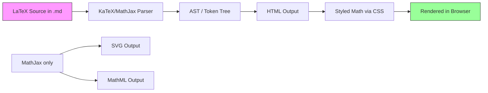
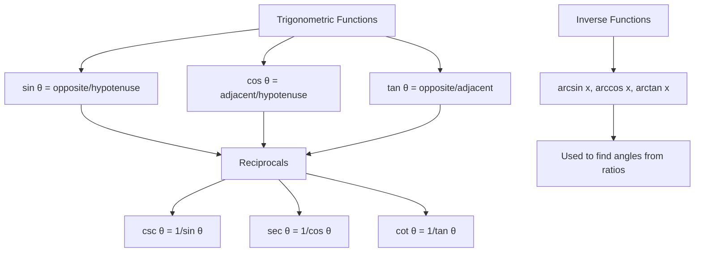
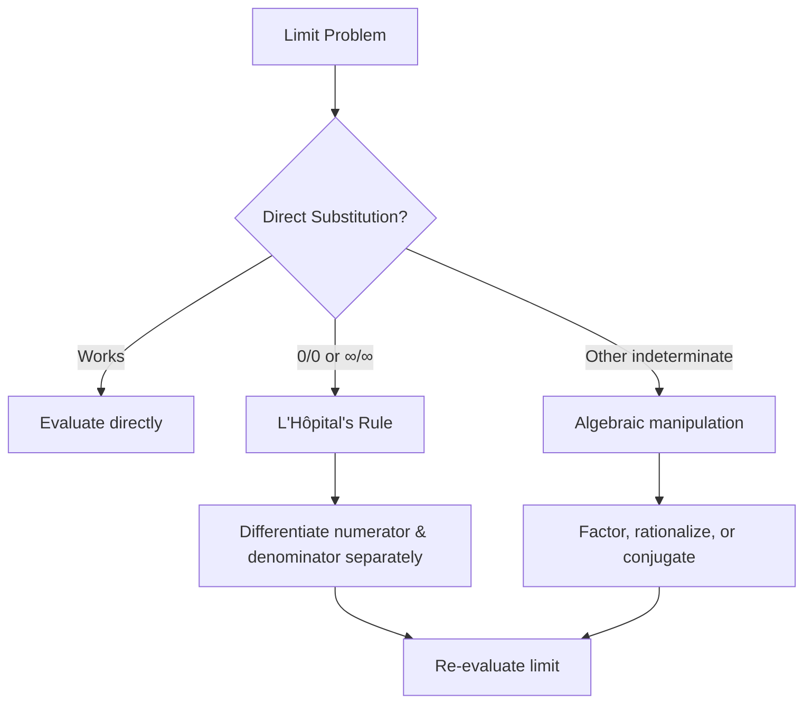
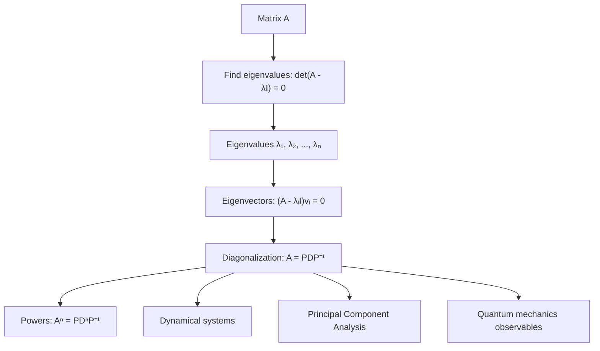
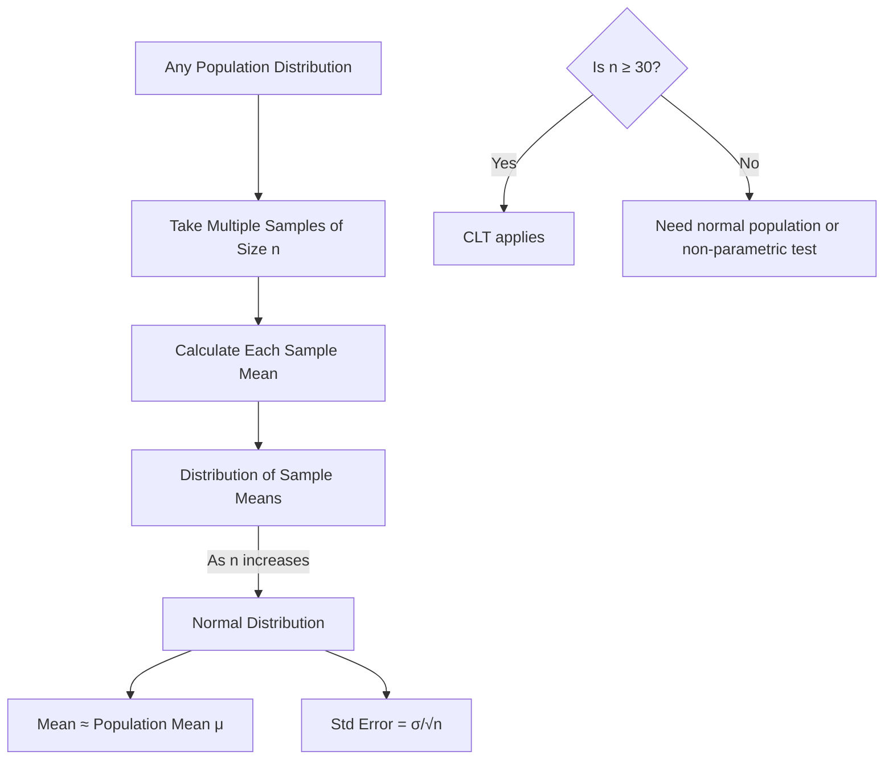
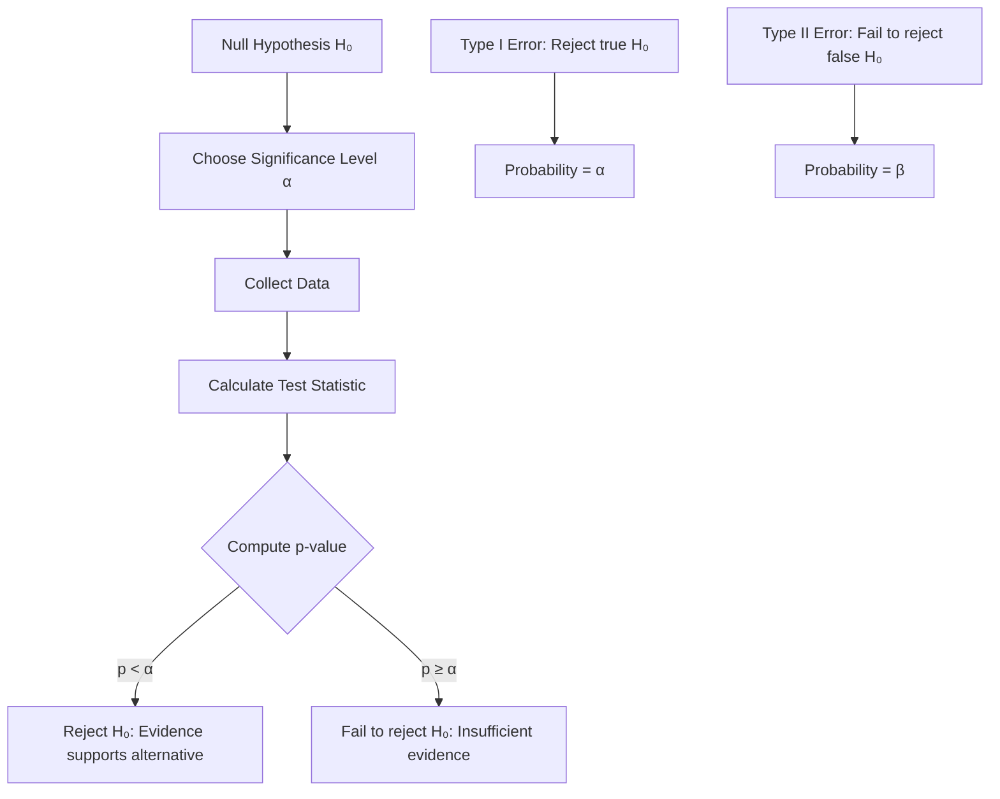
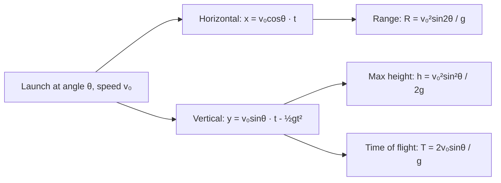
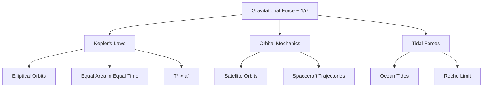
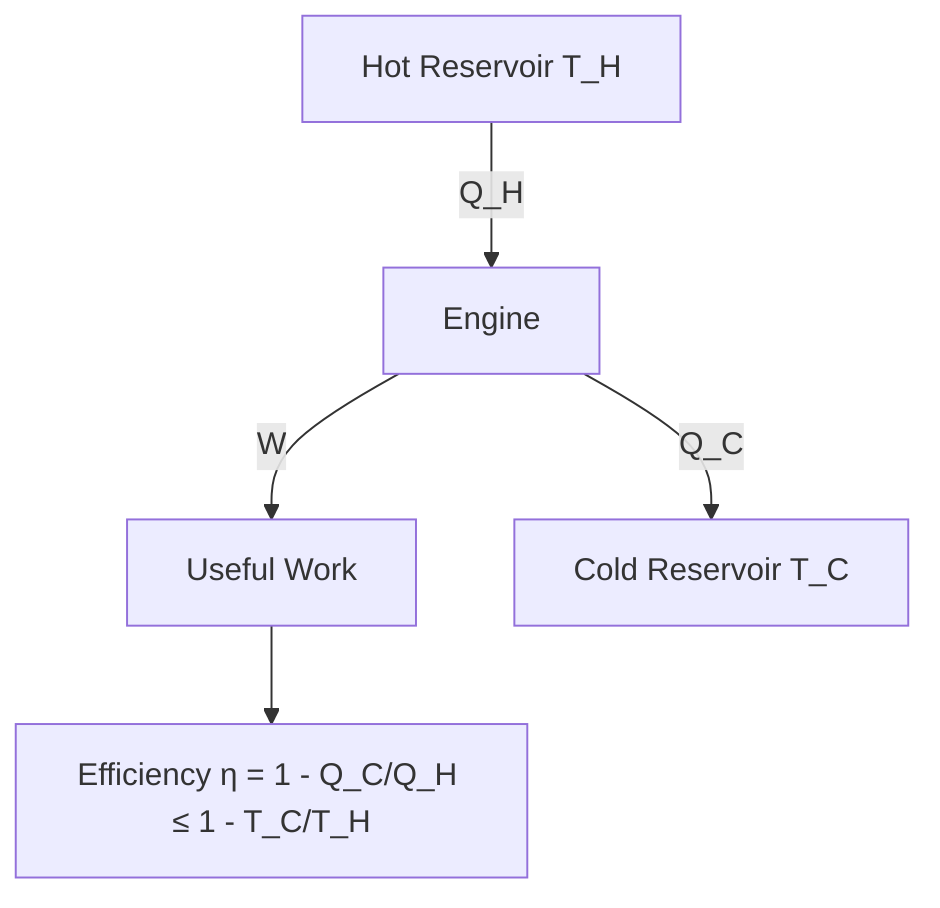
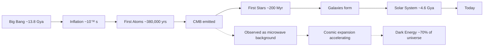

# Module 7: Mathematical Markdown

## 7.1 Introduction to LaTeX in Markdown

### What is LaTeX?

LaTeX is a high-quality typesetting system originally developed by Leslie Lamport in the 1980s, building upon the TeX typesetting engine created by Donald Knuth. While LaTeX is renowned for formatting academic papers, books, and theses, its mathematical typesetting capabilities are its most celebrated feature.

LaTeX provides:
- Precise typographic control with automatic spacing, sizing, and positioning of mathematical symbols
- A comprehensive symbol library with thousands of mathematical, technical, and scientific symbols
- Automatic numbering for equations, theorems, and cross-references
- Extensibility through packages for specialized fields (physics, chemistry, computer science)

### Why Math in Markdown?

Markdown's simplicity and portability have made it the dominant format for documentation, technical writing, and knowledge management. However, standard Markdown lacks native support for mathematical notation. By embedding LaTeX math inside Markdown, you gain:

1. **Unified documentation** — Code, prose, and math in a single file
2. **Version control** — Math expressions are text and can be diffed in pull requests
3. **Portability** — Works across platforms with MathJax or KaTeX rendering
4. **Collaboration** — Teams can review math changes alongside code changes
5. **Static site generation** — Math renders beautifully in Docusaurus, VitePress, Jekyll, Hugo

### KaTeX vs MathJax

KaTeX and MathJax are the two dominant JavaScript libraries for rendering LaTeX math in web browsers:

| Feature | KaTeX | MathJax |
|---------|-------|---------|
| Speed | Blazing fast (10-100x faster) | Slower, full page re-render |
| Output | HTML only | HTML, SVG, MathML |
| Browser support | Modern browsers | Older browsers supported |
| Features | Core LaTeX + AMSmath | Full LaTeX + AMSmath + extensions |
| Bundle size | ~70KB minified | ~300KB+ |
| Customization | Limited CSS customization | Extensive configuration |
| Accessibility | Basic | Screen reader support via MathML |

### Math Rendering Workflow



---

## 7.2 Setting Up

### KaTeX CDN

The simplest way to add KaTeX to an HTML page:

```html
<!DOCTYPE html>
<html lang="en">
<head>
    <meta charset="UTF-8">
    <meta name="viewport" content="width=device-width, initial-scale=1.0">
    <title>KaTeX Example</title>
    <link rel="stylesheet" href="https://cdn.jsdelivr.net/npm/katex@0.16.11/dist/katex.min.css">
    <script defer src="https://cdn.jsdelivr.net/npm/katex@0.16.11/dist/katex.min.js"></script>
    <script defer src="https://cdn.jsdelivr.net/npm/katex@0.16.11/dist/contrib/auto-render.min.js"
        onload="renderMathInElement(document.body, {
            delimiters: [
                {left: '$$', right: '$$', display: true},
                {left: '$', right: '$', display: false},
                {left: '\\[', right: '\\]', display: true},
                {left: '\\(', right: '\\)', display: false}
            ]
        });"></script>
</head>
<body>
    <p>Inline math: $E = mc^2$</p>
    <p>Display math: $$\int_{-\infty}^{\infty} e^{-x^2} dx = \sqrt{\pi}$$</p>
</body>
</html>
```

### Platform Support

| Platform | Engine | Syntax |
|----------|--------|--------|
| GitHub | MathJax | $$...$$ display, $...$ inline |
| GitLab | KaTeX | $$...$$ display, $...$ inline |
| VitePress | KaTeX (plugin) | $$...$$ display, $...$ inline |
| Docusaurus | KaTeX (plugin) | $$...$$ display, $...$ inline |
| Jupyter Notebooks | MathJax | $$...$$ display, $...$ inline |
| Obsidian | MathJax | $$...$$ display, $...$ inline |
| Notion | KaTeX | /math command |
| Typora | MathJax | $$...$$ display, $...$ inline |
| Stack Exchange | MathJax | $...$ inline, $$...$$ display |

---

## 7.3 Inline Math

### Basic Syntax

Inline math is enclosed in single dollar signs `$...$`:

```markdown
The equation $E = mc^2$ is famous.
```

Renders as: The equation $E = mc^2$ is famous.

> **💡 Big Insight:** LaTeX color rendering in Markdown uses `{\color{name} text}` syntax. Throughout this module, key formulas are color-highlighted:
> - ${\color{red}\text{Red}}$ = Most fundamental equations
> - ${\color{blue}\text{Blue}}$ = Variables and parameters
> - ${\color{green}\text{Green}}$ = Derived relationships
> - ${\color{orange}\text{Orange}}$ = Special constants

### When to Use Inline Math

Use inline math when mathematical symbols appear within a sentence:

- Physics: "The force is $F = ma$ where $m$ is mass and $a$ is acceleration."
- Computer science: "The time complexity is $O(n \log n)$."
- Statistics: "The sample mean $\bar{x}$ estimates the population mean $\mu$."
- Calculus: "The derivative $\frac{dy}{dx}$ represents the rate of change."

---

## 7.4 Block Math

### Basic Syntax

Block (display) math is enclosed in double dollar signs `$$...$$`:

$$
E = mc^2
$$

### Equation Numbering with \tag{}

$$
E = mc^2 \tag{1}
$$

$$
F = G \frac{m_1 m_2}{r^2} \tag{2}
$$

### Alignment with \begin{align}

The `align` environment aligns equations at the `&` marker:

$$
\begin{align}
f(x) &= x^2 + 2x + 1 \\
     &= (x + 1)^2
\end{align}
$$

### Cases Environment

Piecewise functions:

$$
f(x) =
\begin{cases}
x^2 & \text{if } x \geq 0 \\
-x^2 & \text{if } x < 0
\end{cases}
$$

---

## 7.5 Foundational Mathematics — Complete Reference

### 7.5.1 Arithmetic & Number Theory

**Basic Operations:**

$$
a + b = c \quad a - b = d \quad a \times b = e \quad a \div b = f
$$

**Exponents and Radicals:**

$$
a^n = \underbrace{a \times a \times \cdots \times a}_{n \text{ times}}
$$

$$
a^m \times a^n = a^{m+n} \quad \frac{a^m}{a^n} = a^{m-n} \quad (a^m)^n = a^{mn}
$$

$$
a^{-n} = \frac{1}{a^n} \quad a^{1/n} = \sqrt[n]{a} \quad a^{m/n} = \sqrt[n]{a^m}
$$

**Absolute Value:**

$$
|x| = \begin{cases} x & \text{if } x \geq 0 \\ -x & \text{if } x < 0 \end{cases}
$$

**Factorial:**

$$
n! = n \times (n-1) \times (n-2) \times \cdots \times 2 \times 1
$$

### 7.5.2 Algebra — The Language of Patterns

**Quadratic Formula — The Universal Solver:**

$$
{\color{red}x} = \frac{-{\color{blue}b} \pm \sqrt{{\color{blue}b}^2 - 4{\color{orange}a}{\color{purple}c}}}{2{\color{orange}a}}
$$

Where:
- ${\color{orange}a}$ = coefficient of $x^2$ (quadratic term) — determines parabola width
- ${\color{blue}b}$ = coefficient of $x$ (linear term) — shifts parabola left/right
- ${\color{purple}c}$ = constant term — sets y-intercept
- ${\color{red}x}$ = the solution(s) we're solving for

The **discriminant** $\Delta = {\color{blue}b}^2 - 4{\color{orange}a}{\color{purple}c}$ determines the nature of roots:

- $\Delta > 0$: two distinct real roots
- $\Delta = 0$: one repeated real root
- $\Delta < 0$: two complex conjugate roots

> 💡 **Big Insight:** The quadratic formula is the complete solution to any quadratic equation — it always works. The ± symbol encodes both possible solutions in one expression. Geometrically, the solutions are where the parabola $y = ax^2 + bx + c$ crosses the x-axis.

```mermaid
flowchart TD
    A[Quadratic: ax² + bx + c = 0] --> B{Discriminant}
    B -->|Δ = b² - 4ac > 0| C[Two real roots]
    B -->|Δ = 0| D[One repeated root]
    B -->|Δ < 0| E[Two complex roots]
    C --> F[x = (-b ± √Δ) / 2a]
    D --> G[x = -b / 2a]
    E --> H[x = (-b ± i√|Δ|) / 2a]
```

**Binomial Theorem:**

$$
(x + y)^n = \sum_{k=0}^{n} \binom{n}{k} x^{n-k} y^k
$$

$$
(x + y)^2 = x^2 + 2xy + y^2
$$
$$
(x - y)^2 = x^2 - 2xy + y^2
$$
$$
(x + y)^3 = x^3 + 3x^2 y + 3xy^2 + y^3
$$
$$
(x - y)^3 = x^3 - 3x^2 y + 3xy^2 - y^3
$$
$$
(x + y)(x - y) = x^2 - y^2
$$

**Logarithms — The Inverse of Exponentiation:**

$$
\log_b a = c \iff b^c = a
$$

$$
\log(xy) = \log x + \log y \quad \log\left(\frac{x}{y}\right) = \log x - \log y
$$

$$
\log(x^n) = n \log x \quad \log_b a = \frac{\log_c a}{\log_c b} \quad (\text{change of base})
$$

$$
\ln x = \log_e x \quad \text{where } e = \lim_{n \to \infty} \left(1 + \frac{1}{n}\right)^n \approx 2.71828
$$

```mermaid
flowchart LR
    A[Exponential: y = b^x] <-->|inverse| B[Logarithmic: x = log_b y]
    A -->|growth rate| C[Doubling time: t = ln2 / ln(1+r)]
    B -->|decay rate| D[Half-life: t_½ = ln2 / λ]
```

### 7.5.3 Geometry — The Mathematics of Space

**Pythagorean Theorem:**

$$
a^2 + b^2 = c^2
$$

Where $c$ is the hypotenuse of a right triangle.

```
        /|
     c / | a
      /  |
     /___|
       b
```

**Circle Properties:**

$$
\text{Circumference: } C = 2\pi r \quad \text{Area: } A = \pi r^2
$$

**Triangle Area:**

$$
A = \frac{1}{2}bh \quad \text{Heron's formula: } A = \sqrt{s(s-a)(s-b)(s-c)}
$$

Where $s = \frac{a+b+c}{2}$ is the semiperimeter.

**Volume of Solids:**

$$
\text{Sphere: } V = \frac{4}{3}\pi r^3 \quad \text{Surface Area: } S = 4\pi r^2
$$

$$
\text{Cylinder: } V = \pi r^2 h \quad \text{Cone: } V = \frac{1}{3}\pi r^2 h
$$

**Coordinate Geometry — Distance and Midpoint:**

$$
d = \sqrt{(x_2 - x_1)^2 + (y_2 - y_1)^2} \quad M = \left(\frac{x_1 + x_2}{2}, \frac{y_1 + y_2}{2}\right)
$$

### 7.5.4 Trigonometry — The Mathematics of Angles

**Fundamental Identities:**

$$
\sin^2 \theta + \cos^2 \theta = 1 \quad \tan \theta = \frac{\sin \theta}{\cos \theta}
$$

$$
1 + \tan^2 \theta = \sec^2 \theta \quad 1 + \cot^2 \theta = \csc^2 \theta
$$

**Unit Circle Values:**

| Angle $\theta$ | $0$ | $\frac{\pi}{6}$ | $\frac{\pi}{4}$ | $\frac{\pi}{3}$ | $\frac{\pi}{2}$ |
|----------------|-----|-----------------|-----------------|-----------------|-----------------|
| $\sin \theta$ | $0$ | $\frac{1}{2}$ | $\frac{\sqrt{2}}{2}$ | $\frac{\sqrt{3}}{2}$ | $1$ |
| $\cos \theta$ | $1$ | $\frac{\sqrt{3}}{2}$ | $\frac{\sqrt{2}}{2}$ | $\frac{1}{2}$ | $0$ |
| $\tan \theta$ | $0$ | $\frac{\sqrt{3}}{3}$ | $1$ | $\sqrt{3}$ | undefined |

**Law of Sines and Cosines:**

$$
\frac{a}{\sin A} = \frac{b}{\sin B} = \frac{c}{\sin C} = 2R \quad (\text{circumradius } R)
$$

$$
c^2 = a^2 + b^2 - 2ab \cos C
$$

**Double Angle Formulas:**

$$
\sin(2\theta) = 2\sin\theta\cos\theta \quad \cos(2\theta) = \cos^2\theta - \sin^2\theta = 2\cos^2\theta - 1 = 1 - 2\sin^2\theta
$$

**Sum and Difference Formulas:**

$$
\sin(A \pm B) = \sin A \cos B \pm \cos A \sin B
$$
$$
\cos(A \pm B) = \cos A \cos B \mp \sin A \sin B
$$



### 7.5.5 Complex Numbers — The Full Number System

**Definition:**

$$
i = \sqrt{-1} \quad i^2 = -1 \quad i^3 = -i \quad i^4 = 1
$$

**Cartesian and Polar Forms:**

$$
z = a + bi \quad \text{(Cartesian)}
$$

$$
z = r(\cos \theta + i \sin \theta) = re^{i\theta} \quad \text{(Polar, Euler's formula)}
$$

Where $r = |z| = \sqrt{a^2 + b^2}$ and $\theta = \arg(z) = \tan^{-1}(b/a)$.

**Operations:**

$$
(a + bi) + (c + di) = (a + c) + (b + d)i
$$

$$
(a + bi)(c + di) = (ac - bd) + (ad + bc)i
$$

**De Moivre's Theorem:**

$$
(r(\cos \theta + i\sin \theta))^n = r^n(\cos n\theta + i\sin n\theta)
$$

**Euler's Identity — The Most Beautiful Equation:**

$$
{\color{red}e^{i\pi}} + {\color{blue}1} = {\color{green}0}
$$

This single equation connects the five most important constants in mathematics:

| Constant | Value | Color | Domain |
|----------|-------|-------|--------|
| ${\color{red}e}$ | $\approx 2.71828$ | Red | Analysis (exponential growth) |
| ${\color{red}i}$ | $\sqrt{-1}$ | Red | Complex numbers |
| ${\color{orange}\pi}$ | $\approx 3.14159$ | Orange | Geometry (circles) |
| ${\color{blue}1}$ | Multiplicative identity | Blue | Arithmetic |
| ${\color{green}0}$ | Additive identity | Green | Algebra |

> **💡 Big Insight:** Euler's Identity is profound because it reveals a **hidden unity** between five seemingly unrelated mathematical constants. The exponential function $e^{i\theta}$ describes rotation in the complex plane. When $\theta = \pi$, the rotation lands exactly at $-1$, so $e^{i\pi} + 1 = 0$. This means **exponential growth in the imaginary direction is circular motion** — a deep truth that underpins quantum mechanics, signal processing, and electrical engineering.

```mermaid
flowchart TD
    A[Euler's Identity: e^(iπ) + 1 = 0] --> B[e: Euler's number ~2.718]
    A --> C[i: Imaginary unit √-1]
    A --> D[π: Pi ~3.14159]
    A --> E[1: Multiplicative identity]
    A --> F[0: Additive identity]
    B --> G[Connects exponential functions]
    C --> H[Connects complex analysis]
    D --> I[Connects geometry]
    E --> J[Connects arithmetic]
    F --> K[Connects algebra]
```

---

## 7.6 Calculus — The Mathematics of Change

### 7.6.1 Limits — Approaching Infinity

**Definition of a Limit:**

$$
\lim_{x \to a} f(x) = L \iff \forall \epsilon > 0, \exists \delta > 0: 0 < |x - a| < \delta \implies |f(x) - L| < \epsilon
$$

**Key Limits:**

$$
\lim_{x \to 0} \frac{\sin x}{x} = 1 \quad \lim_{x \to 0} \frac{1 - \cos x}{x} = 0
$$

$$
\lim_{x \to \infty} \left(1 + \frac{1}{x}\right)^x = e \quad \lim_{x \to 0} \frac{e^x - 1}{x} = 1
$$

**L'Hôpital's Rule:**

$$
\lim_{x \to a} \frac{f(x)}{g(x)} = \lim_{x \to a} \frac{f'(x)}{g'(x)} \quad \text{if } \frac{f(a)}{g(a)} = \frac{0}{0} \text{ or } \frac{\infty}{\infty}
$$



### 7.6.2 Derivatives — Instantaneous Rate of Change

**Definition:**

$$
f'(x) = \lim_{h \to 0} \frac{f(x + h) - f(x)}{h}
$$

**Differentiation Rules:**

| Rule | Formula |
|------|---------|
| Power Rule | $\frac{d}{dx} x^n = nx^{n-1}$ |
| Product Rule | $(fg)' = f'g + fg'$ |
| Quotient Rule | $\left(\frac{f}{g}\right)' = \frac{f'g - fg'}{g^2}$ |
| Chain Rule | $\frac{dy}{dx} = \frac{dy}{du} \cdot \frac{du}{dx}$ |
| Constant Rule | $\frac{d}{dx} c = 0$ |
| Sum Rule | $(f + g)' = f' + g'$ |

**Derivatives of Common Functions:**

$$
\frac{d}{dx} \sin x = \cos x \quad \frac{d}{dx} \cos x = -\sin x \quad \frac{d}{dx} \tan x = \sec^2 x
$$

$$
\frac{d}{dx} e^x = e^x \quad \frac{d}{dx} \ln x = \frac{1}{x} \quad \frac{d}{dx} a^x = a^x \ln a
$$

$$
\frac{d}{dx} \arcsin x = \frac{1}{\sqrt{1 - x^2}} \quad \frac{d}{dx} \arctan x = \frac{1}{1 + x^2}
$$

**Applications — What Derivatives Tell Us:**

```mermaid
flowchart TD
    A[Derivative f'(x)] --> B[f'(x) > 0 → function increasing]
    A --> C[f'(x) < 0 → function decreasing]
    A --> D[f'(x) = 0 → critical point]
    D --> E[Second derivative f''(x)]
    E --> F[f''(x) > 0 → local minimum]
    E --> G[f''(x) < 0 → local maximum]
    E --> H[f''(x) = 0 → inflection point possible]
```

### 7.6.3 Integrals — Accumulation of Change

**Definition (Riemann Sum):**

$$
\int_a^b f(x) \, dx = \lim_{n \to \infty} \sum_{i=1}^{n} f(x_i^*) \Delta x
$$

**Fundamental Theorem of Calculus:**

Part 1: If $F'(x) = f(x)$, then $\frac{d}{dx} \int_a^x f(t) \, dt = f(x)$

Part 2: $\int_a^b f(x) \, dx = F(b) - F(a)$ where $F'(x) = f(x)$

```mermaid
flowchart LR
    A[Differentiation] --> B[Rate of change]
    C[Integration] --> D[Accumulation]
    B <-->|Fundamental Theorem| D
    A -.->|"F'(x) = f(x)"| C
    D -.->|∫ f(x)dx = F(b) - F(a)| A
```

**Integration Techniques:**

| Technique | Formula | When to Use |
|-----------|---------|-------------|
| Substitution | $\int f(g(x)) g'(x) dx = \int f(u) du$ | Composition of functions |
| Integration by Parts | $\int u \, dv = uv - \int v \, du$ | Product of different function types |
| Partial Fractions | Decompose rational functions | Rational functions with factorable denominator |
| Trigonometric Substitution | Substitute $\sin \theta$, $\tan \theta$, $\sec \theta$ | Integrals with $\sqrt{a^2 \pm x^2}$ |

**Common Integrals:**

$$
\int x^n \, dx = \frac{x^{n+1}}{n+1} + C \quad (n \neq -1)
$$

$$
\int \frac{1}{x} \, dx = \ln |x| + C \quad \int e^x \, dx = e^x + C
$$

$$
\int \sin x \, dx = -\cos x + C \quad \int \cos x \, dx = \sin x + C
$$

$$
\int \sec^2 x \, dx = \tan x + C \quad \int \frac{1}{1 + x^2} \, dx = \arctan x + C
$$

$$
\int \frac{1}{\sqrt{1 - x^2}} \, dx = \arcsin x + C
$$

**Definite Integral Applications:**

$$
\text{Area between curves: } A = \int_a^b |f(x) - g(x)| \, dx
$$

$$
\text{Volume of revolution (disk): } V = \pi \int_a^b [f(x)]^2 \, dx
$$

$$
\text{Arc length: } L = \int_a^b \sqrt{1 + [f'(x)]^2} \, dx
$$

### 7.6.4 Multivariable Calculus

**Partial Derivatives:**

$$
\frac{\partial f}{\partial x} = \lim_{h \to 0} \frac{f(x+h, y) - f(x, y)}{h}
$$

**Gradient — Direction of Steepest Ascent:**

$$
\nabla f = \left( \frac{\partial f}{\partial x}, \frac{\partial f}{\partial y}, \frac{\partial f}{\partial z} \right)
$$

**Divergence — Measure of Source/Sink:**

$$
\nabla \cdot \mathbf{F} = \frac{\partial F_x}{\partial x} + \frac{\partial F_y}{\partial y} + \frac{\partial F_z}{\partial z}
$$

**Curl — Measure of Rotation:**

$$
\nabla \times \mathbf{F} = \begin{pmatrix}
\frac{\partial F_z}{\partial y} - \frac{\partial F_y}{\partial z} \\
\frac{\partial F_x}{\partial z} - \frac{\partial F_z}{\partial x} \\
\frac{\partial F_y}{\partial x} - \frac{\partial F_x}{\partial y}
\end{pmatrix}
$$

**Multiple Integrals:**

$$
\iint_D f(x,y) \, dA \quad \iiint_V f(x,y,z) \, dV
$$

**Change of Variables (Jacobian):**

$$
\iint_R f(x,y) \, dx \, dy = \iint_S f(u,v) \left| \frac{\partial(x,y)}{\partial(u,v)} \right| \, du \, dv
$$

### 7.6.5 Differential Equations — The Language of Nature

**First-Order Linear:**

$$
\frac{dy}{dx} + P(x)y = Q(x) \quad \text{Solution: } y = e^{-\int P \, dx} \int Q e^{\int P \, dx} \, dx
$$

**Separable:**

$$
\frac{dy}{dx} = g(x)h(y) \implies \int \frac{dy}{h(y)} = \int g(x) \, dx
$$

**Second-Order Linear with Constant Coefficients:**

$$
a \frac{d^2y}{dx^2} + b \frac{dy}{dx} + c y = 0
$$

Characteristic equation: $ar^2 + br + c = 0$ gives solutions of form $y = e^{rx}$.

| Roots | General Solution |
|-------|-----------------|
| Real distinct $r_1 \neq r_2$ | $y = C_1 e^{r_1 x} + C_2 e^{r_2 x}$ |
| Real repeated $r_1 = r_2 = r$ | $y = (C_1 + C_2 x)e^{rx}$ |
| Complex $r = \alpha \pm \beta i$ | $y = e^{\alpha x}(C_1 \cos \beta x + C_2 \sin \beta x)$ |

**Laplace Transform — Converting Differential Equations to Algebra:**

$$
\mathcal{L}\{f(t)\} = F(s) = \int_0^{\infty} e^{-st} f(t) \, dt
$$

$$
\mathcal{L}\{f'(t)\} = sF(s) - f(0) \quad \mathcal{L}\{f''(t)\} = s^2 F(s) - sf(0) - f'(0)
$$

```mermaid
flowchart LR
    A[Differential Equation in t] --> B[Apply Laplace Transform]
    B --> C[Algebraic Equation in s]
    C --> D[Solve for F(s)]
    D --> E[Apply Inverse Laplace Transform]
    E --> F[Solution in t]
    
    style A fill:#f9f
    style F fill:#9f9
```

---

## 7.7 Linear Algebra — The Mathematics of Systems

### 7.7.1 Vectors and Spaces

**Vector Operations:**

$$
\mathbf{v} + \mathbf{w} = (v_1 + w_1, v_2 + w_2, \ldots, v_n + w_n)
$$

$$
c\mathbf{v} = (cv_1, cv_2, \ldots, cv_n)
$$

**Dot Product — Measure of Alignment:**

$$
\mathbf{v} \cdot \mathbf{w} = \sum_{i=1}^{n} v_i w_i = \|\mathbf{v}\| \|\mathbf{w}\| \cos \theta
$$

When $\mathbf{v} \cdot \mathbf{w} = 0$, vectors are **orthogonal** (perpendicular).

**Cross Product (3D) — Perpendicular Vector:**

$$
\mathbf{v} \times \mathbf{w} = \begin{pmatrix}
v_2 w_3 - v_3 w_2 \\
v_3 w_1 - v_1 w_3 \\
v_1 w_2 - v_2 w_1
\end{pmatrix}
$$

**Norm (Length):**

$$
\|\mathbf{v}\| = \sqrt{v_1^2 + v_2^2 + \cdots + v_n^2} = \sqrt{\mathbf{v} \cdot \mathbf{v}}
$$

### 7.7.2 Matrices — Transformations and Systems

**Matrix Multiplication:**

$$
(AB)_{ij} = \sum_{k=1}^{m} A_{ik} B_{kj}
$$

Key insight: Matrix multiplication is **not commutative**: $AB \neq BA$ in general.

**Matrix Types:**

| Type | Definition | Example |
|------|------------|---------|
| Identity | $I_{ii} = 1$, all else 0 | $\begin{pmatrix}1&0\\0&1\end{pmatrix}$ |
| Diagonal | Non-zero only on diagonal | $\begin{pmatrix}a&0\\0&b\end{pmatrix}$ |
| Symmetric | $A = A^T$ | $\begin{pmatrix}a&b\\b&c\end{pmatrix}$ |
| Orthogonal | $A^T A = I$ | Rotation matrices |
| Inverse | $A^{-1} A = I$ | Solves $A\mathbf{x} = \mathbf{b}$ |

**Determinant — Measure of Scale Factor:**

$$
\det\begin{pmatrix}a&b\\c&d\end{pmatrix} = ad - bc
$$

$$
\det A \neq 0 \iff A \text{ is invertible}
$$

**Eigenvalues and Eigenvectors — The Natural Directions:**

$$
A\mathbf{v} = \lambda \mathbf{v}
$$

Where $\lambda$ is an eigenvalue and $\mathbf{v}$ is its corresponding eigenvector.

To find eigenvalues, solve: $\det(A - \lambda I) = 0$ (characteristic equation).



### 7.7.3 System of Linear Equations

$$
\begin{cases}
a_{11}x_1 + a_{12}x_2 + \cdots + a_{1n}x_n = b_1 \\
a_{21}x_1 + a_{22}x_2 + \cdots + a_{2n}x_n = b_2 \\
\vdots \\
a_{m1}x_1 + a_{m2}x_2 + \cdots + a_{mn}x_n = b_m
\end{cases}
$$

Matrix form: $A\mathbf{x} = \mathbf{b}$

Solution: $\mathbf{x} = A^{-1}\mathbf{b}$ (if $A$ is square and invertible)

---

## 7.8 Probability and Statistics — The Mathematics of Uncertainty

### 7.8.1 Probability Fundamentals

**Basic Probability Axioms:**

$$
0 \leq P(A) \leq 1 \quad P(\Omega) = 1 \quad P(\emptyset) = 0
$$

$$
P(A \cup B) = P(A) + P(B) - P(A \cap B)
$$

**Conditional Probability:**

$$
P(A|B) = \frac{P(A \cap B)}{P(B)} \quad \text{(probability of A given B)}
$$

**Bayes' Theorem — Updating Beliefs with Evidence:**

> 💡 **Big Insight:** Bayes' theorem is the **mathematical foundation of learning from experience**. It tells you how to update your beliefs ($P(A)$) when you see new evidence ($B$). This is used everywhere: spam filters update their belief that an email is spam when they see the word "FREE," doctors update the probability of disease when a test comes back positive, and AI models update their predictions as they process more data. It's how machines — and humans — should learn.

$$
{\color{red}P(A|B)} = \frac{{\color{blue}P(B|A)} {\color{green}P(A)}}{{\color{orange}P(B)}}
$$

| Term | Name | Meaning | Example (Medical Test) |
|------|------|---------|----------------------|
| ${\color{red}P(A\|B)}$ | **Posterior** | Updated belief after evidence | Probability of disease given positive test |
| ${\color{blue}P(B\|A)}$ | **Likelihood** | How likely is evidence if belief is true | Test sensitivity (e.g., 99%) |
| ${\color{green}P(A)}$ | **Prior** | Initial belief before evidence | Disease prevalence (e.g., 1%) |
| ${\color{orange}P(B)}$ | **Evidence** | Total probability of seeing evidence | Overall positive test rate |

**Real-world example — Medical testing paradox:**

If a disease affects 1% of people, and a test is 99% accurate:

$$
P(\text{Disease}\|\text{Positive}) = \frac{0.99 \times 0.01}{0.99 \times 0.01 + 0.01 \times 0.99} = \frac{0.0099}{0.0198} = 0.5
$$

Even with a 99% accurate test, a positive result means only a **50% chance** you actually have the disease! This is because the disease is rare, so false positives outnumber true positives.

```mermaid
flowchart LR
    A[Prior P(A)] --> B[New Evidence B]
    B --> C[Likelihood P(B|A)]
    C --> D[Posterior P(A|B)]
    D -->|Becomes new prior| A
```

### 7.8.2 Probability Distributions

**Discrete Distributions:**

| Distribution | PMF $P(X=k)$ | Mean | Variance | Use Case |
|-------------|-------------|------|----------|----------|
| Binomial | $\binom{n}{k} p^k (1-p)^{n-k}$ | $np$ | $np(1-p)$ | Number of successes in n trials |
| Poisson | $\frac{\lambda^k e^{-\lambda}}{k!}$ | $\lambda$ | $\lambda$ | Rare events over time/space |
| Geometric | $(1-p)^{k-1}p$ | $1/p$ | $(1-p)/p^2$ | Trials until first success |

**Continuous Distributions:**

| Distribution | PDF $f(x)$ | Mean | Variance | Use Case |
|-------------|-----------|------|----------|----------|
| Normal | $\frac{1}{\sigma\sqrt{2\pi}} e^{-\frac{1}{2}(\frac{x-\mu}{\sigma})^2}$ | $\mu$ | $\sigma^2$ | Natural phenomena, CLT |
| Exponential | $\lambda e^{-\lambda x}$ | $1/\lambda$ | $1/\lambda^2$ | Waiting times |
| Uniform | $\frac{1}{b-a}$ | $\frac{a+b}{2}$ | $\frac{(b-a)^2}{12}$ | Equal probability over interval |

**The Normal Distribution Curve — The Bell Curve of Nature:**

$$
f(x) = \frac{1}{{\color{orange}\sigma}{\color{red}\sqrt{2\pi}}} e^{-\frac{1}{2}\left(\frac{x - {\color{blue}\mu}}{{\color{orange}\sigma}}\right)^2}
$$

> 💡 **Big Insight:** The normal distribution appears everywhere in nature because of the **Central Limit Theorem**: when you add up many independent random variables, their sum tends toward a normal distribution regardless of their individual distributions. This is why heights, test scores, measurement errors, and countless other phenomena follow this bell-shaped curve.

Where:
- ${\color{blue}\mu}$ = mean (center of the bell)
- ${\color{orange}\sigma}$ = standard deviation (width of the bell)
- ${\color{red}\sqrt{2\pi}}$ = normalization constant

**The famous 68-95-99.7 rule:**

$$
\begin{aligned}
P(|X - \mu| &< {\color{orange}\sigma}) &\approx 0.6827 \quad &\text{(68% within 1σ)} \\
P(|X - \mu| &< 2{\color{orange}\sigma}) &\approx 0.9545 \quad &\text{(95% within 2σ)} \\
P(|X - \mu| &< 3{\color{orange}\sigma}) &\approx 0.9973 \quad &\text{(99.7% within 3σ)}
\end{aligned}
$$

**Central Limit Theorem — The Most Important Theorem in Statistics:**

> 💡 **Big Insight:** The Central Limit Theorem is why statistics works. Even if your raw data is wildly non-normal (e.g., income distribution, which is heavily skewed), the **average of your samples** will be approximately normally distributed. This is why we can use normal-distribution-based tools (t-tests, confidence intervals) on almost any data, as long as we have enough samples. The magic number is typically $n \geq 30$.

If $X_1, X_2, \ldots, X_n$ are independent random variables with mean $\mu$ and variance $\sigma^2$, then:

$$
\frac{{\color{red}\bar{X}} - {\color{blue}\mu}}{{\color{orange}\sigma}/{\color{green}\sqrt{n}}} \xrightarrow{d} {\color{purple}N(0, 1)} \quad \text{as } n \to \infty
$$

This means: **the sampling distribution of the mean approaches a normal distribution regardless of the underlying distribution**, given a sufficiently large sample size.



### 7.8.3 Descriptive Statistics

**Measures of Central Tendency:**

$$
\bar{x} = \frac{1}{n} \sum_{i=1}^{n} x_i \quad \text{(Mean)}
$$

$$
\text{Median} = \begin{cases} x_{(n+1)/2} & n \text{ odd} \\ \frac{x_{n/2} + x_{n/2+1}}{2} & n \text{ even} \end{cases}
$$

$$
\text{Mode} = \text{most frequent value}
$$

**Measures of Dispersion:**

$$
\sigma^2 = \frac{1}{n} \sum_{i=1}^{n} (x_i - \mu)^2 \quad \text{(Population variance)}
$$

$$
s^2 = \frac{1}{n-1} \sum_{i=1}^{n} (x_i - \bar{x})^2 \quad \text{(Sample variance — Bessel's correction)}
$$

**Correlation — Measuring Relationships:**

$$
r = \frac{\sum (x_i - \bar{x})(y_i - \bar{y})}{\sqrt{\sum (x_i - \bar{x})^2 \sum (y_i - \bar{y})^2}}
$$

- $r = 1$: perfect positive correlation
- $r = -1$: perfect negative correlation
- $r = 0$: no linear correlation

**Linear Regression — Finding the Best Fit Line:**

$$
y = mx + b \quad \text{where } m = \frac{\sum (x_i - \bar{x})(y_i - \bar{y})}{\sum (x_i - \bar{x})^2}, \quad b = \bar{y} - m\bar{x}
$$

### 7.8.4 Inferential Statistics

**Confidence Intervals:**

$$
\text{CI} = \bar{x} \pm z_{\alpha/2} \frac{\sigma}{\sqrt{n}} \quad \text{(known variance)}
$$

$$
\text{CI} = \bar{x} \pm t_{\alpha/2, n-1} \frac{s}{\sqrt{n}} \quad \text{(unknown variance)}
$$

**Hypothesis Testing Framework:**



**p-value Interpretation:**

The p-value is the probability of observing your data (or more extreme) assuming the null hypothesis is true. A small p-value suggests the null hypothesis is unlikely.

---

## 7.9 Discrete Mathematics — The Mathematics of Computing

### 7.9.1 Set Theory

**Set Operations:**

$$
A \cup B = \{x : x \in A \text{ or } x \in B\} \quad \text{(Union)}
$$
$$
A \cap B = \{x : x \in A \text{ and } x \in B\} \quad \text{(Intersection)}
$$
$$
A \setminus B = \{x : x \in A \text{ and } x \notin B\} \quad \text{(Difference)}
$$
$$
A \times B = \{(a,b) : a \in A, b \in B\} \quad \text{(Cartesian Product)}
$$

**De Morgan's Laws:**

$$
\overline{A \cup B} = \overline{A} \cap \overline{B} \quad \overline{A \cap B} = \overline{A} \cup \overline{B}
$$

### 7.9.2 Combinatorics — Counting

**Permutations (order matters):**

$$
P(n,k) = \frac{n!}{(n-k)!}
$$

**Combinations (order doesn't matter):**

$$
\binom{n}{k} = \frac{n!}{k!(n-k)!}
$$

**Pigeonhole Principle:**

If $n$ items are placed into $m$ containers and $n > m$, then at least one container must contain more than one item.

### 7.9.3 Graph Theory

**Graph Definition:**

A graph $G = (V, E)$ where $V$ is a set of vertices and $E$ is a set of edges.

**Euler's Formula (Planar Graphs):**

$$
V - E + F = 2
$$

Where $V$ = vertices, $E$ = edges, $F$ = faces.

**Handshaking Lemma:**

$$
\sum_{v \in V} \deg(v) = 2|E|
$$

The sum of all vertex degrees equals twice the number of edges.

### 7.9.4 Boolean Algebra and Logic

**Logical Operators:**

| Operator | Symbol | Meaning | Example |
|----------|--------|---------|---------|
| AND | $\land$ | Both true | $p \land q$ |
| OR | $\lor$ | At least one true | $p \lor q$ |
| NOT | $\lnot$ | Negation | $\lnot p$ |
| Implies | $\implies$ | If p then q | $p \implies q$ |
| Equivalence | $\iff$ | If and only if | $p \iff q$ |

**Truth Tables:**

| $p$ | $q$ | $p \land q$ | $p \lor q$ | $p \implies q$ | $p \iff q$ |
|-----|-----|-------------|-------------|----------------|-------------|
| T | T | T | T | T | T |
| T | F | F | T | F | F |
| F | T | F | T | T | F |
| F | F | F | F | T | T |

---

## 7.10 Physics — The Mathematics of Reality

### 7.10.1 Classical Mechanics

**Newton's Laws of Motion — The Foundation of Classical Physics:**

> 💡 **Big Insight:** Newton's three laws are the complete rules of motion for everyday objects. The second law $F=ma$ is the most important — it's a **differential equation** that tells us how velocity changes when forces are applied. Combined with his law of gravity, Newton explained everything from falling apples to planetary orbits. These laws work perfectly for speeds much less than light and objects much larger than atoms.

1st Law (Inertia): An object at rest stays at rest, an object in motion stays in motion, unless acted upon by an external force.
$$\sum \mathbf{F} = 0 \iff \frac{d\mathbf{v}}{dt} = 0$$

2nd Law (${\color{red}F=ma}$ — The Master Equation of Motion):
$${\color{red}\mathbf{F}} = {\color{blue}m}{\color{orange}\mathbf{a}} = {\color{blue}m}\frac{d^2{\color{orange}\mathbf{r}}}{dt^2}$$

3rd Law (Action-Reaction):
$$\mathbf{F}_{12} = {\color{green}-}\mathbf{F}_{21}$$

**Kinematics Equations (Constant Acceleration):**

$$
v = v_0 + at
$$

$$
x = x_0 + v_0t + \frac{1}{2}at^2
$$

$$
v^2 = v_0^2 + 2a(x - x_0)
$$

$$
\bar{v} = \frac{v_0 + v}{2}
$$

**Projectile Motion:**



**Work and Energy:**

$$
W = \mathbf{F} \cdot \mathbf{d} = Fd\cos\theta
$$

$$
K = \frac{1}{2}mv^2 \quad \text{(Kinetic energy)}
$$

$$
U_g = mgh \quad \text{(Gravitational potential near surface)}
$$

$$
U_s = \frac{1}{2}kx^2 \quad \text{(Spring potential)}
$$

**Conservation of Energy:**

$$
E_{\text{total}} = K + U + W_{\text{non-conservative}} = \text{constant}
$$

$$K_1 + U_1 = K_2 + U_2 \quad \text{(conservative forces only)}$$

**Momentum and Impulse:**

$$
\mathbf{p} = m\mathbf{v} \quad \mathbf{J} = \Delta\mathbf{p} = \int \mathbf{F} \, dt
$$

**Conservation of Momentum:**

$$
m_1\mathbf{v}_{1i} + m_2\mathbf{v}_{2i} = m_1\mathbf{v}_{1f} + m_2\mathbf{v}_{2f}
$$

### 7.10.2 Rotational Mechanics

**Angular Kinematics:**

$$
\theta \quad \text{(angular displacement)} \quad \omega = \frac{d\theta}{dt} \quad \alpha = \frac{d\omega}{dt}
$$

**Torque:**

$$
\boldsymbol{\tau} = \mathbf{r} \times \mathbf{F} \quad \tau = rF\sin\theta
$$

**Moment of Inertia:**

$$
I = \sum m_i r_i^2 \quad \text{(point masses)}
$$

$$I = \int r^2 \, dm \quad \text{(continuous bodies)}$$

| Shape | Axis | Moment of Inertia |
|-------|------|-------------------|
| Solid cylinder | Central | $\frac{1}{2}MR^2$ |
| Solid sphere | Center | $\frac{2}{5}MR^2$ |
| Thin rod | Center | $\frac{1}{12}ML^2$ |
| Thin rod | End | $\frac{1}{3}ML^2$ |

**Rotational Dynamics:**

$$
\boldsymbol{\tau} = I\boldsymbol{\alpha} \quad L = I\boldsymbol{\omega} \quad K_{\text{rot}} = \frac{1}{2}I\omega^2
$$

### 7.10.3 Gravitation

**Newton's Universal Law of Gravitation:**

$$
F = G\frac{m_1 m_2}{r^2} \quad G = 6.674 \times 10^{-11} \text{ N·m}^2/\text{kg}^2
$$

**Gravitational Potential Energy (General):**

$$
U = -\frac{G m_1 m_2}{r}
$$

**Kepler's Laws:**

1st Law: Planets orbit in ellipses with the Sun at one focus.
2nd Law: A line from Sun to planet sweeps equal areas in equal times.
3rd Law: $T^2 \propto a^3$ where $T$ is period and $a$ is semi-major axis.

$$
T^2 = \frac{4\pi^2}{GM} a^3
$$

**Orbital Velocity and Escape Velocity:**

$$
v_{\text{orbit}} = \sqrt{\frac{GM}{r}} \quad v_{\text{escape}} = \sqrt{\frac{2GM}{r}} = \sqrt{2}v_{\text{orbit}}
$$



### 7.10.4 Electromagnetism

**Coulomb's Law:**

$$
F = k_e \frac{q_1 q_2}{r^2} = \frac{1}{4\pi\varepsilon_0} \frac{q_1 q_2}{r^2}
$$

**Electric Field:**

$$
\mathbf{E} = \frac{\mathbf{F}}{q} = k_e \frac{Q}{r^2} \hat{r} \quad \text{(point charge)}
$$

**Electric Potential:**

$$
V = k_e \frac{Q}{r} \quad U = qV \quad \Delta V = -\int \mathbf{E} \cdot d\mathbf{l}
$$

**Gauss's Law:**

$$
\oint \mathbf{E} \cdot d\mathbf{A} = \frac{Q_{\text{enc}}}{\varepsilon_0}
$$

**Ohm's Law and Circuit Basics:**

$$
V = IR \quad P = IV = I^2R = \frac{V^2}{R}
$$

**Resistors in Series and Parallel:**

$$
R_{\text{series}} = R_1 + R_2 + \cdots + R_n
$$

$$
\frac{1}{R_{\text{parallel}}} = \frac{1}{R_1} + \frac{1}{R_2} + \cdots + \frac{1}{R_n}
$$

**Kirchhoff's Laws:**

KCL (Current): $\sum I_{\text{in}} = \sum I_{\text{out}}$ at any node
KVL (Voltage): $\sum V = 0$ around any closed loop

**Capacitance and Inductance:**

$$
C = \frac{Q}{V} \quad E = \frac{1}{2}CV^2 \quad \text{(energy in capacitor)}
$$

$$
L = \frac{N\Phi}{I} \quad E = \frac{1}{2}LI^2 \quad \text{(energy in inductor)}
$$

**Magnetism:**

$$
\mathbf{F} = q\mathbf{v} \times \mathbf{B} \quad \text{(Lorentz force on moving charge)}
$$

$$
d\mathbf{B} = \frac{\mu_0}{4\pi} \frac{I \, d\mathbf{l} \times \hat{r}}{r^2} \quad \text{(Biot-Savart law)}
$$

**Ampère's Law:**

$$
\oint \mathbf{B} \cdot d\mathbf{l} = \mu_0 I_{\text{enc}}
$$

**Faraday's Law of Induction:**

$$
\mathcal{E} = -\frac{d\Phi_B}{dt}
$$

The **negative sign** is Lenz's law — induced current opposes the change that produced it.

**Maxwell's Equations — The Complete Theory of Electromagnetism:**

> 💡 **Big Insight:** Maxwell's equations are **the laws that govern all electricity, magnetism, and light**. They show that electricity and magnetism are two sides of the same coin (electromagnetism) and that light is an electromagnetic wave. The fourth equation contains Maxwell's crucial addition — the "displacement current" term — which made the equations symmetric and predicted electromagnetic waves.

$$
\begin{aligned}
{\color{red}\nabla \cdot \mathbf{E}} &= {\color{blue}\frac{\rho}{\varepsilon_0}} \quad &\text{(Gauss for electricity)} \\
{\color{green}\nabla \cdot \mathbf{B}} &= {\color{blue}0} \quad &\text{(Gauss for magnetism)} \\
{\color{orange}\nabla \times \mathbf{E}} &= {\color{purple}-\frac{\partial \mathbf{B}}{\partial t}} \quad &\text{(Faraday's law)} \\
{\color{teal}\nabla \times \mathbf{B}} &= {\color{red}\mu_0\mathbf{J}} + {\color{blue}\mu_0\varepsilon_0\frac{\partial \mathbf{E}}{\partial t}} \quad &\text{(Ampère-Maxwell)}
\end{aligned}
$$

**Physical meaning of each equation:**

| # | Equation | What it says | Everyday example |
|---|----------|-------------|------------------|
| 1 | $\nabla \cdot \mathbf{E} = \rho/\varepsilon_0$ | Electric charge creates electric fields | Static shock, lightning |
| 2 | $\nabla \cdot \mathbf{B} = 0$ | No magnetic monopoles exist | Every magnet has N and S poles |
| 3 | $\nabla \times \mathbf{E} = -\partial\mathbf{B}/\partial t$ | Changing magnetic fields create electric fields | Generators, induction cooktops |
| 4 | $\nabla \times \mathbf{B} = \mu_0\mathbf{J} + \mu_0\varepsilon_0\partial\mathbf{E}/\partial t$ | Current AND changing electric fields create magnetic fields | Electromagnets, radio transmission |

**Speed of Light from Maxwell's Equations:**

$$
c = \frac{1}{\sqrt{\mu_0 \varepsilon_0}}
$$

```mermaid
flowchart TD
    A[Maxwell's Equations] --> B[Gauss - Electric: ∇·E = ρ/ε₀]
    A --> C[Gauss - Magnetic: ∇·B = 0]
    A --> D[Faraday: ∇×E = -∂B/∂t]
    A --> E[Ampère-Maxwell: ∇×B = μ₀J + μ₀ε₀∂E/∂t]
    
    B --> F[Electric charge creates electric field]
    C --> G[No magnetic monopoles]
    D --> H[Changing B creates E]
    E --> I[Current or changing E creates B]
    
    D --> J[Electromagnetic Waves]
    E --> J
    J --> K[Speed c = 1/√(μ₀ε₀)]
    K --> L[Light is an EM wave!]
```

### 7.10.5 Thermodynamics

**Zeroth Law:** If A and B are in thermal equilibrium, and B and C are in thermal equilibrium, then A and C are in thermal equilibrium. (Temperature is well-defined.)

**First Law — Conservation of Energy:**

$$
d{\color{red}U} = d{\color{blue}Q} - d{\color{orange}W}
$$

> 💡 **Big Insight:** The First Law says energy is never created or destroyed — only converted between forms. The change in a system's internal energy (${\color{red}U}$) equals the heat added to it (${\color{blue}Q}$) minus the work it does on the surroundings (${\color{orange}W}$). This is why you can't get more energy out than you put in (no perpetual motion machines!).

Where:
- ${\color{red}U}$ = internal energy (molecular motion + bonds)
- ${\color{blue}Q}$ = heat added to the system
- ${\color{orange}W}$ = work done BY the system

**Enthalpy:**

$$
H = U + PV \quad \Delta H = \Delta U + P\Delta V
$$

**Second Law — Entropy Increases:**

$$
dS \geq \frac{dQ}{T} \quad \text{(Clausius inequality)}
$$

For an isolated system: $\Delta S \geq 0$ — entropy always increases or stays the same.

**Third Law — Absolute Zero is Unreachable:**

As $T \to 0$, the entropy of a perfect crystal approaches zero.

**Thermodynamic Potentials:**

| Potential | Symbol | Natural Variables | Definition |
|-----------|--------|-------------------|------------|
| Internal Energy | $U$ | $S, V$ | $U$ |
| Enthalpy | $H$ | $S, P$ | $H = U + PV$ |
| Helmholtz Free Energy | $F$ | $T, V$ | $F = U - TS$ |
| Gibbs Free Energy | $G$ | $T, P$ | $G = H - TS$ |

**Ideal Gas Law:**

$$
PV = nRT
$$

Where $R = 8.314$ J/(mol·K) is the universal gas constant.

**Kinetic Theory of Gases:**

$$
\bar{K} = \frac{3}{2}kT \quad v_{\text{rms}} = \sqrt{\frac{3kT}{m}}
$$

Where $k = R/N_A = 1.381 \times 10^{-23}$ J/K is Boltzmann's constant.

**Heat Engines and Efficiency:**

$$
\eta = \frac{W}{Q_H} = 1 - \frac{Q_C}{Q_H}
$$

Carnot efficiency (maximum possible): $\eta_{\text{Carnot}} = 1 - \frac{T_C}{T_H}$



### 7.10.6 Waves and Optics

**Wave Equation:**

$$
\frac{\partial^2 y}{\partial x^2} = \frac{1}{v^2} \frac{\partial^2 y}{\partial t^2}
$$

**Wave Parameters:**

$$
y(x,t) = A\sin(kx - \omega t + \phi) \quad \text{(traveling wave)}
$$

Where $A$ = amplitude, $k = 2\pi/\lambda$ = wavenumber, $\omega = 2\pi f$ = angular frequency, $\phi$ = phase.

$$
v = f\lambda = \frac{\omega}{k}
$$

**Doppler Effect:**

$$
f' = f \frac{v \pm v_o}{v \mp v_s} \quad \text{(observer moving toward/away, source moving toward/away)}
$$

**Superposition and Interference:**

Constructive: $\Delta L = n\lambda$ (path difference = integer wavelengths)
Destructive: $\Delta L = (n + \frac{1}{2})\lambda$ (path difference = half-integer wavelengths)

**Snell's Law (Refraction):**

$$
n_1 \sin \theta_1 = n_2 \sin \theta_2
$$

**Lens/Mirror Equation:**

$$
\frac{1}{f} = \frac{1}{d_o} + \frac{1}{d_i}
$$

Magnification: $m = -\frac{d_i}{d_o}$

**Diffraction Grating:**

$$
d\sin\theta = m\lambda \quad m = 0, 1, 2, \ldots
$$

### 7.10.7 Special Relativity

**Two Postulates:**

1. The laws of physics are the same in all inertial reference frames.
2. The speed of light in vacuum is constant ($c = 3 \times 10^8$ m/s) for all observers.

> 💡 **Big Insight:** These two simple postulates destroy our intuitive notions of absolute time and space. If light always moves at $c$ regardless of how fast you're moving, then **time itself must slow down** and **lengths must contract** to keep the math consistent. This isn't a trick of measurement — it's how reality actually works. GPS satellites have to correct for relativistic time dilation or they'd be off by kilometers per day.

**Lorentz Factor — The Key to Relativity:**

$$
{\color{red}\gamma} = \frac{1}{\sqrt{1 - {\color{blue}v^2}/{\color{orange}c^2}}}
$$

The Lorentz factor ${\color{red}\gamma}$ tells you how strong relativistic effects are:

| Speed $v$ | $\gamma$ | Effect |
|-----------|----------|--------|
| $0$ | $1$ | Newtonian physics |
| $0.1c$ | $1.005$ | 0.5% deviation |
| $0.5c$ | $1.155$ | 15% deviation |
| $0.9c$ | $2.294$ | Time runs at half speed |
| $0.99c$ | $7.089$ | Significant effects |
| $0.999c$ | $22.366$ | Extreme effects |

**Time Dilation — Moving Clocks Run Slow:**

$$
\Delta t' = {\color{red}\gamma} \Delta t
$$

**Length Contraction — Moving Objects Shorten:**

$$
L' = \frac{L}{{\color{red}\gamma}}
$$

**Mass-Energy Equivalence — The Most Famous Equation in Physics:**

$$
{\color{red}E} = {\color{blue}m}{\color{orange}c}^2 \quad {\color{red}E}^2 = ({\color{purple}p}{\color{orange}c})^2 + ({\color{blue}m_0}{\color{orange}c}^2)^2
$$

> 💡 **Big Insight:** $E = mc^2$ means that **mass and energy are the same thing** in different forms. A tiny amount of mass contains an enormous amount of energy (because $c^2$ is huge). This is what powers the Sun (nuclear fusion converts 0.7% of mass to energy) and nuclear reactors. One gram of mass, fully converted, yields $9 \times 10^{13}$ J — enough energy to power a city for a day.

**Lorentz Transformations:**

$$
x' = \gamma(x - vt) \quad t' = \gamma\left(t - \frac{vx}{c^2}\right)
$$

**Velocity Addition:**

$$
u' = \frac{u - v}{1 - \frac{uv}{c^2}}
$$

```mermaid
flowchart TD
    A[Constant Speed of Light c] --> B[Lorentz Factor γ = 1/√(1-v²/c²)]
    B --> C[Time Dilation: Moving clocks tick slower]
    B --> D[Length Contraction: Moving objects shorten]
    B --> E[Relativistic Mass: m = γm₀]
    C --> F[Twin Paradox resolved]
    D --> G[FitzGerald contraction]
    E --> H[E = mc²]
    F --> I[GPS must correct for relativity!]
```

### 7.10.8 Quantum Mechanics

**Planck's Law — The Birth of Quantum Theory:**

$$
E = hf = \hbar\omega \quad h = 6.626 \times 10^{-34} \text{ J·s}
$$

**Photoelectric Effect:**

$$
E_{\text{max}} = hf - \phi \quad \text{(Einstein, Nobel Prize 1921)}
$$

**de Broglie Wavelength — Wave-Particle Duality:**

$$
\lambda = \frac{h}{p} = \frac{h}{mv}
$$

**Heisenberg Uncertainty Principle:**

$$
\Delta x \Delta p \geq \frac{\hbar}{2} \quad \Delta E \Delta t \geq \frac{\hbar}{2}
$$

You cannot simultaneously know both position and momentum with arbitrary precision.

**Schrödinger Equation — The Central Equation of Quantum Mechanics:**

> 💡 **Big Insight:** The Schrödinger equation is to quantum mechanics what Newton's $F=ma$ is to classical mechanics — it's the fundamental equation that describes how quantum systems evolve. The wavefunction $\Psi$ contains **all possible information** about a quantum system. It doesn't tell us where a particle IS, but rather the **probability distribution** of where it could be found upon measurement. This probabilistic nature is not a limitation of our measurement — it's a fundamental feature of reality.

Time-dependent (general evolution):
$$
{\color{red}i\hbar} \frac{\partial}{\partial t}{\color{blue}\Psi}(\mathbf{r}, t) = {\color{orange}\hat{H}} {\color{blue}\Psi}(\mathbf{r}, t)
$$

Time-independent (stationary states):
$$
{\color{purple}-\frac{\hbar^2}{2m}}\nabla^2 {\color{blue}\psi} + {\color{green}V}{\color{blue}\psi} = {\color{red}E}{\color{blue}\psi}
$$

**What each term means physically:**

| Term | Symbol | Meaning | Role |
|------|--------|---------|------|
| ${\color{red}i\hbar}$ | $i$ = imaginary, $\hbar = h/2\pi$ | Quantum scale | Gives wave-like behavior |
| ${\color{blue}\Psi}$ | Wavefunction | Quantum state | Contains all observable info |
| ${\color{orange}\hat{H}}$ | Hamiltonian operator | Total energy | Drives time evolution |
| ${\color{purple}-\hbar^2/2m\nabla^2}$ | Kinetic energy operator | Motion | Particle's movement energy |
| ${\color{green}V}$ | Potential energy | Forces | External influence on particle |
| ${\color{red}E}$ | Total energy | Eigenvalue | Allowed energy levels |

**Born Rule — What the Wavefunction Means:**

$$
P(\mathbf{r}, t) = |\Psi(\mathbf{r}, t)|^2
$$

The probability density of finding a particle at position $\mathbf{r}$ at time $t$ is the square of the wavefunction magnitude.

**Quantum Numbers:**

For the hydrogen atom, four quantum numbers define each electron state:

| Number | Symbol | Values | Describes |
|--------|--------|--------|----------|
| Principal | $n$ | $1, 2, 3, \ldots$ | Energy level/shell |
| Angular momentum | $\ell$ | $0, 1, \ldots, n-1$ | Orbital shape (s, p, d, f) |
| Magnetic | $m_\ell$ | $-\ell, \ldots, \ell$ | Orbital orientation |
| Spin | $m_s$ | $+\frac{1}{2}, -\frac{1}{2}$ | Electron spin |

**Pauli Exclusion Principle:**

No two fermions (including electrons) can occupy the same quantum state simultaneously.

```mermaid
flowchart TD
    A[Quantum Mechanics] --> B[Wavefunction Ψ]
    A --> C[Operators (observables)]
    A --> D[Measurement]
    B --> E[Schrödinger Equation]
    B --> F[Born Rule: P = |Ψ|²]
    C --> G[Position, Momentum, Energy, Spin]
    D --> H[Wavefunction collapses]
    D --> I[Eigenvalues are measured values]
    E --> J[Hydrogen atom spectrum explained]
    E --> K[Quantum tunneling]
    F --> L[Probabilistic nature]
```

### 7.10.9 Nuclear and Particle Physics

**Nuclear Structure:**

$$
Z = \text{atomic number (protons)} \quad N = \text{neutrons} \quad A = Z + N = \text{mass number}
$$

**Radioactive Decay:**

$$
N(t) = N_0 e^{-\lambda t} \quad t_{1/2} = \frac{\ln 2}{\lambda}
$$

**Types of Decay:**

| Decay | Emission | Example | Effect |
|-------|----------|---------|--------|
| Alpha ($\alpha$) | Helium nucleus $^4_2\text{He}$ | $^{238}_{92}\text{U} \to ^{234}_{90}\text{Th} + \alpha$ | Z decreases by 2, A by 4 |
| Beta ($\beta^-$) | Electron $e^-$ + antineutrino | $^{14}_{6}\text{C} \to ^{14}_{7}\text{N} + e^- + \bar{\nu}_e$ | Z increases by 1 |
| Beta ($\beta^+$) | Positron $e^+$ + neutrino | $^{22}_{11}\text{Na} \to ^{22}_{10}\text{Ne} + e^+ + \nu_e$ | Z decreases by 1 |
| Gamma ($\gamma$) | High-energy photon | $^{99m}_{43}\text{Tc} \to ^{99}_{43}\text{Tc} + \gamma$ | No change in Z or A |

**Mass-Energy Equivalence in Nuclei:**

$$
E_{\text{binding}} = (Zm_p + Nm_n - m_{\text{nucleus}})c^2
$$

**Standard Model Particles:**

```
Quarks:    u(up)   d(down)   c(charm)   s(strange)   t(top)   b(bottom)
Leptons:   e⁻      νₑ        μ⁻          ν_μ          τ⁻        ν_τ
Bosons:    γ(photon)   g(gluon)   W⁺,W⁻,Z⁰(weak)   H(Higgs)
```

### 7.10.10 Cosmology and Astrophysics

**Hubble's Law:**

$$
v = H_0 d \quad H_0 \approx 70 \text{ km/s/Mpc}
$$

The universe is expanding — galaxies farther away recede faster.

**Friedmann Equations (Cosmic Expansion):**

$$
\left(\frac{\dot{a}}{a}\right)^2 = \frac{8\pi G}{3}\rho - \frac{kc^2}{a^2} + \frac{\Lambda c^2}{3}
$$

**Schwarzschild Radius (Black Holes):**

$$
R_s = \frac{2GM}{c^2}
$$

If an object's mass is compressed within this radius, it becomes a black hole.

**Cosmic Microwave Background:**

Temperature: $T = 2.725$ K — the afterglow of the Big Bang, with fluctuations of $\Delta T/T \approx 10^{-5}$.



---

## 7.11 Coordinate Systems and Graphs — Visualizing Mathematics

### 7.11.1 Cartesian (Rectangular) Coordinates

The standard $(x, y)$ coordinate system:

```
      y
      |
      |   P(x, y)
      |   *
      |  /|
      | / | y
      |/  |
      *---+------- x
     O     x
```

**Distance Formula:**

$$
d = \sqrt{(x_2 - x_1)^2 + (y_2 - y_1)^2}
$$

**Slope-Intercept Form:**

$$
y = mx + b
$$

Where $m$ = slope = $\frac{\Delta y}{\Delta x}$, $b$ = y-intercept.

### 7.11.2 Polar Coordinates

$$
x = r\cos\theta \quad y = r\sin\theta
$$

$$
r = \sqrt{x^2 + y^2} \quad \theta = \arctan\left(\frac{y}{x}\right)
$$

**Common Polar Curves:**

- Circle: $r = a$
- Cardioid: $r = a(1 + \cos\theta)$
- Rose: $r = a\cos(n\theta)$ — $n$ petals if $n$ odd, $2n$ petals if $n$ even
- Spiral: $r = a\theta$

### 7.11.3 Parametric Equations

$$
x = f(t) \quad y = g(t)
$$

Example — circle of radius $R$:
$$
x = R\cos t \quad y = R\sin t \quad 0 \leq t \leq 2\pi
$$

### 7.11.4 Conic Sections — Visual Guide

```mermaid
flowchart TD
    A[Conic Sections] --> B[Circle: x² + y² = r²]
    A --> C[Ellipse: x²/a² + y²/b² = 1]
    A --> D[Parabola: y = ax² + bx + c]
    A --> E[Hyperbola: x²/a² - y²/b² = 1]
    
    B --> F[eccentricity e = 0]
    C --> G[0 < e < 1]
    D --> H[e = 1]
    E --> I[e > 1]
```

**Standard Forms:**

Circle: $(x - h)^2 + (y - k)^2 = r^2$ — center $(h,k)$, radius $r$

Ellipse: $\frac{(x - h)^2}{a^2} + \frac{(y - k)^2}{b^2} = 1$ — center $(h,k)$, semi-axes $a$ and $b$

Parabola: $y = a(x - h)^2 + k$ — vertex $(h,k)$, opens up if $a > 0$, down if $a < 0$

Hyperbola: $\frac{(x - h)^2}{a^2} - \frac{(y - k)^2}{b^2} = 1$ — center $(h,k)$, opens left-right

### 7.11.5 Function Families — Visual Patterns

**Linear:** $f(x) = mx + b$ — constant rate of change, straight line

**Quadratic:** $f(x) = ax^2 + bx + c$ — parabola, one turning point

**Cubic:** $f(x) = ax^3 + bx^2 + cx + d$ — S-shaped, up to 2 turning points

**Polynomial:** $f(x) = a_n x^n + \cdots + a_0$ — $n$th degree, up to $n-1$ turning points

**Exponential:** $f(x) = a \cdot b^x$ — grows/decays multiplicatively, horizontal asymptote

**Logarithmic:** $f(x) = \log_b x$ — inverse of exponential, vertical asymptote

**Sinusoidal:** $f(x) = A\sin(Bx + C) + D$ — periodic, amplitude $A$, period $2\pi/B$

```
Growth rate ranking (as x → ∞):
    x! > bˣ (b>1) > xⁿ (n>1) > x > √x > log x > constant
```

```mermaid
flowchart LR
    A[Function Growth Rates] --> B[Factorial: n!]
    A --> C[Exponential: 2ⁿ]
    A --> D[Polynomial: n²]
    A --> E[Linear: n]
    A --> F[Logarithmic: log n]
    A --> G[Constant: 1]
    
    B --> H[Fastest growing]
    G --> I[Slowest growing]
```

---

## 7.12 Advanced and Applied Mathematics

### 7.12.1 Fourier Analysis — Decomposing Signals

**Fourier Series (Periodic Functions):**

$$
f(x) = a_0 + \sum_{n=1}^{\infty} \left(a_n \cos\frac{2\pi nx}{P} + b_n \sin\frac{2\pi nx}{P}\right)
$$

Where:
$$
a_0 = \frac{1}{P} \int_0^P f(x) \, dx
$$
$$
a_n = \frac{2}{P} \int_0^P f(x) \cos\frac{2\pi nx}{P} \, dx
$$
$$
b_n = \frac{2}{P} \int_0^P f(x) \sin\frac{2\pi nx}{P} \, dx
$$

**Fourier Transform — Converting Time into Frequency:**

> 💡 **Big Insight:** The Fourier transform answers the question: "What frequencies make up this signal?" Any signal — no matter how complex — can be decomposed into a sum of pure sine waves. The Fourier transform tells us the **amplitude and phase** of each frequency component. This is why your phone can compress music (MP3), why JPEG images work, and why MRI machines can see inside your body.

$$
{\color{red}\hat{f}(\xi)} = \int_{-\infty}^{\infty} {\color{blue}f(x)} \, e^{-2\pi i x {\color{orange}\xi}} \, dx
$$

**Inverse Fourier Transform — Reconstructing the Signal:**

$$
{\color{blue}f(x)} = \int_{-\infty}^{\infty} {\color{red}\hat{f}(\xi)} \, e^{2\pi i x {\color{orange}\xi}} \, d\xi
$$

**Physical interpretation:**

| Symbol | Meaning | Domain |
|--------|---------|--------|
| ${\color{blue}f(x)}$ | Original signal | Time/space domain |
| ${\color{red}\hat{f}(\xi)}$ | Frequency spectrum | Frequency domain |
| ${\color{orange}\xi}$ | Frequency | How many cycles per unit |
| $e^{2\pi i x\xi}$ | Complex sinusoid | Building block of all signals |

```mermaid
flowchart TD
    A[Signal f(t)] --> B[Fourier Transform]
    B --> C[Frequency Spectrum F(ω)]
    C --> D[Inverse Fourier Transform]
    D --> A
    
    E[Applications] --> F[Audio compression MP3]
    E --> G[Image compression JPEG]
    E --> H[MRI imaging]
    E --> I[Quantum mechanics]
    E --> J[Signal processing]
    E --> K[Solving PDEs]
```

### 7.12.2 Vector Calculus — Fields and Flow

**Line Integral:**

$$
\int_C \mathbf{F} \cdot d\mathbf{r} = \int_a^b \mathbf{F}(\mathbf{r}(t)) \cdot \mathbf{r}'(t) \, dt
$$

**Surface Integral:**

$$
\iint_S \mathbf{F} \cdot d\mathbf{S} = \iint_S \mathbf{F} \cdot \mathbf{n} \, dS
$$

**Divergence Theorem (Gauss):**

$$
\iiint_V (\nabla \cdot \mathbf{F}) \, dV = \oiint_S \mathbf{F} \cdot d\mathbf{S}
$$

The flux through a closed surface equals the volume integral of the divergence.

**Stokes' Theorem:**

$$
\iint_S (\nabla \times \mathbf{F}) \cdot d\mathbf{S} = \oint_{\partial S} \mathbf{F} \cdot d\mathbf{r}
$$

The circulation around a closed loop equals the flux of the curl through any surface bounded by that loop.

### 7.12.3 Fluid Dynamics

**Continuity Equation (Mass Conservation):**

$$
\frac{\partial \rho}{\partial t} + \nabla \cdot (\rho \mathbf{v}) = 0
$$

**Bernoulli's Equation (Energy Conservation in Fluids):**

> 💡 **Big Insight:** Bernoulli's principle explains why airplanes fly, why curveballs curve, and how atomizers work. When a fluid speeds up, its pressure drops. This is because the **total energy per unit volume** is constant along a streamline. The ${\color{orange}\frac{1}{2}\rho v^2}$ term is the kinetic energy density, ${\color{blue}P}$ is pressure energy, and ${\color{green}\rho gh}$ is gravitational potential energy density. Trade-offs between these three terms govern all fluid behavior.

$$
{\color{blue}P} + {\color{orange}\frac{1}{2}\rho v^2} + {\color{green}\rho gh} = \text{constant}
$$

| Term | Color | Name | Energy form |
|------|-------|------|-------------|
| ${\color{blue}P}$ | Blue | Static pressure | Pressure energy per volume |
| ${\color{orange}\frac{1}{2}\rho v^2}$ | Orange | Dynamic pressure | Kinetic energy per volume |
| ${\color{green}\rho gh}$ | Green | Hydrostatic pressure | Potential energy per volume |

**Navier-Stokes Equations (Momentum Conservation):**

> 💡 **Big Insight:** The Navier-Stokes equations are the **most important unsolved problem in classical physics**. They describe how fluids (air, water, blood, plasma) flow. Despite being known for over 200 years, whether smooth solutions always exist in 3D is a **\$1 million Clay Millennium Prize problem**. Understanding these equations better would revolutionize weather prediction, aircraft design, and medical devices.

$$
{\color{orange}\rho} \left(\frac{\partial {\color{red}\mathbf{v}}}{\partial t} + {\color{red}\mathbf{v}} \cdot \nabla {\color{red}\mathbf{v}}\right) = {\color{purple}-\nabla P} + {\color{blue}\mu \nabla^2 \mathbf{v}} + {\color{green}\mathbf{f}}
$$

**Physical meaning of each term:**

| Term | Color | Meaning | Physical Effect |
|------|-------|---------|-----------------|
| ${\color{orange}\rho} \frac{\partial \mathbf{v}}{\partial t}$ | Orange | Local acceleration | Fluid speeding up at a point |
| ${\color{orange}\rho} \mathbf{v} \cdot \nabla \mathbf{v}$ | Orange | Convective acceleration | Fluid moving into faster/slower regions |
| ${\color{purple}-\nabla P}$ | Purple | Pressure gradient | Pushes fluid from high to low pressure |
| ${\color{blue}\mu \nabla^2 \mathbf{v}$ | Blue | Viscous term | Internal friction, resists flow |
| ${\color{green}\mathbf{f}}$ | Green | Body forces | Gravity, electromagnetic, etc. |

### 7.12.4 Information Theory

**Shannon Entropy — Measure of Information:**

> 💡 **Big Insight:** Shannon entropy answers the question: "How much information does a message contain?" A coin flip (heads/tails) has 1 bit of entropy. A loaded coin that always lands heads has 0 bits — it conveys no information because you already know the outcome. Entropy measures **surprise** or **uncertainty**. This single formula from Claude Shannon's 1948 paper founded the entire field of information theory and made digital communication possible.

$$
{\color{red}H(X)} = -{\color{orange}\sum_{i}} {\color{blue}P(x_i)} \log_2 {\color{blue}P(x_i)} \quad \text{(bits)}
$$

**Intuitive examples:**

| Scenario | Probabilities | Entropy | Meaning |
|----------|--------------|---------|---------|
| Fair coin | $P(H) = 0.5, P(T) = 0.5$ | 1 bit | One yes/no question |
| Loaded coin | $P(H) = 0.99, P(T) = 0.01$ | 0.08 bits | Almost always heads, little info |
| Fair die | $P(1)...P(6) = 1/6$ each | 2.58 bits | More uncertainty |
| Certain event | $P = 1.0$ | 0 bits | No information at all |

**Mutual Information:**

$$
I(X;Y) = H(X) - H(X|Y) = \sum_{x,y} P(x,y) \log \frac{P(x,y)}{P(x)P(y)}
$$

**Channel Capacity:**

$$
C = B \log_2(1 + \text{SNR}) \quad \text{(Shannon-Hartley theorem)}
$$

This is the maximum rate at which information can be transmitted over a channel with bandwidth $B$ and signal-to-noise ratio SNR.

```mermaid
flowchart TD
    A[Information Source] -->|H(X) bits| B[Encoder]
    B --> C[Channel]
    C -->|Noise| D[Decoder]
    D --> E[Receiver]
    
    F[Channel Capacity C] -->|Max rate ≤ C| B
    G[Shannon Limit] -->|C = B log₂(1 + SNR)| F
```

---

## 7.13 Practical Formula Sheets by Domain

### 7.13.1 Machine Learning Formulas

**Linear Regression:**

$$
y = \mathbf{w}^T \mathbf{x} + b \quad \text{or} \quad \hat{y} = X\mathbf{w}
$$

**Cost Function (Mean Squared Error):**

$$
J(\mathbf{w}) = \frac{1}{2m} \sum_{i=1}^{m} (h_{\mathbf{w}}(\mathbf{x}^{(i)}) - y^{(i)})^2
$$

**Gradient Descent Update:**

$$
\mathbf{w} := \mathbf{w} - \alpha \nabla J(\mathbf{w})
$$

**Logistic Regression (Classification):**

$$
h_{\mathbf{w}}(\mathbf{x}) = \frac{1}{1 + e^{-\mathbf{w}^T \mathbf{x}}} = P(y=1|\mathbf{x})
$$

**Softmax (Multi-class):**

$$
P(y = k | \mathbf{x}) = \frac{e^{\mathbf{w}_k^T \mathbf{x}}}{\sum_{j=1}^{K} e^{\mathbf{w}_j^T \mathbf{x}}}
$$

### 7.13.2 Neural Network Core Formulas

**Neuron Output:**

$$
a = \sigma(\mathbf{w}^T \mathbf{x} + b)
$$

**Backpropagation Chain Rule:**

$$
\frac{\partial J}{\partial w_{jk}^{(l)}} = \frac{\partial J}{\partial a_k^{(l)}} \frac{\partial a_k^{(l)}}{\partial z_k^{(l)}} \frac{\partial z_k^{(l)}}{\partial w_{jk}^{(l)}}
$$

**Common Activation Functions:**

| Function | Formula | Range | Derivative |
|----------|---------|-------|------------|
| Sigmoid | $\sigma(x) = \frac{1}{1+e^{-x}}$ | $(0,1)$ | $\sigma(x)(1-\sigma(x))$ |
| Tanh | $\tanh(x) = \frac{e^x - e^{-x}}{e^x + e^{-x}}$ | $(-1,1)$ | $1 - \tanh^2(x)$ |
| ReLU | $\text{ReLU}(x) = \max(0, x)$ | $[0,\infty)$ | $0 \text{ if } x<0, 1 \text{ if } x>0$ |
| Leaky ReLU | $\max(0.01x, x)$ | $(-\infty,\infty)$ | $0.01 \text{ if } x<0, 1 \text{ if } x>0$ |

### 7.13.3 Computer Vision Formulas

**Convolution:**

$$
(f * g)(x,y) = \sum_{i=-k}^{k} \sum_{j=-k}^{k} f(i,j) g(x-i, y-j)
$$

**Gaussian Blur:**

$$
G(x,y) = \frac{1}{2\pi\sigma^2} e^{-\frac{x^2 + y^2}{2\sigma^2}}
$$

### 7.13.4 Natural Language Processing

**TF-IDF:**

$$
\text{tf-idf}(t,d) = \text{tf}(t,d) \times \log\frac{N}{\text{df}(t)}
$$

$\text{tf}(t,d)$ = frequency of term $t$ in document $d$, $N$ = total documents, $\text{df}(t)$ = documents containing $t$.

**Attention Mechanism (Transformer) — The Breakthrough Behind GPT:**

> 💡 **Big Insight:** The attention mechanism is the core innovation behind ChatGPT, GPT-4, Claude, and all modern large language models. It allows the model to **look at every other word in the context** when processing each word, computing relevance scores that tell it "how much should I focus on this other word?" The ${\color{orange}\sqrt{d_k}}$ scaling prevents the dot products from growing too large, keeping gradients stable during training.

$$
\text{Attention}({\color{blue}Q}, {\color{green}K}, {\color{red}V}) = \text{softmax}\left(\frac{{\color{blue}Q}{\color{green}K}^T}{{\color{orange}\sqrt{d_k}}}\right){\color{red}V}
$$

**What each matrix represents:**

| Matrix | Symbol | Meaning | Analogy |
|--------|--------|---------|---------|
| ${\color{blue}Q}$ | Queries | What am I looking for? | A search query |
| ${\color{green}K}$ | Keys | What do I contain? | Document keywords |
| ${\color{red}V}$ | Values | What information do I carry? | The actual content |
| ${\color{orange}\sqrt{d_k}}$ | Scale factor | Prevents vanishing gradients | Normalization constant |

---

## 7.14 Mermaid Math Visualizations

### Flowchart: Problem-Solving Strategy

```mermaid
flowchart TD
    A[Math Problem] --> B{Identify Type}
    B -->|Algebra| C[Look for patterns, isolate variable]
    B -->|Calculus| D[Consider rate of change or accumulation]
    B -->|Geometry| E[Drawing always helps]
    B -->|Statistics| F[What question are we answering?]
    C --> G[Solve equation symbolically]
    D --> H[Differentiate or integrate]
    E --> I[Use visual relationships]
    F --> J[Choose appropriate test/distribution]
    G --> K{Validate answer}
    H --> K
    I --> K
    J --> K
    K -->|Check units & reasonableness| L[Final Answer]
    K -->|Doesn't make sense| A
```

### Timeline: History of Mathematics

```mermaid
timeline
    title History of Mathematics
    section Ancient
        3000 BCE : Egyptian numerals & geometry
        600 BCE : Pythagoras, Greek mathematics
        300 BCE : Euclid's Elements
    section Medieval
        800 CE : Al-Khwarizmi, algebra
        1200 CE : Fibonacci, Liber Abaci
    section Renaissance
        1600s : Newton & Leibniz, calculus
        1700s : Euler, modern notation
    section Modern
        1900s : Einstein, Gödel, Turing
        2000s : AI, machine learning math
```

### Class Diagram: Mathematical Relationships

```mermaid
classDiagram
    class Number {
        +Real Imaginary
        +add()
        +subtract()
        +multiply()
    }
    class Real {
        +Rational Irrational
        +abs()
        +sqrt()
    }
    class Complex {
        +float real
        +float imag
        +magnitude()
        +argument()
    }
    class Matrix {
        +int rows
        +int cols
        +determinant()
        +inverse()
        +eigenvalues()
    }
    class Function {
        +domain()
        +range()
        +derivative()
        +integral()
    }
    
    Number <|-- Real
    Number <|-- Complex
    Real <|-- Rational
    Real <|-- Irrational
    Function --> Number : maps to
    Matrix --> Number : contains
```

---

## 7.15 Chemistry — Beyond the Basics

### 7.15.1 Quantum Chemistry

**Schrödinger Equation for Molecules:**

$$
\hat{H}\Psi = E\Psi
$$

Where $\hat{H}$ includes kinetic energy of nuclei and electrons and all electrostatic interactions.

**Molecular Orbitals:**

$$
\psi_{\text{MO}} = c_A \phi_A + c_B \phi_B \quad \text{(LCAO approximation)}
$$

**Electronegativity Difference and Bond Type:**

$$
\Delta \chi < 0.4 \quad \text{Nonpolar covalent}
$$
$$
0.4 \leq \Delta \chi < 1.7 \quad \text{Polar covalent}
$$
$$
\Delta \chi \geq 1.7 \quad \text{Ionic}
$$

### 7.15.2 Thermodynamics in Chemistry

**Gibbs Free Energy and Spontaneity:**

$$
\Delta G = \Delta H - T\Delta S
$$

- $\Delta G < 0$: spontaneous
- $\Delta G = 0$: equilibrium
- $\Delta G > 0$: non-spontaneous

**Equilibrium Constant:**

$$
K = e^{-\Delta G^\circ / RT}
$$

**Nernst Equation:**

$$
E = E^\circ - \frac{RT}{nF} \ln Q
$$

### 7.15.3 Chemical Kinetics

**Rate Laws:**

$$
\text{Rate} = k[A]^m[B]^n
$$

**Arrhenius Equation:**

$$
k = Ae^{-E_a / RT}
$$

**Integrated Rate Laws:**

| Order | Differential | Integrated | Half-life |
|-------|-------------|------------|-----------|
| 0 | $\frac{d[A]}{dt} = -k$ | $[A] = [A]_0 - kt$ | $t_{1/2} = \frac{[A]_0}{2k}$ |
| 1 | $\frac{d[A]}{dt} = -k[A]$ | $[A] = [A]_0 e^{-kt}$ | $t_{1/2} = \frac{\ln 2}{k}$ |
| 2 | $\frac{d[A]}{dt} = -k[A]^2$ | $\frac{1}{[A]} = \frac{1}{[A]_0} + kt$ | $t_{1/2} = \frac{1}{k[A]_0}$ |

### 7.15.4 Spectroscopy

**Beer-Lambert Law:**

$$
A = \varepsilon l c
$$

**Energy of a Photon:**

$$
E = h\nu = \frac{hc}{\lambda}
$$

---

## 7.16 LaTeX Symbol and Command Reference

### 7.16.1 Greek Alphabet Complete

| Letter | Command | Letter | Command | Letter | Command |
|--------|---------|--------|---------|--------|---------|
| $\alpha$ | `\alpha` | $\beta$ | `\beta` | $\gamma$ | `\gamma` |
| $\delta$ | `\delta` | $\epsilon$ | `\epsilon` | $\varepsilon$ | `\varepsilon` |
| $\zeta$ | `\zeta` | $\eta$ | `\eta` | $\theta$ | `\theta` |
| $\vartheta$ | `\vartheta` | $\iota$ | `\iota` | $\kappa$ | `\kappa` |
| $\lambda$ | `\lambda` | $\mu$ | `\mu` | $\nu$ | `\nu` |
| $\xi$ | `\xi` | $\pi$ | `\pi` | $\varpi$ | `\varpi` |
| $\rho$ | `\rho` | $\varrho$ | `\varrho` | $\sigma$ | `\sigma` |
| $\varsigma$ | `\varsigma` | $\tau$ | `\tau` | $\upsilon$ | `\upsilon` |
| $\phi$ | `\phi` | $\varphi$ | `\varphi` | $\chi$ | `\chi` |
| $\psi$ | `\psi` | $\omega$ | `\omega` |

### 7.16.2 Calligraphic and Special Letters

| Command | Result |
|---------|--------|
| `\mathcal{A}` | $\mathcal{A}$ |
| `\mathbb{R}` | $\mathbb{R}$ (real numbers) |
| `\mathbb{N}` | $\mathbb{N}$ (natural numbers) |
| `\mathbb{Z}` | $\mathbb{Z}$ (integers) |
| `\mathbb{Q}` | $\mathbb{Q}$ (rational numbers) |
| `\mathbb{C}` | $\mathbb{C}$ (complex numbers) |
| `\mathfrak{g}` | $\mathfrak{g}$ (Lie algebra) |

### 7.16.3 Common Math Environments

| Environment | Purpose | Example |
|-------------|---------|---------|
| `align` | Aligned equations with `&` | Multi-line derivation |
| `gather` | Centered equations, each numbered | Unrelated equations |
| `multline` | Single equation over multiple lines | Long equation |
| `split` | Single equation aligned (inside `equation`) | Long aligned equation |
| `cases` | Piecewise definitions | $\begin{cases}x&x\ge0\\-x&x<0\end{cases}$ |
| `matrix` | Matrix without brackets | $\begin{matrix}a&b\\c&d\end{matrix}$ |
| `pmatrix` | Matrix with parentheses | $\begin{pmatrix}a&b\\c&d\end{pmatrix}$ |
| `bmatrix` | Matrix with brackets | $\begin{bmatrix}a&b\\c&d\end{bmatrix}$ |
| `vmatrix` | Matrix with single bars | $\begin{vmatrix}a&b\\c&d\end{vmatrix}$ |
| `array` | General array, any columns | Tables, augmented matrices |

---

## 7.17 Exercises

### Exercise 1: Quadratic Formula
Write the quadratic formula with a detailed explanation of the discriminant and its three cases.

### Exercise 2: Euler's Identity
Write Euler's identity and explain why it's considered the most beautiful equation.

### Exercise 3: Normal Distribution
Write the PDF of the normal distribution and explain what each parameter represents.

### Exercise 4: System of Linear Equations
Create an augmented matrix representing a 3×3 system and perform Gaussian elimination notation.

### Exercise 5: Maxwell's Equations
Write all four Maxwell's equations and explain what each one describes physically.

### Exercise 6: Fourier Series
Write the Fourier series for a square wave function.

### Exercise 7: Schrödinger Equation
Write both time-dependent and time-independent Schrödinger equations and explain the significance of each term.

### Exercise 8: Taylor Series Expansion
Write the Taylor series expansion of $e^x$ around $x=0$ through 5 terms.

### Exercise 9: Projectile Motion
Derive the range equation $R = v_0^2 \sin 2\theta / g$ from the kinematic equations.

### Exercise 10: Navier-Stokes
Write the Navier-Stokes equations and identify the physical meaning of each term.

### Exercise 11: Bayes' Theorem
Write Bayes' theorem and demonstrate its use in updating beliefs with a medical testing example.

### Exercise 12: Attention Mechanism
Write the scaled dot-product attention formula used in Transformer models.

### Exercise 13: Mermaid Timeline
Create a Mermaid timeline showing the development of calculus from ancient methods to modern analysis.

### Exercise 14: Physics Flowchart
Create a Mermaid flowchart that helps decide which physics formula to use for a given mechanics problem.

### Exercise 15: System of Equations Graph
Create a Mermaid class diagram showing the relationships between different branches of mathematics.

---

## 7.18 Quiz

### Question 1
What is the integrating factor for a first-order linear ODE $\frac{dy}{dx} + P(x)y = Q(x)$?
- A) $e^{\int P \, dx}$
- B) $e^{\int Q \, dx}$
- C) $\int P \, dx$
- D) $\frac{1}{P(x)}$

### Question 2
What does the discriminant tell us in the quadratic formula?
- A) The number of terms in the equation
- B) The nature of roots (real vs complex)
- C) The vertex location
- D) The y-intercept

### Question 3
Which of Maxwell's equations implies there are no magnetic monopoles?
- A) $\nabla \cdot \mathbf{E} = \rho/\varepsilon_0$
- B) $\nabla \cdot \mathbf{B} = 0$
- C) $\nabla \times \mathbf{E} = -\partial\mathbf{B}/\partial t$
- D) $\nabla \times \mathbf{B} = \mu_0\mathbf{J} + \mu_0\varepsilon_0\partial\mathbf{E}/\partial t$

### Question 4
What does the Central Limit Theorem state?
- A) All data is normally distributed
- B) Sample means approach normal distribution as sample size increases
- C) The mean equals the median in all distributions
- D) Large samples have no variance

### Question 5
What is the physical meaning of $\nabla \times \mathbf{F}$?
- A) Divergence — source strength
- B) Curl — rotation of the field
- C) Gradient — direction of steepest ascent
- D) Laplacian — diffusion

### Question 6
The Heisenberg Uncertainty Principle states:
- A) $\Delta E \Delta t \geq \hbar/2$
- B) $\Delta x \Delta p \geq \hbar/2$
- C) Both A and B
- D) $\Delta x \Delta t \geq \hbar/2$

### Question 7
What type of conic section has eccentricity $e > 1$?
- A) Circle
- B) Ellipse
- C) Parabola
- D) Hyperbola

### Question 8
What is the Laplace transform of $f'(t)$?
- A) $sF(s) - f(0)$
- B) $F(s)/s$
- C) $F'(s)$
- D) $s^2 F(s) - sf(0) - f'(0)$

### Question 9
The Lorentz factor $\gamma$ approaches what as $v \to c$?
- A) 0
- B) 1
- C) $\infty$
- D) $c$

### Question 10
What does Shannon entropy $H(X)$ measure?
- A) The energy of a system
- B) The average information content of a random variable
- C) The temperature of information
- D) The number of bits in a file

### Question 11
In the Navier-Stokes equations, what does $\mu \nabla^2 \mathbf{v}$ represent?
- A) Pressure force
- B) Viscous force
- C) Inertial force
- D) Body force

### Question 12
What is the relationship between eigenvalues and eigenvectors of a matrix?
- A) $A\mathbf{v} = \lambda\mathbf{v}$
- B) $A\lambda = \mathbf{v}\lambda$
- C) $\mathbf{v}A = \lambda\mathbf{v}$
- D) $A = \lambda\mathbf{v}^T\mathbf{v}$

### Question 13
The Fourier Transform converts:
- A) Time domain to frequency domain
- B) Frequency domain to time domain
- C) Both A and B (it's invertible)
- D) Analog to digital

### Question 14
What is the efficiency of a Carnot engine?
- A) $\eta = 1 - T_C/T_H$
- B) $\eta = T_C/T_H$
- C) $\eta = 1 - T_H/T_C$
- D) $\eta = T_H/T_C$

### Question 15
In the Transformer attention mechanism, what is the purpose of dividing by $\sqrt{d_k}$?
- A) To scale the dot products to prevent vanishing gradients
- B) To normalize the output
- C) To increase computation speed
- D) To add noise for regularization

**Answer Key:**
1. A, 2. B, 3. B, 4. B, 5. B, 6. C, 7. D, 8. A, 9. C, 10. B, 11. B, 12. A, 13. C, 14. A, 15. A
