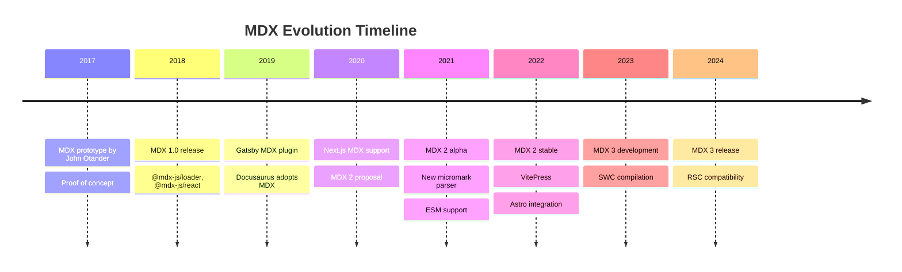
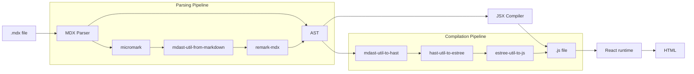
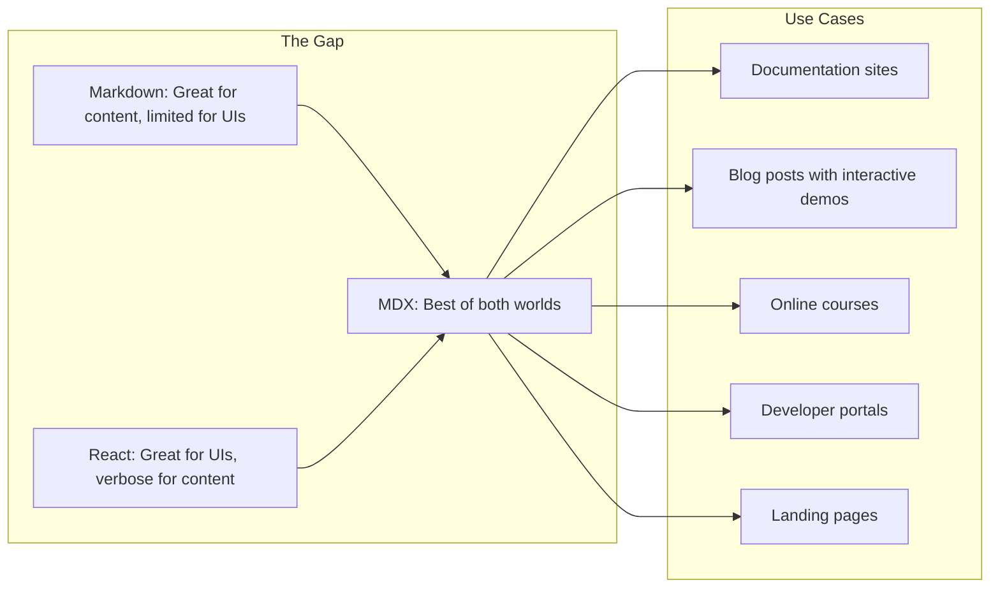
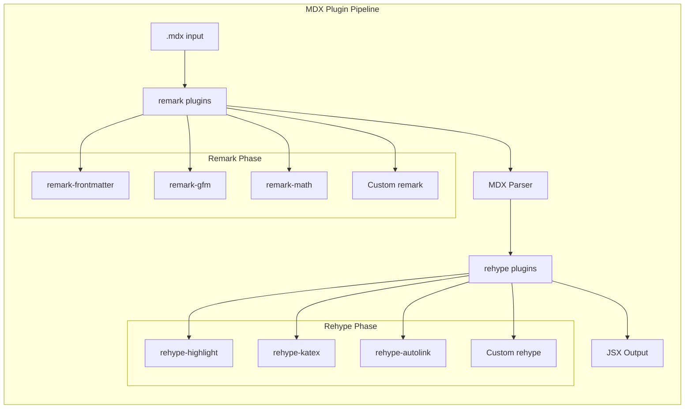

# Module 10: MDX Masterclass

> **Duration:** 5 hours | **Level:** Advanced | **Prerequisites:** Modules 1-8, basic React knowledge

---

## 10.1 Introduction to MDX

### 10.1.1 What Is MDX?

MDX is a format that lets you seamlessly use JSX in Markdown documents. You can import components, embed interactive content, and treat Markdown as a full-fledged templating language.

```
MDX = Markdown + JSX
```

**Simple Example:**

```mdx
# Hello, MDX!

This is **Markdown** with embedded React components.

import { Button } from '../components/Button'

<Button variant="primary" onClick={() => alert('Hi!')}>
  Click me!
</Button>
```

**Comparison Table:**

| Feature | MDX | Plain Markdown | JSX |
|---------|-----|----------------|-----|
| JSX support | Built-in | None | Native |
| Component imports | Yes | No | Yes |
| Dynamic content | Yes | No | Yes |
| Interactive elements | Yes | No | Yes |
| Content writing | Natural | Best | Verbose |
| Learning curve | Low-Med | Low | Med-High |
| File extension | .mdx | .md | .jsx/.tsx |
| Best for | Rich docs | Simple docs | Complex UIs |

### 10.1.2 History of MDX



### 10.1.3 How MDX Works



**Compilation Process:**

1. **Parse** - Markdown is parsed into an MDAST (Markdown AST) using micromark
2. **Transform** - MDX-specific nodes (JSX, import/export) are added to the AST
3. **Serialize** - The AST is compiled into a JavaScript module
4. **Render** - The JavaScript module is executed by React to produce HTML

### 10.1.4 Why MDX Exists



---

## 10.2 Setting Up MDX

### 10.2.1 Next.js with MDX

**Installation:**

```bash
npx create-next-app@latest my-docs --typescript
cd my-docs
npm install @next/mdx @mdx-js/loader @mdx-js/react
```

**Configuration (next.config.mjs):**

```javascript
import createMDX from '@next/mdx'

const nextConfig = {
  pageExtensions: ['js', 'jsx', 'ts', 'tsx', 'md', 'mdx'],
}

const withMDX = createMDX({
  extension: /\.mdx?$/,
  options: {
    remarkPlugins: [],
    rehypePlugins: [],
  },
})

export default withMDX(nextConfig)
```

**MDX Components Registration:**

```typescript
// app/mdx-components.tsx
import type { MDXComponents } from 'mdx/types'

export function useMDXComponents(components: MDXComponents): MDXComponents {
  return {
    h1: ({ children }) => (
      <h1 className="text-4xl font-bold mb-6">{children}</h1>
    ),
    h2: ({ children }) => (
      <h2 className="text-3xl font-semibold mb-4 mt-8">{children}</h2>
    ),
    code: ({ children }) => (
      <code className="bg-gray-100 rounded px-2 py-1 text-sm">
        {children}
      </code>
    ),
    pre: ({ children }) => (
      <pre className="bg-gray-900 text-white rounded-lg p-4 overflow-x-auto">
        {children}
      </pre>
    ),
    ...components,
  }
}
```

**MDX Page in App Router:**

```mdx
---
title: Getting Started
description: Learn how to install and configure the app
---

import { Button, Callout } from '@/components'

export const metadata = {
  title: 'Getting Started',
  description: 'Learn how to install and configure the app',
}

# Getting Started

<Callout type="info">
  This guide assumes you have Node.js 18+ installed.
</Callout>

## Installation

```bash
npm install my-app
```

<Button onClick={() => console.log('clicked')}>
  Get Started
</Button>
```

### 10.2.2 VitePress with MDX

```bash
npm create vitepress@latest my-docs
cd my-docs
npm install @mdx-js/rollup
```

```typescript
// .vitepress/config.ts
import { defineConfig } from 'vitepress'
import mdx from '@mdx-js/rollup'

export default defineConfig({
  title: 'My Docs',
  vite: {
    plugins: [mdx()],
  },
})
```

### 10.2.3 Docusaurus (MDX by Default)

```bash
npx create-docusaurus@latest my-docs classic
```

Docusaurus uses MDX natively:

```mdx
---
sidebar_position: 1
---

import Tabs from '@theme/Tabs'
import TabItem from '@theme/TabItem'

<Tabs>
  <TabItem value="npm" label="npm" default>
    ```bash
    npm install my-package
    ```
  </TabItem>
  <TabItem value="yarn" label="yarn">
    ```bash
    yarn add my-package
    ```
  </TabItem>
</Tabs>
```

### 10.2.4 Astro with MDX

```bash
npm create astro@latest my-docs
cd my-docs
npx astro add mdx
```

```astro
---
import Layout from '../../layouts/DocLayout.astro'
import Callout from '../../components/Callout.astro'
---

<Layout title="Installation Guide">

# Installation Guide

<Callout type="tip">
  Make sure you have Node.js 18+ installed.
</Callout>

</Layout>
```

### 10.2.5 Manual Vite Setup

```typescript
// vite.config.ts
import { defineConfig } from 'vite'
import react from '@vitejs/plugin-react'
import mdx from '@mdx-js/rollup'

export default defineConfig({
  plugins: [react(), mdx()],
})
```

### 10.2.6 Manual Webpack Setup

```javascript
// webpack.config.js
module.exports = {
  module: {
    rules: [
      {
        test: /\.mdx?$/,
        use: ['babel-loader', '@mdx-js/loader'],
      },
    ],
  },
}
```

### 10.2.7 Framework Comparison

| Feature | Next.js | VitePress | Docusaurus | Astro |
|---------|---------|-----------|------------|-------|
| MDX Support | Plugin | Plugin | Native | Plugin |
| Framework | React | Vue | React | Multi |
| Static Generation | Yes | Yes | Yes | Yes |
| Server Components | Yes | No | No | Yes |
| i18n | Manual | Built-in | Built-in | Built-in |
| Versioning | Manual | No | Built-in | Manual |
| Search | Manual | Built-in | Built-in | Plugin |
| Bundle Size | Larger | Smaller | Medium | Minimal |

---

## 10.3 React Inside Markdown

### 10.3.1 Importing Components

**Named Imports:**

```mdx
import { Button, Card, Alert } from '../components/UI'

# Components Demo

<Alert type="warning">
  Warning: This feature is experimental.
</Alert>

<Card title="Feature Overview">
  <p>This card contains mixed content.</p>
  <Button variant="primary">Learn More</Button>
</Card>
```

**Default Imports:**

```mdx
import Layout from '../layouts/DocLayout'

<Layout title="Getting Started">
  <h1>Welcome</h1>
  <p>Content inside the layout.</p>
</Layout>
```

**Namespace Imports:**

```mdx
import * as Icons from '../components/Icons'
import * as Forms from '../components/Forms'

<Icons.Settings className="w-6 h-6" />
<Forms.Input name="email" type="email" />
```

**Dynamic Imports:**

```mdx
import dynamic from 'next/dynamic'

const Chart = dynamic(() => import('../components/Chart'), {
  loading: () => <p>Loading chart...</p>,
  ssr: false,
})

<Chart data={salesData} type="line" />
```

### 10.3.2 Using JSX in Markdown

**Inline JSX Elements:**

```mdx
# Product Page

<span className="badge badge-new">New!</span>

<div className="grid grid-cols-2 gap-4">
  <div className="product-card">
    <h3>Basic Plan</h3>
    <p className="price">$9/month</p>
  </div>
  <div className="product-card">
    <h3>Pro Plan</h3>
    <p className="price">$29/month</p>
  </div>
</div>
```

**Conditional Rendering:**

```mdx
import { useUser } from '../hooks/useUser'

# Welcome

{isLoggedIn ? (
  <p>Welcome back, {user.name}!</p>
) : (
  <a href="/login">Sign in</a>
)}
```

**Mapping Over Data:**

```mdx
import { FeatureList, FeatureItem } from '../components'

# Features

<FeatureList>
  {features.map(feature => (
    <FeatureItem
      key={feature.id}
      icon={feature.icon}
      title={feature.title}
    />
  ))}
</FeatureList>
```

### 10.3.3 Global Component Registration

```typescript
// app/mdx-components.tsx
import type { MDXComponents } from 'mdx/types'
import Callout from '../components/Callout'
import Steps from '../components/Steps'
import Tabs from '../components/Tabs'

export function useMDXComponents(components: MDXComponents): MDXComponents {
  return {
    Callout,
    Steps,
    Tabs,
    h1: ({ children }) => (
      <h1 className="text-4xl font-bold mb-6">{children}</h1>
    ),
    a: ({ href, children }) => (
      <a href={href} className="text-blue-600 hover:underline">
        {children}
      </a>
    ),
    img: ({ src, alt }) => (
      <Image src={src} alt={alt} width={800} height={400} />
    ),
    ...components,
  }
}
```

---

## 10.4 Components Inside Markdown

### 10.4.1 Callout / Note Component

```tsx
// components/Callout.tsx
import { ReactNode } from 'react'

type CalloutType = 'info' | 'warning' | 'danger' | 'tip'

interface CalloutProps {
  type: CalloutType
  children: ReactNode
}

const styles: Record<CalloutType, {
  bg: string; border: string; icon: string
}> = {
  info:    { bg: 'bg-blue-50',   border: 'border-blue-400', icon: 'i' },
  warning: { bg: 'bg-yellow-50', border: 'border-yellow-400', icon: '!' },
  danger:  { bg: 'bg-red-50',    border: 'border-red-400', icon: 'X' },
  tip:     { bg: 'bg-green-50',  border: 'border-green-400', icon: '*' },
}

export function Callout({ type, children }: CalloutProps) {
  const s = styles[type]
  return (
    <div className={`${s.bg} border-l-4 ${s.border} p-4 my-4 rounded-r-lg`}>
      <div className="flex items-start gap-2">
        <span className="font-bold text-lg">{s.icon}</span>
        <div>{children}</div>
      </div>
    </div>
  )
}
```

**Usage:**

```mdx
import { Callout } from '../components/Callout'

<Callout type="warning">
  **Important:** This feature requires authentication.
  Make sure you have an API key before proceeding.
</Callout>

<Callout type="tip">
  You can also use `useSWR` for data fetching.
</Callout>
```

### 10.4.2 CodeBlock Component

```tsx
// components/CodeBlock.tsx
'use client'
import { useState, ReactNode } from 'react'

interface CodeBlockProps {
  children: ReactNode
  language?: string
  showLineNumbers?: boolean
  title?: string
}

export function CodeBlock({
  children, language = 'text',
  showLineNumbers = false, title,
}: CodeBlockProps) {
  const [copied, setCopied] = useState(false)

  const handleCopy = async () => {
    const code = typeof children === 'string' ? children : ''
    await navigator.clipboard.writeText(code)
    setCopied(true)
    setTimeout(() => setCopied(false), 2000)
  }

  const codeLines = typeof children === 'string'
    ? children.split('\n') : []

  return (
    <div className="rounded-lg overflow-hidden border my-4">
      {title && (
        <div className="bg-gray-800 text-gray-200 px-4 py-2 text-sm font-mono flex justify-between">
          <span>{title}</span>
          <span className="text-xs text-gray-400">{language}</span>
        </div>
      )}
      <div className="relative">
        <pre className="bg-gray-900 text-gray-100 p-4 overflow-x-auto text-sm">
          <code>
            {showLineNumbers
              ? codeLines.map((line, i) => (
                  <span key={i} className="table-row">
                    <span className="table-cell text-gray-500 pr-4 text-right select-none w-8">
                      {i + 1}
                    </span>
                    <span className="table-cell">{line}</span>
                  </span>
                ))
              : children}
          </code>
        </pre>
        <button
          onClick={handleCopy}
          className="absolute top-2 right-2 px-3 py-1 text-xs bg-gray-700 text-gray-300 rounded hover:bg-gray-600"
        >
          {copied ? 'Copied!' : 'Copy'}
        </button>
      </div>
    </div>
  )
}
```

**Usage:**

```mdx
import { CodeBlock } from '../components/CodeBlock'

<CodeBlock language="javascript" showLineNumbers title="server.js">
{`import express from 'express'
const app = express()

app.get('/', (req, res) => {
  res.json({ message: 'Hello World' })
})

app.listen(3000)
`}
</CodeBlock>
```

### 10.4.3 Tabs Component

```tsx
// components/Tabs.tsx
'use client'
import { useState, ReactNode } from 'react'

interface Tab {
  label: string
  children: ReactNode
}

interface TabsProps {
  tabs: Tab[]
  defaultIndex?: number
}

export function Tabs({ tabs, defaultIndex = 0 }: TabsProps) {
  const [activeIndex, setActiveIndex] = useState(defaultIndex)

  return (
    <div className="my-4">
      <div className="flex border-b border-gray-200">
        {tabs.map((tab, index) => (
          <button
            key={index}
            onClick={() => setActiveIndex(index)}
            className={`px-4 py-2 text-sm font-medium transition-colors
              ${index === activeIndex
                ? 'border-b-2 border-blue-500 text-blue-600'
                : 'text-gray-500 hover:text-gray-700'
              }`}
          >
            {tab.label}
          </button>
        ))}
      </div>
      <div className="p-4 border border-t-0 border-gray-200 rounded-b-lg">
        {tabs[activeIndex].children}
      </div>
    </div>
  )
}
```

**Usage:**

```mdx
import { Tabs } from '../components/Tabs'

<Tabs
  tabs={[
    {
      label: 'npm',
      children: (
        <CodeBlock language="bash">
          {`npm install my-package`}
        </CodeBlock>
      ),
    },
    {
      label: 'yarn',
      children: (
        <CodeBlock language="bash">
          {`yarn add my-package`}
        </CodeBlock>
      ),
    },
    {
      label: 'pnpm',
      children: (
        <CodeBlock language="bash">
          {`pnpm add my-package`}
        </CodeBlock>
      ),
    },
  ]}
/>
```

### 10.4.4 Steps / Process Component

```tsx
// components/Steps.tsx
import { ReactNode, Children } from 'react'

interface StepsProps {
  children: ReactNode
}

export function Steps({ children }: StepsProps) {
  const items = Children.toArray(children)

  return (
    <div className="my-6">
      {items.map((child, index) => (
        <div key={index} className="flex gap-4 pb-8 relative">
          <div className="flex flex-col items-center">
            <div className="w-8 h-8 rounded-full bg-blue-600 text-white flex items-center justify-center text-sm font-bold z-10">
              {index + 1}
            </div>
            {index < items.length - 1 && (
              <div className="w-0.5 flex-1 bg-gray-300 mt-1" />
            )}
          </div>
          <div className="flex-1 pt-1">{child}</div>
        </div>
      ))}
    </div>
  )
}
```

**Usage:**

```mdx
import { Steps } from '../components/Steps'

<Steps>
  <div>
    ### Create a Project
    Run `npx create-next-app` to create a new Next.js project.
  </div>
  <div>
    ### Install Dependencies
    ```bash
    npm install @next/mdx @mdx-js/loader
    ```
  </div>
  <div>
    ### Configure MDX
    Add MDX configuration to `next.config.mjs`.
  </div>
</Steps>
```

### 10.4.5 PropsTable Component

```tsx
// components/PropsTable.tsx
interface PropDefinition {
  name: string
  type: string
  required: boolean
  default?: string
  description: string
}

interface PropsTableProps {
  props: PropDefinition[]
}

export function PropsTable({ props }: PropsTableProps) {
  return (
    <div className="overflow-x-auto my-6">
      <table className="min-w-full border-collapse border border-gray-200 text-sm">
        <thead>
          <tr className="bg-gray-50">
            <th className="border px-4 py-2 text-left font-semibold">Prop</th>
            <th className="border px-4 py-2 text-left font-semibold">Type</th>
            <th className="border px-4 py-2 text-left font-semibold">Required</th>
            <th className="border px-4 py-2 text-left font-semibold">Default</th>
            <th className="border px-4 py-2 text-left font-semibold">Description</th>
          </tr>
        </thead>
        <tbody>
          {props.map((prop) => (
            <tr key={prop.name} className="hover:bg-gray-50">
              <td className="border px-4 py-2 font-mono text-blue-600">{prop.name}</td>
              <td className="border px-4 py-2 font-mono text-purple-600">{prop.type}</td>
              <td className="border px-4 py-2">
                {prop.required
                  ? <span className="text-red-500">Yes</span>
                  : <span className="text-gray-400">No</span>
                }
              </td>
              <td className="border px-4 py-2 font-mono text-gray-500">{prop.default || '-'}</td>
              <td className="border px-4 py-2">{prop.description}</td>
            </tr>
          ))}
        </tbody>
      </table>
    </div>
  )
}
```

**Usage:**

```mdx
import { PropsTable } from '../components/PropsTable'

## Button Props

<PropsTable
  props={[
    {
      name: 'variant',
      type: "'primary' | 'secondary' | 'ghost'",
      required: false,
      default: 'primary',
      description: 'Visual style of the button',
    },
    {
      name: 'size',
      type: "'sm' | 'md' | 'lg'",
      required: false,
      default: 'md',
      description: 'Size of the button',
    },
    {
      name: 'children',
      type: 'ReactNode',
      required: true,
      description: 'Content to render inside the button',
    },
    {
      name: 'onClick',
      type: '() => void',
      required: false,
      description: 'Click handler function',
    },
  ]}
/>
```

### 10.4.6 Image with Zoom

```tsx
// components/ZoomImage.tsx
'use client'
import { useState } from 'react'
import Image from 'next/image'

interface ZoomImageProps {
  src: string
  alt: string
  width?: number
  height?: number
  caption?: string
}

export function ZoomImage({
  src, alt, width = 800, height = 400, caption,
}: ZoomImageProps) {
  const [zoomed, setZoomed] = useState(false)

  return (
    <>
      <figure className="my-6 cursor-pointer" onClick={() => setZoomed(true)}>
        <Image
          src={src} alt={alt} width={width} height={height}
          className="rounded-lg border border-gray-200 hover:opacity-95 transition-opacity"
        />
        {caption && (
          <figcaption className="text-center text-sm text-gray-500 mt-2">
            {caption}
          </figcaption>
        )}
      </figure>

      {zoomed && (
        <div
          className="fixed inset-0 bg-black/80 z-50 flex items-center justify-center p-8"
          onClick={() => setZoomed(false)}
        >
          <div className="relative max-w-5xl max-h-[90vh]">
            <Image src={src} alt={alt} width={1200} height={800}
              className="object-contain rounded-lg" />
            <button
              onClick={() => setZoomed(false)}
              className="absolute -top-4 -right-4 w-8 h-8 bg-white rounded-full flex items-center justify-center shadow-lg"
            >
              X
            </button>
          </div>
        </div>
      )}
    </>
  )
}
```

---

## 10.5 Interactive Documentation

### 10.5.1 Live Code Editor (react-live)

```tsx
// components/LiveEditor.tsx
'use client'
import { useState } from 'react'
import {
  LiveProvider, LiveEditor, LivePreview, LiveError,
} from 'react-live'

interface LiveCodeProps {
  code: string
  scope?: Record<string, unknown>
  title?: string
}

export function LiveCodeEditor({ code, scope = {}, title }: LiveCodeProps) {
  const [showEditor, setShowEditor] = useState(true)

  return (
    <div className="rounded-lg border border-gray-200 my-6 overflow-hidden">
      {title && (
        <div className="bg-gray-100 px-4 py-2 text-sm font-medium border-b flex justify-between">
          <span>{title}</span>
          <button
            onClick={() => setShowEditor(!showEditor)}
            className="text-xs text-blue-600 hover:text-blue-800"
          >
            {showEditor ? 'Hide Editor' : 'Show Editor'}
          </button>
        </div>
      )}

      <LiveProvider code={code} scope={scope}>
        <div className="grid grid-cols-1 md:grid-cols-2">
          {showEditor && (
            <div className="border-r border-gray-200">
              <LiveEditor
                className="text-sm font-mono p-4"
                style={{
                  fontFamily: '"Fira Code", "Fira Mono", monospace',
                  fontSize: '14px',
                }}
              />
            </div>
          )}
          <div className={`p-6 ${showEditor ? '' : 'col-span-2'}`}>
            <LivePreview />
            <LiveError className="text-red-500 text-sm mt-2 p-2 bg-red-50 rounded" />
          </div>
        </div>
      </LiveProvider>
    </div>
  )
}
```

**Usage:**

```mdx
import { LiveCodeEditor } from '../components/LiveEditor'

<LiveCodeEditor
  title="Interactive Counter"
  code={`
const Counter = () => {
  const [count, setCount] = React.useState(0)
  return (
    <div className="text-center">
      <p className="text-4xl font-bold mb-4">{count}</p>
      <button
        onClick={() => setCount(c => c + 1)}
        className="px-4 py-2 bg-blue-600 text-white rounded mx-2"
      >
        +
      </button>
      <button
        onClick={() => setCount(c => c - 1)}
        className="px-4 py-2 bg-red-600 text-white rounded mx-2"
      >
        -
      </button>
    </div>
  )
}
render(<Counter />)
  `}
/>
```

### 10.5.2 CodeSandbox Embedding

```tsx
// components/CodeSandbox.tsx
interface CodeSandboxProps {
  id: string
  title: string
  module?: string
  height?: number
}

export function CodeSandbox({
  id, title, module, height = 400,
}: CodeSandboxProps) {
  const src = `https://codesandbox.io/embed/${id}?fontsize=14&hidenavigation=1&theme=dark${
    module ? `&module=${encodeURIComponent(module)}` : ''
  }`

  return (
    <div className="my-6 rounded-lg overflow-hidden border">
      <iframe
        src={src}
        title={title}
        style={{ width: '100%', height: `${height}px`, border: 0 }}
        allow="accelerometer; camera; encrypted-media; geolocation; gyroscope; microphone; payment; usb"
        sandbox="allow-forms allow-modals allow-popups allow-same-origin allow-scripts"
      />
    </div>
  )
}
```

---

## 10.6 Dynamic Documentation

### 10.6.1 Data Fetching in MDX

**With Next.js getStaticProps:**

```mdx
---
title: API Reference
---

import { ApiTable } from '../components/ApiTable'

export async function getStaticProps() {
  const res = await fetch('https://api.example.com/openapi.json')
  const spec = await res.json()
  return { props: { spec } }
}

export default ({ spec }) => (
  <>
    <h1>API Reference</h1>
    <p>Auto-generated from OpenAPI specification.</p>
    {Object.entries(spec.paths).map(([path, methods]) => (
      <div key={path}>
        <h2>{path}</h2>
        {Object.entries(methods).map(([method, details]) => (
          <ApiTable key={method} method={method} path={path} details={details} />
        ))}
      </div>
    ))}
  </>
)
```

**With Server Components:**

```tsx
// app/docs/api/page.mdx
import { ApiTable } from '../../../components/ApiTable'

export const metadata = {
  title: 'API Reference',
}

# API Reference

<ApiTable />
```

### 10.6.2 Conditional Rendering

```mdx
---
platform: web
version: '2.0'
---

# Getting Started

{platform === 'web' ? (
  <p>Welcome to the web platform guide.</p>
) : platform === 'mobile' ? (
  <p>Welcome to the mobile platform guide.</p>
) : (
  <p>Welcome to the API guide.</p>
)}

## Installation

{platform === 'web' && (
  <CodeBlock language="bash">
    {`npm install my-sdk`}
  </CodeBlock>
)}

{platform === 'mobile' && (
  <CodeBlock language="bash">
    {`npm install my-sdk-mobile`}
  </CodeBlock>
)}
```

---

## 10.7 Reusable Documentation Components

### 10.7.1 Complete Component Library

```typescript
// components/index.ts
export { Callout } from './Callout'
export { CodeBlock } from './CodeBlock'
export { Tabs } from './Tabs'
export { Steps } from './Steps'
export { PropsTable } from './PropsTable'
export { ZoomImage } from './ZoomImage'
export { LiveCodeEditor } from './LiveCodeEditor'
export { ApiExplorer } from './ApiExplorer'
export { ApiTable } from './ApiTable'
export { Card } from './Card'
export { Accordion } from './Accordion'
export { CopyButton } from './CopyButton'
export { TableOfContents } from './TableOfContents'
export { PageHeader } from './PageHeader'
export { RelatedLinks } from './RelatedLinks'
export { FeedbackWidget } from './FeedbackWidget'
export { Breadcrumbs } from './Breadcrumbs'
export { VersionBadge } from './VersionBadge'
export { LanguageTabs } from './LanguageTabs'
export { Grid } from './Grid'
export { FAQ } from './FAQ'
export { Timeline } from './Timeline'
export { ComparisonTable } from './ComparisonTable'
export { Checklist } from './Checklist'
export { KeyboardShortcut } from './KeyboardShortcut'
export { StatusBadge } from './StatusBadge'
```

### 10.7.2 Accordion Component

```tsx
// components/Accordion.tsx
'use client'
import { useState, ReactNode } from 'react'

interface AccordionItem {
  title: string
  content: ReactNode
}

interface AccordionProps {
  items: AccordionItem[]
  allowMultiple?: boolean
}

export function Accordion({ items, allowMultiple = false }: AccordionProps) {
  const [openItems, setOpenItems] = useState<Set<number>>(new Set())

  const toggle = (index: number) => {
    setOpenItems(prev => {
      const next = new Set(allowMultiple ? prev : [])
      if (prev.has(index)) next.delete(index)
      else next.add(index)
      return next
    })
  }

  return (
    <div className="divide-y divide-gray-200 border rounded-lg my-6">
      {items.map((item, index) => (
        <div key={index}>
          <button
            onClick={() => toggle(index)}
            className="w-full flex justify-between items-center px-4 py-3 text-left hover:bg-gray-50"
          >
            <span className="font-medium">{item.title}</span>
            <span className={`transform transition-transform ${
              openItems.has(index) ? 'rotate-180' : ''
            }`}>v</span>
          </button>
          {openItems.has(index) && (
            <div className="px-4 py-3 text-sm text-gray-600 border-t">
              {item.content}
            </div>
          )}
        </div>
      ))}
    </div>
  )
}
```

### 10.7.3 Component Architecture Diagram

```mermaid
graph TB
    subgraph Documentation Components
        direction TB
        A[Layout Components]
        B[Content Components]
        C[Interactive Components]
        D[Display Components]
        E[Utility Components]
    end

    subgraph Layout
        A1[PageHeader]
        A2[Breadcrumbs]
        A3[TableOfContents]
        A4[RelatedLinks]
        A5[FooterNav]
    end

    subgraph Content
        B1[Callout]
        B2[CodeBlock]
        B3[Card]
        B4[Accordion]
        B5[Steps]
        B6[FAQ]
    end

    subgraph Interactive
        C1[LiveEditor]
        C2[ApiExplorer]
        C3[Tabs]
        C4[ZoomImage]
        C5[CopyButton]
    end

    subgraph Display
        D1[PropsTable]
        D2[ApiTable]
        D3[ComparisonTable]
        D4[Timeline]
        D5[Grid]
    end

    subgraph Utility
        E1[VersionBadge]
        E2[StatusBadge]
        E3[KeyboardShortcut]
        E4[Checklist]
        E5[FeedbackWidget]
    end

    A --> A1 & A2 & A3 & A4 & A5
    B --> B1 & B2 & B3 & B4 & B5 & B6
    C --> C1 & C2 & C3 & C4 & C5
    D --> D1 & D2 & D3 & D4 & D5
    E --> E1 & E2 & E3 & E4 & E5
```



---

## 10.8 Documentation Applications

### 10.8.1 Doc Site Project Structure

```
my-docs/
  app/
    layout.tsx
    page.tsx
    mdx-components.tsx
    docs/
      layout.tsx
      getting-started/
        page.mdx
        installation.mdx
      api/
        page.mdx
  components/
    docs/
      Sidebar.tsx
      Search.tsx
      Navigation.tsx
    ui/
      Callout.tsx
      CodeBlock.tsx
      Tabs.tsx
  lib/
    docs.ts
    search.ts
```

### 10.8.2 Table of Contents Component

```tsx
// components/TableOfContents.tsx
'use client'
import { useEffect, useState } from 'react'

interface TocItem {
  id: string
  text: string
  level: number
}

export function TableOfContents() {
  const [items, setItems] = useState<TocItem[]>([])
  const [activeId, setActiveId] = useState('')

  useEffect(() => {
    const headings = document.querySelectorAll('h2, h3')
    setItems(
      Array.from(headings).map((h) => ({
        id: h.id,
        text: h.textContent || '',
        level: parseInt(h.tagName[1]),
      }))
    )

    const observer = new IntersectionObserver(
      (entries) => {
        entries.forEach((entry) => {
          if (entry.isIntersecting) setActiveId(entry.target.id)
        })
      },
      { rootMargin: '-80px 0px -80% 0px' }
    )

    headings.forEach((h) => observer.observe(h))
    return () => observer.disconnect()
  }, [])

  return (
    <nav className="sticky top-24 w-64 max-h-[calc(100vh-8rem)] overflow-y-auto">
      <h3 className="text-sm font-semibold mb-3">On This Page</h3>
      <ul className="space-y-2 text-sm">
        {items.map((item) => (
          <li key={item.id}
            style={{ paddingLeft: `${(item.level - 2) * 12}px` }}
          >
            <a
              href={`#${item.id}`}
              className={`block py-1 transition-colors ${
                activeId === item.id
                  ? 'text-blue-600 font-medium'
                  : 'text-gray-500 hover:text-gray-900'
              }`}
              onClick={(e) => {
                e.preventDefault()
                document.getElementById(item.id)?.scrollIntoView({ behavior: 'smooth' })
              }}
            >
              {item.text}
            </a>
          </li>
        ))}
      </ul>
    </nav>
  )
}
```

### 10.8.3 Search Dialog Component

```tsx
// components/Search.tsx
'use client'
import { useState, useRef, useEffect } from 'react'

interface SearchResult {
  title: string
  description: string
  url: string
  category: string
}

export function SearchDialog() {
  const [query, setQuery] = useState('')
  const [results, setResults] = useState<SearchResult[]>([])
  const [open, setOpen] = useState(false)
  const inputRef = useRef<HTMLInputElement>(null)

  useEffect(() => {
    const handleKeyDown = (e: KeyboardEvent) => {
      if ((e.metaKey || e.ctrlKey) && e.key === 'k') {
        e.preventDefault()
        setOpen(true)
      }
      if (e.key === 'Escape') setOpen(false)
    }
    document.addEventListener('keydown', handleKeyDown)
    return () => document.removeEventListener('keydown', handleKeyDown)
  }, [])

  useEffect(() => {
    if (open) inputRef.current?.focus()
  }, [open])

  useEffect(() => {
    if (query.length < 2) { setResults([]); return }

    const timer = setTimeout(async () => {
      const res = await fetch(`/api/search?q=${encodeURIComponent(query)}`)
      const data = await res.json()
      setResults(data.results)
    }, 300)
    return () => clearTimeout(timer)
  }, [query])

  if (!open) return null

  return (
    <div className="fixed inset-0 z-50 flex items-start justify-center pt-[15vh]">
      <div className="fixed inset-0 bg-black/50" onClick={() => setOpen(false)} />
      <div className="relative w-full max-w-lg bg-white rounded-xl shadow-2xl border overflow-hidden">
        <div className="flex items-center gap-3 px-4 py-3 border-b">
          <input
            ref={inputRef}
            type="text"
            placeholder="Search documentation..."
            value={query}
            onChange={(e) => setQuery(e.target.value)}
            className="flex-1 outline-none text-sm"
          />
          <kbd className="text-xs text-gray-400 bg-gray-100 px-2 py-0.5 rounded">ESC</kbd>
        </div>

        {results.length > 0 && (
          <div className="max-h-80 overflow-y-auto p-2">
            {results.map((r, i) => (
              <a key={i} href={r.url}
                className="block px-3 py-2 rounded-lg hover:bg-gray-50"
                onClick={() => setOpen(false)}
              >
                <span className="text-xs font-medium text-blue-600 bg-blue-50 px-1.5 py-0.5 rounded">
                  {r.category}
                </span>
                <p className="text-sm font-medium mt-1">{r.title}</p>
                <p className="text-xs text-gray-500 line-clamp-1">{r.description}</p>
              </a>
            ))}
          </div>
        )}

        {query.length >= 2 && results.length === 0 && (
          <div className="p-6 text-center text-sm text-gray-500">
            No results found for "{query}"
          </div>
        )}
      </div>
    </div>
  )
}
```

---

## 10.9 Course Platforms

### 10.9.1 Lesson Component

```tsx
// components/course/Lesson.tsx
interface LessonProps {
  title: string
  duration: string
  objectives: string[]
  children: React.ReactNode
}

export function Lesson({ title, duration, objectives, children }: LessonProps) {
  return (
    <article className="max-w-3xl mx-auto">
      <header className="mb-8">
        <h1 className="text-3xl font-bold mb-2">{title}</h1>
        <div className="flex items-center gap-3 text-sm text-gray-500 mb-4">
          <span>Duration: {duration}</span>
        </div>
        <div className="bg-blue-50 border-l-4 border-blue-400 p-4 rounded-r-lg">
          <h3 className="font-semibold text-sm text-blue-800 mb-2">
            Learning Objectives
          </h3>
          <ul className="list-disc list-inside text-sm text-blue-700 space-y-1">
            {objectives.map((obj, i) => (
              <li key={i}>{obj}</li>
            ))}
          </ul>
        </div>
      </header>
      <div className="prose prose-lg max-w-none">{children}</div>
    </article>
  )
}
```

### 10.9.2 Quiz Component

```tsx
// components/course/Quiz.tsx
'use client'
import { useState } from 'react'

interface QuizQuestion {
  question: string
  options: string[]
  correctAnswer: number
  explanation: string
}

interface QuizProps {
  title: string
  questions: QuizQuestion[]
}

export function Quiz({ title, questions }: QuizProps) {
  const [answers, setAnswers] = useState<Record<number, number>>({})
  const [submitted, setSubmitted] = useState(false)

  const score = questions.reduce(
    (acc, q, i) => acc + (answers[i] === q.correctAnswer ? 1 : 0),
    0
  )

  return (
    <div className="my-8 p-6 border rounded-lg">
      <h2 className="text-xl font-bold mb-6">{title}</h2>

      {questions.map((q, qi) => (
        <div key={qi} className="mb-6">
          <p className="font-medium mb-3">{qi + 1}. {q.question}</p>
          <div className="space-y-2">
            {q.options.map((opt, oi) => (
              <label key={oi}
                className={`flex items-center gap-3 p-3 rounded-lg border cursor-pointer
                  ${submitted
                    ? oi === q.correctAnswer
                      ? 'border-green-400 bg-green-50'
                      : answers[qi] === oi
                        ? 'border-red-400 bg-red-50'
                        : 'border-gray-200'
                    : 'border-gray-200 hover:bg-gray-50'
                  }`}
              >
                <input
                  type="radio" name={`q-${qi}`} value={oi}
                  checked={answers[qi] === oi}
                  onChange={() => setAnswers(prev => ({ ...prev, [qi]: oi }))}
                  disabled={submitted}
                />
                <span className="text-sm">{opt}</span>
              </label>
            ))}
          </div>
          {submitted && (
            <div className="mt-2 p-3 bg-gray-50 rounded text-sm text-gray-600">
              {q.explanation}
            </div>
          )}
        </div>
      ))}

      <div className="flex items-center justify-between mt-6 pt-6 border-t">
        <button
          onClick={() => setSubmitted(true)}
          disabled={Object.keys(answers).length !== questions.length}
          className="px-6 py-2 bg-blue-600 text-white rounded-lg hover:bg-blue-700 disabled:opacity-50"
        >
          Submit
        </button>
        {submitted && (
          <div className="text-right">
            <p className="text-lg font-bold">Score: {score}/{questions.length}</p>
          </div>
        )}
      </div>
    </div>
  )
}
```

### 10.9.3 Code Exercise Component

```tsx
// components/course/CodeExercise.tsx
'use client'
import { useState } from 'react'

interface CodeExerciseProps {
  initialCode: string
  solution: string
  tests: string
  title?: string
}

export function CodeExercise({
  initialCode, solution, tests, title,
}: CodeExerciseProps) {
  const [code, setCode] = useState(initialCode)
  const [output, setOutput] = useState<string | null>(null)
  const [passed, setPassed] = useState(false)

  const runTests = () => {
    try {
      const fn = new Function('userCode', `
        ${tests}
        return runTests(userCode)
      `)
      const result = fn(code)
      setOutput(result.message)
      setPassed(result.passed)
    } catch (err) {
      setOutput(`Error: ${(err as Error).message}`)
      setPassed(false)
    }
  }

  return (
    <div className="my-6 rounded-lg border overflow-hidden">
      {title && (
        <div className="bg-gray-800 text-white px-4 py-2 text-sm font-medium">
          {title}
        </div>
      )}
      <textarea
        value={code}
        onChange={(e) => setCode(e.target.value)}
        className="w-full p-4 font-mono text-sm bg-gray-900 text-gray-100"
        rows={8}
      />
      <div className="flex items-center gap-3 p-3 bg-gray-50 border-t">
        <button onClick={runTests}
          className="px-4 py-1.5 bg-green-600 text-white rounded text-sm hover:bg-green-700"
        >
          Run Tests
        </button>
        <button onClick={() => { setCode(solution); setOutput(null); setPassed(false) }}
          className="px-4 py-1.5 bg-gray-600 text-white rounded text-sm hover:bg-gray-700"
        >
          Show Solution
        </button>
      </div>
      {output && (
        <div className={`p-3 text-sm ${
          passed ? 'bg-green-50 text-green-800' : 'bg-red-50 text-red-800'
        }`}>
          {passed ? 'PASS: ' : 'FAIL: '}{output}
        </div>
      )}
    </div>
  )
}
```

---

## 10.10 Developer Portals

### 10.10.1 API Key Manager

```tsx
// components/portal/ApiKeys.tsx
'use client'
import { useState } from 'react'

interface ApiKey {
  id: string
  name: string
  key: string
  created: string
  lastUsed: string
  status: 'active' | 'revoked'
}

export function ApiKeyManager() {
  const [keys, setKeys] = useState<ApiKey[]>([
    {
      id: '1', name: 'Production',
      key: 'sk_live_abc123...',
      created: '2025-01-15', lastUsed: '2025-03-20',
      status: 'active',
    },
    {
      id: '2', name: 'Development',
      key: 'sk_test_def456...',
      created: '2025-02-01', lastUsed: '2025-03-19',
      status: 'active',
    },
  ])
  const [showForm, setShowForm] = useState(false)
  const [newName, setNewName] = useState('')

  const createKey = () => {
    setKeys([...keys, {
      id: String(Date.now()),
      name: newName,
      key: `sk_${Math.random().toString(36).substring(2, 15)}...`,
      created: new Date().toISOString().split('T')[0],
      lastUsed: 'Never',
      status: 'active',
    }])
    setNewName('')
    setShowForm(false)
  }

  return (
    <div className="space-y-6">
      <div className="flex items-center justify-between">
        <div>
          <h2 className="text-xl font-bold">API Keys</h2>
          <p className="text-sm text-gray-500">Manage API keys for authentication</p>
        </div>
        <button onClick={() => setShowForm(true)}
          className="px-4 py-2 bg-blue-600 text-white rounded-lg hover:bg-blue-700 text-sm"
        >
          + Create Key
        </button>
      </div>

      {showForm && (
        <div className="p-4 border rounded-lg bg-gray-50">
          <label className="block text-sm font-medium mb-2">Key Name</label>
          <div className="flex gap-2">
            <input type="text" value={newName}
              onChange={(e) => setNewName(e.target.value)}
              placeholder="e.g., Production"
              className="flex-1 px-3 py-2 border rounded text-sm"
              onKeyDown={(e) => e.key === 'Enter' && createKey()}
            />
            <button onClick={createKey}
              className="px-4 py-2 bg-blue-600 text-white rounded text-sm"
            >Create</button>
            <button onClick={() => setShowForm(false)}
              className="px-4 py-2 text-gray-600 rounded text-sm hover:bg-gray-200"
            >Cancel</button>
          </div>
        </div>
      )}

      <div className="border rounded-lg overflow-hidden">
        <table className="w-full text-sm">
          <thead className="bg-gray-50">
            <tr>
              <th className="text-left px-4 py-3 font-medium">Name</th>
              <th className="text-left px-4 py-3 font-medium">Key</th>
              <th className="text-left px-4 py-3 font-medium">Created</th>
              <th className="text-left px-4 py-3 font-medium">Status</th>
              <th className="text-right px-4 py-3 font-medium">Actions</th>
            </tr>
          </thead>
          <tbody className="divide-y">
            {keys.map((key) => (
              <tr key={key.id} className="hover:bg-gray-50">
                <td className="px-4 py-3 font-medium">{key.name}</td>
                <td className="px-4 py-3 font-mono text-gray-500">{key.key}</td>
                <td className="px-4 py-3 text-gray-500">{key.created}</td>
                <td className="px-4 py-3">
                  <span className={`inline-flex px-2 py-1 text-xs font-medium rounded-full
                    ${key.status === 'active'
                      ? 'bg-green-100 text-green-700'
                      : 'bg-red-100 text-red-700'
                    }`}>
                    {key.status}
                  </span>
                </td>
                <td className="px-4 py-3 text-right">
                  <button className="text-red-600 hover:text-red-800 text-xs">Revoke</button>
                </td>
              </tr>
            ))}
          </tbody>
        </table>
      </div>
    </div>
  )
}
```

### 10.10.2 Rate Limit Visualizer

```tsx
// components/portal/RateLimitVisualizer.tsx
'use client'
import { useState } from 'react'

export function RateLimitVisualizer() {
  const [requests, setRequests] = useState<number[]>([])
  const [remaining, setRemaining] = useState(100)
  const limit = 100

  const makeRequest = () => {
    const now = Date.now()
    setRequests(prev => {
      const recent = prev.filter(t => now - t < 60000)
      const updated = [...recent, now]
      setRemaining(Math.max(0, limit - updated.length))
      return updated
    })
  }

  const fillLevel = ((limit - remaining) / limit) * 100

  return (
    <div className="p-6 border rounded-lg my-6">
      <h3 className="text-lg font-bold mb-4">Rate Limit Simulator</h3>

      <div className="mb-6">
        <div className="flex justify-between text-sm mb-1">
          <span>Used: {limit - remaining}</span>
          <span>Limit: {limit}/minute</span>
        </div>
        <div className="h-4 bg-gray-200 rounded-full overflow-hidden">
          <div className={`h-full transition-all duration-500 rounded-full ${
            fillLevel > 80 ? 'bg-red-500' : fillLevel > 50 ? 'bg-yellow-500' : 'bg-green-500'
          }`} style={{ width: `${fillLevel}%` }} />
        </div>
        <p className="text-right mt-1">
          <span className={`text-sm font-bold ${remaining === 0 ? 'text-red-600' : 'text-green-600'}`}>
            {remaining} remaining
          </span>
        </p>
      </div>

      <button onClick={makeRequest} disabled={remaining === 0}
        className="px-4 py-2 bg-blue-600 text-white rounded hover:bg-blue-700 disabled:opacity-50"
      >
        Make Request
      </button>
      <button onClick={() => { setRequests([]); setRemaining(limit) }}
        className="ml-2 px-4 py-2 bg-gray-200 text-gray-700 rounded hover:bg-gray-300"
      >
        Reset
      </button>

      {remaining === 0 && (
        <div className="mt-4 p-3 bg-red-50 border border-red-200 rounded text-sm text-red-700">
          Rate limit exceeded. Wait 60 seconds for the window to reset.
        </div>
      )}
    </div>
  )
}
```

---

## 10.11 Custom MDX Plugins

### 10.11.1 Remark Plugins

Remark plugins operate on the Markdown AST (mdast) before JSX compilation.

**remark-frontmatter:**

```javascript
// next.config.mjs
import createMDX from '@next/mdx'
import remarkFrontmatter from 'remark-frontmatter'
import remarkGfm from 'remark-gfm'

const withMDX = createMDX({
  options: {
    remarkPlugins: [
      remarkFrontmatter,
      remarkGfm,
    ],
  },
})
```

**remark-gfm (GitHub Flavored Markdown):**

Adds support for:
- Tables
- Task lists
- Strikethrough
- Autolinks
- Footnotes

**Custom Remark Plugin:**

```javascript
// plugins/remark-custom-heading-id.js
import { visit } from 'unist-util-visit'

export function remarkCustomHeadingId() {
  return (tree) => {
    visit(tree, 'heading', (node) => {
      const lastChild = node.children[node.children.length - 1]
      if (lastChild && lastChild.type === 'text') {
        const match = lastChild.value.match(/\s*\{#([^}]+)\}$/)
        if (match) {
          node.data = {
            ...node.data,
            id: match[1],
            hProperties: { id: match[1] },
          }
          lastChild.value = lastChild.value.slice(0, -match[0].length)
        }
      }
    })
  }
}
```

**Usage:**

```mdx
## My Custom Heading {#custom-id}

This heading will have id="custom-id"
```

**Another Custom Plugin - Auto-Section Numbers:**

```javascript
// plugins/remark-section-numbers.js
import { visit } from 'unist-util-visit'

export function remarkSectionNumbers() {
  return (tree) => {
    const counters = [0, 0, 0, 0, 0, 0]

    visit(tree, 'heading', (node) => {
      const depth = node.depth
      counters[depth - 1]++
      // Reset lower-level counters
      for (let i = depth; i < 6; i++) counters[i] = 0

      const prefix = counters.slice(0, depth).join('.')
      const textNode = node.children[0]
      if (textNode && textNode.type === 'text') {
        textNode.value = `${prefix} ${textNode.value}`
      }
    })
  }
}
```

### 10.11.2 Rehype Plugins

Rehype plugins operate on the HTML AST (hast) after compilation.

**rehype-highlight:**

```javascript
import rehypeHighlight from 'rehype-highlight'

const withMDX = createMDX({
  options: {
    rehypePlugins: [rehypeHighlight],
  },
})
```

**rehype-katex (Math Rendering):**

```javascript
import rehypeKatex from 'rehype-katex'
import remarkMath from 'remark-math'

const withMDX = createMDX({
  options: {
    remarkPlugins: [remarkMath],
    rehypePlugins: [rehypeKatex],
  },
})
```

**Custom Rehype Plugin - External Link Handler:**

```javascript
// plugins/rehype-external-links.js
import { visit } from 'unist-util-visit'

export function rehypeExternalLinks(options = {}) {
  const { target = '_blank', rel = ['nofollow', 'noopener', 'noreferrer'] } = options

  return (tree) => {
    visit(tree, 'element', (node) => {
      if (node.tagName === 'a' && node.properties?.href) {
        const href = node.properties.href
        if (href.startsWith('http') && !href.includes(process.env.SITE_URL || '')) {
          node.properties.target = target
          node.properties.rel = rel.join(' ')
        }
      }
    })
  }
}
```

**Custom Rehype Plugin - Responsive Tables:**

```javascript
// plugins/rehype-responsive-tables.js
import { visit } from 'unist-util-visit'

export function rehypeResponsiveTables() {
  return (tree) => {
    visit(tree, 'element', (node) => {
      if (node.tagName === 'table') {
        node.properties.className = 'responsive-table'
        // Wrap in container div
        const wrapper = {
          type: 'element',
          tagName: 'div',
          properties: { className: 'table-wrapper' },
          children: [{ ...node }],
        }
        Object.assign(node, wrapper)
      }
    })
  }
}
```

### 10.11.3 Plugin Architecture



### 10.11.4 Plugin Comparison

| Plugin | Type | Purpose | Popularity |
|--------|------|---------|------------|
| remark-frontmatter | Remark | YAML frontmatter parsing | Very High |
| remark-gfm | Remark | GFM tables, strikethrough, task lists | Very High |
| remark-math | Remark | Math/LaTeX in markdown | High |
| remark-slug | Remark | Auto-generate heading IDs | High |
| remark-autolink-headings | Remark | Linkable headings | High |
| rehype-highlight | Rehype | Syntax highlighting | Very High |
| rehype-prism | Rehype | Prism syntax highlighting | High |
| rehype-katex | Rehype | KaTeX math rendering | High |
| rehype-mathjax | Rehype | MathJax math rendering | Medium |
| rehype-autolink-headings | Rehype | Add anchor links to headings | High |

---

## 10.12 MDX Best Practices

### 10.12.1 Component Naming Conventions

| Convention | Example | Use Case |
|------------|---------|----------|
| PascalCase | `Callout`, `CodeBlock` | Custom components |
| camelCase props | `showLineNumbers` | Component props |
| Descriptive names | `ApiTable`, `PropsTable` | Self-documenting |
| Group by prefix | `DocCallout`, `DocTabs` | Namespace in globals |

### 10.12.2 Performance Optimization

```typescript
// Lazy load heavy components
import dynamic from 'next/dynamic'

const Chart = dynamic(() => import('../components/Chart'), {
  loading: () => <div className="animate-pulse h-64 bg-gray-200 rounded" />,
  ssr: false, // Disable SSR for browser-only components
})

const Mermaid = dynamic(() => import('../components/Mermaid'), {
  loading: () => <div className="animate-pulse h-96 bg-gray-200 rounded" />,
})
```

**Bundle Size Awareness:**

| Approach | Bundle Impact | Best For |
|----------|--------------|----------|
| Direct import | Included in bundle | Small, frequently used |
| Dynamic import | Code-split | Large, rarely used |
| SSR disabled | Client-only | Browser APIs |
| Preload | Loaded after page | Below-fold content |

### 10.12.3 File Organization

```
content/
  docs/
    _components/       # Page-specific components
      Button.mdx
    getting-started/
      _components/     # Section-specific components
        SetupWizard.mdx
      index.mdx
      installation.mdx
    api/
      _components/
        ApiPlayground.mdx
      reference.mdx

components/            # Shared components
  ui/
    Callout.tsx
    CodeBlock.tsx
    Tabs.tsx
    Steps.tsx
  docs/
    Sidebar.tsx
    Search.tsx
    Navigation.tsx
```

### 10.12.4 Testing MDX Components

```typescript
// components/__tests__/Callout.test.tsx
import { render, screen } from '@testing-library/react'
import { Callout } from '../Callout'

describe('Callout', () => {
  it('renders info callout', () => {
    render(<Callout type="info">Hello</Callout>)
    expect(screen.getByText('Hello')).toBeInTheDocument()
  })

  it('renders warning callout', () => {
    render(<Callout type="warning">Warning text</Callout>)
    expect(screen.getByText('Warning text')).toBeInTheDocument()
  })

  it('renders children content', () => {
    render(
      <Callout type="tip">
        <strong>Bold text</strong> and <em>italic text</em>
      </Callout>
    )
    expect(screen.getByText('Bold text')).toBeInTheDocument()
    expect(screen.getByText('italic text')).toBeInTheDocument()
  })
})
```

### 10.12.5 TypeScript with MDX

```typescript
// types/mdx.d.ts
declare module '*.mdx' {
  import type { ComponentType } from 'react'

  const MDXComponent: ComponentType<{
    [key: string]: unknown
  }>

  export default MDXComponent
  export const metadata: Record<string, unknown>
}

// components/MDXPage.tsx
import type { MDXComponents } from 'mdx/types'
import Callout from './Callout'

interface MDXPageProps {
  content: ComponentType<{
    components?: MDXComponents
  }>
}

export function MDXPage({ content: Content }: MDXPageProps) {
  return (
    <article className="prose max-w-none">
      <Content
        components={{
          Callout,
          h1: ({ children }) => (
            <h1 className="text-4xl font-bold">{children}</h1>
          ),
        }}
      />
    </article>
  )
}
```

---

## 10.13 Exercises

### Exercise 1: MDX Setup

Set up a Next.js project with MDX support. Create a simple MDX page that imports and renders a Callout component.

### Exercise 2: Callout Component

Build a Callout component with 4 variants (info, warning, danger, tip). Use it in an MDX page with different content types (text, lists, code blocks).

### Exercise 3: Tabs Component

Create a Tabs component for multi-language code examples. Use it to show installation instructions for npm, yarn, and pnpm.

### Exercise 4: CodeBlock with Copy

Build a CodeBlock component with:
- Syntax highlighting
- Copy-to-clipboard button
- Line numbers (optional toggle)
- Title bar

### Exercise 5: Live Code Editor

Create a live code editor using react-live. Add examples for:
- A counter component
- A todo list
- An API data display

### Exercise 6: API Explorer

Build an interactive API Explorer component that:
- Accepts an OpenAPI endpoint definition
- Renders input fields for parameters
- Executes requests and displays responses
- Shows proper error handling

### Exercise 7: Quiz Component

Create a Quiz component with:
- Multiple choice questions
- Score tracking
- Answer explanations
- Visual feedback (correct/incorrect)

### Exercise 8: Remark Plugin

Write a custom remark plugin that:
- Adds IDs to all headings
- Generates a table of contents
- Adds "copy link" anchors to headings

### Exercise 9: Documentation Site

Build a complete documentation site with:
- Sidebar navigation
- Search functionality
- Table of contents
- Version selector
- Multiple MDX pages with components

### Exercise 10: Course Platform

Create a course platform using MDX with:
- Lesson component with learning objectives
- Quiz component for assessments
- Code exercise component with validation
- Progress tracking
- Certificate generation page

---

## 10.14 Quiz

### Question 1

What does MDX stand for?

A) Markup Document XML
B) Markdown + JSX
C) Multi-Document Exchange
D) Modern Document Extension

<details>
<summary>Answer</summary>
**B.** MDX = Markdown + JSX
</details>

### Question 2

Which framework has MDX support built-in (no plugin required)?

A) Next.js
B) VitePress
C) Docusaurus
D) Astro

<details>
<summary>Answer</summary>
**C.** Docusaurus has native MDX support.
</details>

### Question 3

What is the purpose of remark plugins in the MDX pipeline?

A) To transform the HTML output
B) To operate on the Markdown AST before JSX compilation
C) To bundle the JavaScript output
D) To optimize images in the content

<details>
<summary>Answer</summary>
**B.** Remark plugins operate on the Markdown AST (mdast) before JSX compilation.
</details>

### Question 4

Which hook registers global components in Next.js MDX?

A) useMDXComponents()
B) registerComponents()
C) useMDX()
D) createMDXComponents()

<details>
<summary>Answer</summary>
**A.** useMDXComponents() registers global components in Next.js.
</details>

### Question 5

What is the correct way to import a component in an MDX file?

A) `#import Button from './Button'`
B) `import Button from './Button'`
C) `@import Button from './Button'`
D) `<import Button from './Button'>`

<details>
<summary>Answer</summary>
**B.** Standard ES import syntax is used: `import Button from './Button'`
</details>

### Question 6

Which library provides the LiveProvider, LiveEditor, and LivePreview components?

A) react-code-editor
B) react-live
C) live-code
D) sandpack

<details>
<summary>Answer</summary>
**B.** react-live provides these components for live code editing.
</details>

### Question 7

What is the difference between remark and rehype plugins?

A) Remark is for React, rehype is for Vue
B) Remark operates on Markdown AST, rehype operates on HTML AST
C) There is no difference
D) Remark is for images, rehype is for code

<details>
<summary>Answer</summary>
**B.** Remark operates on mdast (Markdown), rehype on hast (HTML).
</details>

### Question 8

Which method should be used for lazy-loading heavy MDX components?

A) import()
B) require()
C) dynamic() from next/dynamic
D) lazy() from react

<details>
<summary>Answer</summary>
**C.** dynamic() from next/dynamic handles lazy loading with SSR control.
</details>

### Question 9

What does the `ssr: false` option do in dynamic imports?

A) Disables server-side rendering for the component
B) Disables search engine rendering
C) Enables streaming server rendering
D) Disables static site generation

<details>
<summary>Answer</summary>
**A.** ssr: false disables server-side rendering for the component.
</details>

### Question 10

Which package provides syntax highlighting for rehype?

A) rehype-syntax
B) rehype-highlight
C) rehype-prism
D) Both B and C

<details>
<summary>Answer</summary>
**D.** Both rehype-highlight and rehype-prism provide syntax highlighting.
</details>

### Question 11

What is the file extension for MDX files?

A) .md
B) .mdx
C) .mjsx
D) .mjx

<details>
<summary>Answer</summary>
**B.** .mdx is the standard file extension for MDX.
</details>

### Question 12

Which MDX version introduced the new micromark parser?

A) MDX 1
B) MDX 2
C) MDX 3
D) MDX 4

<details>
<summary>Answer</summary>
**B.** MDX 2 introduced the micromark parser.
</details>

### Question 13

How do you add custom metadata to an MDX page in Next.js?

A) In a JSON file
B) Using the metadata export
C) In next.config.js
D) In a separate .meta file

<details>
<summary>Answer</summary>
**B.** MDX pages export a metadata object for page metadata.
</details>

### Question 14

What is the recommended way to organize reusable documentation components?

A) Inline them in each MDX file
B) In a shared components directory, exported from an index file
C) In a global window object
D) In CSS classes

<details>
<summary>Answer</summary>
**B.** Shared components should be in a dedicated directory with barrel exports.
</details>

### Question 15

Which of these is NOT a valid remark plugin?

A) remark-frontmatter
B) remark-gfm
C) remark-highlight
D) remark-math

<details>
<summary>Answer</summary>
**C.** remark-highlight does not exist; rehype-highlight is the correct plugin.
</details>

---

## 10.15 Interview Questions

### Question 1: What is MDX and why would you use it over plain Markdown?

MDX combines Markdown with JSX, allowing you to import and use React components directly in Markdown files. Use it when you need interactive elements, custom components, or dynamic content in your documentation, blogs, or course platforms. Plain Markdown is better for simple, static content.

### Question 2: Explain the MDX compilation pipeline.

The MDX compiler first parses the .mdx file into an AST using micromark (Markdown parser). Then remark plugins transform this AST. The AST is converted from mdast to hast (HTML AST), then to an estree (JS AST), and finally compiled into a JavaScript module that exports a React component.

### Question 3: How do you configure MDX in a Next.js project?

Install @next/mdx, @mdx-js/loader, and @mdx-js/react. Create a next.config.mjs that wraps your config with createMDX(). Add .mdx to pageExtensions. Create an app/mdx-components.tsx file that exports useMDXComponents() to register custom components globally.

### Question 4: What is the difference between remark and rehype plugins? Give examples of each.

Remark plugins operate on the Markdown AST (mdast) before compilation. Examples: remark-frontmatter (YAML parsing), remark-gfm (tables, strikethrough), remark-math (LaTeX). Rehype plugins operate on the HTML AST (hast) after compilation. Examples: rehype-highlight (syntax highlighting), rehype-katex (math rendering), rehype-autolink-headings.

### Question 5: How would you create an interactive documentation component that lets users modify and run code?

Use react-live which provides LiveProvider, LiveEditor, and LivePreview components. Wrap the code in a LiveProvider with the code as a string, let users edit it in LiveEditor, and see the result in LivePreview. You can pass additional scope (imported components) through the scope prop.

### Question 6: How do you handle performance optimization for MDX components?

Use dynamic imports for heavy components with next/dynamic, set ssr: false for browser-only components, implement lazy loading for below-fold content, and avoid importing large libraries in every MDX file. Profile bundle size regularly.

### Question 7: How would you implement a search feature for an MDX-based documentation site?

Create a SearchDialog component with a modal overlay triggered by Cmd+K. Index all MDX content at build time (generating a search index). On the client, query this index with fuzzy matching. Display results grouped by category with title and description snippets.

### Question 8: How do you handle multiple versions of documentation in MDX?

Use a versioning system in your URL structure (/docs/v1/, /docs/v2/). Maintain separate branches or directories for each version. For the build system, either deploy each version independently or use a runtime version switcher that loads the appropriate content. Docusaurus has built-in versioning for this.

### Question 9: How can you create a custom MDX component library for your documentation team?

Create a package of reusable components (Callout, CodeBlock, Tabs, Steps, PropsTable, etc.) with consistent styling. Export them from a barrel file. Document each component with usage examples. Publish as an npm package so all projects can install it. Use TypeScript for type safety and autocomplete.

### Question 10: How would you build a course platform using MDX?

Create lesson components with objectives, quiz components with scoring, code exercise components with validation, and progress tracking. Each lesson is an MDX file that imports these components. Use frontmatter for metadata (duration, difficulty, prerequisites). Implement a navigation system that tracks completion state.

---

> **Next Module:** Module 11: Documentation Websites — Build complete documentation sites with VitePress, Docusaurus, MkDocs, and Astro Starlight.

---

*End of Module 10*
