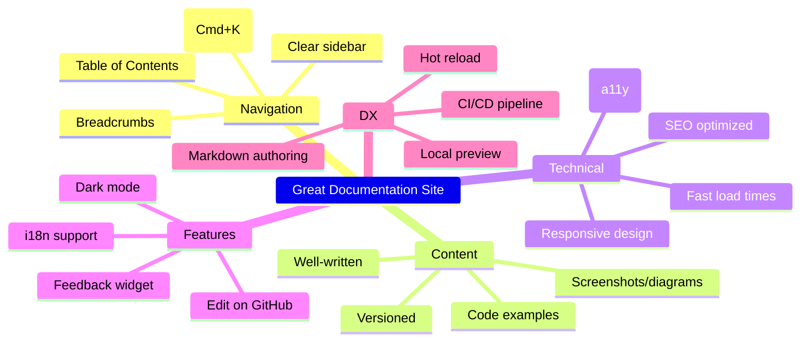
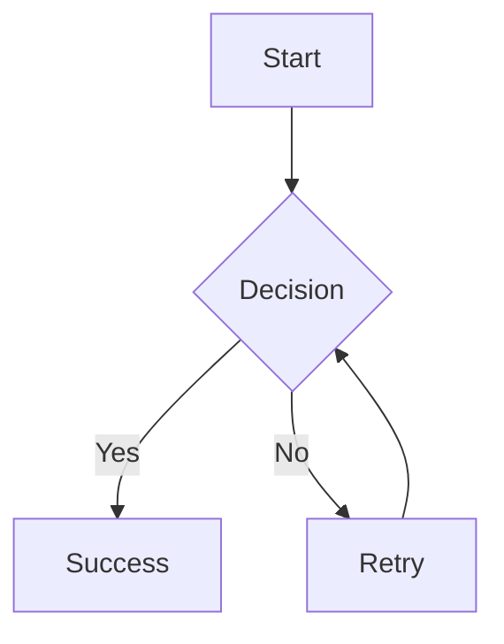
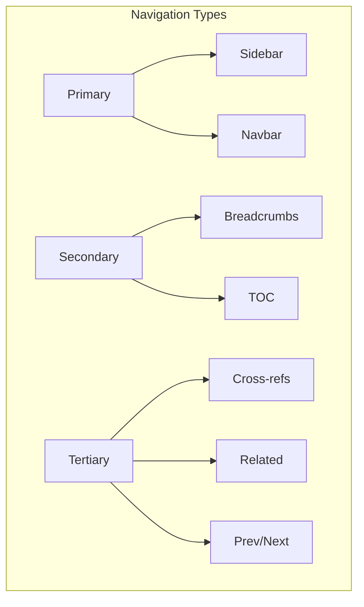
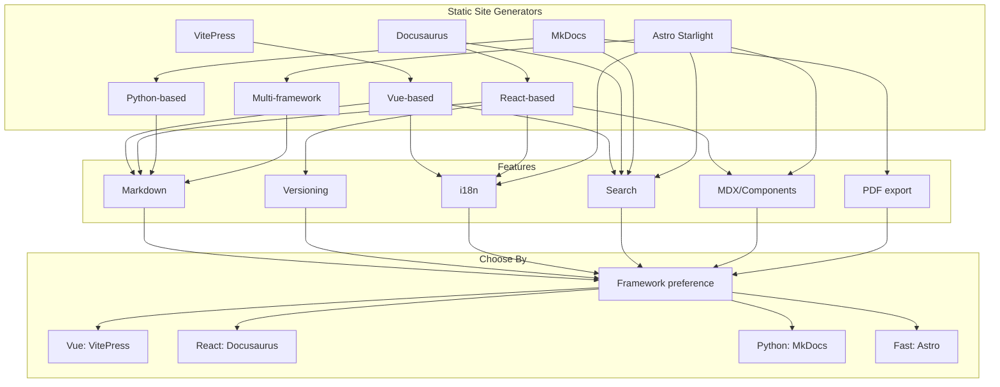

# Module 11: Documentation Websites

> **Duration:** 5 hours | **Level:** Intermediate | **Prerequisites:** Modules 1-10

---

## 11.1 Introduction to Documentation Websites

Documentation websites are specialized static sites designed to present technical content clearly and efficiently. They differ from general websites in their emphasis on search, navigation, readability, and versioning.

### 11.1.1 Types of Documentation Sites

| Type | Description | Example |
|------|-------------|---------|
| Product docs | User-facing documentation | stripe.com/docs |
| API reference | Auto-generated API docs | docs.github.com/en/rest |
| Knowledge base | Self-service support | support.atlassian.com |
| Developer portal | SDK docs, API keys, playground | developer.twitter.com |
| Course platform | Structured learning | learn.microsoft.com |
| Wiki | Community-editable | wiki.archlinux.org |
| Handbook | Internal processes | handbook.gitlab.com |

### 11.1.2 What Makes a Great Documentation Site



**Core Design Principles:**

| Principle | Description | Implementation |
|-----------|-------------|----------------|
| Findability | Users find what they need quickly | Search, navigation, cross-links |
| Readability | Content is easy to read | Typography, contrast, spacing |
| Consistency | Uniform patterns across pages | Components, templates, style guide |
| Performance | Pages load fast on all devices | SSG, CDN, optimized assets |
| Accessibility | Content works for everyone | Semantic HTML, ARIA, keyboard nav |
| Maintainability | Easy to update and extend | Markdown source, CI/CD, components |

---

## 11.2 VitePress (Vue.js)

VitePress is a Vue-powered static site generator focused on documentation. It is the successor to VuePress and features Vite for fast builds and HMR.

### 11.2.1 Setup

```bash
npm create vitepress@latest my-docs
cd my-docs
npm install
npm run dev
```

**Project Structure:**

```
my-docs/
  .vitepress/
    config.ts
    theme/
      index.ts
      custom.css
  public/
  src/
    index.md
    guide/
      getting-started.md
      configuration.md
    api/
      reference.md
  package.json
```

### 11.2.2 Configuration

```typescript
// .vitepress/config.ts
import { defineConfig } from 'vitepress'

export default defineConfig({
  title: 'My Documentation',
  description: 'Comprehensive documentation for My Product',

  themeConfig: {
    nav: [
      { text: 'Home', link: '/' },
      { text: 'Guide', link: '/guide/getting-started' },
      { text: 'API', link: '/api/reference' },
    ],

    sidebar: [
      {
        text: 'Getting Started',
        items: [
          { text: 'Introduction', link: '/guide/introduction' },
          { text: 'Installation', link: '/guide/installation' },
          { text: 'Quick Start', link: '/guide/quick-start' },
        ],
      },
      {
        text: 'Guides',
        items: [
          { text: 'Configuration', link: '/guide/configuration' },
          { text: 'Deployment', link: '/guide/deployment' },
        ],
      },
      {
        text: 'API Reference',
        items: [
          { text: 'Core API', link: '/api/core' },
          { text: 'CLI', link: '/api/cli' },
        ],
      },
    ],

    socialLinks: [
      { icon: 'github', link: 'https://github.com/user/project' },
    ],

    footer: {
      message: 'Released under the MIT License.',
      copyright: 'Copyright 2025 My Company',
    },

    search: {
      provider: 'local',
    },
  },

  markdown: {
    theme: { light: 'github-light', dark: 'github-dark' },
    lineNumbers: true,
  },
})
```

### 11.2.3 Navigation Systems

**Sidebar with nested items:**

```typescript
sidebar: [
  {
    text: 'Guide',
    collapsed: false,
    items: [
      {
        text: 'Basics',
        items: [
          { text: 'Getting Started', link: '/guide/getting-started' },
          { text: 'Installation', link: '/guide/installation' },
        ],
      },
      {
        text: 'Advanced',
        items: [
          { text: 'Configuration', link: '/guide/configuration' },
          { text: 'Plugins', link: '/guide/plugins' },
        ],
      },
    ],
  },
]
```

**Navbar with dropdowns:**

```typescript
nav: [
  { text: 'Guide', link: '/guide/', activeMatch: '/guide/' },
  { text: 'API', link: '/api/', activeMatch: '/api/' },
  {
    text: 'Resources',
    items: [
      { text: 'Changelog', link: '/changelog' },
      { text: 'GitHub', link: 'https://github.com/user/project' },
    ],
  },
]
```

### 11.2.4 Frontmatter

```yaml
---
title: Getting Started
description: Learn how to install and configure the product
editLink: true
sidebar: true
outline: [2, 3]
lastUpdated: true
prev:
  text: Home
  link: /
next:
  text: Configuration
  link: /guide/configuration
---
```

### 11.2.5 Markdown Extensions

```markdown
::: code-group

```bash [npm]
npm install my-package
```

```bash [yarn]
yarn add my-package
```

:::

::: info
This is an info block.
:::

::: warning
This is a warning block.
:::

::: danger
This is a dangerous warning.
:::

::: details Click to expand
Hidden content here.
:::

```javascript{4,7-9}
function hello() {
  console.log('Hello')
  // highlight-next-line
  console.log('World')
  // highlight-start
  const x = 1
  const y = 2
  // highlight-end
}
```
```

### 11.2.6 Custom Theme

```typescript
// .vitepress/theme/index.ts
import DefaultTheme from 'vitepress/theme'
import type { Theme } from 'vitepress'
import MyComponent from './components/MyComponent.vue'
import './custom.css'

export default {
  extends: DefaultTheme,
  enhanceApp({ app }) {
    app.component('MyComponent', MyComponent)
  },
} satisfies Theme
```

### 11.2.7 Custom CSS

```css
:root {
  --vp-c-brand-1: #4f46e5;
  --vp-c-brand-2: #4338ca;
  --vp-c-brand-3: #3730a3;
  --vp-home-hero-name-color: transparent;
  --vp-home-hero-name-background: linear-gradient(
    135deg, #4f46e5 0%, #7c3aed 100%
  );
}
```

### 11.2.8 Home Page Example

```yaml
---
layout: home

hero:
  name: My Product
  text: Build amazing things
  tagline: A powerful toolkit for modern developers
  image:
    src: /logo.png
    alt: My Product
  actions:
    - theme: brand
      text: Get Started
      link: /guide/getting-started
    - theme: alt
      text: View on GitHub
      link: https://github.com/user/project

features:
  - icon: ⚡
    title: Lightning Fast
    details: Built on Vite for instant HMR and fast builds
  - icon: 🛠
    title: Fully Configurable
    details: Customize every aspect of your documentation
  - icon: 🌍
    title: Multi-language
    details: Built-in i18n support with locale switcher
---
```

### 11.2.9 GitHub Actions Deployment

```yaml
name: Deploy VitePress

on:
  push:
    branches: [main]

jobs:
  deploy:
    runs-on: ubuntu-latest
    steps:
      - uses: actions/checkout@v4
      - name: Setup Node.js
        uses: actions/setup-node@v4
        with:
          node-version: 20
      - name: Install dependencies
        run: npm ci
      - name: Build
        run: npm run docs:build
      - name: Deploy to GitHub Pages
        uses: peaceiris/actions-gh-pages@v3
        with:
          github_token: ${{ secrets.GITHUB_TOKEN }}
          publish_dir: .vitepress/dist
```

---

## 11.3 Docusaurus (React)

Docusaurus is a React-based documentation framework developed by Meta. It features built-in versioning, i18n, and search.

### 11.3.1 Setup

```bash
npx create-docusaurus@latest my-docs classic
cd my-docs
npm start
```

**Project Structure:**

```
my-docs/
  blog/
    2025-01-01-welcome.md
  docs/
    intro.md
    tutorial/
      basics.md
  src/
    components/
      HomepageFeatures.js
    css/
      custom.css
    pages/
      index.js
  static/
    img/
  docusaurus.config.js
  sidebars.js
  package.json
```

### 11.3.2 Configuration

```javascript
// docusaurus.config.js
import { themes as prismThemes } from 'prism-react-renderer'

const config = {
  title: 'My Documentation',
  tagline: 'Comprehensive docs for my product',
  favicon: 'img/favicon.ico',
  url: 'https://docs.myproduct.com',
  baseUrl: '/',
  organizationName: 'mycompany',
  projectName: 'my-docs',
  onBrokenLinks: 'throw',
  onBrokenMarkdownLinks: 'warn',

  i18n: {
    defaultLocale: 'en',
    locales: ['en', 'fr', 'es', 'ja'],
  },

  presets: [
    [
      'classic',
      {
        docs: {
          sidebarPath: './sidebars.js',
          editUrl: 'https://github.com/user/project/edit/main/',
          showLastUpdateAuthor: true,
          showLastUpdateTime: true,
        },
        blog: {
          showReadingTime: true,
          editUrl: 'https://github.com/user/project/edit/main/',
        },
        theme: {
          customCss: './src/css/custom.css',
        },
      },
    ],
  ],

  themeConfig: {
    image: 'img/social-card.jpg',
    navbar: {
      title: 'My Docs',
      logo: { alt: 'Logo', src: 'img/logo.svg' },
      items: [
        {
          type: 'docSidebar',
          sidebarId: 'tutorialSidebar',
          position: 'left',
          label: 'Docs',
        },
        { to: '/blog', label: 'Blog', position: 'left' },
        {
          href: 'https://github.com/user/project',
          label: 'GitHub',
          position: 'right',
        },
        {
          type: 'localeDropdown',
          position: 'right',
        },
      ],
    },
    footer: {
      style: 'dark',
      links: [
        {
          title: 'Docs',
          items: [{ label: 'Getting Started', to: '/docs/intro' }],
        },
        {
          title: 'Community',
          items: [
            { label: 'Stack Overflow', href: '#' },
            { label: 'Discord', href: '#' },
          ],
        },
      ],
      copyright: `Copyright ${new Date().getFullYear()} My Company`,
    },
    prism: {
      theme: prismThemes.github,
      darkTheme: prismThemes.dracula,
      additionalLanguages: ['bash', 'json', 'yaml'],
    },
    algolia: {
      appId: 'YOUR_APP_ID',
      apiKey: 'YOUR_API_KEY',
      indexName: 'YOUR_INDEX_NAME',
      contextualSearch: true,
    },
  },
}

export default config
```

### 11.3.3 Sidebar Configuration

```javascript
// sidebars.js
const sidebars = {
  tutorialSidebar: [
    {
      type: 'category',
      label: 'Getting Started',
      collapsible: true,
      collapsed: false,
      items: ['intro', 'installation', 'quick-start'],
    },
    {
      type: 'category',
      label: 'Guides',
      collapsible: true,
      collapsed: true,
      items: [
        {
          type: 'category',
          label: 'Basic',
          items: ['guides/basic/configuration', 'guides/basic/deployment'],
        },
        {
          type: 'category',
          label: 'Advanced',
          items: ['guides/advanced/plugins', 'guides/advanced/api'],
        },
      ],
    },
    { type: 'link', label: 'API Reference', href: '/api' },
    { type: 'autogenerated', dirName: 'reference' },
  ],
}

module.exports = sidebars
```

### 11.3.4 Versioning System

```bash
# Create first version
npm run docusaurus docs:version 1.0.0

# Create second version
npm run docusaurus docs:version 2.0.0

# Project structure after versioning
# docs/                    - Next version (unreleased)
# versioned_docs/
#   version-1.0.0/
#   version-2.0.0/
# versioned_sidebars/
#   version-1.0.0-sidebars.json
#   version-2.0.0-sidebars.json
```

**Version Dropdown:**

```javascript
navbar: {
  items: [
    {
      type: 'docsVersionDropdown',
      position: 'right',
      dropdownItemsAfter: [
        { to: '/versions', label: 'All versions' },
      ],
    },
  ],
}
```

### 11.3.5 MDX in Docusaurus

```mdx
---
sidebar_position: 1
---

import Tabs from '@theme/Tabs'
import TabItem from '@theme/TabItem'
import Admonition from '@theme/Admonition'

# Installation

<Admonition type="tip">
  Make sure you have Node.js 18 or higher installed.
</Admonition>

<Tabs>
  <TabItem value="npm" label="npm" default>
    ```bash
    npm install my-package
    ```
  </TabItem>
  <TabItem value="yarn" label="yarn">
    ```bash
    yarn add my-package
    ```
  </TabItem>
  <TabItem value="pnpm" label="pnpm">
    ```bash
    pnpm add my-package
    ```
  </TabItem>
</Tabs>
```

### 11.3.6 Docusaurus Plugins

```javascript
// docusaurus.config.js
plugins: [
  [
    '@docusaurus/plugin-pwa',
    {
      offlineModeActivationStrategies: [
        'appInstalled', 'standalone', 'queryString',
      ],
      pwaHead: [
        { tagName: 'link', rel: 'icon', href: '/img/icon.png' },
        { tagName: 'link', rel: 'manifest', href: '/manifest.json' },
      ],
    },
  ],
  [
    'docusaurus-plugin-typedoc',
    {
      entryPoints: ['../src/index.ts'],
      tsconfig: '../tsconfig.json',
    },
  ],
]
```

---

## 11.4 MkDocs Material (Python)

MkDocs Material is a Python-based documentation generator with a beautiful default theme and extensive plugin ecosystem.

### 11.4.1 Setup

```bash
pip install mkdocs-material
mkdocs new my-docs
cd my-docs
mkdocs serve
```

**Project Structure:**

```
my-docs/
  mkdocs.yml
  docs/
    index.md
    getting-started/
      index.md
      installation.md
    guides/
      configuration.md
    api/
      reference.md
  overrides/
  site/
```

### 11.4.2 Configuration

```yaml
# mkdocs.yml
site_name: My Documentation
site_description: Comprehensive documentation
site_url: https://docs.myproduct.com
site_author: My Company

repo_name: user/project
repo_url: https://github.com/user/project
edit_uri: edit/main/docs/

theme:
  name: material
  palette:
    - scheme: default
      primary: indigo
      accent: indigo
      toggle:
        icon: material/weather-night
        name: Switch to dark mode
    - scheme: slate
      primary: indigo
      accent: indigo
      toggle:
        icon: material/weather-sunny
        name: Switch to light mode
  features:
    - navigation.tabs
    - navigation.sections
    - navigation.expand
    - navigation.path
    - navigation.indexes
    - navigation.top
    - toc.follow
    - search.suggest
    - search.highlight
    - content.tabs.link
    - content.code.copy
    - content.code.annotate

nav:
  - Home: index.md
  - Getting Started:
    - getting-started/index.md
    - Installation: getting-started/installation.md
  - Guides:
    - guides/index.md
    - Configuration: guides/configuration.md
  - API:
    - api/index.md
    - Core: api/core.md

plugins:
  - search
  - social
  - git-revision-date-localized:
      enable_creation_date: true
  - tags:
      tags_file: tags.md
  - blog:
      blog_dir: blog
  - minify:
      minify_html: true

markdown_extensions:
  - admonition
  - pymdownx.details
  - pymdownx.superfences:
      custom_fences:
        - name: mermaid
          class: mermaid
          format: !!python/name:pymdownx.superfences.fence_code_format
  - pymdownx.tabbed:
      alternate_style: true
  - pymdownx.highlight:
      anchor_linenums: true
  - pymdownx.emoji:
      emoji_index: !!python/name:material.extensions.emoji.twemoji
      emoji_generator: !!python/name:material.extensions.emoji.to_svg
  - toc:
      permalink: true

copyright: Copyright 2025 My Company
```

### 11.4.3 Admonitions

```markdown
!!! note
    This is a note admonition.

!!! tip
    Tip admonition for helpful hints.

!!! warning
    Warning admonition for cautions.

!!! danger
    Danger admonition for critical warnings.

!!! success
    Success admonition for positive outcomes.

!!! question
    Question admonition for FAQ content.

??? note "Click to expand"
    Collapsible admonition.

???+ tip "Expanded by default"
    This admonition starts expanded.
```

### 11.4.4 Mermaid Diagrams

````markdown

````

### 11.4.5 Tabs

```markdown
=== "npm"

    ```bash
    npm install my-package
    ```

=== "yarn"

    ```bash
    yarn add my-package
    ```

=== "pnpm"

    ```bash
    pnpm add my-package
    ```
```

### 11.4.6 Social Cards

```yaml
plugins:
  - social:
      cards_color:
        fill: "#4f46e5"
        text: "#FFFFFF"
```

### 11.4.7 PDF Export

```yaml
plugins:
  - with-pdf:
      output_path: ../documentation.pdf
      cover_title: My Documentation
      cover_subtitle: v2.0
      enabled_if_env: ENABLE_PDF_EXPORT
```

```bash
ENABLE_PDF_EXPORT=1 mkdocs build
```

### 11.4.8 GitHub Actions Deployment

```yaml
name: Deploy MkDocs

on:
  push:
    branches: [main]

permissions:
  contents: write

jobs:
  deploy:
    runs-on: ubuntu-latest
    steps:
      - uses: actions/checkout@v4
        with:
          fetch-depth: 0

      - name: Setup Python
        uses: actions/setup-python@v5
        with:
          python-version: 3.x

      - name: Install dependencies
        run: |
          pip install mkdocs-material
          pip install mkdocs-git-revision-date-localized-plugin
          pip install mkdocs-minify-plugin

      - name: Build and Deploy
        run: mkdocs gh-deploy --force
```

---

## 11.5 Astro Starlight

Astro Starlight is a documentation theme for Astro with built-in search, i18n, and MDX.

### 11.5.1 Setup

```bash
npm create astro@latest -- --template starlight
cd my-docs
npm install
npm run dev
```

**Project Structure:**

```
my-docs/
  src/
    content/
      docs/
        index.mdx
        getting-started.mdx
        guides/
          configuration.mdx
        reference/
          api.mdx
    assets/
    components/
    content.config.ts
  astro.config.mjs
  package.json
```

### 11.5.2 Configuration

```javascript
// astro.config.mjs
import { defineConfig } from 'astro/config'
import starlight from '@astrojs/starlight'

export default defineConfig({
  site: 'https://docs.myproduct.com',
  integrations: [
    starlight({
      title: 'My Docs',
      description: 'Comprehensive documentation',
      logo: { src: './src/assets/logo.svg' },
      social: {
        github: 'https://github.com/user/project',
      },
      sidebar: [
        {
          label: 'Getting Started',
          items: [
            { label: 'Introduction', link: '/getting-started/' },
            { label: 'Installation', link: '/getting-started/installation' },
          ],
        },
        {
          label: 'Guides',
          autogenerate: { directory: 'guides' },
        },
        {
          label: 'Reference',
          autogenerate: { directory: 'reference' },
        },
      ],
      components: {
        Hero: './src/components/Hero.astro',
      },
      locales: {
        root: { label: 'English', lang: 'en' },
        fr: { label: 'Francais', lang: 'fr' },
        es: { label: 'Espanol', lang: 'es' },
      },
      pagination: true,
      lastUpdated: true,
    }),
  ],
})
```

### 11.5.3 Custom Hero Component

```astro
---
// src/components/Hero.astro
---

<section class="hero">
  <div class="hero-content">
    <h1>Build Amazing Documentation</h1>
    <p>Create beautiful, fast documentation sites.</p>
    <div class="hero-actions">
      <a href="/getting-started/" class="button primary">Get Started</a>
      <a href="https://github.com" class="button secondary">GitHub</a>
    </div>
  </div>
</section>

<style>
  .hero { padding: 4rem 0; text-align: center; }
  .hero-content { max-width: 640px; margin: 0 auto; }
  .hero h1 { font-size: 3rem; margin-bottom: 1rem; }
  .hero-actions { display: flex; gap: 1rem; justify-content: center; margin-top: 2rem; }
  .button { padding: 0.75rem 1.5rem; border-radius: 0.5rem; text-decoration: none; font-weight: 600; }
  .primary { background: #4f46e5; color: white; }
  .secondary { background: #e5e7eb; color: #374151; }
</style>
```

### 11.5.4 Starlight Features

| Feature | Built-in | Configuration |
|---------|----------|---------------|
| Search (Pagefind) | Yes | Automatic |
| i18n | Yes | locales config |
| Dark mode | Yes | Automatic |
| Sidebar | Yes | sidebar config |
| Table of Contents | Yes | Automatic |
| Breadcrumbs | Yes | Automatic |
| Edit link | Yes | editLink config |
| Last updated | Yes | lastUpdated: true |
| Pagination | Yes | pagination: true |
| Social links | Yes | social config |
| Custom components | Yes | components config |

---

## 11.6 Documentation Deployment

### 11.6.1 GitHub Pages with Actions

```yaml
name: Deploy to GitHub Pages

on:
  push:
    branches: [main]
  workflow_dispatch:

permissions:
  contents: read
  pages: write
  id-token: write

concurrency:
  group: pages
  cancel-in-progress: false

jobs:
  build:
    runs-on: ubuntu-latest
    steps:
      - uses: actions/checkout@v4
      - name: Setup Node.js
        uses: actions/setup-node@v4
        with:
          node-version: 20
          cache: 'npm'
      - name: Install dependencies
        run: npm ci
      - name: Build
        run: npm run build
      - name: Upload artifact
        uses: actions/upload-pages-artifact@v3
        with:
          path: ./dist

  deploy:
    environment:
      name: github-pages
      url: ${{ steps.deployment.outputs.page_url }}
    runs-on: ubuntu-latest
    needs: build
    steps:
      - name: Deploy to GitHub Pages
        id: deployment
        uses: actions/deploy-pages@v4
```

### 11.6.2 Netlify

```toml
# netlify.toml
[build]
  command = "npm run build"
  publish = "dist"

[[redirects]]
  from = "/api/*"
  to = "/api/index.html"
  status = 200
```

### 11.6.3 Vercel

```json
{
  "framework": "vitepress",
  "buildCommand": "npm run docs:build",
  "outputDirectory": ".vitepress/dist",
  "installCommand": "npm install"
}
```

### 11.6.4 Cloudflare Pages

Build command: `npm run build`
Build output: `dist`
Environment: `NODE_VERSION=20`

### 11.6.5 Docker Deployment

```dockerfile
FROM node:20-alpine AS builder
WORKDIR /app
COPY package*.json ./
RUN npm ci
COPY . .
RUN npm run build

FROM nginx:alpine
COPY --from=builder /app/dist /usr/share/nginx/html
COPY nginx.conf /etc/nginx/conf.d/default.conf
EXPOSE 80
CMD ["nginx", "-g", "daemon off;"]
```

```nginx
server {
    listen 80;
    server_name docs.myproduct.com;
    root /usr/share/nginx/html;
    index index.html;

    location / {
        try_files $uri $uri/ /index.html;
    }

    location ~* \.(js|css|png|jpg|svg|woff2?)$ {
        expires 1y;
        add_header Cache-Control "public, immutable";
    }

    add_header X-Frame-Options "DENY" always;
    add_header X-Content-Type-Options "nosniff" always;
}
```

### 11.6.6 Platform Comparison

| Platform | Free Tier | Custom Domain | SSL | CDN | Limits |
|----------|-----------|---------------|-----|-----|--------|
| GitHub Pages | Yes | Yes | Yes | Yes | 1GB, 100GB/month |
| Netlify | Yes | Yes | Yes | Yes | 100GB/month |
| Vercel | Yes | Yes | Yes | Yes | 100GB/month |
| Cloudflare Pages | Yes | Yes | Yes | Yes | Unlimited |
| AWS S3 + CloudFront | Pay-as-you-go | Yes | Yes | Yes | No limits |

---

## 11.7 Search Systems

### 11.7.1 Algolia DocSearch

Algolia DocSearch is a hosted search service designed for documentation sites.

```javascript
// docusaurus.config.js
themeConfig: {
  algolia: {
    appId: 'YOUR_APP_ID',
    apiKey: 'YOUR_API_KEY',
    indexName: 'YOUR_INDEX_NAME',
    contextualSearch: true,
  },
}
```

**Benefits:** Typo tolerance, faceted search, instant results (<50ms), analytics, synonym handling.

### 11.7.2 Lunr.js (Client-Side)

```javascript
// VitePress local search configuration
export default defineConfig({
  themeConfig: {
    search: {
      provider: 'local',
      options: {
        miniSearch: {
          options: { fuzzy: 0.2, prefix: true },
        },
      },
    },
  },
})
```

### 11.7.3 Meilisearch

```yaml
# docker-compose.yml
services:
  meilisearch:
    image: getmeili/meilisearch:v1.8
    ports:
      - "7700:7700"
    environment:
      MEILI_MASTER_KEY: your-key
    volumes:
      - meili_data:/meili_data

volumes:
  meili_data:
```

```javascript
import { MeiliSearch } from 'meilisearch'

const client = new MeiliSearch({
  host: 'http://localhost:7700',
  apiKey: 'your-key',
})

async function search(query) {
  const results = await client.index('docs').search(query, {
    attributesToHighlight: ['title', 'content'],
  })
  return results
}
```

### 11.7.4 Pagefind

```bash
npx pagefind --source dist
```

```html
<script src="/pagefind/pagefind-ui.js"></script>
<div id="search"></div>
<script>
  new PagefindUI({ element: '#search', showSubResults: true })
</script>
```

### 11.7.5 Search Comparison

| Feature | Algolia | Lunr.js | Meilisearch | Pagefind |
|---------|---------|---------|-------------|----------|
| Hosting | Cloud | Client | Self-hosted | Static |
| Pricing | Free tier | Free | Free | Free |
| Setup | Medium | Low | Medium | Low |
| Speed | <50ms | <100ms | <50ms | <100ms |
| Typo tolerance | Yes | Yes | Yes | Basic |
| Analytics | Yes | No | Yes | No |
| Self-hosted | No | Yes | Yes | Yes |

---

## 11.8 Navigation Systems



### 11.8.1 Sidebar Patterns

**Flat:** Introduction, Installation, Configuration, Deployment, API

**Hierarchical:**
```
Getting Started
  Introduction
  Installation
  Quick Start
Guides
  Basic
    Configuration
    Deployment
  Advanced
    Plugins
    Customization
```

**Categorized:**
```
Getting Started
  Introduction
  Installation

Guides
  Configuration
  Deployment

Reference
  API
  CLI
```

### 11.8.2 Breadcrumbs

```html
<nav aria-label="Breadcrumb">
  <ol>
    <li><a href="/">Home</a></li>
    <li><a href="/docs">Docs</a></li>
    <li><a href="/docs/guides">Guides</a></li>
    <li aria-current="page">Configuration</li>
  </ol>
</nav>
```

### 11.8.3 Cross-References

```markdown
## Related Content

- [Installation Guide](./installation.md)
- [Configuration Options](./configuration.md)
- [Troubleshooting Guide](./troubleshooting.md)
```

### 11.8.4 Next/Previous Navigation

```yaml
---
prev:
  text: Installation
  link: /guide/installation
next:
  text: Deployment
  link: /guide/deployment
---
```

---

## 11.9 SEO for Documentation

### 11.9.1 Meta Tags

```html
<title>Getting Started - My Docs</title>
<meta name="description" content="Learn how to install and configure My Product.">
<meta name="keywords" content="installation, setup, getting started, configuration">

<meta property="og:title" content="Getting Started - My Docs">
<meta property="og:description" content="Learn how to install and configure My Product.">
<meta property="og:image" content="https://docs.example.com/social-card.png">
<meta property="og:url" content="https://docs.example.com/getting-started">
<meta property="og:type" content="article">

<meta name="twitter:card" content="summary_large_image">
<meta name="twitter:title" content="Getting Started - My Docs">
<meta name="twitter:description" content="Learn how to install and configure My Product.">
```

### 11.9.2 JSON-LD Structured Data

```html
<script type="application/ld+json">
{
  "@context": "https://schema.org",
  "@type": "TechArticle",
  "headline": "Getting Started with My Product",
  "description": "A comprehensive guide to installing and configuring My Product.",
  "author": { "@type": "Organization", "name": "My Company" },
  "datePublished": "2025-01-15",
  "dateModified": "2025-03-20",
  "publisher": { "@type": "Organization", "name": "My Company" },
  "mainEntityOfPage": {
    "@type": "WebPage",
    "@id": "https://docs.example.com/getting-started"
  }
}
</script>
```

### 11.9.3 Sitemap

```xml
<?xml version="1.0" encoding="UTF-8"?>
<urlset xmlns="http://www.sitemaps.org/schemas/sitemap/0.9">
  <url>
    <loc>https://docs.example.com/</loc>
    <lastmod>2025-03-20</lastmod>
    <changefreq>weekly</changefreq>
    <priority>1.0</priority>
  </url>
  <url>
    <loc>https://docs.example.com/getting-started</loc>
    <lastmod>2025-03-15</lastmod>
    <changefreq>monthly</changefreq>
    <priority>0.9</priority>
  </url>
  <url>
    <loc>https://docs.example.com/api</loc>
    <lastmod>2025-03-20</lastmod>
    <changefreq>monthly</changefreq>
    <priority>0.8</priority>
  </url>
</urlset>
```

### 11.9.4 SEO Checklist

| Task | Importance | Implementation |
|------|------------|----------------|
| Unique titles | Critical | Every page has `<title>` |
| Meta descriptions | High | 150-160 chars per page |
| Open Graph | High | Social sharing previews |
| Canonical URLs | High | Prevent duplicate content |
| Sitemap.xml | High | Search indexing |
| Robots.txt | Medium | Crawl directives |
| Structured data | Medium | Rich search results |
| HTTPS | Critical | Security signal |
| Mobile-friendly | Critical | Responsive design |
| Page speed | High | Performance optimization |

---

## 11.10 Versioning

### 11.10.1 Versioning Strategies

| Strategy | Description | Example |
|----------|-------------|---------|
| Semver | Major.Minor.Patch | v1.0.0, v2.1.0 |
| Date-based | Year.Month | 2025.01, 2025.06 |
| Branch-based | Git branches | v1.x, v2.x |
| Feature flags | Content gated by version | Liquid conditionals |

**URL Structures:**

```
/docs/v1/getting-started     # Path-based (most common)
v1.docs.example.com          # Subdomain-based
/docs?version=1              # Query (not recommended)
```

### 11.10.2 Docusaurus Versioning

```bash
npm run docusaurus docs:version 1.0.0
npm run docusaurus docs:version 2.0.0
```

**Structure:**

```
docs/                    # Next/unreleased
versioned_docs/
  version-1.0.0/
  version-2.0.0/
versioned_sidebars/
  version-1.0.0-sidebars.json
  version-2.0.0-sidebars.json
```

### 11.10.3 ReadTheDocs Versioning

```yaml
# .readthedocs.yaml
version: 2
build:
  os: ubuntu-22.04
  tools:
    python: "3.12"
mkdocs:
  configuration: mkdocs.yml
python:
  install:
    - requirements: docs/requirements.txt
```

---

## 11.11 Internationalization (i18n)

### 11.11.1 i18n Strategies

| Strategy | Best For |
|----------|----------|
| Single repo, locale dirs | Small teams |
| Separate repos per locale | Large teams |
| Crowdin integration | Community translations |
| Git-based PRs | Open source |

### 11.11.2 VitePress i18n

```typescript
// .vitepress/config.ts
import { defineConfig } from 'vitepress'

export default defineConfig({
  locales: {
    root: {
      label: 'English',
      lang: 'en-US',
      title: 'My Docs',
      themeConfig: {
        nav: [{ text: 'Guide', link: '/guide/' }],
        sidebar: [{ text: 'Getting Started', link: '/guide/getting-started' }],
      },
    },
    fr: {
      label: 'Francais',
      lang: 'fr-FR',
      title: 'Mes Docs',
      themeConfig: {
        nav: [{ text: 'Guide', link: '/fr/guide/' }],
        sidebar: [{ text: 'Pour commencer', link: '/fr/guide/getting-started' }],
      },
    },
    ja: {
      label: 'Japanese',
      lang: 'ja-JP',
      title: 'My Docs',
      themeConfig: {
        nav: [{ text: 'Guide', link: '/ja/guide/' }],
        sidebar: [{ text: 'Getting Started', link: '/ja/guide/getting-started' }],
      },
    },
  },
})
```

**Directory Structure:**

```
src/
  index.md
  guide/getting-started.md
  fr/
    index.md
    guide/getting-started.md
  ja/
    index.md
    guide/getting-started.md
```

### 11.11.3 Docusaurus i18n

```javascript
i18n: {
  defaultLocale: 'en',
  locales: ['en', 'fr', 'es', 'ja', 'zh-CN'],
  localeConfigs: {
    en: { label: 'English' },
    fr: { label: 'Francais' },
    ja: { label: 'Japanese' },
  },
}
```

```bash
npm run write-translations -- --locale fr
npm run build -- --locale fr
npm run build   # Build all locales
```

### 11.11.4 Crowdin Integration

```yaml
# crowdin.yml
project_id: '12345'
api_token: 'YOUR_TOKEN'
base_path: '.'

files:
  - source: '/docs/**/*.md'
    translation: '/i18n/%two_letters_code%/docs/**/%original_file_name%'
    languages_mapping:
      two_letters_code:
        zh-CN: zh-CN
        pt-BR: pt-BR
```

---

## 11.12 Analytics

### 11.12.1 Google Analytics 4

```typescript
// .vitepress/config.ts
import { defineConfig } from 'vitepress'

export default defineConfig({
  head: [
    [
      'script',
      { async: '', src: 'https://www.googletagmanager.com/gtag/js?id=G-XXXXXXXXXX' },
    ],
    [
      'script',
      {},
      `window.dataLayer = window.dataLayer || [];
       function gtag(){dataLayer.push(arguments);}
       gtag('js', new Date());
       gtag('config', 'G-XXXXXXXXXX');`,
    ],
  ],
})
```

### 11.12.2 Plausible Analytics

```html
<script defer data-domain="docs.example.com" src="https://plausible.io/js/script.js"></script>
```

**Custom Events:**

```javascript
plausible('Search', { props: { query: 'installation' } })
plausible('Download', { props: { file: 'sdk-v2.zip' } })
```

### 11.12.3 Doc-Specific Metrics

| Metric | Why It Matters |
|--------|----------------|
| Page views | Popular content identification |
| Search queries | Content gap discovery |
| Search click rate | Search quality measurement |
| Time on page | Content engagement |
| Bounce rate | Content relevance |
| Exit pages | Drop-off analysis |
| 404 errors | Broken link detection |
| Feedback score | Content satisfaction |
| Cross-link clicks | Navigation effectiveness |

### 11.12.4 Analytics Component

```tsx
// components/Analytics.tsx
'use client'
import { useEffect } from 'react'
import { useRouter } from 'next/router'

export function Analytics({ gaId }: { gaId: string }) {
  const router = useRouter()

  useEffect(() => {
    const handleRouteChange = (url: string) => {
      if (typeof window.gtag !== 'undefined') {
        window.gtag('config', gaId, { page_path: url })
      }
    }
    router.events.on('routeChangeComplete', handleRouteChange)
    return () => router.events.off('routeChangeComplete', handleRouteChange)
  }, [router.events, gaId])

  return null
}
```

---

## 11.13 Documentation Architecture Patterns

### 11.13.1 Monorepo vs Multi-repo

**Monorepo:**

```
my-product/
  packages/
    sdk/
      docs/          # SDK docs
    cli/
      docs/          # CLI docs
  docs/              # Product-wide docs
    mkdocs.yml
```

| Aspect | Monorepo | Multi-repo |
|--------|----------|------------|
| Consistency | Easy | Hard |
| Cross-references | Simple | Complex |
| CI/CD | Single | Multiple |
| Version alignment | Automatic | Manual |

### 11.13.2 Content vs Code Separation

**Colocated:** Content lives near code in the same repo.
- Pros: Easier to keep in sync
- Cons: Fragmented documentation

**Separated:** Content in dedicated documentation repo.
- Pros: Unified search, consistent navigation
- Cons: Harder to maintain sync with code

**Hybrid:** Both approaches combined.
- Pros: Best of both
- Cons: More complex setup

### 11.13.3 Architecture Decision Record

```markdown
# ADR-001: Documentation Platform Selection

## Status
Accepted

## Context
We need a documentation platform for our SaaS product with:
- 200+ pages of documentation
- 5 language translations
- Versioned API docs
- Search functionality
- Community contributions

## Decision
We will use Docusaurus because:
1. Built-in versioning system
2. Native i18n support
3. Algolia DocSearch integration
4. React-based (team expertise)
5. MDX support for interactive components

## Consequences
Positive: Fast development, community contributions, SEO-friendly
Negative: Learning curve for custom plugins, build time with page count

## Alternatives
- VitePress: Simpler but no built-in versioning
- MkDocs: Better for Python teams but no React
- GitBook: Hosted but less customization
```

---

## 11.14 Exercises

### Exercise 1: VitePress Site

Create a VitePress site with:
- Home page with hero and features
- Sidebar with nested categories
- Search functionality
- Dark/light mode
- 5+ pages with code examples
- Custom theme colors

### Exercise 2: Docusaurus Site

Create a Docusaurus site with:
- Versioning (v1.0.0 and v2.0.0)
- i18n (English + one other language)
- Algolia search configuration
- Custom MDX components
- Blog section

### Exercise 3: MkDocs Material

Create an MkDocs Material site with:
- Mermaid diagrams
- Admonitions
- Code copy buttons
- Social cards
- PDF export
- GitHub Pages deployment

### Exercise 4: Astro Starlight

Create an Astro Starlight site with:
- Pagefind search
- i18n support
- Custom hero component
- MDX integration
- Edit links to GitHub

### Exercise 5: Deployment Pipeline

Create a GitHub Actions workflow that:
- Builds documentation
- Runs link checking
- Lints markdown
- Deploys to GitHub Pages
- Notifies on failure

### Exercise 6: Search Implementation

Implement search using Algolia, Pagefind, or Lunr.js. Compare setup effort and search quality.

### Exercise 7: Versioning Strategy

Design and implement a versioning strategy:
- Version switcher UI
- Two versions of content
- Redirect logic for old URLs
- Version-specific navigation

### Exercise 8: i18n Implementation

Implement internationalization with:
- Two languages
- Language switcher
- Translated content
- Locale-specific images

### Exercise 9: Custom Theme

Create a custom theme for VitePress or Docusaurus:
- Brand colors
- Custom fonts
- Custom homepage layout
- Custom sidebar design
- Custom search styling

### Exercise 10: Analytics Dashboard

Set up analytics and create a dashboard tracking:
- Most popular pages
- Search queries
- User feedback
- 404 errors
- Page load times

---

## 11.15 Quiz

### Question 1

Which SSG uses Vue.js and Vite under the hood?

A) Docusaurus
B) VitePress
C) MkDocs
D) Astro

<details>
<summary>Answer</summary>
**B.** VitePress is built on Vue.js and Vite.
</details>

### Question 2

Which framework has built-in versioning support?

A) VitePress
B) MkDocs Material
C) Docusaurus
D) Astro Starlight

<details>
<summary>Answer</summary>
**C.** Docusaurus has built-in versioning.
</details>

### Question 3

What is the configuration file for MkDocs?

A) mkdocs.json
B) mkdocs.yml
C) Mkfile
D) config.py

<details>
<summary>Answer</summary>
**B.** MkDocs uses mkdocs.yml.
</details>

### Question 4

Which search solution generates a static search index at build time?

A) Algolia
B) Meilisearch
C) Pagefind
D) Elasticsearch

<details>
<summary>Answer</summary>
**C.** Pagefind generates a static search index during build.
</details>

### Question 5

What does i18n stand for?

A) Internal 18-node network
B) Internationalization (18 letters between i and n)
C) Index 18 navigation
D) Integrated 18n system

<details>
<summary>Answer</summary>
**B.** i18n = Internationalization.
</details>

### Question 6

Which is NOT a deployment platform for documentation sites?

A) GitHub Pages
B) Netlify
C) Docker Hub
D) Vercel

<details>
<summary>Answer</summary>
**C.** Docker Hub is a container registry, not a static site host.
</details>

### Question 7

What does `editUrl` config provide?

A) Edit the theme
B) Link to source file on GitHub for editing
C) Edit the configuration
D) Enable WYSIWYG editing

<details>
<summary>Answer</summary>
**B.** editUrl links to the source file for community edits.
</details>

### Question 8

Which MkDocs plugin generates social media preview cards?

A) social
B) preview
C) cards
D) opengraph

<details>
<summary>Answer</summary>
**A.** The social plugin generates preview cards.
</details>

### Question 9

Docusaurus version command?

A) `npm run docs:version`
B) `npm run docusaurus docs:version`
C) `docusaurus new-version`
D) `npm run version-docs`

<details>
<summary>Answer</summary>
**B.** `npm run docusaurus docs:version`.
</details>

### Question 10

Algolia DocSearch benefit over client-side search?

A) Free
B) Typo tolerance and instant results without client-side indexing
C) No internet required
D) Easier to set up

<details>
<summary>Answer</summary>
**B.** Algolia provides server-side search with typo tolerance.
</details>

### Question 11

Docusaurus config file format?

A) YAML
B) JSON
C) JavaScript
D) TOML

<details>
<summary>Answer</summary>
**C.** Docusaurus uses JavaScript (docusaurus.config.js).
</details>

### Question 12

VitePress default dev port?

A) 3000
B) 4000
C) 5173
D) 8080

<details>
<summary>Answer</summary>
**C.** 5173 (Vite's default).
</details>

### Question 13

How to add Mermaid in MkDocs Material?

A) Install separate plugin
B) superfences extension with mermaid custom fence
C) Not supported
D) Code block with mermaid language

<details>
<summary>Answer</summary>
**B.** pymdownx.superfences with a custom mermaid fence.
</details>

### Question 14

Recommended URL structure for versioned docs?

A) /docs?version=v2
B) /docs/v2/getting-started
C) /v2-docs/getting-started
D) /getting-started?version=2

<details>
<summary>Answer</summary>
**B.** Path-based `/docs/v2/...` is recommended.
</details>

### Question 15

Which uses islands architecture for partial hydration?

A) VitePress
B) Docusaurus
C) Astro
D) MkDocs

<details>
<summary>Answer</summary>
**C.** Astro uses islands architecture.
</details>

---

## SSG Comparison



**Feature Matrix:**

| Feature | VitePress | Docusaurus | MkDocs Material | Astro Starlight |
|---------|-----------|------------|-----------------|-----------------|
| Framework | Vue | React | Python | Astro |
| Versioning | No | Yes | No | No |
| i18n | Yes | Yes | Plugin | Yes |
| MDX | Plugin | Native | No | Plugin |
| Search | Local/Algolia | Algolia | Built-in | Pagefind |
| Blog | No | Yes | Plugin | No |
| PDF | No | No | Plugin | No |
| Speed | Fast | Medium | Fast | Fastest |
| Bundle | Small | Large | Small | Minimal |

---

> **Congratulations!** You have completed all 11 modules of the Markdown Mastery Course. You now have comprehensive knowledge of Markdown, documentation systems, MDX, and documentation website deployment.

---

*End of Module 11*
