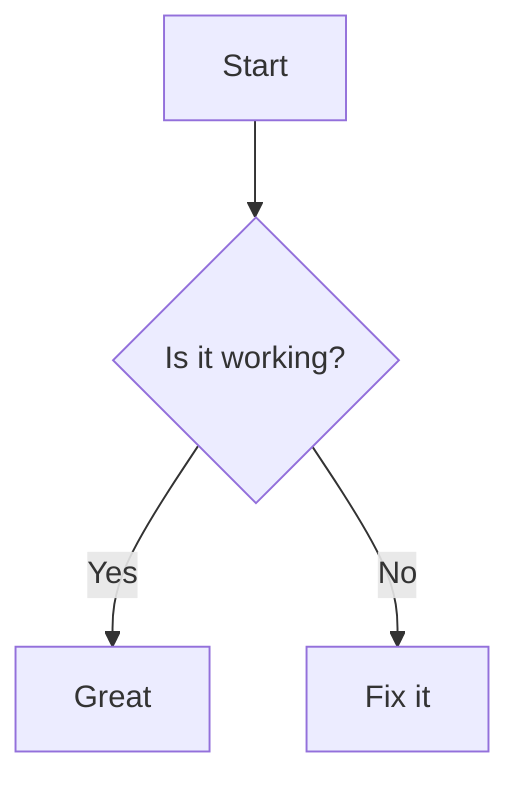
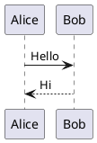
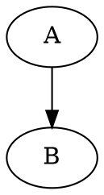

# Module 12: Diagram Ecosystem

Diagrams bring documentation to life. They convey architecture, flow, and relationships far more efficiently than paragraphs of text. This module is a comprehensive reference for the entire diagram ecosystem available to Markdown authors — from lightweight text-based tools like Mermaid and PlantUML to full graphical editors like Draw.io and Excalidraw.

---

## 12.1 Introduction to the Diagram Ecosystem

### Why Diagrams Matter in Documentation

Diagrams serve several critical purposes in technical documentation:

- **Clarity**: A well-designed diagram communicates complex relationships at a glance.
- **Speed**: Readers absorb visual information 60,000 times faster than text.
- **Retention**: Visual information is more memorable than text alone.
- **Universal Understanding**: Diagrams transcend language barriers.
- **Precision**: Architecture and flow diagrams remove ambiguity.
- **Professionalism**: Quality diagrams signal investment in documentation.

### The Rise of Diagrams-as-Code

Diagrams-as-code (DaC) treats diagrams as source files — version-controlled, reviewable, and maintainable alongside your codebase. Tools like Mermaid, PlantUML, Graphviz, and D2 are text-based, meaning you diff, branch, and merge diagrams just like code.

### Tool Spectrum

| Category | Tools | Use Case |
|----------|-------|----------|
| Text-based, Markdown-native | Mermaid | Quick diagrams in Markdown |
| Text-based, Java-powered | PlantUML | UML and software diagrams |
| Text-based, graph-focused | Graphviz (DOT) | Complex graph layouts |
| Text-based, modern | D2 | Clean, opinionated diagrams |
| GUI desktop/web | Draw.io | General-purpose diagramming |
| GUI hand-drawn style | Excalidraw | Whiteboard-style sketches |

---

## 12.2 Mermaid (Deep Reference)

Mermaid is a JavaScript-based diagramming tool that renders diagrams from text definitions. It was introduced in Module 6; here we go deep.

### Quick Recap of Module 6

Mermaid uses code fences with the `mermaid` language tag:

````markdown

````

Diagram types covered in Module 6:
- Flowcharts (`graph`, `flowchart`)
- Sequence diagrams (`sequenceDiagram`)
- Class diagrams (`classDiagram`)
- State diagrams (`stateDiagram-v2`)
- Gantt charts (`gantt`)
- Pie charts (`pie`)
- Gitgraph (`gitGraph`)
- Entity Relationship diagrams (`erDiagram`)
- User Journey diagrams (`journey`)

### Advanced Mermaid Tips

#### Subgraphs in Flowcharts

```
graph TD
    subgraph Frontend
        A[React App]
        B[State Management]
    end
    subgraph Backend
        C[API Server]
        D[Database]
    end
    A --> C
    B --> D
```

#### Styling Nodes and Links

```
graph LR
    A[Critical]:::critical --> B{{Warning}}:::warn
    classDef critical fill:#ff4444,stroke:#cc0000,color:#fff
    classDef warn fill:#ffaa00,stroke:#ff8800
```

#### Click Events (Interactive Diagrams)

```
graph LR
    A[Click Me] --> B[Module Docs]
    click A "https://example.com" "Tooltip text"
    click B callback-function
```

#### Markdown Strings in Nodes

```
graph TD
    A["`**Bold** and *italic*`"]
    B["`Line 1<br/>Line 2`"]
```

### Mermaid CLI for Batch Generation

Install and use Mermaid CLI to generate diagrams programmatically:

```bash
npm install -g @mermaid-js/mermaid-cli

# Convert single file
mmdc -i diagram.mmd -o diagram.png -w 800 -H 600

# Batch convert all .mmd files
for f in *.mmd; do
    mmdc -i "$f" -o "${f%.mmd}.png"
done

# Generate PDF
mmdc -i diagram.mmd -o diagram.pdf -w 800 -H 600

# Generate SVG
mmdc -i diagram.mmd -o diagram.svg
```

### Mermaid Theming System Deep Dive

Mermaid uses a configuration object to theme diagrams globally or per diagram.

#### Theme Variables

```
%%{init: {
  'theme': 'base',
  'themeVariables': {
    'primaryColor': '#4A90D9',
    'primaryTextColor': '#fff',
    'primaryBorderColor': '#2E6BB0',
    'lineColor': '#333',
    'secondaryColor': '#f0f0f0',
    'tertiaryColor': '#e0e0e0',
    'fontFamily': 'Inter, sans-serif',
    'fontSize': '14px'
  }
}}%%
graph TD
    A[Service A] --> B[Service B]
```

#### Built-in Themes

- `default` — light theme suitable for most docs
- `forest` — green-tinted theme
- `dark` — dark background theme
- `neutral` — monochrome theme
- `base` — customizable base theme

#### Theme Per Diagram vs Global

Set globally in your Markdown frontmatter:

```yaml
---
mermaid:
  theme: dark
---
```

Or per diagram using directives:

```
%%{init: {'theme': 'forest', 'logLevel': 1}}%%
graph LR
    A --> B
```

### Custom Fonts in Mermaid

Mermaid cannot directly load custom fonts. Use your Markdown renderer's CSS:

```css
.mermaid {
    font-family: 'Inter', 'Segoe UI', sans-serif;
}
```

For Mermaid CLI, use a Puppeteer config file:

```javascript
// puppeteer-config.json
{
    "args": ["--no-sandbox"],
    "executablePath": "/usr/bin/chromium"
}
```

And a CSS override:

```css
/* mermaid-style.css */
.mermaid .label {
    font-family: 'Inter', sans-serif !important;
}
```

```bash
mmdc -i diagram.mmd -o diagram.png -C mermaid-style.css
```

### Mermaid in CI/CD

Generate and commit updated diagrams during build:

```yaml
# GitHub Actions example
- name: Generate Mermaid Diagrams
  run: |
    npm install -g @mermaid-js/mermaid-cli
    for f in docs/diagrams/*.mmd; do
      mmdc -i "$f" -o "docs/images/$(basename ${f%.mmd}).png" -w 1024
    done

- name: Commit Updated Diagrams
  run: |
    git config user.name "CI Bot"
    git config user.email "bot@example.com"
    git add docs/images/
    git commit -m "Update diagrams [skip ci]" || exit 0
    git push
```

### Mermaid Limitations

- No UML sequence diagram numbering
- No wireframe/UI mockup support
- Limited layout control (the engine decides positioning)
- Not suitable for very large graphs (performance degrades)
- Accessibility is limited (SVG output lacks ARIA attributes)

---

## 12.3 PlantUML

PlantUML is an open-source tool that creates UML and non-UML diagrams from plain text descriptions. It is Java-based and widely used in software engineering contexts.

### What is PlantUML

PlantUML supports many diagram types:
- Sequence diagrams
- Use case diagrams
- Class diagrams
- Activity diagrams (legacy and beta syntax)
- Component diagrams
- Deployment diagrams
- State diagrams
- Timing diagrams
- Wireframe diagrams
- Salt (UI mockups)
- Archimate diagrams
- Gantt charts
- Mind maps
- Work breakdown structures

### Setup

#### Installing Java

PlantUML requires Java Runtime Environment (JRE) 8 or later.

```bash
# Check if Java is installed
java -version

# Install on Ubuntu/Debian
sudo apt install default-jre

# Install on macOS
brew install openjdk@11

# Install on Windows (Chocolatey)
choco install openjdk
```

#### Installing PlantUML Jar

```bash
# Download the latest plantuml.jar
wget https://github.com/plantuml/plantuml/releases/latest/download/plantuml.jar

# Run it
java -jar plantuml.jar diagram.puml
```

#### VS Code Extension

Install "PlantUML" by jebbs from the VS Code marketplace. It provides:
- Live preview
- Export to PNG, SVG, ASCII art
- Intellisense for PlantUML syntax
- Skin parameter autocompletion

### PlantUML Syntax vs Mermaid

| Aspect | PlantUML | Mermaid |
|--------|----------|---------|
| Engine | Java-based | JavaScript-based |
| Diagram types | 20+ UML + non-UML | 10+ types |
| Syntax | Verbose, structured | Concise, Markdown-native |
| Rendering quality | High, consistent | Good, browser-dependent |
| Layout control | Extensive with skinparams | Minimal |
| Speed | Slower (Java startup) | Fast (runs in browser) |
| Integration | Requires plugin/renderer | Native in many renderers |

### Sequence Diagrams in PlantUML

```
@startuml
actor User
participant "Web App" as WA
participant "API Gateway" as GW
database "Database" as DB

User -> WA: Submit form
WA -> GW: POST /api/submit
GW -> DB: INSERT record
DB --> GW: 201 Created
GW --> WA: Response
WA --> User: Success page

alt Error case
    WA -> GW: POST /api/submit
    GW --> WA: 400 Bad Request
    WA --> User: Error message
end

note right of WA: Form validation also happens client-side

User -> WA: Logout
WA -> User: Redirect to login
@enduml
```

### Use Case Diagrams

```
@startuml
left to right direction
actor "Customer" as C
actor "Admin" as A

rectangle Shop {
    C --> (Browse Products)
    C --> (Add to Cart)
    C --> (Checkout)
    (Checkout) .> (Make Payment) : includes
    A --> (Manage Inventory)
    A --> (View Reports)
}

note right of (Manage Inventory)
    Only accessible
    with admin role
end note
@enduml
```

### Activity Diagrams

```
@startuml
start
:User submits order;

if (Payment successful?) then (yes)
  :Send confirmation email;
  :Update inventory;
  :Ship product;
else (no)
  :Notify payment failure;
  :Offer alternative payment;
endif

stop
@enduml
```

### Component Diagrams

```
@startuml
package "Frontend" {
    [React App]
    [State Store]
}

package "Backend" {
    [API Controller]
    [Service Layer]
    [Data Access Layer]
}

database "PostgreSQL" {
    [Users Table]
    [Orders Table]
}

React App --> API Controller : REST API
API Controller --> Service Layer
Service Layer --> Data Access Layer
Data Access Layer --> PostgreSQL
@enduml
```

### Deployment Diagrams

```
@startuml
actor "End User" as EU

node "CDN" {
    [Static Assets]
}

node "Web Server" {
    [Nginx]
}

node "Application Server" {
    [Node.js App]
}

node "Database Server" {
    database "PostgreSQL"
}

EU --> CDN : HTTPS
CDN --> Web Server
Web Server --> Application Server : Reverse Proxy
Application Server --> Database Server : JDBC
@enduml
```

### State Diagrams

```
@startuml
[*] --> Idle
Idle --> Processing : Start
Processing --> Completed : Success
Processing --> Failed : Error
Failed --> Processing : Retry
Completed --> [*]

state Processing {
    [*] --> Validating
    Validating --> Transforming
    Transforming --> Saving
    Saving --> [*]
}

note right of Validating
    Check input format
    and required fields
end note
@enduml
```

### Timing Diagrams

```
@startuml
concise "Web Server" as WS
concise "Database" as DB

@0
WS is Idle
DB is Idle

@10
WS is HandlingRequest
DB is Processing

@20
WS is Idle
DB is Idle

@30
WS is HandlingRequest
DB is Processing

@50
WS is Error
DB is Idle

@60
WS is Idle
DB is Idle

WS@Idle : 0-10, 20-30, 60+
WS@HandlingRequest : 10-20, 30-50
WS@Error : 50-60
DB@Idle : 0-10, 20-30, 50+
DB@Processing : 10-20, 30-50
@enduml
```

### Wireframe Diagrams

```
@startuml
salt
{
  Login Page
  [Username]   __________
  [Password]   __________
  [Login Button]
  [Forgot Password] | [Register]
}
@enduml
```

### Salt (UI Mockups)

Salt provides a detailed UI mockup language within PlantUML.

```
@startuml
salt
{
  Just plain text
  [This is a button]
  ()  Unchecked radio
  (X) Checked radio
  []  Unchecked box
  [X] Checked box
  "This is a dropdown"
  ^This is a text input^
}
@enduml
```

```
@startuml
salt
{
  Top navigation | Dashboard | Reports
  =
  | Sidebar | Main Content |
  | Profile  | Welcome back! |
  | Settings | [New Post]    |
  | Logout   | Your posts... |
  =
  Footer text here
}
@enduml
```

```
@startuml
salt
{
  <table>
    <tr><td>Name</td><td>Age</td><td>Role</td></tr>
    <tr><td>Alice</td><td>30</td><td>Admin</td></tr>
    <tr><td>Bob</td><td>25</td><td>User</td></tr>
  </table>
}
@enduml
```

### Math in PlantUML

```
@startuml
:Calculate E = mc^2;
:Evaluate sum_{i=1}^{n} i = n(n+1)/2;
:Compute ∫_0^∞ e^{-x^2} dx = √π/2;
@enduml
```

### PlantUML Server

Run PlantUML as a web service:

```bash
docker run -d -p 8080:8080 plantuml/plantuml-server:jetty
```

Then embed diagrams via URL:

```markdown

```

### PlantUML Skin Parameters

Skin parameters control the visual appearance:

```
@startuml
skinparam backgroundColor #FEFEFE
skinparam componentStyle rectangle
skinparam monochrome true
skinparam defaultFontName Arial
skinparam defaultFontSize 12
skinparam sequenceArrowThickness 2
skinparam roundcorner 10
skinparam shadowing false

actor User
User --> (Login)
@enduml
```

### Integration with Markdown

Markdown editors with PlantUML support use code fences:

````markdown

````

For static site generators, use a PlantUML plugin or pre-render to images.

### Complete PlantUML Example Gallery

#### API Gateway with Rate Limiting

```
@startuml
skinparam packageStyle rectangle

actor Client

node "API Gateway" {
    component "Rate Limiter" as RL
    component "Router" as R
    component "Auth Middleware" as AM
}

node "Service A" as SA
node "Service B" as SB
node "Service C" as SC

database "Redis" as RD
database "PostgreSQL" as PG

Client --> RL : HTTP Request
RL --> R : Check Limit
R --> AM : Route Request

AM --> SA : Valid Token
AM --> SB : Valid Token
AM --> SC : Valid Token

RL --> RD : Counter
SA --> PG : Data
SB --> PG : Data
SC --> PG : Data
@enduml
```

#### Full System Architecture

```
@startuml
!define ICONURL https://raw.githubusercontent.com/plantuml-stdlib/gilbarbara-icons/main

title E-Commerce System Architecture

actor Customer
actor Admin

rectangle "Frontend" {
    component "Next.js" as Next
    component "Redux Store" as Store
    component "Tailwind CSS" as TW
}

rectangle "Backend Services" {
    component "User Service" as US
    component "Product Service" as PS
    component "Order Service" as OS
    component "Payment Service" as PayS
    component "Notification Service" as NS
}

rectangle "Data Layer" {
    database "Users DB" as UDB
    database "Products DB" as PDB
    database "Orders DB" as ODB
    database "Cache (Redis)" as Cache
}

rectangle "External" {
    component "Stripe" as Stripe
    component "SendGrid" as SG
    component "CloudFront CDN" as CF
}

Customer --> Next : HTTPS
Admin --> Next : HTTPS
Next --> CF : Static Assets

US --> UDB
PS --> PDB
OS --> ODB

OS --> PayS : Charge
PayS --> Stripe : API
OS --> NS : Notify
NS --> SG : Email

Next --> US : REST
Next --> PS : REST
Next --> OS : REST

US --> Cache
PS --> Cache
OS --> Cache
@enduml
```

### When to Use PlantUML vs Mermaid

Choose **PlantUML** when:
- You need UML-standard diagrams for software engineering
- Your team uses Java tooling
- You need wireframes or UI mockups (Salt)
- You need precise layout control via skin parameters
- You are generating diagrams in CI (Java is already installed)
- You need timing diagrams

Choose **Mermaid** when:
- You want diagrams inline in Markdown without plugins
- Your Markdown renderer has native Mermaid support (GitHub, GitLab)
- You prefer a simpler syntax
- You need fast, browser-side rendering
- You want diagrams that are easy for non-engineers to write
- Your CI pipeline is JavaScript-based

---

## 12.4 Graphviz (DOT Language)

Graphviz is a mature, powerful graph visualization tool. It uses the DOT language to describe graphs and produces highly customizable output.

### What is Graphviz

Graphviz originated at AT&T Bell Labs and has been the gold standard for graph visualization for decades. It excels at:
- Directed and undirected graphs
- Hierarchical layouts
- Network topologies
- Cluster and subgraph organization
- Fine-grained visual control

### Installation

```bash
# Ubuntu/Debian
sudo apt install graphviz

# macOS
brew install graphviz

# Windows (Chocolatey)
choco install graphviz

# Verify
dot -V
```

### Basic DOT Syntax

#### Directed Graph (digraph)

```
digraph {
    rankdir=LR;
    A -> B;
    B -> C;
    A -> C;
}
```

Save as `graph.dot`, render with:

```bash
dot -Tpng graph.dot -o graph.png
dot -Tsvg graph.dot -o graph.svg
dot -Tpdf graph.dot -o graph.pdf
```

#### Undirected Graph (graph)

```
graph {
    A -- B;
    B -- C;
    C -- A;
}
```

### Node Shapes, Colors, and Styles

```
digraph {
    node [style=filled, fillcolor=lightblue];

    A [shape=box, fillcolor=red, fontcolor=white];
    B [shape=ellipse, style=dashed, color=blue];
    C [shape=diamond, fillcolor=yellow];
    D [shape=parallelogram, fillcolor=green];
    E [shape=hexagon];
    F [shape=cylinder, fillcolor=gray];
    G [shape=note, fillcolor=beige];
    H [shape=house];
    I [shape=doublecircle, color=red, penwidth=3];

    A -> B [label="HTTP", color=green, penwidth=2];
    B -> C [label="gRPC", style=dotted];
    C -> D [label="SQL", color=blue, style=bold];
    D -> E;
    E -> F;
    F -> G;
    G -> H;
    H -> I;
}
```

### Edge Types and Labels

```
digraph {
    edge [fontsize=10];

    A -> B [label="direct", color=blue];
    A -> C [label="dotted", style=dotted];
    A -> D [label="dashed", style=dashed];
    A -> E [label="bold", style=bold];
    A -> F [label="tapered", penwidth=3];

    G -> H [label="with head", arrowhead=diamond];
    H -> I [label="both arrows", dir=both];
    I -> J [label="no arrow", arrowhead=none];

    K -> L [label="HTML label", 
            labelhtml=<<TABLE><TR><TD>Status</TD><TD>OK</TD></TR></TABLE>>];
}
```

### Subgraphs and Clusters

Subgraphs with `cluster_` prefix get rendered as boxes:

```
digraph {
    rankdir=TB;

    subgraph cluster_frontend {
        label="Frontend";
        style=filled;
        fillcolor=lightyellow;
        color=orange;

        A [label="React"];
        B [label="Redux"];
        A -> B;
    }

    subgraph cluster_backend {
        label="Backend";
        style=filled;
        fillcolor=lightblue;
        color=blue;

        C [label="API"];
        D [label="Worker"];
        C -> D;
    }

    subgraph cluster_database {
        label="Data Layer";
        style=filled;
        fillcolor=lightgreen;
        color=green;

        E [label="PostgreSQL"];
        F [label="Redis"];
    }

    B -> C [label="REST"];
    D -> E [label="SQL"];
    D -> F [label="Cache"];
}
```

### Layout Engines

Graphviz provides multiple layout engines for different purposes:

| Engine | Command | Best For |
|--------|---------|----------|
| `dot` | `dot -Tpng` | Hierarchical/directed graphs (default) |
| `neato` | `neato -Tpng` | Spring model (undirected) |
| `fdp` | `fdp -Tpng` | Force-directed placement |
| `sfdp` | `sfdp -Tpng` | Large graphs (scalable) |
| `twopi` | `twopi -Tpng` | Radial layouts |
| `circo` | `circo -Tpng` | Circular layouts |
| `osage` | `osage -Tpng` | Array-based layout |

Example — same graph, different engines:

```bash
dot -Tpng graph.dot -o graph-dot.png
neato -Tpng graph.dot -o graph-neato.png
twopi -Tpng graph.dot -o graph-twopi.png
```

### Record-Based Nodes

```
digraph {
    node [shape=record, style=filled, fillcolor=lightgray];

    struct1 [label="{<f0> id: 1 | <f1> name: Alice | <f2> role: Admin }"];

    struct2 [label="{<f0> id: 2 | <f1> name: Bob | <f2> role: User | {<f3> email: bob@x.com | <f4> phone: +123 }}"];

    struct1:f2 -> struct2:f2 [label="manages"];
}
```

### HTML-Like Labels

```
digraph {
    node [shape=plaintext];

    table_node [label=<
        <TABLE BORDER="0" CELLBORDER="1" CELLSPACING="0">
            <TR><TD COLSPAN="2" BGCOLOR="lightblue"><B>User Profile</B></TD></TR>
            <TR><TD>Name</TD><TD>Alice</TD></TR>
            <TR><TD>Age</TD><TD>30</TD></TR>
            <TR><TD>Role</TD><TD BGCOLOR="green">Admin</TD></TR>
            <TR><TD PORT="status">Status</TD><TD>Active</TD></TR>
        </TABLE>
    >];

    another [label=<
        <TABLE>
            <TR><TD>Key</TD><TD>Value</TD></TR>
            <TR><TD>Language</TD><TD>Python</TD></TR>
        </TABLE>
    >];

    table_node:status -> another;
}
```

### Complex Architecture Diagram

```
digraph {
    rankdir=TB;
    compound=true;
    splines=polyline;
    node [style=filled, fillcolor=white];

    subgraph cluster_aws {
        label="AWS Cloud";
        style=dashed;
        color=gray;
        fontcolor=gray;

        subgraph cluster_vpc {
            label="VPC 10.0.0.0/16";

            subgraph cluster_public {
                label="Public Subnets";
                fillcolor="#e8f5e9";

                LB1 [label="ALB\n(Public)", shape=box, fillcolor="#81c784"];
                LB2 [label="ALB\n(Private)", shape=box, fillcolor="#81c784"];
            }

            subgraph cluster_private {
                label="Private Subnets";
                fillcolor="#e3f2fd";

                node [style=filled, fillcolor="#64b5f6"];

                subgraph cluster_ecs {
                    label="ECS Cluster";
                    fillcolor="#bbdefb";

                    App1 [label="Web App\n(4 tasks)"];
                    App2 [label="Worker\n(2 tasks)"];
                }

                subgraph cluster_rds {
                    label="RDS";
                    fillcolor="#f3e5f5";

                    DB [label="PostgreSQL\n(db.r6g.large)", shape=cylinder, fillcolor="#ce93d8"];
                    Redis [label="ElastiCache\n(cache.r6g.large)", shape=cylinder, fillcolor="#ce93d8"];
                }
            }
        }

        subgraph cluster_edge {
            label="Edge";
            CloudFront [label="CloudFront CDN", shape=box3d, fillcolor="#fff9c4"];
            Route53 [label="Route53", shape=circle, fillcolor="#fff9c4"];
        }
    }

    User [label="End User", shape=actor];
    User -> Route53 [label="DNS"];
    Route53 -> CloudFront;
    CloudFront -> LB1;
    LB1 -> App1;
    App1 -> LB2;
    LB2 -> App2;
    App1 -> DB;
    App2 -> DB;
    App1 -> Redis;
    App2 -> Redis;
    App1 -> App2 [label="gRPC", style=dashed];
}
```

### Graphviz + Markdown Integration

#### Via Image References

Render DOT files to images, then embed:

```bash
dot -Tsvg architecture.dot -o architecture.svg
```

```markdown

```

#### Via Code Blocks (Plugin-Dependent)

````markdown

````

Static site generators like Hugo use shortcodes:

```

digraph { A -> B; }

```

#### Using Graphviz Inline with Mermaid

Some Markdown renderers support both. You can mix approaches per diagram need.

### When to Use Graphviz

Choose **Graphviz** when:
- You need precise control over layout and node positioning
- You are rendering large graphs (thousands of nodes)
- You need specialized layouts (radial, circular, spring)
- You need HTML labels and complex table formatting
- You are generating network topology diagrams
- You need high-quality publication-ready output
- Consistency of layout is critical (deterministic output with `dot`)

---

## 12.5 D2

D2 is a modern diagram scripting language developed by Terrastruct. It prioritizes clean syntax, deterministic layout, and easy integration.

### What is D2

D2 is the newest entrant in the diagrams-as-code space. It was created to address frustrations with existing tools — particularly around layout unpredictability, verbose syntax, and poor Markdown integration.

### Setup

```bash
# Install via Homebrew (macOS)
brew install d2

# Install via Go
go install oss.terrastruct.com/d2@latest

# Install via script
curl -fsSL https://d2lang.com/install.sh | sh -s --

# Verify
d2 version
```

### Basic D2 Syntax

```
direction: right

User -> Web App: "HTTP Request"
Web App -> API: "REST"
API -> Database: "SQL"
```

Render:

```bash
d2 diagram.d2 diagram.svg
d2 diagram.d2 diagram.png
d2 diagram.d2 diagram.pdf
```

### Shapes in D2

```
rectangle: square-box
oval: rounded-shape
cylinder: database
cloud: cloud-service
hexagon: hex-shape
step: process-step
parallelogram: input-output
diamond: decision-node
document: document-icon
queue: message-queue
```

### Connections and Labels

```
a -> b: "simple label"
a -> c: "styled" {
    stroke: red
    stroke-width: 3
    stroke-dash: 5
}
d -> e <-> f: "bidirectional"
g -> h -> i: "chain"
```

### Containers

```
api-gateway: API Gateway {
    style.fill: "#4A90D9"

    routes: Routes {
        auth: Auth
        products: Products
        orders: Orders
    }
}

database: Database {
    style.fill: "#f0f0f0"

    tables: Tables {
        users: Users
        orders: Orders
    }
}

api-gateway -> database: "reads/writes"
```

### Multiple Diagrams

```
diagram1: My Service {
    client -> server
    server -> db
}

diagram2: Another View {
    ingress -> service
    service -> pod
}
```

### Layers

Layers animate or overlay on top of each other, revealing complexity step by step:

```
direction: right

client: Client
server: Server
db: Database

client -> server

layers: {
    1: {
        note: "Without database"
        db: null
        client -> server
    }
    2: {
        note: "With database"
        db: Database
        server -> db
    }
}
```

### Themes

```
theme: 101

client -> server
server -> db
```

Check available themes:

```
d2 theme list
```

Custom theme overrides:

```
theme: 300

vars: {
    d2-color: "#333"
    d2-background-color: "#fff"
    d2-font-color: "#111"
}
```

### Animation

D2 can generate animated SVG diagrams showing layer transitions:

```bash
d2 --animate-interval 2000 diagram.d2 output.svg
```

Each layer becomes a frame, transitioning every 2 seconds.

### D2 + Markdown Integration

#### Via Image References

```bash
d2 diagram.d2 diagram.svg
```

```markdown

```

#### Via Text Rendering (JavaScript)

Use the d2-js package to render inline in browser:

```javascript
import * as d2 from '@terrastruct/d2';
const svg = await d2.render('a -> b', { theme: 101 });
```

#### In Static Site Generators

Use a plugin or shortcode:

```

```

### D2 vs Mermaid Comparison

| Aspect | D2 | Mermaid |
|--------|-----|---------|
| Syntax | Very clean, Go-like | Clean, YAML-inspired |
| Layout | Deterministic | Heuristic, can shift |
| Speed | Fast (Go binary) | Fast (JS in browser) |
| Diagram types | Fewer (growing) | Many (10+ types) |
| Theming | Excellent, built-in | Good, CSS-based |
| Animation | Built-in layer animation | No native animation |
| UML support | No | Yes |
| Markdown native | No (needs renderer) | Yes (GitHub, GitLab) |
| Community | Smaller, growing | Large, established |
| Complexity | Simple diagrams | Simple to medium |

### When to Use D2

Choose **D2** when:
- You want the cleanest syntax available
- Deterministic, predictable layout matters
- You need animated or layered diagrams
- You prefer a modern, opinionated tool
- You are building simple-to-medium complexity diagrams
- You want great theming out of the box

### Complete D2 Examples

#### Microservices Architecture

```
direction: right

api-gateway: API Gateway {
    style.fill: "#4A90D9"
}

user-service: User Service {
    style.fill: "#50C878"
}
product-service: Product Service {
    style.fill: "#FF6B6B"
}
order-service: Order Service {
    style.fill: "#FFD93D"
}

postgres: PostgreSQL {
    shape: cylinder
}
redis: Redis Cache {
    shape: cylinder
}

api-gateway -> user-service: "routes"
api-gateway -> product-service: "routes"
api-gateway -> order-service: "routes"

user-service -> postgres: "persists"
product-service -> postgres: "persists"
order-service -> postgres: "persists"

order-service -> redis: "caches"
product-service -> redis: "caches"
```

#### CI/CD Pipeline

```
direction: right

git-push: Git Push {
    shape: diamond
}

ci: CI Pipeline {
    style.fill: "#E8F5E9"

    lint: Lint
    test: Test
    build: Build
    lint -> test -> build
}

docker: Docker Build {
    style.fill: "#E3F2FD"
    shape: step
}

deploy-staging: Deploy to Staging {
    shape: parallelogram
}

deploy-prod: Deploy to Production {
    shape: parallelogram
}

git-push -> ci
ci -> docker
docker -> deploy-staging
deploy-staging -> deploy-prod: "approve"
```

#### Kubernetes Architecture

```
direction: right

internet: Internet {
    shape: cloud
}

ingress: NGINX Ingress {
    style.fill: "#4A90D9"
}

svc: Service {
    style.fill: "#50C878"
}

pods: Pods {
    style.fill: "#FFD93D"

    pod1: App v1.0
    pod2: App v1.0
    pod3: App v1.0
}

config: ConfigMap {
    shape: document
}

secret: Secret {
    shape: document
}

pv: PersistentVolume {
    shape: cylinder
}

internet -> ingress
ingress -> svc
svc -> pods
pods -> config
pods -> secret
pods -> pv
```

---

## 12.6 Draw.io / diagrams.net Integration

Draw.io (now diagrams.net) is a free, open-source diagramming application with both desktop and web versions.

### What is Draw.io

Draw.io is a feature-rich diagram editor that supports hundreds of shape libraries, templates, and export formats. It is the closest open-source alternative to Microsoft Visio.

### Desktop App vs Web App

| Feature | Desktop App | Web App |
|---------|-------------|---------|
| Platform | Windows, macOS, Linux | Any browser |
| Offline | Full support | Limited offline mode |
| File storage | Local | Local, Google Drive, OneDrive, GitHub, GitLab |
| Performance | Better for large diagrams | Depends on browser |
| Integration | VS Code, Obsidian plugins | Built into GitHub, GitLab, Notion |

Download: https://get.diagrams.net/

### Markdown Import/Export

Draw.io supports `.md` files as containers for diagram data:

- **Import**: Files with embedded `<mxfile>` or base64 diagram data
- **Export**: Diagrams can be saved as `.md` with embedded diagram data
- **Use in Markdown**: Reference `.drawio.svg` or `.drawio.png` files

### Embedding Draw.io Diagrams in Markdown

#### As Compressed SVG

Export from Draw.io as "SVG + Data" — this produces an SVG file with the editable diagram data embedded:

```markdown

```

Editors like VS Code (with hediet.vscode-drawio) can open these SVG files as editable diagrams.

#### As PNG with Link to Source

```markdown
[](./diagrams/architecture.drawio)
```

This shows the PNG but links to the editable source file.

#### As Compressed XML in Markdown

Some workflows embed the compressed XML directly in a Markdown code block:

````markdown
```drawio
<mxfile>...</mxfile>
```
````

### Using Draw.io with VS Code

Install the **Draw.io Integration** extension (`hediet.vscode-drawio`):

- Open `.drawio.svg`, `.drawio.png`, or `.drawio` files
- Edit visually in VS Code
- Changes are saved back to the file
- Supports all Draw.io features
- Export directly from VS Code

### Collaboration Features

- **Real-time collaboration** (web app): Share edit links
- **Git-based collaboration**: Store `.drawio` files in Git and merge changes
- **Comments**: Add comments to shapes in the web app

### Template Library

Draw.io includes hundreds of templates organized by category:
- Software (UML, ERD, network, flowcharts)
- Business (process maps, org charts, SWOT)
- Engineering (electrical, mechanical, plumbing)
- Mind maps, wireframes, mockups

### Custom Shapes and Libraries

Create and reuse custom shape libraries:

1. Draw your custom shape
2. Select all shapes → File → New Library
3. Save as `.xml` file
4. Import library in other diagrams

Community libraries are available for AWS, GCP, Azure, Kubernetes, Cisco, and more.

### Export Formats

| Format | Use Case |
|--------|----------|
| PNG | Universal, raster format |
| SVG | Scalable, editable vector |
| PDF | Print, formal documents |
| HTML | Web embedding |
| XML | Full editable data |
| VSX | Visio import/export |
| JPEG | Smaller raster files |
| URL | Embed directly via URL parameter |

### When to Use Draw.io

Choose **Draw.io** when:
- You need a full-featured GUI diagram editor
- Your team prefers visual editing over code
- You need extensive shape libraries (AWS, Azure, GCP, etc.)
- You need to create large, complex diagrams with many elements
- You want to collaborate visually in real-time
- You need to create wireframes or mockups
- You need to import from Visio or other tools

---

## 12.7 Excalidraw Integration

Excalidraw is a virtual whiteboard tool for creating hand-drawn style diagrams. Its distinctive sketch aesthetic makes diagrams feel approachable and informal.

### What is Excalidraw

Excalidraw creates diagrams that look hand-drawn — rough lines, sketch-style text, and organic shapes. This style is particularly effective for:
- Brainstorming and ideation
- Whiteboard-style explanations
- User stories and journey maps
- Quick architectural sketches
- Presentations where you want a "rough draft" feel

### Embedding Excalidraw in Documentation

#### As Exported PNG/SVG

Export from Excalidraw (or from the file menu):

```markdown

```

For the hand-drawn effect, export as PNG with the "Hand-drawn" rendering selected.

#### As Iframe

If you want your documentation readers to be able to edit:

```markdown
<iframe src="https://excalidraw.com/#json=ENCODED_DATA" 
        width="800" height="600" frameborder="0"></iframe>
```

Or self-host an instance and point to your scene files.

#### Excalidraw Files as Sources

Excalidraw scenes are stored as `.excalidraw` files (JSON format). These can be version-controlled:

```bash
# Store in your repo
git add diagrams/sketch.excalidraw
```

Then reference in Markdown with export images.

### Excalidraw + Obsidian

The **Excalidraw** Obsidian plugin (by Zsolt Viczian) provides deep integration:
- Create and edit Excalidraw drawings within Obsidian
- Embed drawings in notes
- Link between drawings and notes
- Automatically export to PNG/SVG
- Use Obsidian templates for drawings
- Scripting support (Drawing Scripts)

### Collaboration

- **Excalidraw Live Collaboration**: Real-time editing with multiple users
- **Self-hosted**: Deploy Excalidraw on your own infrastructure
- **Embedded**: Share via URL with scene data encoded

### Libraries and Components

Excalidraw has a growing library of components that can be dragged into scenes:

- AWS icons
- GCP icons
- Generic UI elements
- Flowchart shapes
- Arrows, connectors, text styles

Community libraries extend this with thousands of pre-made components.

### When to Use Excalidraw

Choose **Excalidraw** when:
- You want a hand-drawn, approachable aesthetic
- You are brainstorming or iterating quickly
- You want readers to feel the diagram is "in progress" rather than final
- You need to embed editable diagrams in Obsidian
- You are doing user journey mapping or storyboarding
- You want to collaborate on whiteboard-style sketches

---

## 12.8 SVG Workflows

SVG (Scalable Vector Graphics) is the universal vector format for the web. Understanding SVG workflows is critical for high-quality diagram documentation.

### Creating SVG Diagrams Directly

SVG source code can be written by hand for simple diagrams:

```xml
<svg width="400" height="300" xmlns="http://www.w3.org/2000/svg">
    <rect x="10" y="10" width="380" height="50" rx="5" fill="#4A90D9"/>
    <text x="200" y="42" text-anchor="middle" fill="white" font-family="sans-serif">Service A</text>
    <line x1="200" y1="60" x2="200" y2="120" stroke="#333" stroke-width="2"/>
    <polygon points="200,130 195,120 205,120" fill="#333"/>
    <rect x="50" y="130" width="300" height="50" rx="5" fill="#50C878"/>
    <text x="200" y="162" text-anchor="middle" fill="white" font-family="sans-serif">Service B</text>
</svg>
```

But for complex diagrams, always use a diagram-as-code tool and export to SVG.

### SVG Optimization (SVGO)

SVGs from diagram tools are often bloated with unnecessary metadata and can be optimized:

```bash
npm install -g svgo

# Optimize a single file
svgo diagram.svg

# Optimize in place (overwrite)
svgo --multipass diagram.svg

# Batch optimize
svgo -f ./diagrams/ -o ./optimized-diagrams/

# Check savings
svgo --multipass -p 3 diagram.svg
```

SVGO removes:
- Editor metadata
- Unused IDs and classes
- Redundant attributes
- Inline styles that can be CSS
- Precision rounding

Typical savings: 30–70% file size reduction.

### Embedding SVG in Markdown

#### As Image (Standard)

```markdown

```

#### Inline SVG (Advanced)

Some Markdown renderers support inline SVG:

```markdown
<svg width="400" height="200">
    <rect width="100%" height="100%" fill="#f0f0f0"/>
    <circle cx="200" cy="100" r="50" fill="#4A90D9"/>
</svg>
```

Benefits: No HTTP request, CSS inheritance. Downside: Pollutes Markdown, not universally supported.

#### Via Object Tag

```html
<object type="image/svg+xml" data="diagram.svg" width="800" height="600">
    Your browser does not support SVG.
</object>
```

### Animated SVG Diagrams

SVG supports animation via CSS and SMIL:

```svg
<svg width="400" height="100" xmlns="http://www.w3.org/2000/svg">
    <style>
        @keyframes flow {
            0% { stroke-dashoffset: 100; }
            100% { stroke-dashoffset: 0; }
        }
        .flow-line {
            stroke-dasharray: 10;
            animation: flow 2s linear infinite;
        }
    </style>
    <rect x="10" y="10" width="50" height="50" fill="#4A90D9"/>
    <rect x="340" y="10" width="50" height="50" fill="#50C878"/>
    <line x1="60" y1="35" x2="340" y2="35" stroke="#333" stroke-width="3" class="flow-line"/>
</svg>
```

Useful for:
- Data flow visualization
- Request/response cycles
- Loading states
- Pipeline progression

### Interactive SVG Diagrams

SVG elements respond to JavaScript events:

```svg
<svg width="400" height="300" xmlns="http://www.w3.org/2000/svg">
    <style>
        rect:hover { opacity: 0.8; cursor: pointer; }
        .tooltip { display: none; }
        rect:hover + .tooltip { display: block; }
    </style>
    <rect x="50" y="50" width="100" height="60" fill="#4A90D9">
        <title>Click for details</title>
    </rect>
    <text class="tooltip" x="80" y="180" fill="#333">Service A: 200 req/s</text>
    <script>
        document.querySelector('rect').addEventListener('click', function() {
            alert('Service A details:\nStatus: Healthy\nLoad: 65%');
        });
    </script>
</svg>
```

### SVG Accessibility

Ensure diagrams are accessible to all users:

```svg
<svg role="img" aria-labelledby="diagram-title diagram-desc" width="800" height="600">
    <title id="diagram-title">System Architecture Overview</title>
    <desc id="diagram-desc">
        A three-tier architecture with a React frontend, 
        Node.js backend, and PostgreSQL database.
    </desc>
    <!-- diagram content -->
</svg>
```

Best practices:
- Use `role="img"` on the SVG element
- Provide `aria-labelledby` linking to a `<title>` and `<desc>`
- Ensure color contrast ratios meet WCAG 2.1 AA standards
- Do not rely solely on color to convey meaning
- Use text labels on all shapes
- Provide a text alternative near the diagram

### Version Control for SVG

- **Binary SVGs** (from tools like Draw.io) are hard to diff
- **Optimized SVGs** are easier to diff but still verbose
- **Compressed SVGZ** (gzipped SVG) saves space but breaks diff

Best practice for version control:
1. Always keep the source file (`.drawio`, `.mmd`, `.d2`, `.puml`) in version control
2. Generate SVG as a build artifact
3. Consider using Git LFS for large SVG files
4. Include both source and rendered SVG in the repository
5. Use `.gitattributes` to handle SVG diffs:

```
*.svg diff
*.drawio binary
*.mmd diff
```

---

## 12.9 Architecture Documentation Diagrams

Architecture documentation is one of the most important applications of diagrams in software. The C4 model provides a structured approach.

### The C4 Model Overview

The C4 model (Context, Container, Component, Code) was created by Simon Brown to provide a hierarchical approach to software architecture diagrams.

- **Level 1: System Context** — The big picture, system boundaries
- **Level 2: Container** — High-level technical building blocks
- **Level 3: Component** — Inside individual containers
- **Level 4: Code** — Detailed class-level diagrams (optional)

### Level 1: System Context Diagram

```
@startuml
title System Context - E-Commerce Platform

actor "Customer" as C
actor "Admin" as A

System_Boundary(ecommerce, "E-Commerce Platform") {
    System(ecom_sys, "E-Commerce System", "Handles orders, payments, and inventory")
}

System_Ext(payment, "Payment Gateway", "Stripe")
System_Ext(email, "Email Service", "SendGrid")
System_Ext(warehouse, "Warehouse System", "Inventory management")

C --> ecom_sys : "Browses and purchases"
A --> ecom_sys : "Manages catalog"
ecom_sys --> payment : "Processes payments"
ecom_sys --> email : "Sends notifications"
ecom_sys --> warehouse : "Updates inventory"
@enduml
```

### Level 2: Container Diagram

```
@startuml
title Container Diagram - E-Commerce Platform

person(customer, "Customer", "An online shopper")
person(admin, "Admin", "System administrator")

system_boundary(ecommerce, "E-Commerce Platform") {
    container(spa, "Single Page App", "React, Tailwind CSS", "Provides web interface")
    container(mobile, "Mobile App", "React Native", "Provides mobile interface")
    container(api, "API Application", "Node.js, Express", "Handles business logic and API requests")
    container(batch, "Batch Processor", "Node.js", "Handles background jobs")
    container_db(db, "Database", "PostgreSQL", "Stores user, product, and order data")
    container_queue(queue, "Message Queue", "RabbitMQ", "Handles async message passing")
}

system_ext(stripe, "Stripe", "Payment processing")
system_ext(sendgrid, "SendGrid", "Email delivery")

customer --> spa : "Uses"
customer --> mobile : "Uses"
admin --> spa : "Manages"
spa --> api : "REST API (HTTPS)"
mobile --> api : "REST API (HTTPS)"
api --> db : "SQL"
api --> queue : "Publishes messages"
batch --> queue : "Consumes messages"
batch --> db : "SQL"
api --> stripe : "API (HTTPS)"
api --> sendgrid : "API (HTTPS)"
@enduml
```

### Level 3: Component Diagram

```
@startuml
title Component Diagram - API Application

package "API Application" {
    () "REST Endpoints" as REST
    () "WebSocket" as WS

    [Auth Controller] as AC
    [Product Controller] as PC
    [Order Controller] as OC
    [Payment Controller] as PayC
    [Notification Controller] as NC

    [User Service] as US
    [Product Service] as PS
    [Order Service] as OS
    [Payment Service] as PayS
    [Notification Service] as NS

    [User Repository] as UR
    [Product Repository] as PR
    [Order Repository] as OR

    database "PostgreSQL" as DB
    database "Redis" as Cache
}

REST --> AC : Routes /api/auth
REST --> PC : Routes /api/products
REST --> OC : Routes /api/orders
REST --> PayC : Routes /api/payments
REST --> NC : Routes /api/notifications

AC --> US
PC --> PS
OC --> OS
PayC --> PayS
NC --> NS

US --> UR
PS --> PR
OS --> OR

UR --> DB
PR --> DB
OR --> DB

PS --> Cache
OS --> Cache

PayS --> Stripe : API
NS --> SendGrid : API
@enduml
```

### Level 4: Code Diagram (Optional)

Code-level diagrams are class diagrams for specific components:

```
@startuml
title Code Diagram - Order Service

class OrderService {
    +createOrder(dto: CreateOrderDTO): Order
    +getOrder(id: UUID): Order
    +updateStatus(id: UUID, status: OrderStatus): Order
    +cancelOrder(id: UUID): void
    -validateOrder(order: Order): boolean
    -calculateTotal(items: List<OrderItem>): Money
}

class OrderRepository {
    +save(order: Order): Order
    +findById(id: UUID): Optional<Order>
    +findByUserId(userId: UUID): List<Order>
    +delete(id: UUID): void
}

class Order {
    -id: UUID
    -userId: UUID
    -items: List<OrderItem>
    -total: Money
    -status: OrderStatus
    -createdAt: ZonedDateTime
    +addItem(item: OrderItem): void
    +removeItem(itemId: UUID): void
}

class OrderItem {
    -productId: UUID
    -quantity: int
    -unitPrice: Money
    +getSubtotal(): Money
}

OrderService --> OrderRepository
OrderService --> "validates" Order
Order "contains" --> "*" OrderItem
@enduml
```

### Network Topology Diagrams

```
digraph {
    rankdir=LR;
    splines=polyline;

    subgraph cluster_datacenter {
        label="Data Center A";
        style=filled;
        fillcolor="#f0f0f0";

        LB [label="Load Balancer", shape=box, fillcolor="#4A90D9", fontcolor=white];
        
        subgraph cluster_web {
            label="Web Tier";
            Web1 [label="Web Server 1", shape=box];
            Web2 [label="Web Server 2", shape=box];
            Web3 [label="Web Server N", shape=box];
        }

        subgraph cluster_app {
            label="App Tier";
            App1 [label="App Server 1", shape=box];
            App2 [label="App Server 2", shape=box];
        }

        subgraph cluster_db {
            label="Database Tier";
            DB1 [label="Primary DB", shape=cylinder, fillcolor="#50C878"];
            DB2 [label="Replica 1", shape=cylinder, fillcolor="#81C784"];
            DB3 [label="Replica N", shape=cylinder, fillcolor="#81C784"];
        }
    }

    Internet [label="Internet", shape=cloud];
    FW [label="Firewall", shape=box, fillcolor="red", fontcolor=white];

    Internet -> FW;
    FW -> LB;
    LB -> Web1;
    LB -> Web2;
    LB -> Web3;
    Web1 -> App1;
    Web2 -> App1;
    Web3 -> App2;
    App1 -> DB1;
    App2 -> DB1;
    DB1 -> DB2 [style=dashed, label="replication"];
    DB1 -> DB3 [style=dashed, label="replication"];
}
```

### Data Flow Diagrams

```
@startuml
title Order Processing Data Flow

rectangle "Customer" as Customer
rectangle "Web App" as WebApp
rectangle "API Gateway" as Gateway
rectangle "Order Service" as OrderSvc
rectangle "Payment Service" as PaySvc
rectangle "Notification Service" as NotifSvc
database "Orders DB" as ODB
database "Payments DB" as PDB

Customer --> WebApp : "Places order"
WebApp --> Gateway : "POST /api/orders"
Gateway --> OrderSvc : "CreateOrder(command)"

OrderSvc --> ODB : "Save Order(pending)"
OrderSvc --> PaySvc : "ProcessPayment(command)"

PaySvc --> PDB : "Save Payment(pending)"
PaySvc --> "Stripe" : "Charge API"
"Stripe" --> PaySvc : "Success"
PaySvc --> PDB : "Update Payment(success)"

PaySvc --> OrderSvc : "PaymentSuccess(event)"
OrderSvc --> ODB : "Update Order(confirmed)"
OrderSvc --> NotifSvc : "SendOrderConfirmation"

NotifSvc --> "SendGrid" : "Send email"
NotifSvc --> WebApp : "Order confirmed"

WebApp --> Customer : "Show confirmation"
@enduml
```

### Infrastructure Diagrams

```
d2
direction: right

internet: Internet {
    shape: cloud
}

dns: Route53 DNS {
    shape: document
}

cdn: CloudFront CDN

waf: WAF {
    shape: diamond
}

alb: Application Load Balancer

web-servers: Web Servers {
    asg: Auto Scaling Group
    
    webs: Web Instances {
        web1: Web Server
        web2: Web Server
        web3: Web Server
    }
    
    asg -> webs
}

app-servers: Application Servers {
    asg2: Auto Scaling Group
    
    apps: App Instances {
        app1: App Server
        app2: App Server
    }
    
    asg2 -> apps
}

databases: Databases {
    primary: RDS Primary (PostgreSQL) {
        shape: cylinder
    }
    replica: RDS Read Replica {
        shape: cylinder
    }
    cache: ElastiCache (Redis) {
        shape: cylinder
    }
    
    primary -> replica: replication
}

monitoring: Monitoring {
    cloudwatch: CloudWatch
    xray: X-Ray
    sns: SNS Alerts
}

internet -> dns
dns -> cdn
cdn -> waf
waf -> alb
alb -> web-servers
web-servers -> app-servers
app-servers -> databases

app-servers -> cloudwatch
cloudwatch -> sns
app-servers -> xray
```

---

## 12.10 System Design Documentation

System design documents combine multiple diagram types to describe complete systems.

### Load Balancer Diagrams

```
digraph {
    rankdir=LR;

    Users [label="Users", shape=actor];
    DNS [label="DNS (Round Robin)", shape=box];

    subgraph cluster_lb {
        label="Load Balancer Tier";
        LB1 [label="HAProxy\n(Active)", fillcolor="#4A90D9", fontcolor=white, style=filled];
        LB2 [label="HAProxy\n(Standby)", fillcolor="#ccc", style=filled];
    }

    subgraph cluster_servers {
        label="Application Servers";
        S1 [label="Server 1", fillcolor="#50C878", style=filled];
        S2 [label="Server 2", fillcolor="#50C878", style=filled];
        S3 [label="Server N", fillcolor="#50C878", style=filled];
    }

    subgraph cluster_db {
        label="Database";
        DB1 [label="Primary", shape=cylinder, fillcolor="#FFD93D", style=filled];
        DB2 [label="Replica", shape=cylinder, fillcolor="#FFD93D", style=filled];
    }

    Users -> DNS;
    DNS -> LB1;
    DNS -> LB2 [style=dashed, constraint=false];
    LB1 -> S1 [label="health check"];
    LB1 -> S2;
    LB1 -> S3;
    LB1 -> LB2 [label="VRRP heartbeat", style=dotted];
    S1 -> DB1;
    S2 -> DB1;
    S3 -> DB1;
    DB1 -> DB2 [label="sync", style=dashed];
}
```

### Database Replication Diagrams

```
digraph {
    rankdir=TB;

    App [label="Application Servers", shape=box3d, fillcolor="#E3F2FD", style=filled];

    subgraph cluster_master {
        label="Primary Region (us-east-1)";
        Master [label="Primary DB\n(Read/Write)", shape=cylinder, fillcolor="#4A90D9", fontcolor=white, style=filled];
    }

    subgraph cluster_slave1 {
        label="Read Replica Region 1 (eu-west-1)";
        Replica1 [label="Replica 1\n(Read Only)", shape=cylinder, fillcolor="#81C784", style=filled];
    }

    subgraph cluster_slave2 {
        label="Read Replica Region 2 (ap-southeast-1)";
        Replica2 [label="Replica 2\n(Read Only)", shape=cylinder, fillcolor="#81C784", style=filled];
    }

    subgraph cluster_slave3 {
        label="Read Replica Region 3 (sa-east-1)";
        Replica3 [label="Replica 3\n(Read Only)", shape=cylinder, fillcolor="#81C784", style=filled];
    }

    App -> Master [label="Writes", color=red];
    App -> Replica1 [label="Reads", color=blue, style=dashed];
    App -> Replica2 [label="Reads", color=blue, style=dashed];
    App -> Replica3 [label="Reads", color=blue, style=dashed];

    Master -> Replica1 [label="Async replication", style=dotted];
    Master -> Replica2 [label="Async replication", style=dotted];
    Master -> Replica3 [label="Async replication", style=dotted];
}
```

### Microservices Interaction Diagram

```
@startuml
title Order Fulfillment - Microservices Interaction

actor "Customer" as C

collections "API Gateway" as GW
collections "Auth Service" as Auth
collections "Product Service" as PS
collections "Order Service" as OS
collections "Inventory Service" as IS
collections "Payment Service" as PayS
collections "Shipping Service" as SS
collections "Notification Service" as NS

queue "Order Events" as Events

C -> GW: POST /orders
GW -> Auth: Validate token
Auth --> GW: Token valid
GW -> OS: Create order
OS -> PS: Check products
PS --> OS: Products valid
OS -> IS: Reserve inventory
IS --> OS: Reserved
OS -> PayS: Process payment
PayS --> OS: Payment success
OS -> Events: Publish OrderCreated
Events -> SS: Consume OrderCreated
SS -> NS: Shipping label created
NS -> C: Email confirmation

note right of Events
    Async event-driven
    communication via
    message broker
end note
@enduml
```

### Event-Driven Architecture Diagram

```
@startuml
title Event-Driven Architecture

rectangle "Service A" as SA
rectangle "Service B" as SB
rectangle "Service C" as SC
rectangle "Service D" as SD

queue "Event Bus (Kafka)" as Bus

rectangle "Schema Registry" as SR
rectangle "Dead Letter Queue" as DLQ

rectangle "Event Store" as ES
rectangle "Monitoring" as Mon

SA --> Bus : Publish Event A
Bus --> SB : Subscribe Event A
Bus --> SC : Subscribe Event A
SB --> Bus : Publish Event B
Bus --> SD : Subscribe Event B
SC --> Bus : Publish Event C

Bus --> SR : Validate schema
Bus --> DLQ : Failed events
Bus --> ES : Store all events

Mon --> Bus : Metrics
Mon --> DLQ : Alerts
@enduml
```

### Caching Strategy Diagram

```
digraph {
    rankdir=LR;
    compound=true;

    User [label="Client", shape=actor];

    subgraph cluster_cache {
        label="Cache Layer";
        CDN [label="CDN Cache\n(Edge)"];
        LB [label="Load Balancer\n(Cache Headers)"];
    }

    subgraph cluster_app_cache {
        label="Application Cache";
        ICache [label="In-Memory Cache\n(Redis)"];

        subgraph cluster_policies {
            label="Caching Policies";
            LRU [label="LRU Eviction"];
            TTL [label="TTL = 3600s"];
            WF [label="Write-Through"];
            WB [label="Write-Behind"];
        }
    }

    subgraph cluster_db {
        label="Database";
        DB [label="PostgreSQL", shape=cylinder];
        QCache [label="Query Cache", shape=cylinder, style=dashed];
    }

    User -> CDN [label="Static assets"];
    CDN -> LB [label="Cache miss"];
    LB -> ICache [label="Dynamic content"];
    ICache -> QCache [label="Cache miss"];
    QCache -> DB [label="Read-through"];

    ICache -> LRU;
    ICache -> TTL;
    ICache -> WF;
    ICache -> WB;

    WF -> DB [label="Write"];
    WB -> DB [label="Async write"];
}
```

### CDN Diagram

```
d2
direction: left

origin: Origin Server {
    shape: cylinder
}

cdn: CDN Provider {
    edge-locations: Edge Locations {
        us-east: US East (Virginia)
        eu-west: EU West (Ireland)
        ap-east: Asia Pacific (Singapore)
        sa-east: SA East (Sao Paulo)
        me: Middle East (Bahrain)
    }
}

dns: DNS (Latency-Based Routing)

user-us: User (US)
user-eu: User (EU)
user-asia: User (Asia)
user-sa: User (SA)

dns -> origin

user-us -> dns
dns -> us-east: "closest"
us-east -> origin: "cache miss"
us-east -> user-us: "cached response"

user-eu -> dns
dns -> eu-west
eu-west -> origin
eu-west -> user-eu

user-asia -> dns
dns -> ap-east
ap-east -> origin
ap-east -> user-asia

user-sa -> dns
dns -> sa-east
sa-east -> origin
sa-east -> user-sa
```

### Complete System Design Document with Diagrams

A full system design document should include:

1. **System Context Diagram** (C4 Level 1) — shows the system's place in the world
2. **Container Diagram** (C4 Level 2) — shows the high-level technical architecture
3. **API Flow Sequence Diagram** — shows key API interactions
4. **Data Model ERD** — shows database schema
5. **Deployment Diagram** — shows infrastructure
6. **Caching and CDN Strategy** — shows performance optimization
7. **Monitoring and Alerting** — shows observability
8. **Disaster Recovery** — shows failover and backup strategy

---

## 12.11 Enterprise Diagrams

Enterprise documentation requires specialized diagram types for compliance, governance, and organizational structures.

### Compliance Diagrams

```
@startuml
title SOC 2 Compliance Boundary

rectangle "In Scope" as InScope {
    rectangle "Production Environment" as Prod {
        rectangle "Application Servers" as App
        rectangle "Database Servers" as DB
        rectangle "CI/CD Pipeline" as CICD
    }
    rectangle "Monitoring & Logging" as Mon
    rectangle "Access Control" as ACL
}

rectangle "Out of Scope" as OutScope {
    rectangle "Employee Workstations" as Work
    rectangle "Third-party SaaS" as SaaS
    rectangle "Office Network" as Office
}

note top of InScope
    SOC 2 Type II Audit Boundary
    Controls tested:
    - Access Control (CC6.1)
    - Change Management (CC8.1)
    - Monitoring (CC7.2)
end note

App .[#red].> Work : No access
App .[#green].> ACL : Authentication
CICD .[#green].> Mon : Audit logs
ACL .[#green].> Mon : Access logs
@enduml
```

### Governance Diagrams

```
digraph {
    rankdir=TB;
    splines=ortho;

    subgraph cluster_board {
        label="Board of Directors";
        fillcolor="#E3F2FD";
        Board [label="Board", shape=box, fillcolor="#1565C0", fontcolor=white];
    }

    subgraph cluster_exec {
        label="Executive Leadership";
        fillcolor="#E8F5E9";
        CEO [label="CEO", shape=box, fillcolor="#2E7D32", fontcolor=white];
        CTO [label="CTO", shape=box, fillcolor="#2E7D32", fontcolor=white];
        CFO [label="CFO", shape=box, fillcolor="#2E7D32", fontcolor=white];
    }

    subgraph cluster_committees {
        label="Committees";
        fillcolor="#FFF3E0";
        Audit [label="Audit Committee", shape=box];
        Risk [label="Risk Committee", shape=box];
        Tech [label="Technology Committee", shape=box];
    }

    subgraph cluster_depts {
        label="Departments";
        fillcolor="#F3E5F5";
        Eng [label="Engineering", shape=box];
        Sec [label="Security", shape=box];
        Ops [label="Operations", shape=box];
        Legal [label="Legal & Compliance", shape=box];
    }

    Board -> CEO;
    Board -> CTO;
    Board -> CFO;
    CTO -> Tech;
    CFO -> Audit;
    CTO -> Risk;
    Tech -> Eng;
    Tech -> Sec;
    Ops -> Sec;
    Audit -> Legal;
}
```

### BPMN-Style Process Diagrams

```
@startuml
title Order Fulfillment Process (BPMN-Style)

|Customer|
start
:Place Order;

|System|
:Validate Order;

if (Items in stock?) then (yes)
  :Calculate Total;
  :Process Payment;
else (no)
  :Notify Customer;
  :Backorder Items;
  stop
endif

if (Payment successful?) then (yes)
  :Create Shipping Label;
  :Update Inventory;
else (no)
  :Retry Payment;
  if (Retry limit reached?) then (yes)
    :Cancel Order;
    :Notify Customer;
    stop
  endif
endif

|Warehouse|
:Pick Items;
:Pack Order;

|Shipping|
:Ship Order;
:Send Tracking Info;

|Customer|
:Receive Order;
stop
@enduml
```

### Organizational Charts

```
digraph {
    rankdir=TB;
    splines=ortho;
    node [shape=box, style=filled, fillcolor="#E3F2FD"];

    CEO [label="Alice Chen\nChief Executive Officer", fillcolor="#1565C0", fontcolor=white, shape=round];

    subgraph cluster_execs {
        label="";
        CTO [label="Bob Smith\nCTO", fillcolor="#2E7D32", fontcolor=white];
        CFO [label="Carol Davis\nCFO", fillcolor="#2E7D32", fontcolor=white];
        COO [label="Dave Wilson\nCOO", fillcolor="#2E7D32", fontcolor=white];
    }

    subgraph cluster_eng {
        label="Engineering";
        VPEng [label="Eve Adams\nVP Engineering"];
        DirBack [label="Frank Lee\nDirector, Backend"];
        DirFront [label="Grace Kim\nDirector, Frontend"];
        DirInfra [label="Henry Zhao\nDirector, Infrastructure"];
    }

    subgraph cluster_finance {
        label="Finance";
        VPFin [label="Iris Patel\nVP Finance"];
        Acct [label="Jack Brown\nAccounting Manager"];
    }

    subgraph cluster_ops {
        label="Operations";
        VPOps [label="Karen White\nVP Operations"];
        Sup [label="Leo Martin\nSupply Chain Mgr"];
    }

    CEO -> CTO;
    CEO -> CFO;
    CEO -> COO;
    CTO -> VPEng;
    VPEng -> DirBack;
    VPEng -> DirFront;
    VPEng -> DirInfra;
    CFO -> VPFin;
    VPFin -> Acct;
    COO -> VPOps;
    VPOps -> Sup;
}
```

### Decision Trees

```
@startuml
title Deployment Strategy Decision Tree

start
:New deployment?;
if (Critical service?) then (yes)
  :Blue-Green deployment;
  if (Database changes?) then (yes)
    :Expand-contract migration;
  else (no)
    :Direct switch;
  endif
else (no)
  if (User-facing?) then (yes)
    :Canary deployment;
    :Monitor metrics;
    if (Error rate < 1%?) then (yes)
      :Roll forward;
    else (no)
      :Rollback;
    endif
  else (no)
    :Rolling update;
  endif
endif
stop
@enduml
```

### Risk Assessment Diagrams

```
digraph {
    rankdir=LR;
    node [style=filled];

    subgraph cluster_risk_matrix {
        label="Risk Assessment Matrix";
        style=filled;
        fillcolor="#f0f0f0";

        node [shape=box, width=1.2, height=0.6];

        // Impact vs Likelihood grid
        // Low Impact
        L1 [label="", fillcolor="#4CAF50"];
        L2 [label="", fillcolor="#8BC34A"];
        L3 [label="", fillcolor="#CDDC39"];
        L4 [label="", fillcolor="#FFC107"];
        L5 [label="", fillcolor="#FF9800"];

        // Medium Impact
        M1 [label="", fillcolor="#8BC34A"];
        M2 [label="", fillcolor="#CDDC39"];
        M3 [label="", fillcolor="#FFC107"];
        M4 [label="", fillcolor="#FF9800"];
        M5 [label="", fillcolor="#F44336"];

        // High Impact
        H1 [label="", fillcolor="#CDDC39"];
        H2 [label="", fillcolor="#FFC107"];
        H3 [label="", fillcolor="#FF9800"];
        H4 [label="", fillcolor="#F44336"];
        H5 [label="", fillcolor="#B71C1C", fontcolor=white];

        // Labels
        row_labels [shape=plaintext, label=<
            <TABLE BORDER="0">
                <TR><TD>High</TD></TR>
                <TR><TD>Med</TD></TR>
                <TR><TD>Low</TD></TR>
            </TABLE>
        >];

        col_labels [shape=plaintext, label=<
            <TABLE BORDER="0">
                <TR><TD></TD><TD>Low</TD><TD>Med</TD><TD>High</TD></TR>
            </TABLE>
        >];
    }

    // Risk items positioned
    risk1 [label="Data breach", shape=note, fillcolor="#FFCDD2"];
    risk2 [label="Downtime > 1hr", shape=note, fillcolor="#FFE0B2"];
    risk3 [label="Missed SLA", shape=note, fillcolor="#C8E6C9"];
    risk4 [label="Budget overrun", shape=note, fillcolor="#BBDEFB"];
}
```

---

## 12.12 Choosing the Right Tool

### Decision Matrix

| Factor | Mermaid | PlantUML | Graphviz | D2 | Draw.io | Excalidraw |
|--------|---------|----------|----------|----|---------|------------|
| Ease of learning | ★★★★★ | ★★★☆☆ | ★★☆☆☆ | ★★★★★ | ★★★★☆ | ★★★★★ |
| Diagram types | 10+ | 20+ | ~5 (graph-focused) | ~10 | Unlimited | Limited |
| Markdown native | Yes | Plugin | Plugin | Plugin | No | No |
| Version control | Excellent | Excellent | Excellent | Excellent | Good | Good |
| Rendering quality | Good | Excellent | Excellent | Excellent | Excellent | Unique (sketch) |
| Performance (large) | Poor | Good | Excellent | Good | Good | Good |
| Layout control | Low | Medium | High | Medium | Full | Full |
| Community size | Very Large | Large | Large | Growing | Very Large | Large |
| Collaboration | No | No | No | No | Yes | Yes |
| CI/CD integration | Excellent | Excellent | Excellent | Excellent | Moderate | Moderate |
| UML support | Basic | Full | No | No | Full | No |
| Accessibility | Limited | Limited | Limited | Limited | Limited | Limited |
| Offline use | Yes (CLI) | Yes (Java) | Yes (native) | Yes (binary) | Yes (desktop) | Yes (PWA) |
| Cost | Free | Free | Free | Free (OSS) | Free | Free |

### Recommendation by Use Case

| Use Case | Recommended Tool | Reason |
|----------|-----------------|--------|
| Inline Markdown diagram | Mermaid | Native GitHub/GitLab support |
| UML software diagrams | PlantUML | Full UML standard support |
| Large graph visualization | Graphviz | Handles thousands of nodes |
| Simple architecture diagrams | D2 | Cleanest syntax, great themes |
| Full-featured visual editing | Draw.io | Most complete GUI editor |
| Whiteboard sketches | Excalidraw | Best hand-drawn aesthetic |
| CI/CD pipeline diagrams | Mermaid or D2 | Lightweight, text-based |
| Network topology | Graphviz | Excellent for directed graphs |
| Enterprise architecture | Draw.io or PlantUML | Extensive shape libraries |
| System design interviews | Mermaid or D2 | Quick to write, easy to iterate |
| Documentation as code | Mermaid, D2, or PlantUML | Text-based, diff-able |
| Quick brainstorming | Excalidraw | Lowest friction |
| Presentation diagrams | Draw.io or Excalidraw | Best visual output |
| Compliance/Governance | Draw.io | Professional look, shapes |

### Multi-Tool Strategy

The best documentation teams use multiple tools:

```
Markdown Documents
├── Inline diagrams (Mermaid) — quick, native rendering
├── Generated images from (PlantUML/D2) — complex, precise
├── Embedded SVGs from (Draw.io) — visually rich
└── Sketches from (Excalidraw) — ideation, brainstorming
```

---

## 12.13 Best Practices

### Consistent Diagram Style

- **Define a color palette**: Use consistent colors across all diagrams
- **Use consistent fonts**: Match your documentation's font
- **Standardize shapes**: Same shape = same meaning everywhere
- **Create a style guide**: Document your diagram conventions
- **Naming conventions**: Consistent label formatting
- **Layout direction**: Prefer left-to-right or top-to-bottom consistently

### Version Control for Diagram Sources

- Always store diagram source files (`.mmd`, `.puml`, `.dot`, `.d2`, `.drawio`, `.excalidraw`)
- Regenerate rendered images during build
- Use `.gitignore` for generated files or commit both (with clear naming)
- Review diagram changes in pull requests
- Enable syntax highlighting for diagram source files

### Diagram Maintenance

- **Treat diagrams as code**: They need refactoring too
- **Update diagrams with code changes**: Include diagram updates in the same PR
- **Automate diagram generation**: CI/CD pipeline should regenerate diagrams
- **Audit diagrams quarterly**: Check for accuracy and relevance
- **Remove outdated diagrams**: Dead diagrams confuse readers
- **Use diagram metrics**: Track number of diagrams, update frequency, usage

### Performance Considerations

- **SVG over PNG**: Smaller files, scalable, searchable
- **Optimize SVG**: Use SVGO to reduce file size
- **Lazy load diagrams**: Defer rendering for off-screen diagrams
- **Avoid excessive inline SVGs**: Use external files for complex diagrams
- **Limit diagram complexity**: Break large diagrams into multiple smaller ones
- **Consider CDN for diagram assets**: Especially for documentation portals

### Documentation with Diagrams as Code

Diagram-as-code benefits:
- **Reviewable**: Seen in code reviews alongside code changes
- **Diffable**: Changes are visible in diffs
- **Searchable**: Text inside diagrams can be searched
- **Maintainable**: Easy to update across the codebase
- **Automated**: Can be generated from code or configuration
- **Consistent**: No manual redrawing, less drift

### Accessibility in Diagrams

- Provide alt text for all diagrams
- Use descriptive titles
- Ensure color contrast meets WCAG AA standards
- Do not rely solely on color to convey meaning
- Provide text alternatives for complex diagrams
- Use accessible SVG markup
- Consider providing a transcript for very complex diagrams
- Test diagrams with screen readers

### Diagram File Organization

```
docs/
├── diagrams/
│   ├── sources/
│   │   ├── architecture.puml
│   │   ├── data-flow.d2
│   │   ├── network.dot
│   │   └── deployment.drawio
│   └── generated/
│       ├── architecture.svg
│       ├── data-flow.svg
│       ├── network.svg
│       └── deployment.svg
└── modules/
    ├── 12-diagram-ecosystem.md
    └── ...
```

---

## 12.14 Exercises

### Exercise 1: Basic Mermaid Flowchart
Create a Mermaid flowchart documenting the sign-up flow for a web application. Include at least 8 nodes, decision points, and styled elements.

### Exercise 2: PlantUML Sequence Diagram
Create a PlantUML sequence diagram showing the OAuth 2.0 authorization code flow. Include the user, frontend, backend, authorization server, and resource server.

### Exercise 3: Graphviz Network Topology
Create a Graphviz directed graph showing a three-tier web architecture with a load balancer, multiple web servers, application servers, and a database cluster. Use clusters, different node shapes, and edge labels.

### Exercise 4: D2 Microservices Diagram
Create a D2 diagram showing 4-5 microservices with their interactions. Use containers, different shapes, and styled connections. Apply a non-default theme.

### Exercise 5: Draw.io Business Process
Using Draw.io, create a BPMN-style business process diagram for an order fulfillment workflow. Export as SVG and embed in a Markdown document linking to the source `.drawio` file.

### Exercise 6: Excalidraw Whiteboard
Create an Excalidraw sketch of a system architecture brainstorming session. Export as PNG and embed in Markdown. Add a text description of what the sketch conveys.

### Exercise 7: C4 Architecture Documentation
Create a complete C4 model (Levels 1-3) for a ride-sharing application (like Uber or Lyft). Use PlantUML or D2. Include:
- Level 1: System context (rider, driver, payment, maps)
- Level 2: Container diagram (mobile apps, API, services, databases)
- Level 3: Component diagram for one container (e.g., the matching service)

### Exercise 8: Multi-Tool Documentation
Document a single system (choose one: e-commerce, banking, streaming service) using:
- Mermaid for a quick flowchart
- PlantUML for UML-style component/deployment diagram
- Graphviz for network topology
- D2 for a clean architecture overview
Write all four in one Markdown document.

### Exercise 9: Diagram Migration
Take a complex Mermaid flowchart and migrate it to D2. Compare syntax, rendering quality, and maintainability. Write a short analysis.

### Exercise 10: Accessible SVG
Create a diagram in PlantUML or D2, export as SVG, and manually add:
- `role="img"` on the SVG element
- `<title>` and `<desc>` elements
- `aria-labelledby` linking
Write the modified SVG and the original source file.

---

## 12.15 Quiz

### Question 1
Which diagram-as-code tool is natively supported by GitHub Markdown rendering?

A) PlantUML
B) Graphviz
C) Mermaid
D) D2

**Answer**: C) Mermaid

### Question 2
What Java-based tool is required to run PlantUML?

A) Node.js
B) Python
C) Java Runtime Environment (JRE)
D) Go Runtime

**Answer**: C) Java Runtime Environment (JRE)

### Question 3
In Graphviz, what prefix must a subgraph have to be rendered as a visual box (cluster)?

A) `sub_`
B) `cluster_`
C) `group_`
D) `box_`

**Answer**: B) `cluster_`

### Question 4
D2 is written in which programming language?

A) JavaScript
B) Python
C) Go
D) Rust

**Answer**: C) Go

### Question 5
Which tool produces diagrams with a distinct hand-drawn or sketch aesthetic?

A) Draw.io
B) PlantUML
C) Excalidraw
D) Graphviz

**Answer**: C) Excalidraw

### Question 6
What is the purpose of the C4 model?

A) A security framework for cloud applications
B) A hierarchical approach to software architecture diagrams
C) A color-coding scheme for documentation
D) A performance profiling methodology

**Answer**: B) A hierarchical approach to software architecture diagrams

### Question 7
What does SVGO do?

A) Converts SVG to PNG
B) Optimizes and minifies SVG files
C) Validates SVG accessibility
D) Animates SVG files

**Answer**: B) Optimizes and minifies SVG files

### Question 8
Which layout engine of Graphviz is best for hierarchical/directed graphs?

A) neato
B) twopi
C) dot
D) circo

**Answer**: C) dot

### Question 9
What is the primary diagram type that PlantUML's "Salt" extension creates?

A) Sequence diagrams
B) Wireframe/UI mockups
C) State diagrams
D) Gantt charts

**Answer**: B) Wireframe/UI mockups

### Question 10
Which D2 feature allows creating multi-step or animated diagrams?

A) Layers
B) Frames
C) Stages
D) Phases

**Answer**: A) Layers

### Question 11
What file format is best for version-controlling Draw.io diagrams?

A) PNG
B) JPEG
C) `.drawio` XML
D) PDF

**Answer**: C) `.drawio` XML

### Question 12
In the C4 model, what does Level 2 (Container diagram) show?

A) The system's place in the world
B) High-level technical building blocks (containers)
C) Internal components of a container
D) Code-level class diagrams

**Answer**: B) High-level technical building blocks (containers)

### Question 13
Which tool uses the DOT language for defining graphs?

A) Mermaid
B) PlantUML
C) Graphviz
D) D2

**Answer**: C) Graphviz

### Question 14
What is the main advantage of diagrams-as-code over GUI-based diagramming tools?

A) Better looking output
B) Easier version control, review, and automation
C) Faster rendering
D) More shape libraries

**Answer**: B) Easier version control, review, and automation

### Question 15
When embedding SVG in Markdown for accessibility, which attribute should be used to reference a description?

A) `alt`
B) `description`
C) `aria-labelledby`
D) `title`

**Answer**: C) `aria-labelledby`
