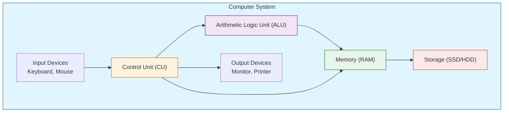
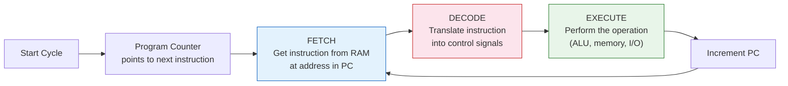
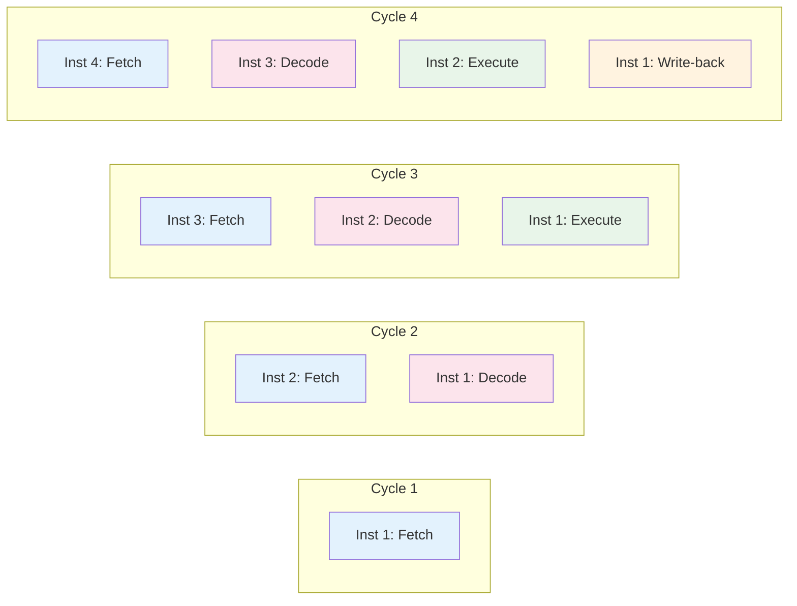
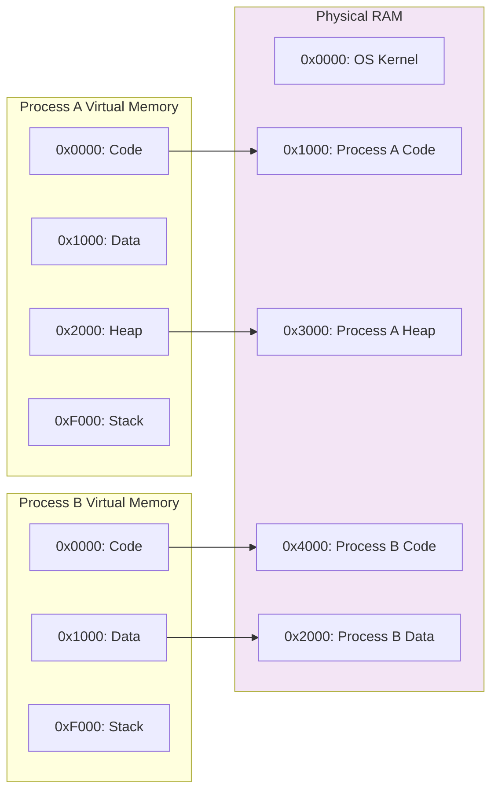
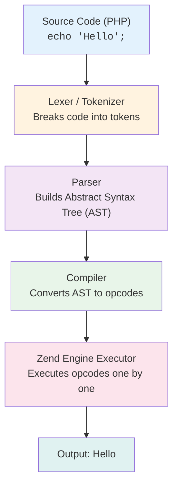
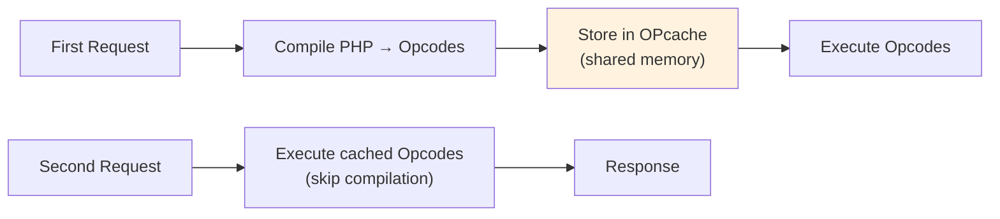

# Chapter 1: How Computers Work

## Learning Objectives

By the end of this chapter you will:
- Understand what a computer is at hardware and software levels
- Explain the CPU's fetch-decode-execute cycle
- Understand how memory (RAM, cache, storage) works
- Know how data is represented in binary
- Understand how programs execute
- Differentiate between compiled and interpreted languages

---

## 1.1 What is a Computer?

### Beginner Level

A computer is an electronic machine that processes data. Think of it like a very fast, very dumb assistant that can only follow exact instructions. It cannot think for itself. It cannot make judgments. It can only do exactly what it is told, in the exact order it is told, with perfect precision every single time.

If you tell it "add 2 and 2," it will give you 4 every time. But if you tell it "add 2 and" without finishing the instruction, it will break because it doesn't know what to do.

### Technical Level

A computer is a Turing-complete machine that accepts input, stores data, processes that data according to stored instructions (programs), and produces output. It consists of hardware (physical components) and software (instructions).

The fundamental architecture is based on the **Von Neumann architecture** (1945), which describes four main components:



**Key Components:**

1. **CPU (Central Processing Unit)** — The "brain." Executes instructions. Measured in GHz (billions of cycles per second). Modern CPUs have multiple cores (2, 4, 8, 16, 64) that can work in parallel.

2. **RAM (Random Access Memory)** — Short-term memory. Fast but volatile (loses data when power is off). Measured in GB. A typical PHP server needs 4-32GB depending on workload.

3. **Storage (SSD/HDD)** — Long-term memory. Slower but persistent.
   - **SSD (Solid State Drive):** Uses NAND flash memory. Fast read/write (~500MB/s for SATA, ~5000MB/s for NVMe). No moving parts.
   - **HDD (Hard Disk Drive):** Uses spinning magnetic platters. Slower (~100MB/s). Mechanical, can fail. Cheaper per GB.

4. **Motherboard** — The nervous system. Connects all components via buses (data pathways).

5. **Input/Output Devices** — Keyboard, mouse, monitor, network card, etc.

### Historical Background

| Era | Milestone |
|-----|-----------|
| **1940s** | ENIAC — 30 tons, 180,000 vacuum tubes, 5,000 additions/sec. Programming required physical rewiring. |
| **1945** | John von Neumann proposed stored-program concept (instructions and data share same memory). |
| **1950s-60s** | Transistors replace vacuum tubes. IBM mainframes dominate enterprise. |
| **1971** | Intel 4004 — First microprocessor (2,300 transistors, 108 kHz clock speed). |
| **1975** | Altair 8800 — First personal computer. |
| **1981** | IBM PC — Standardized personal computing architecture. |
| **1990s** | World Wide Web popularizes PCs. Intel Pentium, AMD. |
| **2000s** | Multi-core processors become standard. Mobile computing rises. |
| **2020s** | Billions of transistors per chip. AI/ML accelerators (GPU, TPU). ARM architecture challenges x86. |

Today, a smartphone has more computing power than the entire NASA Apollo program had in 1969.

### Real-World Analogy

A computer is like a restaurant kitchen:
- **CPU** = The chef (does the actual cooking)
- **RAM** = The countertop (workspace for current tasks)
- **Storage** = The refrigerator/pantry (long-term ingredient storage)
- **Motherboard** = The kitchen layout (plumbing, wiring connecting everything)
- **Input** = Customers placing orders
- **Output** = Plated food served
- **Operating System** = The restaurant manager (organizes workflow, schedules tasks)

---

## 1.2 How the CPU Works

### Beginner Level

The CPU is the brain of the computer. It reads instructions from memory and executes them. Each instruction is stored as binary code (0s and 1s). The CPU has a clock that ticks billions of times per second. On each tick, it can do one small operation.

Think of it as a factory assembly line. Each step in the assembly line does one tiny thing. By the end of the line, a complete operation is done.

### Technical Level

A CPU executes a three-step cycle called the **Instruction Cycle** (or Fetch-Decode-Execute cycle):



**CPU Components in Detail:**

1. **Control Unit (CU):** The traffic cop. Reads instructions, decodes them, and coordinates other components. Uses microcode (built-in instruction interpreter).

2. **Arithmetic Logic Unit (ALU):** The calculator. Performs:
   - Arithmetic: ADD, SUB, MUL, DIV
   - Logic: AND, OR, NOT, XOR
   - Comparison: CMP (compare two values)
   - Bit manipulation: SHL (shift left), SHR (shift right)

3. **Registers:** Ultra-fast, tiny storage inside the CPU (typically 32-64 bits wide). Examples:
   - **PC (Program Counter):** Address of next instruction
   - **IR (Instruction Register):** Current instruction being executed
   - **SP (Stack Pointer):** Top of the stack
   - **ACC (Accumulator):** Stores intermediate arithmetic results
   - **General Purpose (R0-R15):** Temporary storage for program data

4. **Cache:** Very fast memory between CPU and RAM.
   - **L1 Cache:** ~32KB per core, ~1ns access time
   - **L2 Cache:** ~256KB per core, ~4ns access time
   - **L3 Cache:** ~8-32MB shared, ~15ns access time

**Clock Speed:**
- Measured in Hertz (Hz) — cycles per second
- 1 GHz = 1,000,000,000 cycles per second
- Each cycle usually completes one pipeline stage
- Modern CPUs execute multiple instructions per cycle (superscalar)
- Example: 3.5 GHz processor = 3.5 billion cycles/second

**Pipelining:**

Modern CPUs don't just do one instruction at a time. They use a pipeline:



Without pipelining: 4 cycles to complete 1 instruction.
With pipelining: 4 cycles to complete 4 instructions (one finishes each cycle after the pipeline is full).

### Example: Adding Two Numbers

```assembly
; Assembly language (human-readable CPU instructions)
; This is what PHP compiles down to eventually

MOV R1, 5       ; Put value 5 into register R1
MOV R2, 3       ; Put value 3 into register R2
ADD R3, R1, R2  ; Add R1 + R2, store result in R3
; R3 now contains 8
```

**Execution trace:**
1. Cycle 1: Fetch `MOV R1, 5` from address 0x1000
2. Cycle 2: Decode `MOV R1, 5` (move immediate value 5 to R1)
3. Cycle 3: Execute — write 5 to register R1
4. Cycle 4: Fetch `MOV R2, 3` from address 0x1004
5. ...

### Real-World Analogy

The CPU is like a librarian with a precise system:
- **Fetch:** Walks to the shelf (RAM/cache) to get a book (instruction)
- **Decode:** Reads the call number/dewey decimal to understand what's needed
- **Execute:** Performs the action (finds a book, writes a note, checks a fact)
- **Write-back:** Records the result in the log

A modern multi-core CPU is like having multiple librarians working in parallel, each with their own small desk (cache) but sharing the same main storage (RAM).

---

## 1.3 How Memory Works

### Beginner Level

RAM is the computer's workspace. When you open a program, it loads from storage into RAM so the CPU can work with it quickly. RAM is like a giant grid of boxes — each box has a unique address and can hold one byte (8 bits) of data.

When a program finishes, its workspace is cleared and reused by the next program.

### Technical Level

**Memory Hierarchy:**

```
┌─────────────────────────────────────────────────────────────┐
│                  MEMORY HIERARCHY                           │
│                                                             │
│  Level   Type        Size     Speed     Cost/GB    Managed  │
│  ─────   ────        ────     ─────     ───────    ─────── │
│  L0      Registers   1KB      ~0.3ns    $10,000+   CPU     │
│  L1      Cache       64KB     ~1ns      $1,000+    CPU     │
│  L2      Cache       256KB    ~4ns      $500+      CPU     │
│  L3      Cache       8-32MB   ~15ns     $100+      CPU     │
│  L4      RAM         8-64GB   ~80ns     $10        OS      │
│  L5      SSD         256GB+   ~50μs     $0.15      OS/FS  │
│  L6      HDD         2TB+     ~10ms     $0.02      OS/FS  │
│                                                             │
│  Legend: 1μs = 1,000ns     1ms = 1,000,000ns              │
│  CPU at 3GHz executes ~1 instruction per 0.33ns            │
│  RAM access = ~240 CPU cycles wasted waiting               │
└─────────────────────────────────────────────────────────────┘
```

**How Addressing Works:**

Each byte in RAM has a unique address. If you have 8GB of RAM, you have 8,589,934,592 unique addresses (8 × 1024 × 1024 × 1024).

```php
// Behind the scenes of PHP memory allocation:
// 1. PHP requests 4+ bytes from OS via malloc()
// 2. OS allocates physical RAM page (typically 4KB)
// 3. Maps it into PHP's virtual address space
// 4. PHP stores integer 25 at that location
// 5. Creates entry in symbol table: 'age' -> address(0x7FFD4A3B)
$age = 25;

// What's happening in memory:
// Address 0x7FFD4A3B: 00 00 00 19  (25 in hexadecimal = 0x19)
```

**Endianness:**

Computers store multi-byte values in one of two orders:
- **Big Endian:** Most significant byte first (like humans write numbers)
- **Little Endian:** Least significant byte first (used by x86, most modern CPUs)

For the number 0x12345678 (305,419,896 in decimal):
```
Big Endian:    12 34 56 78
Little Endian: 78 56 34 12
```

When reading a binary file created on a different system, you must account for endianness.

**Virtual Memory:**

Each process sees its own **virtual address space** (e.g., 0x00000000 to 0xFFFFFFFF on 32-bit). The OS maps these virtual addresses to physical RAM through **page tables**:



**Benefits of virtual memory:**
1. **Isolation:** Processes can't see each other's memory
2. **Simplification:** Each process thinks it has contiguous memory
3. **Paging:** RAM can be larger than physical memory (swap to disk)
4. **Sharing:** Shared libraries can map to same physical RAM

### Memory Allocation in PHP

```php
// Stack allocation (automatic, fast)
function calculateSum(int $a, int $b): int {
    $result = $a + $b;  // $result allocated on stack
    return $result;
}  // $result freed automatically

// Heap allocation (manual lifetime, slower)
function createLargeArray(): array {
    $data = [];  // Allocated on heap
    for ($i = 0; $i < 1000000; $i++) {
        $data[] = $i;  // Heap grows
    }
    return $data;
}  // $data persists until garbage collected

// Memory-efficient processing
function processLargeFileMemorySafe(string $path): void {
    // BAD: Loads entire file into memory
    // $content = file_get_contents($path);  // ~100MB for 100MB file

    // GOOD: Stream one line at a time
    $handle = fopen($path, 'r');
    while (($line = fgets($handle)) !== false) {
        processLine($line);  // Constant ~4KB memory usage
    }
    fclose($handle);
}
```

### PHP's Garbage Collection

PHP uses **reference counting** with a **cycle collector**:

```php
// Reference counting basics
$a = "Hello";   // refcount = 1 ($a points to "Hello")
$b = $a;        // refcount = 2 (two variables point to same string)
unset($a);      // refcount = 1 ($b still points to it)
unset($b);      // refcount = 0 → memory freed

// Circular reference (GC requires cycle collector)
$parent = new stdClass();
$child = new stdClass();
$parent->child = $child;  // $parent.refcount = 2
$child->parent = $parent; // $child.refcount = 2
unset($parent);  // refcount = 1 (child still references it)
unset($child);   // refcount = 1 (parent still references it... wait)
// Neither can be freed by reference counting!
// PHP's cycle collector detects and frees these
```

### Real-World Analogy

Memory is like a hotel:
- **RAM:** Guest rooms (temporary, fast access)
- **Storage:** Luggage storage room (permanent but slow)
- **L1 Cache:** The front desk counter (items needed RIGHT NOW)
- **L2 Cache:** The office shelf behind the counter
- **Registers:** What the bellboy is holding in their hands
- **Virtual Memory:** Each guest thinks they have the whole hotel
- **Page Table:** The reservation system mapping names to rooms

---

## 1.4 How Data is Represented

### Beginner Level

Everything in a computer is represented as **binary** — ones and zeros. A single binary digit is called a **bit** (binary digit). Eight bits make a **byte**. One byte can represent 256 different values (0 to 255).

When you type the letter 'A', the computer stores the number 65. When you type '5', it stores 53 (the ASCII value of the character '5', not the number 5).

### Technical Level

**Binary System:**

```
Bit:      0 or 1 (binary digit)
Nibble:   4 bits (e.g., 1010)
Byte:     8 bits (e.g., 11001010)
Word:     16/32/64 bits (CPU dependent)

Positional values in 8-bit binary:
128 | 64 | 32 | 16 | 8 | 4 | 2 | 1
  0  | 1  |  0 |  1 | 0 | 1 | 0 | 1

Value = 64 + 16 + 4 + 1 = 85
```

**Conversions:**

```php
// Binary to decimal
bindec('1010101');  // 85

// Decimal to binary
decbin(85);         // '1010101'

// Hexadecimal
dechex(255);        // 'ff'
hexdec('ff');       // 255

// Octal
decoct(64);         // '100'
octdec('100');      // 64
```

**Common Data Sizes:**

| Type | PHP Type | Size | Range/Example |
|------|----------|------|---------------|
| Boolean | `bool` | 1 byte | `true`, `false` |
| Signed Integer | `int` | 4-8 bytes | -2³¹ to 2³¹-1 (32-bit) |
| Unsigned Integer | (none in PHP) | 4-8 bytes | 0 to 2³²-1 |
| Float | `float` | 8 bytes | ±1.7E-308 to ±1.7E+308 |
| Character (ASCII) | `string[1]` | 1 byte | 'A' = 65 (01000001) |
| Character (UTF-8) | `string` | 1-4 bytes | '€' = 3 bytes |
| String | `string` | len + overhead | Variable |

**How Text is Stored:**

ASCII (American Standard Code for Information Interchange) maps each letter to a 7-bit number:

```
'A' = 65 = 01000001
'B' = 66 = 01000010
'a' = 97 = 01100001
'0' = 48 = 00110000
' ' = 32 = 00100000  (space)
'\n' = 10 = 00001010 (newline)
```

When you type "Hello" in a text editor, the computer stores: `72 101 108 108 111`.

**Unicode and UTF-8:**

ASCII only supports 128 characters (English, basic symbols). Unicode supports every writing system. UTF-8 is the dominant encoding:

```
Character  Unicode    UTF-8 (binary)
'A'        U+0041    01000001                    (1 byte)
'é'        U+00E9    11000011 10101001           (2 bytes)
'€'        U+20AC    11100010 10000010 10101100  (3 bytes)
'𐍈'       U+10348   11110000 10010000 10001101 10001000 (4 bytes)
```

**How PHP Stores Strings Internally:**

```php
// PHP stores strings as:
// struct {
//     char *val;        // Pointer to character data
//     size_t len;       // Length (binary-safe)
//     size_t refcount;  // Reference count
// } zend_string;

$str = "Hello";  // Memory: 'H' 'e' 'l' 'l' 'o' '\0'
                 // PHP also stores length = 5
```

PHP strings are **binary-safe** — they can contain null bytes, which is important for:
- Binary data (images, files)
- Encrypted data
- Network protocols

**Real-World Analogy**

Binary is like a light switch:
- ON = 1
- OFF = 0

A byte is a wall of 8 light switches. By setting switches on/off in different patterns, you can represent 256 different "codes." We've agreed that code 65 means the letter 'A', code 48 means the digit '0', etc. These agreements are called **character encodings**.

---

## 1.5 How Programs Work

### Beginner Level

A program is a list of instructions that tells the computer what to do. You write code in a programming language (like PHP), but the computer doesn't understand that code directly. The code must be translated into machine language (binary) that the CPU can execute.

Think of it like writing a recipe in English, then having someone translate it into the chef's native language before cooking.

### Technical Level

**Program Execution Flow:**



**Compiled vs Interpreted Languages:**

| Aspect | Compiled (C, Rust, Go) | Interpreted (PHP, Python, JS) |
|--------|----------------------|-------------------------------|
| Translation | Ahead of time (AOT) | Just in time (JIT) |
| Output | Binary executable (machine code) | Bytecode (then interpreted) |
| Speed | Fast (native machine code) | Slower (intrepretation overhead) |
| Distribution | Binary file per platform | Source code / bytecode |
| Example | `gcc program.c -o program` | `php script.php` |
| Memory management | Manual (malloc/free) or RAII | Automatic (GC) |
| Development cycle | Compile → Link → Run | Run directly |

PHP is technically a compiled language — it compiles to **opcodes** (bytecode) which are then executed by the Zend Engine. However, compilation happens at runtime, so it's called "interpreted."

**The Zend Engine (PHP 8.x):**

PHP's execution engine works through these phases:

1. **Lexing:** Converts source code into tokens
   ```
   Input:  <?php echo 2 + 3;
   Tokens: T_OPEN_TAG T_ECHO T_LNUMBER T_PLUS T_LNUMBER T_SEMICOLON
   ```

2. **Parsing:** Converts tokens into an Abstract Syntax Tree (AST)
   ```
   ZEND_AST_ECHO
     └── ZEND_AST_BINARY_OP (ADD)
           ├── ZEND_AST_ZVAL (2)
           └── ZEND_AST_ZVAL (3)
   ```

3. **Compilation:** Converts AST into opcodes
   ```
   line     #*  op           return  operands
   ------------------------------------------
      1     0  ASSIGN       $0      2
            1  ASSIGN       $1      3
            2  ADD          $2      $0, $1
            3  ECHO                 $2
            4  RETURN              1
   ```

4. **Execution:** Zend Engine executes opcodes sequentially
   - Loads value 2 into $0
   - Loads value 3 into $1
   - Adds $0 + $1, stores in $2
   - Outputs "5"

**OPcache:**

PHP's OPcache stores compiled opcodes in shared memory, skipping the lexing/parsing/compilation steps on subsequent requests:



With OPcache, PHP execution speed improves 2-3x for typical web applications.

### How PHP Differs from C

```c
// C: Manual memory management
#include <stdio.h>
#include <stdlib.h>

int main() {
    int* arr = malloc(10 * sizeof(int));  // Allocate on heap
    arr[0] = 42;
    printf("%d\n", arr[0]);
    free(arr);  // MUST free or memory leak
    return 0;
}
```

```php
// PHP: Automatic memory management
function createAndUseArray(): void {
    $arr = [42];          // Allocated on heap
    echo $arr[0];          // Output: 42
    // No free needed — GC handles it when variable goes out of scope
}
```

### Real-World Analogy

A program is like a cooking recipe:
- **Source code:** The recipe written in English
- **Compiler/Interpreter:** The translator who converts recipe steps into kitchen actions
- **CPU:** The chef who performs each step
- **RAM:** The counter where ingredients (data) are placed
- **Variables:** Labeled bowls (bowl "age" holds value 25)
- **Functions:** Sub-recipes (make sauce, chop vegetables)
- **Stack:** The chef's immediate hands-on workspace
- **Heap:** The storage closet (bigger, holds more, takes time to access)
- **OPcache:** A laminated copy of frequently-used recipes

---

## 1.6 Best Practices

### For New Programmers

1. **Understand before coding:** Before writing PHP, understand what happens inside the computer. Every variable declaration, every function call — there are real physical operations happening at nanosecond speed.

2. **Resource awareness:** PHP runs on servers shared by many users. Inefficient code affects everyone. Always consider memory and CPU usage.

3. **Memory is not infinite:** A PHP process typically has 128MB-256MB limit. A single careless file read can exhaust it.

### For Professional PHP Developers

```php
// SENIOR-LEVEL: Understanding when memory allocations happen
class UserRepository
{
    /**
     * BAD: Inefficient memory usage
     * Loads ALL users into memory, filters in PHP
     */
    public function getActiveUsersBad(): array
    {
        $allUsers = $this->db->query('SELECT * FROM users'); // Could be millions
        $active = [];
        foreach ($allUsers as $user) {
            if ($user['status'] === 'active') {
                $active[] = $user; // Another copy in memory
            }
        }
        return $active;
    }

    /**
     * GOOD: Let database do the filtering
     * Only loads active users into memory
     */
    public function getActiveUsersGood(): array
    {
        return $this->db->query(
            'SELECT * FROM users WHERE status = ?',
            ['active']
        );
    }
}
```

### For Architects

```php
// ARCHITECT-LEVEL: Designing for scale
interface CacheInterface
{
    public function get(string $key): mixed;
    public function set(string $key, mixed $value, int $ttl = 300): void;
}

class MemoryCache implements CacheInterface
{
    private array $store = [];
    
    public function get(string $key): mixed
    {
        return $this->store[$key] ?? null;
    }
    
    public function set(string $key, mixed $value, int $ttl = 300): void
    {
        $this->store[$key] = $value;
    }
}

class RedisCache implements CacheInterface
{
    public function __construct(
        private readonly Redis $redis
    ) {}
    
    public function get(string $key): mixed
    {
        $data = $this->redis->get("cache:{$key}");
        return $data ? unserialize($data) : null;
    }
    
    public function set(string $key, mixed $value, int $ttl = 300): void
    {
        $this->redis->setex("cache:{$key}", $ttl, serialize($value));
    }
}
```

---

## 1.7 Common Mistakes

| Mistake | Why It's Bad | Solution |
|---------|--------------|----------|
| Ignoring memory limits | App crashes on large datasets | Use streaming, chunking, or pagination |
| Not understanding binary | Security bugs, encoding issues | Study ASCII, UTF-8, binary protocols |
| Confusing storage and memory | "I have 500GB free, why can't PHP use 2GB?" | Know the difference: storage ≠ RAM |
| Ignoring caching | 2x-10x slower performance | Enable OPcache, use Redis/Memcached |
| Treating computers as magic | Can't debug properly | Understand the layers |
| Writing C-style PHP | Memory-inefficient, error-prone | Use PHP idioms and built-in functions |
| Not considering CPU caches | Hot loops thrash cache | Locality of reference, data-oriented design |

---

## 1.8 Exercises

### Beginner Exercises

1. **Binary conversion:** Convert 42, 255, and 1024 to binary.
2. **Memory calculation:** How many bytes are in 2GB of RAM?
3. **ASCII decode:** What message does `72 101 108 108 111 44 32 87 111 114 108 100 33` spell?
4. **Identify components:** List the main components of a computer and their roles.
5. **Von Neumann vs Harvard:** What's the difference between modern architectures?

### Intermediate Exercises

1. **Instruction trace:** Trace the execution of `$x = 10; $y = 20; $z = $x + $y; echo $z;` through the Zend Engine pipeline.
2. **Endianness:** Write PHP code to detect whether the system is little-endian or big-endian.
3. **Memory profiling:** Create a PHP script that demonstrates the memory difference between loading a 100MB file fully vs streaming it line by line.
4. **Cache simulation:** Implement a simple LRU cache to understand how CPU caches work.
5. **Binary file parsing:** Read a PNG file header and validate the magic bytes `89 50 4E 47 0D 0A 1A 0A`.

### Advanced Exercises

1. **PHP memory allocator:** Research and explain how PHP's Zend Memory Manager differs from malloc.
2. **GC analysis:** Create a script that deliberately creates circular references and measure when the cycle collector triggers.
3. **Profiling:** Use Xdebug to profile a PHP script and identify cache misses and memory hotspots.
4. **Custom opcode:** Research the PHP opcode format and list the most commonly executed opcodes.
5. **Assembly comparison:** Write a simple loop in PHP, then compare performance with the equivalent C program.

---

## 1.9 Mini Project: System Information Dashboard

Create a PHP CLI script that displays comprehensive system information:

```php
#!/usr/bin/env php
<?php
/**
 * System Information Dashboard
 * 
 * Displays hardware and system information about the current machine.
 * Run: php system-info.php
 */

class SystemInfo
{
    public function getCpuInfo(): array
    {
        $cpuInfo = file_get_contents('/proc/cpuinfo');
        $cores = [];
        preg_match_all('/^processor\s+:\s(\d+)$/m', $cpuInfo, $cores);
        
        preg_match('/^model name\s+:\s(.+)$/m', $cpuInfo, $modelName);
        
        return [
            'cores' => count($cores[0] ?? []),
            'model' => $modelName[1] ?? 'Unknown',
        ];
    }

    public function getMemoryInfo(): array
    {
        $memInfo = file_get_contents('/proc/meminfo');
        
        preg_match('/^MemTotal:\s+(\d+)\skB$/m', $memInfo, $total);
        preg_match('/^MemFree:\s+(\d+)\skB$/m', $memInfo, $free);
        preg_match('/^MemAvailable:\s+(\d+)\skB$/m', $memInfo, $avail);
        
        return [
            'total' => (int)($total[1] ?? 0) * 1024,
            'free' => (int)($free[1] ?? 0) * 1024,
            'available' => (int)($avail[1] ?? 0) * 1024,
        ];
    }

    public function getDiskInfo(): array
    {
        $disks = [];
        foreach (['/', '/home', '/var'] as $path) {
            if (!is_dir($path)) continue;
            $free = disk_free_space($path);
            $total = disk_total_space($path);
            $disks[$path] = [
                'total' => $total,
                'free' => $free,
                'used_percent' => round((1 - $free / $total) * 100, 1),
            ];
        }
        return $disks;
    }

    public function formatBytes(int $bytes): string
    {
        $units = ['B', 'KB', 'MB', 'GB', 'TB'];
        $i = 0;
        while ($bytes >= 1024 && $i < count($units) - 1) {
            $bytes /= 1024;
            $i++;
        }
        return round($bytes, 2) . ' ' . $units[$i];
    }

    public function display(): void
    {
        echo str_repeat('=', 60) . PHP_EOL;
        echo '  PHP MASTERY COURSE — System Information' . PHP_EOL;
        echo str_repeat('=', 60) . PHP_EOL . PHP_EOL;

        // CPU
        $cpu = $this->getCpuInfo();
        echo "CPU:" . PHP_EOL;
        echo "  Model: {$cpu['model']}" . PHP_EOL;
        echo "  Cores: {$cpu['cores']}" . PHP_EOL . PHP_EOL;

        // Memory
        $mem = $this->getMemoryInfo();
        echo "Memory:" . PHP_EOL;
        echo "  Total:     {$this->formatBytes($mem['total'])}" . PHP_EOL;
        echo "  Free:      {$this->formatBytes($mem['free'])}" . PHP_EOL;
        echo "  Available: {$this->formatBytes($mem['available'])}" . PHP_EOL . PHP_EOL;

        // Disk
        echo "Disk:" . PHP_EOL;
        foreach ($this->getDiskInfo() as $mount => $info) {
            echo "  {$mount}:";
            echo " {$this->formatBytes($info['total'])} total,";
            echo " {$this->formatBytes($info['free'])} free,";
            echo " {$info['used_percent']}% used" . PHP_EOL;
        }
        echo PHP_EOL;

        // PHP info
        echo "PHP:" . PHP_EOL;
        echo "  Version: " . PHP_VERSION . PHP_EOL;
        echo "  Memory limit: " . ini_get('memory_limit') . PHP_EOL;
        echo "  Max execution: " . ini_get('max_execution_time') . 's' . PHP_EOL . PHP_EOL;

        echo str_repeat('=', 60) . PHP_EOL;
    }
}

$info = new SystemInfo();
$info->display();
```

---

## 1.10 Interview Questions

### Junior Level

1. "Explain what happens when you type a URL in a browser and press Enter."
2. "What's the difference between RAM and a hard drive?"
3. "How does a CPU execute instructions?"
4. "What is binary and why do computers use it?"
5. "Explain what a program is in your own words."

### Mid-Level

1. "How does virtual memory work and why is it important?"
2. "Explain the difference between a process and a thread."
3. "What is endianness and when does it matter?"
4. "How does PHP's garbage collection work?"
5. "Explain the memory hierarchy (registers, cache, RAM, disk)."

### Senior Level

1. "How would you debug a memory leak in a PHP application?"
2. "Explain how CPU pipelining works and how branch prediction affects performance."
3. "Design a caching strategy for a high-traffic PHP application."
4. "How does the Zend Engine execute PHP code? Walk through the full pipeline."
5. "Explain cache coherency in multi-core systems and how it might affect a PHP application."

### Architect Level

1. "Design a system that can handle 100,000 concurrent users on a PHP backend."
2. "How would you profile and optimize a PHP application that's CPU-bound vs I/O-bound?"
3. "Explain how you'd architect a multi-tenant SaaS application considering CPU cache behavior and memory locality."
4. "Compare and contrast different approaches to PHP execution: FPM, async (ReactPHP/AMPHP), and Swoole from a systems perspective."
5. "How would you design a distributed caching layer that accounts for the memory hierarchy of 50+ servers?"

---

## Further Reading

- **Book:** "Computer Systems: A Programmer's Perspective" by Bryant & O'Hallaron
- **Book:** "Code: The Hidden Language of Computer Hardware and Software" by Charles Petzold
- **Documentation:** [PHP Internals Book](https://www.phpinternalsbook.com/)
- **Resource:** [CPU Architecture Guide](https://cpu.land/)
- **Video:** "How a CPU Works" by Computerphile (YouTube)
- **Tool:** [Godbolt Compiler Explorer](https://godbolt.org/) — See what code compiles to at the CPU level

---

*End of Chapter 1. Proceed to Chapter 2: How Operating Systems Work.*
