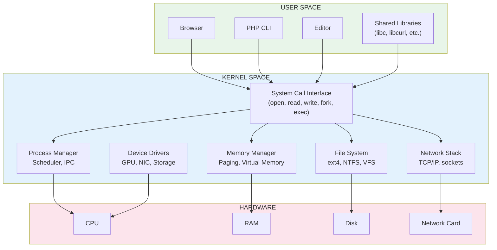
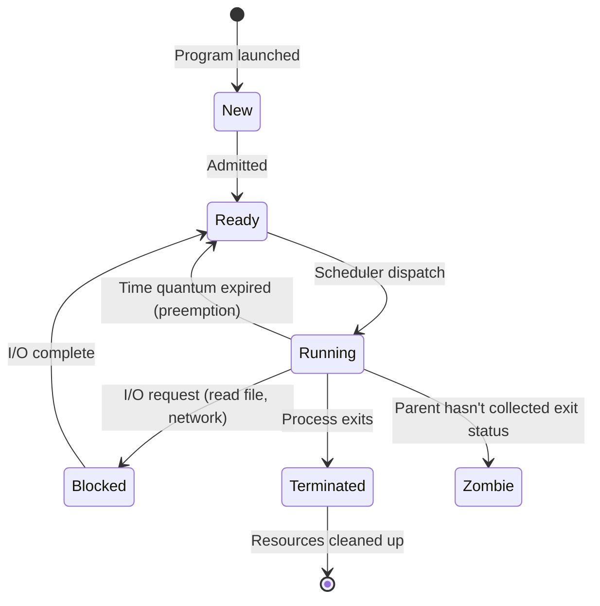
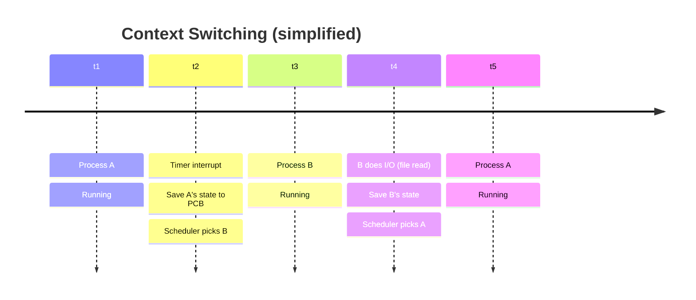
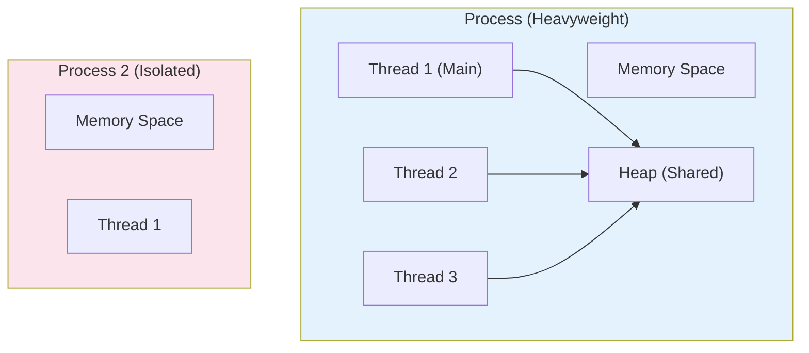
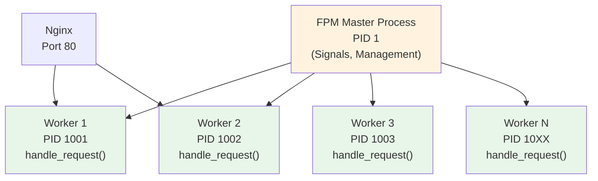
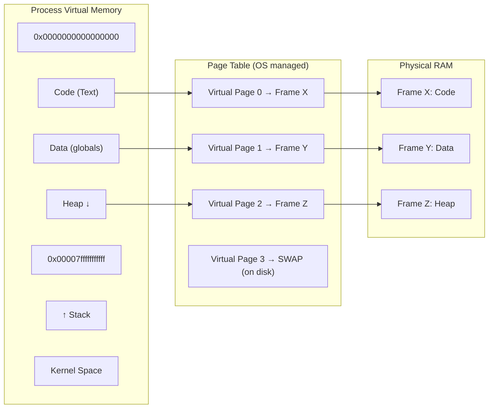
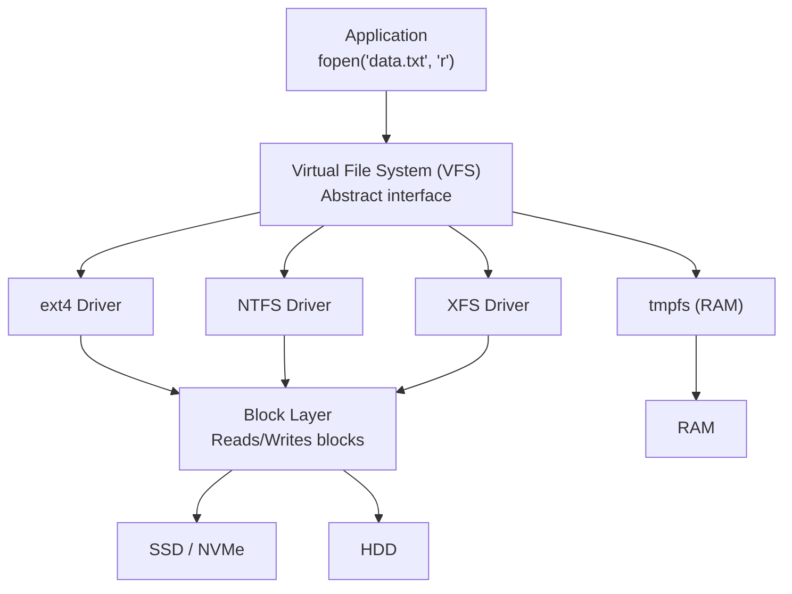

# Chapter 2: How Operating Systems Work

## Learning Objectives

By the end of this chapter you will:
- Understand what an OS does and why it exists
- Differentiate between kernel space and user space
- Understand process management and the process lifecycle
- Understand memory management, virtual memory, and paging
- Know the Linux file system structure
- Be able to use essential Linux commands for PHP development
- Set up a PHP development environment on Linux

---

## 2.1 What is an Operating System?

### Beginner Level

An operating system (OS) is the master program that runs your computer. It manages everything: which programs can run, how they access memory, how files are stored, and how devices communicate. Windows, macOS, and Linux are operating systems.

Without an OS, every program would need to know exactly how to talk to every hardware device directly — which would be impossibly complex. The OS provides a **standard interface** so programs can work on different hardware.

### Technical Level

The OS is a **resource manager**. It manages:

1. **Process Management** — Creating, scheduling, and terminating processes
2. **Memory Management** — Allocating and protecting RAM
3. **File System** — Organizing data on storage devices
4. **Device Management** — Providing drivers for hardware
5. **Security** — User permissions, access control, isolation
6. **Networking** — The network protocol stack

**OS Architecture:**



**Kernel Space vs User Space:**

| Aspect | User Space | Kernel Space |
|--------|------------|-------------|
| Privilege level | Ring 3 (lowest) | Ring 0 (highest) |
| Hardware access | None (must syscall) | Full |
| Memory access | Own virtual address space | All of physical memory |
| Crash effect | One process crashes | Entire system crashes |
| Examples | PHP, Nginx, MySQL (as processes) | Scheduler, drivers, memory manager |

**System Calls:**

When a program needs to do something privileged (like write to a file), it must ask the OS through a **system call**:

```c
// What happens when PHP runs file_put_contents()
// Simplified C equivalent:

#include <unistd.h>
#include <fcntl.h>

int save_file(const char* path, const char* data) {
    // Transition from user mode to kernel mode
    int fd = open(path, O_WRONLY | O_CREAT, 0644);
    // open() triggers syscall 2 (x86_64)
    
    if (fd < 0) return -1;
    
    ssize_t written = write(fd, data, strlen(data));
    // write() triggers syscall 1
    
    close(fd);
    // close() triggers syscall 3
    
    return written;
}
```

Each syscall has a ~1μs overhead due to the mode switch. PHP minimizes syscalls by buffering I/O.

### Real-World Analogy

The OS is like the management of an office building:
- **CPU Time** = Meeting room scheduling
- **Memory** = Office desks
- **Storage** = Filing cabinets
- **Devices** = Printers, coffee machines
- **Security** = Security guard at the entrance
- **Processes** = Different companies in the building
- **Kernel** = Building management (exclusive access to maintenance areas)
- **System calls** = Calling building management to unlock a utility closet

---

## 2.2 Process Management

### Beginner Level

A process is a running program. When you double-click an application, the OS creates a process for it. Each process has its own memory space, its own state, and its own priority. The OS juggles running many processes at once by rapidly switching between them — this is called **multitasking**.

### Technical Level

**Process States:**



**Process Control Block (PCB):**

Every process has a data structure in the kernel containing:

```
Process Control Block (task_struct in Linux)
┌─────────────────────────────────────────┐
│ Process ID (PID)   e.g., 12345          │
│ State              Running, Sleeping    │
│ Program Counter    Address of next instr│
│ CPU Registers      Saved context        │
│ Memory Limits      Virtual addr space   │
│ Open Files         File descriptors     │
│ Priority           Nice value           │
│ Owner              UID, GID             │
│ Signal handlers    SIGINT, SIGTERM, etc │
│ Children           Child process PIDs   │
│ Accounting         CPU time used        │
│ Namespace          Container isolation  │
└─────────────────────────────────────────┘
```

**Context Switching:**

The OS saves the state of the current process (registers, program counter, memory map) and loads the saved state of another process. This happens hundreds to thousands of times per second:



**Process vs Thread:**



**Key differences:**
- **Process:** Isolated memory. Heavier creation. More protection.
- **Thread:** Shared memory within a process. Lighter creation. Less protection.

**PHP's Process Model (FPM):**

PHP-FPM uses a **pre-fork model** — the master process creates a pool of worker processes at startup:



**FPM Configuration (`/etc/php/8.1/fpm/pool.d/www.conf`):**

```ini
; Process management settings
pm = dynamic                    ; Choose how workers are managed
pm.max_children = 50            ; Max worker processes
pm.start_servers = 5            ; Workers created at startup
pm.min_spare_servers = 5        ; Keep at least this many idle
pm.max_spare_servers = 35       ; Max idle workers
pm.max_requests = 500           ; Restart worker after N requests
```

Each worker handles exactly one request at a time. PHP is single-threaded, so concurrency comes from multiple processes, not threads.

### Real-World Analogy

Processes are like separate food trucks:
- **Process:** Each truck has its own kitchen, supplies, and staff (isolated)
- **Thread:** Multiple cooks working in the same truck sharing equipment
- **Context Switch:** A cook moving from one truck to another (but in computing, this is the OS's scheduler moving between trucks)
- **Pre-fork model:** A catering company hires 10 chefs in advance, keeps them ready, assigns work as orders come in

---

## 2.3 Memory Management

### Beginner Level

When a program runs, it needs memory for its code, its data, and its stack (for function calls). The OS allocates this memory and ensures one program can't access another's memory. When a program finishes, the OS reclaims its memory.

### Technical Level

**Virtual Memory:**

Each process gets its own **virtual address space**. On 64-bit Linux, this is a 128TB space per process. The OS maps virtual addresses to physical RAM through **page tables**:



**Page Faults:**

When a process accesses a virtual address that isn't in physical RAM (page is swapped to disk or not yet allocated), a **page fault** occurs:

```
1. Process accesses address not in RAM
2. CPU triggers page fault exception
3. OS checks if address is valid
4. If valid: OS loads page from disk (swap) into RAM
5. Update page table entry
6. Resume process
7. If invalid: SIGSEGV (Segmentation Fault) → process crashes
```

**Memory Layout of a Process (Linux x86_64):**

```
0x0000000000000000
┌──────────────────────────────┐
│         Unusable             │  (NULL pointer guard)
├──────────────────────────────┤
│         Code (.text)         │  ← Executable instructions
├──────────────────────────────┤
│     Initialized Data (.data) │  ← Global vars with values
├──────────────────────────────┤
│   Uninitialized Data (.bss)  │  ← Global vars without values
├──────────────────────────────┤
│                              │
│         Heap                 │  ← malloc(), new, array allocations
│            ↓                 │
│                              │
│         (unused)             │
│                              │
│            ↑                 │
│         Stack                │  ← Local variables, function calls
│                              │
├──────────────────────────────┤
│     Environment vars, argv   │
├──────────────────────────────┤
│      Argument/Environment    │
├──────────────────────────────┤
│        Stack (downward)      │
│              ↑                │
│                              │
├──────────────────────────────┤
│         Kernel Space         │  ← Inaccessible from user mode
0x00007fffffffffff
```

**Memory Allocation in PHP:**

```php
// Stack allocation (automatic, extremely fast)
function add(int $a, int $b): int {
    $result = $a + $b;  // All 3 variables on stack
    return $result;
}  // Automatically cleaned up

// Heap allocation (explicit, slower, flexible lifetime)
function createUsers(): array {
    $users = [];  // Heap allocation (zend_array)
    
    for ($i = 0; $i < 1000; $i++) {
        $users[] = [
            'id' => $i,
            'name' => "User {$i}",
            'email' => "user{$i}@example.com",
        ];
    }
    
    return $users;  // Heap persists after function returns
}  // Local $users pointer cleaned from stack, but data remains on heap

// Memory profiling with PHP
$startMemory = memory_get_usage();

$data = range(1, 100000);
echo memory_get_usage() - $startMemory, ' bytes', PHP_EOL;
// Output: ~5,600,000 bytes (56 bytes per element + overhead)

unset($data);  // Force garbage collection
```

**PHP Memory Limit:**

```ini
; php.ini
memory_limit = 128M  ; Default
```

When exceeded:
```
Fatal error: Allowed memory size of 134217728 bytes exhausted
(tried to allocate 4096 bytes) in /var/www/app.php on line 42
```

### Real-World Analogy

Memory management is like a hotel:
- **Virtual Memory:** Each guest thinks they have a private suite (isolated)
- **Page Table:** The front desk's map (room number → actual room location)
- **Page Fault:** Guest wants to use a room that's currently being cleaned — they wait until it's ready
- **Swap:** The hotel's off-site storage (cheaper, but slow to access)
- **Segmentation Fault:** Guest tries to enter a room that doesn't exist — security escorts them out

---

## 2.4 File Systems

### Beginner Level

The file system is how the OS organizes files on storage. It uses a hierarchy of directories (folders) and files. Every file has a path like `/home/user/document.txt`. The OS translates this path into physical locations on the disk.

### Technical Level

**File System Layers:**



**Inodes (ext4):**

Files are stored using **inodes** (index nodes). Each file has one inode that stores metadata:

```
Directory "/home/user"
┌────────────────────────────────────────┐
│   filename   │  inode number          │
├────────────────────────────────────────┤
│   .          │  12345                 │
│   ..         │  12344                 │
│   file.txt   │  54321                 │
│   docs/      │  98765                 │
│   photos/    │  98766                 │
└────────────────────────────────────────┘

Inode #54321
┌────────────────────────────────────────┐
│  Type:    Regular file                 │
│  Mode:    0644 (rw-r--r--)            │
│  UID:     1000 (user)                 │
│  GID:     1000 (user)                 │
│  Size:    2048 bytes                  │
│  atime:   2024-01-15 10:30:00         │
│  mtime:   2024-01-15 10:30:00         │
│  ctime:   2024-01-15 10:30:00         │
│  Blocks:  8 (512-byte blocks)         │
│  Pointers:                             │
│    direct[0]: 0x3A2F                  │
│    direct[1]: 0x4B1E                  │
│    direct[2]: 0x5C0D                  │
│    indirect: 0x6F1A → more pointers   │
└────────────────────────────────────────┘
```

**Linux Directory Structure:**

| Path | Purpose | PHP Relevance |
|------|---------|---------------|
| `/` | Root directory | — |
| `/bin/` | Essential user binaries | `php`, `ls`, `cp` live here |
| `/sbin/` | System binaries | `fdisk`, `mkfs` |
| `/etc/` | Configuration files | PHP config: `/etc/php/` |
| `/var/www/` | Web server files | Your PHP project files |
| `/var/log/` | Log files | Nginx, PHP-FPM logs |
| `/var/cache/` | Cached data | OPcache, meta data |
| `/tmp/` | Temporary files | Cleared on boot |
| `/home/` | User home directories | Your development files |
| `/usr/local/` | Locally installed software | Custom PHP builds |
| `/opt/` | Optional third-party | Composer global packages |

**File Permissions (Linux):**

```
-rw-r--r--  1  user  group  1024  Jun 1 10:00  script.php
││││││││││  │   │      │     │        │        │
││││││││││  │   │      │     │        │        └── Filename
││││││││││  │   │      │     │        └─────────── Last modified
││││││││││  │   │      │     └────────────────────── File size (bytes)
││││││││││  │   │      └──────────────────────────── Group
││││││││││  │   └─────────────────────────────────── Owner
││││││││││  └─────────────────────────────────────── Hard link count
│││││││││└───────────────────────────────────────── Other: execute
││││││││└────────────────────────────────────────── Other: write
│││││││└─────────────────────────────────────────── Other: read
││││││└──────────────────────────────────────────── Group: execute
│││││└───────────────────────────────────────────── Group: write
││││└────────────────────────────────────────────── Group: read
│││└─────────────────────────────────────────────── Owner: execute
││└──────────────────────────────────────────────── Owner: write
│└───────────────────────────────────────────────── Owner: read
└────────────────────────────────────────────────── Type: - file / d directory
```

**Numeric Permissions (Octal):**

```
r = 4, w = 2, x = 1

chmod 755 script.php
  Owner: 7 = rwx (4+2+1)
  Group: 5 = r-x (4+0+1)
  Other: 5 = r-x (4+0+1)

chmod 644 file.txt
  Owner: 6 = rw-
  Group: 4 = r--
  Other: 4 = r--
```

### Essential Linux Commands for PHP Developers

```bash
# Apache/Nginx Logs
tail -f /var/log/nginx/access.log    # Watch Nginx access log live
tail -f /var/log/nginx/error.log     # Watch Nginx error log live
tail -f /var/log/php8.1-fpm.log     # Watch PHP-FPM log live

# Process Monitoring
ps aux | grep php                     # Find PHP processes
ps auxf                              # Tree view of processes
top -u www-data                      # Monitor web server processes
htop                                 # Interactive process viewer

# File Operations
ls -lah /var/www                     # List files with sizes
du -sh /var/www/project              # Directory size
df -h                                # Disk space usage
find /var/www -name "*.php"          # Find all PHP files

# Permissions
chown -R www-data:www-data /var/www  # Set web server ownership
chmod -R 755 /var/www                # Set directory permissions
chmod 644 /var/www/index.php         # Set file permissions

# Text Processing
grep -r "function" src/              # Search for functions
grep -rn "TODO\|FIXME" src/         # Find todos
sed -i 's/old/new/g' file.php        # Replace text in file
awk '{print $1}' access.log         # Extract first column

# PHP Specific
php -v                               # PHP version
php -m                               # Loaded modules
php -i | grep memory                 # PHP config value
php -l script.php                    # Syntax check (lint)
php -r "echo PHP_INT_MAX;"          # Run inline PHP

# Composer
composer install                     # Install dependencies
composer update                     # Update dependencies
composer dump-autoload              # Regenerate autoload files

# Process Control
kill -TERM 1234                     # Gracefully kill process
kill -9 1234                        # Force kill (SIGKILL)
pkill -f "php-fpm"                  # Kill all matching processes

# Network
netstat -tlnp | grep :80            # Who's listening on port 80
ss -tlnp                            # Modern netstat
curl -I http://localhost            # HTTP headers only
curl -v http://localhost            # Verbose HTTP request

# System Monitoring
free -h                             # Memory usage
vmstat 1                            # System stats every second
iostat -x 1                         # Disk I/O stats
lsof -i :3306                       # Who's using MySQL port
```

### Real-World Analogy

The file system is like a giant filing cabinet:
- **Root directory (`/`)** = The filing cabinet
- **Directories** = Folders organizing documents
- **Files** = Individual documents
- **Inode** = The index card: "Document X is in Cabinet 2, Drawer 4, Folder 7"
- **VFS** = A universal filing clerk who can work with any filing system
- **Permissions** = Locks on drawers (Owner can read/write, Others can only read)
- **Symlink** = A sticky note saying "The real document is in Cabinet 3"

---

## 2.5 Linux for PHP Development

### Why Linux?

- **70%+ of web servers run Linux**
- **PHP runs natively** — no translation layer needed
- **Package managers** make installing PHP/Nginx/MySQL trivial
- **CLI tools** are designed for Linux first
- **Docker** is Linux-native (VMs needed on other OSes)
- **Performance** — Linux networking stack is production-proven
- **Cost** — Free, no licensing fees

### Setting Up PHP Development on Ubuntu

```bash
#!/bin/bash
# Complete PHP development environment setup for Ubuntu 22.04+

echo "=== PHP Development Environment Setup ==="

# Update package lists
sudo apt update && sudo apt upgrade -y

# Install Nginx (web server)
sudo apt install nginx -y

# Install PHP 8.2 with common extensions
sudo apt install php8.2-fpm php8.2-cli php8.2-common \
    php8.2-mysql php8.2-pgsql php8.2-sqlite3 \
    php8.2-xml php8.2-mbstring php8.2-curl php8.2-gd \
    php8.2-zip php8.2-bcmath php8.2-intl php8.2-redis \
    php8.2-imagick php8.2-xdebug -y

# Install MySQL
sudo apt install mysql-server -y
sudo mysql_secure_installation

# Install PostgreSQL (alternative)
sudo apt install postgresql postgresql-contrib -y

# Install Redis
sudo apt install redis-server -y

# Install Composer (PHP package manager)
php -r "copy('https://getcomposer.org/installer', 'composer-setup.php');"
php -r "if (hash_file('sha384', 'composer-setup.php') === '$(curl -s https://composer.github.io/installer.sig)') { echo 'Installer verified'; } else { echo 'Installer corrupt'; unlink('composer-setup.php'); } echo PHP_EOL;"
php composer-setup.php
php -r "unlink('composer-setup.php');"
sudo mv composer.phar /usr/local/bin/composer

# Install Node.js (for Laravel Mix/Vite)
curl -fsSL https://deb.nodesource.com/setup_18.x | sudo -E bash -
sudo apt install nodejs -y

# Install Git
sudo apt install git -y

# Verify installations
echo "=== Versions ==="
nginx -v
php -v
mysql --version
composer --version
node --version
git --version

echo "=== Setup Complete ==="
echo "Web root: /var/www/html"
echo "PHP config: /etc/php/8.2/"
echo "Nginx config: /etc/nginx/"
```

### Essential PHP-FPM Configuration

```ini
; /etc/php/8.2/fpm/php.ini (key settings)
memory_limit = 256M          ; Max memory per PHP process
max_execution_time = 30      ; Max execution time (seconds)
upload_max_filesize = 64M    ; Max upload file size
post_max_size = 64M          ; Max POST data size
date.timezone = UTC          ; Default timezone
display_errors = Off         ; Never show errors in production
error_reporting = E_ALL      ; Log all errors
log_errors = On              ; Enable error logging
error_log = /var/log/php_errors.log
opcache.enable = 1           ; Enable OPcache
opcache.memory_consumption = 256  ; OPcache memory
opcache.max_accelerated_files = 20000  ; Max cached files
```

### Real-World Analogy

Using Linux for development is like having a workshop where all your tools are designed to work together:
- `apt` = The toolbox manager (install/remove tools)
- `php` = Your primary tool (the hammer)
- `nginx` = The storefront
- `mysql` = The inventory database
- `composer` = The parts supplier
- `git` = The blueprint version control
- `/var/log/` = The daily log book of what went wrong

---

## 2.6 Best Practices

### PHP System Administration

```bash
# Monitor PHP-FPM status
# Enable in /etc/php/8.2/fpm/pool.d/www.conf:
# pm.status_path = /status

curl http://localhost/status?plain

# Output:
# pool:                 www
# process manager:      dynamic
# start time:           15/Jan/2024:10:00:00
# start since:          36000
# accepted conn:        150000
# listen queue:         0        # Should be near 0
# max listen queue:     5
# listen queue len:     128
# idle processes:       12
# active processes:     3
# total processes:      15
# max active processes: 45
# max children reached: 0
# slow requests:        0
```

```php
// Best practice: Check system limits in code
class SystemChecker
{
    public static function checkMemoryLimit(int $neededMB): bool
    {
        $limit = ini_get('memory_limit');
        
        // Parse human-readable limit
        if ($limit === '-1') return true; // Unlimited
        if ($limit === '') return true;   // No limit set
        
        $unit = strtolower(substr($limit, -1));
        $value = (int)substr($limit, 0, -1);
        
        $multipliers = [
            'g' => 1024,
            'm' => 1,
            'k' => 0.001,
        ];
        
        $availableMB = $value * ($multipliers[$unit] ?? 1);
        return $availableMB >= $neededMB;
    }
    
    public static function getSystemInfo(): array
    {
        return [
            'os' => PHP_OS,
            'php_version' => PHP_VERSION,
            'memory_limit' => ini_get('memory_limit'),
            'max_execution_time' => ini_get('max_execution_time'),
            'opcache_enabled' => function_exists('opcache_get_status') 
                ? opcache_get_status(false)['opcache_enabled'] 
                : false,
            'loaded_extensions' => get_loaded_extensions(),
            'server_software' => $_SERVER['SERVER_SOFTWARE'] ?? 'CLI',
        ];
    }
}
```

### Security Best Practices

```bash
# PHP file permissions
sudo chown -R www-data:www-data /var/www/myapp
sudo find /var/www/myapp -type d -exec chmod 755 {} \;
sudo find /var/www/myapp -type f -exec chmod 644 {} \;
sudo chmod 600 /var/www/myapp/.env  # Sensitive config

# Never run as root
sudo -u www-data php script.php
```

---

## 2.7 Common Mistakes

| Mistake | Why It's Bad | Solution |
|---------|--------------|----------|
| Running PHP as root | Security disaster | Use `www-data` or dedicated user |
| `chmod 777` everything | Anyone can modify files | Use 755 (dirs) / 644 (files) |
| Ignoring swap usage | Server slows to crawl | Monitor with `free -h`, add RAM |
| Not setting `pm.max_children` | All memory exhausted | Calculate: RAM / PHP memory_limit |
| Using `ini_set()` for memory | May not work in production | Set in php.ini or .user.ini |
| Not enabling OPcache | 2-3x slower execution | Enable in php.ini |
| Confusing CLI and FPM configs | Debugging never works | Know which SAPI you're using |
| Not monitoring processes | Can't diagnose slowdowns | Use `htop`, `ps aux`, logs |

---

## 2.8 Exercises

### Beginner Exercises

1. List all running PHP-FPM processes and their PIDs.
2. Find the PHP configuration file location and print memory_limit.
3. Create a file, set permissions to 644, and verify with `ls -la`.
4. Read the Nginx error log and find the last 10 errors.
5. Check how much disk space is available on the root partition.

### Intermediate Exercises

1. Write a script that monitors PHP-FPM and restarts it if it crashes.
2. Calculate the optimal `pm.max_children` for a server with 4GB RAM and 128MB memory_limit.
3. Create a cron job that rotates PHP error logs daily.
4. Write a script that checks all PHP files in a directory for syntax errors.
5. Simulate a memory exhaustion scenario and observe system behavior.

### Advanced Exercises

1. Build a custom PHP-FPM pool configuration for multiple applications.
2. Write a system monitoring dashboard (CLI) showing PHP-FPM status, memory, CPU.
3. Implement a graceful process manager in PHP using pcntl_fork.
4. Profile context switch overhead using `perf stat` on a PHP application.
5. Debug and fix a "too many open files" error in a PHP application.

---

## 2.9 Mini Project: Process Monitor

```php
#!/usr/bin/env php
<?php
/**
 * PHP Process Monitor
 * Displays real-time PHP-FPM process information
 * 
 * Usage: php process-monitor.php
 */

class ProcessMonitor
{
    private const PHP_FPM_NAME = 'php-fpm';

    public function getPhpProcesses(): array
    {
        $output = [];
        exec("ps aux | grep '" . self::PHP_FPM_NAME . "' | grep -v grep", $output);
        
        $processes = [];
        foreach ($output as $line) {
            $parts = preg_split('/\s+/', $line);
            if (count($parts) < 11) continue;
            
            $processes[] = [
                'user' => $parts[0],
                'pid' => (int)$parts[1],
                'cpu' => (float)$parts[2],
                'mem' => (float)$parts[3],
                'vsz' => (int)$parts[4],
                'rss' => (int)$parts[5],
                'command' => implode(' ', array_slice($parts, 10)),
            ];
        }
        
        return $processes;
    }

    public function getSystemMemory(): array
    {
        $memInfo = file_get_contents('/proc/meminfo');
        
        preg_match('/^MemTotal:\s+(\d+)\skB$/m', $memInfo, $total);
        preg_match('/^MemFree:\s+(\d+)\skB$/m', $memInfo, $free);
        preg_match('/^MemAvailable:\s+(\d+)\skB$/m', $memInfo, $avail);
        
        $toMB = fn($kb) => round($kb / 1024, 1);
        
        return [
            'total_mb' => $toMB((int)($total[1] ?? 0)),
            'free_mb' => $toMB((int)($free[1] ?? 0)),
            'available_mb' => $toMB((int)($avail[1] ?? 0)),
        ];
    }

    public function display(): void
    {
        // Clear screen
        echo "\033[2J\033[H";
        
        echo "╔══════════════════════════════════════════════╗\n";
        echo "║        PHP-FPM Process Monitor              ║\n";
        echo "║        " . date('Y-m-d H:i:s') . "                ║\n";
        echo "╚══════════════════════════════════════════════╝\n\n";
        
        // System memory
        $mem = $this->getSystemMemory();
        echo "System Memory:\n";
        echo "  Total:     {$mem['total_mb']} MB\n";
        echo "  Available: {$mem['available_mb']} MB\n";
        echo "  Used:      " . round($mem['total_mb'] - $mem['available_mb'], 1) . " MB\n\n";
        
        // PHP processes
        $processes = $this->getPhpProcesses();
        
        echo "PHP Processes (" . count($processes) . "):\n";
        echo str_pad("PID", 8) . str_pad("USER", 12) . str_pad("CPU%", 8) . 
             str_pad("MEM%", 8) . str_pad("RSS", 10) . "COMMAND\n";
        echo str_repeat("─", 70) . "\n";
        
        $totalRss = 0;
        foreach ($processes as $p) {
            echo str_pad($p['pid'], 8) . 
                 str_pad($p['user'], 12) . 
                 str_pad(number_format($p['cpu'], 1) . '%', 8) .
                 str_pad(number_format($p['mem'], 1) . '%', 8) .
                 str_pad(round($p['rss'] / 1024, 1) . 'M', 10) .
                 $p['command'] . "\n";
            $totalRss += $p['rss'];
        }
        
        echo str_repeat("─", 70) . "\n";
        echo "Total RSS: " . round($totalRss / 1024 / 1024, 2) . " GB\n";
        echo "Memory usage: " . round(($totalRss / 1024) / $mem['available_mb'] * 100, 1) . "% of available\n";
    }
}

// Run in watch mode
$monitor = new ProcessMonitor();
while (true) {
    $monitor->display();
    sleep(2);  // Refresh every 2 seconds
}
```

---

## 2.10 Interview Questions

### Junior Level

1. "What is an operating system and what does it do?"
2. "What's the difference between a process and a program?"
3. "What is a system call and why is it needed?"
4. "Explain what RAM is and why programs need it."
5. "How do you check how much disk space is used on a Linux server?"

### Mid-Level

1. "Explain context switching and its overhead."
2. "How does virtual memory work and what are its benefits?"
3. "What's the difference between PHP-FPM's `dynamic`, `static`, and `ondemand` process managers?"
4. "How does the Linux file permission system work?"
5. "What is a page fault and how does it affect performance?"

### Senior Level

1. "How would you tune PHP-FPM for a high-traffic application?"
2. "Explain PHP-FPM's `pm.max_children` calculation for a 16GB server."
3. "How would you debug a slow PHP application using system-level tools?"
4. "Design a zero-downtime deployment strategy using Linux process management."
5. "How does the OOM killer work and how would you prevent it from killing PHP-FPM?"

### Architect Level

1. "Design an auto-scaling PHP infrastructure that considers memory and process limits."
2. "How would you architect a multi-tenant system considering Linux namespace isolation?"
3. "Compare cgroups vs traditional process management for PHP workloads."
4. "Design a monitoring system that predicts PHP-FPM pool exhaustion before it happens."
5. "How would you implement a custom process supervisor in PHP using pcntl?"

---

## Further Reading

- **Book:** "Modern Operating Systems" by Andrew Tanenbaum
- **Book:** "The Linux Programming Interface" by Michael Kerrisk
- **Documentation:** [Linux Kernel Documentation](https://www.kernel.org/doc/html/latest/)
- **Documentation:** [PHP-FPM Configuration](https://www.php.net/manual/en/install.fpm.configuration.php)
- **Resource:** [Linux Journey](https://linuxjourney.com/) — Interactive Linux learning
- **Resource:** [Unix & Linux Stack Exchange](https://unix.stackexchange.com/)

---

*End of Chapter 2. Proceed to Chapter 3: How Networks Work.*
