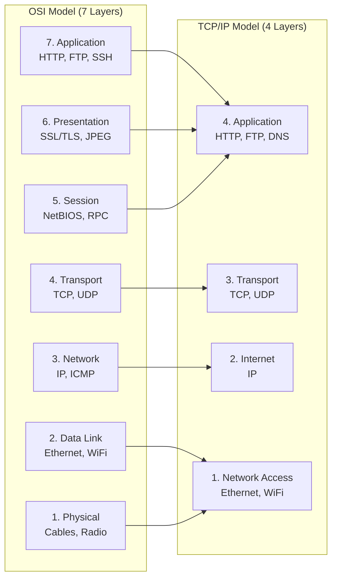
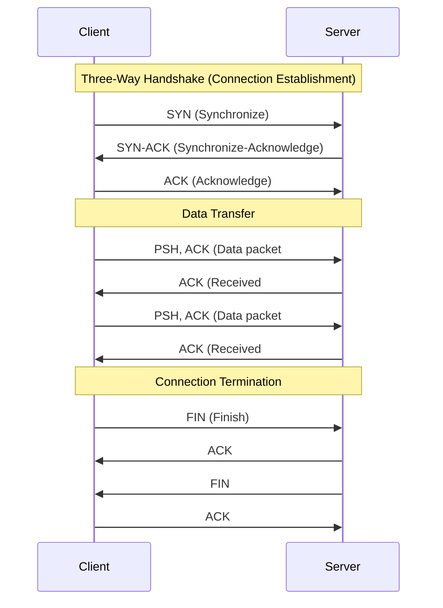
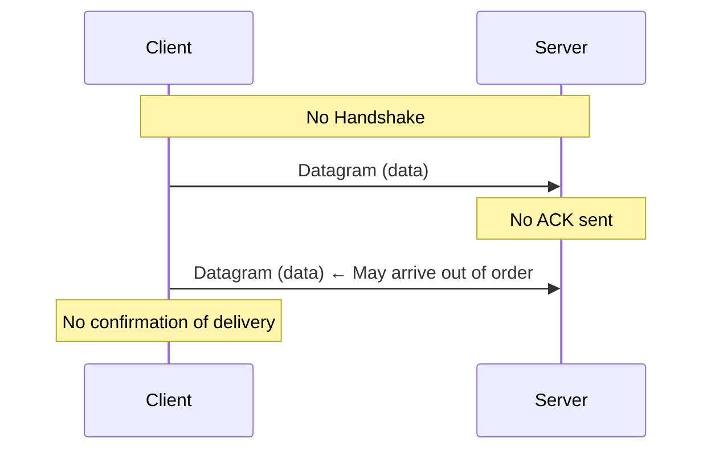
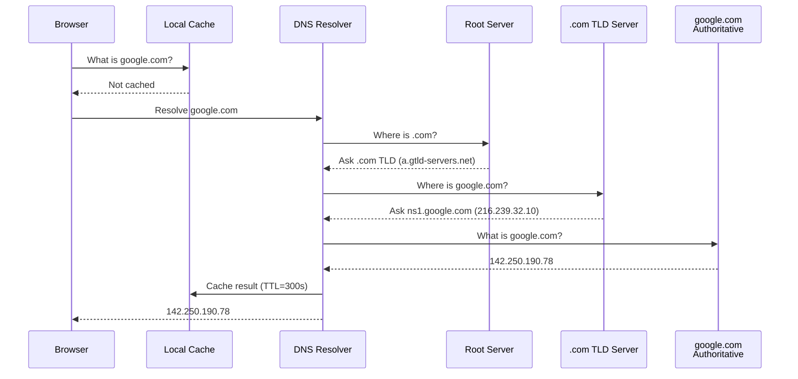

# Chapter 3: How Networks Work

## Learning Objectives

By the end of this chapter you will:
- Understand the OSI and TCP/IP network models
- Explain IP addressing (IPv4 and IPv6)
- Understand TCP and UDP protocols
- Know how DNS resolves domain names
- Understand ports and sockets
- Be able to make network requests from PHP

---

## 3.1 What is a Network?

### Beginner Level

A network is two or more computers connected together so they can share data. The most famous network is the Internet, which connects billions of computers worldwide.

Your home network connects your phone, laptop, and smart TV to each other and to the Internet through a router.

### Technical Level

**Network Models:**



**Layer 1 — Physical:**
The actual medium: copper cables (Ethernet), fiber optics (light pulses), radio waves (WiFi, 5G). Data travels as electrical signals, light, or electromagnetic waves.

**Layer 2 — Data Link:**
Frames data for the physical medium. Uses **MAC addresses** (Media Access Control) — 48-bit hardware addresses burned into network interface cards (NICs). Ethernet and WiFi operate here.

```
MAC Address Format: 00:1A:2B:3C:4D:5E
- First 3 bytes (00:1A:2B): Organizationally Unique Identifier (OUI) — manufacturer
- Last 3 bytes (3C:4D:5E): Device-specific
```

**Layer 3 — Network:**
Routes packets between networks using **IP addresses**. Routers operate here. This is where the Internet Protocol (IP) lives.

**Layer 4 — Transport:**
Ensures reliable delivery. **TCP** (connection-oriented, reliable) and **UDP** (connectionless, fast).

**Layer 5-7 — Application:**
HTTP, HTTPS, FTP, SSH, SMTP, DNS — the protocols your PHP applications work with.

### IP Addresses

**IPv4 (32-bit):**
- Format: `192.168.1.1` (four octets, each 0-255)
- Total addresses: ~4.3 billion (2³²)
- Private ranges (not routable on Internet):
  - `10.0.0.0/8` (16.7M addresses)
  - `172.16.0.0/12` (1M addresses)
  - `192.168.0.0/16` (65,536 addresses)
- Special: `127.0.0.1` = localhost (your own computer)

```php
// PHP IP functions
$ip = '192.168.1.1';
echo long2ip(ip2long($ip));  // Convert and back

// CIDR notation
function ipInCIDR(string $ip, string $cidr): bool {
    [$subnet, $bits] = explode('/', $cidr);
    $ip = ip2long($ip);
    $subnet = ip2long($subnet);
    $mask = -1 << (32 - $bits);
    $subnet &= $mask;
    return ($ip & $mask) === $subnet;
}

var_dump(ipInCIDR('192.168.1.50', '192.168.1.0/24'));  // true
var_dump(ipInCIDR('192.168.2.50', '192.168.1.0/24'));  // false
```

**IPv6 (128-bit):**
- Format: `2001:0db8:85a3:0000:0000:8a2e:0370:7334`
- Shortened: `2001:db8:85a3::8a2e:370:7334`
- Total addresses: 340 undecillion (2¹²⁸)
- Enough for every atom on Earth's surface with billions to spare

### Ports

A port is like an apartment number in a building (the IP is the street address):

```
Common Ports:
20, 21:   FTP (File Transfer Protocol)
22:       SSH (Secure Shell)
25:       SMTP (Email sending)
53:       DNS (Domain Name System)
80:       HTTP (Web)
110:      POP3 (Email receiving)
143:      IMAP (Email reading)
443:      HTTPS (Secure Web)
3306:     MySQL/MariaDB
5432:     PostgreSQL
6379:     Redis
8080:     HTTP alternative (dev servers)
8443:     HTTPS alternative
27017:    MongoDB
```

```php
// Check if a port is open
function isPortOpen(string $host, int $port, int $timeout = 3): bool
{
    $fp = @fsockopen($host, $port, $errno, $errstr, $timeout);
    if ($fp) {
        fclose($fp);
        return true;
    }
    return false;
}

var_dump(isPortOpen('localhost', 3306));  // Check MySQL
var_dump(isPortOpen('localhost', 80));    // Check Nginx
```

### Sockets

A socket is the endpoint of a network connection. In PHP:

```php
// Server socket
$server = socket_create(AF_INET, SOCK_STREAM, SOL_TCP);
socket_bind($server, '0.0.0.0', 8080);
socket_listen($server);

echo "Listening on port 8080...\n";

while ($client = socket_accept($server)) {
    $data = socket_read($client, 1024);
    socket_write($client, "HTTP/1.1 200 OK\r\n\r\nHello, World!");
    socket_close($client);
}
```

### Real-World Analogy

Networks are like a postal system:
- **IP Address** = Street address (e.g., 123 Main Street)
- **Port** = Apartment number (e.g., Apt 4B)
- **MAC Address** = Your identity (cannot be changed)
- **Packet** = A letter/envelope
- **Router** = Post office sorting facility
- **DNS** = Phone book (look up "Google" → find their address)
- **TCP** = Certified mail (confirms delivery, resends if lost)
- **UDP** = Postcard (sent, no confirmation, might get lost)
- **Socket** = Your mailbox (endpoint for sending/receiving mail)

---

## 3.2 TCP vs UDP

### Beginner Level

**TCP** is like a phone call — you establish a connection, talk, confirm you heard each other, then hang up. It's reliable but has overhead.

**UDP** is like shouting across a room — you send a message, but you don't know if anyone received it. It's fast but unreliable.

### Technical Level

**TCP (Transmission Control Protocol):**



**TCP Features:**
1. **Connection-oriented:** Handshake before data transfer
2. **Reliable:** Lost packets are retransmitted
3. **Ordered:** Packets reassembled in correct order
4. **Flow control:** Prevents sender from overwhelming receiver
5. **Congestion control:** Reduces speed when network is busy

**TCP Header (20-60 bytes):**

```
 0                   1                   2                   3
 0 1 2 3 4 5 6 7 8 9 0 1 2 3 4 5 6 7 8 9 0 1 2 3 4 5 6 7 8 9 0 1
├─────────────────────────────────────────────────────────────────┤
│          Source Port            │       Destination Port         │
├─────────────────────────────────────────────────────────────────┤
│                        Sequence Number                           │
├─────────────────────────────────────────────────────────────────┤
│                     Acknowledgment Number                        │
├───────┬───┬───┬───┬───┬───┬───┬───────────────────────────────┤
│ Data  │ R │ S │ S │ P │ A │ U │          Window Size          │
│Offset │ E │ Y │ Y │ S │ C │ R │                               │
├───────┴───┴───┴───┴───┴───┴───┴───────────────────────────────┤
│          Checksum              │         Urgent Pointer         │
├─────────────────────────────────────────────────────────────────┤
│                    Options (if any)                              │
├─────────────────────────────────────────────────────────────────┤
│                             Data                                 │
└─────────────────────────────────────────────────────────────────┘
```

**UDP (User Datagram Protocol):**



**UDP Features:**
1. **Connectionless:** No handshake, just send
2. **Unreliable:** No retransmission
3. **Unordered:** Packets may arrive in any order
4. **No flow/congestion control**
5. **Low overhead:** ~8 byte header

**Comparison:**

| Feature | TCP | UDP |
|---------|-----|-----|
| Connection | Connection-oriented | Connectionless |
| Reliability | Guaranteed delivery | Best effort |
| Ordering | Preserved | Not guaranteed |
| Speed | Slower (overhead) | Faster |
| Header size | 20-60 bytes | 8 bytes |
| Use cases | HTTP, SSH, Email, Databases | DNS, VoIP, Video streaming, Gaming |
| Data integrity | Checksum + ACK + retransmit | Checksum only |

### Applications in PHP Web Development

```php
// HTTP uses TCP (reliable request/response)
$ch = curl_init('https://api.example.com');
curl_exec($ch);  // TCP connection underneath

// DNS uses UDP (fast, one-shot query)
$ip = gethostbyname('example.com');  // UDP query to DNS server

// Streaming might use UDP (latency sensitive)
// PHP typically uses TCP for everything (HTTP paradigm)
```

### Real-World Analogy

**TCP** is like mailing a package with tracking and delivery confirmation:
- You fill out a form (SYN)
- Post office confirms they'll deliver (SYN-ACK)
- You send the package (DATA)
- Recipient signs (ACK)
- If lost, you resend
- Everything arrives in order

**UDP** is like throwing a frisbee:
- You just throw it (no setup)
- The other person might catch it or not
- You don't know if they got it
- They might get it but in a different order than thrown
- Much faster, but some frisbees get lost

---

## 3.3 DNS (Domain Name System)

### Beginner Level

DNS is the phone book of the Internet. When you type `google.com` in your browser, DNS translates that into an IP address like `142.250.190.78` that computers understand.

### Technical Level

**DNS Resolution:**



**DNS Record Types:**

| Type | Name | Example |
|------|------|---------|
| A | IPv4 address | `google.com → 142.250.190.78` |
| AAAA | IPv6 address | `google.com → 2607:f8b0:4000:809::200e` |
| CNAME | Canonical name (alias) | `www.example.com → example.com` |
| MX | Mail exchanger | `example.com → mail.example.com (priority 10)` |
| TXT | Text record | `SPF: "v=spf1 include:_spf.google.com ~all"` |
| NS | Name server | `example.com → ns1.example.com` |
| SOA | Start of Authority | Zone configuration |
| SRV | Service locator | `_sip._tcp.example.com → server:5060` |

```php
// PHP DNS functions
// Lookup A record
$records = dns_get_record('example.com', DNS_A);
print_r($records);
// Array
// (
//     [0] => Array
//         (
//             [host] => example.com
//             [type] => A
//             [ip] => 93.184.216.34
//             [ttl] => 21600
//         )
// )

// Check if domain has MX records
$mxRecords = dns_get_record('example.com', DNS_MX);
print_r($mxRecords);

// Reverse DNS (IP to hostname)
$hostname = gethostbyaddr('93.184.216.34');
echo $hostname;  // example.com

// Check if hostname resolves
function isDomainReachable(string $domain): bool
{
    $ip = gethostbyname($domain);
    return $ip !== $domain;  // gethostbyname returns input on failure
}
```

**TTL (Time To Live):**

Every DNS record has a TTL in seconds. This tells resolvers how long to cache the result:
- Short TTL (60s): Used for load balancing, failover
- Long TTL (86400s = 24h): Stable records, reduces DNS query load

### Real-World Analogy

DNS is like a hierarchical phone directory:
1. **Root servers** = The white pages headquarters (knows where to find each country code)
2. **TLD servers** = The area code directory (.com, .org, .uk)
3. **Authoritative servers** = The specific person's phone number
4. **Recursive resolver** = 411 directory assistance (does all the looking up for you)
5. **TTL** = "This number confirmed valid until 5pm"

---

## 3.4 Making Network Requests in PHP

### Using cURL

```php
<?php
// Basic HTTP GET request
function fetchUrl(string $url, array $headers = []): string
{
    $ch = curl_init($url);
    
    curl_setopt_array($ch, [
        CURLOPT_RETURNTRANSFER => true,      // Return as string
        CURLOPT_FOLLOWLOCATION => true,       // Follow redirects
        CURLOPT_MAXREDIRS => 5,               // Max redirects
        CURLOPT_TIMEOUT => 30,                // Timeout in seconds
        CURLOPT_CONNECTTIMEOUT => 5,          // Connection timeout
        CURLOPT_USERAGENT => 'PHP-Mastery/1.0',
        CURLOPT_SSL_VERIFYPEER => true,       // Verify SSL
        CURLOPT_SSL_VERIFYHOST => 2,          // Verify hostname
        CURLOPT_HTTPHEADER => $headers,
    ]);
    
    $response = curl_exec($ch);
    
    if (curl_errno($ch)) {
        throw new RuntimeException('cURL error: ' . curl_error($ch));
    }
    
    $httpCode = curl_getinfo($ch, CURLINFO_HTTP_CODE);
    curl_close($ch);
    
    if ($httpCode >= 400) {
        throw new RuntimeException("HTTP error: {$httpCode}", $httpCode);
    }
    
    return $response;
}

// POST request with JSON body
function postJson(string $url, array $data): array
{
    $ch = curl_init($url);
    
    $json = json_encode($data);
    
    curl_setopt_array($ch, [
        CURLOPT_RETURNTRANSFER => true,
        CURLOPT_POST => true,
        CURLOPT_POSTFIELDS => $json,
        CURLOPT_HTTPHEADER => [
            'Content-Type: application/json',
            'Content-Length: ' . strlen($json),
        ],
    ]);
    
    $response = curl_exec($ch);
    curl_close($ch);
    
    return json_decode($response, true) ?? [];
}

// Usage
$html = fetchUrl('https://api.github.com/repos/php/php-src');
print_r(json_decode($html, true));
```

### Using Stream Contexts

```php
<?php
// PHP built-in stream wrappers (no extension needed)
function fetchWithStreams(string $url, array $headers = []): string
{
    $context = stream_context_create([
        'http' => [
            'method' => 'GET',
            'header' => array_merge(
                ["User-Agent: PHP-Mastery/1.0"],
                array_map(fn($h) => "{$h}", $headers)
            ),
            'timeout' => 30,
            'ignore_errors' => true,
        ],
        'ssl' => [
            'verify_peer' => true,
            'verify_peer_name' => true,
        ],
    ]);
    
    $result = file_get_contents($url, false, $context);
    
    if ($result === false) {
        throw new RuntimeException("Failed to fetch URL: {$url}");
    }
    
    return $result;
}

// POST with streams
function postWithStreams(string $url, array $data): string
{
    $json = json_encode($data);
    
    $context = stream_context_create([
        'http' => [
            'method' => 'POST',
            'header' => [
                'Content-Type: application/json',
                'Content-Length: ' . strlen($json),
            ],
            'content' => $json,
        ],
    ]);
    
    return file_get_contents($url, false, $context);
}
```

### Using Guzzle (Production Standard)

```bash
composer require guzzlehttp/guzzle
```

```php
<?php
// Production-grade HTTP client with Guzzle
require 'vendor/autoload.php';

use GuzzleHttp\Client;
use GuzzleHttp\Exception\RequestException;
use GuzzleHttp\Pool;
use GuzzleHttp\Psr7\Response;

class ApiClient
{
    private Client $client;
    
    public function __construct()
    {
        $this->client = new Client([
            'base_uri' => 'https://api.example.com',
            'timeout' => 10.0,
            'connect_timeout' => 3.0,
            'headers' => [
                'User-Agent' => 'PHP-Mastery/1.0',
                'Accept' => 'application/json',
            ],
            'http_errors' => true,
            'retry' => [
                'max' => 3,
                'delay' => 1000,
                'exponential' => true,
            ],
        ]);
    }
    
    public function getUser(int $id): array
    {
        try {
            $response = $this->client->get("/users/{$id}");
            return json_decode($response->getBody(), true);
        } catch (RequestException $e) {
            if ($e->hasResponse()) {
                $status = $e->getResponse()->getStatusCode();
                if ($status === 404) {
                    throw new \RuntimeException("User {$id} not found");
                }
            }
            throw new \RuntimeException("API request failed: " . $e->getMessage());
        }
    }
    
    public function createUser(array $data): array
    {
        $response = $this->client->post('/users', [
            'json' => $data,
        ]);
        return json_decode($response->getBody(), true);
    }
    
    // Concurrent requests with async
    public function getUsers(array $ids): array
    {
        $client = $this->client;
        
        $promises = [];
        foreach ($ids as $id) {
            $promises["user_{$id}"] = $client->getAsync("/users/{$id}");
        }
        
        $results = [];
        
        // Wait for all promises to complete
        $responses = \GuzzleHttp\Promise\Utils::settle($promises)->wait();
        
        foreach ($responses as $key => $result) {
            if ($result['state'] === 'fulfilled') {
                $results[$key] = json_decode($result['value']->getBody(), true);
            }
        }
        
        return $results;
    }
}
```

---

## 3.5 Network Security Basics

```php
// Always verify SSL certificates in production
curl_setopt($ch, CURLOPT_SSL_VERIFYPEER, true);   // Verify certificate chain
curl_setopt($ch, CURLOPT_SSL_VERIFYHOST, 2);      // Verify hostname matches

// NEVER do this in production:
curl_setopt($ch, CURLOPT_SSL_VERIFYPEER, false);  // Vulnerable to MITM

// Firewall considerations
// Outbound connections may be blocked by server firewalls
// Check if port is accessible
function testNetworkConnectivity(string $host, int $port): bool
{
    $connection = @fsockopen($host, $port, $errno, $errstr, 5);
    if (is_resource($connection)) {
        fclose($connection);
        return true;
    }
    return false;
}
```

---

## 3.6 Common Mistakes

| Mistake | Why It's Bad | Solution |
|---------|--------------|----------|
| Not setting timeouts | Script hangs forever | Always set connection/execution timeouts |
| Disabling SSL verification | Man-in-the-middle attacks | Always verify in production |
| Ignoring DNS caching | Slow performance from repeated lookups | Cache DNS results |
| Using UDP for reliable data | Data loss | Use TCP for anything that must arrive |
| Blocking network calls | Slow single-threaded execution | Use async/parallel requests |
| Not handling timeouts gracefully | Poor user experience | Catch timeout exceptions |
| Hardcoding connection details | Cannot deploy to different environments | Use environment variables |

---

## 3.7 Exercises

### Beginner Exercises

1. Ping google.com and interpret the output.
2. Use `traceroute` to see the path to a server.
3. Check which ports are open on localhost using `netstat`.
4. Use PHP's `gethostbyname()` to resolve a domain.
5. Make a simple HTTP GET request using `file_get_contents()`.

### Intermediate Exercises

1. Write a PHP function that checks if a list of ports are open on a remote server.
2. Implement a simple TCP echo server and client in PHP.
3. Create a DNS lookup tool that shows all record types for a domain.
4. Build an HTTP request class that supports GET, POST, PUT, DELETE with cURL.
5. Measure the overhead of TCP vs UDP by timing connections.

### Advanced Exercises

1. Implement a non-blocking TCP server in PHP.
2. Build a simple HTTP/1.1 proxy server in PHP.
3. Create a network latency monitoring tool.
4. Implement a retry mechanism with exponential backoff for HTTP requests.
5. Design a message protocol on top of TCP for inter-service communication.

---

## 3.8 Mini Project: Port Scanner

```php
#!/usr/bin/env php
<?php
/**
 * TCP Port Scanner
 * 
 * Usage: php port-scanner.php [host] [start_port] [end_port]
 * Example: php port-scanner.php localhost 1 1024
 */

class PortScanner
{
    private array $openPorts = [];
    private array $commonServices = [
        21 => 'FTP',
        22 => 'SSH',
        23 => 'Telnet',
        25 => 'SMTP',
        53 => 'DNS',
        80 => 'HTTP',
        110 => 'POP3',
        143 => 'IMAP',
        443 => 'HTTPS',
        3306 => 'MySQL',
        5432 => 'PostgreSQL',
        6379 => 'Redis',
        8080 => 'HTTP-Alt',
        8443 => 'HTTPS-Alt',
    ];

    public function scan(string $host, int $start, int $end): void
    {
        echo "Scanning {$host} from port {$start} to {$end}...\n\n";
        echo str_pad("Port", 8) . str_pad("Status", 12) . "Service\n";
        echo str_repeat("─", 40) . "\n";

        for ($port = $start; $port <= $end; $port++) {
            $result = $this->scanPort($host, $port);
            if ($result['open']) {
                $service = $this->commonServices[$port] ?? 'Unknown';
                echo str_pad($port, 8) . 
                     str_pad("OPEN", 12, " ", STR_PAD_RIGHT) . 
                     $service . "\n";
                $this->openPorts[] = $port;
            }
        }

        echo "\nScan complete. " . count($this->openPorts) . " open ports found.\n";
    }

    private function scanPort(string $host, int $port, int $timeout = 1): array
    {
        $start = microtime(true);
        $fp = @fsockopen($host, $port, $errno, $errstr, $timeout);
        $elapsed = (microtime(true) - $start) * 1000;

        if ($fp) {
            fclose($fp);
            return ['open' => true, 'time' => round($elapsed, 2)];
        }

        return ['open' => false, 'time' => round($elapsed, 2)];
    }
}

// Parse command line arguments
$host = $argv[1] ?? 'localhost';
$start = (int)($argv[2] ?? 1);
$end = (int)($argv[3] ?? 1024);

$scanner = new PortScanner();
$scanner->scan($host, $start, $end);
```

---

## 3.9 Interview Questions

### Junior Level

1. "What's the difference between TCP and UDP?"
2. "What is an IP address and what is it used for?"
3. "How does DNS work in simple terms?"
4. "What is a port and why are ports used?"
5. "What happens when you type google.com in your browser?"

### Mid-Level

1. "Explain the TCP three-way handshake."
2. "What's the difference between IPv4 and IPv6?"
3. "How does HTTP keep-alive affect TCP connections?"
4. "Explain the OSI model layers relevant to web development."
5. "What are CNAME records and when would you use them?"

### Senior Level

1. "How would you diagnose a slow network request in a PHP application?"
2. "Explain TCP congestion control and how it affects API performance."
3. "Design a DNS-based failover strategy for a multi-region deployment."
4. "How would you handle network timeouts in a distributed PHP application?"
5. "Explain the trade-offs between keep-alive and short-lived connections."

### Architect Level

1. "Design a service mesh for a microservices architecture in PHP."
2. "How would you implement circuit breakers for network calls between services?"
3. "Design a global load balancing strategy considering DNS propagation."
4. "Explain how you'd architect a real-time notification system using TCP."
5. "Compare HTTP/1.1, HTTP/2, and HTTP/3 from a networking perspective."

---

## Further Reading

- **Book:** "Computer Networking: A Top-Down Approach" by Kurose & Ross
- **Book:** "TCP/IP Illustrated" by Stevens
- **RFC:** [RFC 1180 - TCP/IP Tutorial](https://tools.ietf.org/html/rfc1180)
- **Resource:** [How DNS Works](https://howdns.works/) — Interactive comic
- **Resource:** [Cloudflare Learning Center](https://www.cloudflare.com/learning/)

---

*End of Chapter 3. Proceed to Chapter 4: How the Internet Works.*
