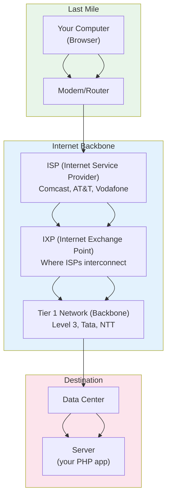
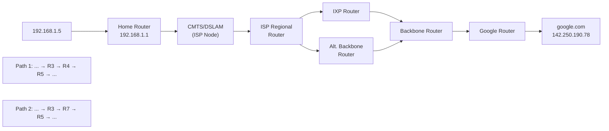
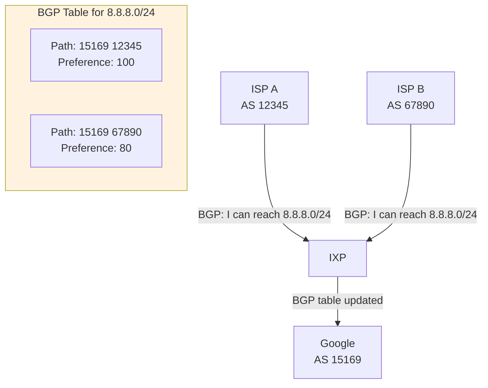
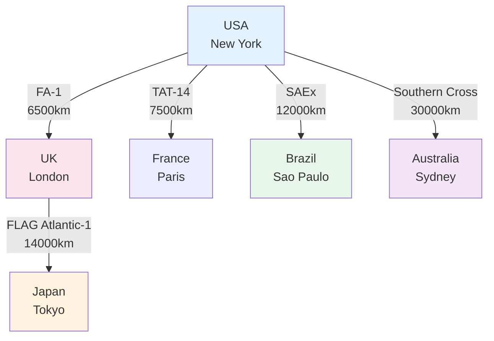
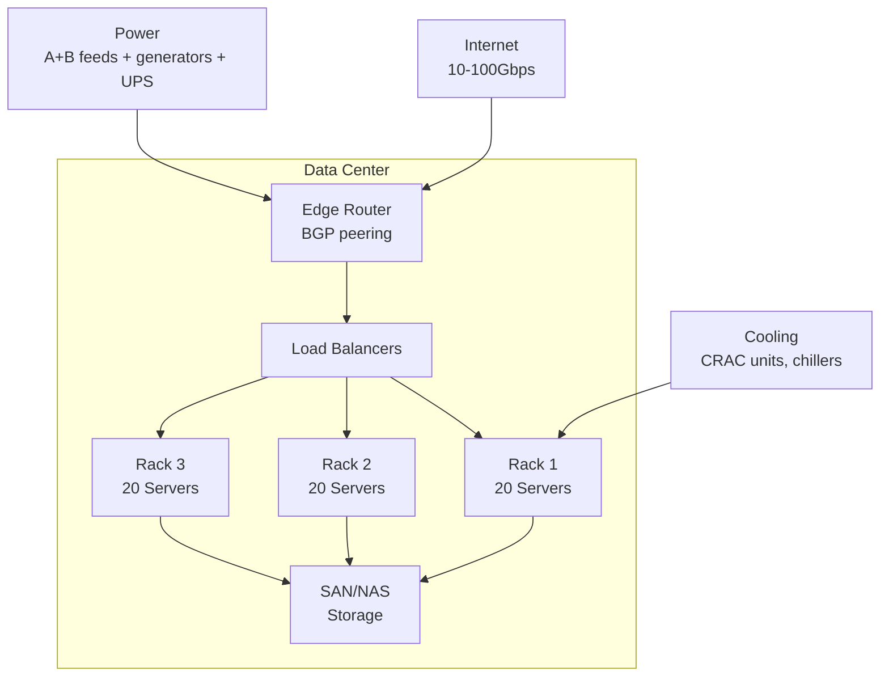
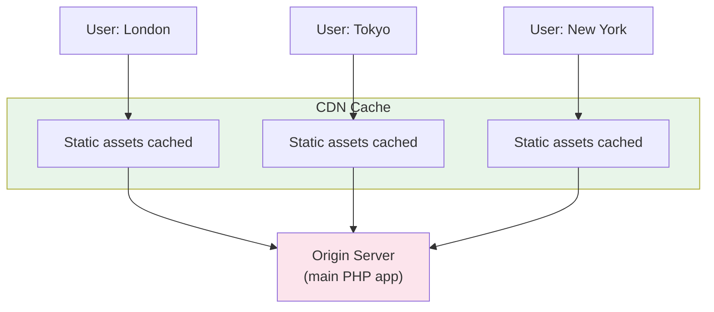
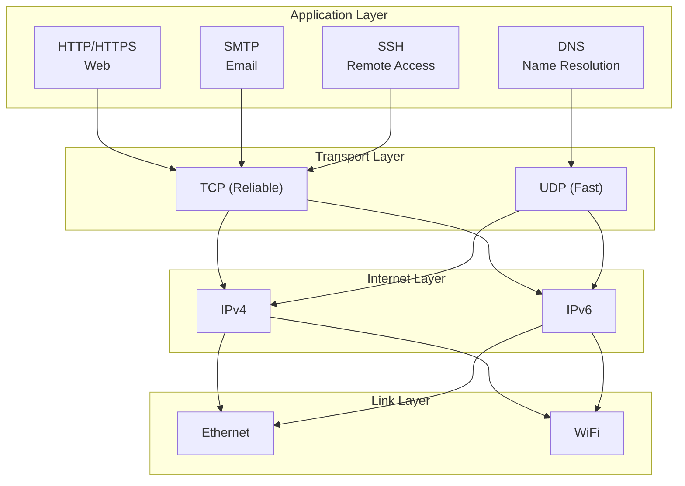
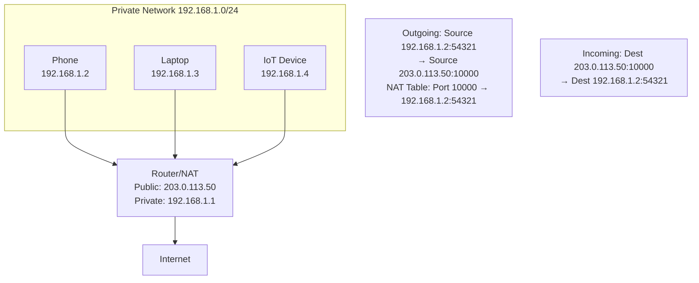

# Chapter 4: How the Internet Works

## Learning Objectives

By the end of this chapter you will:
- Understand the physical infrastructure of the Internet
- Explain how data travels across networks
- Understand ISPs, IXPs, and backbone networks
- Know about undersea cables, data centers, and CDNs
- Understand how packets are routed
- Relate Internet infrastructure to PHP application deployment

---

## 4.1 What is the Internet?

### Beginner Level

The Internet is a global network of computers connected by cables, fiber optics, and wireless signals. It's a "network of networks" — smaller networks (your home network, your company network, your ISP's network) all connected together.

The Internet is NOT the same as the World Wide Web. The Internet is the physical infrastructure; the Web (HTTP) is just one service that runs on top of it.

### Technical Level

**Internet Infrastructure:**



**Internet Infrastructure Layers:**

| Layer | Description | Latency | Example |
|-------|-------------|---------|---------|
| Last Mile | Connection to end user | 5-50ms | DSL, Cable, Fiber, 5G |
| Metro/Aggregation | Regional aggregation | 1-5ms | City-level fiber rings |
| IXP | Exchange between ISPs | <1ms | AMS-IX (Amsterdam) |
| Backbone | Long-haul transport | 50-200ms | Undersea cables |
| Data Center | Server hosting | <1ms internal | AWS, Google Cloud |

### How Data Travels

When you visit `https://www.google.com`:

1. **DNS Resolution:** Browser looks up IP address of google.com (see Chapter 3)

2. **TCP Connection:** Browser opens TCP connection to 142.250.190.78:443

3. **Packetization:** Your request is broken into packets (~1500 bytes each):
```text
Packet 1 of 50: [IP: 192.168.1.5] → [IP: 142.250.190.78] | Seq: 1/50 | "GET / HTT"
Packet 2 of 50: [IP: 192.168.1.5] → [IP: 142.250.190.78] | Seq: 2/50 | "TP/1.1\r\n"
Packet 3 of 50: [IP: 192.168.1.5] → [IP: 142.250.190.78] | Seq: 3/50 | "Host: goo"
...and so on
```

4. **Routing:** Each packet goes through multiple routers:


Packets may take DIFFERENT ROUTES and arrive OUT OF ORDER.

5. **Reassembly:** Google's server receives all packets, reassembles in sequence number order

6. **Response:** Google sends response back (same process, reverse direction)

### Routing Algorithms

Routers use **BGP (Border Gateway Protocol)** to decide where to send packets:



BGP considers:
- **AS Path length** (number of networks to traverse)
- **Local preference** (administrative decisions)
- **MED** (Multi-Exit Discriminator)
- **Communities** (tags for routing policy)

---

## 4.2 Physical Infrastructure

### Undersea Cables

Over 95% of intercontinental Internet traffic travels through undersea fiber optic cables:



**Key facts:**
- Cable diameter: ~17mm (garden hose width)
- Fiber pairs: 4-16 per cable
- Bandwidth: Up to 100+ Tbps per fiber pair
- Latency: ~60ms transatlantic, ~150ms transpacific
- Lifespan: ~25 years
- Total cables: ~400+ active worldwide

### Data Centers

A data center is a facility housing thousands of servers:



**Data Center Redundancy:**
- **N:** Basic operation (no redundancy)
- **N+1:** One extra unit for failover
- **2N:** Two complete systems
- **2N+1:** Two complete systems plus spare

### CDNs (Content Delivery Networks)

CDNs like Cloudflare, Akamai, Fastly cache content at edge locations:



**CDN Benefits for PHP Developers:**
1. Static assets (CSS, JS, images) served from edge
2. DDoS protection
3. SSL termination
4. Load reduction on PHP servers
5. Global latency reduction

---

## 4.3 Internet Protocols

### The Internet Protocol Stack



### NAT (Network Address Translation)

NAT allows multiple devices on a private network to share one public IP:



---

## 4.4 Internet for PHP Developers

### Server Location Matters

```php
// Measure latency to different regions
function measureLatency(string $host): float
{
    $start = microtime(true);
    $fp = @fsockopen($host, 80, $errno, $errstr, 5);
    $latency = (microtime(true) - $start) * 1000;
    if ($fp) fclose($fp);
    return $latency;
}

// Example: Where to host for your users
echo "London: " . measureLatency('lon.example.com') . "ms\n";
echo "Tokyo: " . measureLatency('tyo.example.com') . "ms\n";
echo "NYC: " . measureLatency('nyc.example.com') . "ms\n";
```

### Deployment Considerations

```nginx
# CDN integration with Nginx
location /static/ {
    # Serve from CDN instead
    return 302 https://cdn.example.com$request_uri;
}

# Geo-routing
geo $region {
    default     us-east;
    192.168.0.0/16  local;
    # IP ranges to region mapping
}

# PHP application considerations
# - Use CDN for static assets
# - Database should be close to application
# - Consider global users when designing APIs
```

---

## 4.5 Common Mistakes

| Mistake | Impact | Solution |
|---------|--------|----------|
| Ignoring geographical latency | Slow global experience | Use CDN, multi-region deployment |
| Single data center | No disaster recovery | Multi-region architecture |
| No CDN for static assets | Unnecessary load on PHP servers | Offload to CDN |
| Large payloads over slow links | Timeout, poor UX | Compress, paginate, optimize |
| Synchronous remote calls | Cascading failures | async, circuit breakers, timeouts |
| Not understanding BGP | Deployment surprises, routing issues | Consult with network engineers |

---

## 4.6 Exercises

1. Use `ping` and `traceroute` to map the path from your computer to a server in another continent.
2. Find the undersea cables that connect your country to the rest of the world.
3. Calculate the minimum theoretical latency between New York and Sydney (distance ~16,000km).
4. Research your ISP's network: what IXPs do they peer at?
5. Use a CDN and measure the performance improvement for static assets.

---

## 4.7 Interview Questions

1. "Explain the difference between the Internet and the World Wide Web."
2. "How does BGP route packets across the Internet?"
3. "What is an IXP and why is it important?"
4. "How would you optimize a PHP application for global users?"
5. "Explain the role of undersea cables in Internet infrastructure."

---

## Further Reading

- **Website:** [Submarine Cable Map](https://www.submarinecablemap.com/)
- **Website:** [How the Internet Works](https://www.cloudflare.com/learning/network-layer/how-does-the-internet-work/)
- **Book:** "Tubes: A Journey to the Center of the Internet" by Andrew Blum
- **Video:** "How does the INTERNET work?" — NetworkChuck (YouTube)

---

*End of Chapter 4. Proceed to Chapter 5: How Browsers Work.*
