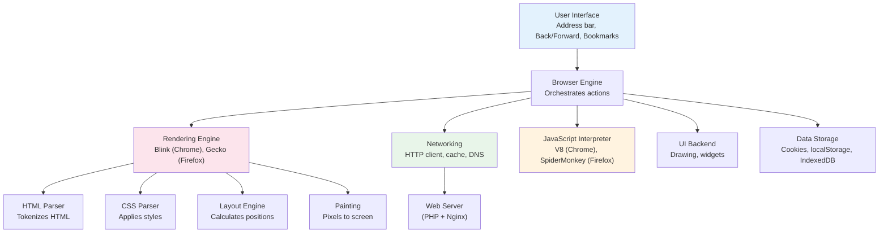
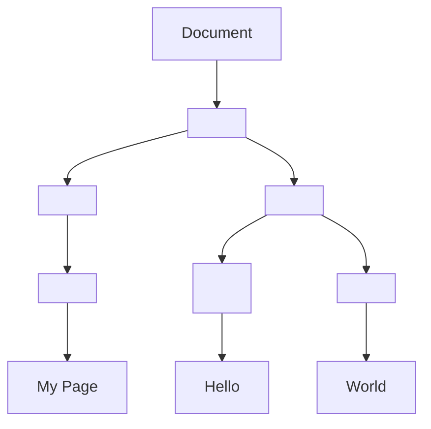
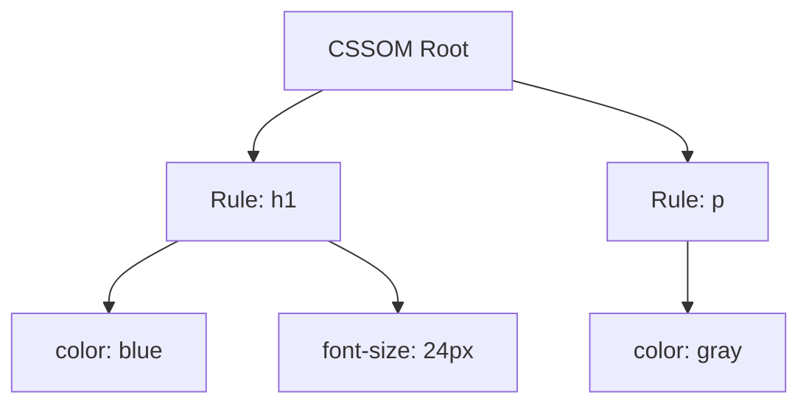
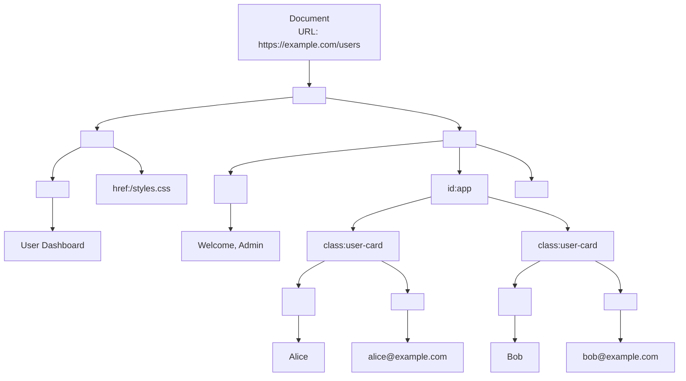

# Chapter 5: How Browsers Work

## Learning Objectives

By the end of this chapter you will:
- Understand what a browser does and its components
- Explain how HTML, CSS, and JavaScript are processed
- Understand the DOM, CSSOM, and rendering pipeline
- Know how browser storage works (cookies, localStorage)
- Understand how PHP interacts with browsers

---

## 5.1 What is a Browser?

### Beginner Level

A browser is a program that displays web pages. It takes HTML (received from a server), interprets it, and renders it as a visual page. Chrome, Firefox, Safari, and Edge are browsers.

The browser is the most important client for a PHP developer — it's where your server-side code ultimately appears to the user.

### Technical Level

**Browser Architecture:**



**Browser Components:**

| Component | Role | Examples |
|-----------|------|----------|
| User Interface | Address bar, tabs, buttons | Chrome UI, Firefox UI |
| Browser Engine | Orchestrates UI and rendering engine | WebKit, Blink (Chrome) |
| Rendering Engine | Parses HTML/CSS, renders pages | Blink, Gecko, WebKit |
| Networking | HTTP requests, caching, DNS | Network stack (cURL-like) |
| JavaScript Interpreter | Executes JS code | V8 (Chrome), SpiderMonkey (Firefox) |
| UI Backend | Drawing widgets (buttons, scrollbars) | Gtk, Cocoa, WinAPI |
| Data Storage | Persistent client-side data | Cookies, localStorage, IndexedDB |

---

## 5.2 How a Browser Renders a Page

### The Critical Rendering Path

When a browser loads a URL, it goes through this sequence:

```mermaid
sequenceDiagram
    participant Browser
    participant Network
    participant Parser as HTML Parser
    participant CSSOM as CSSOM Builder
    participant Layout as Layout Engine
    participant Paint as Painter

    Browser->>Network: GET /index.html
    Network-->>Browser: HTML response
    Browser->>Parser: Parse HTML

    rect rgb(200, 230, 255)
        Note over Parser: DOM Construction
        Parser->>Parser: Tokenize HTML tags
        Parser->>Parser: Build DOM tree
    end

    Note over Parser: &lt;link rel="stylesheet"&gt; found
    Parser->>Network: GET /style.css
    Network-->>CSSOM: CSS response
    CSSOM->>CSSOM: Tokenize CSS rules
    CSSOM->>CSSOM: Build CSSOM tree
    CSSOM->>Layout: Apply styles

    rect rgb(255, 230, 200)
        Note over Layout: Layout (Reflow)
        Layout->>Layout: Calculate element positions
        Layout->>Layout: Compute box model (width, height)
    end

    rect rgb(230, 255, 230)
        Note over Paint: Painting
        Paint->>Paint: Rasterize elements
        Paint->>Paint: Composite layers
        Paint-->>Browser: Display pixels
    end
```

**Step 1: HTML Parsing → DOM Tree**

```html
<html>
<head>
  <title>My Page</title>
</head>
<body>
  <h1>Hello</h1>
  <p>World</p>
</body>
</html>
```



**Step 2: CSS Parsing → CSSOM**

```css
h1 { color: blue; font-size: 24px; }
p  { color: gray; }
```



**Step 3: Render Tree (DOM + CSSOM)**

Only visible elements are included:
- `<html>`, `<body>`, `<h1>`, `<p>` → included
- `<head>`, `<script>`, `display: none` → excluded

**Step 4: Layout (Reflow)**

Calculate exact pixel positions:
```
h1: x=8, y=8, width=784, height=32
p:  x=8, y=48, width=784, height=20
```

**Step 5: Painting**

Convert to pixels on screen. The browser breaks the page into **layers** for efficiency. Only dirty layers are repainted on updates.

### Render Blocking

```html
<!-- BAD: CSS blocks rendering until downloaded -->
<link rel="stylesheet" href="styles.css">

<!-- BAD: Script at top blocks DOM construction -->
<script src="app.js"></script>

<!-- GOOD: Async script doesn't block -->
<script async src="analytics.js"></script>

<!-- GOOD: Deferred script runs after HTML parsed -->
<script defer src="app.js"></script>
```

---

## 5.3 Browser Storage

### Cookies

```php
// PHP sets cookies via HTTP headers
setcookie('session_id', 'abc123', [
    'expires' => time() + 3600,
    'path' => '/',
    'domain' => '.example.com',
    'secure' => true,       // HTTPS only
    'httponly' => true,     // Not accessible via JS
    'samesite' => 'Lax',    // CSRF protection
]);

// Browser stores and sends back
// Request header: Cookie: session_id=abc123
```

### Browser Storage APIs

```javascript
// localStorage (5-10MB, persists until deleted)
localStorage.setItem('theme', 'dark');
const theme = localStorage.getItem('theme'); // 'dark'

// sessionStorage (cleared when tab closes)
sessionStorage.setItem('cart', JSON.stringify([1, 2, 3]));

// IndexedDB (large structured data)
const request = indexedDB.open('MyApp', 1);
request.onupgradeneeded = (event) => {
    const db = event.target.result;
    db.createObjectStore('users', { keyPath: 'id' });
};
```

### PHP + Browser Storage Pattern

```php
// Server-side session (stored on server, cookie references it)
session_start();
$_SESSION['user_id'] = 42;
// Sets cookie: PHPSESSID=abc123 (only the ID, not the data)

// Client-side storage (data stays in browser)
// Use for: preferences, cache, offline data
// Never for: sensitive data, authentication tokens
```

---

## 5.4 How PHP Sends Data to Browsers

```php
<?php
// PHP generates HTML that the browser renders
?>
<!DOCTYPE html>
<html>
<head>
    <title><?= htmlspecialchars($pageTitle) ?></title>
    <link rel="stylesheet" href="/styles.css">
</head>
<body>
    <h1><?= htmlspecialchars($heading) ?></h1>
    
    <div id="app">
        <?php foreach ($users as $user): ?>
            <div class="user-card">
                <h2><?= htmlspecialchars($user['name']) ?></h2>
                <p><?= htmlspecialchars($user['email']) ?></p>
            </div>
        <?php endforeach; ?>
    </div>

    <script src="/app.js"></script>
</body>
</html>
```

**What the browser receives:**

```html
<!DOCTYPE html>
<html>
<head>
    <title>User Dashboard</title>
    <link rel="stylesheet" href="/styles.css">
</head>
<body>
    <h1>Welcome, Admin</h1>
    
    <div id="app">
        <div class="user-card">
            <h2>Alice</h2>
            <p>alice@example.com</p>
        </div>
        <div class="user-card">
            <h2>Bob</h2>
            <p>bob@example.com</p>
        </div>
    </div>

    <script src="/app.js"></script>
</body>
</html>
```

**What the browser DOM looks like after parsing:**



---

## 5.5 Best Practices for PHP-to-Browser Delivery

```php
<?php
// 1. Minimize HTML output size
// BAD: Lots of whitespace
?>
<div>    <p>Hello</p>    </div>

<?php
// GOOD: Compact HTML (use a templating engine)

// 2. Set proper content-type headers
header('Content-Type: text/html; charset=utf-8');

// 3. Cache control
header('Cache-Control: public, max-age=3600');

// 4. Compression (usually handled by Nginx)
// Nginx config: gzip on;

// 5. Critical CSS inline, non-critical async
?>
<style>
  /* Critical CSS inline for first paint */
  .header { background: blue; }
</style>
<link rel="preload" href="/styles.css" as="style" onload="this.rel='stylesheet'">
```

---

## 5.6 Common Mistakes

| Mistake | Why It's Bad | Solution |
|---------|--------------|----------|
| Not setting Content-Type | Browser misinterprets response | Always set `Content-Type: text/html` |
| Blocking render with CSS/JS | Slow perceived load time | Async/defer non-critical resources |
| Large HTML responses | Slow parsing, bad UX | Paginate, use templating |
| No cache headers | Repeated full downloads | `Cache-Control`, ETags |
| Not escaping output | XSS vulnerabilities | `htmlspecialchars()` |
| Mixing PHP logic and HTML | Unmaintainable code | Use MVC / templating engines |

---

## 5.7 Exercises

1. Use your browser's DevTools to trace the critical rendering path for a PHP page.
2. Analyze the DOM tree of a PHP-generated page.
3. Compare performance of blocking vs async script loading.
4. Use `localStorage` to cache PHP API responses on the client side.
5. Measure time to first byte (TTFB) vs DOMContentLoaded vs Load.

---

## 5.8 Mini Project: Browser Detection

```php
<?php
class BrowserDetector
{
    public function detect(): array
    {
        $ua = $_SERVER['HTTP_USER_AGENT'] ?? '';
        
        return [
            'ua' => $ua,
            'browser' => $this->getBrowser($ua),
            'version' => $this->getVersion($ua),
            'os' => $this->getOS($ua),
            'device' => $this->getDevice($ua),
            'is_mobile' => $this->isMobile($ua),
        ];
    }
    
    private function getBrowser(string $ua): string
    {
        if (str_contains($ua, 'Chrome')) return 'Chrome';
        if (str_contains($ua, 'Firefox')) return 'Firefox';
        if (str_contains($ua, 'Safari')) return 'Safari';
        if (str_contains($ua, 'Edge')) return 'Edge';
        return 'Unknown';
    }
    
    private function isMobile(string $ua): bool
    {
        return preg_match('/Mobile|Android|iPhone|iPad/i', $ua);
    }
    
    // ... other detection methods
}

$detector = new BrowserDetector();
$info = $detector->detect();
header('Content-Type: application/json');
echo json_encode($info, JSON_PRETTY_PRINT);
```

---

## 5.9 Interview Questions

1. "Explain what happens when a browser loads a PHP-generated page."
2. "What is the critical rendering path?"
3. "What's the difference between `async` and `defer` script attributes?"
4. "How does browser caching affect PHP development?"
5. "Explain cookies, localStorage, and sessionStorage differences."
6. "How would you optimize a PHP page for fast first paint?"

---

## Further Reading

- **Book:** "High Performance Browser Networking" by Ilya Grigorik
- **Resource:** [How Browsers Work (MDN)](https://developer.mozilla.org/en-US/docs/Web/Performance/How_browsers_work)
- **Resource:** [Chrome DevTools Documentation](https://developer.chrome.com/docs/devtools/)
- **Video:** "The Critical Rendering Path" by Ilya Grigorik

---

*End of Chapter 5. Proceed to Chapter 6: How Servers Work.*
