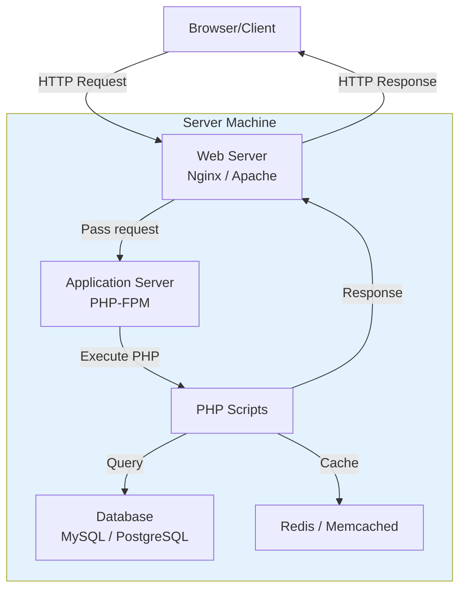
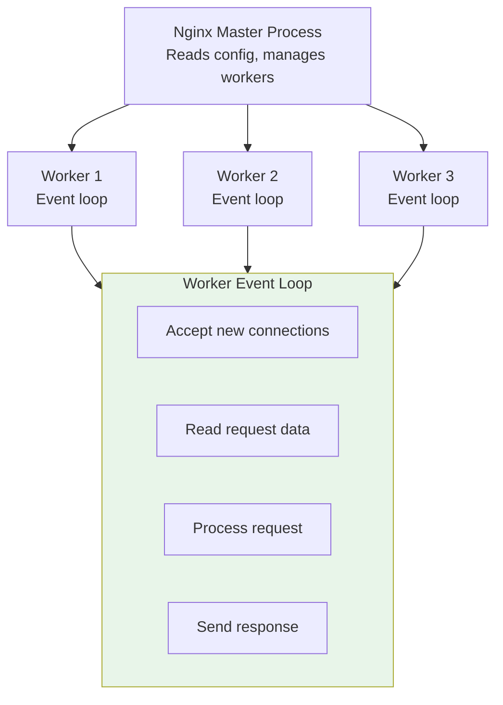
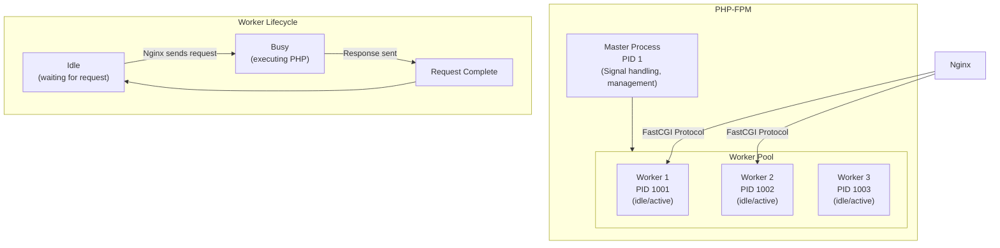
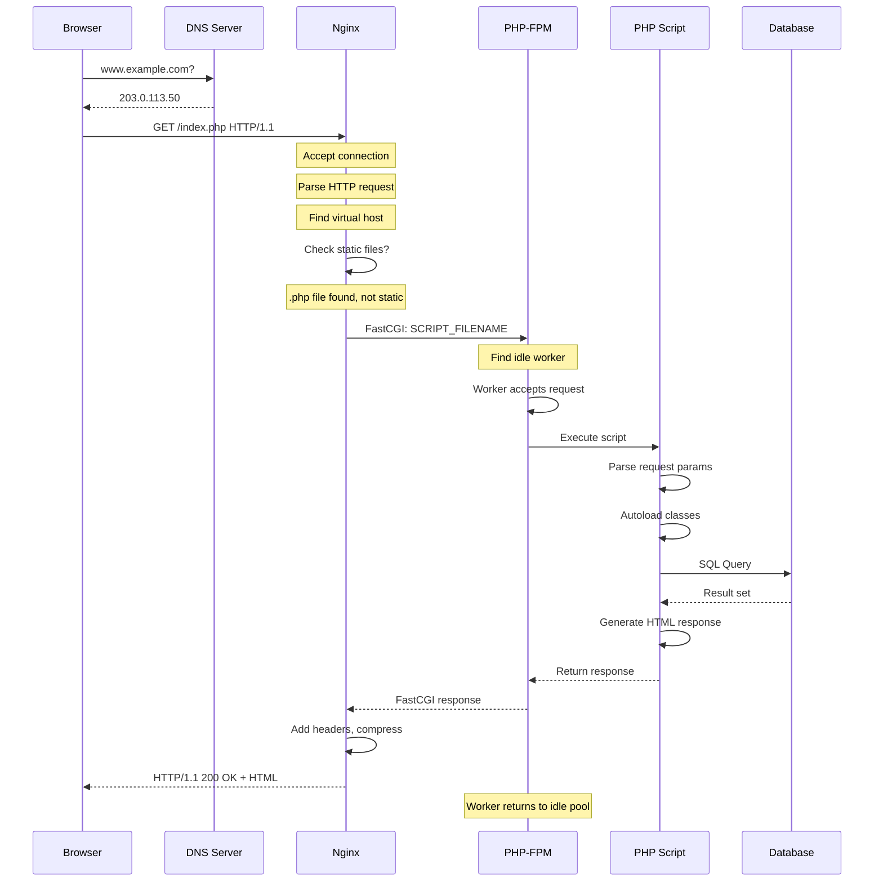

# Chapter 6: How Servers Work

## Learning Objectives

By the end of this chapter you will:
- Understand what a web server does
- Differentiate between web servers (Nginx, Apache)
- Understand PHP-FPM and how it processes requests
- Know how to configure a PHP server in production
- Understand server architecture and scaling

---

## 6.1 What is a Server?

### Beginner Level

A server is a computer that provides services to other computers (clients). For PHP development, the most important server is the **web server** — the program that receives HTTP requests and returns web pages.

A server can be a physical machine, a virtual machine (VM), or a container.

### Technical Level

**The Web Server Stack:**



**Types of Servers in a PHP Stack:**

| Server | Role | Port | Protocol |
|--------|------|------|----------|
| Nginx/Apache | Web server | 80/443 | HTTP/HTTPS |
| PHP-FPM | PHP processor | 9000 | FastCGI |
| MySQL | Database | 3306 | MySQL protocol |
| PostgreSQL | Database | 5432 | PostgreSQL protocol |
| Redis | Cache/Queue | 6379 | RESP protocol |

---

## 6.2 Web Servers: Nginx vs Apache

### Nginx (Event-Driven Architecture)



**Nginx PHP-FPM Configuration:**

```nginx
# /etc/nginx/sites-available/example.com
server {
    listen 80;
    server_name example.com;
    root /var/www/example.com/public;

    index index.php;

    # Static files (handled directly by Nginx)
    location /static/ {
        expires 1y;
        add_header Cache-Control "public, immutable";
    }

    # PHP files (passed to FPM)
    location ~ \.php$ {
        fastcgi_pass unix:/var/run/php/php8.2-fpm.sock;
        fastcgi_index index.php;
        fastcgi_param SCRIPT_FILENAME $document_root$fastcgi_script_name;
        include fastcgi_params;
        
        # Buffer settings
        fastcgi_buffers 16 16k;
        fastcgi_buffer_size 32k;
        
        # Timeouts
        fastcgi_read_timeout 60;
    }

    # Deny access to hidden files
    location ~ /\. {
        deny all;
    }
}
```

### Apache (Process-Driven Architecture)

```apache
# Apache Virtual Host
<VirtualHost *:80>
    ServerName example.com
    DocumentRoot /var/www/example.com/public

    <Directory /var/www/example.com/public>
        Options Indexes FollowSymLinks
        AllowOverride All
        Require all granted
    </Directory>

    # PHP-FPM via mod_proxy_fcgi
    <FilesMatch \.php$>
        SetHandler "proxy:fcgi://127.0.0.1:9000"
    </FilesMatch>

    ErrorLog ${APACHE_LOG_DIR}/error.log
    CustomLog ${APACHE_LOG_DIR}/access.log combined
</VirtualHost>
```

### Nginx vs Apache Comparison

| Feature | Nginx | Apache |
|---------|-------|--------|
| Architecture | Event-driven, async | Process-driven, threaded |
| Connections per worker | Thousands | Hundreds |
| Memory per connection | ~2.5KB | ~10MB+ |
| Static file performance | Excellent | Good |
| Dynamic content | Proxies to FPM | mod_php or mod_proxy |
| Configuration | Declarative | Imperative (.htaccess) |
| .htaccess support | No (use nginx config) | Yes (per-directory) |
| Market share (2024) | ~34% | ~30% |

---

## 6.3 PHP-FPM (FastCGI Process Manager)

### Architecture



### FPM Configuration (Detailed)

```ini
; /etc/php/8.2/fpm/pool.d/www.conf

[www]
user = www-data
group = www-data

; Choose process manager
; static: fixed number of workers
; dynamic: varies between min/max
; ondemand: creates workers on demand
pm = dynamic

; How many children to create at startup
pm.start_servers = 5

; Minimum idle servers (kept available)
pm.min_spare_servers = 5

; Maximum idle servers (excess are killed)
pm.max_spare_servers = 35

; Maximum children (total workers)
pm.max_children = 50

; Max requests per worker before restart
; (prevents memory leak accumulation)
pm.max_requests = 500

; Request timeout
request_terminate_timeout = 30

; Limits for security
request_slowlog_timeout = 5
slowlog = /var/log/php-slow.log
```

---

## 6.4 The Request Lifecycle

### Full Server-Side Request Flow



---

## 6.5 Production Server Best Practices

```nginx
# /etc/nginx/nginx.conf (production)

user www-data;
worker_processes auto;          # = number of CPU cores
worker_rlimit_nofile 65535;     # Max open files

events {
    worker_connections 4096;     # Connections per worker
    multi_accept on;
    use epoll;                   # Linux high-performance I/O
}

http {
    # Optimize for PHP
    sendfile on;
    tcp_nopush on;
    tcp_nodelay on;
    
    # Timeouts
    keepalive_timeout 65;
    keepalive_requests 100;
    
    # Buffer sizes
    client_body_buffer_size 128k;
    client_max_body_size 64m;
    client_header_buffer_size 1k;
    large_client_header_buffers 4 8k;
    
    # Compression
    gzip on;
    gzip_types text/plain text/css application/json application/javascript text/xml;
    gzip_min_length 1000;
    gzip_comp_level 6;
    
    # Cache static files
    open_file_cache max=2000 inactive=20s;
    open_file_cache_valid 60s;
    open_file_cache_min_uses 2;
    open_file_cache_errors off;
    
    # PHP upstream
    upstream php-fpm {
        server unix:/var/run/php/php8.2-fpm.sock;
        # Round-robin load balancing
    }
    
    # Security headers
    add_header X-Frame-Options "SAMEORIGIN";
    add_header X-Content-Type-Options "nosniff";
    add_header X-XSS-Protection "1; mode=block";
}
```

### PHP-FPM Tuning

```bash
# Calculate optimal pm.max_children
# Formula: Total RAM / (avg PHP process size)
# Example: 16GB RAM / 64MB per process = 256

# If using dynamic PM:
pm.start_servers = 20     #  ~10% of max_children
pm.min_spare_servers = 20
pm.max_spare_servers = 80 # ~30% of max_children
pm.max_children = 256

# Monitor with:
watch -n 1 "ps aux | grep php-fpm | wc -l"  # Count processes
```

---

## 6.6 Common Mistakes

| Mistake | Impact | Solution |
|---------|--------|----------|
| Mismatching Nginx and PHP user/permissions | 403 Forbidden | Align `user` in both configs |
| Not setting `pm.max_children` | OOM (Out of Memory) crashes | Calculate based on RAM |
| Using `mod_php` (Apache) | High memory per connection | Use PHP-FPM instead |
| Not enabling OPcache | 2-3x slower PHP | Enable in php.ini |
| Running everything on one server | Single point of failure | Separate web/DB/cache |

---

## 6.7 Exercises

1. Install Nginx + PHP-FPM locally and serve a phpinfo() page.
2. Configure a virtual host for a PHP application.
3. Monitor PHP-FPM status with `pm.status_path`.
4. Calculate optimal `pm.max_children` for your system.
5. Compare performance of static files served by Nginx vs PHP.

---

## 6.8 Interview Questions

1. "Explain the difference between Nginx and Apache."
2. "How does PHP-FPM process a request?"
3. "What is the role of FastCGI in PHP processing?"
4. "How would you tune PHP-FPM for high traffic?"
5. "Explain Nginx's event-driven architecture."
6. "How would you debug a 502 Bad Gateway error?"

---

## Further Reading

- **Documentation:** [Nginx Docs](https://nginx.org/en/docs/)
- **Documentation:** [PHP-FPM Configuration](https://www.php.net/manual/en/install.fpm.configuration.php)
- **Book:** "Nginx HTTP Server" by Clément Nedelcu
- **Resource:** [Nginx Optimization Guide](https://www.nginx.com/blog/tuning-nginx/)

---

*End of Chapter 6. Proceed to Chapter 7: How HTTP Works.*
