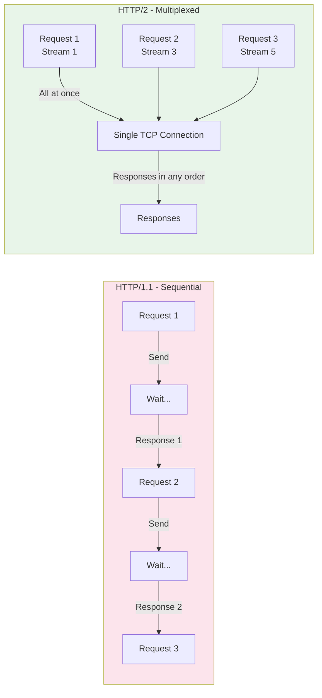
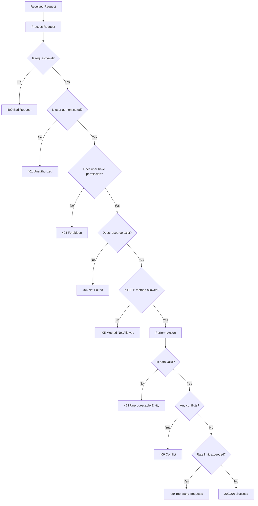
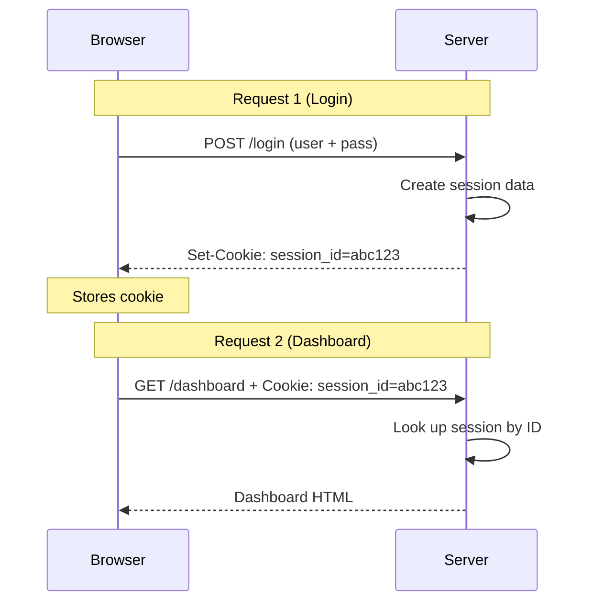
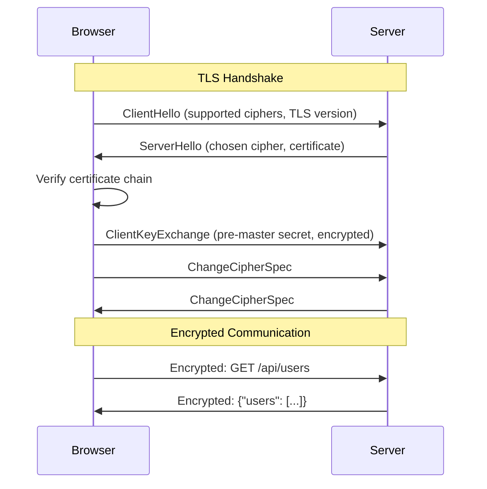
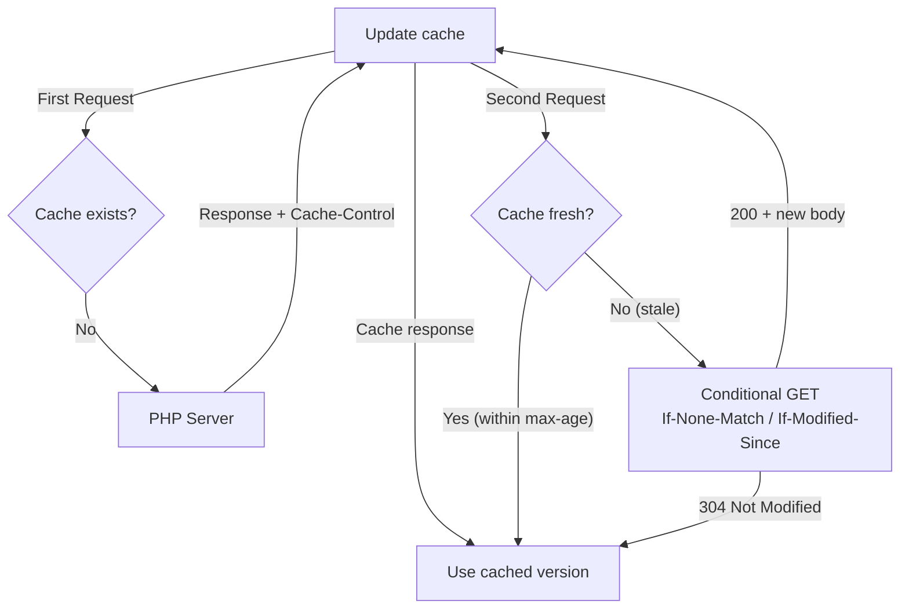

# Chapter 7: How HTTP Works

## Learning Objectives

By the end of this chapter you will:
- Understand HTTP protocol fundamentals
- Know all HTTP methods and their purposes
- Understand HTTP headers, status codes, and request/response structure
- Master sessions, cookies, and state management
- Implement RESTful API patterns in PHP
- Understand HTTPS and TLS

---

## 7.1 What is HTTP?

### Beginner Level

HTTP (Hypertext Transfer Protocol) is the language that browsers and web servers use to communicate. When you visit a website, your browser sends an HTTP request, and the server sends back an HTTP response.

Think of it like ordering food at a restaurant:
1. You (browser) tell the waiter (HTTP request) what you want
2. The waiter tells the kitchen (server processes)
3. The kitchen prepares your food
4. The waiter brings it back (HTTP response)

### Technical Level

HTTP is a **stateless, application-layer protocol** built on top of TCP. It follows a **request-response model**.

**Key Characteristics:**
- **Stateless:** Each request is independent; server doesn't remember past requests
- **Text-based:** Headers are human-readable ASCII
- **Client-server:** One side requests, the other responds
- **Extensible:** Headers allow protocol extension

**HTTP Request Structure:**

```text
POST /api/users HTTP/1.1                    ← Request Line
Host: api.example.com                        ← Headers
Content-Type: application/json
Authorization: Bearer eyJhbGciOiJI...
User-Agent: PHP-Mastery/1.0
Accept: application/json
Content-Length: 42

{"name": "Alice", "email": "alice@example.com"}  ← Body
```

**HTTP Response Structure:**

```text
HTTP/1.1 201 Created                        ← Status Line
Date: Mon, 15 Jan 2024 10:30:00 GMT         ← Headers
Content-Type: application/json
Location: /api/users/42
Server: nginx/1.24
Content-Length: 55

{"id": 42, "name": "Alice", "email": "alice@example.com"}  ← Body
```

### HTTP Versions

| Version | Year | Features |
|---------|------|----------|
| HTTP/0.9 | 1991 | Only GET, no headers, no status codes |
| HTTP/1.0 | 1996 | Headers, status codes, content types |
| HTTP/1.1 | 1997 | Persistent connections, chunked encoding, caching |
| HTTP/2 | 2015 | Multiplexing, header compression, server push |
| HTTP/3 | 2022 | QUIC (UDP-based), faster connection setup |



---

## 7.2 HTTP Methods

### The Complete Reference

| Method | Purpose | Idempotent | Safe | Body | Use Case |
|--------|---------|------------|------|------|----------|
| GET | Retrieve resource | Yes | Yes | No | Fetch data |
| POST | Create resource | No | No | Yes | Submit data |
| PUT | Replace resource | Yes | No | Yes | Full update |
| PATCH | Partial update | No | No | Yes | Partial update |
| DELETE | Remove resource | Yes | No | Maybe | Delete data |
| HEAD | Headers only (no body) | Yes | Yes | No | Check existence |
| OPTIONS | Available methods | Yes | Yes | No | CORS preflight |
| CONNECT | Tunnel connection | No | No | No | HTTPS proxy |
| TRACE | Diagnostic echo | Yes | Yes | No | Debugging |

### PHP Implementation

```php
<?php
class Request
{
    public function __construct(
        public readonly string $method,
        public readonly string $uri,
        public readonly array $headers,
        public readonly ?string $body,
        public readonly array $query,
    ) {}

    public static function fromGlobals(): self
    {
        $method = $_SERVER['REQUEST_METHOD'];
        $uri = parse_url($_SERVER['REQUEST_URI'], PHP_URL_PATH);
        $headers = getallheaders();
        $body = file_get_contents('php://input');
        $query = $_GET;

        return new self($method, $uri, $headers, $body, $query);
    }

    public function isMethod(string ...$methods): bool
    {
        return in_array(strtoupper($this->method), $methods);
    }

    public function getJsonBody(): ?array
    {
        if ($this->body === null || $this->body === '') {
            return null;
        }
        return json_decode($this->body, true);
    }

    public function expectsJson(): bool
    {
        $accept = $this->headers['Accept'] ?? '';
        return str_contains($accept, 'application/json');
    }
}

// Usage
$request = Request::fromGlobals();

switch (true) {
    case $request->isMethod('GET') && $request->uri === '/api/users':
        handleGetUsers();
        break;
    case $request->isMethod('POST') && $request->uri === '/api/users':
        $data = $request->getJsonBody();
        handleCreateUser($data);
        break;
    case $request->isMethod('PUT') && preg_match('/^\/api\/users\/(\d+)$/', $request->uri, $matches):
        handleUpdateUser((int)$matches[1], $request->getJsonBody());
        break;
}
```

---

## 7.3 HTTP Status Codes

### Complete Status Code Reference

```php
<?php
/**
 * HTTP Status Codes Reference for PHP Developers
 */

// 1xx Informational
const HTTP_CONTINUE = 100;
const HTTP_SWITCHING_PROTOCOLS = 101;

// 2xx Success
const HTTP_OK = 200;
const HTTP_CREATED = 201;           // Resource created
const HTTP_ACCEPTED = 202;          // Accepted for processing
const HTTP_NO_CONTENT = 204;        // Success, no body
const HTTP_RESET_CONTENT = 205;
const HTTP_PARTIAL_CONTENT = 206;

// 3xx Redirection
const HTTP_MOVED_PERMANENTLY = 301; // SEO: old URL → new URL
const HTTP_FOUND = 302;             // Temporary redirect
const HTTP_SEE_OTHER = 303;         // POST → GET redirect
const HTTP_NOT_MODIFIED = 304;      // Cache: use cached version
const HTTP_TEMPORARY_REDIRECT = 307;
const HTTP_PERMANENT_REDIRECT = 308;

// 4xx Client Errors
const HTTP_BAD_REQUEST = 400;       // Malformed request
const HTTP_UNAUTHORIZED = 401;      // Authentication required
const HTTP_FORBIDDEN = 403;         // No permission
const HTTP_NOT_FOUND = 404;         // Resource doesn't exist
const HTTP_METHOD_NOT_ALLOWED = 405;
const HTTP_NOT_ACCEPTABLE = 406;
const HTTP_CONFLICT = 409;          // State conflict
const HTTP_GONE = 410;              // Resource permanently gone
const HTTP_UNPROCESSABLE_ENTITY = 422; // Validation errors
const HTTP_TOO_MANY_REQUESTS = 429;    // Rate limiting

// 5xx Server Errors
const HTTP_INTERNAL_SERVER_ERROR = 500;
const HTTP_NOT_IMPLEMENTED = 501;
const HTTP_BAD_GATEWAY = 502;       // Upstream server failed
const HTTP_SERVICE_UNAVAILABLE = 503; // Maintenance/overload
const HTTP_GATEWAY_TIMEOUT = 504;

// Production response helper
function jsonResponse(array $data, int $status = 200, string $message = ''): never
{
    http_response_code($status);
    header('Content-Type: application/json');
    
    $response = [
        'status' => $status,
        'success' => $status >= 200 && $status < 300,
    ];
    
    if ($message) {
        $response['message'] = $message;
    }
    
    if ($data) {
        $response['data'] = $data;
    }
    
    echo json_encode($response, JSON_UNESCAPED_UNICODE);
    exit;
}

// Usage patterns
jsonResponse(['user' => $user], HTTP_OK);
jsonResponse(['id' => $newId], HTTP_CREATED, 'User created');
jsonResponse([], HTTP_NO_CONTENT);
jsonResponse(['error' => 'Not found'], HTTP_NOT_FOUND, 'User not found');
```

### Status Code Decision Tree



---

## 7.4 HTTP Headers

### Request Headers

```php
<?php
// Common request headers and their PHP access
$headers = [
    // Client info
    'User-Agent' => $_SERVER['HTTP_USER_AGENT'] ?? '',
    'Referer' => $_SERVER['HTTP_REFERER'] ?? '',
    'Origin' => $_SERVER['HTTP_ORIGIN'] ?? '',
    
    // Content negotiation
    'Accept' => $_SERVER['HTTP_ACCEPT'] ?? '',
    'Accept-Language' => $_SERVER['HTTP_ACCEPT_LANGUAGE'] ?? '',
    'Accept-Encoding' => $_SERVER['HTTP_ACCEPT_ENCODING'] ?? '',
    
    // Authentication
    'Authorization' => $_SERVER['HTTP_AUTHORIZATION'] ?? '',
    'Cookie' => $_SERVER['HTTP_COOKIE'] ?? '',
    
    // Cache
    'If-None-Match' => $_SERVER['HTTP_IF_NONE_MATCH'] ?? '',
    'If-Modified-Since' => $_SERVER['HTTP_IF_MODIFIED_SINCE'] ?? '',
    
    // Connection
    'Host' => $_SERVER['HTTP_HOST'] ?? '',
    'Connection' => $_SERVER['HTTP_CONNECTION'] ?? '',
    
    // Security
    'X-Forwarded-For' => $_SERVER['HTTP_X_FORWARDED_FOR'] ?? '',
    'X-Requested-With' => $_SERVER['HTTP_X_REQUESTED_WITH'] ?? '',
];
```

### Response Headers (Production Patterns)

```php
<?php
class ResponseHeaders
{
    // Security headers (always set)
    public static function security(): array
    {
        return [
            'X-Content-Type-Options' => 'nosniff',
            'X-Frame-Options' => 'SAMEORIGIN',
            'X-XSS-Protection' => '1; mode=block',
            'Referrer-Policy' => 'strict-origin-when-cross-origin',
        ];
    }

    // CORS headers
    public static function cors(string $origin): array
    {
        return [
            'Access-Control-Allow-Origin' => $origin,
            'Access-Control-Allow-Methods' => 'GET, POST, PUT, PATCH, DELETE, OPTIONS',
            'Access-Control-Allow-Headers' => 'Content-Type, Authorization',
            'Access-Control-Max-Age' => '86400',
            'Access-Control-Allow-Credentials' => 'true',
        ];
    }

    // Cache headers
    public static function cache(int $maxAge = 3600): array
    {
        return [
            'Cache-Control' => "public, max-age={$maxAge}, immutable",
            'Expires' => gmdate('D, d M Y H:i:s', time() + $maxAge) . ' GMT',
        ];
    }

    // Content negotiation response
    public static function contentType(string $format): array
    {
        $types = [
            'html' => 'text/html; charset=utf-8',
            'json' => 'application/json; charset=utf-8',
            'xml' => 'application/xml; charset=utf-8',
            'text' => 'text/plain; charset=utf-8',
        ];

        return ['Content-Type' => $types[$format] ?? $types['text']];
    }

    // Apply headers
    public static function apply(array $headers): void
    {
        foreach ($headers as $name => $value) {
            header("{$name}: {$value}");
        }
    }
}

// Usage
ResponseHeaders::apply(ResponseHeaders::security());
ResponseHeaders::apply(ResponseHeaders::cors('https://myapp.com'));
ResponseHeaders::apply(ResponseHeaders::contentType('json'));
```

### Custom Headers (X- Headers)

```php
<?php
// Custom headers for API versioning and metadata
header('X-API-Version: 1.2');
header('X-Request-ID: ' . bin2hex(random_bytes(16)));
header('X-RateLimit-Limit: 100');
header('X-RateLimit-Remaining: 87');
header('X-RateLimit-Reset: 1705316400');
```

---

## 7.5 Sessions and State Management

### Why State is Hard

HTTP is stateless. Each request is independent. To remember users between requests, we need **sessions**.



### PHP Sessions

```php
<?php
// PHP Session Configuration (php.ini)
// session.save_handler = files
// session.save_path = /tmp
// session.name = PHPSESSID
// session.gc_maxlifetime = 1440 (24 min)
// session.cookie_httponly = 1
// session.cookie_secure = 1
// session.cookie_samesite = "Lax"

// Start session
session_start();

// Store data
$_SESSION['user_id'] = 42;
$_SESSION['last_activity'] = time();
$_SESSION['cart'] = ['item_1', 'item_2'];

// Retrieve data
$userId = $_SESSION['user_id'] ?? null;

// Regenerate session ID (after login!)
session_regenerate_id(true);

// Destroy session (logout)
session_destroy();
```

### Custom Session Handler (Redis)

```php
<?php
class RedisSessionHandler implements SessionHandlerInterface
{
    private Redis $redis;
    private int $ttl; // Time-to-live seconds

    public function __construct(Redis $redis, int $ttl = 3600)
    {
        $this->redis = $redis;
        $this->ttl = $ttl;
    }

    public function open(string $path, string $name): bool
    {
        return true; // Redis handles connection internally
    }

    public function close(): bool
    {
        return true;
    }

    public function read(string $id): string|false
    {
        return $this->redis->get("session:{$id}") ?: '';
    }

    public function write(string $id, string $data): bool
    {
        return $this->redis->setex("session:{$id}", $this->ttl, $data);
    }

    public function destroy(string $id): bool
    {
        return $this->redis->del("session:{$id}") > 0;
    }

    public function gc(int $max_lifetime): int|false
    {
        // Redis handles expiry automatically (SETEX)
        return true;
    }
}

// Register handler
$redis = new Redis();
$redis->connect('127.0.0.1', 6379);

session_set_save_handler(new RedisSessionHandler($redis, 3600), true);
session_start();
```

---

## 7.6 HTTPS/TLS

### What HTTPS Does



### Why HTTPS Matters for PHP

```php
<?php
// Force HTTPS
if (empty($_SERVER['HTTPS']) || $_SERVER['HTTPS'] === 'off') {
    header('Location: https://' . $_SERVER['HTTP_HOST'] . $_SERVER['REQUEST_URI']);
    exit;
}

// Check for secure cookies
session_set_cookie_params([
    'lifetime' => 0,
    'path' => '/',
    'domain' => '',
    'secure' => true,     // HTTPS only
    'httponly' => true,   // Not accessible via JavaScript
    'samesite' => 'Lax',
]);

// Security headers for HTTPS
header('Strict-Transport-Security: max-age=31536000; includeSubDomains');
header('Content-Security-Policy: upgrade-insecure-requests');
```

### Setting Up HTTPS (Nginx)

```nginx
server {
    listen 443 ssl http2;
    server_name example.com;

    ssl_certificate /etc/ssl/certs/example.com.crt;
    ssl_certificate_key /etc/ssl/private/example.com.key;

    # Modern TLS configuration
    ssl_protocols TLSv1.2 TLSv1.3;
    ssl_ciphers ECDHE-ECDSA-AES128-GCM-SHA256:ECDHE-RSA-AES128-GCM-SHA256;
    ssl_prefer_server_ciphers on;
    ssl_session_cache shared:SSL:10m;
    ssl_session_timeout 10m;

    # HSTS
    add_header Strict-Transport-Security "max-age=31536000" always;
}

# Redirect HTTP → HTTPS
server {
    listen 80;
    server_name example.com;
    return 301 https://$server_name$request_uri;
}
```

---

## 7.7 RESTful API Design in PHP

### Full REST API Implementation

```php
<?php
/**
 * Complete REST API Router
 */
class Router
{
    private array $routes = [];

    public function get(string $path, callable $handler): void
    {
        $this->routes['GET'][] = [$path, $handler];
    }

    public function post(string $path, callable $handler): void
    {
        $this->routes['POST'][] = [$path, $handler];
    }

    public function put(string $path, callable $handler): void
    {
        $this->routes['PUT'][] = [$path, $handler];
    }

    public function patch(string $path, callable $handler): void
    {
        $this->routes['PATCH'][] = [$path, $handler];
    }

    public function delete(string $path, callable $handler): void
    {
        $this->routes['DELETE'][] = [$path, $handler];
    }

    public function dispatch(string $method, string $uri): mixed
    {
        $methodRoutes = $this->routes[$method] ?? [];
        
        foreach ($methodRoutes as [$pattern, $handler]) {
            $regex = $this->patternToRegex($pattern);
            
            if (preg_match($regex, $uri, $matches)) {
                array_shift($matches); // Remove full match
                return $handler(...$matches);
            }
        }
        
        // No route matched
        http_response_code(404);
        return ['error' => 'Not found'];
    }

    private function patternToRegex(string $pattern): string
    {
        // Convert {id} to named capture group
        $regex = preg_replace('/\{(\w+)\}/', '(?P<$1>[^/]+)', $pattern);
        return '#^' . $regex . '$#';
    }
}

// Usage
$router = new Router();
$userController = new UserController();

// Define RESTful routes
$router->get('/api/users', [$userController, 'index']);
$router->get('/api/users/{id}', [$userController, 'show']);
$router->post('/api/users', [$userController, 'store']);
$router->put('/api/users/{id}', [$userController, 'update']);
$router->delete('/api/users/{id}', [$userController, 'destroy']);

// Dispatch
$method = $_SERVER['REQUEST_METHOD'];
$uri = parse_url($_SERVER['REQUEST_URI'], PHP_URL_PATH);
$result = $router->dispatch($method, $uri);

header('Content-Type: application/json');
echo json_encode($result);
```

```php
<?php
/**
 * RESTful Controller Example
 */
class UserController
{
    public function index(): array
    {
        // GET /api/users
        $users = User::all();
        return ['data' => $users];
    }

    public function show(string $id): array
    {
        // GET /api/users/{id}
        $user = User::findOrFail((int)$id);
        return ['data' => $user];
    }

    public function store(): array
    {
        // POST /api/users
        $data = json_decode(file_get_contents('php://input'), true);
        
        // Validate
        $errors = $this->validate($data);
        if (!empty($errors)) {
            http_response_code(422);
            return ['errors' => $errors];
        }
        
        $user = User::create($data);
        http_response_code(201);
        return ['data' => $user];
    }

    public function update(string $id): array
    {
        // PUT /api/users/{id}
        $data = json_decode(file_get_contents('php://input'), true);
        $user = User::findOrFail((int)$id);
        $user->update($data);
        return ['data' => $user];
    }

    public function destroy(string $id): array
    {
        // DELETE /api/users/{id}
        $user = User::findOrFail((int)$id);
        $user->delete();
        http_response_code(204);
        return [];
    }

    private function validate(array $data): array
    {
        $errors = [];
        if (empty($data['name'])) $errors['name'][] = 'Name is required';
        if (empty($data['email'])) $errors['email'][] = 'Email is required';
        if (!filter_var($data['email'] ?? '', FILTER_VALIDATE_EMAIL)) {
            $errors['email'][] = 'Invalid email format';
        }
        return $errors;
    }
}
```

### RESTful URL Design

```text
# Collection
GET     /api/users              → List all users
POST    /api/users              → Create a user

# Single resource
GET     /api/users/{id}         → Get a specific user
PUT     /api/users/{id}         → Replace a user
PATCH   /api/users/{id}         → Partial update
DELETE  /api/users/{id}         → Delete a user

# Nested resources
GET     /api/users/{id}/posts   → List user's posts
POST    /api/users/{id}/posts   → Create post for user

# Sub-resources
GET     /api/users/{id}/profile → User profile
PUT     /api/users/{id}/avatar  → Update avatar only

# Actions (non-CRUD)
POST    /api/users/{id}/activate   → Activate user
POST    /api/users/{id}/deactivate → Deactivate user
```

### Content Negotiation

```php
<?php
class ContentNegotiator
{
    public static function bestFormat(string $accept): string
    {
        $priorities = [
            'application/json' => 1.0,
            'text/html' => 0.8,
            'application/xml' => 0.5,
            'text/plain' => 0.3,
        ];

        $accepted = explode(',', $accept);
        $best = 'application/json'; // Default
        $bestQ = 0;

        foreach ($accepted as $item) {
            $parts = explode(';', trim($item));
            $type = $parts[0];
            $q = 1.0;

            if (isset($parts[1]) && str_starts_with($parts[1], 'q=')) {
                $q = (float) substr($parts[1], 2);
            }

            if ($q > $bestQ && isset($priorities[$type])) {
                $bestQ = $q;
                $best = $type;
            }
        }

        return $best;
    }

    public static function respond(mixed $data): void
    {
        $format = self::bestFormat($_SERVER['HTTP_ACCEPT'] ?? '*/*');

        switch ($format) {
            case 'application/json':
                header('Content-Type: application/json');
                echo json_encode($data, JSON_PRETTY_PRINT);
                break;
            case 'application/xml':
                header('Content-Type: application/xml');
                echo self::toXml($data);
                break;
            default:
                header('Content-Type: text/plain');
                print_r($data);
        }
    }
}
```

---

## 7.8 HTTP Caching

### Caching Strategies



### PHP Cache Headers

```php
<?php
// ETag (content-based caching)
function generateETag(string $content): string
{
    return '"' . md5($content) . '"';
}

// Check If-None-Match
$etag = generateETag($htmlContent);
header("ETag: {$etag}");

if (isset($_SERVER['HTTP_IF_NONE_MATCH']) && 
    $_SERVER['HTTP_IF_NONE_MATCH'] === $etag) {
    http_response_code(304);
    exit;
}

// Last-Modified
$lastModified = filemtime($filePath);
header("Last-Modified: " . gmdate('D, d M Y H:i:s', $lastModified) . ' GMT');

if (isset($_SERVER['HTTP_IF_MODIFIED_SINCE'])) {
    $modifiedSince = strtotime($_SERVER['HTTP_IF_MODIFIED_SINCE']);
    if ($lastModified <= $modifiedSince) {
        http_response_code(304);
        exit;
    }
}

// Cache-Control
header('Cache-Control: public, max-age=3600, must-revalidate');

// Vary (important for proxies)
header('Vary: Accept-Encoding, User-Agent');
```

---

## 7.9 Common HTTP Mistakes

| Mistake | Impact | Solution |
|---------|--------|----------|
| Wrong status codes | Clients misbehave | Use correct codes (201 for create, 422 for validation) |
| Missing CORS headers | Cross-origin requests fail | Set `Access-Control-Allow-Origin` |
| No caching headers | Repeated full downloads | Use ETag/Last-Modified/Cache-Control |
| Mixed content (HTTP on HTTPS) | Browser blocks resources | Always use HTTPS |
| Not validating Content-Type | Security vulnerabilities | Validate request content type |
| Sending sensitive data in URLs | Logged, cached, leaked | Use POST body for sensitive data |
| No rate limiting | Abuse, overload | Implement 429 responses |
| Session fixation | Account takeover | Regenerate session ID after login |

---

## 7.10 Exercises

### Beginner Exercises

1. Use `curl` to make GET, POST, PUT, DELETE requests to a PHP endpoint
2. Analyze HTTP headers using browser DevTools
3. Implement session-based user login/logout
4. Return different status codes for different scenarios
5. Set security headers on a PHP response

### Intermediate Exercises

1. Build a complete REST API for a blog (posts, comments, users)
2. Implement ETag-based caching for a PHP endpoint
3. Create a content negotiation middleware
4. Implement CORS for a public API
5. Build a rate limiter using HTTP headers

### Advanced Exercises

1. Implement HTTP/2 server push in PHP (using Nginx)
2. Build a caching reverse proxy in PHP
3. Implement conditional GET with multiple cache validators
4. Create an API versioning system using Accept headers
5. Build a REST client library that handles pagination, rate limits, retries

---

## 7.11 Mini Project: HTTP Debugger

```php
#!/usr/bin/env php
<?php
/**
 * HTTP Request Debugger
 * Shows everything about an HTTP request
 * 
 * Usage: php -S localhost:8080 http-debugger.php
 */

// Collect all request information
$info = [
    'method' => $_SERVER['REQUEST_METHOD'],
    'uri' => $_SERVER['REQUEST_URI'],
    'protocol' => $_SERVER['SERVER_PROTOCOL'],
    'timestamp' => date('Y-m-d H:i:s'),
    'ip' => $_SERVER['REMOTE_ADDR'],
    'user_agent' => $_SERVER['HTTP_USER_AGENT'] ?? null,
    'headers' => getallheaders(),
    'query_params' => $_GET,
    'body' => file_get_contents('php://input'),
    'cookies' => $_COOKIE,
    'server' => [
        'software' => $_SERVER['SERVER_SOFTWARE'],
        'php_version' => PHP_VERSION,
    ],
];

// Determine response format
$accept = $_SERVER['HTTP_ACCEPT'] ?? 'text/html';

if (str_contains($accept, 'application/json')) {
    header('Content-Type: application/json');
    echo json_encode($info, JSON_PRETTY_PRINT | JSON_UNESCAPED_SLASHES);
} else {
    header('Content-Type: text/html');
    ?>
    <!DOCTYPE html>
    <html>
    <head><title>HTTP Debugger</title>
    <style>
        body { font-family: monospace; margin: 20px; background: #1a1a2e; color: #eee; }
        pre { background: #16213e; padding: 15px; border-radius: 5px; overflow-x: auto; }
        .section { margin: 20px 0; }
        .section h2 { color: #e94560; }
        .key { color: #0f3460; background: #e94560; padding: 2px 6px; border-radius: 3px; }
        .value { color: #53d769; }
    </style>
    </head>
    <body>
        <h1>HTTP Debugger</h1>
        <div class="section">
            <h2>Request Line</h2>
            <pre><?= "{$info['method']} {$info['uri']} {$info['protocol']}" ?></pre>
        </div>
        <div class="section">
            <h2>Headers</h2>
            <pre><?php foreach ($info['headers'] as $k => $v): ?>
<span class="key"><?= htmlspecialchars($k) ?></span>: <span class="value"><?= htmlspecialchars($v) ?></span>
<?php endforeach; ?></pre>
        </div>
        <div class="section">
            <h2>Query Parameters</h2>
            <pre><?php print_r($info['query_params']) ?></pre>
        </div>
        <div class="section">
            <h2>Body</h2>
            <pre><?= htmlspecialchars($info['body'] ?: '(empty)') ?></pre>
        </div>
        <div class="section">
            <h2>Cookies</h2>
            <pre><?php print_r($info['cookies']) ?></pre>
        </div>
    </body>
    </html>
    <?php
}
```

---

## 7.12 Interview Questions

### Junior Level

1. "What is HTTP and how does it work?"
2. "Explain the difference between GET and POST."
3. "What are HTTP status codes? Give examples of 2xx, 4xx, and 5xx."
4. "What is a cookie and how is it used?"
5. "What is the difference between HTTP and HTTPS?"

### Mid-Level

1. "Explain how sessions work in PHP."
2. "What is REST and what are its constraints?"
3. "How does HTTP caching work? Explain ETags."
4. "What is CORS and how do you handle it?"
5. "Explain the difference between PUT and PATCH."

### Senior Level

1. "How would you design a stateless authentication system using HTTP headers?"
2. "Explain the HTTP/2 multiplexing and its benefits for PHP applications."
3. "Design an API versioning strategy considering HTTP semantics."
4. "How would you handle a million concurrent WebSocket connections?"
5. "Explain how you'd implement conditional GET for a REST API."

### Architect Level

1. "Design a distributed session management system for a multi-region PHP application."
2. "How would you implement HTTP-level rate limiting across 100+ servers?"
3. "Design a caching strategy using HTTP semantics for a global API."
4. "Compare REST, GraphQL, and gRPC from an HTTP perspective."
5. "How would you build a custom HTTP server in PHP using sockets?"

---

## Further Reading

- **RFC:** [RFC 7230-7235 (HTTP/1.1)](https://tools.ietf.org/html/rfc7230)
- **RFC:** [RFC 7540 (HTTP/2)](https://tools.ietf.org/html/rfc7540)
- **Book:** "HTTP: The Definitive Guide" by David Gourley
- **Resource:** [Mozilla HTTP Observatory](https://observatory.mozilla.org/)
- **Tool:** [httpbin.org](https://httpbin.org/) — HTTP request testing
- **Tool:** [Insomnia](https://insomnia.rest/) — HTTP client for API testing

---

*End of Chapter 7. Proceed to Chapter 8: How Databases Work.*
