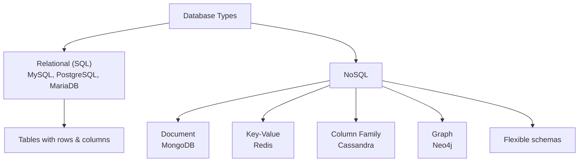
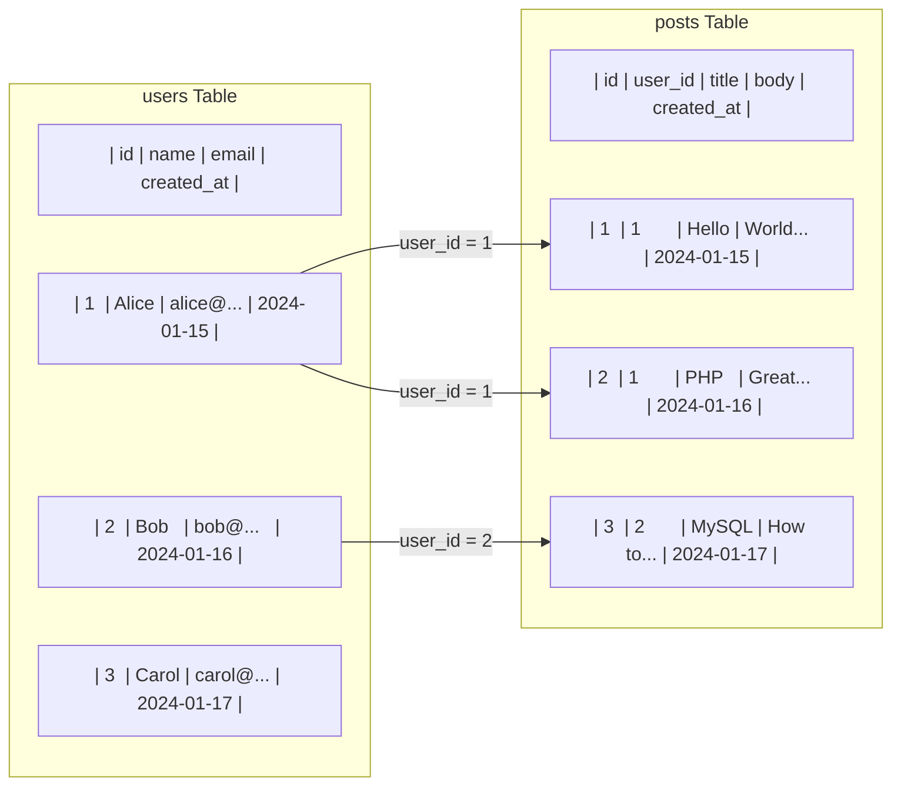
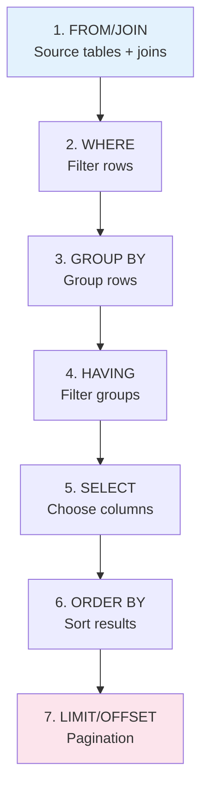
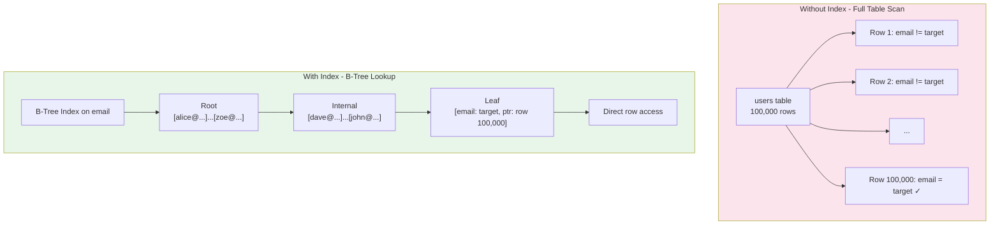
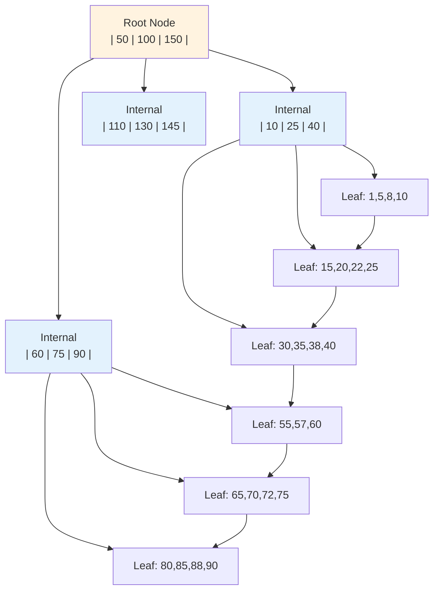

# Chapter 8: How Databases Work

## Learning Objectives

By the end of this chapter you will:
- Understand what a database is and why we need one
- Differentiate between relational and NoSQL databases
- Understand SQL fundamentals
- Know how indexing works
- Understand ACID transactions
- Be able to connect PHP to databases securely

---

## 8.1 What is a Database?

### Beginner Level

A database is a place where your application keeps information it needs to remember. When you close your app and open it again tomorrow, the database still has all the data.

Think of it like a filing cabinet vs. a whiteboard:
- **Variables in PHP** = a whiteboard — write something, close the app, it's gone
- **Database** = a filing cabinet — store something, come back years later, it's still there

Every time you log into a website, create a post, or place an order, that data goes into a database. Without one, websites would forget everything the moment you refresh the page.

### Real-World Analogy

A database is like a library:
- **Database** = The library building
- **Tables** = The sections (fiction, non-fiction, reference)
- **Rows** = Individual books
- **Columns** = Book properties (title, author, ISBN, year)
- **Indexes** = The card catalog — tells you exactly which shelf a book is on without searching the whole library
- **Queries** = Asking the librarian for specific books
- **Primary Key** = Each book's unique barcode number

### Technical Level

A **Database Management System (DBMS)** is software that manages data storage, retrieval, modification, and deletion. It handles:
- **Data persistence** — Survives server restarts
- **Concurrency** — Many users reading/writing simultaneously
- **Integrity** — Rules to keep data consistent
- **Security** — Authentication, authorization, encryption
- **Performance** — Indexing, query optimization, caching

**Database Types:**



### Relational vs NoSQL

| Aspect | Relational (MySQL/PostgreSQL) | NoSQL (MongoDB/Redis) |
|--------|-----------------------------|----------------------|
| Data model | Tables, rows, columns | Documents, key-value, graphs |
| Schema | Fixed (defined upfront) | Flexible |
| Relationships | Foreign keys, JOINs | Embedded or references |
| Scalability | Vertical (bigger server) | Horizontal (more servers) |
| ACID | Yes (PostgreSQL: fully; MySQL: with InnoDB) | Varies (eventual consistency) |
| PHP use | Primary data (users, orders) | Cache, sessions, analytics |
| Query language | SQL | API-specific |

---

## 8.2 Relational Databases

### Tables, Rows, and Columns



### SQL (Structured Query Language)

```sql
-- DDL: Data Definition Language
CREATE TABLE users (
    id BIGINT UNSIGNED AUTO_INCREMENT PRIMARY KEY,
    name VARCHAR(255) NOT NULL,
    email VARCHAR(255) NOT NULL UNIQUE,
    password_hash VARCHAR(255) NOT NULL,
    created_at TIMESTAMP DEFAULT CURRENT_TIMESTAMP,
    updated_at TIMESTAMP DEFAULT CURRENT_TIMESTAMP ON UPDATE CURRENT_TIMESTAMP
);

-- DML: Data Manipulation Language
INSERT INTO users (name, email, password_hash) 
VALUES ('Alice', 'alice@example.com', '$2y$10$...');

-- DQL: Data Query Language
SELECT id, name, email FROM users WHERE email = 'alice@example.com';

-- DCL: Data Control Language
GRANT SELECT, INSERT ON myapp.* TO 'app_user'@'localhost';

-- TCL: Transaction Control Language
START TRANSACTION;
UPDATE accounts SET balance = balance - 100 WHERE id = 1;
UPDATE accounts SET balance = balance + 100 WHERE id = 2;
COMMIT;
```

### SQL Query Execution Order



---

## 8.3 Indexing

### What is an Index?

An index is a data structure that speeds up data retrieval. Like a book's index, it tells the database WHERE to find data without scanning every page.



### B-Tree Index Structure



### Index Types

```sql
-- Single column index
CREATE INDEX idx_email ON users(email);

-- Composite index (order matters!)
CREATE INDEX idx_name_email ON users(name, email);
-- Good for: WHERE name = 'Alice'
-- Good for: WHERE name = 'Alice' AND email LIKE 'alice@%'
-- NOT good for: WHERE email = 'alice@example.com' (name must be first)

-- Unique index
CREATE UNIQUE INDEX idx_email_unique ON users(email);

-- Full-text index (for search)
CREATE FULLTEXT INDEX idx_search ON posts(title, body);

-- Partial index (PostgreSQL)
CREATE INDEX idx_active_users ON users(email) WHERE status = 'active';
```

### When Indexes Go Wrong

```sql
-- Index can't be used (function on column)
SELECT * FROM users WHERE LOWER(email) = 'alice@example.com';
-- Fix: Use expression index or store lowercase

-- Index can't be used (LIKE with leading wildcard)
SELECT * FROM users WHERE name LIKE '%alice%';
-- Fix: Use full-text search

-- Too many indexes (slow writes)
-- Each index must be updated on INSERT/UPDATE/DELETE

-- Missing composite index
SELECT * FROM posts WHERE user_id = 1 ORDER BY created_at DESC;
-- Fix: CREATE INDEX idx_user_created ON posts(user_id, created_at DESC);
```

---

## 8.4 ACID Transactions

### What ACID Means

| Property | Meaning | Why It Matters |
|----------|---------|----------------|
| **A**tomicity | All or nothing | If a step fails, everything rolls back |
| **C**onsistency | Data follows rules | Database is always in a valid state |
| **I**solation | Concurrent transactions don't interfere | Your transaction doesn't see mine mid-way |
| **D**urability | Committed data persists | Even if the power goes out |

### Transaction Example

```php
<?php
// Bank transfer: atomicity is critical
function transferFunds(PDO $pdo, int $fromId, int $toId, float $amount): void
{
    try {
        $pdo->beginTransaction();
        
        // Check balance
        $stmt = $pdo->prepare(
            'SELECT balance FROM accounts WHERE id = ? FOR UPDATE'
        );
        $stmt->execute([$fromId]);
        $fromBalance = (float)$stmt->fetchColumn();
        
        if ($fromBalance < $amount) {
            throw new \RuntimeException('Insufficient funds');
        }
        
        // Debit sender
        $pdo->prepare(
            'UPDATE accounts SET balance = balance - ? WHERE id = ?'
        )->execute([$amount, $fromId]);
        
        // Credit receiver
        $pdo->prepare(
            'UPDATE accounts SET balance = balance + ? WHERE id = ?'
        )->execute([$amount, $toId]);
        
        // Log transaction
        $pdo->prepare(
            'INSERT INTO transfer_log (from_id, to_id, amount) VALUES (?, ?, ?)'
        )->execute([$fromId, $toId, $amount]);
        
        $pdo->commit();
    } catch (\Throwable $e) {
        $pdo->rollBack();
        throw $e; // Re-throw after rollback
    }
}
```

### Isolation Levels

```sql
-- Read Uncommitted (dirty reads)
SET TRANSACTION ISOLATION LEVEL READ UNCOMMITTED;
-- Can see uncommitted data from other transactions

-- Read Committed (no dirty reads, non-repeatable reads)
SET TRANSACTION ISOLATION LEVEL READ COMMITTED;
-- Only sees committed data (PostgreSQL default)

-- Repeatable Read (prevents non-repeatable reads)
SET TRANSACTION ISOLATION LEVEL REPEATABLE READ;
-- Same SELECT returns same data within transaction (MySQL default)

-- Serializable (highest isolation)
SET TRANSACTION ISOLATION LEVEL SERIALIZABLE;
-- Transactions execute as if one at a time
```

---

## 8.5 PHP Database Connectivity (PDO)

### PDO Basics

```php
<?php
/**
 * Professional PDO Database Connection
 */
class Database
{
    private static ?PDO $instance = null;

    public static function getConnection(): PDO
    {
        if (self::$instance === null) {
            $host = getenv('DB_HOST') ?: '127.0.0.1';
            $port = getenv('DB_PORT') ?: '3306';
            $name = getenv('DB_NAME') ?: 'myapp';
            $user = getenv('DB_USER') ?: 'root';
            $pass = getenv('DB_PASS') ?: '';
            
            $dsn = "mysql:host={$host};port={$port};dbname={$name};charset=utf8mb4";
            
            self::$instance = new PDO($dsn, $user, $pass, [
                PDO::ATTR_ERRMODE => PDO::ERRMODE_EXCEPTION,
                PDO::ATTR_DEFAULT_FETCH_MODE => PDO::FETCH_ASSOC,
                PDO::ATTR_EMULATE_PREPARES => false,  // Use real prepared statements
                PDO::ATTR_STRINGIFY_FETCHES => false,
            ]);
        }
        
        return self::$instance;
    }
}

// Usage
$db = Database::getConnection();
```

### Prepared Statements (SQL Injection Prevention)

```php
<?php
// NEVER DO THIS (SQL injection vulnerability):
$sql = "SELECT * FROM users WHERE email = '{$_GET['email']}'";
// Attacker: email = ' OR '1'='1  →  All users returned!

// ALWAYS use prepared statements:
$stmt = $db->prepare(
    'SELECT * FROM users WHERE email = :email AND status = :status'
);
$stmt->execute([
    ':email' => $_GET['email'],
    ':status' => 'active',
]);
$user = $stmt->fetch();

// Named parameters
$stmt = $db->prepare(
    'INSERT INTO users (name, email, password_hash) VALUES (:name, :email, :pass)'
);
$stmt->execute([
    ':name' => $name,
    ':email' => $email,
    ':pass' => password_hash($password, PASSWORD_BCRYPT),
]);

// Positional parameters
$stmt = $db->prepare(
    'UPDATE users SET name = ?, email = ? WHERE id = ?'
);
$stmt->execute([$name, $email, $id]);
```

### Fetch Modes

```php
<?php
// Fetch as associative array (most common)
$user = $stmt->fetch(PDO::FETCH_ASSOC);
// ['id' => 1, 'name' => 'Alice', 'email' => 'alice@example.com']

// Fetch as object
$user = $stmt->fetch(PDO::FETCH_OBJ);
// $user->name → 'Alice'

// Fetch into custom class
$user = $stmt->fetch(PDO::FETCH_CLASS, User::class);

// Fetch all
$users = $stmt->fetchAll(PDO::FETCH_ASSOC);

// Fetch single column (for COUNT, MAX, etc.)
$count = $stmt->fetchColumn();

// Fetch key-value pairs
$pairs = $stmt->fetchAll(PDO::FETCH_KEY_PAIR);
// [1 => 'Alice', 2 => 'Bob']

// Group by column
$grouped = $stmt->fetchAll(PDO::FETCH_GROUP);
// ['admin' => [...], 'user' => [...]]
```

### Repository Pattern

```php
<?php
interface UserRepositoryInterface
{
    public function findById(int $id): ?array;
    public function findByEmail(string $email): ?array;
    public function findAll(int $page = 1, int $perPage = 20): array;
    public function create(array $data): int;
    public function update(int $id, array $data): bool;
    public function delete(int $id): bool;
}

class MySQLUserRepository implements UserRepositoryInterface
{
    public function __construct(
        private readonly PDO $db
    ) {}

    public function findById(int $id): ?array
    {
        $stmt = $this->db->prepare(
            'SELECT * FROM users WHERE id = ? AND deleted_at IS NULL'
        );
        $stmt->execute([$id]);
        $result = $stmt->fetch(PDO::FETCH_ASSOC);
        return $result ?: null;
    }

    public function findByEmail(string $email): ?array
    {
        $stmt = $this->db->prepare(
            'SELECT * FROM users WHERE email = ? AND deleted_at IS NULL'
        );
        $stmt->execute([$email]);
        $result = $stmt->fetch(PDO::FETCH_ASSOC);
        return $result ?: null;
    }

    public function findAll(int $page = 1, int $perPage = 20): array
    {
        $offset = ($page - 1) * $perPage;
        
        // Get total count
        $countStmt = $this->db->query(
            'SELECT COUNT(*) FROM users WHERE deleted_at IS NULL'
        );
        $total = (int)$countStmt->fetchColumn();
        
        // Get page
        $stmt = $this->db->prepare(
            'SELECT * FROM users WHERE deleted_at IS NULL ORDER BY id DESC LIMIT ? OFFSET ?'
        );
        $stmt->execute([$perPage, $offset]);
        $items = $stmt->fetchAll(PDO::FETCH_ASSOC);
        
        return [
            'items' => $items,
            'total' => $total,
            'page' => $page,
            'per_page' => $perPage,
            'total_pages' => (int)ceil($total / $perPage),
        ];
    }

    public function create(array $data): int
    {
        $stmt = $this->db->prepare(
            'INSERT INTO users (name, email, password_hash) VALUES (:name, :email, :password_hash)'
        );
        $stmt->execute([
            ':name' => $data['name'],
            ':email' => $data['email'],
            ':password_hash' => password_hash($data['password'], PASSWORD_BCRYPT),
        ]);
        
        return (int)$this->db->lastInsertId();
    }

    public function update(int $id, array $data): bool
    {
        $fields = [];
        $params = [':id' => $id];
        
        foreach (['name', 'email', 'password_hash'] as $field) {
            if (isset($data[$field])) {
                $fields[] = "{$field} = :{$field}";
                $params[":{$field}"] = $data[$field];
            }
        }
        
        if (empty($fields)) {
            return false;
        }
        
        $sql = 'UPDATE users SET ' . implode(', ', $fields) . ' WHERE id = :id';
        $stmt = $this->db->prepare($sql);
        return $stmt->execute($params);
    }

    public function delete(int $id): bool
    {
        // Soft delete
        $stmt = $this->db->prepare(
            'UPDATE users SET deleted_at = NOW() WHERE id = ?'
        );
        return $stmt->execute([$id]);
    }
}
```

---

## 8.6 Query Optimization

### EXPLAIN Your Queries

```sql
-- Before optimization
EXPLAIN SELECT * FROM users 
LEFT JOIN posts ON users.id = posts.user_id 
WHERE posts.created_at > '2024-01-01'
ORDER BY posts.created_at;

-- Look for:
-- type: ALL (full table scan) → BAD
-- type: ref/range/index → GOOD
-- Extra: Using filesort → BAD (add index)
-- rows: high number → needs index

-- After adding composite index
CREATE INDEX idx_posts_user_created ON posts(user_id, created_at DESC);
```

### N+1 Query Problem

```php
<?php
// BAD: N+1 query problem
$users = $db->query('SELECT * FROM users')->fetchAll();
foreach ($users as $user) {
    // 1 query for users + N queries for posts = N+1
    $posts = $db->query(
        "SELECT * FROM posts WHERE user_id = {$user['id']}"
    )->fetchAll();
}

// GOOD: Single query with JOIN
$stmt = $db->query('
    SELECT users.*, posts.id as post_id, posts.title as post_title
    FROM users
    LEFT JOIN posts ON users.id = posts.user_id
    ORDER BY users.id
');
$results = $stmt->fetchAll();

// Even better: Two queries (for large datasets)
$users = $db->query('SELECT * FROM users')->fetchAll();
$userIds = array_column($users, 'id');
$placeholders = implode(',', array_fill(0, count($userIds), '?'));

$stmt = $db->prepare(
    "SELECT * FROM posts WHERE user_id IN ({$placeholders})"
);
$stmt->execute($userIds);
$posts = $stmt->fetchAll();

// Group posts by user_id
$postsByUser = [];
foreach ($posts as $post) {
    $postsByUser[$post['user_id']][] = $post;
}
```

---

## 8.7 MySQL vs PostgreSQL for PHP

| Feature | MySQL | PostgreSQL |
|---------|-------|------------|
| ACID compliance | With InnoDB | Full (by default) |
| Performance (read) | Excellent | Very good |
| Performance (write) | Excellent | Good |
| JSON support | Basic (MySQL 5.7+) | Excellent (indexed JSONB) |
| Full-text search | Basic | Advanced (tsvector) |
| GIS support | Basic | Excellent (PostGIS) |
| Replication | Built-in (async) | Advanced (streaming) |
| Concurrency | MVCC (undo log) | MVCC (no undo) |
| Licensing | Dual (GPL/Commercial) | Open source (BSD) |
| PHP ecosystem | Laravel default | Symfony preferred |

---

## 8.8 Database Security

```php
<?php
// 1. Never trust user input (SQL injection)
// BAD: Direct string interpolation
$sql = "SELECT * FROM users WHERE id = {$id}";

// GOOD: Prepared statements
$stmt = $pdo->prepare('SELECT * FROM users WHERE id = ?');
$stmt->execute([$id]);

// 2. Principle of least privilege
-- Create dedicated database user
CREATE USER 'app_user'@'localhost' IDENTIFIED BY 'strong_password';
GRANT SELECT, INSERT, UPDATE, DELETE ON myapp.* TO 'app_user'@'localhost';
-- Never use root in application code

// 3. Connection encryption (MySQL)
$dsn = "mysql:host={$host};port={$port};dbname={$name};charset=utf8mb4";
$options = [
    PDO::MYSQL_ATTR_SSL_CA => '/path/to/ca.pem',
    PDO::MYSQL_ATTR_SSL_VERIFY_SERVER_CERT => true,
];

// 4. Row-level security
$stmt = $pdo->prepare(
    'SELECT * FROM documents WHERE id = ? AND user_id = ?'
);
$stmt->execute([$documentId, $currentUserId]);

// 5. Rate limiting queries
// Prevent brute force: delay login attempts
```

---

## 8.9 Exercises

1. Create a `users` table with proper indexes using SQL
2. Write PHP code using PDO to insert, select, update, and delete
3. Implement pagination with LIMIT/OFFSET
4. Analyze a slow query with EXPLAIN and optimize it
5. Implement a transaction with rollback on failure

---

## 8.10 Interview Questions

1. "What is the difference between INNER JOIN and LEFT JOIN?"
2. "How does a B-tree index work?"
3. "What are ACID properties and why are they important?"
4. "How do you prevent SQL injection in PHP?"
5. "What is the N+1 query problem and how do you fix it?"
6. "Explain database normalization (1NF, 2NF, 3NF)."
7. "When would you use PostgreSQL over MySQL?"

---

## Further Reading

- **Book:** "High Performance MySQL" by Baron Schwartz
- **Book:** "PostgreSQL: Up and Running" by Regina Obe
- **Resource:** [Use The Index, Luke](https://use-the-index-luke.com/)
- **Documentation:** [PHP PDO Manual](https://www.php.net/manual/en/book.pdo.php)
- **Tool:** [DB Fiddle](https://www.db-fiddle.com/) — Online SQL playground

---

*End of Chapter 8. Proceed to Chapter 9: How Web Applications Work.*
