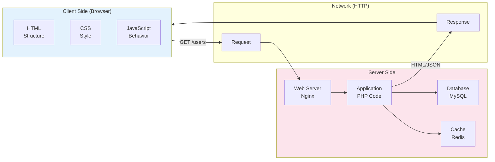
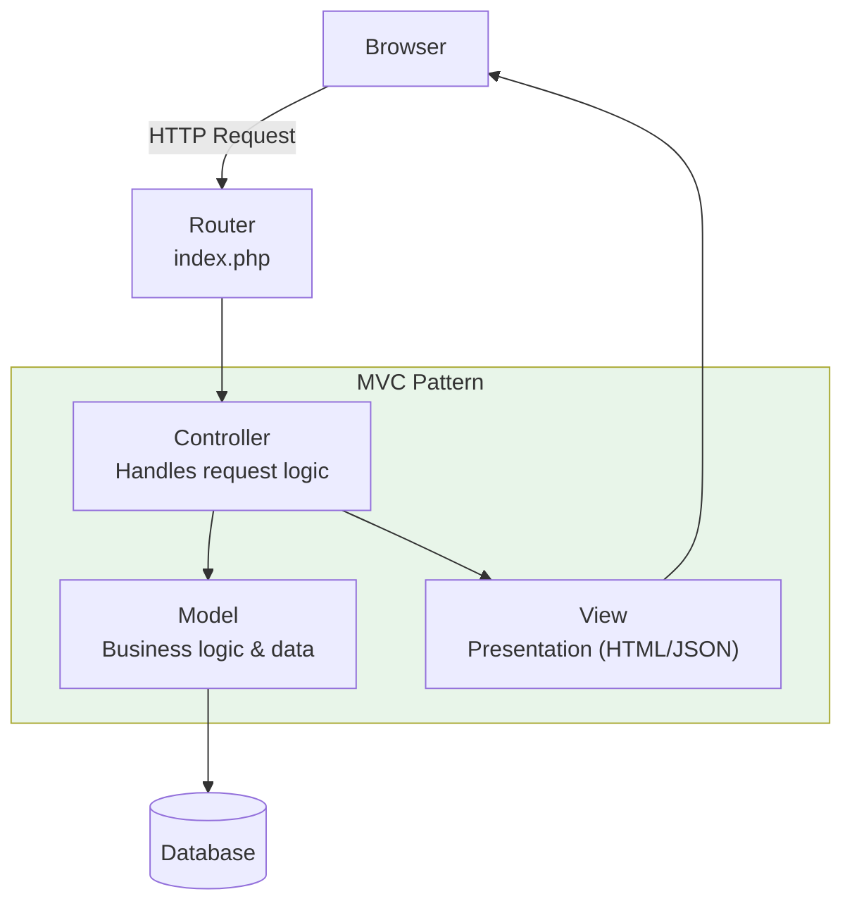
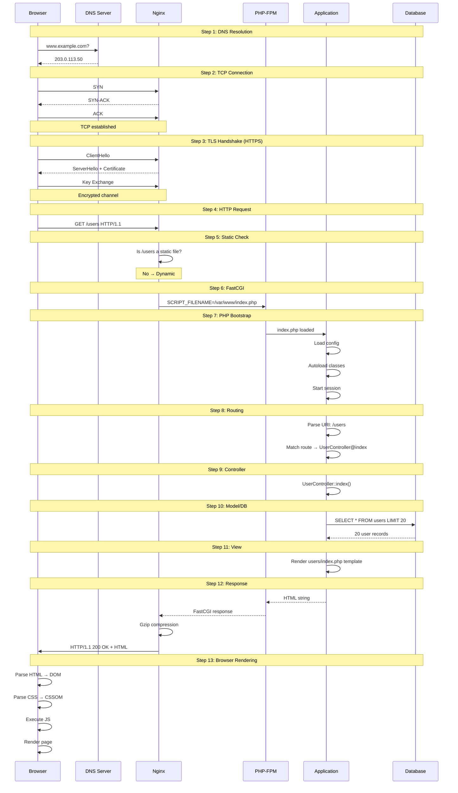

# Chapter 9: How Web Applications Work

## Learning Objectives

By the end of this chapter you will:
- Understand the client-server architecture
- Know the MVC pattern and how PHP implements it
- Understand the request-response lifecycle end-to-end
- Learn about common web application architectures
- Be able to design a basic web application structure

---

## 9.1 The Client-Server Model

### Beginner Level

A web application is a program that lives on someone else's computer (the server) and you use it through your browser. You don't install it — you just type a URL and it shows up.

Think of it like a restaurant:
- **The restaurant** = The server (it has the kitchen)
- **The menu** = The website you see (HTML/CSS)
- **You ordering food** = Clicking a link or submitting a form (HTTP request)
- **The kitchen cooking** = The server processing your request (PHP code)
- **The waiter bringing food** = The server sending back the response (HTTP response)

Popular web apps you use every day: Gmail, Facebook, YouTube, Reddit — they're all programs running on servers far away, shown through your browser.

### Real-World Analogy

A web application is like a TV remote:
- **Remote** = Your browser (sends signals)
- **TV** = The server (receives and processes)
- **Pressing buttons** = Clicking links, submitting forms
- **Screen changing** = The response you see
- **Channels** = Different pages/routes in the app
- **Volume/brightness remembed after power off** = The database remembering your settings

### Technical Level



### Types of Web Applications

| Type | Description | PHP Example |
|------|-------------|-------------|
| **Traditional** | Server renders HTML, full page reload | WordPress |
| **SPA** | Client renders, API calls for data | Laravel + Vue.js |
| **SSR** | Server renders, then client hydrates | Laravel + Inertia |
| **API-only** | Returns JSON, no UI | Laravel Sanctum API |
| **Hybrid** | Mix of server and client rendering | Livewire, Alpine.js |

---

## 9.2 MVC Architecture

### The Pattern

MVC (Model-View-Controller) separates an application into three interconnected components:



### Component Responsibilities

| Component | Responsibility | PHP Example |
|-----------|---------------|-------------|
| **Model** | Business logic, data access, validation | `User.php`, `Order.php` |
| **View** | Presentation, UI rendering | `user-profile.php`, `layout.php` |
| **Controller** | HTTP handling, routing, orchestration | `UserController.php` |

### Implementation

```php
<?php
// 1. Router (Front Controller)
class Router
{
    private array $routes = [];

    public function get(string $path, array $handler): void
    {
        $this->routes['GET'][$path] = $handler;
    }

    public function post(string $path, array $handler): void
    {
        $this->routes['POST'][$path] = $handler;
    }

    public function resolve(string $method, string $uri): void
    {
        $path = parse_url($uri, PHP_URL_PATH);
        $handler = $this->routes[$method][$path] ?? null;

        if (!$handler) {
            http_response_code(404);
            echo '404 Not Found';
            return;
        }

        [$controller, $action] = $handler;
        $instance = new $controller();
        $instance->$action();
    }
}

// 2. Controller
class UserController
{
    private UserRepository $users;
    private View $view;

    public function __construct()
    {
        $this->users = new UserRepository(Database::getConnection());
        $this->view = new View();
    }

    public function index(): void
    {
        $page = (int)($_GET['page'] ?? 1);
        $users = $this->users->findAll($page);
        
        $this->view->render('users/index', [
            'users' => $users,
            'title' => 'User Management',
        ]);
    }

    public function show(): void
    {
        $id = (int)($_GET['id'] ?? 0);
        $user = $this->users->findById($id);

        if (!$user) {
            http_response_code(404);
            $this->view->render('errors/404');
            return;
        }

        $this->view->render('users/show', [
            'user' => $user,
        ]);
    }

    public function create(): void
    {
        if ($_SERVER['REQUEST_METHOD'] === 'POST') {
            $data = $_POST;
            $errors = $this->validate($data);

            if (empty($errors)) {
                $id = $this->users->create($data);
                header("Location: /users/{$id}");
                return;
            }

            $this->view->render('users/create', [
                'errors' => $errors,
                'old' => $data,
            ]);
        } else {
            $this->view->render('users/create');
        }
    }

    private function validate(array $data): array
    {
        $errors = [];
        if (empty($data['name'])) $errors['name'][] = 'Name is required';
        if (empty($data['email'])) $errors['email'][] = 'Email is required';
        if (!filter_var($data['email'] ?? '', FILTER_VALIDATE_EMAIL)) {
            $errors['email'][] = 'Invalid email';
        }
        return $errors;
    }
}

// 3. Model
class UserRepository
{
    public function __construct(
        private readonly PDO $db
    ) {}

    public function findById(int $id): ?array
    {
        $stmt = $this->db->prepare(
            'SELECT * FROM users WHERE id = ? AND deleted_at IS NULL'
        );
        $stmt->execute([$id]);
        $result = $stmt->fetch(PDO::FETCH_ASSOC);
        return $result ?: null;
    }

    public function findAll(int $page = 1, int $perPage = 20): array
    {
        $offset = ($page - 1) * $perPage;
        
        $count = (int)$this->db->query(
            'SELECT COUNT(*) FROM users WHERE deleted_at IS NULL'
        )->fetchColumn();

        $stmt = $this->db->prepare(
            'SELECT * FROM users WHERE deleted_at IS NULL ORDER BY id DESC LIMIT ? OFFSET ?'
        );
        $stmt->execute([$perPage, $offset]);
        $items = $stmt->fetchAll(PDO::FETCH_ASSOC);

        return [
            'items' => $items,
            'total' => $count,
            'page' => $page,
            'per_page' => $perPage,
            'total_pages' => (int)ceil($count / $perPage),
        ];
    }

    public function create(array $data): int
    {
        $stmt = $this->db->prepare(
            'INSERT INTO users (name, email, password_hash) VALUES (:name, :email, :pass)'
        );
        $stmt->execute([
            ':name' => $data['name'],
            ':email' => $data['email'],
            ':pass' => password_hash($data['password'], PASSWORD_BCRYPT),
        ]);
        return (int)$this->db->lastInsertId();
    }
}

// 4. View (Template Engine)
class View
{
    private string $basePath;

    public function __construct(string $basePath = __DIR__ . '/views')
    {
        $this->basePath = $basePath;
    }

    public function render(string $template, array $data = []): void
    {
        extract($data);
        
        ob_start();
        include "{$this->basePath}/{$template}.php";
        $content = ob_get_clean();
        
        // Wrap in layout if not already
        if (!isset($layoutDisabled)) {
            include "{$this->basePath}/layouts/main.php";
        } else {
            echo $content;
        }
    }
}
```

### View Templates

```php
<!-- views/layouts/main.php -->
<!DOCTYPE html>
<html>
<head>
    <title><?= htmlspecialchars($title ?? 'My App') ?></title>
    <link rel="stylesheet" href="/css/app.css">
</head>
<body>
    <nav>
        <a href="/">Home</a>
        <a href="/users">Users</a>
    </nav>
    <main>
        <?= $content ?>
    </main>
</body>
</html>
```

```php
<!-- views/users/index.php -->
<h1>Users</h1>

<table>
    <thead>
        <tr>
            <th>ID</th>
            <th>Name</th>
            <th>Email</th>
            <th>Actions</th>
        </tr>
    </thead>
    <tbody>
        <?php foreach ($users['items'] as $user): ?>
        <tr>
            <td><?= $user['id'] ?></td>
            <td><?= htmlspecialchars($user['name']) ?></td>
            <td><?= htmlspecialchars($user['email']) ?></td>
            <td>
                <a href="/users/<?= $user['id'] ?>">View</a>
                <a href="/users/<?= $user['id'] ?>/edit">Edit</a>
            </td>
        </tr>
        <?php endforeach; ?>
    </tbody>
</table>

<!-- Pagination -->
<div class="pagination">
    <?php for ($i = 1; $i <= $users['total_pages']; $i++): ?>
        <a href="/users?page=<?= $i ?>"
           class="<?= $i === $users['page'] ? 'active' : '' ?>">
            <?= $i ?>
        </a>
    <?php endfor; ?>
</div>
```

---

## 9.3 The Complete Request Lifecycle



---

## 9.4 Web Application Security Basics

### Input Validation

```php
<?php
class Validator
{
    public static function string(string $value, int $min = 1, int $max = 255): string
    {
        $value = trim($value);
        
        if (strlen($value) < $min) {
            throw new ValidationException("Must be at least {$min} characters");
        }
        if (strlen($value) > $max) {
            throw new ValidationException("Must be at most {$max} characters");
        }
        
        return htmlspecialchars($value, ENT_QUOTES, 'UTF-8');
    }

    public static function email(string $value): string
    {
        $value = filter_var(trim($value), FILTER_VALIDATE_EMAIL);
        
        if ($value === false) {
            throw new ValidationException('Invalid email address');
        }
        
        return $value;
    }

    public static function integer(string $value, int $min = null, int $max = null): int
    {
        if (!ctype_digit($value)) {
            throw new ValidationException('Must be an integer');
        }
        
        $int = (int)$value;
        
        if ($min !== null && $int < $min) {
            throw new ValidationException("Must be at least {$min}");
        }
        if ($max !== null && $int > $max) {
            throw new ValidationException("Must be at most {$max}");
        }
        
        return $int;
    }
}
```

### Output Escaping

```php
<?php
// HTML context
echo htmlspecialchars($userInput, ENT_QUOTES | ENT_HTML5, 'UTF-8');

// URL context
echo urlencode($userInput);

// JavaScript context
echo json_encode($userInput, JSON_HEX_TAG | JSON_HEX_AMP);

// SQL context (use prepared statements)
$stmt = $pdo->prepare('SELECT * FROM users WHERE id = ?');
$stmt->execute([$id]);

// JSON output
header('Content-Type: application/json');
echo json_encode($data, JSON_UNESCAPED_UNICODE);
```

---

## 9.5 Exercises

1. Build a complete MVC application from scratch (no framework)
2. Implement CRUD operations for a resource
3. Add form validation with error messages
4. Implement pagination
5. Add a simple authentication system

---

## 9.6 Interview Questions

1. "Explain the MVC pattern and its benefits."
2. "Walk me through what happens when a user visits a PHP web application."
3. "What's the difference between front-end and back-end rendering?"
4. "How would you structure a PHP application without a framework?"
5. "Explain client-server architecture."

---

## Further Reading

- **Book:** "PHP Design Patterns" by Larry Ullman
- **Resource:** [PHP The Right Way](https://phptherightway.com/)
- **Article:** [MVC for PHP Developers](https://www.sitepoint.com/the-mvc-pattern-and-php-1/)
- **Video:** "What is MVC?" by Traversy Media

---

*End of Chapter 9. Proceed to Chapter 10: Full Request Lifecycle.*
