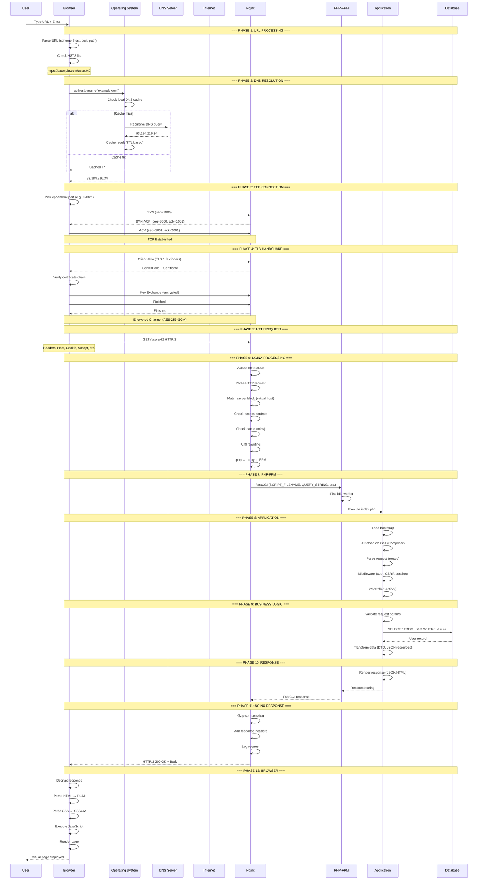
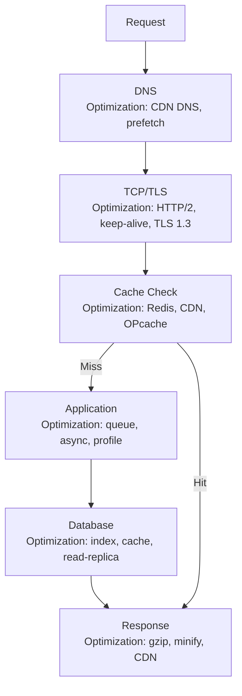

# Chapter 10: Full Request Lifecycle

## Learning Objectives

By the end of this chapter you will:
- Understand every step of a web request from browser to server and back
- Trace the full path of data through all system layers
- Know where performance bottlenecks occur
- Be able to diagnose and fix request issues

---

## 10.1 Beginner Level — The Big Picture

Imagine you're ordering a package online:

1. **You type the store's address** (type a URL) — your browser needs to find where that store is
2. **You ask for directions** (DNS lookup) — your browser asks "where is this website?"
3. **You walk to the store** (TCP connection) — your browser opens a connection to the server
4. **You show your ID** (TLS handshake) — for secure sites, you verify it's really the right store
5. **You place your order** (HTTP request) — your browser says "give me this page"
6. **The store gets your order** (Nginx receives it)
7. **The kitchen starts cooking** (PHP-FPM processes it)
8. **The chef checks the recipe** (application code runs)
9. **The chef checks the pantry** (database query)
10. **Your order is ready** (response built)
11. **The package is delivered** (response sent back)
12. **You open the box** (browser renders the page)

This whole process happens in under a second for most websites. Let's look at each step in detail.

### Real-World Analogy

The full request lifecycle is exactly like ordering pizza:
- **DNS** = Looking up the pizza place's phone number
- **TCP handshake** = Calling and hearing "hello?"
- **TLS handshake** = Asking "are you really Domino's?" and seeing their uniform
- **HTTP request** = "I'd like one large pepperoni"
- **Nginx** = The person at the counter taking your order
- **PHP-FPM** = The kitchen staff preparing it
- **Application code** = The recipe book
- **Database** = The pantry (cheese, sauce, dough)
- **Response** = The pizza delivered to your door
- **Browser rendering** = You opening the box and enjoying it

## 10.2 The Complete Journey

When a user types `https://example.com/users/42` and presses Enter, here is exactly what happens:



---

## 10.3 Timeline View

```mermaid
gantt
    title Full Request Timeline
    dateFormat  X
    axisFormat %s

    section DNS
    DNS Lookup           : 0, 20
    section TCP
    TCP Handshake        : 20, 45
    section TLS
    TLS Handshake        : 45, 85
    section HTTP Request
    Send Request         : 85, 90
    Nginx Processing     : 90, 95
    section PHP
    PHP Bootstrap        : 95, 105
    Routing              : 105, 110
    Controller           : 110, 115
    Database Query       : 115, 145
    Response Build       : 145, 155
    section Network
    Response Transfer    : 155, 220
    section Browser
    DOM Parsing          : 220, 260
    Render               : 260, 290
    Paint                : 290, 310
```



### Where Time Goes

| Step | Typical Time | Percentage | Bottleneck |
|------|-------------|------------|------------|
| DNS | 10-50ms | 3% | DNS provider |
| TCP + TLS | 30-100ms | 10% | Network latency |
| Request transfer | 5-50ms | 5% | Upload speed |
| Nginx processing | 1-5ms | <1% | — |
| PHP execution | 50-500ms | 40% | Application code |
| Database queries | 10-200ms | 30% | Query optimization |
| Response transfer | 10-100ms | 10% | Download speed |
| Browser rendering | 20-100ms | 10% | Asset optimization |

---

## 10.4 Optimization Points



---

## 10.5 Debugging the Request Lifecycle

```php
<?php
/**
 * Request Lifecycle Debugger
 * Add to your application bootstrap to trace requests
 */

class RequestTracer
{
    private array $events = [];
    private float $startTime;

    public function __construct()
    {
        $this->startTime = hrtime(true);
        $this->mark('bootstrap');
    }

    public function mark(string $event): void
    {
        $this->events[] = [
            'event' => $event,
            'time' => hrtime(true),
            'memory' => memory_get_usage(true),
        ];
    }

    public function getReport(): array
    {
        $report = [];
        $previous = $this->startTime;

        foreach ($this->events as $event) {
            $elapsed = ($event['time'] - $previous) / 1e6; // ms
            $report[] = [
                'event' => $event['event'],
                'duration_ms' => round($elapsed, 3),
                'memory_bytes' => $event['memory'],
                'memory_mb' => round($event['memory'] / 1024 / 1024, 2),
            ];
            $previous = $event['time'];
        }

        $totalTime = ($this->events[count($this->events) - 1]['time'] - $this->startTime) / 1e6;
        $report[] = ['event' => 'TOTAL', 'duration_ms' => round($totalTime, 3)];

        return $report;
    }
}
```

---

## 10.6 Interview Questions

1. "Describe the complete lifecycle of a PHP request from browser to database and back."
2. "Where are the biggest performance bottlenecks in a typical PHP request?"
3. "How would you profile a slow page load?"
4. "Explain how keep-alive connections improve performance."
5. "What is Time to First Byte (TTFB) and how do you improve it?"

---

## Further Reading

- **Resource:** [High Performance Browser Networking](https://hpbn.co/) by Ilya Grigorik
- **Tool:** Chrome DevTools Performance Tab
- **Tool:** Blackfire.io — PHP profiler

---

*End of Chapter 10. Proceed to Chapter 11: Development Environment Setup.*
