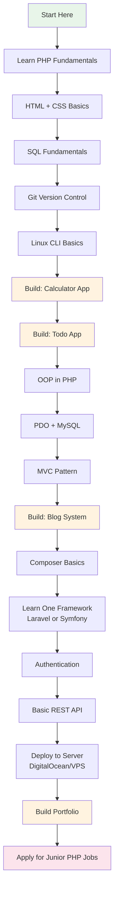
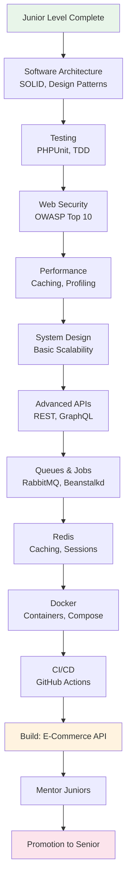
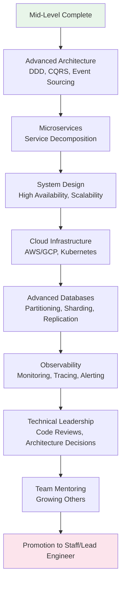
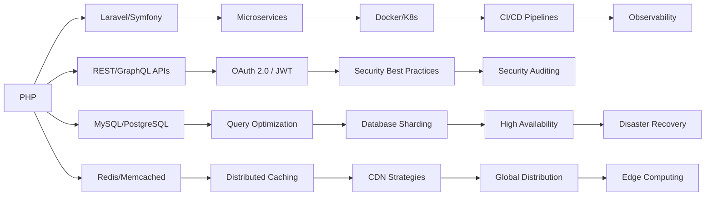
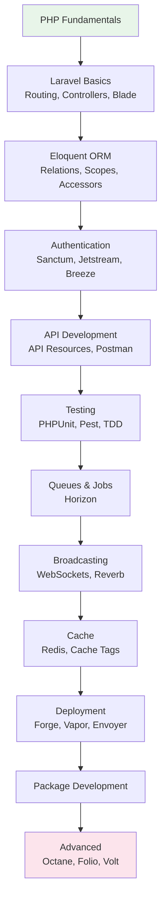
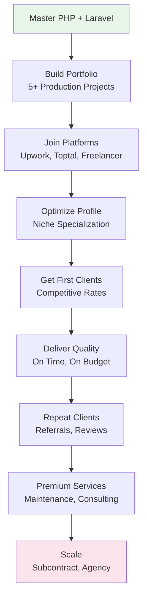

# Chapter 15: Career Roadmaps

## From Junior to Elite PHP Engineer

Complete career roadmaps for every PHP career path.

---

## 15.1 Junior PHP Developer Roadmap (0-2 Years)



### Skills to Master

| Skill | Importance | Resources |
|-------|------------|-----------|
| PHP syntax & basics | Critical | This course Level 1 |
| HTML/CSS | Required | MDN Web Docs |
| SQL (SELECT, JOIN, GROUP BY) | Critical | SQLZoo, this course Ch8 |
| Git (commit, push, pull, branch) | Critical | Git SCM docs |
| Linux basics (cd, ls, grep, chmod) | Required | Linux Journey |
| PDO & prepared statements | Critical | PHP Manual |
| MVC pattern | Critical | This course Ch9 |
| One framework (Laravel preferred) | Critical | Laracasts |
| Composer | Required | getcomposer.org |
| Basic deployment | Required | DigitalOcean tutorials |

### Interview Preparation

```php
<?php
// Common Junior PHP Interview Questions

// 1. FizzBuzz
function fizzBuzz(int $n): void {
    for ($i = 1; $i <= $n; $i++) {
        if ($i % 15 === 0) echo "FizzBuzz\n";
        elseif ($i % 3 === 0) echo "Fizz\n";
        elseif ($i % 5 === 0) echo "Buzz\n";
        else echo "$i\n";
    }
}

// 2. Reverse a string without strrev
function reverseString(string $str): string {
    $reversed = '';
    for ($i = strlen($str) - 1; $i >= 0; $i--) {
        $reversed .= $str[$i];
    }
    return $reversed;
}

// 3. Check if palindrome
function isPalindrome(string $str): bool {
    $str = strtolower(preg_replace('/[^a-z0-9]/', '', $str));
    return $str === strrev($str);
}

// 4. Find max in array
function findMax(array $arr): int {
    $max = $arr[0];
    foreach ($arr as $value) {
        if ($value > $max) $max = $value;
    }
    return $max;
}

// 5. Simple CRUD with PDO
class SimpleCrud {
    private PDO $db;
    
    public function __construct(PDO $db) {
        $this->db = $db;
    }
    
    public function create(string $table, array $data): int {
        $columns = implode(', ', array_keys($data));
        $placeholders = ':' . implode(', :', array_keys($data));
        
        $stmt = $this->db->prepare(
            "INSERT INTO {$table} ({$columns}) VALUES ({$placeholders})"
        );
        $stmt->execute($data);
        return (int)$this->db->lastInsertId();
    }
    
    public function read(string $table, int $id): ?array {
        $stmt = $this->db->prepare("SELECT * FROM {$table} WHERE id = ?");
        $stmt->execute([$id]);
        $result = $stmt->fetch(PDO::FETCH_ASSOC);
        return $result ?: null;
    }
}
```

### Sample Junior Resume Bullet Points

- Built and deployed 5+ PHP applications using MVC architecture
- Developed RESTful APIs with proper HTTP semantics and error handling
- Implemented user authentication with password hashing and session management
- Used Git for version control in team environments
- Wrote SQL queries with JOINs, subqueries, and proper indexing

---

## 15.2 Mid-Level PHP Developer Roadmap (2-4 Years)



### Skills to Master

| Skill | Importance | Resources |
|-------|------------|-----------|
| SOLID principles | Critical | Clean Architecture book |
| Design patterns | Critical | GoF book, Refactoring.Guru |
| PHPUnit/Pest testing | Critical | PHPUnit docs |
| OWASP security | Critical | OWASP website |
| Caching (Redis/Memcached) | Required | Redis docs |
| Docker & Docker Compose | Required | Docker docs |
| CI/CD pipelines | Required | GitHub Actions docs |
| Performance profiling | Required | Blackfire, Xdebug |
| Message queues | Beneficial | RabbitMQ docs |
| GraphQL basics | Beneficial | graphql-php |

### Mid-Level Technical Interview

```php
<?php
// Mid-Level Interview Questions

// 1. Design Pattern: Singleton + Repository
interface UserRepositoryInterface {
    public function find(int $id): ?User;
    public function save(User $user): int;
    public function delete(int $id): bool;
}

class UserRepository implements UserRepositoryInterface {
    public function __construct(
        private readonly PDO $db
    ) {}
    
    public function find(int $id): ?User {
        $stmt = $this->db->prepare('SELECT * FROM users WHERE id = ?');
        $stmt->execute([$id]);
        $data = $stmt->fetch(PDO::FETCH_ASSOC);
        return $data ? new User($data) : null;
    }
    
    public function save(User $user): int {
        if ($user->id) {
            $stmt = $this->db->prepare(
                'UPDATE users SET name = ?, email = ? WHERE id = ?'
            );
            $stmt->execute([$user->name, $user->email, $user->id]);
            return $user->id;
        }
        
        $stmt = $this->db->prepare(
            'INSERT INTO users (name, email) VALUES (?, ?)'
        );
        $stmt->execute([$user->name, $user->email]);
        return (int)$this->db->lastInsertId();
    }
    
    public function delete(int $id): bool {
        $stmt = $this->db->prepare('DELETE FROM users WHERE id = ?');
        return $stmt->execute([$id]);
    }
}

// 2. Service Layer Pattern
class UserService {
    public function __construct(
        private readonly UserRepositoryInterface $users,
        private readonly EmailService $email,
        private readonly LoggerInterface $logger
    ) {}
    
    public function register(array $data): User {
        // Validate
        $validator = new UserValidator();
        $errors = $validator->validate($data);
        if (!empty($errors)) {
            throw new ValidationException($errors);
        }
        
        // Check unique
        if ($this->users->findByEmail($data['email'])) {
            throw new \RuntimeException('Email already exists');
        }
        
        // Create user
        $user = new User($data);
        $user->passwordHash = password_hash($data['password'], PASSWORD_BCRYPT);
        $id = $this->users->save($user);
        $user->id = $id;
        
        // Send welcome email
        $this->email->sendWelcome($user);
        
        // Log
        $this->logger->info("User registered: {$user->email}");
        
        return $user;
    }
}

// 3. Strategy Pattern: Payment Processing
interface PaymentGateway {
    public function charge(float $amount, array $paymentInfo): TransactionResult;
    public function refund(string $transactionId): bool;
}

class StripeGateway implements PaymentGateway {
    public function charge(float $amount, array $paymentInfo): TransactionResult {
        // Stripe API call
        return new TransactionResult(success: true, transactionId: 'ch_123');
    }
    public function refund(string $transactionId): bool {
        // Stripe refund
        return true;
    }
}

class PayPalGateway implements PaymentGateway {
    public function charge(float $amount, array $paymentInfo): TransactionResult {
        // PayPal API call
        return new TransactionResult(success: true, transactionId: 'PAY-123');
    }
    public function refund(string $transactionId): bool {
        // PayPal refund
        return true;
    }
}

class PaymentService {
    public function __construct(
        private readonly PaymentGateway $gateway
    ) {}
    
    public function processPayment(Order $order, array $paymentInfo): TransactionResult {
        return $this->gateway->charge($order->total, $paymentInfo);
    }
}
```

---

## 15.3 Senior PHP Developer Roadmap (4-7 Years)



---

## 15.4 Staff/Lead Engineer Roadmap (7+ Years)

- Define technical strategy and architecture
- Lead cross-team technical initiatives
- Design systems serving millions of users
- Influence company-wide technical decisions
- Champion engineering excellence
- Drive technical debt reduction
- Contribute to open source
- Speak at conferences
- Write technical articles and books

---

## 15.5 Backend Engineer Roadmap



---

## 15.6 Laravel Developer Roadmap



### Laravel-specific Skills

| Skill | Package/Tool |
|-------|-------------|
| Authentication | Laravel Breeze, Jetstream, Sanctum |
| API tokens | Sanctum |
| Admin panels | Filament, Nova |
| Testing | Pest, Dusk |
| Queues | Horizon |
| Monitoring | Telescope |
| Deployment | Forge, Vapor |
| Real-time | Reverb, Echo |
| Performance | Octane, Laravel Debugbar |
| Search | Scout, Meilisearch, Algolia |
| Notifications | Mail, Slack, SMS channels |
| Payment | Cashier (Stripe/Paddle) |

---

## 15.7 Freelance PHP Developer Roadmap



### Freelance Rate Progression

| Level | Hourly Rate | Monthly Project | Skills Required |
|-------|-------------|-----------------|-----------------|
| Beginner | $20-40/hr | $1-3K | Basic Laravel, HTML/CSS |
| Intermediate | $40-80/hr | $3-8K | Custom development, APIs |
| Advanced | $80-150/hr | $8-20K | Architecture, complex systems |
| Expert | $150-300+/hr | $20-50K+ | Consulting, team lead, niche |

### Freelance Tech Stack Recommendations

```text
Stack 1: CMS Website ($2-5K)
- Laravel + Filament Admin
- MySQL + Redis
- Deployed on Forge + DigitalOcean
- Time: 2-4 weeks

Stack 2: SaaS Application ($10-30K)
- Laravel + Jetstream + Filament
- PostgreSQL + Redis
- Stripe integration (Cashier)
- Queue with Horizon
- Deployed on Vapor (AWS)
- Testing with Pest
- Time: 2-3 months

Stack 3: Enterprise Solution ($30-100K+)
- Laravel + Octane
- PostgreSQL + Redis Cluster
- Microservices architecture
- Docker + Kubernetes
- CI/CD with GitHub Actions
- Full test suite
- Time: 3-6+ months
```

---

## 15.8 Interview Preparation by Level

### Junior Interview Topics

| Topic | Questions | Time to Prepare |
|-------|-----------|-----------------|
| PHP basics | Variables, types, control flow, functions | 1 week |
| OOP | Classes, inheritance, interfaces | 1 week |
| PDO | Prepared statements, CRUD | 3 days |
| SQL | SELECT, JOIN, GROUP BY | 1 week |
| Git | Branch, merge, conflict resolution | 2 days |
| HTML/CSS | Basic markup, responsive design | 1 week |
| Problem solving | FizzBuzz, reverse string, palindrome | 1 week |

### Mid-Level Interview Topics

| Topic | Questions | Time to Prepare |
|-------|-----------|-----------------|
| Design patterns | Singleton, Factory, Repository | 2 weeks |
| SOLID principles | Each principle with examples | 1 week |
| Security | XSS, CSRF, SQL injection, auth | 2 weeks |
| Performance | Caching, indexing, profiling | 1 week |
| Testing | Unit, integration, mocking | 2 weeks |
| System design | URL shortener, rate limiter | 2 weeks |
| API design | REST, versioning, pagination | 1 week |

### Senior Interview Topics

| Topic | Questions | Time to Prepare |
|-------|-----------|-----------------|
| Architecture | DDD, CQRS, Event Sourcing | 3 weeks |
| Microservices | Decomposition, communication | 2 weeks |
| System design | Design Instagram, Twitter, Uber | 4 weeks |
| Database | Sharding, replication, CAP theorem | 2 weeks |
| Cloud | AWS/GCP services, auto-scaling | 3 weeks |
| Leadership | Conflict resolution, mentoring | Ongoing |
| Estimation | Project planning, sprint planning | 2 weeks |

---

## 15.9 Continuous Learning Resources

### Books by Level

**Junior:**
- "PHP & MySQL: Novice to Ninja" — Kevin Yank
- "PHP Solutions" — David Powers
- "Learning PHP, MySQL & JavaScript" — Robin Nixon

**Mid-Level:**
- "PHP Objects, Patterns, and Practice" — Matt Zandstra
- "Clean Code" — Robert C. Martin
- "Refactoring" — Martin Fowler

**Senior:**
- "Clean Architecture" — Robert C. Martin
- "Domain-Driven Design" — Eric Evans
- "Designing Data-Intensive Applications" — Martin Kleppmann

**Staff/Architect:**
- "Building Microservices" — Sam Newman
- "System Design Interview" — Alex Xu
- "The Staff Engineer's Path" — Tanya Reilly

### Online Resources

| Resource | Level | Focus |
|----------|-------|-------|
| Laracasts | All | Laravel, PHP, Testing |
| PHP The Right Way | All | PHP best practices |
| PHP FIG | Senior | PSR standards |
| OWASP | All | Security |
| Refactoring Guru | Mid | Design patterns |
| System Design Primer | Senior | Architecture |
| High Scalability | Staff | System architecture |
| Martin Fowler's Blog | Staff | Software design |

### Practice Platforms

| Platform | Focus | Level |
|----------|-------|-------|
| LeetCode | Algorithms | Mid-Senior |
| exercism | PHP exercises | Junior-Mid |
| Codewars | Coding challenges | All |
| HackerRank | SQL, algorithms | Junior-Senior |
| Laracasts Challenges | Laravel | All |
| GitHub | Open source | Mid-Staff |

---

## 15.10 Final Words of Wisdom

### On Learning

> "The expert in anything was once a beginner." — Helen Hayes

> "PHP is a minor player in the enterprise, senior engineer." — Rasmus Lerdorf (creator of PHP)

> "It's not the language that makes you a good developer. It's the person." — Taylor Otwell (creator of Laravel)

### On Career Growth

1. **Build things.** Theory without practice is worthless. Every day, write code.
2. **Read code.** Study open source projects. Laravel, Symfony, PHPUnit source code.
3. **Teach others.** The best way to master something is to teach it.
4. **Contribute to open source.** Start with documentation, then tests, then code.
5. **Build your network.** Attend meetups, conferences, join online communities.
6. **Stay current.** PHP evolves rapidly. Keep learning, keep adapting.
7. **Understand the business.** Code exists to solve business problems. Understanding the business makes you invaluable.
8. **Write it down.** Document your architecture decisions, keep a technical blog.
9. **Be humble.** There's always someone better. Learn from everyone.
10. **Never stop learning.** The day you think you know everything is the day you become obsolete.

### The Path Forward

You have completed **Level 0: Foundations**. You now understand:
- ✅ How computers work (CPU, memory, storage)
- ✅ How operating systems manage processes and resources
- ✅ How networks and the Internet connect the world
- ✅ How browsers render web pages
- ✅ How servers process PHP requests
- ✅ How HTTP enables web communication
- ✅ How databases store and retrieve data
- ✅ How web applications are architected
- ✅ How to set up a development environment
- ✅ What tools you need to be productive
- ✅ Career paths and how to prepare for them

You are now ready for **Level 1: PHP Fundamentals** — where you will write your first PHP code and build your first web application.

---

## Ready for Level 1?

Level 1 will cover:
- PHP installation and configuration
- Syntax, variables, and data types
- Operators and expressions
- Control flow (if, else, switch, loops)
- Functions and scope
- Arrays (indexed, associative, multidimensional)
- String manipulation
- Built-in functions
- Error handling basics
- Forms and user input
- And much more...

**Proceed to Level 1 when you're ready.**

---

*End of Level 0 — Foundations of Web Development and PHP.*
