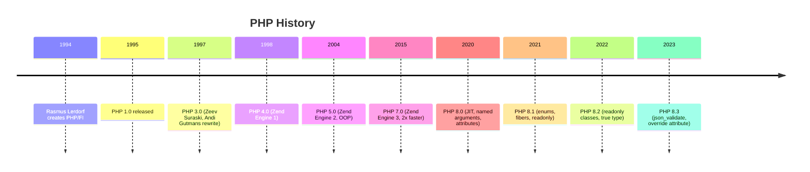
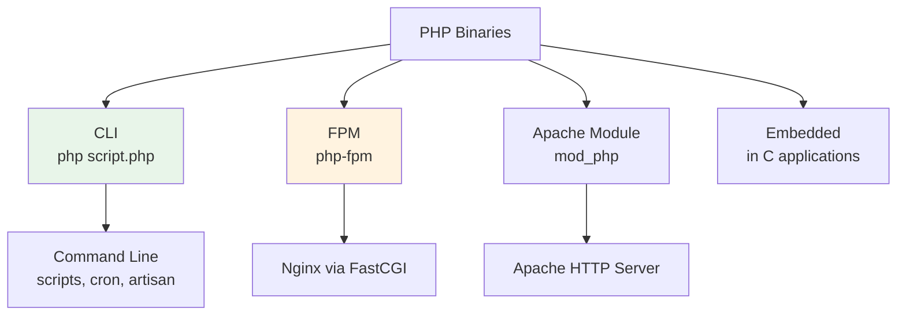
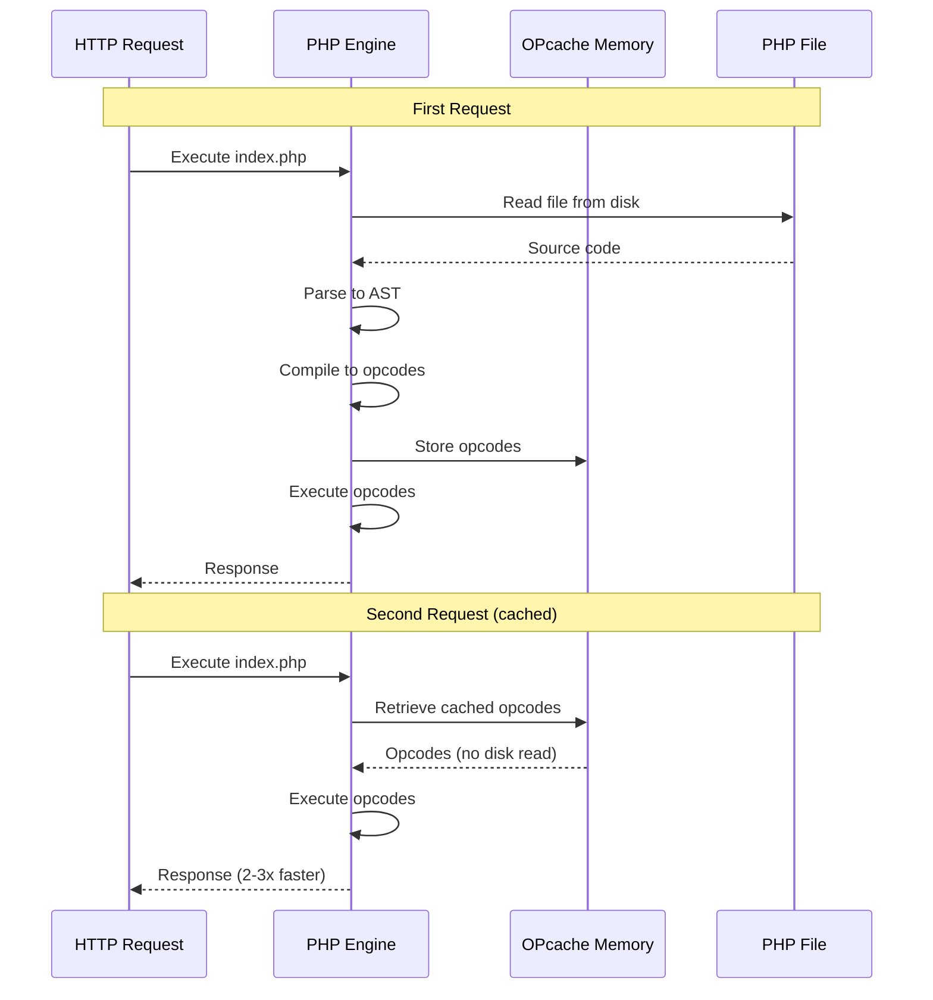

# Chapter 1: PHP Installation and Configuration

## Learning Objectives

- Install PHP on Linux, macOS, and Windows
- Understand the PHP CLI vs web SAPI
- Configure php.ini for development and production
- Enable and manage PHP extensions
- Understand OPcache and its configuration
- Verify your PHP installation

---

## 1.1 What is PHP?


PHP (PHP: Hypertext Preprocessor) is a server-side scripting language designed for web development. Created by Rasmus Lerdorf in 1994, PHP now powers over 75% of all websites with a known server-side language, including Facebook, Wikipedia, Slack, and WordPress.

### Historical Background



### Why PHP?

| Feature | Benefit |
|---------|---------|
| Easy to learn | Gentle learning curve |
| Widely used | 75%+ of websites, massive ecosystem |
| Fast execution | PHP 8.x with JIT is competitive |
| Rich ecosystem | Composer, Laravel, Symfony |
| Great for web | Designed for HTTP, databases, HTML |
| Low cost | Free, runs on cheap hosting |
| Huge community | Stack Overflow, Reddit, conferences |

---

## 1.2 Installing PHP

### Linux (Ubuntu/Debian)

```bash
# Latest PHP 8.x from ondrej/php PPA
sudo add-apt-repository ppa:ondrej/php -y
sudo apt update

# Install PHP 8.3 CLI and common extensions
sudo apt install php8.3-cli php8.3-common php8.3-mysql \
    php8.3-xml php8.3-mbstring php8.3-curl php8.3-gd \
    php8.3-zip php8.3-bcmath php8.3-intl php8.3-xdebug

# Verify
php -v
# Output: PHP 8.3.x (cli) (built: ...)
```

### macOS

```bash
# Using Homebrew
brew install php

# Or using Laravel Herd (recommended for beginners)
# Download from https://herd.laravel.com

# Verify
php -v
```

### Windows

```bash
# 1. Download PHP from https://windows.php.net/download/
# 2. Extract to C:\php
# 3. Add C:\php to system PATH
# 4. Rename php.ini-development to php.ini

# Verify in Command Prompt
php -v
```

### Docker (Any Platform)

```bash
# Quick test with Docker
docker run --rm -v "$PWD":/app -w /app php:8.3-cli php script.php

# Docker Compose for development
cat > docker-compose.yml << 'EOF'
version: '3.8'
services:
  php:
    image: php:8.3-fpm
    volumes:
      - .:/var/www
    working_dir: /var/www
EOF
```

---

## 1.3 PHP CLI vs Web SAPI

PHP has multiple SAPI (Server API) modes:



```bash
# CLI mode (for scripts, cron, debugging)
php script.php
php -r "echo 'Hello World';"
php -a  # Interactive shell (similar to node/python repl)

# Built-in web server (for development only!)
php -S localhost:8000

# Check which SAPI is active
php -i | grep "Server API"
# CLI:   Server API => Command Line Interface
# FPM:   Server API => FPM/FastCGI
# Apache: Server API => Apache 2.0 Handler
```

### The Built-in Web Server

PHP has a built-in development server (never use in production):

```bash
# Start server on port 8000
php -S localhost:8000

# With document root
php -S localhost:8000 -t public/

# With router script
php -S localhost:8000 router.php
```

```php
<?php
// router.php - Custom router for built-in server
$uri = parse_url($_SERVER['REQUEST_URI'], PHP_URL_PATH);

// Serve static files directly
if (file_exists(__DIR__ . '/public' . $uri)) {
    return false;
}

// Route all other requests to index.php
$_SERVER['SCRIPT_NAME'] = '/index.php';
require __DIR__ . '/public/index.php';
```

---

## 1.4 PHP Configuration (php.ini)

### Location

```bash
# Find which php.ini is loaded
php --ini
# Output:
# Configuration File (php.ini) Path: /etc/php/8.3/cli
# Loaded Configuration File:         /etc/php/8.3/cli/php.ini

# Different SAPIs have different php.ini files
/etc/php/8.3/
├── cli/
│   └── php.ini           # CLI configuration
├── fpm/
│   └── php.ini           # FPM configuration
└── mods-available/       # Extension configuration
```

### Essential Directives

```ini
; php.ini development settings
[PHP]

; Error reporting (show everything in development)
error_reporting = E_ALL
display_errors = On
display_startup_errors = On
log_errors = On
error_log = /var/log/php_errors.log

; Resource limits
memory_limit = 256M
max_execution_time = 30
max_input_time = 60
max_input_vars = 2000

; File uploads
file_uploads = On
upload_max_filesize = 64M
post_max_size = 64M
max_file_uploads = 20

; Timezone
date.timezone = UTC

; Sessions
session.save_handler = files
session.save_path = "/tmp"
session.use_strict_mode = 1
session.use_only_cookies = 1
session.cookie_httponly = 1
session.cookie_samesite = "Lax"

; OPcache
opcache.enable = 1
opcache.memory_consumption = 256
opcache.interned_strings_buffer = 16
opcache.max_accelerated_files = 20000
opcache.revalidate_freq = 2
```

### Production vs Development Settings

| Directive | Development | Production |
|-----------|-------------|------------|
| display_errors | On | Off |
| error_reporting | E_ALL | E_ALL & ~E_DEPRECATED & ~E_STRICT |
| opcache.enable | 1 | 1 |
| opcache.revalidate_freq | 2 | 60 |
| memory_limit | 256M | 128M-512M |

---

## 1.5 PHP Extensions

### Common Extensions

```bash
# List all loaded extensions
php -m

# Check if specific extension is loaded
php -m | grep pdo

# Install extensions (Ubuntu)
sudo apt install php8.3-{mysql,xml,mbstring,curl,gd,zip,bcmath,intl,redis,xdebug}

# Enable/disable extensions
phpenmod pdo_mysql    # Enable
phpdismod pdo_mysql   # Disable
```

### Extension Categories

```php
<?php
// Database
extension_loaded('pdo')      // Database abstraction
extension_loaded('pdo_mysql') // MySQL driver
extension_loaded('pdo_pgsql') // PostgreSQL driver
extension_loaded('redis')     // Redis support

// Web
extension_loaded('curl')      // HTTP requests
extension_loaded('mbstring')  // Multibyte strings
extension_loaded('xml')       // XML parsing

// Image
extension_loaded('gd')        // Image manipulation
extension_loaded('imagick')   // ImageMagick

// Security
extension_loaded('sodium')    // Modern encryption
extension_loaded('openssl')   // SSL/TLS

// Performance
extension_loaded('opcache')   // Opcode cache
extension_loaded('apcu')      // User cache
```

---

## 1.6 OPcache

### How OPcache Works



### OPcache Configuration

```ini
; php.ini OPcache settings
[opcache]
opcache.enable = 1                    ; Enable OPcache
opcache.memory_consumption = 256      ; Shared memory size (MB)
opcache.interned_strings_buffer = 16  ; String cache (MB)
opcache.max_accelerated_files = 20000 ; Max PHP files to cache
opcache.revalidate_freq = 2           ; Check file changes (seconds)
opcache.validate_timestamps = 1       ; Check file timestamps
opcache.max_wasted_percentage = 5     ; Max wasted memory
opcache.enable_cli = 1                ; Enable for CLI scripts
```

---

## 1.7 Verifying Installation

### The phpinfo() Function

```php
<?php
// Save as info.php, run: php info.php
phpinfo();
// Displays: PHP version, extensions, configuration, environment
```

### Writing Your First PHP Script

```php
<?php
// hello.php
echo "Hello, World!" . PHP_EOL;
echo "PHP Version: " . PHP_VERSION . PHP_EOL;
echo "Loaded ini: " . php_ini_loaded_file() . PHP_EOL;
echo "Extensions: " . implode(', ', get_loaded_extensions()) . PHP_EOL;
```

```bash
# Run it
php hello.php
# Output:
# Hello, World!
# PHP Version: 8.3.0
# Loaded ini: /etc/php/8.3/cli/php.ini
# Extensions: Core, date, libxml, openssl, pcre, ...
```

---

## 1.8 Common Installation Issues

| Problem | Cause | Solution |
|---------|-------|----------|
| `php: command not found` | PHP not in PATH | Add PHP bin directory to PATH |
| `Unable to load dynamic library` | Extension not compiled | Install extension package |
| `Call to undefined function` | Extension not enabled | Enable extension in php.ini |
| `Connection refused` | FPM not running | `sudo systemctl start php8.3-fpm` |
| `No input file specified` | Wrong SCRIPT_FILENAME | Fix Nginx fastcgi_param |

---

## 1.9 Exercises

1. Install PHP and verify with `php -v`
2. Find your loaded php.ini file location
3. Create a phpinfo() page and identify 5 key settings
4. Enable mbstring extension and verify
5. Run the built-in PHP server and access a PHP file in the browser
6. Write a script that displays all loaded extensions
7. Configure OPcache and verify it's enabled
8. Install Xdebug and verify it's loaded

---

## 1.10 Interview Questions

1. "What's the difference between PHP CLI and PHP-FPM?"
2. "How does OPcache improve PHP performance?"
3. "How would you find which php.ini file is loaded?"
4. "What are PHP extensions and how do you manage them?"
5. "How do you enable error reporting for development vs production?"

---

## Further Reading

- **Doc:** [PHP Installation Manual](https://www.php.net/manual/en/install.php)
- **Doc:** [PHP OPcache Documentation](https://www.php.net/manual/en/book.opcache.php)
- **Doc:** [PHP.ini Configuration](https://www.php.net/manual/en/ini.list.php)
- **Article:** [PHP The Right Way - Getting Started](https://phptherightway.com/#getting_started)
