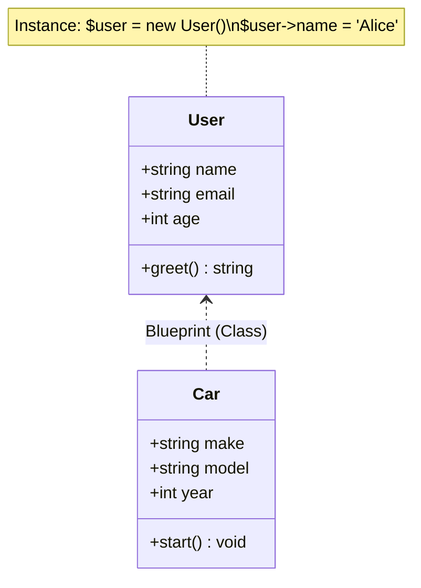
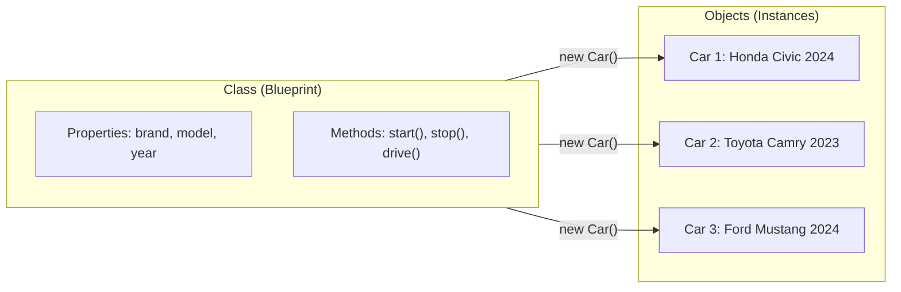

# Chapter 1: OOP Fundamentals

## Learning Objectives

- Understand classes vs objects
- Define properties and methods
- Create object instances
- Use $this keyword
- Understand object references

---



## 1.1 Classes and Objects

```php
<?php
// Class definition (blueprint)
class User
{
    // Properties (attributes)
    public string $name;
    public string $email;
    public int $age;
    
    // Methods (behavior)
    public function greet(): string
    {
        return "Hello, my name is {$this->name}";
    }
    
    public function isAdult(): bool
    {
        return $this->age >= 18;
    }
}

// Object (instance)
$user = new User();
$user->name = 'Alice';
$user->email = 'alice@example.com';
$user->age = 30;

echo $user->greet();  // "Hello, my name is Alice"
echo $user->isAdult() ? 'Adult' : 'Minor';  // "Adult"
```

---

## 1.2 Classes vs Objects Analogy



---

## 1.3 $this Keyword

```php
<?php
class Counter
{
    public int $count = 0;
    
    public function increment(): void
    {
        $this->count++;  // $this refers to current instance
    }
    
    public function getCount(): int
    {
        return $this->count;
    }
}

$a = new Counter();
$b = new Counter();

$a->increment();
$a->increment();
$b->increment();

echo $a->getCount();  // 2
echo $b->getCount();  // 1
```

---

## 1.4 Object References

```php
<?php
// Objects are assigned by reference (not copied)
$a = new User();
$a->name = 'Alice';

$b = $a;        // $b refers to the SAME object
$b->name = 'Bob';

echo $a->name;  // "Bob" (changed!)
echo $b->name;  // "Bob"

// To clone:
$c = clone $a;
$c->name = 'Charlie';

echo $a->name;  // "Bob" (unchanged)
echo $c->name;  // "Charlie"
```

---

## 1.5 Exercises

1. Create a Product class with name, price, and quantity properties
2. Add a method to calculate total value (price × quantity)
3. Create multiple product instances and calculate total inventory value
4. Demonstrate that objects are references, not values
5. Build a BankAccount class with deposit, withdraw, and getBalance methods

---

## Further Reading

- **Doc:** [PHP OOP Basics](https://www.php.net/manual/en/language.oop5.basic.php)
- **Doc:** [Classes and Objects](https://www.php.net/manual/en/language.oop5.php)
