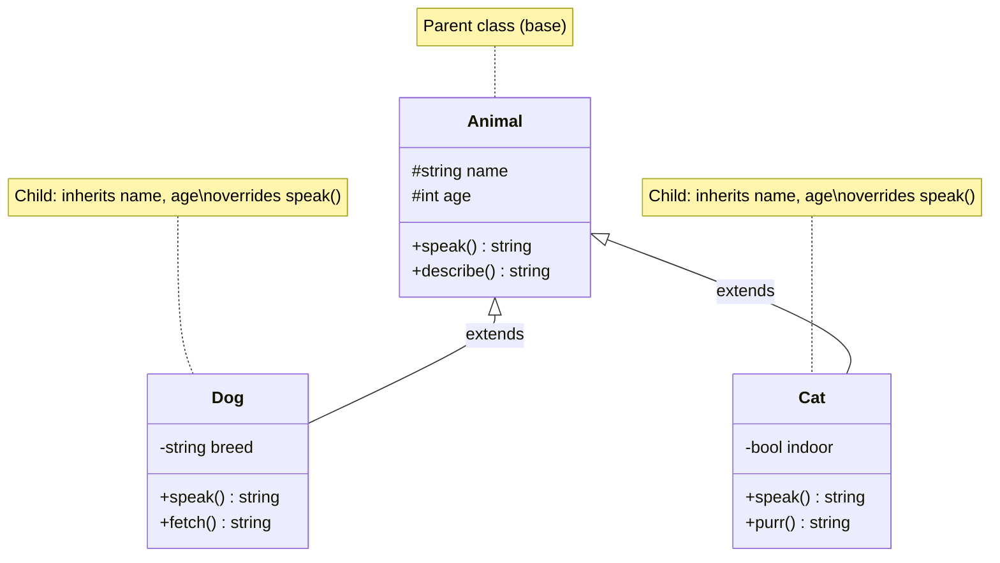

# Chapter 3: Inheritance

## Learning Objectives

- Implement class inheritance in PHP
- Use `parent::` to call parent methods
- Understand `final` and `abstract` keywords
- Apply method overriding correctly

---



## 3.1 Basic Inheritance

```php
<?php
class Animal
{
    public function __construct(
        protected string $name,
        protected int $age
    ) {}

    public function speak(): string
    {
        return "{$this->name} makes a sound";
    }

    public function describe(): string
    {
        return "{$this->name} is {$this->age} years old";
    }
}

class Dog extends Animal
{
    public function speak(): string
    {
        return "{$this->name} barks! Woof!";
    }

    public function fetch(): string
    {
        return "{$this->name} fetches the ball";
    }
}

class Cat extends Animal
{
    public function speak(): string
    {
        return "{$this->name} meows";
    }
}

$dog = new Dog('Buddy', 3);
echo $dog->speak();    // Buddy barks! Woof!
echo $dog->fetch();    // Buddy fetches the ball
echo $dog->describe(); // Buddy is 3 years old
```

---

## 3.2 `parent::` Keyword

```php
<?php
class DatabaseConnection
{
    public function __construct(
        protected string $host,
        protected string $username,
        protected string $password
    ) {}

    public function connect(): string
    {
        return "Connected to {$this->host}";
    }

    protected function log(string $message): void
    {
        echo "[DB] {$message}\n";
    }
}

class MySQLConnection extends DatabaseConnection
{
    private string $database;

    public function __construct(
        string $host,
        string $username,
        string $password,
        string $database
    ) {
        parent::__construct($host, $username, $password);
        $this->database = $database;
    }

    public function connect(): string
    {
        $this->log("Attempting MySQL connection");
        $result = parent::connect();
        $this->log("Selected database: {$this->database}");
        return $result . ", database: {$this->database}";
    }

    public function query(string $sql): string
    {
        return "Executing: {$sql}";
    }
}
```

---

## 3.3 `abstract` Classes and Methods

```php
<?php
abstract class Shape
{
    protected string $color;

    public function __construct(string $color)
    {
        $this->color = $color;
    }

    // Must be implemented by child classes
    abstract public function area(): float;

    // Concrete method available to all children
    public function describe(): string
    {
        return "A {$this->color} shape with area {$this->area()}";
    }
}

class Circle extends Shape
{
    public function __construct(
        string $color,
        private float $radius
    ) {
        parent::__construct($color);
    }

    public function area(): float
    {
        return pi() * $this->radius ** 2;
    }
}

class Rectangle extends Shape
{
    public function __construct(
        string $color,
        private float $width,
        private float $height
    ) {
        parent::__construct($color);
    }

    public function area(): float
    {
        return $this->width * $this->height;
    }
}
```

---

## 3.4 `final` Keyword

```php
<?php
final class SecurityManager
{
    // This class cannot be extended
    public function encrypt(string $data): string
    {
        return hash('sha256', $data);
    }
}

// ❌ Fatal error: Cannot extend final class
// class CustomSecurity extends SecurityManager {}

class ParentClass
{
    // This method cannot be overridden
    final public function criticalLogic(): string
    {
        return 'Critical business logic';
    }
}

class ChildClass extends ParentClass
{
    // ❌ Fatal error: Cannot override final method
    // public function criticalLogic(): string {}
}
```

---

## 3.5 Exercises

1. Create a `Vehicle` base class with `start()`, `stop()`, and `fuelType()` methods
2. Extend it with `Car`, `Motorcycle`, and `Truck` classes
3. Create an abstract `PaymentGateway` with `charge()` and `refund()` methods
4. Implement `StripeGateway` and `PayPalGateway`
5. Mark a critical `authenticate()` method as `final`

---

## Further Reading

- **Doc:** [PHP Inheritance](https://www.php.net/manual/en/language.oop5.inheritance.php)
- **Doc:** [PHP Abstract Classes](https://www.php.net/manual/en/language.oop5.abstract.php)
- **Doc:** [PHP Final Keyword](https://www.php.net/manual/en/language.oop5.final.php)
