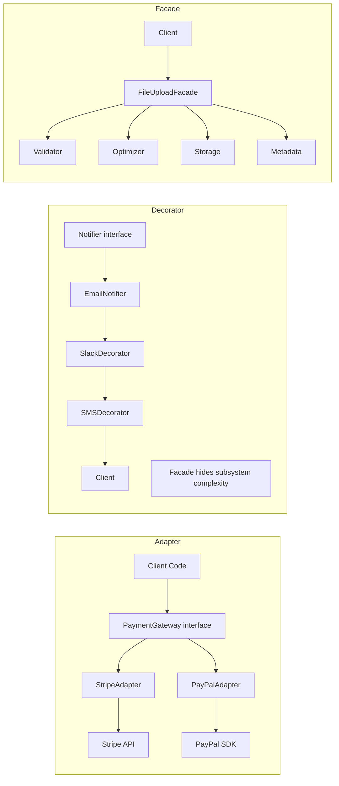

# Chapter 7: Design Patterns — Structural

## Learning Objectives

- Implement Adapter, Decorator, Facade, and Proxy patterns
- Apply structural patterns to real PHP code

---



## 7.1 Adapter Pattern

```php
<?php
// Third-party payment library (incompatible interface)
class ThirdPartyPaymentGateway
{
    public function sendPayment(float $amount, string $currency, string $cardToken): array
    {
        // Sends payment via third-party API
        return ['transaction_id' => 'txn_123', 'status' => 'success'];
    }
}

// Our application's expected interface
interface PaymentGateway
{
    public function charge(int $amountInCents, array $paymentDetails): PaymentResult;
}

class PaymentResult
{
    public function __construct(
        public readonly string $transactionId,
        public readonly bool $success
    ) {}
}

// Adapter makes the incompatible interface compatible
class PaymentGatewayAdapter implements PaymentGateway
{
    public function __construct(
        private ThirdPartyPaymentGateway $gateway
    ) {}

    public function charge(int $amountInCents, array $paymentDetails): PaymentResult
    {
        $amountInDollars = $amountInCents / 100;
        $response = $this->gateway->sendPayment(
            $amountInDollars,
            $paymentDetails['currency'],
            $paymentDetails['card_token']
        );

        return new PaymentResult(
            transactionId: $response['transaction_id'],
            success: $response['status'] === 'success'
        );
    }
}

// Usage
$adapter = new PaymentGatewayAdapter(new ThirdPartyPaymentGateway());
$result = $adapter->charge(2000, [
    'currency' => 'USD',
    'card_token' => 'tok_visa_4242',
]);
```

---

## 7.2 Decorator Pattern

```php
<?php
interface Coffee
{
    public function cost(): float;
    public function description(): string;
}

class SimpleCoffee implements Coffee
{
    public function cost(): float
    {
        return 3.0;
    }

    public function description(): string
    {
        return 'Simple coffee';
    }
}

abstract class CoffeeDecorator implements Coffee
{
    public function __construct(
        protected Coffee $coffee
    ) {}
}

class MilkDecorator extends CoffeeDecorator
{
    public function cost(): float
    {
        return $this->coffee->cost() + 0.5;
    }

    public function description(): string
    {
        return $this->coffee->description() . ', with milk';
    }
}

class WhippedCreamDecorator extends CoffeeDecorator
{
    public function cost(): float
    {
        return $this->coffee->cost() + 0.75;
    }

    public function description(): string
    {
        return $this->coffee->description() . ', with whipped cream';
    }
}

$coffee = new SimpleCoffee();
$coffee = new MilkDecorator($coffee);
$coffee = new WhippedCreamDecorator($coffee);

echo $coffee->description(); // Simple coffee, with milk, with whipped cream
echo $coffee->cost();        // 4.25
```

---

## 7.3 Facade Pattern

```php
<?php
class FileValidator
{
    public function validate(array $file): void
    {
        if ($file['size'] > 10_000_000) {
            throw new \Exception('File too large');
        }
    }
}

class FileOptimizer
{
    public function optimize(string $path): void
    {
        // Compress, resize, etc.
    }
}

class FileStorage
{
    public function store(string $path, string $destination): string
    {
        return "https://cdn.example.com/{$destination}";
    }
}

class FileMetadata
{
    public function save(array $metadata, string $url): void
    {
        // Save to database
    }
}

// Facade
class FileUploadFacade
{
    public function __construct(
        private FileValidator $validator,
        private FileOptimizer $optimizer,
        private FileStorage $storage,
        private FileMetadata $metadata
    ) {}

    public function upload(array $file, string $path): string
    {
        $this->validator->validate($file);
        move_uploaded_file($file['tmp_name'], $path);
        $this->optimizer->optimize($path);
        $url = $this->storage->store($path, basename($path));
        $this->metadata->save([
            'name' => $file['name'],
            'size' => $file['size'],
            'type' => $file['type'],
        ], $url);

        return $url;
    }
}

$facade = new FileUploadFacade(
    new FileValidator(),
    new FileOptimizer(),
    new FileStorage(),
    new FileMetadata()
);
$url = $facade->upload($_FILES['avatar'], '/tmp/avatar.jpg');
```

---

## 7.4 Exercises

1. Create an adapter for sending emails via different providers
2. Implement a decorator for HTTP clients that adds logging and retry logic
3. Build a facade for a complex video processing pipeline
4. Create a proxy that caches database query results

---

## Further Reading

- **Resource:** [Refactoring Guru — Structural Patterns](https://refactoring.guru/design-patterns/structural-patterns)
