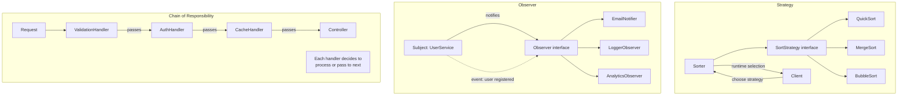

# Chapter 8: Design Patterns — Behavioral

## Learning Objectives

- Implement Strategy, Observer, Chain of Responsibility, and Command patterns
- Apply behavioral patterns to common PHP problems

---



## 8.1 Strategy Pattern

```php
<?php
interface SortStrategy
{
    public function sort(array $data): array;
}

class BubbleSort implements SortStrategy
{
    public function sort(array $data): array
    {
        $n = count($data);
        for ($i = 0; $i < $n - 1; $i++) {
            for ($j = 0; $j < $n - $i - 1; $j++) {
                if ($data[$j] > $data[$j + 1]) {
                    [$data[$j], $data[$j + 1]] = [$data[$j + 1], $data[$j]];
                }
            }
        }
        return $data;
    }
}

class QuickSort implements SortStrategy
{
    public function sort(array $data): array
    {
        if (count($data) < 2) {
            return $data;
        }
        $pivot = $data[0];
        $left = $right = [];
        for ($i = 1; $i < count($data); $i++) {
            if ($data[$i] < $pivot) {
                $left[] = $data[$i];
            } else {
                $right[] = $data[$i];
            }
        }
        return array_merge(
            $this->sort($left),
            [$pivot],
            $this->sort($right)
        );
    }
}

class Sorter
{
    private SortStrategy $strategy;

    public function __construct(?SortStrategy $strategy = null)
    {
        $this->strategy = $strategy ?? new QuickSort();
    }

    public function setStrategy(SortStrategy $strategy): void
    {
        $this->strategy = $strategy;
    }

    public function sort(array $data): array
    {
        return $this->strategy->sort($data);
    }
}

$sorter = new Sorter(new BubbleSort());
$sorted = $sorter->sort([3, 1, 4, 1, 5, 9]);
$sorter->setStrategy(new QuickSort());
$sorted = $sorter->sort([3, 1, 4, 1, 5, 9]);
```

---

## 8.2 Observer Pattern

```php
<?php
interface Observer
{
    public function update(string $event, mixed $data): void;
}

interface Observable
{
    public function attach(Observer $observer): void;
    public function detach(Observer $observer): void;
    public function notify(string $event, mixed $data): void;
}

class UserService implements Observable
{
    private array $observers = [];

    public function attach(Observer $observer): void
    {
        $this->observers[] = $observer;
    }

    public function detach(Observer $observer): void
    {
        $this->observers = array_filter(
            $this->observers,
            fn($o) => $o !== $observer
        );
    }

    public function notify(string $event, mixed $data): void
    {
        foreach ($this->observers as $observer) {
            $observer->update($event, $data);
        }
    }

    public function registerUser(string $email, string $name): void
    {
        // Register user in database...
        $this->notify('user.registered', [
            'email' => $email,
            'name' => $name,
        ]);
    }
}

class EmailNotifier implements Observer
{
    public function update(string $event, mixed $data): void
    {
        if ($event === 'user.registered') {
            echo "Sending welcome email to {$data['email']}\n";
        }
    }
}

class LoggerObserver implements Observer
{
    public function update(string $event, mixed $data): void
    {
        echo "[LOG] Event: {$event}, Data: " . json_encode($data) . "\n";
    }
}

class AnalyticsObserver implements Observer
{
    public function update(string $event, mixed $data): void
    {
        echo "Tracking event: {$event}\n";
    }
}

$service = new UserService();
$service->attach(new EmailNotifier());
$service->attach(new LoggerObserver());
$service->attach(new AnalyticsObserver());
$service->registerUser('user@example.com', 'John');
```

---

## 8.3 Exercises

1. Implement Strategy pattern for different payment calculations (fixed fee, percentage, tiered)
2. Create an Observer system for an order lifecycle (placed, paid, shipped, delivered)
3. Implement Chain of Responsibility for form validation
4. Create a Command pattern for an undo/redo text editor

---

## Further Reading

- **Resource:** [Refactoring Guru — Behavioral Patterns](https://refactoring.guru/design-patterns/behavioral-patterns)
