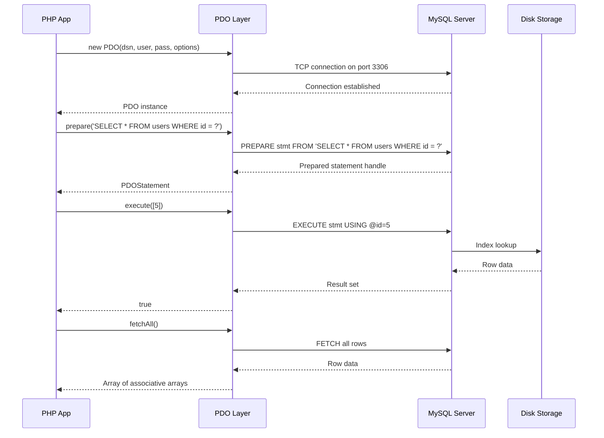
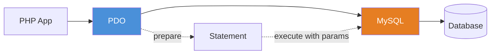

# Chapter 11: Working with Databases (PDO)

## Learning Objectives

- Connect to databases using PDO
- Execute queries safely with prepared statements
- Manage transactions in PHP
- Handle database errors properly

---





## 11.1 PDO Connection

```php
<?php
class DatabaseConnection
{
    private ?PDO $pdo = null;

    public function __construct(
        private readonly string $dsn,
        private readonly string $username,
        private readonly string $password,
        private readonly array $options = []
    ) {}

    public function connect(): PDO
    {
        if ($this->pdo === null) {
            $defaultOptions = [
                PDO::ATTR_ERRMODE => PDO::ERRMODE_EXCEPTION,
                PDO::ATTR_DEFAULT_FETCH_MODE => PDO::FETCH_ASSOC,
                PDO::ATTR_EMULATE_PREPARES => false,
            ];

            $this->pdo = new PDO(
                $this->dsn,
                $this->username,
                $this->password,
                array_merge($defaultOptions, $this->options)
            );
        }

        return $this->pdo;
    }

    public function disconnect(): void
    {
        $this->pdo = null;
    }
}

// Usage
$db = new DatabaseConnection(
    'mysql:host=localhost;dbname=myapp;charset=utf8mb4',
    'root',
    'secret'
);
$pdo = $db->connect();
```

---

## 11.2 Prepared Statements

```php
<?php
class UserRepository
{
    public function __construct(private PDO $pdo) {}

    public function findById(int $id): ?array
    {
        $stmt = $this->pdo->prepare('SELECT * FROM users WHERE id = ?');
        $stmt->execute([$id]);
        $result = $stmt->fetch();
        return $result ?: null;
    }

    public function findByEmail(string $email): ?array
    {
        $stmt = $this->pdo->prepare(
            'SELECT * FROM users WHERE email = :email'
        );
        $stmt->execute(['email' => $email]);
        return $stmt->fetch() ?: null;
    }

    public function create(array $data): int
    {
        $stmt = $this->pdo->prepare(
            'INSERT INTO users (name, email, password) VALUES (:name, :email, :password)'
        );
        $stmt->execute([
            'name' => $data['name'],
            'email' => $data['email'],
            'password' => password_hash($data['password'], PASSWORD_BCRYPT),
        ]);
        return (int)$this->pdo->lastInsertId();
    }

    public function search(string $term, int $limit = 10): array
    {
        $stmt = $this->pdo->prepare(
            'SELECT * FROM users WHERE name LIKE :term OR email LIKE :term LIMIT :limit'
        );
        $stmt->bindValue(':term', "%{$term}%");
        $stmt->bindValue(':limit', $limit, PDO::PARAM_INT);
        $stmt->execute();
        return $stmt->fetchAll();
    }
}
```

---

## 11.3 Transactions

```php
<?php
class OrderService
{
    public function __construct(
        private PDO $pdo,
        private InventoryService $inventory,
        private BillingService $billing
    ) {}

    public function placeOrder(Cart $cart, PaymentDetails $payment): Order
    {
        $this->pdo->beginTransaction();

        try {
            // 1. Create order
            $orderId = $this->createOrderRecord($cart);
            
            // 2. Reserve inventory
            foreach ($cart->getItems() as $item) {
                $this->inventory->reserve($item->productId, $item->quantity);
            }
            
            // 3. Process payment
            $charge = $this->billing->charge(
                $cart->getTotal(),
                $payment
            );
            
            // 4. Update order status
            $this->updateOrderStatus($orderId, 'paid', $charge->id);
            
            $this->pdo->commit();
            
            return new Order($orderId, 'paid');
            
        } catch (\Exception $e) {
            $this->pdo->rollBack();
            throw new OrderFailedException(
                'Failed to place order: ' . $e->getMessage(),
                0,
                $e
            );
        }
    }
}
```

---

## 11.4 Exercises

1. Create a complete CRUD repository for a `products` table
2. Implement search with multiple filters using prepared statements
3. Write a transaction that transfers money between two accounts
4. Create a pagination helper using LIMIT and OFFSET

---

## Further Reading

- **Doc:** [PHP PDO](https://www.php.net/manual/en/book.pdo.php)
- **Doc:** [PDO Prepared Statements](https://www.php.net/manual/en/pdo.prepared-statements.php)
