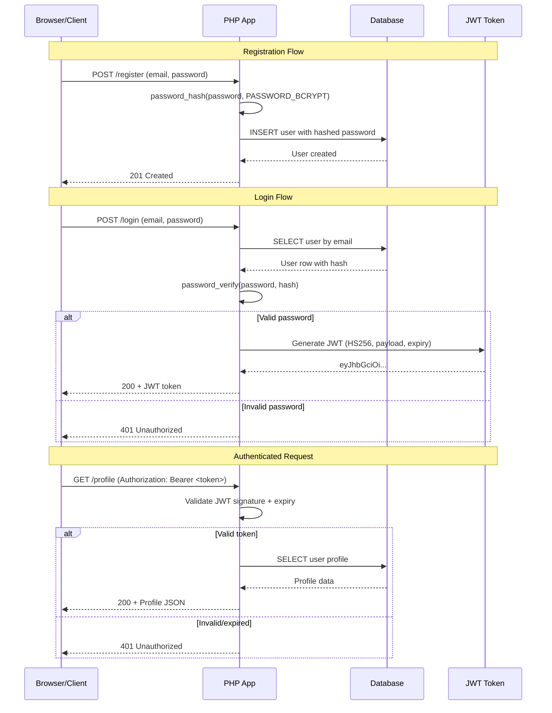

# Chapter 22: Authentication Systems

## Learning Objectives

- Implement password hashing and verification
- Build session-based authentication
- Implement JWT authentication
- Create middleware for protected routes

---



## 22.1 Password Hashing

```php
<?php
class PasswordService
{
    // Hash a password using bcrypt (default)
    public static function hash(string $password): string
    {
        return password_hash($password, PASSWORD_BCRYPT, [
            'cost' => 12,  // Higher cost = more secure but slower
        ]);
    }

    // Verify password against hash
    public static function verify(string $password, string $hash): bool
    {
        return password_verify($password, $hash);
    }

    // Check if rehashing is needed
    public static function needsRehash(string $hash): bool
    {
        return password_needs_rehash($hash, PASSWORD_BCRYPT, ['cost' => 12]);
    }

    // Validate password strength
    public static function validateStrength(string $password): array
    {
        $errors = [];

        if (strlen($password) < 8) {
            $errors[] = 'Password must be at least 8 characters';
        }
        if (!preg_match('/[A-Z]/', $password)) {
            $errors[] = 'Password must contain an uppercase letter';
        }
        if (!preg_match('/[a-z]/', $password)) {
            $errors[] = 'Password must contain a lowercase letter';
        }
        if (!preg_match('/[0-9]/', $password)) {
            $errors[] = 'Password must contain a number';
        }
        if (!preg_match('/[^A-Za-z0-9]/', $password)) {
            $errors[] = 'Password must contain a special character';
        }

        return $errors;
    }
}
```

---

## 22.2 JWT Authentication

```php
<?php
use Firebase\JWT\JWT;
use Firebase\JWT\Key;

class JwtService
{
    private string $secretKey;
    private string $algorithm = 'HS256';

    public function __construct()
    {
        $this->secretKey = $_ENV['JWT_SECRET'] ?? 'your-secret-key-change-in-production';
    }

    public function createToken(array $payload, int $ttl = 3600): string
    {
        $issuedAt = time();
        $payload = array_merge($payload, [
            'iat' => $issuedAt,
            'exp' => $issuedAt + $ttl,
            'jti' => bin2hex(random_bytes(16)),
        ]);

        return JWT::encode($payload, $this->secretKey, $this->algorithm);
    }

    public function validateToken(string $token): object
    {
        try {
            return JWT::decode($token, new Key($this->secretKey, $this->algorithm));
        } catch (\Exception $e) {
            throw new AuthenticationException('Invalid or expired token');
        }
    }

    public function refreshToken(string $token, int $newTtl = 3600): string
    {
        $payload = $this->validateToken($token);
        return $this->createToken((array)$payload, $newTtl);
    }
}

// Auth Middleware
class AuthMiddleware
{
    public function __construct(private JwtService $jwt) {}

    public function handle(callable $next): void
    {
        $token = $this->extractToken();
        
        if (!$token) {
            http_response_code(401);
            echo json_encode(['error' => 'No authentication token provided']);
            exit;
        }

        try {
            $payload = $this->jwt->validateToken($token);
            $_REQUEST['auth_user'] = $payload;
            $next();
        } catch (AuthenticationException $e) {
            http_response_code(401);
            echo json_encode(['error' => $e->getMessage()]);
            exit;
        }
    }

    private function extractToken(): ?string
    {
        $header = $_SERVER['HTTP_AUTHORIZATION'] ?? '';
        if (preg_match('/Bearer\s+(.+)$/i', $header, $matches)) {
            return $matches[1];
        }
        return null;
    }
}
```

---

## 22.3 Exercises

1. Implement password hashing with bcrypt and a cost factor of 12
2. Build session-based authentication with login/logout
3. Implement JWT authentication with token refresh
4. Create middleware that protects routes with authentication

---

## Further Reading

- **Doc:** [PHP password_hash](https://www.php.net/manual/en/function.password-hash.php)
- **Doc:** [Firebase JWT PHP](https://github.com/firebase/php-jwt)
- **Doc:** [JWT.io](https://jwt.io/)
