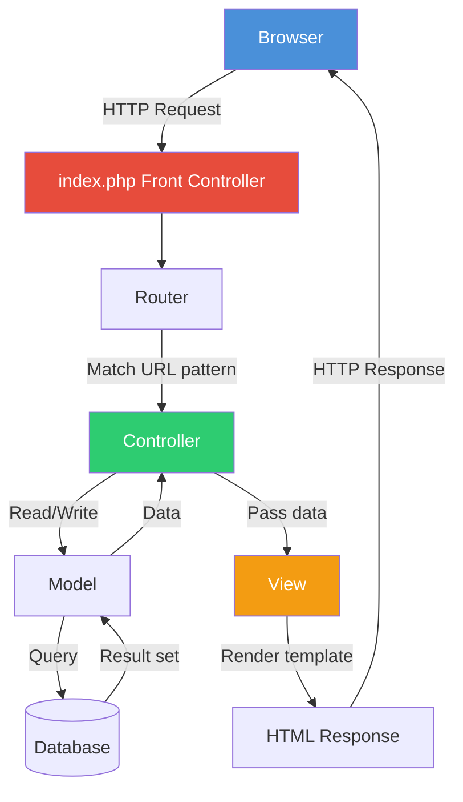
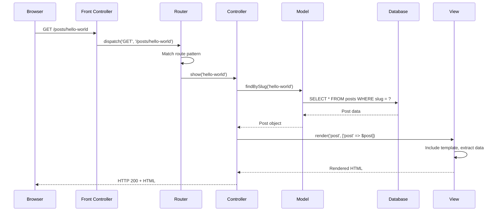

# Chapter 24: MVC Architecture in Depth

## Learning Objectives

- Understand Model-View-Controller pattern
- Build a MVC framework from scratch
- Implement routing, controllers, and views
- Apply best practices

---





## 24.1 MVC Request Flow

```php
<?php
// 1. Front Controller (index.php)
// All requests route through this file

// 2. Router → matches URL to controller
class Router
{
    private array $routes = [];

    public function get(string $pattern, string $handler): void
    {
        $this->routes['GET'][] = [
            'pattern' => $this->patternToRegex($pattern),
            'handler' => $handler,
        ];
    }

    public function post(string $pattern, string $handler): void
    {
        $this->routes['POST'][] = [
            'pattern' => $this->patternToRegex($pattern),
            'handler' => $handler,
        ];
    }

    public function dispatch(string $method, string $uri): mixed
    {
        $uri = parse_url($uri, PHP_URL_PATH);
        
        foreach ($this->routes[$method] ?? [] as $route) {
            if (preg_match($route['pattern'], $uri, $matches)) {
                $params = array_filter($matches, 'is_string', ARRAY_FILTER_USE_KEY);
                return $this->callHandler($route['handler'], $params);
            }
        }

        throw new HttpException('Route not found', 404);
    }

    private function patternToRegex(string $pattern): string
    {
        $pattern = preg_replace('/\{(\w+)\}/', '(?P<$1>[^/]+)', $pattern);
        return '#^' . $pattern . '$#';
    }

    private function callHandler(string $handler, array $params): mixed
    {
        [$controller, $action] = explode('@', $handler);
        $class = "App\\Http\\Controllers\\{$controller}";
        $instance = new $class();
        return $instance->$action(...$params);
    }
}

// 3. Controller → handles logic
class PostController
{
    public function __construct(
        private PostRepository $posts,
        private ViewRenderer $view
    ) {}

    public function index(): string
    {
        $posts = $this->posts->findAll();
        return $this->view->render('posts/index', ['posts' => $posts]);
    }

    public function show(string $slug): string
    {
        $post = $this->posts->findBySlug($slug);
        if (!$post) {
            throw new HttpException('Post not found', 404);
        }
        return $this->view->render('posts/show', ['post' => $post]);
    }

    public function store(): never
    {
        $data = json_decode(file_get_contents('php://input'), true);
        $post = $this->posts->create($data);
        http_response_code(201);
        echo json_encode($post);
        exit;
    }
}

// 4. Model → data layer
class PostRepository
{
    public function __construct(private PDO $pdo) {}

    public function findAll(): array
    {
        $stmt = $this->pdo->query('SELECT * FROM posts ORDER BY created_at DESC');
        return $stmt->fetchAll();
    }

    public function findBySlug(string $slug): ?array
    {
        $stmt = $this->pdo->prepare('SELECT * FROM posts WHERE slug = ?');
        $stmt->execute([$slug]);
        return $stmt->fetch() ?: null;
    }

    public function create(array $data): array
    {
        $stmt = $this->pdo->prepare(
            'INSERT INTO posts (title, content, slug) VALUES (?, ?, ?)'
        );
        $stmt->execute([$data['title'], $data['content'], $data['slug']]);
        return $this->findBySlug($data['slug']);
    }
}

// 5. View → presentation (simple template engine)
class ViewRenderer
{
    public function __construct(
        private string $viewsPath = __DIR__ . '/../views'
    ) {}

    public function render(string $view, array $data = []): string
    {
        extract($data);
        ob_start();
        include "{$this->viewsPath}/{$view}.php";
        return ob_get_clean();
    }
}

// Entry point
$router = new Router();
$router->get('/posts', 'PostController@index');
$router->get('/posts/{slug}', 'PostController@show');
$router->post('/posts', 'PostController@store');

try {
    echo $router->dispatch($_SERVER['REQUEST_METHOD'], $_SERVER['REQUEST_URI']);
} catch (HttpException $e) {
    http_response_code($e->getCode());
    echo $e->getMessage();
}
```

---

## 24.2 Exercises

1. Build a mini MVC framework with routing, controllers, and views
2. Add middleware support to the framework
3. Implement dependency injection in controllers
4. Create a RESTful API using your framework

---

## Further Reading

- **Doc:** [Laravel Request Lifecycle](https://laravel.com/docs/11.x/lifecycle)
