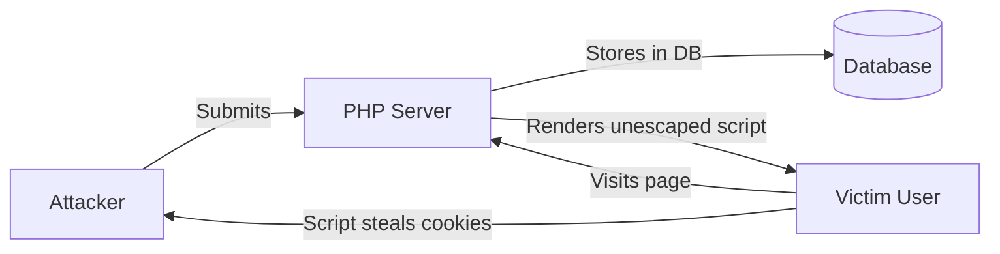

# Chapter 26: Web Application Security (OWASP Top 10 for PHP)

## Learning Objectives

By the end of this chapter you will:
- Understand the OWASP Top 10 web application risks
- Prevent XSS (Cross-Site Scripting) attacks in PHP
- Prevent CSRF (Cross-Site Request Forgery) attacks
- Implement Content Security Policy (CSP) headers
- Understand SSRF, clickjacking, and other web threats
- Build a security middleware for PHP applications

---

## 26.1 Why Security Matters

Think of security like locking your front door. Most days, nobody tries your door handle. But the one day you forget to lock it, someone might walk right in. Web security is the same — attackers scan millions of sites looking for that one unlocked door.

**The Golden Rule:** Never trust user input. Ever. Not from forms, not from URLs, not from cookies, not from API headers. Treat everything that comes from the outside as potentially malicious until proven otherwise.

```php
<?php
// The cardinal sin of web security:
$name = $_POST['name']; // ← THIS is where all problems start
```

---

## 26.2 OWASP Top 10 Overview

OWASP (Open Web Application Security Project) publishes the top 10 web application risks. For PHP developers, these are the ones that matter most:

| Rank | Risk | PHP Relevance |
|------|------|---------------|
| 1 | Broken Access Control | User A sees User B's data |
| 2 | Cryptographic Failures | Passwords stored in plaintext |
| 3 | Injection (XSS, SQL) | SQL injection, stored XSS |
| 4 | Insecure Design | No rate limiting, missing validation |
| 5 | Security Misconfiguration | Debug mode in production, default credentials |
| 6 | Vulnerable Components | Outdated Composer packages |
| 7 | Authentication Failures | Weak password policies, session fixation |
| 8 | Data Integrity Failures | Unsigned JWTs, unverified webhooks |
| 9 | Logging & Monitoring Failures | No audit trail for breaches |
| 10 | SSRF | Server makes requests to internal services |

---

## 26.3 Cross-Site Scripting (XSS)

### What is XSS?

XSS lets an attacker inject malicious JavaScript into your web pages. When other users visit the page, the script runs in their browser and can steal cookies, redirect to phishing sites, or deface the page.



### Types of XSS

| Type | Description | Example |
|------|-------------|---------|
| **Stored** | Malicious script saved in DB, served to all visitors | Comment form with `<script>` |
| **Reflected** | Script in URL, echoed back without storage | Search page showing query param |
| **DOM-based** | Client-side JS reads attacker-controlled data | URL fragment used in innerHTML |

### Preventing XSS in PHP

```php
<?php
// BAD: Direct echo of user input
echo "Hello, " . $_GET['name']; // XSS!

// GOOD: Escape HTML output
echo "Hello, " . htmlspecialchars($_GET['name'], ENT_QUOTES | ENT_HTML5, 'UTF-8');

// Helper function
function h(?string $value): string
{
    return htmlspecialchars($value ?? '', ENT_QUOTES | ENT_HTML5, 'UTF-8');
}

// Usage in templates
echo "<h1>" . h($user['name']) . "</h1>";

// For JSON responses (never inject user data directly)
header('Content-Type: application/json');
echo json_encode($data, JSON_UNESCAPED_UNICODE | JSON_HEX_TAG | JSON_HEX_AMP);

// For URL parameters
$safeUrl = "https://example.com?q=" . urlencode($userInput);

// For JavaScript context (rare, but when needed)
$safeJs = json_encode($userInput, JSON_HEX_TAG | JSON_HEX_AMP | JSON_HEX_APOS);
echo "<script>var name = {$safeJs};</script>";
```

### Context Matters

```php
<?php
$input = "<script>alert(1)</script>";

// HTML context
echo htmlspecialchars($input); // Safe

// HTML attribute context
echo '<input value="' . htmlspecialchars($input, ENT_QUOTES) . '">'; // Safe

// URL context
echo '<a href="' . htmlspecialchars($input, ENT_QUOTES) . '">'; // NOT safe for javascript:
echo '<a href="' . filter_var($input, FILTER_VALIDATE_URL) . '">'; // Better

// JavaScript context
echo "<script>var x = " . json_encode($input, JSON_HEX_TAG) . ";</script>"; // Safe
```

### Content Security Policy (CSP)

CSP is a browser security feature that blocks XSS even if your code has a漏洞:

```php
<?php
// CSP headers tell the browser what sources are allowed
header("Content-Security-Policy: default-src 'self'; script-src 'self' https://cdn.example.com; style-src 'self' 'unsafe-inline'; img-src 'self' data:;");

// Strict CSP (recommended for new apps):
header("Content-Security-Policy: script-src 'nonce-" . bin2hex(random_bytes(16)) . "' 'strict-dynamic'; object-src 'none'; base-uri 'none';");

// CSP via meta tag (fallback)
// <meta http-equiv="Content-Security-Policy" content="default-src 'self'">

// Report-only mode (test without breaking)
header("Content-Security-Policy-Report-Only: default-src 'self'; report-uri /csp-report");
```

**CSP Directives Quick Reference:**

| Directive | Controls | Example |
|-----------|----------|---------|
| `default-src` | Fallback for all resources | `'self'` |
| `script-src` | JavaScript sources | `'self' https://cdn.example.com` |
| `style-src` | CSS sources | `'self' 'unsafe-inline'` |
| `img-src` | Image sources | `'self' data: https:` |
| `connect-src` | AJAX/WebSocket endpoints | `'self' https://api.example.com` |
| `frame-ancestors` | Who can embed your page | `'none'` (prevents clickjacking) |
| `form-action` | Where forms can submit | `'self'` |

---

## 26.4 Cross-Site Request Forgery (CSRF)

### What is CSRF?

CSRF tricks an authenticated user into performing actions they didn't intend. An attacker creates a form on their site that submits to your site. If the victim is logged into your site, the request carries their session cookie.

```mermaid
sequenceDiagram
    participant Victim
    participant AttackerSite as Attacker's Site
    participant Bank as Your PHP App

    Victim->>Bank: Log in (gets session cookie)
    Victim->>AttackerSite: Visits evil.com
    AttackerSite->>Victim: <form action="https://bank.com/transfer" method="POST">
    Victim->>Bank: POST /transfer (with session cookie!)
    Bank->>Bank: "Oh, it's authenticated user — proceed!"
    Bank->>Bank: Transfers $1000 to attacker
```



### Preventing CSRF

```php
<?php
// 1. Generate CSRF token (store in session)
function generateCsrfToken(): string
{
    if (empty($_SESSION['_csrf_token'])) {
        $_SESSION['_csrf_token'] = bin2hex(random_bytes(32));
    }
    return $_SESSION['_csrf_token'];
}

// 2. Validate CSRF token
function validateCsrfToken(?string $token): bool
{
    if (empty($_SESSION['_csrf_token']) || empty($token)) {
        return false;
    }
    return hash_equals($_SESSION['_csrf_token'], $token);
}

// 3. CSRF middleware
class CsrfMiddleware
{
    public function handle(callable $next): void
    {
        $method = $_SERVER['REQUEST_METHOD'];

        // Only protect state-changing methods
        if (in_array($method, ['GET', 'HEAD', 'OPTIONS'])) {
            $next();
            return;
        }

        $token = $_POST['_csrf_token']
            ?? $_SERVER['HTTP_X_CSRF_TOKEN']
            ?? null;

        if (!validateCsrfToken($token)) {
            http_response_code(419); // 419 Authentication Timeout
            echo json_encode(['error' => 'CSRF token mismatch']);
            exit;
        }

        $next();
    }
}

// 4. In your form template
?>
<form method="POST" action="/transfer">
    <input type="hidden" name="_csrf_token" value="<?= generateCsrfToken() ?>">
    <input type="number" name="amount">
    <button type="submit">Transfer</button>
</form>

<?php
// 5. Double-submit cookie pattern (for APIs without sessions)
function generateDoubleSubmitToken(): string
{
    $token = bin2hex(random_bytes(32));
    setcookie('XSRF-TOKEN', $token, [
        'expires' => 0,
        'path' => '/',
        'secure' => true,
        'httponly' => false, // Must be readable by JS
        'samesite' => 'Strict',
    ]);
    return $token;
}

// Frontend reads cookie and sends as header:
// fetch('/api/transfer', {
//     method: 'POST',
//     headers: { 'X-XSRF-TOKEN': getCookie('XSRF-TOKEN') },
//     body: formData
// });
```

### SameSite Cookies

Modern browsers support the `SameSite` cookie attribute, which prevents CSRF entirely for most cases:

```php
<?php
session_set_cookie_params([
    'lifetime' => 0,
    'path' => '/',
    'domain' => '',
    'secure' => true,
    'httponly' => true,
    'samesite' => 'Lax', // 'Strict' for extra security
]);

// SameSite=Lax: cookie sent for top-level GET navigations
// SameSite=Strict: cookie never sent for cross-site requests
// SameSite=None: cookie always sent (requires Secure)
```

**Note:** SameSite alone is not enough — always implement CSRF tokens as defense-in-depth.

---

## 26.5 Cross-Origin Resource Sharing (CORS)

See Chapter on CORS for full details. The key security consideration:

```php
<?php
// Never reflect the Origin header blindly (mirror attack)
// BAD:
header("Access-Control-Allow-Origin: " . $_SERVER['HTTP_ORIGIN']);

// GOOD: Whitelist specific origins
$allowedOrigins = ['https://myapp.com', 'https://admin.myapp.com'];
$origin = $_SERVER['HTTP_ORIGIN'] ?? '';

if (in_array($origin, $allowedOrigins)) {
    header("Access-Control-Allow-Origin: {$origin}");
    header("Vary: Origin");
}
```

---

## 26.6 Server-Side Request Forgery (SSRF)

### What is SSRF?

SSRF tricks your server into making requests to internal services. If your app fetches a URL provided by the user, an attacker can target internal networks:

```php
<?php
// BAD: User controls the URL
$url = $_GET['url'];
$content = file_get_contents($url); // SSRF!

// Attacker can access:
// file:///etc/passwd
// http://169.254.169.254/latest/meta-data/ (AWS metadata)
// http://localhost:9200 (Elasticsearch without auth)
// http://internal-admin-panel/

// GOOD: Validate and restrict URLs
function isSafeUrl(string $url): bool
{
    $parsed = parse_url($url);
    if ($parsed === false) return false;

    // Only allow HTTP/HTTPS
    if (!in_array($parsed['scheme'] ?? '', ['http', 'https'])) {
        return false;
    }

    // Block internal/reserved IPs
    $host = $parsed['host'] ?? '';
    $ip = gethostbyname($host);

    if (filter_var($ip, FILTER_VALIDATE_IP, FILTER_FLAG_NO_PRIV_RANGE | FILTER_FLAG_NO_RES_RANGE) === false) {
        return false; // Private or reserved IP
    }

    // Block localhost aliases
    $blocked = ['localhost', '127.0.0.1', '::1', '0.0.0.0', '*.local', '*.internal'];
    foreach ($blocked as $pattern) {
        if (fnmatch($pattern, $host)) return false;
    }

    // Whitelist allowed domains
    $allowed = ['api.github.com', 'api.stripe.com', 'cdn.example.com'];
    $match = false;
    foreach ($allowed as $domain) {
        if (str_ends_with($host, $domain)) {
            $match = true;
            break;
        }
    }

    return $match;
}
```

---

## 26.7 Clickjacking

### What is Clickjacking?

Clickjacking hides your page inside an invisible iframe on the attacker's site. When the victim clicks what they think is a button on the attacker's page, they're actually clicking your page.

```php
<?php
// Prevent clickjacking with frame-ancestors CSP
header("Content-Security-Policy: frame-ancestors 'none'");

// Or the older X-Frame-Options header
header("X-Frame-Options: DENY"); // DENY or SAMEORIGIN
```

---

## 26.8 Security Headers Cheat Sheet

```php
<?php
class SecurityHeaders
{
    public static function applyAll(): void
    {
        // HSTS — Force HTTPS
        header("Strict-Transport-Security: max-age=31536000; includeSubDomains; preload");

        // Prevent MIME-type sniffing
        header("X-Content-Type-Options: nosniff");

        // Prevent clickjacking
        header("X-Frame-Options: DENY");

        // Enable browser XSS filter (legacy)
        header("X-XSS-Protection: 1; mode=block");

        // Referrer policy
        header("Referrer-Policy: strict-origin-when-cross-origin");

        // Permissions Policy (formerly Feature-Policy)
        header("Permissions-Policy: camera=(), microphone=(), geolocation=()");

        // Content Security Policy
        $nonce = bin2hex(random_bytes(16));
        header("Content-Security-Policy: default-src 'self'; script-src 'nonce-{$nonce}' 'strict-dynamic'; object-src 'none'; base-uri 'none'; frame-ancestors 'none';");

        // Remove server signature
        header_remove("X-Powered-By");
    }
}
```

---

## 26.9 Secure File Uploads

```php
<?php
class SecureUploadHandler
{
    private array $allowedTypes = ['image/jpeg', 'image/png', 'image/webp', 'application/pdf'];
    private int $maxSize = 5 * 1024 * 1024; // 5MB
    private string $uploadDir;

    public function __construct(string $uploadDir)
    {
        $this->uploadDir = rtrim($uploadDir, '/');
    }

    public function handle(array $file): ?string
    {
        // Validate upload
        if ($file['error'] !== UPLOAD_ERR_OK) {
            throw new \RuntimeException('Upload failed');
        }

        // Validate file size
        if ($file['size'] > $this->maxSize) {
            throw new \RuntimeException('File too large');
        }

        // Validate MIME type (check real content, not just extension)
        $finfo = new finfo(FILEINFO_MIME_TYPE);
        $mimeType = $finfo->file($file['tmp_name']);

        if (!in_array($mimeType, $this->allowedTypes)) {
            throw new \RuntimeException('File type not allowed');
        }

        // Validate image integrity (for images)
        if (str_starts_with($mimeType, 'image/')) {
            $imageInfo = getimagesize($file['tmp_name']);
            if ($imageInfo === false) {
                throw new \RuntimeException('Invalid image file');
            }
        }

        // Generate safe filename
        $extension = match ($mimeType) {
            'image/jpeg' => 'jpg',
            'image/png' => 'png',
            'image/webp' => 'webp',
            'application/pdf' => 'pdf',
            default => throw new \RuntimeException('Unknown type'),
        };

        $filename = bin2hex(random_bytes(16)) . '.' . $extension;
        $destination = "{$this->uploadDir}/{$filename}";

        // Move file
        if (!move_uploaded_file($file['tmp_name'], $destination)) {
            throw new \RuntimeException('Failed to save file');
        }

        // Set restrictive permissions
        chmod($destination, 0644);

        return $filename;
    }
}
```

---

## 26.10 Security Middleware

```php
<?php
class SecurityMiddleware
{
    public function handle(callable $next): void
    {
        // Apply security headers
        SecurityHeaders::applyAll();

        // Rate limiting check
        $this->checkRateLimit();

        // Input validation
        $this->sanitizeInput();

        // CSRF protection for state-changing requests
        if (in_array($_SERVER['REQUEST_METHOD'], ['POST', 'PUT', 'PATCH', 'DELETE'])) {
            (new CsrfMiddleware())->handle($next);
            return;
        }

        $next();
    }

    private function checkRateLimit(): void
    {
        $ip = $_SERVER['REMOTE_ADDR'];
        $key = "rate_limit:{$ip}:" . date('Y-m-d-H');

        // Using APCu or Redis
        $attempts = apcu_inc($key, 1, $success, 3600);

        if ($attempts > 1000) { // 1000 requests per hour
            http_response_code(429);
            header("Retry-After: 3600");
            echo json_encode(['error' => 'Too many requests']);
            exit;
        }
    }

    private function sanitizeInput(): void
    {
        // Strip null bytes from all input
        $clean = function($value) {
            if (is_string($value)) {
                return str_replace("\0", '', $value);
            }
            return $value;
        };

        $_GET = array_map($clean, $_GET);
        $_POST = array_map($clean, $_POST);
        $_COOKIE = array_map($clean, $_COOKIE);
    }
}
```

---

## 26.11 Common Security Mistakes

| Mistake | Impact | Solution |
|---------|--------|----------|
| Storing passwords in plaintext | All users compromised | Use `password_hash()` with bcrypt |
| Direct echo of user input | XSS | Always use `htmlspecialchars()` |
| No CSRF tokens | Account takeover | Always validate CSRF on state-changing requests |
| Reflecting Origin header | CORS bypass | Whitelist specific origins |
| Using `$_SERVER['PHP_SELF']` in forms | XSS | Use empty action or `htmlspecialchars()` |
| Debug mode in production | Info disclosure | Set `display_errors = Off` |
| Old Composer packages | Known CVEs | Run `composer audit` regularly |
| No rate limiting | Brute force, DoS | Implement rate limiting on auth endpoints |
| Trusting file extensions | Uploaded PHP shells | Check real MIME type with `finfo` |
| Showing raw stack traces | Sensitive data leak | Log errors, don't display them |

---

## 26.12 Exercises

1. **XSS prevention:** Create a guestbook that safely displays user-submitted messages
2. **CSRF protection:** Add CSRF tokens to a form and validate on submit
3. **Security headers:** Build a middleware that applies all recommended security headers
4. **CSP implementation:** Add a Content-Security-Policy header to an existing app and fix violations
5. **SSRF prevention:** Create a URL fetcher that blocks internal requests
6. **Secure upload:** Build a file upload handler with MIME validation and safe filenames
7. **Security audit:** Review a PHP application for OWASP Top 10 vulnerabilities and fix them

---

## 26.13 Interview Questions

1. "Explain the difference between stored, reflected, and DOM-based XSS."
2. "How does CSRF work and how do you prevent it?"
3. "What headers would you set to secure a PHP application?"
4. "What is Content Security Policy and how does it prevent XSS?"
5. "Explain SSRF and how it differs from CSRF."
6. "What is the SameSite cookie attribute and how does it help?"
7. "How do you securely handle file uploads in PHP?"

---

## Further Reading

- **Resource:** [OWASP Top 10](https://owasp.org/www-project-top-ten/)
- **Resource:** [OWASP PHP Security Cheat Sheet](https://cheatsheetseries.owasp.org/cheatsheets/PHP_Configuration_Cheat_Sheet.html)
- **Book:** "Web Application Security" by Andrew Hoffman
- **Tool:** [Security Headers](https://securityheaders.com/) — Test your site's headers
- **Tool:** [Mozilla Observatory](https://observatory.mozilla.org/) — Security score
- **Tool:** [Composer Audit](https://getcomposer.org/doc/03-cli.md#audit)
- **Video:** "OWASP Top 10 Explained" by The Cyber Mentor

---

*End of Chapter 26. Proceed to Chapter 27: Web Scraping with PHP.*
