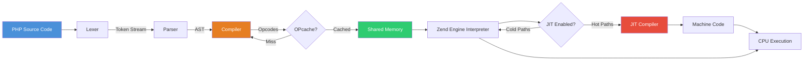
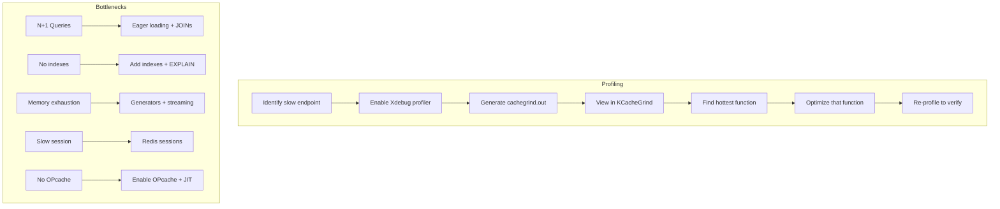

# Chapter 15: Performance Optimization

## Learning Objectives

- Profile PHP applications
- Optimize OPcache and JIT
- Apply benchmarking techniques
- Identify and fix bottlenecks

---





## 15.1 Profiling

```php
<?php
// Simple benchmarking
class Benchmark
{
    private array $marks = [];

    public function start(string $label): void
    {
        $this->marks[$label] = [
            'time' => hrtime(true),
            'memory' => memory_get_usage(),
        ];
    }

    public function end(string $label): array
    {
        $start = $this->marks[$label];
        $result = [
            'label' => $label,
            'time_ms' => round((hrtime(true) - $start['time']) / 1_000_000, 2),
            'memory_kb' => round((memory_get_usage() - $start['memory']) / 1024, 2),
            'peak_memory_kb' => round(memory_get_peak_usage(true) / 1024, 2),
        ];
        
        echo sprintf(
            "[%s] Time: %sms | Memory: %sKB | Peak: %sKB\n",
            $result['label'],
            $result['time_ms'],
            $result['memory_kb'],
            $result['peak_memory_kb']
        );
        
        return $result;
    }
}

// Usage
$bench = new Benchmark();

$bench->start('array_operation');
$data = range(1, 100000);
$result = array_map(fn($n) => $n * 2, $data);
$bench->end('array_operation');
```

---

## 15.2 OPcache and JIT

```php
<?php
// Check OPcache status
$status = opcache_get_status();
if ($status) {
    echo "OPcache enabled: " . ($status['opcache_enabled'] ? 'Yes' : 'No') . "\n";
    echo "Memory usage: " . round($status['memory_usage']['used_memory'] / 1048576, 2) . "MB\n";
    echo "Cache hits: {$status['opcache_statistics']['hits']}\n";
    echo "Cache misses: {$status['opcache_statistics']['misses']}\n";
}

// Check JIT status
$jit = opcache_get_status()['jit'] ?? null;
if ($jit) {
    echo "JIT enabled: " . ($jit['enabled'] ? 'Yes' : 'No') . "\n";
    echo "JIT buffer size: " . round($jit['buffer_size'] / 1048576, 2) . "MB\n";
}

// Force compilation of a script
opcache_compile_file('/path/to/script.php');

// Invalidate cached script
opcache_invalidate('/path/to/script.php', true);
```

---

## 15.3 Performance Tips

```php
<?php
// ❌ Slow: function calls in loops
for ($i = 0; $i < count($items); $i++) {  // count() called every iteration
    // ...
}

// ✅ Fast: cache the count
$count = count($items);
for ($i = 0; $i < $count; $i++) {
    // ...
}

// ❌ Slow: concatenation in loops
$result = '';
foreach ($items as $item) {
    $result .= $item . ', ';  // Creates new string each iteration
}

// ✅ Fast: use array and implode
$parts = [];
foreach ($items as $item) {
    $parts[] = $item;
}
$result = implode(', ', $parts);

// ❌ Slow: isset() on deep arrays
if (isset($data['users'][0]['profile']['name'])) {
    // ...
}

// ✅ Null-safe operator (PHP 8+)
if ($data['users'][0]?->profile?->name) {
    // ...
}

// ❌ Slow: regex for simple checks
if (preg_match('/^[a-z]+$/', $string)) {
    // ...
}

// ✅ Fast: simple string functions
if (ctype_alpha($string)) {
    // ...
}

// ❌ Slow: __call/__get/__set magic methods
class Magic
{
    private array $data = [];
    public function __get(string $name): mixed { return $this->data[$name] ?? null; }
}

// ✅ Fast: explicit properties
class Explicit
{
    public ?string $name = null;
}
```

---

## 15.4 PHP-FPM Performance Tuning

### Process Management

PHP-FPM offers three process management modes:

| Mode | Behavior | Use Case |
|------|----------|----------|
| `dynamic` | Number of children varies based on demand | General purpose |
| `static` | Fixed number of children | Predictable traffic |
| `ondemand` | Children created on demand, killed after idle | Low-margin servers |

### Calculating pm.max_children

```
pm.max_children = Total RAM / Max memory per PHP process

Example: 8GB RAM, 64MB per PHP-FPM process
pm.max_children = 8192MB / 64MB = 128
```

### Production Configuration

```ini
; /usr/local/etc/php-fpm.d/zz-production.conf

[global]
; Log levels: alert, error, warning, notice, debug
log_level = warning
; Always log to docker stdout/stderr instead of files
error_log = /proc/self/fd/2

[www]
; ── Process Manager ──────────────────────────────────
pm = dynamic
pm.max_children = 50
pm.start_servers = 5
pm.min_spare_servers = 5
pm.max_spare_servers = 15
pm.max_requests = 500
pm.process_idle_timeout = 10s
pm.status_path = /fpm-status

; ── Resource Limits ──────────────────────────────────
request_terminate_timeout = 30s
request_slowlog_timeout = 5s
slowlog = /proc/self/fd/2
catch_workers_output = yes

; ── Security ─────────────────────────────────────────
; Run as specific user/group
; user = www-data
; group = www-data

; Limit extensions that can be loaded
security.limit_extensions = .php .phar

; ── Environment ──────────────────────────────────────
; Clear environment variables in worker pools
clear_env = no
```

### Tuning Guidelines

```text
Scenario: Shared hosting (low memory)
  pm = ondemand
  pm.max_children = 10
  pm.process_idle_timeout = 30s

Scenario: Dedicated server (medium traffic)
  pm = dynamic
  pm.max_children = 50
  pm.start_servers = 5
  pm.min_spare_servers = 5
  pm.max_spare_servers = 15

Scenario: High-traffic API (lots of traffic)
  pm = static  
  pm.max_children = 100

Scenario: Memory-bound application
  pm = dynamic
  pm.max_children = 30
  pm.max_requests = 200  # Lower to prevent memory leaks
```

### Monitoring PHP-FPM Status

```php
<?php
// Access via /fpm-status (requires pm.status_path = /fpm-status)
// curl http://localhost/fpm-status?json

// Programmatic monitoring
class FpmMonitor
{
    public function __construct(
        private string $statusUrl = 'http://localhost/fpm-status?json'
    ) {}

    public function getMetrics(): array
    {
        $status = json_decode(file_get_contents($this->statusUrl), true);

        return [
            'pool' => $status['pool'] ?? 'unknown',
            'process_manager' => $status['process manager'] ?? 'unknown',
            'active_processes' => (int) ($status['active processes'] ?? 0),
            'total_processes' => (int) ($status['total processes'] ?? 0),
            'max_active_processes' => (int) ($status['max active processes'] ?? 0),
            'idle_processes' => (int) ($status['idle processes'] ?? 0),
            'max_children_reached' => (int) ($status['max children reached'] ?? 0),
            'slow_requests' => (int) ($status['slow requests'] ?? 0),
            'queue' => (int) ($status['total processes'] ?? 0) - (int) ($status['active processes'] ?? 0),
        ];
    }

    public function isHealthy(): bool
    {
        $metrics = $this->getMetrics();
        $queue = $metrics['queue'];
        $maxReached = $metrics['max_children_reached'];

        // Alert if queue is growing or max children was reached
        if ($queue > 5 || $maxReached > 0) {
            return false;
        }

        return true;
    }
}
```

---

## 15.5 Exercises

1. Profile a page request and identify the top 3 slowest operations
2. Compare performance with JIT enabled vs disabled
3. Benchmark different loop styles (foreach, for, while)
4. Optimize a slow endpoint and measure improvement

---

## Further Reading

- **Doc:** [PHP Performance](https://www.php.net/manual/en/opcache.setup.php)
- **Tool:** [Blackfire](https://blackfire.io/)
- **Tool:** [Xdebug Profiler](https://xdebug.org/docs/profiler)
