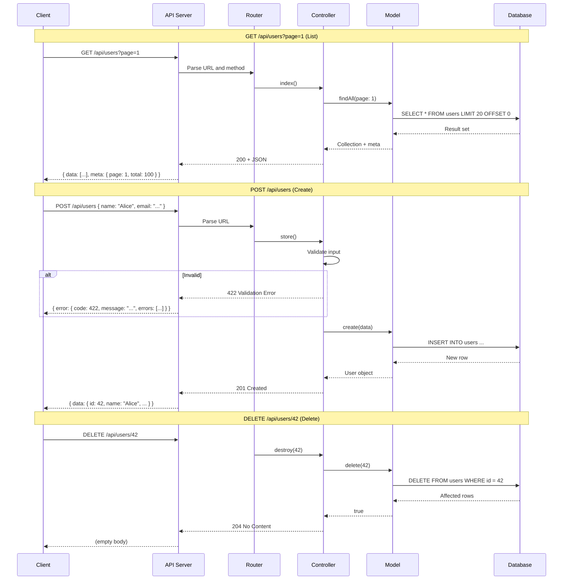

# Chapter 1: REST API Design

## Learning Objectives

- Design resource-oriented APIs
- Use HTTP methods and status codes correctly
- Implement pagination, filtering, sorting
- Handle errors consistently
- Version APIs properly

---



## 1.1 REST Principles

```php
<?php
// REST (Representational State Transfer) principles:
// 1. Resources are identified by URLs
// 2. HTTP methods define actions
// 3. Stateless communication
// 4. Representations (JSON/XML)
// 5. HATEOAS (hypermedia links)

// Resource naming conventions
// ✅ GET    /api/users          → List users
// ✅ POST   /api/users          → Create user
// ✅ GET    /api/users/42       → Get user
// ✅ PUT    /api/users/42       → Update user
// ✅ PATCH  /api/users/42       → Partial update
// ✅ DELETE /api/users/42       → Delete user

// ✅ Nested resources
// GET /api/users/42/posts       → User's posts
// POST /api/users/42/posts      → Create post for user

// ❌ Verbs in URLs
// GET /api/getUsers
// POST /api/createUser
// GET /api/deleteUser?id=42
```

---

## 1.2 Implementation

```php
<?php
class ApiResponse
{
    public static function success(mixed $data, int $status = 200, array $meta = []): never
    {
        http_response_code($status);
        header('Content-Type: application/json');
        
        $response = ['success' => true, 'data' => $data];
        
        if ($meta) {
            $response['meta'] = $meta;
        }
        
        echo json_encode($response, JSON_UNESCAPED_UNICODE);
        exit;
    }
    
    public static function error(string $message, int $status = 400, array $errors = []): never
    {
        http_response_code($status);
        header('Content-Type: application/json');
        
        $response = [
            'success' => false,
            'error' => [
                'message' => $message,
                'code' => $status,
            ],
        ];
        
        if ($errors) {
            $response['error']['details'] = $errors;
        }
        
        echo json_encode($response);
        exit;
    }
    
    public static function paginated(array $items, int $total, int $page, int $perPage): never
    {
        $lastPage = (int)ceil($total / $perPage);
        
        self::success($items, 200, [
            'current_page' => $page,
            'per_page' => $perPage,
            'total' => $total,
            'last_page' => $lastPage,
            'has_next' => $page < $lastPage,
            'has_prev' => $page > 1,
        ]);
    }
}

// Usage in controller
class UserController
{
    public function index(): never
    {
        $page = (int)($_GET['page'] ?? 1);
        $perPage = min((int)($_GET['per_page'] ?? 15), 100);
        
        $users = User::paginate($page, $perPage);
        
        ApiResponse::paginated(
            $users->items(),
            $users->total(),
            $page,
            $perPage
        );
    }
    
    public function show(int $id): never
    {
        $user = User::find($id);
        
        if (!$user) {
            ApiResponse::error('User not found', 404);
        }
        
        ApiResponse::success($user);
    }
    
    public function store(): never
    {
        $data = json_decode(file_get_contents('php://input'), true);
        
        try {
            $user = User::create($data);
            ApiResponse::success($user, 201);
        } catch (ValidationException $e) {
            ApiResponse::error('Validation failed', 422, $e->getErrors());
        }
    }
}
```

---

## 1.3 Exercises

1. Design a RESTful API for a blog (posts, comments, tags, users)
2. Implement pagination with page/per_page parameters
3. Add filtering (?status=active, ?category=tech)
4. Add sorting (?sort=created_at&order=desc)
5. Implement consistent error responses

---

## Further Reading

- **Book:** "RESTful Web APIs" by Leonard Richardson
- **Doc:** [PSR-7 HTTP Messages](https://www.php-fig.org/psr/psr-7/)
- **Resource:** [JSON:API Specification](https://jsonapi.org/)
