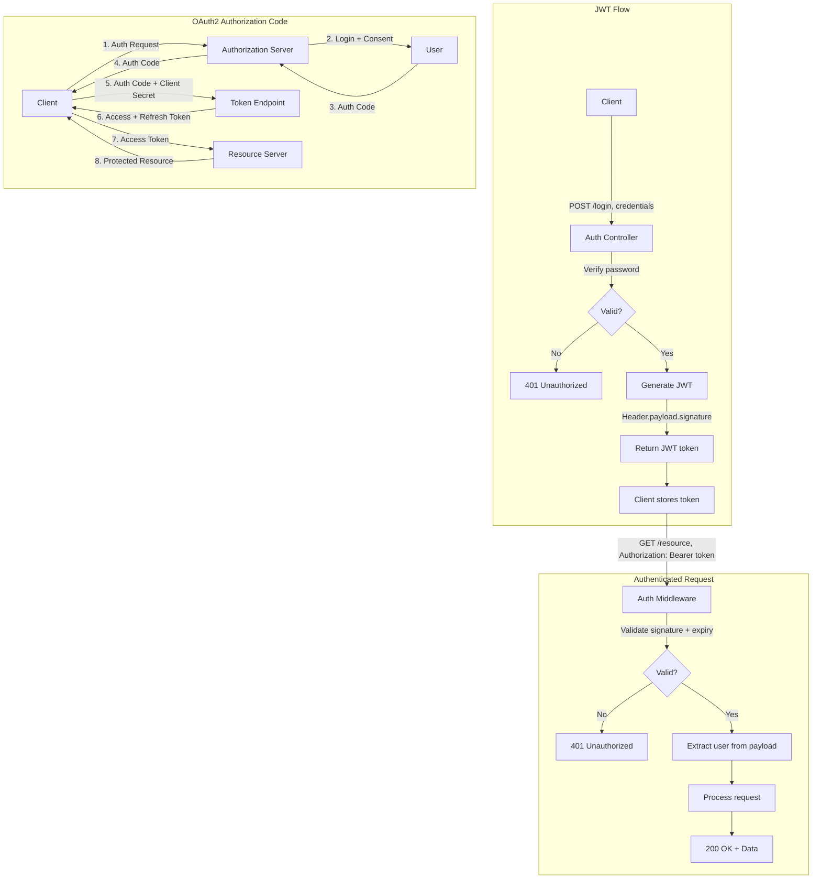

# Chapter 3: API Authentication

## Learning Objectives

- Implement JWT authentication
- Build OAuth 2.0 flows
- Create API token authentication
- Secure API endpoints properly

---



## 3.1 API Token Authentication

```php
<?php
namespace App\Auth;

class TokenAuth
{
    public function __construct(private \PDO $pdo) {}

    public function generateToken(User $user, string $name = 'default'): string
    {
        $token = bin2hex(random_bytes(32));
        $hash = hash('sha256', $token);

        $stmt = $this->pdo->prepare(
            'INSERT INTO api_tokens (user_id, token_hash, name, last_used_at, expires_at)
             VALUES (?, ?, ?, NOW, DATE_ADD(NOW(), INTERVAL 30 DAY))'
        );
        $stmt->execute([$user->id, $hash, $name]);

        return "{$token}";
    }

    public function validateToken(string $token): ?User
    {
        $hash = hash('sha256', $token);
        
        $stmt = $this->pdo->prepare(
            'SELECT u.* FROM api_tokens t
             JOIN users u ON t.user_id = u.id
             WHERE t.token_hash = ? AND (t.expires_at IS NULL OR t.expires_at > NOW())'
        );
        $stmt->execute([$hash]);
        
        $user = $stmt->fetchObject(User::class);
        
        if ($user) {
            // Update last used
            $this->pdo->prepare(
                'UPDATE api_tokens SET last_used_at = NOW() WHERE token_hash = ?'
            )->execute([$hash]);
        }

        return $user ?: null;
    }

    public function revokeToken(string $token): void
    {
        $hash = hash('sha256', $token);
        $this->pdo->prepare('DELETE FROM api_tokens WHERE token_hash = ?')
            ->execute([$hash]);
    }
}

// Authenticate middleware
class Authenticate
{
    public function __construct(private TokenAuth $auth) {}

    public function handle(callable $next): void
    {
        $token = $this->extractBearerToken();
        
        if (!$token) {
            ApiResponse::error('Authentication required', 401);
        }

        $user = $this->auth->validateToken($token);
        
        if (!$user) {
            ApiResponse::error('Invalid or expired token', 401);
        }

        $_REQUEST['auth_user'] = $user;
        $next();
    }

    private function extractBearerToken(): ?string
    {
        $header = $_SERVER['HTTP_AUTHORIZATION'] 
            ?? $_SERVER['REDIRECT_HTTP_AUTHORIZATION'] 
            ?? '';

        if (preg_match('/Bearer\s+(.+)$/i', $header, $matches)) {
            return $matches[1];
        }

        return null;
    }
}
```

---

## 3.2 Exercises

1. Implement API token generation and validation
2. Build JWT authentication with refresh tokens
3. Create OAuth 2.0 authorization code flow
4. Add rate limiting per token/user

---

## Further Reading

- **Doc:** [JWT.io](https://jwt.io/)
- **Doc:** [OAuth 2.0](https://oauth.net/2/)
- **Doc:** [Laravel Sanctum](https://laravel.com/docs/11.x/sanctum)
