# Chapter 6: Rate Limiting

## Learning Objectives

- Implement token bucket algorithm
- Use sliding window rate limiting
- Add Redis-based rate limiting
- Handle rate limit responses

---



```mermaid
flowchart TD
    subgraph Token Bucket
        A[Incoming Request] --> B[Get bucket for IP]
        B --> C{Tokens remaining?}
        C -->|Yes, consume 1 token| D[Process request]
        C -->|No tokens| E[429 Too Many Requests]
        D -->|Refill timer| F[+1 token per second]
        F --> B
        E --> G[Retry-After header]
    end

    subgraph Sliding Window
        H[Incoming Request] --> I[Get request count in window]
        I --> J{Count < Limit?}
        J -->|Yes| K[Increment counter]
        K --> L[Process request]
        J -->|No| M[429 Too Many Requests]
        L -->|Window slides| N[Expired entries removed]
    end

    subgraph Redis Implementation
        O[PHP App] --> P[INCR key]
        P --> Q{First request?}
        Q -->|Yes| R[EXPIRE key 60s]
        Q -->|No| S{Value > limit?}
        S -->|Yes| T[429]
        S -->|No| U[200 OK]
    end
```

## 6.1 Token Bucket Algorithm

```php
<?php
namespace App\RateLimiting;

class TokenBucket
{
    private array $buckets = [];

    public function __construct(
        private Redis $redis,
        private int $maxTokens = 60,
        private int $refillRate = 1,  // Tokens per second
    ) {}

    public function consume(string $key, int $tokens = 1): bool
    {
        $bucket = $this->getBucket($key);
        
        // Refill tokens
        $now = microtime(true);
        $elapsed = $now - $bucket['last_refill'];
        $newTokens = $elapsed * $this->refillRate;
        $bucket['tokens'] = min(
            $this->maxTokens,
            $bucket['tokens'] + $newTokens
        );
        $bucket['last_refill'] = $now;

        // Check if we have enough tokens
        if ($bucket['tokens'] >= $tokens) {
            $bucket['tokens'] -= $tokens;
            $this->saveBucket($key, $bucket);
            return true; // Allowed
        }

        $this->saveBucket($key, $bucket);
        return false; // Rate limited
    }

    public function getRetryAfter(string $key): int
    {
        $bucket = $this->getBucket($key);
        $needed = 1 - $bucket['tokens'];
        return (int)ceil(max(0, $needed) / $this->refillRate);
    }

    private function getBucket(string $key): array
    {
        $data = $this->redis->get("ratelimit:{$key}");
        return $data ? json_decode($data, true) : [
            'tokens' => $this->maxTokens,
            'last_refill' => microtime(true),
        ];
    }

    private function saveBucket(string $key, array $bucket): void
    {
        $this->redis->setex(
            "ratelimit:{$key}",
            3600,
            json_encode($bucket)
        );
    }
}

// Rate limit middleware
class RateLimitMiddleware
{
    public function __construct(private TokenBucket $bucket) {}

    public function handle(int $maxRequests = 60, int $window = 60): callable
    {
        return function (callable $next) use ($maxRequests, $window) {
            $key = $_SERVER['REMOTE_ADDR'] . ':' . $_SERVER['REQUEST_URI'];
            
            if (!$this->bucket->consume($key)) {
                $retryAfter = $this->bucket->getRetryAfter($key);
                
                http_response_code(429);
                header("Retry-After: {$retryAfter}");
                header("X-RateLimit-Limit: {$maxRequests}");
                header("X-RateLimit-Remaining: 0");
                
                ApiResponse::error(
                    "Too many requests. Try again in {$retryAfter} seconds.",
                    429
                );
            }

            $remaining = $this->bucket->getRemainingTokens($key);
            header("X-RateLimit-Remaining: {$remaining}");
            
            $next();
        };
    }
}
```

---

## 6.2 Exercises

1. Implement a token bucket rate limiter for API endpoints
2. Add per-user rate limiting with Redis
3. Create sliding window rate limiter
4. Return proper rate limit headers in responses

---

## Further Reading

- **Doc:** [Rate Limiting Strategies](https://konghq.com/blog/how-to-design-a-scalable-rate-limiting-algorithm)
