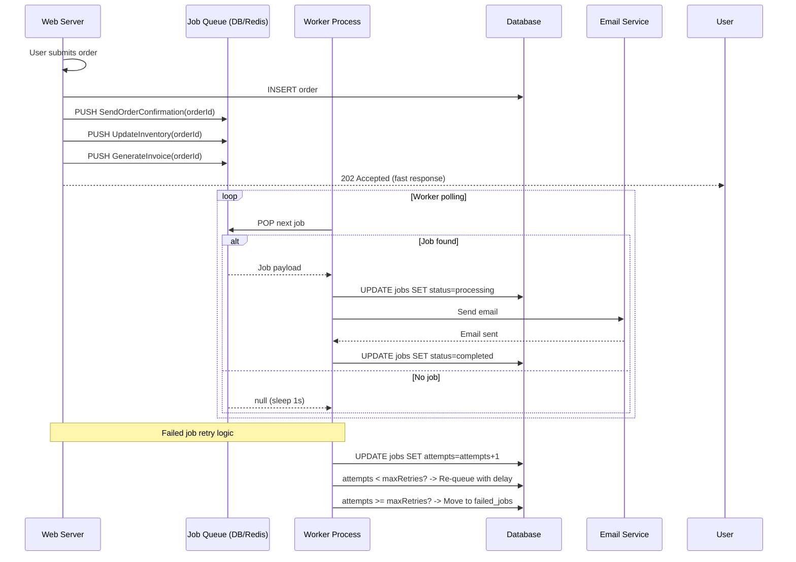

# Chapter 11: Background Jobs

## Learning Objectives

- Implement job queues
- Build worker processes
- Handle failed jobs with retries
- Schedule recurring tasks

---



## 11.1 Simple Job Queue

```php
<?php
namespace App\Queue;

abstract class Job
{
    public int $maxAttempts = 3;
    public int $delay = 0; // seconds before retry

    abstract public function handle(): void;

    public function failed(\Throwable $e): void
    {
        error_log("Job failed: " . $e->getMessage());
    }

    public function attempts(): int
    {
        return 0;
    }
}

class Queue
{
    public function __construct(private \PDO $pdo) {}

    public function dispatch(Job $job, int $delay = 0): void
    {
        $stmt = $this->pdo->prepare(
            'INSERT INTO jobs (class, data, available_at, created_at)
             VALUES (?, ?, ?, NOW())'
        );
        
        $stmt->execute([
            get_class($job),
            serialize($job),
            date('Y-m-d H:i:s', time() + $delay),
        ]);
    }

    public function work(): void
    {
        while (true) {
            $job = $this->getNextJob();

            if (!$job) {
                sleep(1);
                continue;
            }

            try {
                $job->handle();
                $this->markCompleted($job);
            } catch (\Throwable $e) {
                $this->handleFailure($job, $e);
            }
        }
    }

    private function getNextJob(): ?Job
    {
        $this->pdo->beginTransaction();

        $stmt = $this->pdo->prepare(
            'SELECT * FROM jobs
             WHERE available_at <= NOW()
             AND attempts < max_attempts
             ORDER BY created_at ASC
             LIMIT 1 FOR UPDATE'
        );
        $stmt->execute();
        $row = $stmt->fetch();

        if (!$row) {
            $this->pdo->commit();
            return null;
        }

        $this->pdo->prepare(
            'UPDATE jobs SET attempts = attempts + 1 WHERE id = ?'
        )->execute([$row['id']]);

        $this->pdo->commit();

        return unserialize($row['data']);
    }

    private function handleFailure(Job $job, \Throwable $e): void
    {
        if ($job->attempts() >= $job->maxAttempts) {
            $this->markFailed($job, $e);
            $job->failed($e);
        }
    }

    // Schema
    // CREATE TABLE jobs (
    //     id BIGINT AUTO_INCREMENT PRIMARY KEY,
    //     class VARCHAR(255) NOT NULL,
    //     data LONGTEXT NOT NULL,
    //     status ENUM('pending', 'processing', 'completed', 'failed') DEFAULT 'pending',
    //     attempts INT DEFAULT 0,
    //     max_attempts INT DEFAULT 3,
    //     available_at DATETIME,
    //     created_at DATETIME
    // );
}
```

---

## 11.2 Exercises

1. Build a queue with database-backed persistence
2. Implement retry logic with exponential backoff
3. Create worker processes that run in the background
4. Add job prioritization and scheduling

---

## Further Reading

- **Doc:** [Laravel Queues](https://laravel.com/docs/11.x/queues)
- **Doc:** [RabbitMQ PHP](https://www.rabbitmq.com/tutorials/tutorial-one-php.html)
