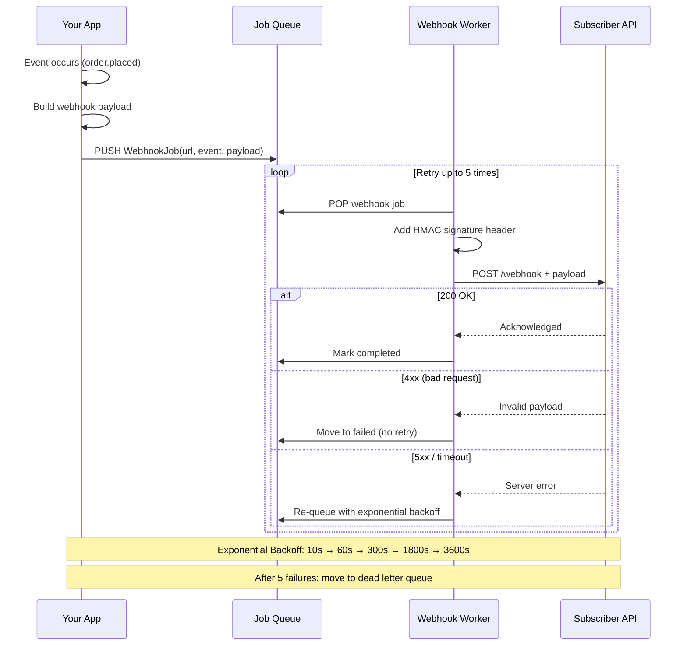

# Chapter 12: Webhooks

## Learning Objectives

- Build outgoing webhook dispatcher
- Implement webhook signature verification
- Handle webhook retries
- Build webhook receiver endpoints

---



## 12.1 Webhook Dispatcher

```php
<?php
namespace App\Webhooks;

class WebhookDispatcher
{
    public function __construct(
        private HttpClient $client,
        private LoggerInterface $logger
    ) {}

    public function dispatch(string $url, string $event, array $payload): array
    {
        $body = json_encode([
            'event' => $event,
            'payload' => $payload,
            'timestamp' => time(),
        ]);

        $signature = $this->generateSignature($body);

        $response = $this->client->post($url, [
            'headers' => [
                'Content-Type' => 'application/json',
                'X-Webhook-Signature' => $signature,
                'X-Webhook-Timestamp' => time(),
                'User-Agent' => 'MyApp-Webhook/1.0',
            ],
            'body' => $body,
            'timeout' => 10,
        ]);

        $this->logger->info('Webhook dispatched', [
            'url' => $url,
            'event' => $event,
            'status' => $response['status'],
        ]);

        return $response;
    }

    public function dispatchAsync(string $url, string $event, array $payload): void
    {
        // Queue webhook for background processing
        queue()->push(new DispatchWebhookJob(
            url: $url,
            event: $event,
            payload: $payload,
        ));
    }

    private function generateSignature(string $payload): string
    {
        $secret = $_ENV['WEBHOOK_SECRET'];
        return hash_hmac('sha256', $payload, $secret);
    }

    public function dispatchWithRetry(
        string $url,
        string $event,
        array $payload,
        int $maxRetries = 3
    ): array {
        $attempts = 0;
        
        while ($attempts < $maxRetries) {
            try {
                return $this->dispatch($url, $event, $payload);
            } catch (\Exception $e) {
                $attempts++;
                $this->logger->warning('Webhook dispatch failed', [
                    'url' => $url,
                    'event' => $event,
                    'attempt' => $attempts,
                    'error' => $e->getMessage(),
                ]);

                if ($attempts < $maxRetries) {
                    sleep(pow(2, $attempts)); // Exponential backoff
                }
            }
        }

        throw new WebhookException('Max retries exceeded');
    }
}

// Webhook receiver
class WebhookReceiver
{
    public function __construct(
        private array $handlers,
        private string $secret
    ) {}

    public function handle(string $event, array $payload): never
    {
        $signature = $_SERVER['HTTP_X_WEBHOOK_SIGNATURE'] ?? '';
        $body = file_get_contents('php://input');

        // Verify signature
        if (!$this->verifySignature($body, $signature)) {
            ApiResponse::error('Invalid signature', 401);
        }

        // Find handler
        $handler = $this->handlers[$event] ?? null;
        if (!$handler) {
            ApiResponse::error("Unknown event: {$event}", 400);
        }

        try {
            $handler($payload);
            ApiResponse::success(['received' => true]);
        } catch (\Exception $e) {
            ApiResponse::error($e->getMessage(), 500);
        }
    }

    private function verifySignature(string $body, string $signature): bool
    {
        $expected = hash_hmac('sha256', $body, $this->secret);
        return hash_equals($expected, $signature);
    }
}
```

---

## 12.2 Exercises

1. Build a webhook dispatcher with HMAC signature verification
2. Create a webhook receiver that handles multiple event types
3. Implement retry logic with exponential backoff
4. Build a webhook dashboard to view delivery logs

---

## Further Reading

- **Doc:** [Webhook Best Practices](https://webhooks.fyi/)
