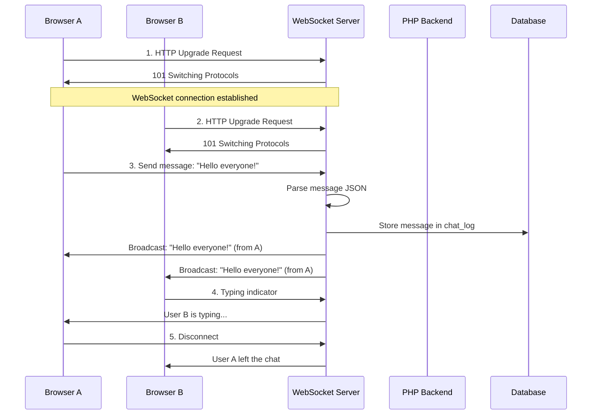
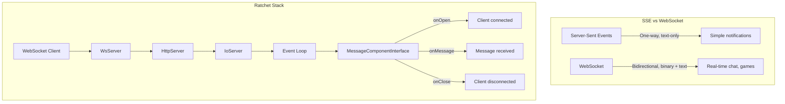

# Chapter 13: Real-time Features

## Learning Objectives

- Implement WebSockets with Ratchet
- Build Server-Sent Events (SSE)
- Create real-time notifications
- Handle concurrent connections

---





## 13.1 WebSocket Server

```php
<?php
use Ratchet\MessageComponentInterface;
use Ratchet\ConnectionInterface;
use Ratchet\Server\IoServer;
use Ratchet\Http\HttpServer;
use Ratchet\WebSocket\WsServer;

class ChatServer implements MessageComponentInterface
{
    protected \SplObjectStorage $clients;

    public function __construct()
    {
        $this->clients = new \SplObjectStorage();
        echo "Chat server started\n";
    }

    public function onOpen(ConnectionInterface $conn): void
    {
        $this->clients->attach($conn);
        echo "New connection: {$conn->resourceId}\n";
    }

    public function onMessage(ConnectionInterface $from, $msg): void
    {
        $data = json_decode($msg, true);
        
        foreach ($this->clients as $client) {
            if ($from !== $client) {
                $client->send(json_encode([
                    'type' => 'message',
                    'user' => $data['user'],
                    'message' => $data['message'],
                    'timestamp' => time(),
                ]));
            }
        }
    }

    public function onClose(ConnectionInterface $conn): void
    {
        $this->clients->detach($conn);
        echo "Connection {$conn->resourceId} disconnected\n";
    }

    public function onError(ConnectionInterface $conn, \Exception $e): void
    {
        echo "Error: {$e->getMessage()}\n";
        $conn->close();
    }
}

// Start server: php server.php
// $server = IoServer::factory(
//     new HttpServer(
//         new WsServer(
//             new ChatServer()
//         )
//     ),
//     8080
// );
// $server->run();
```

---

## 13.2 Server-Sent Events (SSE)

```php
<?php
class SSEController
{
    public function stream(): never
    {
        header('Content-Type: text/event-stream');
        header('Cache-Control: no-cache');
        header('Connection: keep-alive');
        header('X-Accel-Buffering: no');

        $lastId = 0;

        while (true) {
            // Check for new events
            $events = $this->getNewEvents($lastId);
            
            foreach ($events as $event) {
                echo "id: {$event['id']}\n";
                echo "event: {$event['type']}\n";
                echo "data: " . json_encode($event['data']) . "\n\n";
                $lastId = $event['id'];
            }

            // Keep alive
            echo ": heartbeat\n\n";
            ob_flush();
            flush();

            // Check if client disconnected
            if (connection_aborted()) {
                break;
            }

            sleep(1);
        }
    }

    private function getNewEvents(int $lastId): array
    {
        // Fetch events from database/queue
        return [];
    }
}

// Client-side JavaScript:
// const evtSource = new EventSource('/api/events/stream');
// evtSource.addEventListener('notification', (e) => {
//     const data = JSON.parse(e.data);
//     showNotification(data);
// });
```

---

## 13.3 Exercises

1. Build a WebSocket-based real-time notification system
2. Implement SSE for live event streaming
3. Create a real-time dashboard that updates via WebSockets
4. Handle reconnection and message queuing for offline clients

---

## Further Reading

- **Doc:** [Ratchet WebSockets](http://socketo.me/)
- **Doc:** [MDN Server-Sent Events](https://developer.mozilla.org/en-US/docs/Web/API/Server-sent_events)
