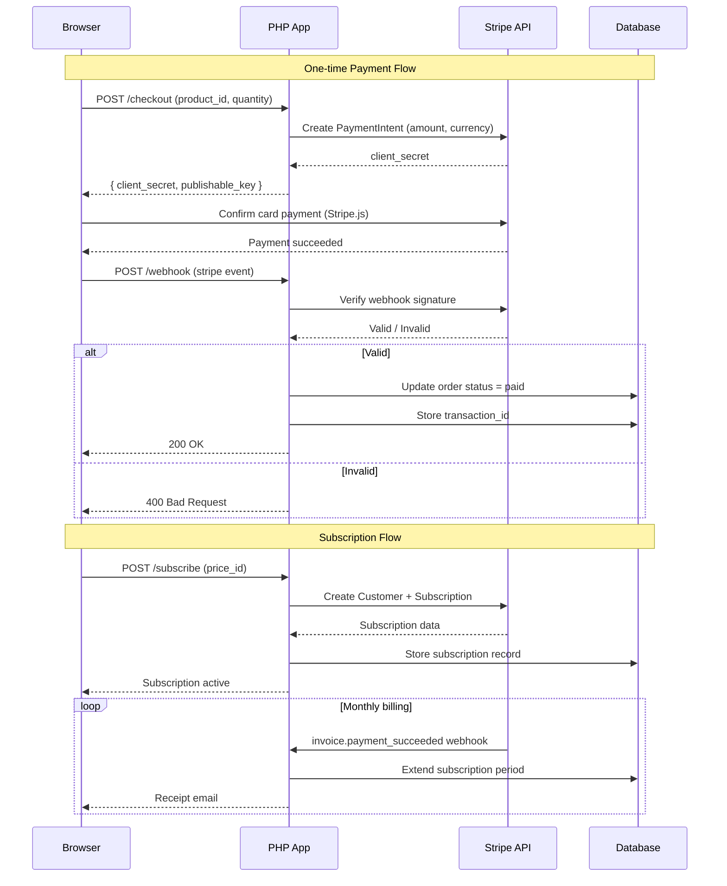

# Chapter 16: Payment Integration

## Learning Objectives

- Integrate Stripe payment processing
- Handle subscriptions and webhooks
- Process refunds
- Implement PCI compliance

---



## 16.1 Stripe Integration

```php
<?php
namespace App\Billing;

use Stripe\Stripe;
use Stripe\PaymentIntent;
use Stripe\Customer;
use Stripe\Subscription;
use Stripe\Webhook;

class StripeService
{
    public function __construct()
    {
        Stripe::setApiKey($_ENV['STRIPE_SECRET_KEY']);
    }

    public function createPaymentIntent(float $amount, string $currency = 'usd'): PaymentIntent
    {
        return PaymentIntent::create([
            'amount' => (int)($amount * 100), // Cents
            'currency' => $currency,
            'payment_method_types' => ['card'],
            'metadata' => [
                'integration' => 'php-mastery',
            ],
        ]);
    }

    public function createCustomer(string $email, string $name, ?string $paymentMethodId = null): Customer
    {
        $customerData = [
            'email' => $email,
            'name' => $name,
        ];

        if ($paymentMethodId) {
            $customerData['payment_method'] = $paymentMethodId;
        }

        return Customer::create($customerData);
    }

    public function createSubscription(string $customerId, string $priceId): Subscription
    {
        return Subscription::create([
            'customer' => $customerId,
            'items' => [['price' => $priceId]],
            'payment_behavior' => 'default_incomplete',
            'expand' => ['latest_invoice.payment_intent'],
        ]);
    }

    public function handleWebhook(string $payload, string $sigHeader): array
    {
        $event = Webhook::constructEvent(
            $payload,
            $sigHeader,
            $_ENV['STRIPE_WEBHOOK_SECRET']
        );

        return match ($event->type) {
            'payment_intent.succeeded' => $this->handlePaymentSucceeded($event),
            'payment_intent.payment_failed' => $this->handlePaymentFailed($event),
            'customer.subscription.updated' => $this->handleSubscriptionUpdated($event),
            'customer.subscription.deleted' => $this->handleSubscriptionDeleted($event),
            'invoice.payment_succeeded' => $this->handleInvoicePaid($event),
            default => ['received' => true],
        };
    }

    private function handlePaymentSucceeded($event): array
    {
        $paymentIntent = $event->data->object;
        // Update order status, send confirmation
        return ['status' => 'success'];
    }

    private function handlePaymentFailed($event): array
    {
        $paymentIntent = $event->data->object;
        // Notify customer about failed payment
        return ['status' => 'failed'];
    }
}
```

---

## 16.2 Exercises

1. Integrate Stripe Checkout for one-time payments
2. Implement subscription plans with Stripe Billing
3. Handle Stripe webhooks for payment lifecycle events
4. Add PayPal as a secondary payment provider

---

## Further Reading

- **Doc:** [Stripe PHP SDK](https://stripe.com/docs/api/php)
- **Doc:** [PCI Compliance Guide](https://stripe.com/docs/security)
