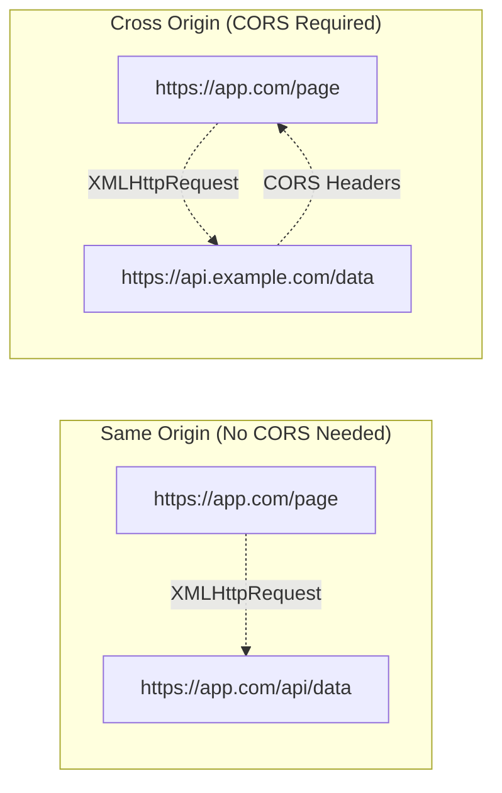
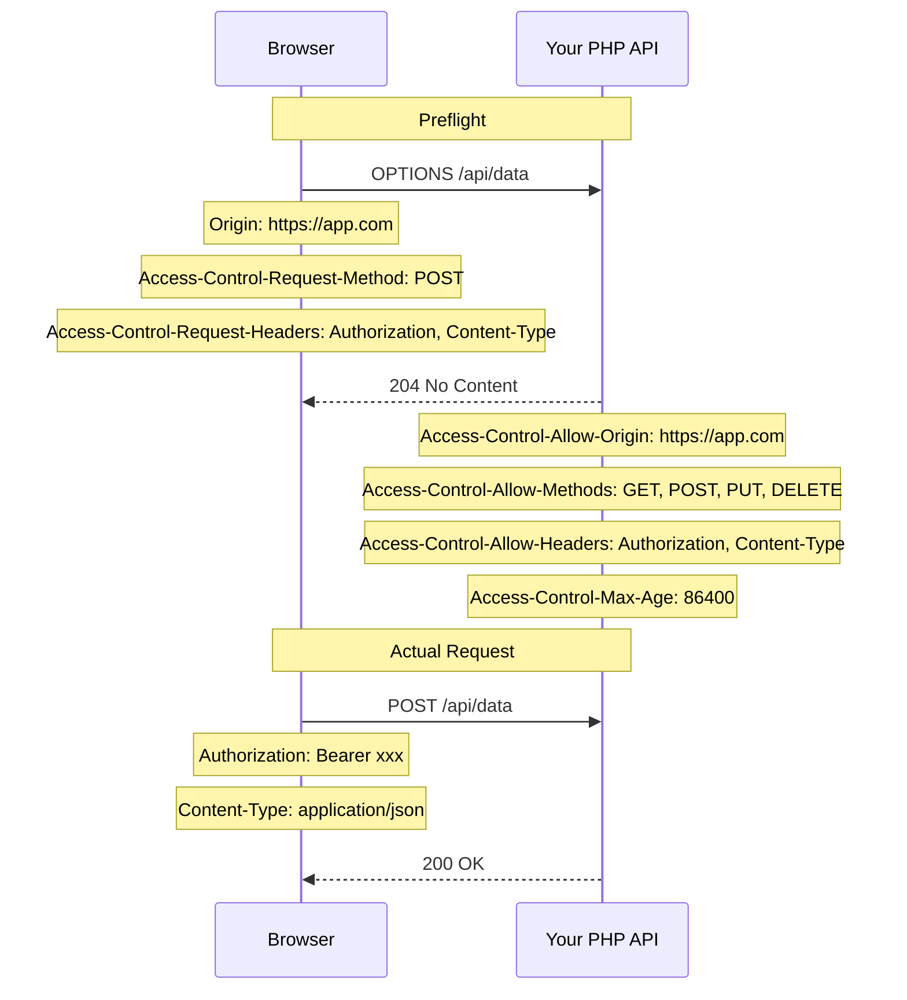

# Chapter 21: CORS Deep Dive

## Learning Objectives

By the end of this chapter you will:
- Understand what CORS is and why browsers enforce it
- Differentiate between simple and preflighted requests
- Handle CORS for different HTTP methods and headers
- Implement CORS middleware in PHP
- Debug CORS errors effectively
- Secure your API against CORS-based attacks

---

## 21.1 What is CORS?

CORS (Cross-Origin Resource Sharing) is a browser security mechanism that controls which websites can access resources from your server.

Think of it like your apartment building's intercom system:
- **Same-origin** = Someone from your building using the intercom to call you
- **Cross-origin** = Someone from a different building trying to call you
- **CORS** = The intercom settings that decide if you accept the call

### The Same-Origin Policy

By default, browsers block JavaScript from one origin (e.g., `https://app.com`) from making requests to a different origin (`https://api.com`). An "origin" is defined by three things:

```
https://app.com:443/api/users
│       │      │   │
│       │      │   └── path (not part of origin)
│       │      └────── port
│       └───────────── host
└───────────────────── scheme
```

| URL A | URL B | Same Origin? |
|-------|-------|-------------|
| `https://app.com/page1` | `https://app.com/page2` | ✅ Yes (same scheme, host, port) |
| `https://app.com` | `http://app.com` | ❌ Different scheme |
| `https://app.com` | `https://api.app.com` | ❌ Different host |
| `https://app.com` | `https://app.com:8080` | ❌ Different port |

### When CORS Is Needed



Your PHP API needs CORS when:
- A JavaScript SPA (Vue, React) on `app.com` calls your API on `api.com`
- A third-party developer builds an app using your public API
- Your admin panel is on `admin.app.com` and your API is on `api.app.com`

---

## 21.2 Simple Requests vs Preflighted Requests

### Simple Requests

A request is "simple" if ALL of these are true:
- Method is `GET`, `HEAD`, or `POST`
- Only these headers: `Accept`, `Accept-Language`, `Content-Language`, `Content-Type`
- `Content-Type` is one of: `application/x-www-form-urlencoded`, `multipart/form-data`, `text/plain`

Simple requests are sent directly. The browser checks the response headers:

```text
Request:
GET /api/data HTTP/1.1
Origin: https://app.com

Response (if allowed):
Access-Control-Allow-Origin: https://app.com
```

### Preflighted Requests

If the request isn't "simple," the browser sends a **preflight** `OPTIONS` request first to ask permission:



Preflight is triggered by:
- Methods other than GET/HEAD/POST: `PUT`, `DELETE`, `PATCH`
- Custom headers: `Authorization`, `X-Requested-With`, `X-CSRF-Token`
- Non-standard Content-Type: `application/json`

---

## 21.3 CORS Headers Reference

### Response Headers (Your PHP Server Sends These)

| Header | Purpose | Example |
|--------|---------|---------|
| `Access-Control-Allow-Origin` | Which origins are allowed | `https://app.com` or `*` |
| `Access-Control-Allow-Methods` | Which HTTP methods are allowed | `GET, POST, PUT, DELETE` |
| `Access-Control-Allow-Headers` | Which headers the request can include | `Content-Type, Authorization` |
| `Access-Control-Expose-Headers` | Which headers JS can read | `X-Request-Id, X-RateLimit-Remaining` |
| `Access-Control-Max-Age` | How long to cache preflight (seconds) | `86400` |
| `Access-Control-Allow-Credentials` | Whether to include cookies/auth | `true` |

### Request Headers (Browser Sends These Automatically)

| Header | Purpose | Example |
|--------|---------|---------|
| `Origin` | Where the request comes from | `https://app.com` |
| `Access-Control-Request-Method` | Which method the actual request will use | `POST` |
| `Access-Control-Request-Headers` | Which headers the actual request will include | `Authorization, Content-Type` |

---

## 21.4 PHP CORS Middleware

```php
<?php
/**
 * Comprehensive CORS middleware for PHP APIs
 */
class CorsMiddleware
{
    private array $allowedOrigins;
    private array $allowedMethods = ['GET', 'POST', 'PUT', 'PATCH', 'DELETE', 'OPTIONS'];
    private array $allowedHeaders = ['Content-Type', 'Authorization', 'X-Requested-With', 'X-CSRF-TOKEN', 'Accept'];
    private array $exposedHeaders = ['X-Request-Id', 'X-RateLimit-Remaining', 'X-RateLimit-Reset'];
    private int $maxAge = 86400; // 24 hours
    private bool $allowCredentials = true;

    public function __construct(array $allowedOrigins = [])
    {
        $this->allowedOrigins = $allowedOrigins ?: ['*'];
    }

    public function handle(callable $next): void
    {
        $origin = $_SERVER['HTTP_ORIGIN'] ?? '';

        // Handle preflight
        if ($_SERVER['REQUEST_METHOD'] === 'OPTIONS') {
            $this->sendPreflightResponse($origin);
            return;
        }

        // Validate origin for actual request
        if (!$this->isOriginAllowed($origin)) {
            $next(); // Let the request proceed, just don't add CORS headers
            return;
        }

        // Add CORS headers
        $this->addCorsHeaders($origin);

        // Handle credentialed requests
        if ($this->allowCredentials && $origin !== '') {
            // When credentials are allowed, Allow-Origin cannot be '*'
        }

        $next();
    }

    private function sendPreflightResponse(string $origin): void
    {
        http_response_code(204);

        if ($this->isOriginAllowed($origin)) {
            $this->addCorsHeaders($origin);
            header("Access-Control-Allow-Methods: " . implode(', ', $this->allowedMethods));
            header("Access-Control-Allow-Headers: " . implode(', ', $this->allowedHeaders));
            header("Access-Control-Max-Age: {$this->maxAge}");
        }

        exit;
    }

    private function addCorsHeaders(string $origin): void
    {
        if (in_array('*', $this->allowedOrigins) && !$this->allowCredentials) {
            header("Access-Control-Allow-Origin: *");
        } else {
            header("Access-Control-Allow-Origin: {$origin}");
            header("Vary: Origin");
        }

        if ($this->allowCredentials) {
            header("Access-Control-Allow-Credentials: true");
        }

        if (!empty($this->exposedHeaders)) {
            header("Access-Control-Expose-Headers: " . implode(', ', $this->exposedHeaders));
        }
    }

    private function isOriginAllowed(string $origin): bool
    {
        // Wildcard accepts all
        if (in_array('*', $this->allowedOrigins)) {
            return true;
        }

        // Check exact match
        if (in_array($origin, $this->allowedOrigins)) {
            return true;
        }

        // Check wildcard subdomain patterns
        foreach ($this->allowedOrigins as $allowed) {
            if (str_contains($allowed, '*')) {
                $pattern = '/^' . str_replace('\*', '.*', preg_quote($allowed, '/')) . '$/';
                if (preg_match($pattern, $origin)) {
                    return true;
                }
            }
        }

        return false;
    }

    // Fluent configuration
    public function allowCredentials(bool $allow): self
    {
        $this->allowCredentials = $allow;
        return $this;
    }

    public function exposeHeaders(array $headers): self
    {
        $this->exposedHeaders = $headers;
        return $this;
    }

    public function setMaxAge(int $seconds): self
    {
        $this->maxAge = $seconds;
        return $this;
    }
}
```

---

## 21.5 CORS Configuration by Use Case

### Public API (Open to All)

```php
<?php
// Public API — any website can call it
header("Access-Control-Allow-Origin: *");
header("Access-Control-Allow-Methods: GET, POST");
header("Access-Control-Allow-Headers: Content-Type");
```

### Private API (Single Frontend)

```php
<?php
$allowedOrigin = 'https://myapp.com';
$origin = $_SERVER['HTTP_ORIGIN'] ?? '';

if ($origin === $allowedOrigin) {
    header("Access-Control-Allow-Origin: {$allowedOrigin}");
    header("Vary: Origin");
    header("Access-Control-Allow-Credentials: true");
    header("Access-Control-Allow-Methods: GET, POST, PUT, DELETE, PATCH");
    header("Access-Control-Allow-Headers: Content-Type, Authorization, X-CSRF-TOKEN");
    header("Access-Control-Expose-Headers: X-Request-Id");
    header("Access-Control-Max-Age: 86400");
}

if ($_SERVER['REQUEST_METHOD'] === 'OPTIONS') {
    http_response_code(204);
    exit;
}
```

### Multi-Tenant SaaS (Dynamic Origins)

```php
<?php
class DynamicCorsMiddleware
{
    private array $tenantOrigins;

    public function __construct()
    {
        // Load from database or config
        $this->tenantOrigins = [
            'customer1.com',
            'customer2.com',
            '*.mycustomers.io',
        ];
    }

    public function handle(): void
    {
        $origin = $_SERVER['HTTP_ORIGIN'] ?? '';

        if ($this->isAllowedTenant($origin)) {
            header("Access-Control-Allow-Origin: {$origin}");
            header("Vary: Origin");
            header("Access-Control-Allow-Credentials: true");
            header("Access-Control-Allow-Methods: GET, POST");
            header("Access-Control-Allow-Headers: Content-Type, Authorization");
            header("Access-Control-Max-Age: 3600");
        }

        if ($_SERVER['REQUEST_METHOD'] === 'OPTIONS') {
            http_response_code(204);
            exit;
        }
    }

    private function isAllowedTenant(string $origin): bool
    {
        $host = parse_url($origin, PHP_URL_HOST);

        foreach ($this->tenantOrigins as $pattern) {
            if (fnmatch($pattern, $host)) {
                return true;
            }
        }

        return false;
    }
}
```

---

## 21.6 CORS and Sessions/Credentials

When your API needs cookies or HTTP authentication, you must:

1. Set `Access-Control-Allow-Credentials: true`
2. Set `Access-Control-Allow-Origin` to the **exact** origin (not `*`)
3. The frontend must set `withCredentials: true`

```php
<?php
// PHP — must use exact origin, not wildcard
$origin = $_SERVER['HTTP_ORIGIN'] ?? '';
$allowedOrigins = ['https://myapp.com', 'https://admin.myapp.com'];

if (in_array($origin, $allowedOrigins)) {
    header("Access-Control-Allow-Origin: {$origin}");
    header("Vary: Origin");
    header("Access-Control-Allow-Credentials: true");
    header("Access-Control-Allow-Methods: POST, GET, OPTIONS");
    header("Access-Control-Allow-Headers: Content-Type");
}
```

```javascript
// Frontend (JavaScript) — must enable credentials
fetch('https://api.example.com/profile', {
    credentials: 'include', // Sends cookies
});
```

---

## 21.7 Debugging CORS Errors

### Common CORS Errors

| Browser Error | Cause | Fix |
|---------------|-------|-----|
| `No 'Access-Control-Allow-Origin' header` | Server didn't send CORS headers | Add CORS middleware |
| `Origin 'X' is not allowed` | Origin not in allowed list | Add origin to whitelist |
| `Method PUT not allowed by preflight` | Method not in Allow-Methods | Add method to allowed list |
| `Request header field X-Custom not allowed` | Custom header not whitelisted | Add header to Allow-Headers |
| `Credentials flag is 'true', but Allow-Origin is '*'` | Can't use credentials with wildcard | Use exact origin |

### Debugging Checklist

```php
<?php
/**
 * CORS Debugging Helper
 * Add to your API to see CORS-related request info
 */
class CorsDebugger
{
    public static function dump(): void
    {
        header('Content-Type: text/plain');

        echo "CORS Debug Report\n";
        echo "=================\n\n";

        echo "Origin: " . ($_SERVER['HTTP_ORIGIN'] ?? '(none)') . "\n";
        echo "Method: " . $_SERVER['REQUEST_METHOD'] . "\n";
        echo "Requested With: " . ($_SERVER['HTTP_X_REQUESTED_WITH'] ?? '(none)') . "\n\n";

        echo "Request Headers Sent:\n";
        foreach ($_SERVER as $key => $value) {
            if (str_starts_with($key, 'HTTP_')) {
                $header = str_replace('_', '-', substr($key, 5));
                echo "  {$header}: {$value}\n";
            }
        }

        echo "\nSuggested CORS Configuration:\n";
        echo "  Access-Control-Allow-Origin: " . ($_SERVER['HTTP_ORIGIN'] ?? '*') . "\n";
        echo "  Access-Control-Allow-Methods: GET, POST, PUT, PATCH, DELETE, OPTIONS\n";
        echo "  Access-Control-Allow-Headers: Content-Type, Authorization, X-Requested-With\n";
        echo "  Access-Control-Max-Age: 86400\n";

        if (isset($_SERVER['HTTP_ORIGIN'])) {
            echo "  Access-Control-Allow-Credentials: true\n";
        }
    }
}
```

---

## 21.8 CORS Security Considerations

```php
<?php
// DANGEROUS: Never blindly reflect the Origin header
header("Access-Control-Allow-Origin: " . $_SERVER['HTTP_ORIGIN']);

// Why it's dangerous:
// An attacker's site evil.com sends a request with:
// Origin: https://evil.com
// Your server reflects it back, allowing the cross-origin attack!

// SAFE: Always validate the origin
$allowed = ['https://myapp.com', 'https://admin.myapp.com'];
$origin = $_SERVER['HTTP_ORIGIN'] ?? '';

if (in_array($origin, $allowed)) {
    header("Access-Control-Allow-Origin: {$origin}");
    header("Vary: Origin");
}
```

### Security Best Practices

1. **Never use `*` with credentials** — It's invalid by spec
2. **Never reflect Origin blindly** — Validate against a whitelist
3. **Use `Vary: Origin`** — Let CDNs/caches differentiate by origin
4. **Be specific with methods** — Don't allow DELETE if it's read-only
5. **Limit preflight cache** — 24 hours max, shorter for sensitive APIs
6. **Don't expose unnecessary headers** — Only expose what the client needs

---

## 21.9 Exercises

1. **Basic CORS:** Create a PHP endpoint that allows requests from one specific origin
2. **CORS middleware:** Build a reusable CORS middleware class
3. **Preflight handling:** Send requests from JavaScript that trigger preflight and debug the headers
4. **Credentials:** Set up a CORS configuration that works with session cookies
5. **Dynamic origins:** Implement a CORS handler that validates against a database of allowed origins

---

## 21.10 Interview Questions

1. "Explain what CORS is and why it exists."
2. "What's the difference between a simple request and a preflighted request?"
3. "Why can't you use `Access-Control-Allow-Origin: *` with credentials?"
4. "How would you debug a CORS error?"
5. "What is the `Vary: Origin` header used for?"
6. "How do you handle CORS for a multi-tenant SaaS application?"
7. "What security risks are associated with misconfigured CORS?"

---

## Further Reading

- **MDN:** [CORS documentation](https://developer.mozilla.org/en-US/docs/Web/HTTP/CORS)
- **Spec:** [Fetch API: CORS protocol](https://fetch.spec.whatwg.org/#http-cors-protocol)
- **Tool:** [CORS Test](https://cors-test.codehappy.dev/) — Test your CORS configuration
- **Tool:** [curl with Origin](https://curl.se/) — `curl -H "Origin: https://app.com" -v https://api.com`
- **Resource:** [CORS Errors in Chrome DevTools](https://developer.chrome.com/docs/devtools/network/cors/)

---

*End of Chapter 21. Proceed to Chapter 22: Localization and Internationalization.*
