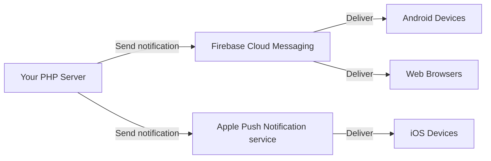

# Chapter 24: Push Notifications

## Learning Objectives

By the end of this chapter you will:
- Understand push notification architecture
- Send push notifications via Firebase Cloud Messaging (FCM)
- Implement Web Push notifications from PHP
- Send APNs notifications for iOS devices
- Manage device tokens and notification preferences
- Build a notification queue system

---

## 24.1 What are Push Notifications?

Push notifications are messages sent from your server to a user's device — even when the user isn't actively using your app. They appear as banners, badges, or sounds on mobile and desktop.



### Use Cases

| Use Case | Example |
|----------|---------|
| Social | New follower, like, comment |
| Messaging | New message, @mention |
| E-commerce | Order confirmation, shipping update |
| Reminder | Appointment, payment due |
| Alert | Account compromise, login from new device |

---

## 24.2 Firebase Cloud Messaging (FCM)

### Setup

```bash
composer require kreait/firebase-php
```

```php
<?php
use Kreait\Firebase\Factory;
use Kreait\Firebase\Messaging\CloudMessage;
use Kreait\Firebase\Messaging\Notification;

class FcmService
{
    private $messaging;

    public function __construct()
    {
        $factory = (new Factory())
            ->withServiceAccount(getenv('FIREBASE_CREDENTIALS'));

        $this->messaging = $factory->createMessaging();
    }

    // Send to a single device
    public function sendToDevice(string $deviceToken, string $title, string $body, array $data = []): string
    {
        $message = CloudMessage::withTarget('token', $deviceToken)
            ->withNotification(Notification::create($title, $body))
            ->withData($data);

        return $this->messaging->send($message);
    }

    // Send to multiple devices (topic-based)
    public function sendToTopic(string $topic, string $title, string $body, array $data = []): string
    {
        $message = CloudMessage::withTarget('topic', $topic)
            ->withNotification(Notification::create($title, $body))
            ->withData($data);

        return $this->messaging->send($message);
    }

    // Send to multiple specific devices (batch)
    public function sendToDevices(array $tokens, string $title, string $body, array $data = []): array
    {
        $message = CloudMessage::new()
            ->withNotification(Notification::create($title, $body))
            ->withData($data);

        $results = $this->messaging->sendMulticast($message, $tokens);

        return [
            'success_count' => $results->successes()->count(),
            'failure_count' => $results->failures()->count(),
            'failures' => $results->failures()->map(function ($failure) {
                return [
                    'token' => $failure->target()->value(),
                    'error' => $failure->error()->getMessage(),
                ];
            })->toArray(),
        ];
    }

    // Send with custom payload (for data-only messages)
    public function sendDataMessage(string $deviceToken, array $data): string
    {
        $message = CloudMessage::withTarget('token', $deviceToken)
            ->withData($data);

        return $this->messaging->send($message);
    }

    // Subscribe device to topic
    public function subscribeToTopic(string $topic, string $deviceToken): void
    {
        $this->messaging->subscribeToTopic($topic, $deviceToken);
    }

    // Unsubscribe from topic
    public function unsubscribeFromTopic(string $topic, string $deviceToken): void
    {
        $this->messaging->unsubscribeFromTopic($topic, $deviceToken);
    }
}

// Usage
$fcm = new FcmService();

// Simple notification
$fcm->sendToDevice(
    $deviceToken,
    'New Message',
    'Alice sent you a message',
    ['conversation_id' => '123']
);

// Topic notification (all subscribers)
$fcm->sendToTopic('promotions', 'Flash Sale!', '50% off everything today');
```

---

## 24.3 Web Push Notifications

Web Push lets you send notifications to browsers, even when the site isn't open.

### Service Worker (Frontend)

```javascript
// service-worker.js
self.addEventListener('push', function(event) {
    const data = event.data.json();

    const options = {
        body: data.body,
        icon: data.icon || '/icon.png',
        badge: data.badge || '/badge.png',
        image: data.image,
        vibrate: [200, 100, 200],
        data: {
            url: data.url || '/',
        },
        actions: data.actions || [],
        tag: data.tag || 'default',
        renotify: true,
        requireInteraction: true,
    };

    event.waitUntil(
        self.registration.showNotification(data.title, options)
    );
});

self.addEventListener('notificationclick', function(event) {
    event.notification.close();
    event.waitUntil(
        clients.openWindow(event.notification.data.url)
    );
});
```

### PHP Backend (Sending Web Push)

```bash
composer require minishlink/web-push
```

```php
<?php
use Minishlink\WebPush\WebPush;
use Minishlink\WebPush\Subscription;

class WebPushService
{
    private WebPush $webPush;

    public function __construct()
    {
        // Generate VAPID keys: https://web-push-codelab.glitch.me/
        $auth = [
            'VAPID' => [
                'subject' => 'https://myapp.com',
                'publicKey' => getenv('VAPID_PUBLIC_KEY'),
                'privateKey' => getenv('VAPID_PRIVATE_KEY'),
            ],
        ];

        $this->webPush = new WebPush($auth);
    }

    // Send to a single subscription
    public function send(
        string $endpoint,
        string $authKey,
        string $p256dhKey,
        string $title,
        string $body,
        array $options = []
    ): bool {
        $subscription = Subscription::create([
            'endpoint' => $endpoint,
            'authToken' => $authKey,
            'publicKey' => $p256dhKey,
        ]);

        $payload = json_encode(array_merge([
            'title' => $title,
            'body' => $body,
            'icon' => $options['icon'] ?? '/icons/icon-192.png',
            'badge' => $options['badge'] ?? '/icons/badge-72.png',
            'url' => $options['url'] ?? '/',
            'tag' => $options['tag'] ?? null,
            'actions' => $options['actions'] ?? [],
        ], $options['extra'] ?? []));

        $this->webPush->queueNotification($subscription, $payload);

        // Flush (send all queued)
        foreach ($this->webPush->flush() as $report) {
            if (!$report->isSuccess()) {
                // Subscription expired — remove from DB
                error_log("Web Push failed: {$report->getReason()}");
                return false;
            }
        }

        return true;
    }

    // Send to multiple subscribers
    public function sendBulk(array $subscriptions, string $title, string $body): array
    {
        $results = [];

        foreach ($subscriptions as $sub) {
            $success = $this->send(
                $sub['endpoint'],
                $sub['auth_key'],
                $sub['p256dh_key'],
                $title,
                $body
            );
            $results[] = [
                'endpoint' => $sub['endpoint'],
                'success' => $success,
            ];
        }

        return $results;
    }
}
```

### Saving Subscriptions

```php
<?php
class WebPushSubscriptionController
{
    private PDO $db;

    public function __construct(PDO $db)
    {
        $this->db = $db;
    }

    // Called from browser JavaScript
    public function subscribe(int $userId): void
    {
        $data = json_decode(file_get_contents('php://input'), true);

        $stmt = $this->db->prepare(
            'INSERT INTO push_subscriptions (user_id, endpoint, auth_key, p256dh_key, device_name)
             VALUES (?, ?, ?, ?, ?)
             ON DUPLICATE KEY UPDATE auth_key = VALUES(auth_key), p256dh_key = VALUES(p256dh_key), updated_at = NOW()'
        );

        $stmt->execute([
            $userId,
            $data['endpoint'],
            $data['keys']['auth'],
            $data['keys']['p256dh'],
            $data['device_name'] ?? gethostname(),
        ]);

        http_response_code(201);
        echo json_encode(['status' => 'subscribed']);
    }

    // Called when user unsubscribes
    public function unsubscribe(int $userId): void
    {
        $data = json_decode(file_get_contents('php://input'), true);

        $stmt = $this->db->prepare(
            'DELETE FROM push_subscriptions WHERE user_id = ? AND endpoint = ?'
        );
        $stmt->execute([$userId, $data['endpoint']]);

        echo json_encode(['status' => 'unsubscribed']);
    }

    // Get user's active subscriptions
    public function getUserSubscriptions(int $userId): array
    {
        $stmt = $this->db->prepare(
            'SELECT endpoint, auth_key, p256dh_key, device_name
             FROM push_subscriptions WHERE user_id = ?'
        );
        $stmt->execute([$userId]);

        return $stmt->fetchAll(PDO::FETCH_ASSOC);
    }
}
```

---

## 24.4 Apple Push Notification Service (APNs)

```bash
composer require sallyx/sallyx-apns
```

```php
<?php
class ApnsService
{
    private string $keyPath;
    private string $keyId;
    private string $teamId;
    private string $bundleId;

    public function __construct()
    {
        $this->keyPath = getenv('APNS_KEY_PATH');
        $this->keyId = getenv('APNS_KEY_ID');
        $this->teamId = getenv('APNS_TEAM_ID');
        $this->bundleId = getenv('APNS_BUNDLE_ID');
    }

    public function send(string $deviceToken, string $title, string $body, array $extra = []): bool
    {
        // Build JWT token for APNs authentication
        $header = [
            'alg' => 'ES256',
            'kid' => $this->keyId,
        ];

        $claims = [
            'iss' => $this->teamId,
            'iat' => time(),
        ];

        $jwt = $this->encodeJWT($header, $claims);

        // Build notification payload
        $payload = [
            'aps' => [
                'alert' => [
                    'title' => $title,
                    'body' => $body,
                ],
                'sound' => 'default',
                'badge' => $extra['badge'] ?? 1,
                'category' => $extra['category'] ?? null,
                'mutable-content' => $extra['mutable'] ?? 0,
            ],
        ];

        if (!empty($extra['data'])) {
            $payload['data'] = $extra['data'];
        }

        // Send via HTTP/2 to APNs
        $url = "https://api.push.apple.com/3/device/{$deviceToken}";

        $ch = curl_init();
        curl_setopt_array($ch, [
            CURLOPT_URL => $url,
            CURLOPT_POST => true,
            CURLOPT_POSTFIELDS => json_encode($payload),
            CURLOPT_HTTPHEADER => [
                "authorization: bearer {$jwt}",
                "apns-push-type: alert",
                "apns-topic: {$this->bundleId}",
                "apns-priority: 10",
            ],
            CURLOPT_RETURNTRANSFER => true,
            CURLOPT_HTTP_VERSION => CURL_HTTP_VERSION_2_0,
        ]);

        $response = curl_exec($ch);
        $httpCode = curl_getinfo($ch, CURLINFO_HTTP_CODE);
        curl_close($ch);

        if ($httpCode === 410) {
            // Device token expired — remove from database
            error_log("APNs token expired: {$deviceToken}");
            return false;
        }

        return $httpCode === 200;
    }

    private function encodeJWT(array $header, array $claims): string
    {
        $privateKey = file_get_contents($this->keyPath);
        $segment1 = $this->base64UrlEncode(json_encode($header));
        $segment2 = $this->base64UrlEncode(json_encode($claims));

        openssl_sign("{$segment1}.{$segment2}", $signature, $privateKey, 'sha256');

        return "{$segment1}.{$segment2}." . $this->base64UrlEncode($signature);
    }

    private function base64UrlEncode(string $data): string
    {
        return rtrim(strtr(base64_encode($data), '+/', '-_'), '=');
    }
}
```

---

## 24.5 Notification Queue System

For production, never send notifications synchronously during HTTP requests. Use a queue:

```php
<?php
/**
 * Unified notification service that queues push notifications
 */
class NotificationService
{
    private array $channels = [];
    private array $queue = [];

    public function __construct()
    {
        $this->channels = [
            'fcm' => new FcmService(),
            'web_push' => new WebPushService(),
            'apns' => new ApnsService(),
        ];
    }

    // Queue a notification for later delivery
    public function queue(int $userId, string $title, string $body, array $options = []): void
    {
        $this->queue[] = [
            'user_id' => $userId,
            'title' => $title,
            'body' => $body,
            'options' => $options,
            'queued_at' => time(),
        ];
    }

    // Process the queue (call from a worker)
    public function processQueue(): array
    {
        $results = [];

        foreach ($this->queue as $notification) {
            $result = $this->deliverToUser(
                $notification['user_id'],
                $notification['title'],
                $notification['body'],
                $notification['options']
            );
            $results[] = $result;
        }

        $this->queue = [];
        return $results;
    }

    // Deliver to a user across all their devices
    private function deliverToUser(int $userId, string $title, string $body, array $options): array
    {
        $results = [];

        // Get user's device tokens and preferences
        $preferences = $this->getUserPreferences($userId);
        $tokens = $this->getUserDeviceTokens($userId);

        // Check if user has notifications enabled
        if (!$preferences['push_enabled']) {
            return ['skipped' => true, 'reason' => 'user_disabled'];
        }

        // Send FCM (Android + some iOS)
        if (!empty($tokens['fcm'])) {
            $results['fcm'] = $this->channels['fcm']->sendToDevices(
                $tokens['fcm'],
                $title,
                $body,
                $options['data'] ?? []
            );
        }

        // Send Web Push
        if (!empty($tokens['web_push'])) {
            $results['web_push'] = $this->channels['web_push']->sendBulk(
                $tokens['web_push'],
                $title,
                $body
            );
        }

        // Send APNs (iOS)
        if (!empty($tokens['apns'])) {
            foreach ($tokens['apns'] as $token) {
                $results['apns'][] = [
                    'token' => $token,
                    'success' => $this->channels['apns']->send($token, $title, $body, $options),
                ];
            }
        }

        return $results;
    }

    private function getUserPreferences(int $userId): array
    {
        // Load from database
        return [
            'push_enabled' => true,
            'quiet_hours_start' => null,
            'quiet_hours_end' => null,
        ];
    }

    private function getUserDeviceTokens(int $userId): array
    {
        // Load from database
        $pdo = Database::getConnection();
        $stmt = $pdo->prepare('SELECT platform, device_token FROM user_devices WHERE user_id = ?');
        $stmt->execute([$userId]);
        $devices = $stmt->fetchAll(PDO::FETCH_ASSOC);

        $tokens = ['fcm' => [], 'apns' => [], 'web_push' => []];
        foreach ($devices as $device) {
            $tokens[$device['platform']][] = $device['device_token'];
        }

        return $tokens;
    }
}
```

---

## 24.6 Notification Templates

```php
<?php
class NotificationTemplates
{
    private array $templates = [
        'new_message' => [
            'title' => 'New Message from :sender',
            'body' => ':sender: :preview',
            'icon' => '/icons/message.png',
        ],
        'order_confirmed' => [
            'title' => 'Order #:order_id Confirmed',
            'body' => 'Your order of :total has been confirmed',
            'actions' => [
                ['action' => 'view_order', 'title' => 'View Order'],
            ],
        ],
        'payment_received' => [
            'title' => 'Payment Received',
            'body' => 'You received :amount from :sender',
        ],
        'login_alert' => [
            'title' => 'New Login Detected',
            'body' => 'A new login from :device in :location',
            'tag' => 'security',
            'actions' => [
                ['action' => 'secure_account', 'title' => 'Secure Account'],
            ],
        ],
        'weekly_digest' => [
            'title' => 'Your Weekly Summary',
            'body' => ':new_messages new messages, :new_followers new followers',
            'badge' => ':unread_count',
        ],
    ];

    public function render(string $template, array $params): array
    {
        if (!isset($this->templates[$template])) {
            throw new \InvalidArgumentException("Unknown template: {$template}");
        }

        $rendered = $this->templates[$template];

        // Replace placeholders
        array_walk_recursive($rendered, function (&$value) use ($params) {
            foreach ($params as $key => $paramValue) {
                $value = str_replace(":{$key}", $paramValue, $value);
            }
        });

        return $rendered;
    }

    public function all(): array
    {
        return array_keys($this->templates);
    }
}
```

---

## 24.7 Exercises

1. **FCM setup:** Send a push notification to a device using Firebase Cloud Messaging
2. **Web Push:** Implement browser push notifications with VAPID authentication
3. **Subscription management:** Build a database model for storing device tokens
4. **Notification preferences:** Create a UI for users to enable/disable notification types
5. **Notification queue:** Implement a queue-based notification system with a worker
6. **Multi-platform:** Send the same notification to Android, iOS, and Web

---

## 24.8 Interview Questions

1. "How do push notifications work at a high level?"
2. "What's the difference between FCM, APNs, and Web Push?"
3. "How do you handle expired device tokens?"
4. "Why should you queue notifications instead of sending them synchronously?"
5. "How would you implement quiet hours for push notifications?"
6. "What is VAPID and why is it needed for Web Push?"
7. "How do you handle notification delivery guarantees?"

---

## Further Reading

- **Documentation:** [Firebase Cloud Messaging](https://firebase.google.com/docs/cloud-messaging)
- **Documentation:** [Web Push API (MDN)](https://developer.mozilla.org/en-US/docs/Web/API/Push_API)
- **Documentation:** [Apple Push Notification Service](https://developer.apple.com/documentation/usernotifications)
- **Library:** [minishlink/web-push](https://github.com/web-push-libs/web-push-php)
- **Library:** [kreait/firebase-php](https://github.com/kreait/firebase-php)
- **Tool:** [Web Push Codelab](https://web-push-codelab.glitch.me/) — Generate VAPID keys

---

*End of Chapter 24. Proceed to Level 5: Modern PHP Ecosystem.*
