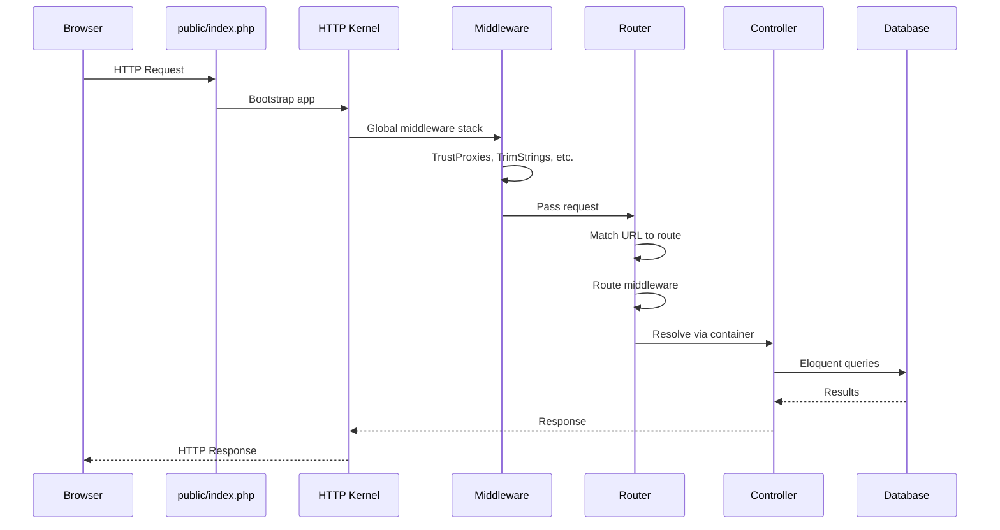

# Chapter 5: Laravel Fundamentals

## Learning Objectives

By the end of this chapter you will:
- Understand Laravel's architecture and request lifecycle
- Master routing, controllers, and Blade templating
- Use the service container and dependency injection
- Implement middleware, validation, and form requests
- Build and configure a complete Laravel feature

---

## 5.1 Laravel Request Lifecycle



### Entry Point

```php
<?php
// public/index.php
define('LARAVEL_START', microtime(true));

require __DIR__.'/../vendor/autoload.php';

$app = require_once __DIR__.'/../bootstrap/app.php';

$kernel = $app->make(Illuminate\Contracts\Http\Kernel::class);

$response = $kernel->handle(
    $request = Illuminate\Http\Request::capture()
)->send();

$kernel->terminate($request, $response);
```

---

## 5.2 Routing

```php
<?php
// routes/web.php — Stateful routes (session, cookies, CSRF)

// Basic GET route
Route::get('/posts', [PostController::class, 'index']);

// Route parameters
Route::get('/posts/{post}', [PostController::class, 'show']);

// Constraints
Route::get('/users/{user}', [UserController::class, 'show'])
    ->where('user', '[0-9]+'); // Only digits

// Named routes
Route::get('/members', [MemberController::class, 'index'])
    ->name('members.index');

// Prefix groups
Route::prefix('admin')->name('admin.')->middleware('auth')->group(function () {
    Route::get('/dashboard', [AdminController::class, 'dashboard'])->name('dashboard');
    Route::resource('users', AdminUserController::class);
});

// API routes (routes/api.php) — Stateless, no sessions
Route::apiResource('posts', PostApiController::class);
Route::post('/login', [AuthController::class, 'login']);
Route::post('/logout', [AuthController::class, 'logout'])->middleware('auth:sanctum');

// Route model binding — Explicit
Route::get('/posts/{post:slug}', function (Post $post) {
    return view('posts.show', compact('post'));
});

// Fallback route (404 handler)
Route::fallback(function () {
    return response()->json(['message' => 'Not Found'], 404);
});
```

### Artisan Route Commands

```bash
php artisan route:list                    # Show all routes
php artisan route:list --path=api         # Filter by path
php artisan route:list --method=POST      # Filter by method
php artisan route:cache                   # Cache routes (production)
php artisan route:clear                   # Clear cached routes
```

---

## 5.3 Controllers

```php
<?php
// Base controller with DI
class PostController extends Controller
{
    public function __construct(
        private readonly PostRepository $posts,
        private readonly LoggerInterface $logger,
    ) {}

    public function index(): View
    {
        $posts = Post::with('author')
            ->published()
            ->latest()
            ->paginate(perPage: 15);

        return view('posts.index', compact('posts'));
    }

    public function create(): View
    {
        return view('posts.create');
    }

    public function store(StorePostRequest $request): RedirectResponse
    {
        $post = auth()->user()->posts()->create(
            $request->validated()
        );

        $this->logger->info('Post created', ['post_id' => $post->id]);

        return redirect()->route('posts.show', $post)
            ->with('success', 'Post created successfully!');
    }

    public function show(Post $post): View
    {
        return view('posts.show', [
            'post' => $post->load('comments.user'),
        ]);
    }

    public function edit(Post $post): View
    {
        $this->authorize('update', $post);

        return view('posts.edit', compact('post'));
    }

    public function update(UpdatePostRequest $request, Post $post): RedirectResponse
    {
        $this->authorize('update', $post);

        $post->update($request->validated());

        return redirect()->route('posts.show', $post)
            ->with('success', 'Post updated!');
    }

    public function destroy(Post $post): RedirectResponse
    {
        $this->authorize('delete', $post);

        $post->delete();

        return redirect()->route('posts.index')
            ->with('success', 'Post deleted!');
    }
}
```

### Single Action Controllers

```php
<?php
// For simple actions (one method per controller)
Route::post('/newsletter/subscribe', SubscribeToNewsletter::class);

class SubscribeToNewsletter extends Controller
{
    public function __invoke(SubscribeRequest $request): RedirectResponse
    {
        Newsletter::subscribe($request->email());

        return back()->with('success', 'Subscribed!');
    }
}
```

---

## 5.4 Blade Templating

```blade
{{-- resources/views/layouts/app.blade.php --}}
<!DOCTYPE html>
<html lang="{{ str_replace('_', '-', app()->getLocale()) }}">
<head>
    <meta charset="utf-8">
    <meta name="viewport" content="width=device-width, initial-scale=1">
    <meta name="csrf-token" content="{{ csrf_token() }}">
    <title>@yield('title', config('app.name'))</title>
    @vite(['resources/css/app.css', 'resources/js/app.js'])
</head>
<body>
    <x-navbar :user="auth()->user()" />

    <main class="container py-4">
        @if (session('success'))
            <div class="alert alert-success">{{ session('success') }}</div>
        @endif

        @yield('content')
    </main>

    <x-footer />
    @stack('scripts')
</body>
</html>
```

```blade
{{-- resources/views/posts/index.blade.php --}}
@extends('layouts.app')

@section('title', 'Blog Posts')

@section('content')
    <div class="flex justify-between items-center mb-6">
        <h1 class="text-2xl font-bold">Blog Posts</h1>
        @auth
            <a href="{{ route('posts.create') }}" class="btn btn-primary">
                New Post
            </a>
        @endauth
    </div>

    @forelse($posts as $post)
        <article class="card mb-4">
            <div class="card-body">
                <h2 class="card-title">
                    <a href="{{ route('posts.show', $post) }}">{{ $post->title }}</a>
                </h2>
                <p class="text-muted">
                    By {{ $post->author->name }}
                    <time>{{ $post->published_at->diffForHumans() }}</time>
                </p>
                <p>{{ Str::limit($post->content, 200) }}</p>
                <div class="flex gap-2">
                    <span class="badge">{{ $post->comments_count }} comments</span>
                    @foreach($post->tags as $tag)
                        <span class="badge badge-secondary">{{ $tag->name }}</span>
                    @endforeach
                </div>
            </div>
        </article>
    @empty
        <p class="text-center text-muted">No posts yet.</p>
    @endforelse

    {{ $posts->links() }}
@endsection
```

### Blade Components

```blade
{{-- components/alert.blade.php --}}
@props(['type' => 'info'])

@php
    $colors = [
        'success' => 'green',
        'error' => 'red',
        'warning' => 'yellow',
        'info' => 'blue',
    ];
    $color = $colors[$type] ?? 'blue';
@endphp

<div {{ $attributes->merge(['class' => "bg-{$color}-100 border border-{$color}-400 text-{$color}-700 px-4 py-3 rounded"]) }}>
    {{ $slot }}
</div>

{{-- Usage --}}
<x-alert type="success" class="mb-4">
    Post created successfully!
</x-alert>
```

---

## 5.5 Middleware

```php
<?php
namespace App\Http\Middleware;

use Closure;
use Illuminate\Http\Request;

class EnsureEmailIsVerified
{
    public function handle(Request $request, Closure $next): mixed
    {
        if ($request->user() && ! $request->user()->hasVerifiedEmail()) {
            return redirect()->route('verification.notice');
        }

        return $next($request);
    }
}

// With parameters
class RoleMiddleware
{
    public function handle(Request $request, Closure $next, string $role): mixed
    {
        if (! $request->user() || ! $request->user()->hasRole($role)) {
            abort(403, 'Unauthorized.');
        }

        return $next($request);
    }
}
```

```php
<?php
// app/Http/Kernel.php
protected $middleware = [
    \App\Http\Middleware\TrustProxies::class,
    \Illuminate\Http\Middleware\HandleCors::class,
    \App\Http\Middleware\PreventRequestsDuringMaintenance::class,
    \Illuminate\Foundation\Http\Middleware\ValidatePostSize::class,
    \App\Http\Middleware\TrimStrings::class,
    \Illuminate\Foundation\Http\Middleware\ConvertEmptyStringsToNull::class,
];

protected $middlewareGroups = [
    'web' => [
        \App\Http\Middleware\EncryptCookies::class,
        \Illuminate\Cookie\Middleware\AddQueuedCookiesToResponse::class,
        \Illuminate\Session\Middleware\StartSession::class,
        \Illuminate\View\Middleware\ShareErrorsFromSession::class,
        \App\Http\Middleware\VerifyCsrfToken::class,
        \Illuminate\Routing\Middleware\SubstituteBindings::class,
    ],

    'api' => [
        \Laravel\Sanctum\Http\Middleware\EnsureFrontendRequestsAreStateful::class,
        \Illuminate\Routing\Middleware\ThrottleRequests::class.':api',
        \Illuminate\Routing\Middleware\SubstituteBindings::class,
    ],
];
```

---

## 5.6 Validation and Form Requests

```php
<?php
namespace App\Http\Requests;

use Illuminate\Foundation\Http\FormRequest;

class StorePostRequest extends FormRequest
{
    public function authorize(): bool
    {
        // Any authenticated user can create posts
        return auth()->check();
    }

    public function rules(): array
    {
        return [
            'title' => ['required', 'string', 'max:255', 'unique:posts,title'],
            'content' => ['required', 'string', 'min:100'],
            'category_id' => ['required', 'exists:categories,id'],
            'tags' => ['array', 'exists:tags,id'],
            'published_at' => ['nullable', 'date', 'after:now'],
            'cover_image' => ['nullable', 'image', 'mimes:jpg,png,webp', 'max:2048'],
        ];
    }

    public function messages(): array
    {
        return [
            'title.unique' => 'A post with this title already exists.',
            'content.min' => 'Please write at least 100 characters.',
        ];
    }

    public function attributes(): array
    {
        return [
            'category_id' => 'category',
        ];
    }

    protected function prepareForValidation(): void
    {
        $this->merge([
            'slug' => str($this->title)->slug(),
        ]);
    }
}

// In controller, just type-hint the request:
public function store(StorePostRequest $request): RedirectResponse {
    $post = auth()->user()->posts()->create($request->validated());
    // ...
}
```

### Inline Validation

```php
<?php
// In a controller method
public function store(Request $request): RedirectResponse
{
    $validated = $request->validate([
        'title' => 'required|max:255|unique:posts',
        'content' => 'required|min:100',
        'tags' => 'array|exists:tags,id',
    ], [
        'title.required' => 'Every post needs a title!',
    ]);

    Post::create($validated);
}
```

---

## 5.7 Service Container and Dependency Injection

```php
<?php
// app/Providers/AppServiceProvider.php
public function register(): void
{
    // Bind interface to implementation
    $this->app->bind(PaymentGatewayInterface::class, StripeGateway::class);

    // Singleton (same instance every time)
    $this->app->singleton(AnalyticsService::class, function ($app) {
        return new AnalyticsService(config('analytics.api_key'));
    });

    // Instance binding
    $this->app->instance('redis', new RedisClient());

    // Contextual binding (different impl per controller)
    $this->app->when(ReportController::class)
        ->needs(ReportBuilderInterface::class)
        ->give(PdfReportBuilder::class);

    $this->app->when(DashboardController::class)
        ->needs(ReportBuilderInterface::class)
        ->give(HtmlReportBuilder::class);
}

public function boot(): void
{
    // Binding with tag
    $this->app->tag([CsvParser::class, JsonParser::class], 'importers');

    // Resolve tagged
    $this->app->tagged('importers'); // Collection of all importers
}
```

### Service Providers

```php
<?php
// Custom service provider
php artisan make:provider PaymentServiceProvider

class PaymentServiceProvider extends ServiceProvider
{
    public function register(): void
    {
        $this->app->singleton(PaymentManager::class);
    }

    public function boot(): void
    {
        $this->publishes([
            __DIR__.'/../config/payment.php' => config_path('payment.php'),
        ], 'payment-config');

        $this->loadMigrationsFrom(__DIR__.'/../database/migrations');

        $this->loadRoutesFrom(__DIR__.'/../routes/payment.php');
    }
}
```

### Facades

```php
<?php
use Illuminate\Support\Facades\Cache;
use Illuminate\Support\Facades\Log;
use Illuminate\Support\Facades\Redis;
use Illuminate\Support\Facades\Storage;

// Facades provide static access to container services
Cache::remember('trending_posts', 3600, fn() => Post::trending()->get());
Log::channel('slack')->warning('Rate limit hit', ['ip' => $request->ip()]);
Storage::disk('s3')->put('avatars/'.$id.'.jpg', $contents);
```

---

## 5.8 Exercises

1. **Routing:** Create resourceful, named, and grouped routes for a blog
2. **Controllers:** Build CRUD controllers with form requests and authorization
3. **Blade:** Create a layout with components, sections, and slots
4. **Middleware:** Build logging middleware and a throttle middleware
5. **Service container:** Bind an interface to an implementation and resolve it

---

## 5.9 Interview Questions

1. "Walk me through the Laravel request lifecycle."
2. "What is the service container and how does automatic injection work?"
3. "Explain the different types of middleware in Laravel."
4. "What's the difference between a Form Request and inline validation?"
5. "How does Laravel's IoC container resolve dependencies?"

---

## Further Reading

- **Doc:** [Laravel Documentation](https://laravel.com/docs/)
- **Doc:** [Laravel Service Container](https://laravel.com/docs/container)
- **Doc:** [Laravel Blade](https://laravel.com/docs/blade)
- **Book:** "Laravel: Up and Running" by Matt Stauffer

---

*End of Chapter 5. Proceed to Chapter 6: Laravel Eloquent.*
