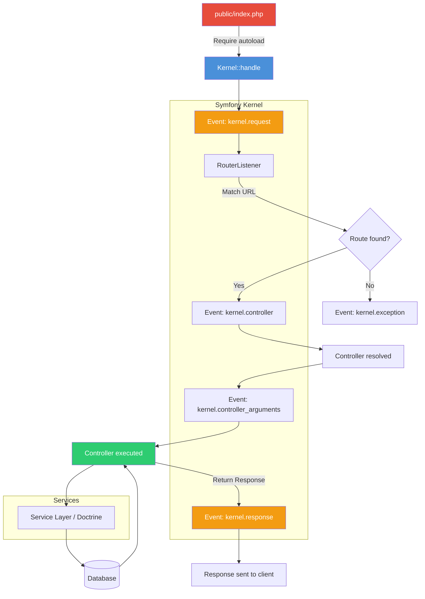

# Chapter 10: Symfony Fundamentals

## Learning Objectives

- Understand Symfony's architecture
- Build applications with bundles
- Use Dependency Injection Container
- Configure services with YAML/attributes

---



## 10.1 Symfony Structure

```php
<?php
// config/services.yaml
services:
    App\Service\PaymentService:
        arguments:
            $apiKey: '%env(STRIPE_API_KEY)%'
            $httpClient: '@App\Http\Client'

    App\Http\Client:
        arguments:
            $timeout: 30

    App\EventListener\PaymentListener:
        tags:
            - { name: kernel.event_listener, event: payment.completed }

// Controller (using attributes)
namespace App\Controller;

use Symfony\Bundle\FrameworkBundle\Controller\AbstractController;
use Symfony\Component\HttpFoundation\Response;
use Symfony\Component\Routing\Attribute\Route;

class ProductController extends AbstractController
{
    public function __construct(
        private ProductRepository $products
    ) {}

    #[Route('/products', name: 'product_index', methods: ['GET'])]
    public function index(): Response
    {
        $products = $this->products->findAllPublished();
        return $this->render('product/index.html.twig', [
            'products' => $products,
        ]);
    }

    #[Route('/api/products', name: 'api_product_index', methods: ['GET'])]
    public function apiIndex(): JsonResponse
    {
        $products = $this->products->findAllPublished();
        return $this->json($products);
    }
}

// Entity with Doctrine
namespace App\Entity;

use Doctrine\ORM\Mapping as ORM;

#[ORM\Entity(repositoryClass: ProductRepository::class)]
class Product
{
    #[ORM\Id, ORM\GeneratedValue, ORM\Column]
    private ?int $id = null;

    #[ORM\Column(length: 255)]
    private string $name;

    #[ORM\Column(type: 'decimal', precision: 10, scale: 2)]
    private float $price;

    // Getters and setters...
}

// Form Type
class ProductType extends AbstractType
{
    public function buildForm(FormBuilderInterface $builder, array $options): void
    {
        $builder
            ->add('name', TextType::class)
            ->add('price', MoneyType::class)
            ->add('category', EntityType::class, [
                'class' => Category::class,
                'choice_label' => 'name',
            ]);
    }
}

// Command
use Symfony\Component\Console\Attribute\AsCommand;
use Symfony\Component\Console\Command\Command;
use Symfony\Component\Console\Input\InputInterface;
use Symfony\Component\Console\Output\OutputInterface;

#[AsCommand(name: 'app:import-products')]
class ImportProductsCommand extends Command
{
    protected function execute(InputInterface $input, OutputInterface $output): int
    {
        $output->writeln('Importing products...');
        // Import logic
        return Command::SUCCESS;
    }
}
```

---

## 10.2 Exercises

1. Create a Symfony project and build a product catalog
2. Use Doctrine ORM for database access
3. Create custom commands for CLI operations
4. Implement form validation and CSRF protection

---

## Further Reading

- **Doc:** [Symfony Documentation](https://symfony.com/doc/current/index.html)
