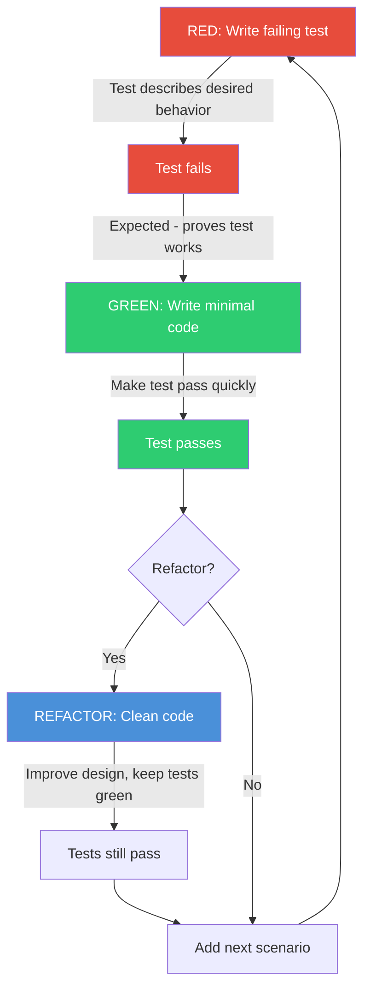
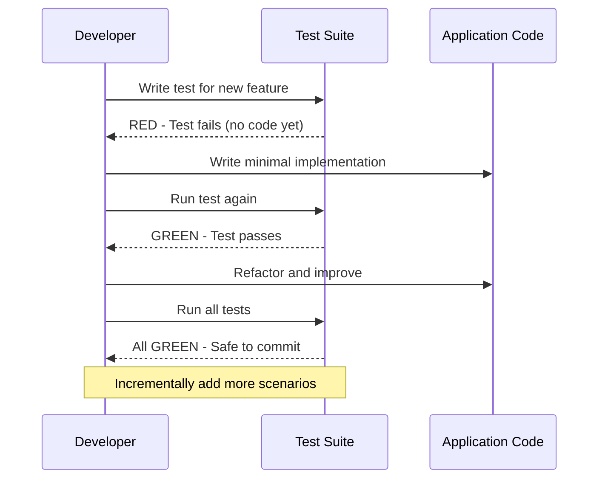

# Chapter 15: Test-Driven Development

## Learning Objectives

- Apply red-green-refactor cycle
- Design testable code
- Write tests before implementation
- Build features incrementally

---





## 15.1 TDD Cycle

```php
<?php
// 1. RED — Write a failing test
it('calculates discount for loyal customers', function () {
    $pricing = new PricingService();
    $result = $pricing->calculateDiscount(100.00, 'loyal');
    
    expect($result)->toBe(90.00); // 10% off
});

// 2. GREEN — Write minimal code to pass
class PricingService
{
    public function calculateDiscount(float $amount, string $tier): float
    {
        if ($tier === 'loyal') {
            return $amount * 0.9;
        }
        return $amount;
    }
}

// 3. REFACTOR — Improve code while tests pass
class PricingService
{
    private array $discounts = [
        'loyal' => 0.10,
        'vip' => 0.20,
        'wholesale' => 0.15,
    ];

    public function calculateDiscount(float $amount, string $tier): float
    {
        $discount = $this->discounts[$tier] ?? 0;
        return $amount * (1 - $discount);
    }
}

// Adding new feature
// 1. RED: Test higher discount tiers
it('gives VIP customers 20% off', function () {
    $pricing = new PricingService();
    expect($pricing->calculateDiscount(100.00, 'vip'))->toBe(80.00);
});

it('gives wholesale customers 15% off', function () {
    $pricing = new PricingService();
    expect($pricing->calculateDiscount(100.00, 'wholesale'))->toBe(85.00);
});

it('gives no discount for regular customers', function () {
    $pricing = new PricingService();
    expect($pricing->calculateDiscount(100.00, 'regular'))->toBe(100.00);
});

// 2. GREEN: Already passes with refactored code
// 3. REFACTOR: No changes needed
```

---

## 15.2 Exercises

1. Build a shopping cart using TDD (add item, remove item, calculate total)
2. Implement a user registration service with TDD
3. Create a validation rule engine with TDD
4. Refactor existing untested code with tests first

---

## Further Reading

- **Book:** "Test-Driven Development by Example" by Kent Beck
